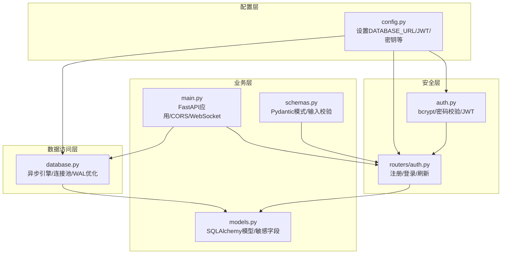
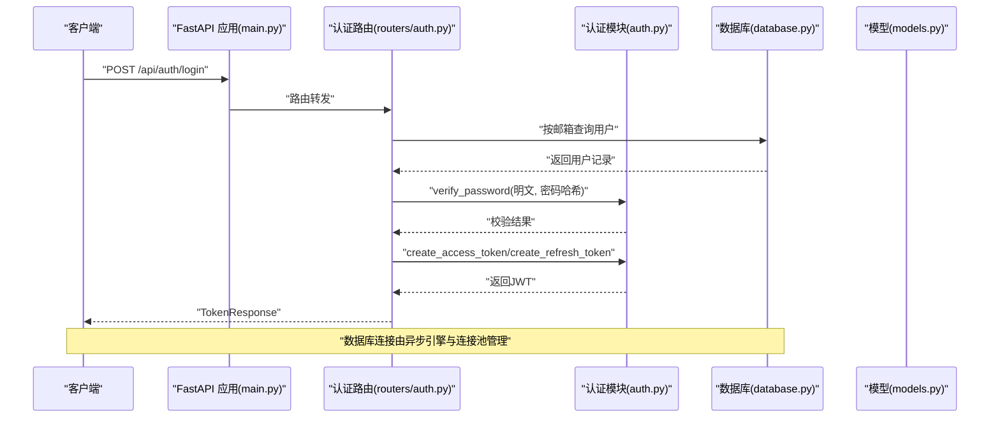
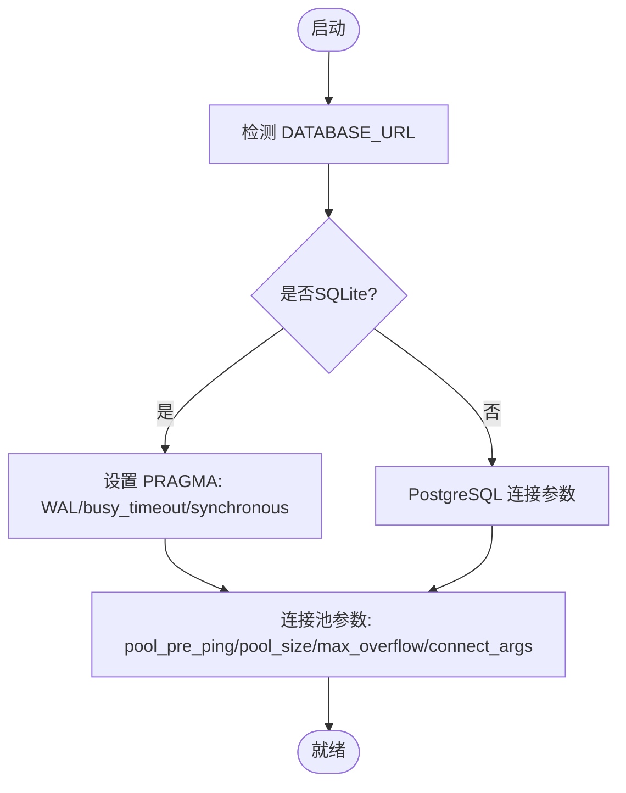
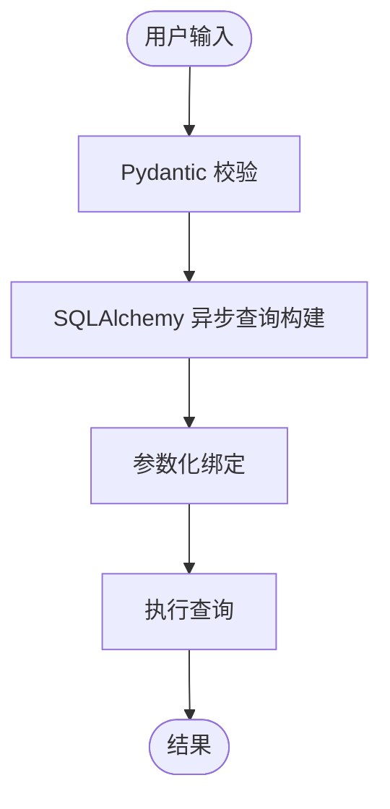
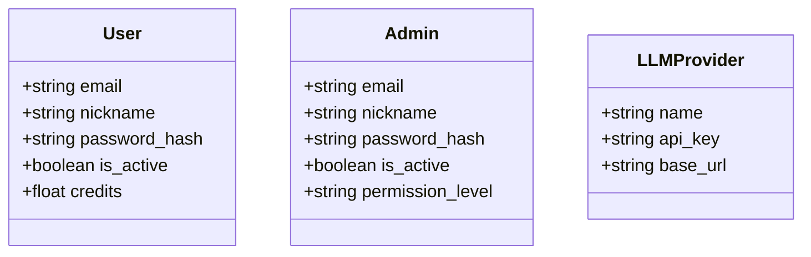
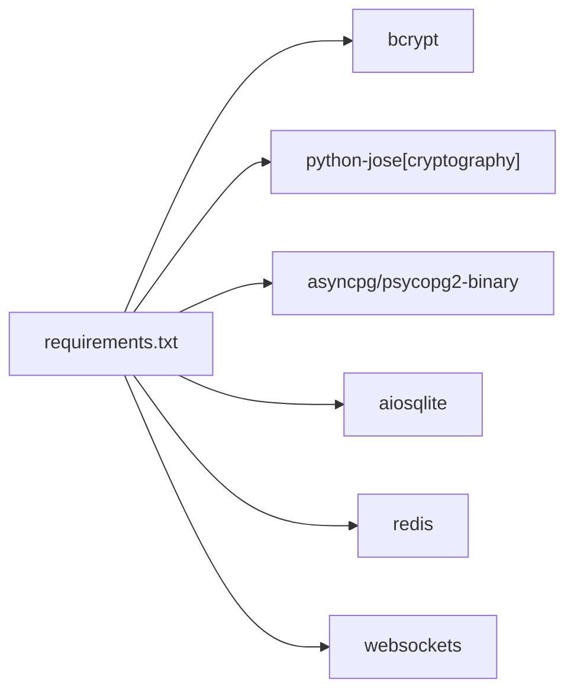

# 数据保护

<cite>
**本文引用的文件**
- [backend/config.py](file://backend/config.py)
- [backend/database.py](file://backend/database.py)
- [backend/main.py](file://backend/main.py)
- [backend/models.py](file://backend/models.py)
- [backend/auth.py](file://backend/auth.py)
- [backend/routers/auth.py](file://backend/routers/auth.py)
- [backend/schemas.py](file://backend/schemas.py)
- [backend/requirements.txt](file://backend/requirements.txt)
</cite>

## 目录
1. [简介](#简介)
2. [项目结构](#项目结构)
3. [核心组件](#核心组件)
4. [架构总览](#架构总览)
5. [详细组件分析](#详细组件分析)
6. [依赖分析](#依赖分析)
7. [性能考虑](#性能考虑)
8. [故障排查指南](#故障排查指南)
9. [结论](#结论)
10. [附录](#附录)

## 简介
本文件面向KunFlix后端系统的数据保护配置，围绕以下主题展开：数据库连接加密与连接池安全参数、SQL注入防护（ORM查询与参数化）、敏感数据脱敏策略（密码存储、API密钥管理、支付信息保护）、数据传输加密（HTTPS与WebSocket安全）、备份与恢复安全策略（加密备份与访问控制）、以及数据完整性验证与审计日志配置。文档以仓库现有实现为基础，结合最佳实践给出可操作建议。

## 项目结构
后端采用FastAPI + SQLAlchemy异步ORM + Pydantic数据模型的典型分层架构：
- 配置层：集中于配置类，加载环境变量，定义数据库URL、Redis、JWT、AI密钥等
- 数据访问层：异步引擎与会话工厂，SQLite/WAL优化与连接池参数
- 安全层：密码哈希、JWT签发与校验、认证依赖
- 业务路由层：用户注册/登录/刷新、鉴权依赖
- 数据模型层：Pydantic模式与SQLAlchemy模型，承载敏感字段设计

图表来源
- [backend/config.py:1-43](file://backend/config.py#L1-L43)
- [backend/database.py:1-45](file://backend/database.py#L1-L45)
- [backend/auth.py:1-229](file://backend/auth.py#L1-L229)
- [backend/routers/auth.py:1-136](file://backend/routers/auth.py#L1-L136)
- [backend/main.py:1-175](file://backend/main.py#L1-L175)
- [backend/models.py:1-503](file://backend/models.py#L1-L503)
- [backend/schemas.py:1-800](file://backend/schemas.py#L1-L800)

章节来源
- [backend/config.py:1-43](file://backend/config.py#L1-L43)
- [backend/database.py:1-45](file://backend/database.py#L1-L45)
- [backend/main.py:1-175](file://backend/main.py#L1-L175)

## 核心组件
- 数据库连接与连接池
  - 异步引擎与连接池参数：pool_pre_ping、pool_size、max_overflow、connect_args（SQLite）
  - SQLite WAL模式与busy_timeout、synchronous优化
- 密码与令牌
  - bcrypt哈希与校验；JWT签发与解码；OAuth2密码流
- 敏感数据模型
  - 用户与管理员密码字段、LLM Provider API Key字段
- 传输与会话
  - CORS中间件；WebSocket端点（当前为明文回显）

章节来源
- [backend/database.py:1-45](file://backend/database.py#L1-L45)
- [backend/auth.py:1-229](file://backend/auth.py#L1-L229)
- [backend/models.py:10-176](file://backend/models.py#L10-L176)
- [backend/main.py:130-172](file://backend/main.py#L130-L172)

## 架构总览
下图展示数据保护相关的关键交互：客户端通过受控CORS域访问API，后端使用bcrypt与JWT进行身份认证，数据库采用异步引擎与连接池，敏感数据在模型中以哈希或明文形式存储（API Key当前为明文）。

图表来源
- [backend/main.py:130-153](file://backend/main.py#L130-L153)
- [backend/routers/auth.py:63-99](file://backend/routers/auth.py#L63-L99)
- [backend/auth.py:23-75](file://backend/auth.py#L23-L75)
- [backend/database.py:9-19](file://backend/database.py#L9-L19)

## 详细组件分析

### 数据库连接加密与连接池安全参数
- 连接字符串与驱动
  - 默认使用SQLite（aiosqlite），开发友好；生产可切换PostgreSQL（asyncpg）
  - PostgreSQL连接字符串注释可见，便于替换
- 连接池与健康检查
  - pool_pre_ping：自动重连与健康检查
  - pool_size/max_overflow：控制并发与溢出连接
  - connect_args：SQLite特有超时与线程策略
- SQLite优化
  - WAL模式：提升并发读写，降低“database is locked”风险
  - busy_timeout与synchronous：平衡性能与一致性

图表来源
- [backend/database.py:9-31](file://backend/database.py#L9-L31)

章节来源
- [backend/config.py:14-16](file://backend/config.py#L14-L16)
- [backend/database.py:9-31](file://backend/database.py#L9-L31)

### SQL注入防护
- ORM查询与参数化
  - 使用SQLAlchemy异步查询（select/filter）构建，参数化绑定，避免原生SQL拼接
  - Pydantic模式对输入进行严格校验，减少异常分支
- 实践要点
  - 严禁动态拼接SQL字符串
  - 使用ORM过滤器与关联查询，避免手写WHERE子句
  - 对用户输入进行最小必要性校验与清洗

图表来源
- [backend/routers/auth.py:36-60](file://backend/routers/auth.py#L36-L60)
- [backend/schemas.py:13-26](file://backend/schemas.py#L13-L26)

章节来源
- [backend/routers/auth.py:36-99](file://backend/routers/auth.py#L36-L99)
- [backend/schemas.py:13-26](file://backend/schemas.py#L13-L26)

### 敏感数据脱敏策略
- 用户密码存储
  - bcrypt哈希存储，盐值由库生成；登录时比对哈希
  - 注册流程中对密码进行哈希后再入库
- API密钥管理
  - 当前模型中LLM Provider的api_key字段为明文存储
  - 建议：生产环境使用密钥管理系统（KMS）或加密存储，并在运行时解密
- 支付信息保护
  - 项目中未发现直接的支付表结构；如需接入支付，建议：
    - 仅存储不可逆的令牌或ID，不存储完整卡号/账号
    - 使用PCI DSS合规的支付网关，后端不接触敏感字段
- 其他敏感字段
  - 管理员表包含password_hash
  - 用户表包含password_hash
  - 登录IP与时间记录可用于审计

图表来源
- [backend/models.py:10-33](file://backend/models.py#L10-L33)
- [backend/models.py:35-73](file://backend/models.py#L35-L73)
- [backend/models.py:152-176](file://backend/models.py#L152-L176)

章节来源
- [backend/auth.py:19-25](file://backend/auth.py#L19-L25)
- [backend/routers/auth.py:51-59](file://backend/routers/auth.py#L51-L59)
- [backend/models.py:10-176](file://backend/models.py#L10-L176)

### 数据传输加密
- HTTPS配置
  - 当前未见TLS证书与HTTPS监听配置；建议在部署层（Nginx/反向代理/平台托管）启用TLS
  - 生产环境必须强制HTTPS，禁用明文HTTP
- WebSocket安全连接
  - 当前WebSocket端点未启用TLS；建议配合HTTPS与安全通道（如wss://）
  - 在路由层增加鉴权与速率限制，防止滥用

章节来源
- [backend/main.py:161-171](file://backend/main.py#L161-L171)

### 备份与恢复安全策略
- 加密备份
  - 数据库备份应加密存储；建议使用平台提供的加密备份服务或本地加密归档
- 访问控制
  - 备份文件权限最小化；仅授权运维人员访问
  - 备份介质与密钥分离存放
- 恢复演练
  - 定期进行恢复测试，验证备份完整性与可用性

（本节为通用指导，不直接分析具体文件）

### 审计日志与完整性验证
- 审计日志
  - 建议记录：登录尝试、失败原因、管理员操作、关键数据变更、WebSocket连接事件
  - 日志脱敏：避免记录完整密码、敏感头信息
- 完整性验证
  - 对关键操作引入幂等性与版本号
  - 使用数据库事务保证原子性，失败回滚

（本节为通用指导，不直接分析具体文件）

## 依赖分析
- 运行时依赖与安全相关要点
  - bcrypt：密码哈希
  - python-jose[cryptography]：JWT签名与验证
  - asyncpg/psycopg2-binary：PostgreSQL驱动
  - aiosqlite：SQLite驱动
  - redis：缓存与会话存储（注意生产需启用TLS与密码）
  - websockets：WebSocket支持

图表来源
- [backend/requirements.txt:1-29](file://backend/requirements.txt#L1-L29)

章节来源
- [backend/requirements.txt:1-29](file://backend/requirements.txt#L1-L29)

## 性能考虑
- 连接池
  - pool_pre_ping提升连接稳定性；pool_size与max_overflow需结合并发与数据库能力调优
- SQLite
  - WAL模式显著改善并发；busy_timeout与synchronous需在一致性与性能间权衡
- 日志
  - 关闭SQLAlchemy与Uvicorn访问日志可降低IO开销

章节来源
- [backend/database.py:9-31](file://backend/database.py#L9-L31)
- [backend/main.py:16-30](file://backend/main.py#L16-L30)

## 故障排查指南
- 数据库连接失败
  - 启动阶段带重试的连接检查；若为SQLite，确认WAL与超时参数生效
- 迁移失败
  - 提供迁移失败后的残留临时表清理与重试逻辑
- 认证失败
  - 核对JWT密钥、算法与过期时间；确认bcrypt哈希一致性

章节来源
- [backend/main.py:49-108](file://backend/main.py#L49-L108)
- [backend/auth.py:65-75](file://backend/auth.py#L65-L75)

## 结论
当前实现已具备基础数据保护能力：bcrypt密码存储、JWT鉴权、ORM参数化查询与连接池健康检查。建议在生产环境中补充：PostgreSQL TLS/连接参数、HTTPS与WebSocket安全通道、API Key加密存储、备份加密与访问控制、审计日志与完整性校验机制。以上改进将显著提升系统整体安全性与合规性。

## 附录
- 配置项与环境变量
  - DATABASE_URL：数据库连接串（默认SQLite，可切换PostgreSQL）
  - JWT_SECRET_KEY/ALGORITHM/EXPIRE：JWT密钥、算法与过期时间
  - 各类API Key：OPENAI/CLAUDE/GEMINI
- 安全加固清单
  - 强制HTTPS与安全WebSocket
  - API Key加密存储与轮换
  - 连接池与数据库TLS参数
  - 审计日志与异常监控
  - 定期备份与恢复演练

章节来源
- [backend/config.py:14-30](file://backend/config.py#L14-L30)
- [backend/requirements.txt:21-22](file://backend/requirements.txt#L21-L22)