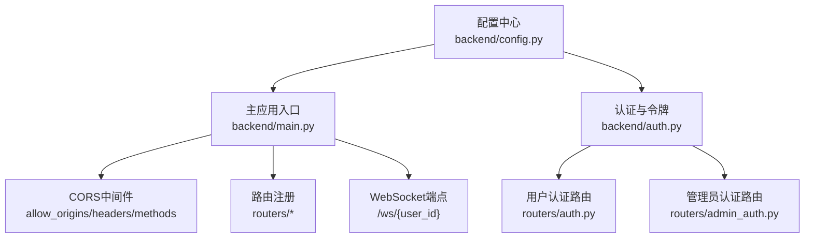
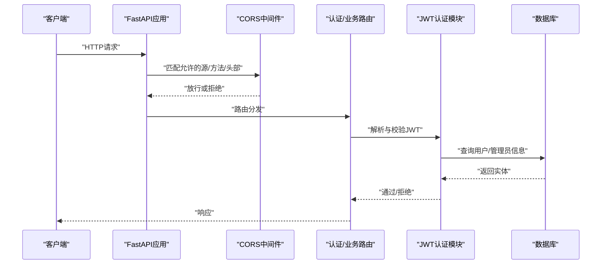
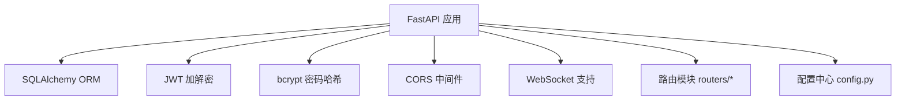

# 网络安全

<cite>
**本文引用的文件**
- [backend/main.py](file://backend/main.py)
- [backend/config.py](file://backend/config.py)
- [backend/auth.py](file://backend/auth.py)
- [backend/routers/auth.py](file://backend/routers/auth.py)
- [backend/routers/admin_auth.py](file://backend/routers/admin_auth.py)
- [backend/models.py](file://backend/models.py)
- [backend/requirements.txt](file://backend/requirements.txt)
</cite>

## 目录
1. [简介](#简介)
2. [项目结构](#项目结构)
3. [核心组件](#核心组件)
4. [架构总览](#架构总览)
5. [详细组件分析](#详细组件分析)
6. [依赖分析](#依赖分析)
7. [性能考虑](#性能考虑)
8. [故障排查指南](#故障排查指南)
9. [结论](#结论)
10. [附录](#附录)

## 简介
本文件面向KunFlix后端服务，提供一套完整的网络安全配置说明，涵盖CORS策略、API访问频率限制与防滥用机制、防火墙与流量控制、DDoS防护、WebSocket安全配置、IP白名单/黑名单管理，以及与安全扫描与入侵检测系统的集成建议。由于当前仓库中未发现专门的速率限制、防火墙或DDoS防护中间件与配置文件，本文在“实现现状”基础上，给出可落地的工程化建议与最佳实践，帮助在不侵入现有代码的前提下增强安全性。

## 项目结构
后端采用FastAPI框架，核心入口位于主程序文件，通过中间件与路由注册实现功能模块化；认证体系由独立的用户与管理员两套JWT流程构成；配置集中于设置类与环境变量文件。

图表来源
- [backend/main.py:110-175](file://backend/main.py#L110-L175)
- [backend/auth.py:1-229](file://backend/auth.py#L1-229)
- [backend/routers/auth.py:1-136](file://backend/routers/auth.py#L1-L136)
- [backend/routers/admin_auth.py:1-136](file://backend/routers/admin_auth.py#L1-L136)
- [backend/config.py:1-43](file://backend/config.py#L1-L43)

章节来源
- [backend/main.py:110-175](file://backend/main.py#L110-L175)
- [backend/config.py:1-43](file://backend/config.py#L1-L43)

## 核心组件
- CORS策略：在应用启动时注册CORSMiddleware，允许特定源、凭证、任意方法与头部。
- 认证与授权：基于JWT的用户与管理员双轨认证，支持刷新令牌与账户状态校验。
- WebSocket端点：提供基础的文本回显WebSocket通道，当前未实现握手验证与消息过滤。
- 配置中心：集中管理数据库、Redis、JWT密钥与算法、AI模型等运行参数。

章节来源
- [backend/main.py:130-136](file://backend/main.py#L130-L136)
- [backend/auth.py:30-75](file://backend/auth.py#L30-L75)
- [backend/routers/auth.py:63-99](file://backend/routers/auth.py#L63-L99)
- [backend/routers/admin_auth.py:36-90](file://backend/routers/admin_auth.py#L36-L90)
- [backend/config.py:26-30](file://backend/config.py#L26-L30)

## 架构总览
下图展示了从客户端到后端服务的关键交互路径，以及当前已实现的安全要素与待完善环节。

图表来源
- [backend/main.py:130-136](file://backend/main.py#L130-L136)
- [backend/auth.py:83-113](file://backend/auth.py#L83-L113)
- [backend/routers/auth.py:63-99](file://backend/routers/auth.py#L63-L99)
- [backend/routers/admin_auth.py:36-90](file://backend/routers/admin_auth.py#L36-L90)
- [backend/models.py:35-73](file://backend/models.py#L35-L73)

## 详细组件分析

### CORS策略配置
- 允许的源域名：当前配置为本地开发环境常用地址，生产环境应按需收紧。
- HTTP方法与头部：允许所有方法与头部，便于开发但可能带来风险，建议按需放行。
- 凭证：允许携带Cookie/Authorization头，注意跨域凭据的安全影响。

建议
- 生产环境将allow_origins限定为受信域名，并关闭通配符。
- 明确allow_methods与allow_headers，避免过度放行。
- 若启用credentials，Origin必须为具体域名而非通配符。

章节来源
- [backend/main.py:130-136](file://backend/main.py#L130-L136)

### API访问频率限制与防滥用机制
现状
- 仓库未发现专用的速率限制中间件或限流装饰器。
- 认证层具备基本的账户状态校验，但未见针对IP或令牌的限流策略。

实现建议
- 在路由层或全局中间件引入基于令牌或IP的滑动窗口/令牌桶限流。
- 对敏感端点（如登录、刷新）实施更严格的限流阈值。
- 结合Redis实现分布式限流，保障多实例部署一致性。
- 引入请求大小限制与超时控制，降低资源消耗。

章节来源
- [backend/routers/auth.py:63-99](file://backend/routers/auth.py#L63-L99)
- [backend/routers/admin_auth.py:36-90](file://backend/routers/admin_auth.py#L36-L90)

### 防火墙规则与流量控制
现状
- 未发现后端内置的防火墙或入/出站流量控制中间件。

实现建议
- 在反向代理层（如Nginx/Caddy）或平台防火墙设置入站/出站规则，限制来源IP与端口。
- 对高频异常IP实施临时阻断与日志审计。
- 与WAF（Web应用防火墙）联动，拦截常见攻击载荷。

章节来源
- [backend/main.py:173-175](file://backend/main.py#L173-L175)

### DDoS防护措施
现状
- 未发现专门的DDoS防护中间件或异常流量检测逻辑。

实现建议
- 反向代理层开启限速与连接数限制，识别并丢弃异常请求。
- 基于IP/UA/Referer进行黑白名单管理，动态封禁高风险来源。
- 集成DDoS清洗服务或CDN提供的DDoS防护能力。
- 对WebSocket与长连接实施心跳与并发限制，防止资源耗尽。

章节来源
- [backend/main.py:161-171](file://backend/main.py#L161-L171)

### WebSocket连接安全配置
现状
- WebSocket端点存在，但握手验证与消息过滤未实现，当前仅做文本回显。

建议
- 握手阶段：校验Origin、鉴权令牌、用户身份与会话有效性。
- 连接管理：限制每用户并发连接数、心跳间隔与消息大小。
- 消息过滤：对输入内容进行长度、类型与关键词过滤，防止注入与滥用。
- 安全传输：在反向代理层启用TLS终止与安全套件强化。

章节来源
- [backend/main.py:161-171](file://backend/main.py#L161-L171)

### IP白名单与黑名单管理
现状
- 未发现白/黑名单管理模块或中间件。

实现建议
- 在反向代理层维护白/黑名单，结合GeoIP限制来源地域。
- 后端可引入中间件在请求进入路由前进行IP判定与拦截。
- 与安全运营平台联动，实现自动封禁与解封流程。

章节来源
- [backend/main.py:130-136](file://backend/main.py#L130-L136)

### 安全扫描与入侵检测系统集成
现状
- 未发现与IDS/IPS或自动化扫描工具的集成。

实现建议
- 在CI/CD流水线中集成静态与依赖漏洞扫描。
- 在生产环境部署主机/网络IDS，结合日志分析与告警。
- 对关键接口进行渗透测试与API安全评估。

章节来源
- [backend/requirements.txt:1-29](file://backend/requirements.txt#L1-L29)

## 依赖分析
后端主要依赖FastAPI、SQLAlchemy、JWT、bcrypt等，为认证与数据访问提供基础能力；速率限制、防火墙与DDoS防护需通过中间件或平台层实现。

图表来源
- [backend/requirements.txt:1-29](file://backend/requirements.txt#L1-L29)
- [backend/main.py:130-136](file://backend/main.py#L130-L136)
- [backend/config.py:26-30](file://backend/config.py#L26-L30)

章节来源
- [backend/requirements.txt:1-29](file://backend/requirements.txt#L1-L29)
- [backend/main.py:130-136](file://backend/main.py#L130-L136)
- [backend/config.py:26-30](file://backend/config.py#L26-L30)

## 性能考虑
- CORS通配符与任意头部可能增加浏览器预检开销，建议在生产收敛为必要项。
- JWT解码与数据库查询为认证热点，建议缓存活跃令牌与用户状态，减少DB压力。
- WebSocket消息回显未做过滤，大量并发可能导致内存与带宽压力，应限制消息大小与速率。

## 故障排查指南
- CORS失败：检查allow_origins是否包含客户端Origin，确认是否携带凭据。
- 登录/刷新失败：核对JWT密钥、算法与过期时间配置，确认账户状态为激活。
- WebSocket异常：确认握手URL、客户端与服务端版本兼容性，检查反向代理TLS与升级头。

章节来源
- [backend/main.py:130-136](file://backend/main.py#L130-L136)
- [backend/auth.py:65-75](file://backend/auth.py#L65-L75)
- [backend/routers/auth.py:63-99](file://backend/routers/auth.py#L63-L99)
- [backend/routers/admin_auth.py:36-90](file://backend/routers/admin_auth.py#L36-L90)

## 结论
当前KunFlix后端已具备基础的CORS与JWT认证能力，但在生产环境中尚需补齐速率限制、防火墙、DDoS防护、WebSocket安全与IP黑白名单管理等关键安全设施。建议以平台层与中间件方式渐进式增强，确保不影响现有功能的同时提升整体安全性与稳定性。

## 附录
- 认证与授权流程要点
  - 用户与管理员分别使用独立的JWT主体类型，路由依赖函数按需选择。
  - 刷新令牌仅接受特定类型与主体类型，避免误用。
  - 账户状态校验贯穿登录与刷新流程，禁用账户将被拒绝。

章节来源
- [backend/auth.py:162-210](file://backend/auth.py#L162-L210)
- [backend/routers/auth.py:102-129](file://backend/routers/auth.py#L102-L129)
- [backend/routers/admin_auth.py:93-127](file://backend/routers/admin_auth.py#L93-L127)