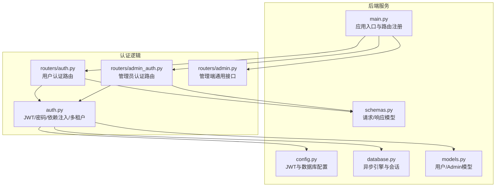
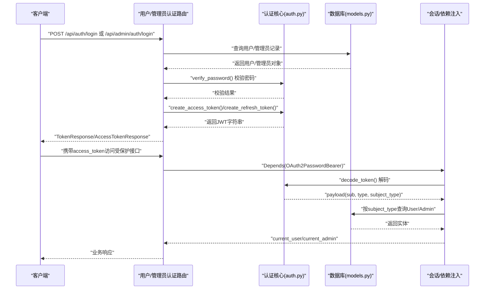
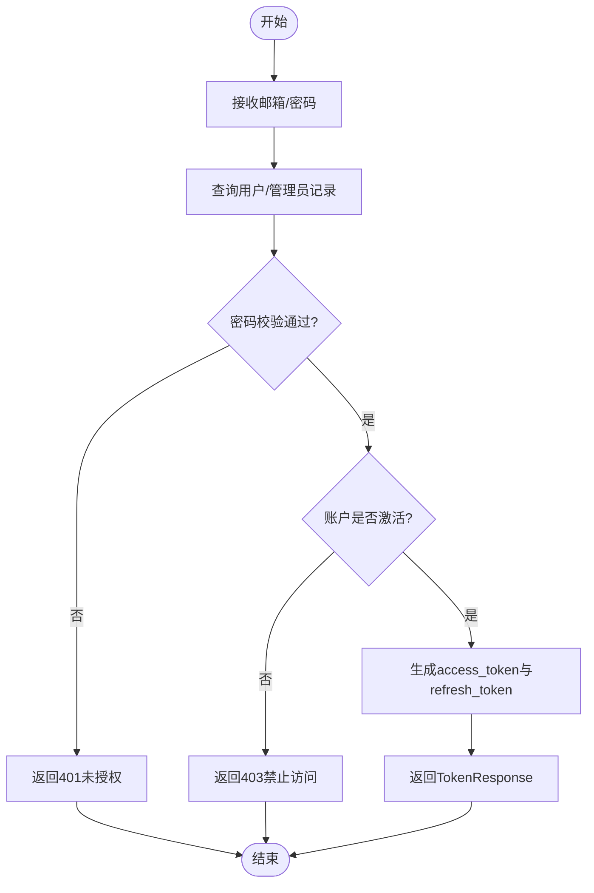
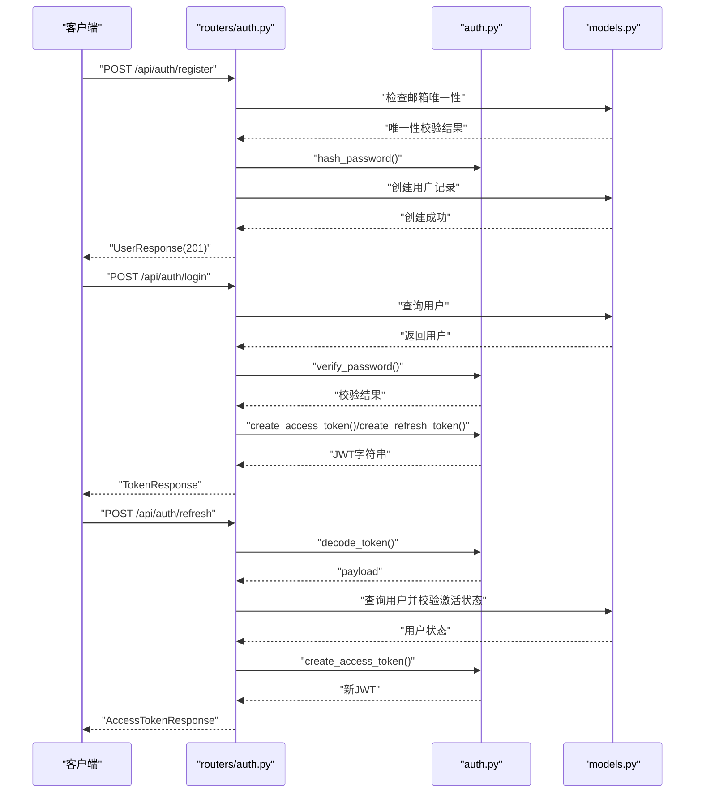
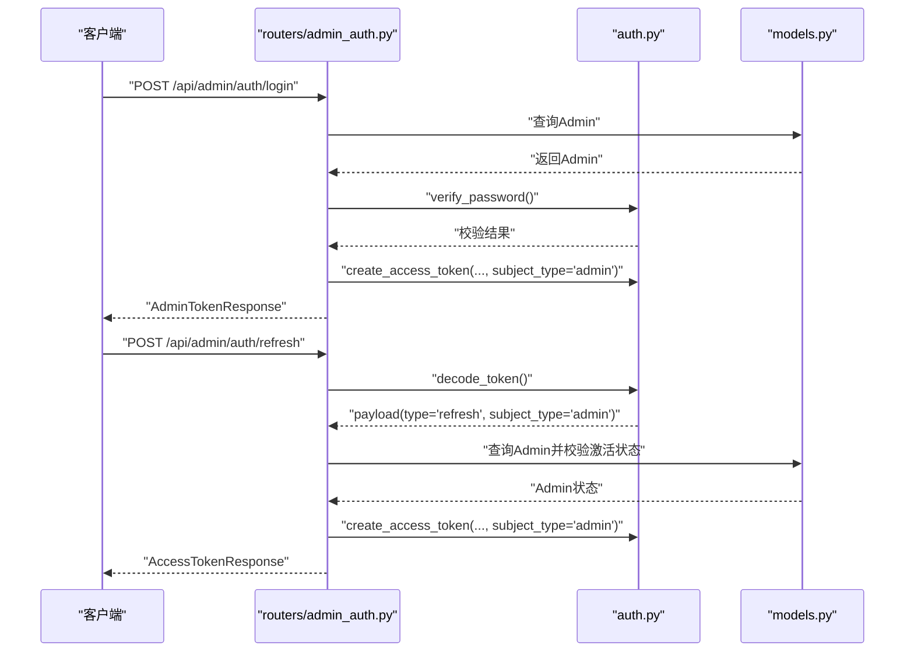
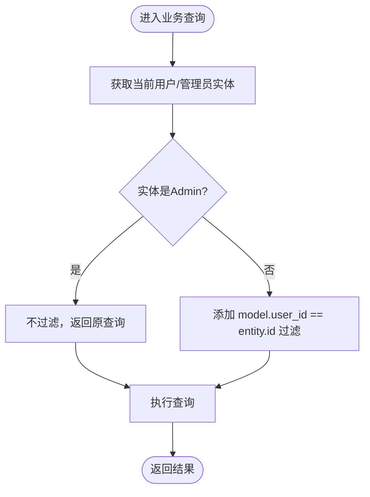
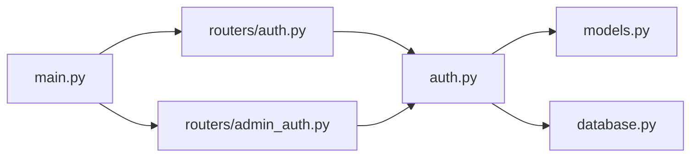

# 认证与授权

<cite>
**本文引用的文件**
- [auth.py](file://backend/auth.py)
- [routers/auth.py](file://backend/routers/auth.py)
- [routers/admin_auth.py](file://backend/routers/admin_auth.py)
- [models.py](file://backend/models.py)
- [schemas.py](file://backend/schemas.py)
- [config.py](file://backend/config.py)
- [database.py](file://backend/database.py)
- [main.py](file://backend/main.py)
- [routers/admin.py](file://backend/routers/admin.py)
</cite>

## 目录
1. [简介](#简介)
2. [项目结构](#项目结构)
3. [核心组件](#核心组件)
4. [架构总览](#架构总览)
5. [详细组件分析](#详细组件分析)
6. [依赖分析](#依赖分析)
7. [性能考量](#性能考量)
8. [故障排查指南](#故障排查指南)
9. [结论](#结论)
10. [附录](#附录)

## 简介
本文件面向Infinite Game项目的认证与授权系统，围绕以下目标展开：
- 详解JWT令牌的创建、验证与刷新机制，明确访问令牌与刷新令牌的用途与有效期。
- 解释用户认证流程，包括bcrypt密码哈希与验证过程。
- 描述管理员认证系统，包括独立的admins表与管理员身份提取逻辑。
- 说明多租户查询隔离机制，确保用户只能访问自己的数据。
- 提供OAuth2密码流的实现细节与安全建议。
- 总结令牌过期处理、权限提升与会话管理的最佳实践。

## 项目结构
认证与授权相关的核心代码分布在以下模块：
- 后端服务入口与路由注册：main.py
- 认证核心逻辑：auth.py
- 用户认证路由：routers/auth.py
- 管理员认证路由：routers/admin_auth.py
- 数据模型：models.py
- 请求/响应模型：schemas.py
- 配置项：config.py
- 数据库连接与会话：database.py
- 管理端通用接口：routers/admin.py

图表来源
- [main.py:138-153](file://backend/main.py#L138-L153)
- [auth.py:19-229](file://backend/auth.py#L19-L229)
- [routers/auth.py:1-136](file://backend/routers/auth.py#L1-L136)
- [routers/admin_auth.py:1-136](file://backend/routers/admin_auth.py#L1-L136)
- [models.py:10-73](file://backend/models.py#L10-L73)
- [config.py:26-30](file://backend/config.py#L26-L30)
- [database.py:9-45](file://backend/database.py#L9-L45)
- [schemas.py:13-111](file://backend/schemas.py#L13-L111)

章节来源
- [main.py:138-153](file://backend/main.py#L138-L153)
- [config.py:26-30](file://backend/config.py#L26-L30)
- [database.py:9-45](file://backend/database.py#L9-L45)

## 核心组件
- JWT与密码处理：bcrypt哈希、访问/刷新令牌生成、令牌解码与校验。
- FastAPI依赖注入：OAuth2PasswordBearer、用户/管理员当前会话解析、活跃状态校验。
- 多租户隔离：通过实体类型判断与查询过滤，确保用户只能访问自身数据。
- 用户与管理员认证路由：注册、登录、刷新、个人信息查询。
- 配置：JWT密钥、算法、访问令牌有效期、刷新令牌有效期。

章节来源
- [auth.py:19-229](file://backend/auth.py#L19-L229)
- [routers/auth.py:36-136](file://backend/routers/auth.py#L36-L136)
- [routers/admin_auth.py:36-136](file://backend/routers/admin_auth.py#L36-L136)
- [models.py:10-73](file://backend/models.py#L10-L73)
- [config.py:26-30](file://backend/config.py#L26-L30)

## 架构总览
认证与授权的整体流程如下：
- 用户通过OAuth2密码流提交邮箱与密码，服务端验证后签发访问令牌与刷新令牌。
- 访问令牌用于受保护接口的请求；当过期时使用刷新令牌换取新的访问令牌。
- 管理员拥有独立的admins表与独立的身份提取逻辑，支持subject_type区分用户与管理员。
- 多租户查询隔离通过scoped_query在SQL层进行row-level过滤，确保用户只能看到自己的数据。

图表来源
- [routers/auth.py:63-99](file://backend/routers/auth.py#L63-L99)
- [routers/admin_auth.py:36-90](file://backend/routers/admin_auth.py#L36-L90)
- [auth.py:83-156](file://backend/auth.py#L83-L156)
- [models.py:10-73](file://backend/models.py#L10-L73)

## 详细组件分析

### JWT令牌体系与OAuth2密码流
- 令牌类型与用途
  - 访问令牌(access): 用于访问受保护接口，短期有效。
  - 刷新令牌(refresh): 用于在访问令牌过期后换取新的访问令牌，长期有效但不直接访问资源。
- 令牌载荷与声明
  - sub: 主体ID（用户ID或管理员ID）
  - type: "access"或"refresh"
  - role: 角色标识（用户为"user"，管理员为"admin"）
  - subject_type: "user"或"admin"，用于区分查询哪张表
  - exp: 过期时间
- 生成与验证
  - 访问令牌：基于配置中的ACCESS_TOKEN_EXPIRE_MINUTES计算过期时间。
  - 刷新令牌：基于配置中的REFRESH_TOKEN_EXPIRE_DAYS计算过期时间。
  - 解码失败或过期将抛出401未授权异常。
- OAuth2密码流
  - 客户端向/token端点发送邮箱与密码。
  - 服务端验证凭据，若成功则签发access_token与refresh_token。
  - 客户端后续请求在Authorization头中携带Bearer token。

图表来源
- [routers/auth.py:63-99](file://backend/routers/auth.py#L63-L99)
- [routers/admin_auth.py:36-90](file://backend/routers/admin_auth.py#L36-L90)
- [auth.py:30-62](file://backend/auth.py#L30-L62)
- [auth.py:65-74](file://backend/auth.py#L65-L74)

章节来源
- [auth.py:30-62](file://backend/auth.py#L30-L62)
- [auth.py:65-74](file://backend/auth.py#L65-L74)
- [routers/auth.py:63-99](file://backend/routers/auth.py#L63-L99)
- [routers/admin_auth.py:36-90](file://backend/routers/admin_auth.py#L36-L90)
- [config.py:26-30](file://backend/config.py#L26-L30)

### 密码哈希与验证（bcrypt）
- 哈希
  - 使用bcrypt对明文密码进行哈希，成本因子为12。
- 验证
  - 使用bcrypt.checkpw对比明文与存储的哈希值。
- 安全性
  - bcrypt具备抗暴力破解能力，适合生产环境使用。

章节来源
- [auth.py:19-24](file://backend/auth.py#L19-L24)
- [routers/auth.py:51-59](file://backend/routers/auth.py#L51-L59)

### 用户认证流程
- 注册
  - 校验邮箱唯一性，生成password_hash，创建用户记录。
- 登录
  - 校验邮箱存在与密码正确，检查账户是否激活，更新登录元数据，签发access_token与refresh_token。
- 刷新
  - 校验refresh_token类型为"refresh"，查询用户并确认账户激活状态，签发新的access_token。
- 个人信息
  - 通过当前已认证用户依赖获取个人信息。

图表来源
- [routers/auth.py:36-136](file://backend/routers/auth.py#L36-L136)
- [auth.py:19-62](file://backend/auth.py#L19-L62)
- [models.py:35-73](file://backend/models.py#L35-L73)

章节来源
- [routers/auth.py:36-136](file://backend/routers/auth.py#L36-L136)
- [auth.py:19-62](file://backend/auth.py#L19-L62)
- [models.py:35-73](file://backend/models.py#L35-L73)

### 管理员认证系统
- 独立admins表
  - 管理员拥有独立的Admin模型，包含邮箱、昵称、密码哈希、权限等级、积分余额等字段。
- 登录与刷新
  - 登录时subject_type设为"admin"，签发access_token与refresh_token。
  - 刷新时要求token类型为"refresh"且subject_type为"admin"。
- 当前管理员依赖
  - get_current_admin与get_current_active_admin分别提取与校验管理员身份与活跃状态。
- 管理端通用接口
  - 管理员可访问后台统计、用户管理、积分调整等接口。

图表来源
- [routers/admin_auth.py:36-136](file://backend/routers/admin_auth.py#L36-L136)
- [auth.py:119-156](file://backend/auth.py#L119-L156)
- [models.py:10-33](file://backend/models.py#L10-L33)

章节来源
- [routers/admin_auth.py:36-136](file://backend/routers/admin_auth.py#L36-L136)
- [auth.py:119-156](file://backend/auth.py#L119-L156)
- [models.py:10-33](file://backend/models.py#L10-L33)

### 多租户查询隔离机制
- 实体类型判断
  - is_admin_entity通过类名判断是否为Admin实体。
- 查询过滤
  - scoped_query根据实体类型决定是否添加user_id过滤条件：
    - 管理员实体：不过滤，可查看全部数据。
    - 普通用户实体：添加model.user_id == entity.id过滤，确保数据隔离。
- 使用场景
  - 在各业务路由中对查询进行包装，以实现row-level隔离。

图表来源
- [auth.py:216-229](file://backend/auth.py#L216-L229)
- [routers/admin.py:53-135](file://backend/routers/admin.py#L53-L135)

章节来源
- [auth.py:216-229](file://backend/auth.py#L216-L229)
- [routers/admin.py:53-135](file://backend/routers/admin.py#L53-L135)

### 依赖注入与会话管理
- OAuth2PasswordBearer
  - 通过tokenUrl指向登录端点，自动从Authorization头中提取Bearer token。
- 当前用户/管理员依赖
  - get_current_user/get_current_active_user：校验access token并加载User。
  - get_current_admin/get_current_active_admin：校验access token并加载Admin。
  - get_current_user_or_admin：根据subject_type动态选择User/Admin。
- 会话生命周期
  - 访问令牌短期有效，刷新令牌长期有效，结合前端策略实现无感续期。
  - 建议在浏览器端安全存储refresh_token，仅在内存中持有access_token。

章节来源
- [auth.py:80-211](file://backend/auth.py#L80-L211)
- [routers/auth.py:132-136](file://backend/routers/auth.py#L132-L136)
- [routers/admin_auth.py:130-136](file://backend/routers/admin_auth.py#L130-L136)

### 配置与安全要点
- JWT配置
  - JWT_SECRET_KEY：必须在生产环境使用强随机密钥。
  - JWT_ALGORITHM：HS256。
  - ACCESS_TOKEN_EXPIRE_MINUTES：默认30分钟。
  - REFRESH_TOKEN_EXPIRE_DAYS：默认7天。
- 数据库与Redis
  - 默认SQLite（开发友好），可切换PostgreSQL。
  - Redis用于缓存与会话（如需）。
- 安全建议
  - 强制HTTPS传输，避免明文泄露。
  - 严格限制CORS白名单。
  - 前端仅在内存中保存access_token，refresh_token放入安全存储。
  - 定期轮换JWT_SECRET_KEY。

章节来源
- [config.py:26-30](file://backend/config.py#L26-L30)
- [main.py:130-136](file://backend/main.py#L130-L136)

## 依赖分析
- 模块耦合
  - routers/auth.py与routers/admin_auth.py均依赖auth.py提供的JWT与依赖注入函数。
  - auth.py依赖models.py的User/Admin模型与database.py的AsyncSession。
  - main.py负责注册路由与中间件，间接影响认证链路。
- 外部依赖
  - FastAPI OAuth2PasswordBearer用于OAuth2密码流。
  - python-jose用于JWT编码/解码。
  - bcrypt用于密码哈希与校验。
  - SQLAlchemy异步ORM用于数据访问。

图表来源
- [routers/auth.py:8-26](file://backend/routers/auth.py#L8-L26)
- [routers/admin_auth.py:9-25](file://backend/routers/admin_auth.py#L9-L25)
- [auth.py:11-12](file://backend/auth.py#L11-L12)
- [main.py:139-153](file://backend/main.py#L139-L153)

章节来源
- [routers/auth.py:8-26](file://backend/routers/auth.py#L8-L26)
- [routers/admin_auth.py:9-25](file://backend/routers/admin_auth.py#L9-L25)
- [auth.py:11-12](file://backend/auth.py#L11-L12)
- [main.py:139-153](file://backend/main.py#L139-L153)

## 性能考量
- 数据库连接
  - 异步引擎与连接池配置，SQLite启用WAL模式降低锁冲突。
- 令牌生成与校验
  - bcrypt成本因子为12，平衡安全性与性能；可按硬件能力调整。
  - JWT解码为O(1)，性能开销极低。
- 查询隔离
  - scoped_query仅增加一次布尔判断与一次过滤条件拼接，对性能影响可忽略。

章节来源
- [database.py:9-31](file://backend/database.py#L9-L31)
- [auth.py:19-24](file://backend/auth.py#L19-L24)
- [auth.py:221-229](file://backend/auth.py#L221-L229)

## 故障排查指南
- 401未授权
  - 可能原因：令牌无效、过期、类型错误、subject_type不匹配。
  - 排查步骤：确认tokenUrl正确、Authorization头格式为Bearer、刷新令牌类型为"refresh"且subject_type为"admin"。
- 403禁止访问
  - 可能原因：账户被禁用。
  - 排查步骤：检查User/Admin的is_active字段。
- 邮箱重复
  - 可能原因：注册时邮箱已存在。
  - 排查步骤：更换邮箱或引导用户登录。
- 数据越权
  - 可能原因：未对查询应用scoped_query。
  - 排查步骤：确认业务查询已通过scoped_query进行row-level过滤。

章节来源
- [routers/auth.py:43-59](file://backend/routers/auth.py#L43-L59)
- [routers/auth.py:78-83](file://backend/routers/auth.py#L78-L83)
- [routers/admin_auth.py:50-71](file://backend/routers/admin_auth.py#L50-L71)
- [auth.py:221-229](file://backend/auth.py#L221-L229)

## 结论
Infinite Game的认证与授权系统采用清晰的分层设计：
- 用户与管理员分离的独立表结构，配合subject_type实现统一的令牌解析。
- bcrypt保证密码安全，JWT提供短期访问令牌与长期刷新令牌。
- 多租户隔离通过row-level过滤实现，确保数据边界。
- OAuth2密码流与FastAPI依赖注入使接入简单、可维护性强。
建议在生产环境中强化密钥管理、传输加密与前端存储策略，并持续监控与审计登录与操作行为。

## 附录
- 请求/响应模型
  - 用户注册：UserRegister
  - 用户登录：UserLogin
  - 管理员登录：AdminLogin
  - 令牌刷新：TokenRefresh
  - 登录响应：TokenResponse、AdminTokenResponse
  - 访问令牌响应：AccessTokenResponse
  - 用户信息：UserResponse、AdminResponse

章节来源
- [schemas.py:13-111](file://backend/schemas.py#L13-L111)