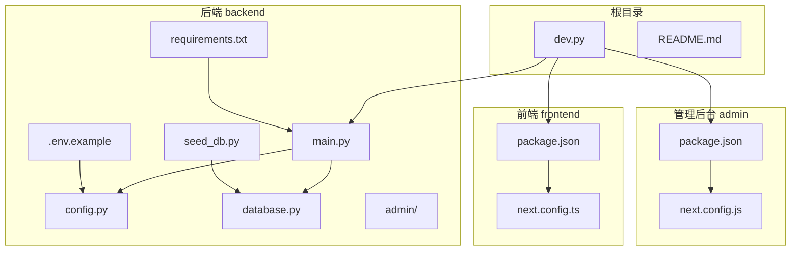
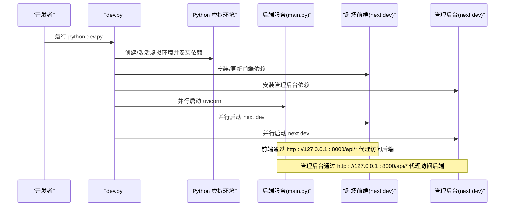
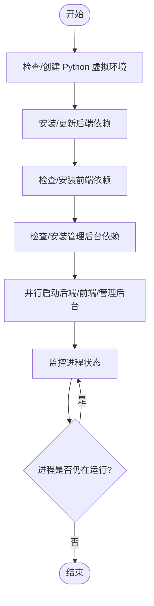
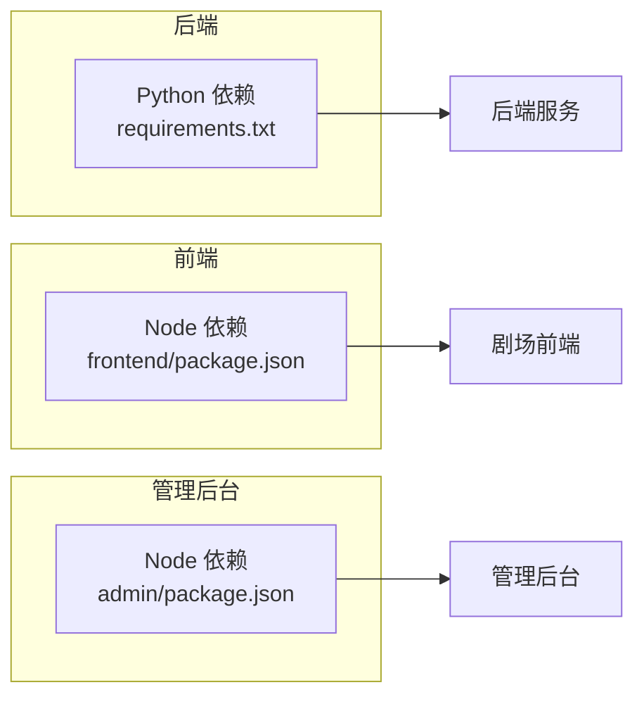

# 开发环境搭建

<cite>
**本文引用的文件**
- [dev.py](file://dev.py)
- [README.md](file://README.md)
- [backend/requirements.txt](file://backend/requirements.txt)
- [backend/main.py](file://backend/main.py)
- [backend/config.py](file://backend/config.py)
- [backend/.env.example](file://backend/.env.example)
- [backend/database.py](file://backend/database.py)
- [backend/seed_db.py](file://backend/seed_db.py)
- [backend/admin/package.json](file://backend/admin/package.json)
- [frontend/package.json](file://frontend/package.json)
- [frontend/next.config.ts](file://frontend/next.config.ts)
- [backend/admin/next.config.js](file://backend/admin/next.config.js)
</cite>

## 目录
1. [简介](#简介)
2. [项目结构](#项目结构)
3. [核心组件](#核心组件)
4. [架构总览](#架构总览)
5. [详细组件分析](#详细组件分析)
6. [依赖关系分析](#依赖关系分析)
7. [性能考虑](#性能考虑)
8. [故障排查指南](#故障排查指南)
9. [结论](#结论)
10. [附录](#附录)

## 简介
本文件面向首次参与 KunFlix（KunFlix）项目的开发者，提供从零搭建本地开发环境的完整指南。内容覆盖：
- Python 虚拟环境创建与依赖安装
- Node.js 环境准备与前端依赖安装
- Windows 与 Linux/macOS 的具体安装步骤
- dev.py 脚本工作原理与并行启动机制
- 环境变量、数据库与 AI 服务密钥的正确配置
- 常见安装问题的排查与解决方法

## 项目结构
项目采用前后端分离架构，包含后端 API 服务、剧场前端客户端、以及管理后台（Admin Dashboard）。开发时可通过 dev.py 一键启动三端服务。

图表来源
- [dev.py:1-169](file://dev.py#L1-L169)
- [backend/main.py:1-175](file://backend/main.py#L1-L175)
- [backend/config.py:1-43](file://backend/config.py#L1-L43)
- [backend/database.py:1-45](file://backend/database.py#L1-L45)
- [backend/seed_db.py:1-64](file://backend/seed_db.py#L1-L64)
- [backend/requirements.txt:1-29](file://backend/requirements.txt#L1-L29)
- [backend/.env.example:1-4](file://backend/.env.example#L1-L4)
- [frontend/package.json:1-94](file://frontend/package.json#L1-L94)
- [frontend/next.config.ts:1-21](file://frontend/next.config.ts#L1-L21)
- [backend/admin/package.json:1-73](file://backend/admin/package.json#L1-L73)
- [backend/admin/next.config.js:1-15](file://backend/admin/next.config.js#L1-L15)

章节来源
- [README.md:63-79](file://README.md#L63-L79)
- [dev.py:1-169](file://dev.py#L1-L169)

## 核心组件
- 后端 API 服务：基于 FastAPI + Uvicorn，提供异步接口、数据库连接、路由注册与中间件配置。
- 剧场前端客户端：Next.js 16 应用，通过反向代理访问后端 API。
- 管理后台：独立的 Next.js 应用，端口 3001，同样通过反向代理访问后端。
- 开发脚本：dev.py 统一负责虚拟环境、依赖安装与三端并行启动。

章节来源
- [backend/main.py:110-154](file://backend/main.py#L110-L154)
- [frontend/next.config.ts:10-17](file://frontend/next.config.ts#L10-L17)
- [backend/admin/next.config.js:4-11](file://backend/admin/next.config.js#L4-L11)
- [dev.py:94-169](file://dev.py#L94-L169)

## 架构总览
下图展示开发环境的启动顺序与服务间通信：

图表来源
- [dev.py:94-169](file://dev.py#L94-L169)
- [backend/main.py:156-175](file://backend/main.py#L156-L175)
- [frontend/next.config.ts:10-17](file://frontend/next.config.ts#L10-L17)
- [backend/admin/next.config.js:4-11](file://backend/admin/next.config.js#L4-L11)

## 详细组件分析

### 1) Python 虚拟环境与后端依赖
- 虚拟环境位置：backend/venv
- 依赖清单：backend/requirements.txt
- 启动方式：dev.py 自动创建并安装；也可手动执行 venv 激活与 pip 安装
- 数据库与配置：默认使用 SQLite（开发友好），可通过 .env 切换 PostgreSQL

章节来源
- [dev.py:25-42](file://dev.py#L25-L42)
- [backend/requirements.txt:1-29](file://backend/requirements.txt#L1-L29)
- [backend/config.py:15](file://backend/config.py#L15)
- [backend/.env.example:1-4](file://backend/.env.example#L1-L4)

### 2) Node.js 环境与前端依赖
- 前端：frontend/package.json 定义了开发脚本与依赖
- 管理后台：backend/admin/package.json 定义了独立的开发脚本与依赖
- 代理配置：前后端均通过 next.config.* 将 /api/* 代理到后端 8000 端口

章节来源
- [frontend/package.json:5-12](file://frontend/package.json#L5-L12)
- [backend/admin/package.json:5-10](file://backend/admin/package.json#L5-L10)
- [frontend/next.config.ts:10-17](file://frontend/next.config.ts#L10-L17)
- [backend/admin/next.config.js:4-11](file://backend/admin/next.config.js#L4-L11)

### 3) dev.py 脚本工作原理
- 环境检测与创建
  - 自动检测 backend/venv 是否存在，不存在则创建
  - 安装 requirements.txt 中的 Python 依赖
  - 安装 frontend 与 backend/admin 的 Node 依赖
- 并行启动
  - 后端：使用 uvicorn 启动 main:app，开启热更新与 asyncio 循环策略
  - 前端：npm run dev（端口 3000）
  - 管理后台：npm run dev（端口 3001）
- 进程管理
  - 子进程实时输出日志
  - 支持 Ctrl+C 清理所有子进程

图表来源
- [dev.py:25-169](file://dev.py#L25-L169)

章节来源
- [dev.py:16-169](file://dev.py#L16-L169)

### 4) 环境变量与配置
- 后端配置项
  - 数据库：DATABASE_URL（默认 SQLite，可切换 PostgreSQL）
  - 缓存：REDIS_URL
  - AI 服务密钥：OPENAI_API_KEY、CLAUDE_API_KEY、GEMINI_API_KEY
  - JWT：JWT_SECRET_KEY、JWT_ALGORITHM、过期时间
  - 生成设置：STORY_GENERATION_MODEL、IMAGE_GENERATION_MODEL
  - 系统开关：RUN_MIGRATIONS
- 示例文件：backend/.env.example
- 加载机制：pydantic-settings 从 .env 文件加载

章节来源
- [backend/config.py:7-42](file://backend/config.py#L7-L42)
- [backend/.env.example:1-4](file://backend/.env.example#L1-L4)

### 5) 数据库初始化与种子数据
- 数据库引擎：SQLAlchemy 异步 + 连接池优化（SQLite WAL 模式）
- 初始化流程：dev.py 启动后，后端在 lifespan 中尝试迁移与加载配置
- 种子数据：seed_db.py 创建默认 LLM 提供商与超级管理员

章节来源
- [backend/database.py:9-31](file://backend/database.py#L9-L31)
- [backend/main.py:49-108](file://backend/main.py#L49-L108)
- [backend/seed_db.py:21-57](file://backend/seed_db.py#L21-L57)

### 6) 访问地址与端口
- 剧场前端：http://localhost:3000
- 管理后台：http://localhost:3001
- 后端 API：http://localhost:8000
- API 文档：http://localhost:8000/docs

章节来源
- [README.md:131-135](file://README.md#L131-L135)

## 依赖关系分析
- 后端依赖：FastAPI、Uvicorn、SQLAlchemy、Pydantic、asyncpg/aiosqlite、Redis、AI SDK（OpenAI、Google、xAI）、Alembic、bcrypt、dotenv 等
- 前端依赖：Next.js、Ant Design、Radix UI、Tiptap、React 生态、Tailwind CSS、Zustand、Socket.IO 客户端等
- 管理后台依赖：Next.js、Ant Design、Radix UI、Recharts、Axios、Zod 等

图表来源
- [backend/requirements.txt:1-29](file://backend/requirements.txt#L1-L29)
- [frontend/package.json:13-70](file://frontend/package.json#L13-L70)
- [backend/admin/package.json:11-49](file://backend/admin/package.json#L11-L49)

章节来源
- [backend/requirements.txt:1-29](file://backend/requirements.txt#L1-L29)
- [frontend/package.json:13-70](file://frontend/package.json#L13-L70)
- [backend/admin/package.json:11-49](file://backend/admin/package.json#L11-L49)

## 性能考虑
- 数据库连接池：后端使用连接池与 pre_ping，SQLite 在 WAL 模式下提升并发能力
- 启动重试：后端 lifespan 对数据库连接失败进行有限次重试
- 代理与缓存：前端/管理后台通过反向代理减少跨域与网络往返
- 热更新排除：dev.py 排除 active_skills 目录以避免不必要的重启

章节来源
- [backend/database.py:9-31](file://backend/database.py#L9-L31)
- [backend/main.py:49-97](file://backend/main.py#L49-L97)
- [dev.py:116-117](file://dev.py#L116-L117)

## 故障排查指南
- 依赖冲突
  - 症状：pip/npm 安装报错或版本不兼容
  - 处理：优先使用 dev.py 统一安装；若手动安装，确保 Python 3.10+、Node.js 20+
- 端口占用
  - 症状：端口 8000/3000/3001 被占用
  - 处理：释放对应端口或调整 next.config.* 或 dev.py 中的端口配置
- 权限问题（Linux/macOS）
  - 症状：无法创建 venv 或写入数据库文件
  - 处理：确认当前用户对项目目录具有读写权限；必要时使用 sudo（不推荐）
- 数据库连接失败
  - 症状：后端启动时报数据库连接错误
  - 处理：检查 DATABASE_URL；若使用 PostgreSQL，请确保服务已启动且凭据正确；若使用 SQLite，请确认路径可写
- AI 服务密钥无效
  - 症状：调用相关接口返回鉴权错误
  - 处理：在 .env 中填写有效密钥，并重启后端服务
- 管理后台无法访问 /api
  - 症状：浏览器 Network 面板显示 404 或 CORS 错误
  - 处理：确认管理后台 next.config.js 的 /api 代理指向 http://127.0.0.1:8000/api/*

章节来源
- [backend/config.py:15](file://backend/config.py#L15)
- [backend/.env.example:1-4](file://backend/.env.example#L1-L4)
- [backend/admin/next.config.js:4-11](file://backend/admin/next.config.js#L4-L11)
- [frontend/next.config.ts:10-17](file://frontend/next.config.ts#L10-L17)

## 结论
通过 dev.py 脚本，开发者可以一键完成 Python 与 Node.js 环境准备、依赖安装与三端并行启动。建议在本地开发时：
- 使用 dev.py 启动，避免手工配置遗漏
- 正确配置 .env 与数据库连接
- 遇到问题先查看 dev.py 输出的日志，再结合各组件的配置文件定位

## 附录

### A. 平台安装步骤（Windows）
- 系统要求
  - Python 3.10+
  - Node.js 20+
  - SQLite（开发环境）/ PostgreSQL（生产环境）
- 步骤
  1) 克隆项目并进入根目录
  2) 运行 python dev.py
  3) 浏览器访问 http://localhost:3000、http://localhost:3001、http://localhost:8000/docs

章节来源
- [README.md:85-129](file://README.md#L85-L129)
- [dev.py:94-169](file://dev.py#L94-L169)

### B. 平台安装步骤（Linux/macOS）
- 系统要求
  - Python 3.10+
  - Node.js 20+
  - SQLite（开发环境）/ PostgreSQL（生产环境）
- 步骤
  1) 克隆项目并进入根目录
  2) 运行 python dev.py
  3) 浏览器访问 http://localhost:3000、http://localhost:3001、http://localhost:8000/docs

章节来源
- [README.md:85-129](file://README.md#L85-L129)
- [dev.py:94-169](file://dev.py#L94-L169)

### C. 环境变量与数据库配置要点
- .env 示例字段
  - OPENAI_API_KEY
  - DATABASE_URL（默认 SQLite，可改为 PostgreSQL）
  - REDIS_URL
- 数据库选择
  - 开发：SQLite（无需额外服务）
  - 生产：PostgreSQL（需自行部署）

章节来源
- [backend/.env.example:1-4](file://backend/.env.example#L1-L4)
- [backend/config.py:15](file://backend/config.py#L15)