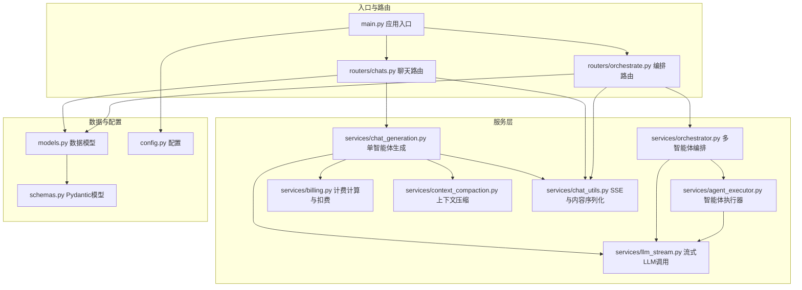
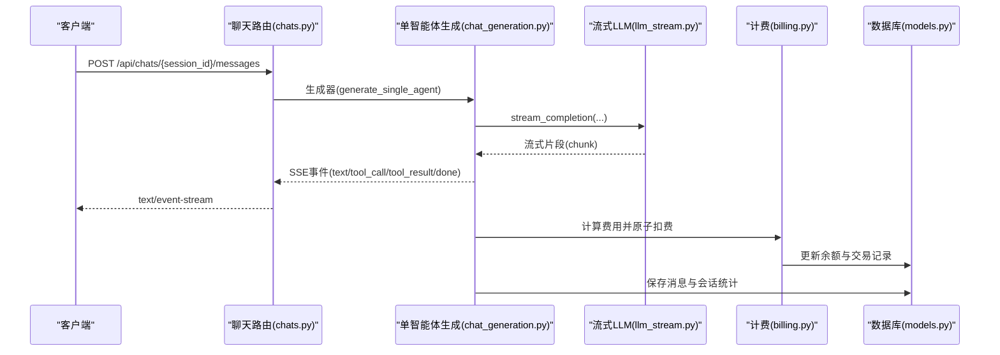
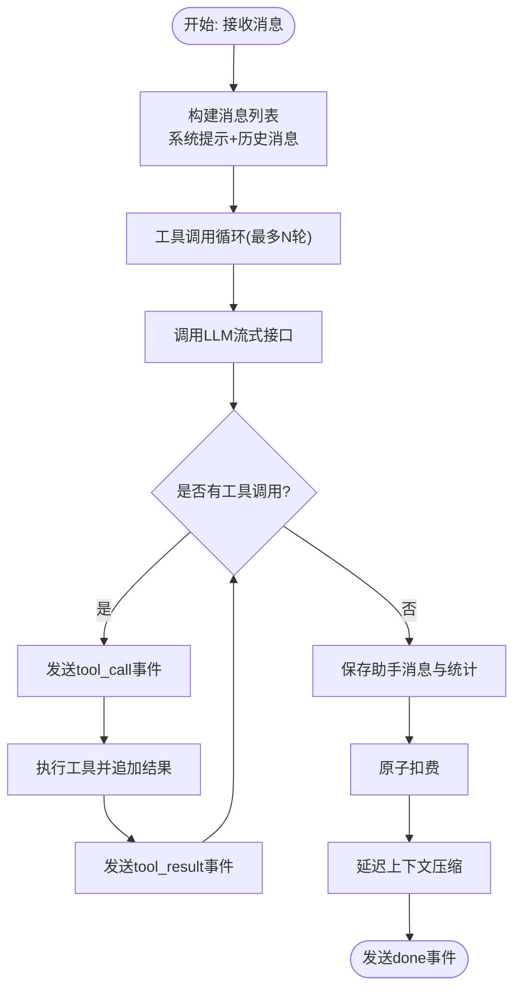
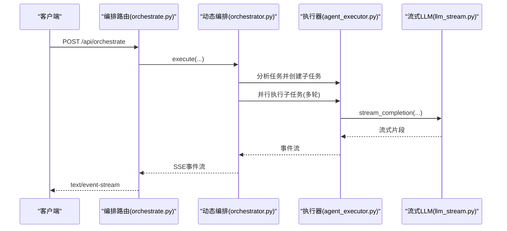
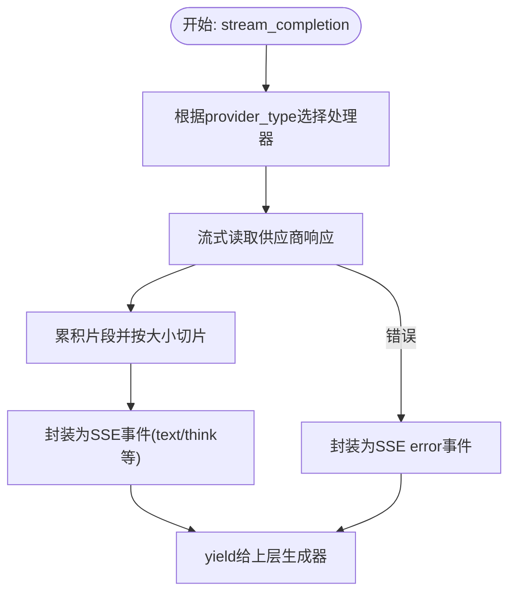
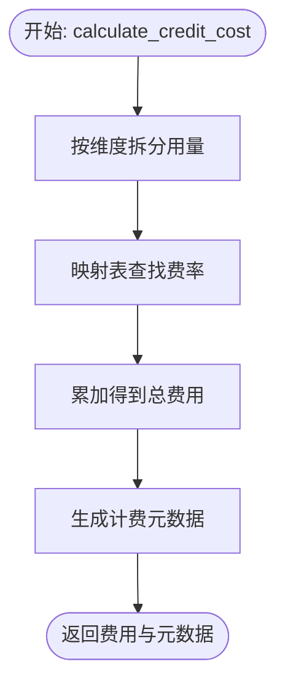
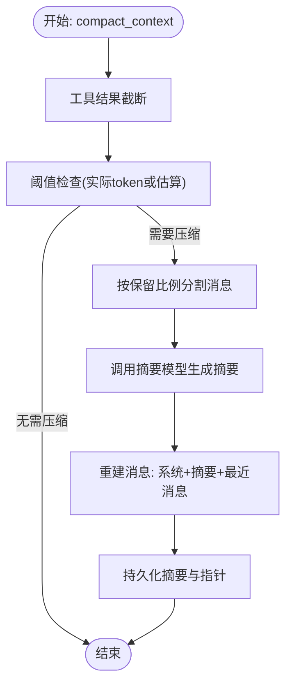
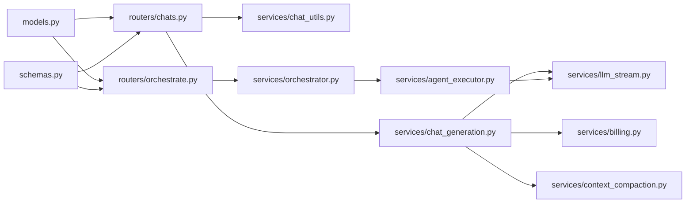

# AI服务性能优化

<cite>
**本文档引用的文件**
- [main.py](file://backend/main.py)
- [chats.py](file://backend/routers/chats.py)
- [orchestrate.py](file://backend/routers/orchestrate.py)
- [chat_generation.py](file://backend/services/chat_generation.py)
- [orchestrator.py](file://backend/services/orchestrator.py)
- [llm_stream.py](file://backend/services/llm_stream.py)
- [agent_executor.py](file://backend/services/agent_executor.py)
- [billing.py](file://backend/services/billing.py)
- [context_compaction.py](file://backend/services/context_compaction.py)
- [chat_utils.py](file://backend/services/chat_utils.py)
- [models.py](file://backend/models.py)
- [schemas.py](file://backend/schemas.py)
- [config.py](file://backend/config.py)
</cite>

## 目录
1. [简介](#简介)
2. [项目结构](#项目结构)
3. [核心组件](#核心组件)
4. [架构概览](#架构概览)
5. [详细组件分析](#详细组件分析)
6. [依赖分析](#依赖分析)
7. [性能考虑](#性能考虑)
8. [故障排查指南](#故障排查指南)
9. [结论](#结论)
10. [附录](#附录)

## 简介
本文件面向Infinite Game项目的AI服务性能优化，聚焦以下目标：
- AI服务调用的性能优化策略：批量请求处理、并发控制与超时管理
- 流式响应优化技术：SSE连接管理与事件分片处理
- AI模型调用的缓存策略：响应缓存与中间结果缓存
- 任务调度优化：动态负载均衡与优先级队列管理
- AI服务监控指标：响应时间分布、成功率与资源利用率
- 降级与容错机制：服务可用性保障方案

## 项目结构
后端采用FastAPI框架，服务层围绕聊天生成、多智能体编排、流式LLM调用、计费与上下文压缩等模块组织。前端通过SSE实时接收AI生成结果，后端通过数据库事务保证计费与上下文压缩的一致性。

**图表来源**
- [main.py:110-175](file://backend/main.py#L110-L175)
- [chats.py:18-183](file://backend/routers/chats.py#L18-L183)
- [orchestrate.py:19-70](file://backend/routers/orchestrate.py#L19-L70)
- [chat_generation.py:29-449](file://backend/services/chat_generation.py#L29-L449)
- [orchestrator.py:418-534](file://backend/services/orchestrator.py#L418-L534)
- [llm_stream.py:12-800](file://backend/services/llm_stream.py#L12-L800)
- [agent_executor.py:63-287](file://backend/services/agent_executor.py#L63-L287)
- [billing.py:178-308](file://backend/services/billing.py#L178-L308)
- [context_compaction.py:239-347](file://backend/services/context_compaction.py#L239-L347)
- [chat_utils.py:16-94](file://backend/services/chat_utils.py#L16-L94)
- [models.py:178-273](file://backend/models.py#L178-L273)
- [schemas.py:362-401](file://backend/schemas.py#L362-L401)
- [config.py:7-43](file://backend/config.py#L7-L43)

**章节来源**
- [main.py:110-175](file://backend/main.py#L110-L175)
- [chats.py:18-183](file://backend/routers/chats.py#L18-L183)
- [orchestrate.py:19-70](file://backend/routers/orchestrate.py#L19-L70)

## 核心组件
- 单智能体聊天生成：负责构建消息上下文、工具调用循环、计费与上下文压缩，最终通过SSE流式返回结果。
- 多智能体编排：基于领导者智能体的任务分析与子任务调度，支持并行与串行混合执行。
- 流式LLM调用：统一注册表模式，屏蔽不同供应商差异，提供统一的流式接口与工具调用收集。
- 计费与扣费：映射表驱动的多维度计费，原子化扣费与余额冻结检查。
- 上下文压缩：基于阈值与保留比例的自动压缩，减少上下文长度，提升响应效率。
- SSE工具：标准化Server-Sent Events格式，支持事件分片与错误传播。

**章节来源**
- [chat_generation.py:29-449](file://backend/services/chat_generation.py#L29-L449)
- [orchestrator.py:418-534](file://backend/services/orchestrator.py#L418-L534)
- [llm_stream.py:12-800](file://backend/services/llm_stream.py#L12-L800)
- [billing.py:178-308](file://backend/services/billing.py#L178-L308)
- [context_compaction.py:239-347](file://backend/services/context_compaction.py#L239-L347)
- [chat_utils.py:16-94](file://backend/services/chat_utils.py#L16-L94)

## 架构概览
下图展示了从HTTP请求到SSE流式响应的关键路径，以及多智能体编排的事件驱动流程。

**图表来源**
- [chats.py:127-183](file://backend/routers/chats.py#L127-L183)
- [chat_generation.py:191-204](file://backend/services/chat_generation.py#L191-L204)
- [llm_stream.py:82-148](file://backend/services/llm_stream.py#L82-L148)
- [billing.py:178-308](file://backend/services/billing.py#L178-L308)
- [models.py:178-208](file://backend/models.py#L178-L208)

## 详细组件分析

### 单智能体聊天生成（性能优化要点）
- 工具调用循环与事件分片
  - 通过工具调用结果决定是否继续循环，每轮工具调用后发送开始/结束事件，前端可即时渲染。
  - 事件类型包括：text、tool_call、tool_result、canvas_updated、video_task_created、billing、done等。
- 上下文压缩与延迟压缩
  - 在工具调用前进行工具结果截断，降低token占用；在LLM生成完成后进行压缩，避免影响生成质量。
- 计费与保存
  - 成功生成后才进行计费与保存，失败不扣费；支持生成图片数量统计与画布桥接。

**图表来源**
- [chat_generation.py:175-327](file://backend/services/chat_generation.py#L175-L327)
- [context_compaction.py:239-347](file://backend/services/context_compaction.py#L239-L347)
- [billing.py:178-308](file://backend/services/billing.py#L178-L308)

**章节来源**
- [chat_generation.py:29-449](file://backend/services/chat_generation.py#L29-L449)
- [context_compaction.py:239-347](file://backend/services/context_compaction.py#L239-L347)
- [billing.py:178-308](file://backend/services/billing.py#L178-L308)

### 多智能体编排（动态负载均衡与优先级）
- 任务分析与分解
  - 领导者智能体一次性分析任务，判断简单/复杂路径；复杂任务分解为子任务并建立依赖图。
- 并行与串行混合执行
  - 同一层级且无依赖的子任务并行执行；单个子任务采用流式输出，实现实时进度反馈。
- 事件驱动与结果聚合
  - 通过统一事件格式（subtask_started、subtask_chunk、subtask_completed、task_result等）驱动前端渲染与后续处理。

**图表来源**
- [orchestrate.py:26-70](file://backend/routers/orchestrate.py#L26-L70)
- [orchestrator.py:418-534](file://backend/services/orchestrator.py#L418-L534)
- [agent_executor.py:127-162](file://backend/services/agent_executor.py#L127-L162)
- [llm_stream.py:12-800](file://backend/services/llm_stream.py#L12-L800)

**章节来源**
- [orchestrator.py:231-366](file://backend/services/orchestrator.py#L231-L366)
- [agent_executor.py:63-287](file://backend/services/agent_executor.py#L63-L287)

### 流式LLM调用（SSE连接管理与事件分片）
- 注册表模式
  - 通过装饰器注册不同供应商处理器，统一接口，减少条件分支与耦合。
- SSE事件分片
  - 将长文本按固定大小切片，逐块推送，前端可逐步渲染，降低首屏延迟。
- 错误与异常处理
  - 供应商错误通过SSE error事件上报，便于前端统一处理。

**图表来源**
- [llm_stream.py:64-71](file://backend/services/llm_stream.py#L64-L71)
- [llm_stream.py:82-148](file://backend/services/llm_stream.py#L82-L148)
- [chat_utils.sse:16-18](file://backend/services/chat_utils.py#L16-L18)

**章节来源**
- [llm_stream.py:12-800](file://backend/services/llm_stream.py#L12-L800)
- [chat_utils.py:16-18](file://backend/services/chat_utils.py#L16-L18)

### 计费与扣费（原子化与映射表驱动）
- 多维度计费
  - 输入token、文本输出token、图像输出token、搜索查询、图像生成数量等维度统一映射表计算。
- 原子扣费
  - 使用UPDATE ... WHERE ... 语句并结合冻结状态检查，确保并发安全与一致性。
- 余额检查
  - 预检查余额与冻结状态，避免无效调用。

**图表来源**
- [billing.py:310-350](file://backend/services/billing.py#L310-L350)

**章节来源**
- [billing.py:178-308](file://backend/services/billing.py#L178-L308)
- [billing.py:310-350](file://backend/services/billing.py#L310-L350)

### 上下文压缩（自动窗口管理）
- 阈值与保留策略
  - 基于上下文窗口与保留比例，自动分割待压缩与保留消息，优先保留最近消息。
- LLM摘要生成
  - 使用专用摘要模型生成压缩摘要，插入系统提示，形成“系统提示+摘要+最近消息”的内存结构。
- 延迟压缩
  - 在生成完成后进行压缩，避免影响生成质量。

**图表来源**
- [context_compaction.py:239-347](file://backend/services/context_compaction.py#L239-L347)

**章节来源**
- [context_compaction.py:239-347](file://backend/services/context_compaction.py#L239-L347)

## 依赖分析
- 组件耦合
  - 路由层仅负责参数校验与生成器选择，核心逻辑集中在服务层，降低耦合度。
  - 流式LLM调用通过注册表解耦不同供应商，便于扩展与维护。
- 外部依赖
  - OpenAI/Anthropic/DashScope/Gemini等供应商SDK；SQLite/PostgreSQL数据库；Redis（配置项）。
- 循环依赖
  - 当前结构未发现循环导入，模块职责清晰。

**图表来源**
- [chats.py:18-183](file://backend/routers/chats.py#L18-L183)
- [orchestrate.py:19-70](file://backend/routers/orchestrate.py#L19-L70)
- [chat_generation.py:29-449](file://backend/services/chat_generation.py#L29-L449)
- [llm_stream.py:12-800](file://backend/services/llm_stream.py#L12-L800)
- [billing.py:178-308](file://backend/services/billing.py#L178-L308)
- [context_compaction.py:239-347](file://backend/services/context_compaction.py#L239-L347)
- [orchestrator.py:418-534](file://backend/services/orchestrator.py#L418-L534)
- [agent_executor.py:63-287](file://backend/services/agent_executor.py#L63-L287)
- [models.py:178-273](file://backend/models.py#L178-L273)
- [schemas.py:362-401](file://backend/schemas.py#L362-L401)

**章节来源**
- [models.py:178-273](file://backend/models.py#L178-L273)
- [schemas.py:362-401](file://backend/schemas.py#L362-L401)

## 性能考虑
- 批量请求处理
  - 多智能体编排中，同一层级且无依赖的子任务采用并行执行，显著缩短整体耗时。
  - 单智能体工具调用循环内，工具结果截断减少token占用，降低后续LLM调用成本。
- 并发控制
  - 使用asyncio.gather进行多任务并行；在工具调用阶段避免阻塞，保持流式响应。
  - 建议引入任务队列与速率限制，防止供应商限流或服务过载。
- 超时管理
  - 流式LLM调用建议设置连接与读取超时，异常时返回SSE error事件，前端可重试或降级。
- 流式响应优化
  - SSE事件分片与前端逐步渲染，降低首屏等待时间；错误事件及时上报，便于前端处理。
- 缓存策略
  - 响应缓存：对相同输入的重复请求进行缓存（需结合输入指纹与过期策略）。
  - 中间结果缓存：工具调用结果与图像生成结果缓存，减少重复调用。
- 动态负载均衡
  - 根据供应商可用性与响应时间动态选择最优供应商；对高延迟供应商进行熔断。
- 监控指标
  - 响应时间分布（P50/P90/P95）、成功率、并发请求数、供应商调用次数与错误率、资源利用率（CPU/内存/数据库连接池）。
- 降级与容错
  - 供应商不可用时切换备用供应商或返回预设模板；余额不足时返回明确错误；网络异常时指数退避重试。

[本节为通用性能指导，不直接分析具体文件]

## 故障排查指南
- SSE连接异常
  - 检查路由层SSE头部设置与生成器异常捕获；确认chat_utils.sse格式正确。
- 工具调用失败
  - 查看工具调用事件与错误日志，确认工具定义与参数；必要时禁用工具或降级为文本输出。
- 计费失败
  - 检查余额冻结状态与原子扣费SQL；确认费率配置与用量统计。
- 上下文压缩未生效
  - 检查上下文窗口与保留比例配置；确认摘要生成是否成功。
- 多智能体编排卡顿
  - 检查并行任务数量与依赖图；优化子任务粒度与执行顺序。

**章节来源**
- [chat_utils.py:16-18](file://backend/services/chat_utils.py#L16-L18)
- [billing.py:258-287](file://backend/services/billing.py#L258-L287)
- [context_compaction.py:286-347](file://backend/services/context_compaction.py#L286-L347)
- [orchestrator.py:290-347](file://backend/services/orchestrator.py#L290-L347)

## 结论
通过注册表模式的流式LLM调用、事件驱动的SSE分片、映射表驱动的计费与原子扣费、以及自动上下文压缩与多智能体并行编排，Infinite Game实现了高效、可观测且可扩展的AI服务性能体系。建议在此基础上引入任务队列、缓存与熔断降级机制，进一步提升稳定性与吞吐能力。

[本节为总结性内容，不直接分析具体文件]

## 附录
- 配置项参考
  - 数据库URL、Redis地址、AI提供商密钥、JWT配置等。
- 数据模型要点
  - ChatSession、ChatMessage、Agent、LLMProvider、CreditTransaction等与性能优化密切相关。

**章节来源**
- [config.py:7-43](file://backend/config.py#L7-L43)
- [models.py:178-273](file://backend/models.py#L178-L273)