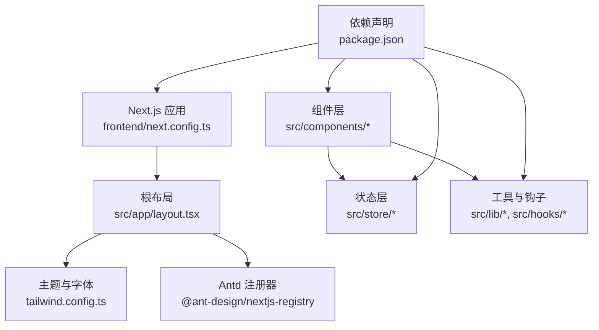
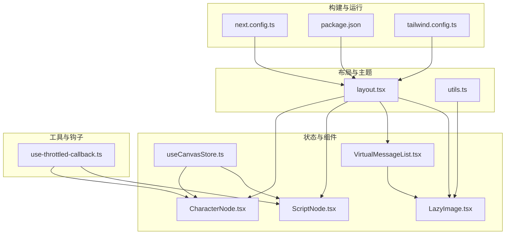
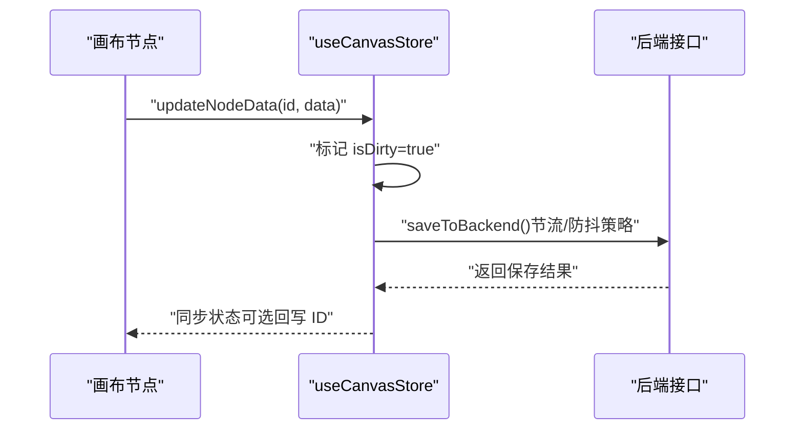
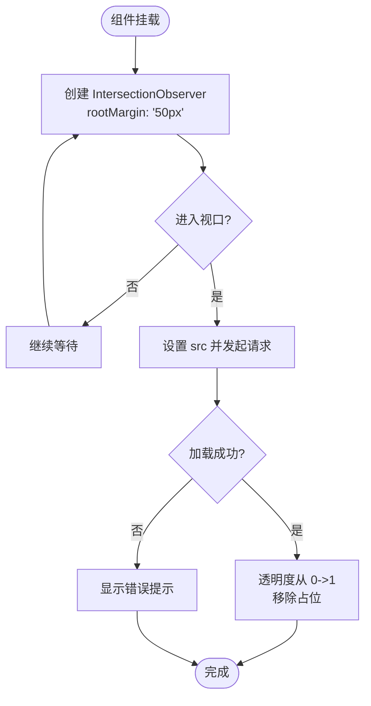
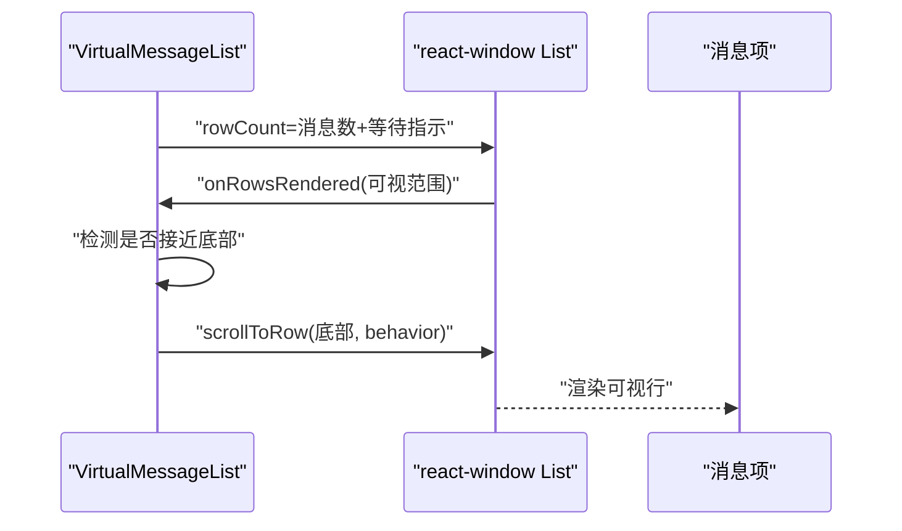
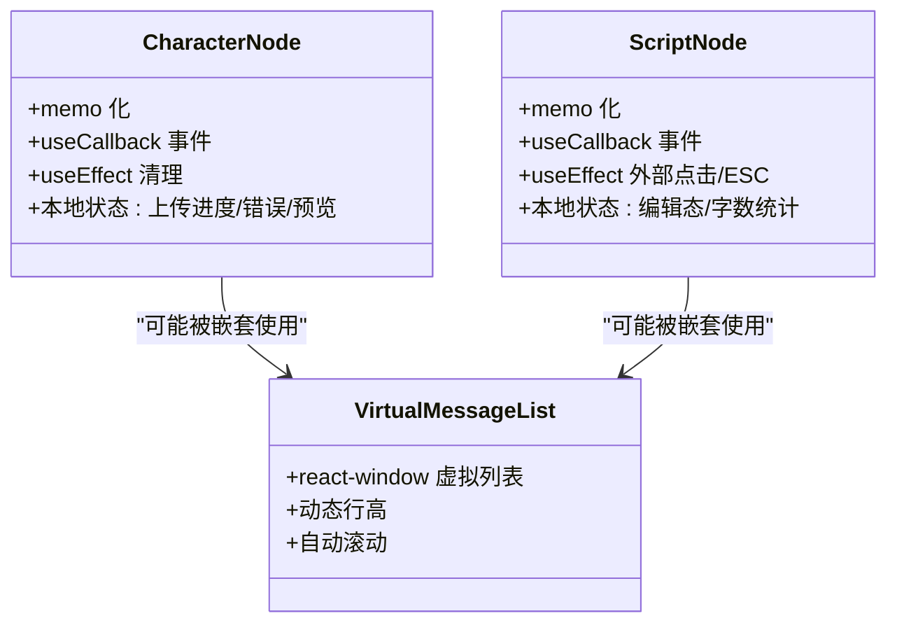
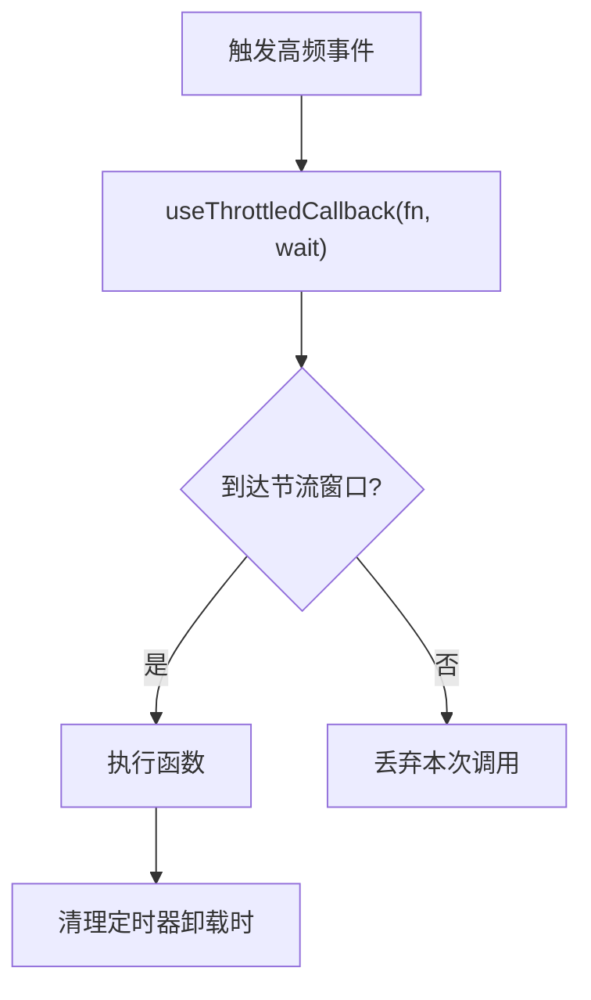
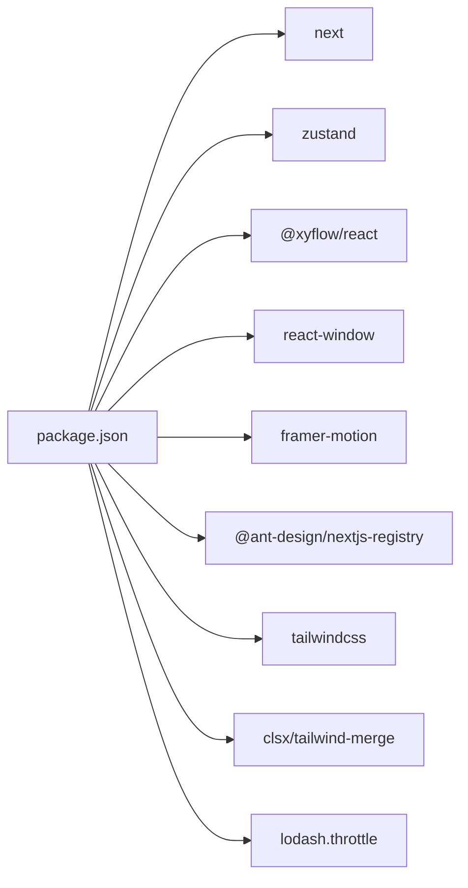

# 前端性能优化

<cite>
**本文引用的文件**
- [next.config.ts](file://frontend/next.config.ts)
- [package.json](file://frontend/package.json)
- [layout.tsx](file://frontend/src/app/layout.tsx)
- [tailwind.config.ts](file://frontend/tailwind.config.ts)
- [utils.ts](file://frontend/src/lib/utils.ts)
- [use-throttled-callback.ts](file://frontend/src/hooks/use-throttled-callback.ts)
- [useCanvasStore.ts](file://frontend/src/store/useCanvasStore.ts)
- [CharacterNode.tsx](file://frontend/src/components/canvas/CharacterNode.tsx)
- [ScriptNode.tsx](file://frontend/src/components/canvas/ScriptNode.tsx)
- [LazyImage.tsx](file://frontend/src/components/ai-assistant/LazyImage.tsx)
- [VirtualMessageList.tsx](file://frontend/src/components/ai-assistant/VirtualMessageList.tsx)
</cite>

## 目录
1. [简介](#简介)
2. [项目结构](#项目结构)
3. [核心组件](#核心组件)
4. [架构总览](#架构总览)
5. [详细组件分析](#详细组件分析)
6. [依赖分析](#依赖分析)
7. [性能考量](#性能考量)
8. [故障排查指南](#故障排查指南)
9. [结论](#结论)
10. [附录](#附录)

## 简介
本文件面向 KunFlix 前端（Next.js）应用，系统性梳理并给出性能优化策略，覆盖以下方面：
- Next.js 应用的构建与运行期优化（代码分割、懒加载、预取策略）
- React 组件性能优化（memo 化、useMemo、useCallback 的正确使用）
- Canvas/节点渲染优化（虚拟滚动、节点懒加载、重绘优化）
- 图片与媒体资源优化（懒加载、格式与压缩策略）
- 前端性能监控指标（首屏、交互延迟、内存等）与 Web Vitals 优化建议
- 性能预算管理与落地实践

## 项目结构
前端采用 Next.js 16 应用，使用 Ant Design Next.js Registry 注册服务、TailwindCSS 4 主题系统，并通过 Zustand 管理画布状态。核心目录与文件如下：
- 构建与运行配置：next.config.ts、tailwind.config.ts、package.json
- 根布局与字体：src/app/layout.tsx、src/app/globals.css
- 组件层：src/components 下包含画布节点、AI 助手列表、图片懒加载等
- 状态层：src/store 下包含 useCanvasStore 等状态管理
- 工具与钩子：src/lib/utils.ts、src/hooks/use-throttled-callback.ts

**图表来源**
- [next.config.ts:1-21](file://frontend/next.config.ts#L1-L21)
- [layout.tsx:1-42](file://frontend/src/app/layout.tsx#L1-L42)
- [tailwind.config.ts:1-64](file://frontend/tailwind.config.ts#L1-L64)
- [package.json:1-94](file://frontend/package.json#L1-L94)

**章节来源**
- [next.config.ts:1-21](file://frontend/next.config.ts#L1-L21)
- [layout.tsx:1-42](file://frontend/src/app/layout.tsx#L1-L42)
- [tailwind.config.ts:1-64](file://frontend/tailwind.config.ts#L1-L64)
- [package.json:1-94](file://frontend/package.json#L1-L94)

## 核心组件
- 状态管理：useCanvasStore（Zustand + localStorage 持久化），负责节点、边、视口、历史快照、与后端同步
- 画布节点：CharacterNode（图片节点）、ScriptNode（文本节点），均使用 memo 化以减少重渲染
- 列表虚拟化：VirtualMessageList（react-window + 动态行高），用于长消息列表的高性能渲染
- 图片懒加载：LazyImage（IntersectionObserver + loading="lazy"），降低首屏与滚动开销
- 工具与节流：use-throttled-callback（lodash.throttle + useUnmount 清理）

**章节来源**
- [useCanvasStore.ts:1-540](file://frontend/src/store/useCanvasStore.ts#L1-L540)
- [CharacterNode.tsx:1-588](file://frontend/src/components/canvas/CharacterNode.tsx#L1-L588)
- [ScriptNode.tsx:1-253](file://frontend/src/components/canvas/ScriptNode.tsx#L1-L253)
- [VirtualMessageList.tsx:1-293](file://frontend/src/components/ai-assistant/VirtualMessageList.tsx#L1-L293)
- [LazyImage.tsx:1-111](file://frontend/src/components/ai-assistant/LazyImage.tsx#L1-L111)
- [use-throttled-callback.ts:1-49](file://frontend/src/hooks/use-throttled-callback.ts#L1-L49)

## 架构总览
下图展示前端性能优化相关的架构要点：构建配置、主题与字体、组件与状态、工具与钩子之间的关系。

**图表来源**
- [next.config.ts:1-21](file://frontend/next.config.ts#L1-L21)
- [package.json:1-94](file://frontend/package.json#L1-L94)
- [tailwind.config.ts:1-64](file://frontend/tailwind.config.ts#L1-L64)
- [layout.tsx:1-42](file://frontend/src/app/layout.tsx#L1-L42)
- [utils.ts:1-7](file://frontend/src/lib/utils.ts#L1-L7)
- [useCanvasStore.ts:1-540](file://frontend/src/store/useCanvasStore.ts#L1-L540)
- [CharacterNode.tsx:1-588](file://frontend/src/components/canvas/CharacterNode.tsx#L1-L588)
- [ScriptNode.tsx:1-253](file://frontend/src/components/canvas/ScriptNode.tsx#L1-L253)
- [VirtualMessageList.tsx:1-293](file://frontend/src/components/ai-assistant/VirtualMessageList.tsx#L1-L293)
- [LazyImage.tsx:1-111](file://frontend/src/components/ai-assistant/LazyImage.tsx#L1-L111)
- [use-throttled-callback.ts:1-49](file://frontend/src/hooks/use-throttled-callback.ts#L1-L49)

## 详细组件分析

### 状态与画布渲染优化（Zustand + React Flow）
- 状态粒度与不可变更新：通过局部更新节点数据与边集合，避免整树重渲染；仅在显著变更（位置、尺寸、移除、新增）时标记脏状态
- 历史快照与撤销重做：限制最大历史长度，减少内存占用；持久化仅保留必要字段，合并去重
- 与后端同步：按需拉取与保存，避免不必要的全量同步

**图表来源**
- [useCanvasStore.ts:310-318](file://frontend/src/store/useCanvasStore.ts#L310-L318)
- [useCanvasStore.ts:478-505](file://frontend/src/store/useCanvasStore.ts#L478-L505)

**章节来源**
- [useCanvasStore.ts:185-540](file://frontend/src/store/useCanvasStore.ts#L185-L540)

### 图片懒加载与预取策略（LazyImage）
- 视口检测：使用 IntersectionObserver 在进入视口前 50px 提前开始加载
- 占位与渐显：占位元素与透明过渡，提升感知性能
- 错误兜底：错误状态提示与回退处理
- 预取建议：对即将进入视口的相邻项进行预取（结合滚动方向与距离）

**图表来源**
- [LazyImage.tsx:29-54](file://frontend/src/components/ai-assistant/LazyImage.tsx#L29-L54)
- [LazyImage.tsx:56-64](file://frontend/src/components/ai-assistant/LazyImage.tsx#L56-L64)
- [LazyImage.tsx:86-98](file://frontend/src/components/ai-assistant/LazyImage.tsx#L86-L98)

**章节来源**
- [LazyImage.tsx:1-111](file://frontend/src/components/ai-assistant/LazyImage.tsx#L1-L111)

### 列表虚拟化与滚动优化（VirtualMessageList）
- 虚拟滚动：react-window + 动态行高，仅渲染可视区域
- 自动滚动：用户发送消息时强制滚动到底部；AI 回复时仅在未手动上滑时滚动
- 滚动行为：支持 smooth/instant，避免阻塞主线程
- 溢出渲染：overscan 控制可见前后额外渲染数量，平衡性能与体验

**图表来源**
- [VirtualMessageList.tsx:240-271](file://frontend/src/components/ai-assistant/VirtualMessageList.tsx#L240-L271)
- [VirtualMessageList.tsx:86-109](file://frontend/src/components/ai-assistant/VirtualMessageList.tsx#L86-L109)
- [VirtualMessageList.tsx:155-196](file://frontend/src/components/ai-assistant/VirtualMessageList.tsx#L155-L196)

**章节来源**
- [VirtualMessageList.tsx:1-293](file://frontend/src/components/ai-assistant/VirtualMessageList.tsx#L1-L293)

### 节点组件性能（CharacterNode、ScriptNode）
- memo 化：节点组件整体包裹 memo，避免非必要重渲染
- 事件与回调：使用 useCallback 缓存事件处理器，减少子组件重渲染
- 本地状态与副作用：合理拆分内部状态与外部状态，避免无关状态导致重渲染
- DOM 事件：阻止冒泡与选择，减少对上游组件的影响

**图表来源**
- [CharacterNode.tsx:587](file://frontend/src/components/canvas/CharacterNode.tsx#L587)
- [ScriptNode.tsx:252](file://frontend/src/components/canvas/ScriptNode.tsx#L252)
- [VirtualMessageList.tsx:1-293](file://frontend/src/components/ai-assistant/VirtualMessageList.tsx#L1-L293)

**章节来源**
- [CharacterNode.tsx:1-588](file://frontend/src/components/canvas/CharacterNode.tsx#L1-L588)
- [ScriptNode.tsx:1-253](file://frontend/src/components/canvas/ScriptNode.tsx#L1-L253)

### 节流与防抖（use-throttled-callback）
- 场景：窗口尺寸变化、滚动、拖拽、缩放等高频事件
- 实现：基于 lodash.throttle，配合 useUnmount 清理定时器
- 建议：根据场景选择 leading/trailing，避免首尾抖动

**图表来源**
- [use-throttled-callback.ts:25-46](file://frontend/src/hooks/use-throttled-callback.ts#L25-L46)

**章节来源**
- [use-throttled-callback.ts:1-49](file://frontend/src/hooks/use-throttled-callback.ts#L1-L49)

## 依赖分析
- 构建与运行：Next.js 16、Ant Design Next.js Registry、TailwindCSS 4
- 状态与存储：Zustand、localStorage 持久化
- UI 与组件库：Ant Design、Radix UI、Lucide Icons
- 图形与可视化：@xyflow/react（画布）、react-window（虚拟列表）、framer-motion（动画）
- 工具：clsx、tailwind-merge、lodash.throttle、uuid

**图表来源**
- [package.json:13-69](file://frontend/package.json#L13-L69)

**章节来源**
- [package.json:1-94](file://frontend/package.json#L1-L94)

## 性能考量
- 代码分割与懒加载
  - 页面级路由：Next.js 默认按页面拆分包，建议将重型页面组件进一步拆分为客户端模块，使用动态导入（例如在需要时再引入大型编辑器或画布库）
  - 组件级懒加载：对非首屏使用的组件（如大型弹窗、复杂编辑器）使用动态导入与 Suspense
  - 预取策略：对用户可能访问的下一个页面或关键路径组件使用 next/link 的 prefetch 或在滚动到可视区域时预取
- React 组件性能
  - memo 化：已对节点组件使用 memo，建议对 props 做稳定化处理，避免闭包导致的不必要重渲染
  - useCallback/useMemo：对事件处理器与计算结果进行缓存，减少子组件重渲染
  - 状态拆分：将大对象拆分为小状态，避免因单一状态变更引发大面积重渲染
- Canvas/节点渲染
  - 虚拟滚动：已在消息列表中应用，建议在节点列表或资源列表中同样采用虚拟滚动
  - 节点懒加载：仅在节点进入视口时加载其子资源（如图片、视频），并及时释放不再可见的资源
  - 重绘优化：减少强制同步布局、避免频繁读写布局属性；使用 transform/opacity 等 GPU 加速属性
- 图片与媒体资源
  - 懒加载：已实现 LazyImage，建议统一在图片组件中使用 loading="lazy" 与合适的占位
  - 格式与压缩：优先使用现代格式（如 AVIF/WebP），在不支持的浏览器回退至 JPEG/PNG；对不同 DPR 设置多尺寸源
  - CDN 与缓存：启用 CDN 与合适的缓存头；对静态资源使用版本化命名
- 性能监控与 Web Vitals
  - 指标采集：首屏时间（FCP/LCP）、交互延迟（FID/CLS）、内存使用（PerformanceObserver）
  - 建议：在生产环境接入 Web Vitals 报告，设置阈值告警；对关键路径资源进行预算控制
- 性能预算管理
  - 资源体积预算：对 JS/CSS/图片设定上限，定期审计
  - 请求数预算：合并与去重，减少请求数
  - 渲染预算：帧率目标（60fps），避免长任务与阻塞主线程

[本节为通用指导，无需特定文件引用]

## 故障排查指南
- 图片不加载或闪烁
  - 检查 LazyImage 的视口检测与 src 条件渲染逻辑
  - 确认占位与透明过渡是否生效
- 列表滚动卡顿
  - 检查 overscan 数量与默认行高设置
  - 确认是否在滚动过程中触发了不必要的重渲染
- 节点拖拽或缩放卡顿
  - 使用节流钩子对拖拽/缩放事件进行节流
  - 减少每次事件中的计算量，避免读写布局
- 内存泄漏
  - 确保在组件卸载时清理定时器、事件监听器与观察者
  - 对大对象引用进行弱引用或及时释放

**章节来源**
- [LazyImage.tsx:29-54](file://frontend/src/components/ai-assistant/LazyImage.tsx#L29-L54)
- [VirtualMessageList.tsx:86-109](file://frontend/src/components/ai-assistant/VirtualMessageList.tsx#L86-L109)
- [use-throttled-callback.ts:41-43](file://frontend/src/hooks/use-throttled-callback.ts#L41-L43)

## 结论
通过合理的构建配置、组件级 memo 化、虚拟滚动、图片懒加载与节流/防抖策略，KunFlix 前端可在保证交互流畅的同时，有效降低首屏与滚动成本。建议持续引入 Web Vitals 监控与性能预算管理，形成闭环优化机制。

[本节为总结，无需特定文件引用]

## 附录
- Next.js 与构建配置要点
  - 代理与重写：将 /api 代理到后端服务，便于开发与部署一致性
  - 实验特性：根据需要开启实验性能力（如服务器动作体大小限制）
- 主题与字体
  - Tailwind 4 与 Antd 注册器：确保组件样式与主题变量一致
  - 字体加载：使用 next/font，避免 FOIT/FOUC

**章节来源**
- [next.config.ts:10-17](file://frontend/next.config.ts#L10-L17)
- [layout.tsx:8-16](file://frontend/src/app/layout.tsx#L8-L16)
- [tailwind.config.ts:10-61](file://frontend/tailwind.config.ts#L10-L61)