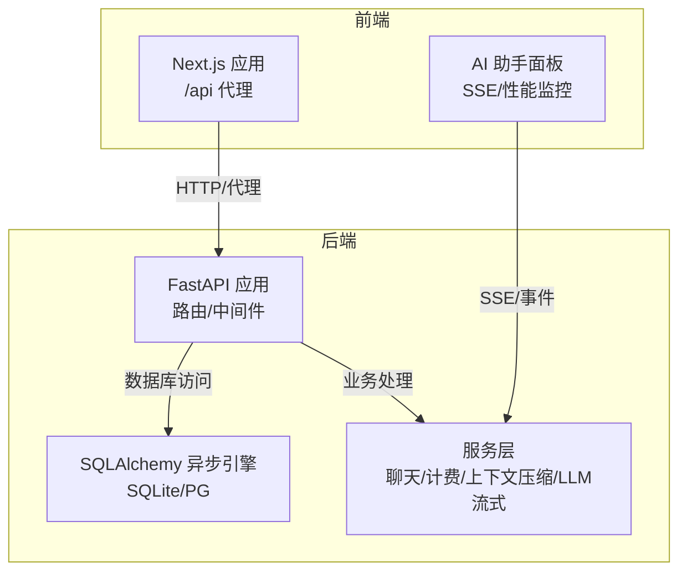
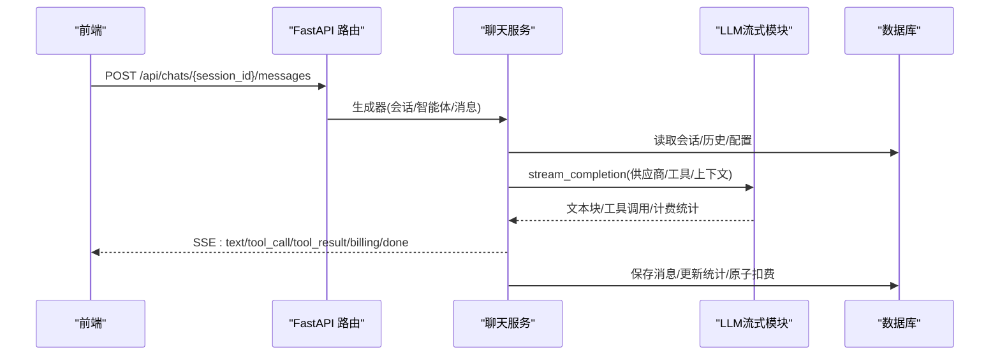
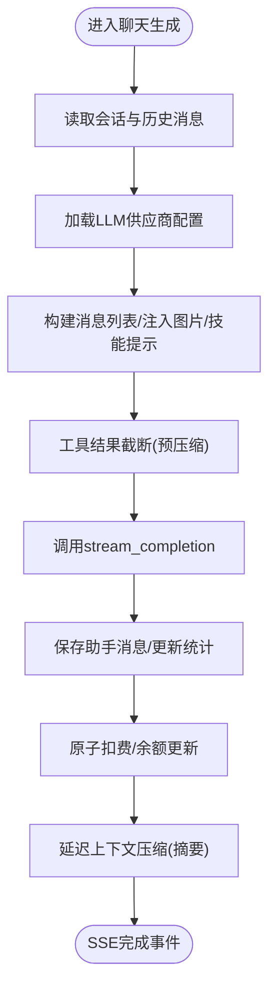
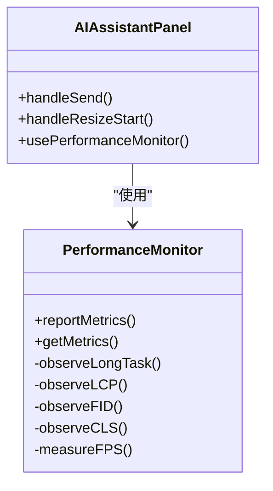
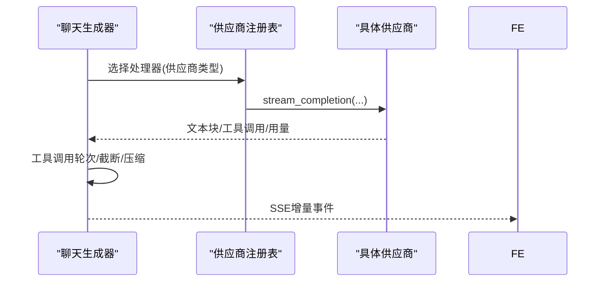
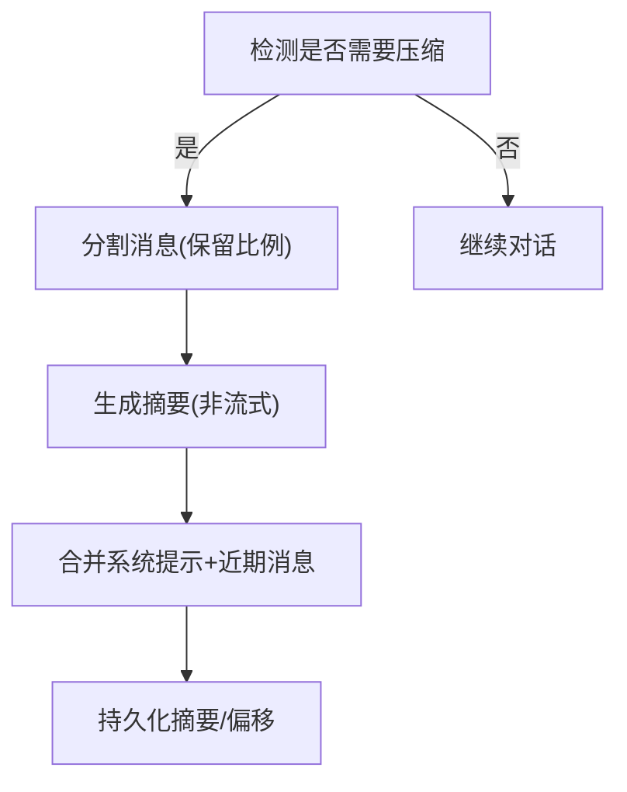
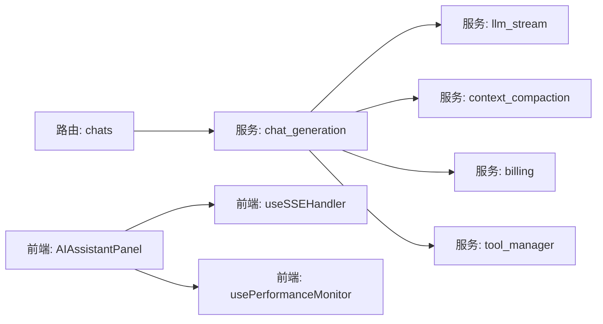

# 性能优化

<cite>
**本文引用的文件**
- [backend/main.py](file://backend/main.py)
- [backend/config.py](file://backend/config.py)
- [backend/database.py](file://backend/database.py)
- [backend/routers/chats.py](file://backend/routers/chats.py)
- [backend/services/chat_generation.py](file://backend/services/chat_generation.py)
- [backend/services/llm_stream.py](file://backend/services/llm_stream.py)
- [backend/services/context_compaction.py](file://backend/services/context_compaction.py)
- [backend/services/billing.py](file://backend/services/billing.py)
- [backend/services/tool_manager/manager.py](file://backend/services/tool_manager/manager.py)
- [frontend/src/lib/api.ts](file://frontend/src/lib/api.ts)
- [frontend/src/components/ai-assistant/hooks/usePerformanceMonitor.ts](file://frontend/src/components/ai-assistant/hooks/usePerformanceMonitor.ts)
- [frontend/src/components/ai-assistant/hooks/useSSEHandler.ts](file://frontend/src/components/ai-assistant/hooks/useSSEHandler.ts)
- [frontend/src/components/ai-assistant/AIAssistantPanel.tsx](file://frontend/src/components/ai-assistant/AIAssistantPanel.tsx)
- [frontend/next.config.ts](file://frontend/next.config.ts)
</cite>

## 目录
1. [简介](#简介)
2. [项目结构](#项目结构)
3. [核心组件](#核心组件)
4. [架构总览](#架构总览)
5. [详细组件分析](#详细组件分析)
6. [依赖分析](#依赖分析)
7. [性能考量](#性能考量)
8. [故障排查指南](#故障排查指南)
9. [结论](#结论)
10. [附录](#附录)

## 简介
本文件面向Infinite Game项目的性能优化，围绕后端数据库查询优化、缓存策略、API响应时间优化、前端性能优化以及AI服务调用的并发与超时控制进行系统性梳理，并给出可落地的配置建议与监控指标方案。

## 项目结构
- 后端采用FastAPI + SQLAlchemy异步引擎，提供聊天、会话、工具链路、计费与上下文压缩等能力。
- 前端基于Next.js，通过Server Actions与代理转发到后端API，提供AI助手面板、SSE事件处理与性能监控钩子。
- 项目具备SQLite/WAL模式与连接池配置，便于在开发环境获得稳定体验；生产环境可通过配置切换至PostgreSQL并结合Redis实现缓存。

图表来源
- [backend/main.py:110-175](file://backend/main.py#L110-L175)
- [frontend/next.config.ts:10-17](file://frontend/next.config.ts#L10-L17)

章节来源
- [backend/main.py:110-175](file://backend/main.py#L110-L175)
- [frontend/next.config.ts:10-17](file://frontend/next.config.ts#L10-L17)

## 核心组件
- 数据库与连接池：异步引擎、连接池大小、SQLite WAL与busy_timeout配置，降低锁等待与提升并发。
- LLM流式调用：统一注册表模式，按供应商抽象流式接口，支持多模态与工具调用。
- 上下文压缩：基于令牌估算与阈值策略，定期将旧消息压缩为摘要，维持上下文窗口。
- 计费与余额：原子化扣费与退款，支持多维度计费（输入/输出/图片/搜索/视频）。
- 前端SSE与性能监控：SSE事件解析与状态机，前端FPS/LCP/FID/CLS/长任务监控。

章节来源
- [backend/database.py:9-37](file://backend/database.py#L9-L37)
- [backend/services/llm_stream.py:61-70](file://backend/services/llm_stream.py#L61-L70)
- [backend/services/context_compaction.py:79-158](file://backend/services/context_compaction.py#L79-L158)
- [backend/services/billing.py:14-30](file://backend/services/billing.py#L14-L30)
- [frontend/src/components/ai-assistant/hooks/useSSEHandler.ts:25-390](file://frontend/src/components/ai-assistant/hooks/useSSEHandler.ts#L25-L390)
- [frontend/src/components/ai-assistant/hooks/usePerformanceMonitor.ts:31-206](file://frontend/src/components/ai-assistant/hooks/usePerformanceMonitor.ts#L31-L206)

## 架构总览
后端通过FastAPI暴露REST接口，聊天流程采用SSE推送增量内容；数据库层使用异步连接池与SQLite WAL；AI调用通过统一注册表路由不同供应商；前端通过Next.js代理与SSE消费事件，内置性能监控钩子。

图表来源
- [backend/routers/chats.py:127-183](file://backend/routers/chats.py#L127-L183)
- [backend/services/chat_generation.py:29-449](file://backend/services/chat_generation.py#L29-L449)
- [backend/services/llm_stream.py:80-148](file://backend/services/llm_stream.py#L80-L148)

章节来源
- [backend/routers/chats.py:127-183](file://backend/routers/chats.py#L127-L183)
- [backend/services/chat_generation.py:29-449](file://backend/services/chat_generation.py#L29-L449)
- [backend/services/llm_stream.py:80-148](file://backend/services/llm_stream.py#L80-L148)

## 详细组件分析

### 数据库查询优化
- 连接池与SQLite优化
  - 连接池大小与溢出连接数配置，避免高并发下的连接饥饿。
  - SQLite启用WAL模式、增大busy_timeout、调整synchronous平衡，降低“database is locked”风险。
- 查询路径
  - 会话与历史消息读取采用顺序扫描与过滤，配合索引与LIMIT/OFFSET分页。
  - 事务内批量写入，减少往返开销。

图表来源
- [backend/services/chat_generation.py:42-174](file://backend/services/chat_generation.py#L42-L174)
- [backend/services/context_compaction.py:239-347](file://backend/services/context_compaction.py#L239-L347)

章节来源
- [backend/database.py:9-37](file://backend/database.py#L9-L37)
- [backend/services/chat_generation.py:42-174](file://backend/services/chat_generation.py#L42-L174)
- [backend/services/context_compaction.py:239-347](file://backend/services/context_compaction.py#L239-L347)

### 缓存策略配置（Redis）
- 会话存储：使用Redis作为会话存储，减少数据库压力，提高登录态与临时数据读写速度。
- 频繁查询缓存：对“智能体列表/LLM供应商配置/全局工具配置”等热点数据进行短时缓存。
- AI调用结果缓存：对“图像生成/视频生成”的结果URL进行缓存，避免重复调用同一提示词。
- 配置要点
  - 连接池大小与超时设置，避免阻塞。
  - 缓存键命名规范与失效策略，结合版本号或哈希避免脏读。
  - 缓存穿透防护：空结果也缓存短时间。
  - 缓存雪崩防护：为过期时间添加抖动。

说明：本项目后端配置中已预留REDIS_URL，可在生产环境启用并结合会话中间件与热点数据缓存模块使用。

章节来源
- [backend/config.py:18-19](file://backend/config.py#L18-L19)

### API响应时间优化
- SSE长连接：后端以SSE推送文本块与事件，前端按事件增量渲染，降低整体等待时间。
- 事件聚合：前端SSE处理器聚合工具调用与技能加载状态，减少DOM更新频率。
- 请求限流与幂等：后端对敏感接口增加限流与幂等键，避免重复计算。

章节来源
- [backend/routers/chats.py:175-183](file://backend/routers/chats.py#L175-L183)
- [frontend/src/components/ai-assistant/hooks/useSSEHandler.ts:67-383](file://frontend/src/components/ai-assistant/hooks/useSSEHandler.ts#L67-L383)

### 前端性能优化技术
- 代码分割与懒加载：Next.js默认支持页面与组件懒加载，建议将重型组件（如画布、编辑器）按需加载。
- 图片优化：使用现代格式（WebP/AVIF）与尺寸裁剪，结合占位符与懒加载。
- Canvas渲染优化：在AI助手面板中，Canvas相关组件采用虚拟滚动与节流，减少重绘。
- 性能监控：使用自定义hook采集FPS、LCP、FID、CLS与长任务，阈值告警并上报。

图表来源
- [frontend/src/components/ai-assistant/hooks/usePerformanceMonitor.ts:31-206](file://frontend/src/components/ai-assistant/hooks/usePerformanceMonitor.ts#L31-L206)
- [frontend/src/components/ai-assistant/AIAssistantPanel.tsx:153-161](file://frontend/src/components/ai-assistant/AIAssistantPanel.tsx#L153-L161)

章节来源
- [frontend/src/components/ai-assistant/hooks/usePerformanceMonitor.ts:31-206](file://frontend/src/components/ai-assistant/hooks/usePerformanceMonitor.ts#L31-L206)
- [frontend/src/components/ai-assistant/AIAssistantPanel.tsx:153-161](file://frontend/src/components/ai-assistant/AIAssistantPanel.tsx#L153-L161)

### AI服务调用的性能优化
- 供应商注册表：统一抽象OpenAI/Anthropic/Gemini等供应商的流式接口，减少条件分支与分支预测开销。
- 工具调用循环：最大轮次限制、按轮次增量渲染，避免一次性渲染过多工具结果。
- 推理模式与思考块：按供应商特性开启/关闭推理模式，减少冗余输出。
- 超时与重试：供应商调用设置合理超时，失败时进行指数退避重试，避免阻塞主线程。
- 并发控制：对工具执行与图像生成等外部调用设置并发上限，防止资源争用。

图表来源
- [backend/services/llm_stream.py:61-70](file://backend/services/llm_stream.py#L61-L70)
- [backend/services/llm_stream.py:80-148](file://backend/services/llm_stream.py#L80-L148)
- [backend/services/chat_generation.py:184-291](file://backend/services/chat_generation.py#L184-L291)

章节来源
- [backend/services/llm_stream.py:61-70](file://backend/services/llm_stream.py#L61-L70)
- [backend/services/llm_stream.py:80-148](file://backend/services/llm_stream.py#L80-L148)
- [backend/services/chat_generation.py:184-291](file://backend/services/chat_generation.py#L184-L291)

### 计费与上下文压缩
- 原子扣费：UPDATE ... WHERE ... 保证余额扣减的原子性，避免并发问题。
- 多维度计费：输入/输出/图片/搜索/视频分别按维度与费率计算，支持精确计费。
- 上下文压缩：当接近上下文窗口阈值时，将旧消息压缩为摘要，保留系统提示与近期消息，减少令牌占用。

图表来源
- [backend/services/context_compaction.py:138-183](file://backend/services/context_compaction.py#L138-L183)
- [backend/services/context_compaction.py:198-234](file://backend/services/context_compaction.py#L198-L234)
- [backend/services/context_compaction.py:239-347](file://backend/services/context_compaction.py#L239-L347)

章节来源
- [backend/services/billing.py:178-308](file://backend/services/billing.py#L178-L308)
- [backend/services/context_compaction.py:138-183](file://backend/services/context_compaction.py#L138-L183)

## 依赖分析
- 后端依赖链：路由层 -> 服务层 -> 数据库/LLM供应商；工具管理器作为服务层的协调者，按上下文动态构建/重建工具定义。
- 前端依赖链：AI助手面板 -> SSE处理器 -> 存储与状态 -> Canvas同步；性能监控钩子贯穿交互层。

图表来源
- [backend/routers/chats.py:127-183](file://backend/routers/chats.py#L127-L183)
- [backend/services/chat_generation.py:29-449](file://backend/services/chat_generation.py#L29-L449)
- [backend/services/llm_stream.py:61-70](file://backend/services/llm_stream.py#L61-L70)
- [backend/services/context_compaction.py:70-74](file://backend/services/context_compaction.py#L70-L74)
- [backend/services/billing.py:178-308](file://backend/services/billing.py#L178-L308)
- [backend/services/tool_manager/manager.py:42-82](file://backend/services/tool_manager/manager.py#L42-L82)
- [frontend/src/components/ai-assistant/AIAssistantPanel.tsx:97-99](file://frontend/src/components/ai-assistant/AIAssistantPanel.tsx#L97-L99)
- [frontend/src/components/ai-assistant/hooks/useSSEHandler.ts:25-390](file://frontend/src/components/ai-assistant/hooks/useSSEHandler.ts#L25-L390)
- [frontend/src/components/ai-assistant/hooks/usePerformanceMonitor.ts:31-206](file://frontend/src/components/ai-assistant/hooks/usePerformanceMonitor.ts#L31-L206)

章节来源
- [backend/routers/chats.py:127-183](file://backend/routers/chats.py#L127-L183)
- [backend/services/tool_manager/manager.py:42-82](file://backend/services/tool_manager/manager.py#L42-L82)
- [frontend/src/components/ai-assistant/AIAssistantPanel.tsx:97-99](file://frontend/src/components/ai-assistant/AIAssistantPanel.tsx#L97-L99)

## 性能考量
- 数据库
  - 使用连接池与WAL模式，避免锁竞争；对高频查询建立必要索引（如会话ID、消息时间）。
  - 事务内批量写入，减少IO次数。
- LLM调用
  - 合理设置温度与上下文窗口，避免过长上下文导致延迟。
  - 工具调用轮次限制与截断策略，减少冗余内容。
- 前端
  - 虚拟滚动与懒加载，减少DOM节点数量。
  - 性能监控阈值告警，定位长任务与布局抖动。
- 缓存
  - 会话与配置缓存，AI结果URL缓存；注意缓存一致性与失效策略。

## 故障排查指南
- 401未授权与Token刷新
  - 前端拦截器在401时排队并发请求，刷新成功后重试；若无刷新Token则清空本地并跳转登录。
- SSE事件异常
  - 前端SSE处理器对未知事件忽略，错误事件统一展示；完成后重置状态机。
- 数据库连接失败
  - 启动阶段带重试与迁移失败清理；SQLite WAL参数优化减少锁等待。

章节来源
- [frontend/src/lib/api.ts:19-81](file://frontend/src/lib/api.ts#L19-L81)
- [frontend/src/components/ai-assistant/hooks/useSSEHandler.ts:374-383](file://frontend/src/components/ai-assistant/hooks/useSSEHandler.ts#L374-L383)
- [backend/main.py:50-97](file://backend/main.py#L50-L97)

## 结论
通过连接池与SQLite WAL优化、SSE增量渲染、工具调用轮次控制、上下文压缩与原子计费，Infinite Game在保证功能完整性的同时实现了较好的性能表现。建议在生产环境引入Redis缓存、完善监控告警，并持续优化前端渲染与LLM供应商的超时与并发策略。

## 附录
- 代理配置：Next.js将/api转发至后端地址，便于前后端联调与部署简化。
- 监控指标建议
  - 后端：响应时间、吞吐量、错误率、数据库连接池利用率、SSE事件延迟。
  - 前端：LCP/FID/CLS、FPS、长任务占比、SSE事件到达延迟、Token使用率。

章节来源
- [frontend/next.config.ts:10-17](file://frontend/next.config.ts#L10-L17)