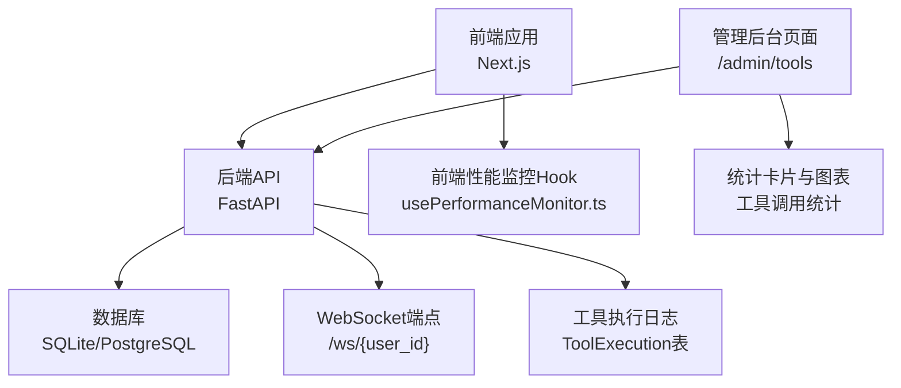
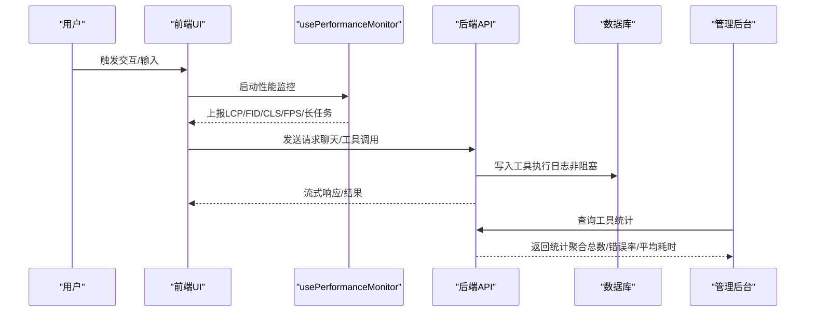
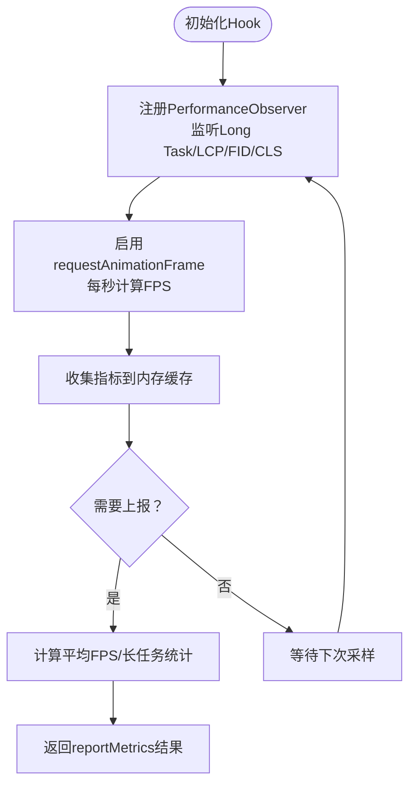
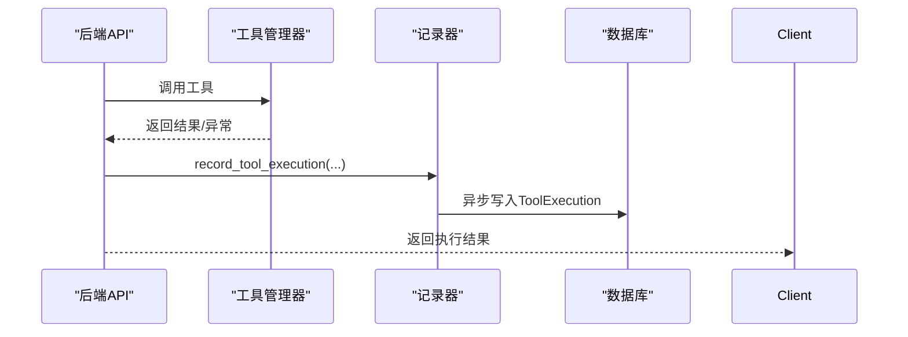
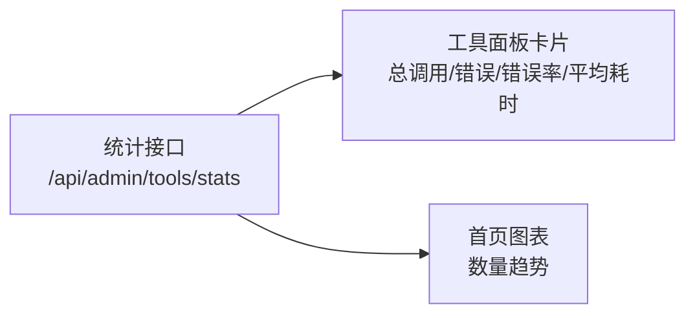
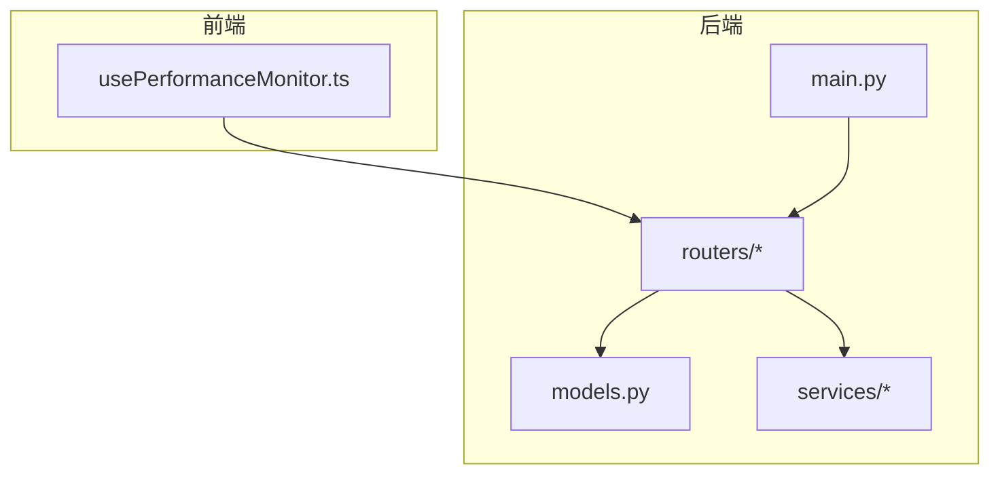

# 性能监控与指标

<cite>
**本文引用的文件**
- [main.py](file://backend/main.py)
- [config.py](file://backend/config.py)
- [models.py](file://backend/models.py)
- [admin_tools.py](file://backend/routers/admin_tools.py)
- [tool_execution_logger.py](file://backend/services/tool_execution_logger.py)
- [usePerformanceMonitor.ts](file://frontend/src/components/ai-assistant/hooks/usePerformanceMonitor.ts)
- [useSocket.ts](file://frontend/src/hooks/useSocket.ts)
- [chats.py](file://backend/routers/chats.py)
- [billing.py](file://backend/services/billing.py)
- [page.tsx（工具面板）](file://backend/admin/src/app/admin/tools/page.tsx)
- [page.tsx（首页仪表板）](file://backend/admin/src/app/admin/page.tsx)
</cite>

## 目录
1. [简介](#简介)
2. [项目结构](#项目结构)
3. [核心组件](#核心组件)
4. [架构总览](#架构总览)
5. [详细组件分析](#详细组件分析)
6. [依赖分析](#依赖分析)
7. [性能考虑](#性能考虑)
8. [故障排查指南](#故障排查指南)
9. [结论](#结论)
10. [附录](#附录)

## 简介
本文件面向Infinite Game项目的性能监控与指标体系，目标是：
- 设计端到端的性能监控方案，覆盖前端用户体验指标（LCP/FID/CLS/FPS/长任务）与后端服务指标（吞吐量、错误率、资源利用率、工具调用耗时）。
- 明确关键性能指标（KPI）定义与计算方法，提供实时监控仪表板与告警配置建议。
- 提供性能瓶颈分析方法与性能回归检测机制，并给出性能测试与基准测试的实施指南。

## 项目结构
本项目采用前后端分离架构：
- 前端基于Next.js，提供AI助手与画布交互界面，内置前端性能监控Hook。
- 后端基于FastAPI，提供聊天、工具调用、账单、剧场等API；通过数据库记录工具执行日志与统计。

图示来源
- [main.py:110-175](file://backend/main.py#L110-L175)
- [usePerformanceMonitor.ts:1-235](file://frontend/src/components/ai-assistant/hooks/usePerformanceMonitor.ts#L1-L235)
- [models.py:484-503](file://backend/models.py#L484-L503)
- [admin_tools.py:74-128](file://backend/routers/admin_tools.py#L74-L128)
- [page.tsx（工具面板）:99-129](file://backend/admin/src/app/admin/tools/page.tsx#L99-L129)

章节来源
- [main.py:110-175](file://backend/main.py#L110-L175)
- [config.py:1-43](file://backend/config.py#L1-L43)

## 核心组件
- 前端性能监控Hook：采集LCP/FID/CLS/FPS与长任务，支持阈值告警回调与自定义上报。
- 后端工具执行日志：非阻塞异步写入数据库，记录工具调用耗时、状态、错误信息等。
- 管理后台统计：提供工具调用总数、错误次数、错误率、平均耗时等指标卡片。
- WebSocket端点：用于实时通信与调试（便于性能观测与回放）。

章节来源
- [usePerformanceMonitor.ts:1-235](file://frontend/src/components/ai-assistant/hooks/usePerformanceMonitor.ts#L1-L235)
- [tool_execution_logger.py:1-89](file://backend/services/tool_execution_logger.py#L1-L89)
- [admin_tools.py:74-128](file://backend/routers/admin_tools.py#L74-L128)
- [page.tsx（工具面板）:99-129](file://backend/admin/src/app/admin/tools/page.tsx#L99-L129)
- [main.py:161-171](file://backend/main.py#L161-L171)

## 架构总览
下图展示从用户交互到后端处理与日志记录的关键流程，以及性能指标的来源与流向。

图示来源
- [usePerformanceMonitor.ts:75-200](file://frontend/src/components/ai-assistant/hooks/usePerformanceMonitor.ts#L75-L200)
- [tool_execution_logger.py:77-89](file://backend/services/tool_execution_logger.py#L77-L89)
- [admin_tools.py:74-128](file://backend/routers/admin_tools.py#L74-L128)

## 详细组件分析

### 前端性能监控Hook（usePerformanceMonitor）
- 支持的指标
  - LCP（最大内容绘制时间）、FID（首次输入延迟）、CLS（累积布局偏移）
  - FPS（帧率，按1秒窗口滑动采样）
  - 长任务（Long Task，超过阈值触发告警）
- 行为特征
  - 使用PerformanceObserver监听Web Vitals指标
  - 使用requestAnimationFrame周期性计算FPS
  - 提供reportMetrics与getMetrics用于汇总与导出
  - 提供useMeasurePerformance用于手动埋点测量特定操作耗时
- 告警与阈值
  - 长任务默认阈值可配置，默认200ms
  - 超阈值触发onLongTask回调并打印警告日志

图示来源
- [usePerformanceMonitor.ts:75-200](file://frontend/src/components/ai-assistant/hooks/usePerformanceMonitor.ts#L75-L200)

章节来源
- [usePerformanceMonitor.ts:1-235](file://frontend/src/components/ai-assistant/hooks/usePerformanceMonitor.ts#L1-L235)

### 工具执行日志与统计（后端）
- 工具执行日志
  - 非阻塞异步写入，失败静默，避免影响主流程
  - 记录字段：工具名、提供者名、耗时（毫秒）、状态、错误信息、上下文（用户/会话/剧场/代理）
- 统计接口
  - 提供总调用次数、错误次数、错误率、平均耗时
  - 支持按工具与提供者分组统计
  - 支持分页查询执行日志并按多维度过滤

图示来源
- [tool_execution_logger.py:77-89](file://backend/services/tool_execution_logger.py#L77-L89)
- [admin_tools.py:74-128](file://backend/routers/admin_tools.py#L74-L128)

章节来源
- [tool_execution_logger.py:1-89](file://backend/services/tool_execution_logger.py#L1-L89)
- [admin_tools.py:74-128](file://backend/routers/admin_tools.py#L74-L128)

### 管理后台统计面板
- 卡片指标
  - 总调用次数、错误次数、错误率、平均耗时
- 数据来源
  - 后端统计接口返回的聚合数据
- 可视化
  - 首页提供柱状图展示数量趋势（示例）

图示来源
- [admin_tools.py:74-128](file://backend/routers/admin_tools.py#L74-L128)
- [page.tsx（工具面板）:99-129](file://backend/admin/src/app/admin/tools/page.tsx#L99-L129)
- [page.tsx（首页仪表板）:75-108](file://backend/admin/src/app/admin/page.tsx#L75-L108)

章节来源
- [page.tsx（工具面板）:99-129](file://backend/admin/src/app/admin/tools/page.tsx#L99-L129)
- [page.tsx（首页仪表板）:75-108](file://backend/admin/src/app/admin/page.tsx#L75-L108)

### WebSocket端点与日志中间件
- WebSocket端点
  - 提供/ws/{user_id}用于实时通信
- 调试中间件
  - 记录请求路径、来源与Authorization头，便于定位性能问题

章节来源
- [main.py:161-171](file://backend/main.py#L161-L171)
- [main.py:119-127](file://backend/main.py#L119-L127)

## 依赖分析
- 前端依赖
  - React Hooks（useEffect/useRef/useCallback）
  - Web Performance APIs（PerformanceObserver/requestAnimationFrame）
- 后端依赖
  - FastAPI（路由、依赖注入、数据库会话）
  - SQLAlchemy（异步会话、模型定义）
  - 日志模块（结构化日志输出）

图示来源
- [main.py:110-175](file://backend/main.py#L110-L175)
- [models.py:1-200](file://backend/models.py#L1-L200)
- [admin_tools.py:1-273](file://backend/routers/admin_tools.py#L1-L273)

章节来源
- [main.py:110-175](file://backend/main.py#L110-L175)
- [models.py:1-200](file://backend/models.py#L1-L200)
- [admin_tools.py:1-273](file://backend/routers/admin_tools.py#L1-L273)

## 性能考虑
- 前端性能
  - 使用usePerformanceMonitor进行持续采集，合理设置长任务阈值与FPS采样频率
  - 对高频渲染区域进行节流与去抖，避免额外的长任务
- 后端性能
  - 工具执行日志采用非阻塞异步写入，降低对主流程的影响
  - 统计接口使用SQL聚合函数，避免全量扫描
- 数据库与连接
  - 启动阶段进行数据库连接重试与迁移，确保稳定性
  - 日志级别控制，减少噪声干扰

章节来源
- [tool_execution_logger.py:77-89](file://backend/services/tool_execution_logger.py#L77-L89)
- [admin_tools.py:74-128](file://backend/routers/admin_tools.py#L74-L128)
- [main.py:49-108](file://backend/main.py#L49-L108)

## 故障排查指南
- 前端性能问题
  - 检查长任务回调是否频繁触发，定位具体attribution来源
  - 关注FPS波动与LCP/FID/CLS异常变化
- 后端性能问题
  - 查看工具执行日志的错误率与平均耗时趋势
  - 结合WebSocket调试中间件日志定位请求路径与鉴权问题
- 账单与配额
  - 若出现“余额不足”或“资金冻结”，检查用户/管理员余额与状态

章节来源
- [usePerformanceMonitor.ts:94-97](file://frontend/src/components/ai-assistant/hooks/usePerformanceMonitor.ts#L94-L97)
- [admin_tools.py:135-187](file://backend/routers/admin_tools.py#L135-L187)
- [main.py:119-127](file://backend/main.py#L119-L127)
- [billing.py:258-285](file://backend/services/billing.py#L258-L285)

## 结论
本项目已具备前端Web Vitals与FPS采集、后端工具执行日志与统计的基础能力。建议在此基础上引入APM与指标平台（如Prometheus/Grafana），将前端指标与后端指标统一汇聚，完善实时仪表板与告警体系，并建立性能回归检测与基准测试流程，以持续保障系统性能与用户体验。

## 附录

### 关键性能指标（KPI）定义与计算
- 响应时间
  - 客户端：LCP/FID/CLS/FPS（前端Hook采集）
  - 服务端：工具调用平均耗时（后端统计接口）
- 吞吐量
  - 服务端：单位时间内工具调用总数（后端统计接口）
- 错误率
  - 服务端：错误次数/总调用次数×100%（后端统计接口）
- 资源利用率
  - CPU/内存/网络：结合APM与系统监控（建议接入Prometheus/Grafana）

章节来源
- [admin_tools.py:74-128](file://backend/routers/admin_tools.py#L74-L128)
- [usePerformanceMonitor.ts:50-73](file://frontend/src/components/ai-assistant/hooks/usePerformanceMonitor.ts#L50-L73)

### 实时监控仪表板配置（Grafana/Prometheus）
- 指标采集
  - 前端：通过埋点上报LCP/FID/CLS/FPS/长任务，建议使用埋点SDK或自建上报接口
  - 后端：暴露指标端点（如metrics），由Prometheus抓取
- 可视化
  - Grafana仪表板展示：响应时间分布、吞吐量曲线、错误率趋势、资源使用TopN
- 告警
  - 阈值：长任务>200ms、错误率>5%、平均耗时>某阈值、FPS<某阈值
  - 级别：警告/严重
  - 通知：邮件/IM/电话

[本节为概念性指导，无需代码来源]

### 告警规则配置
- 长任务：超过阈值触发
- 错误率：连续窗口内错误率超阈值触发
- 响应时间：P95/P99超阈值触发
- 资源：CPU/内存/IO超阈值触发

[本节为概念性指导，无需代码来源]

### 性能瓶颈分析方法
- 前端：定位长任务来源（attribution），优化渲染与脚本执行
- 后端：分析慢查询与热点接口，结合工具调用耗时分布
- 端到端：对比前端指标与后端指标，识别链路瓶颈

[本节为概念性指导，无需代码来源]

### 性能回归检测机制
- 基准：固定场景下的LCP/FID/CLS/FPS与平均耗时基线
- 回归：版本发布后对比指标，若超出阈值则触发回归告警
- 自动化：CI中加入性能测试与阈值校验

[本节为概念性指导，无需代码来源]

### 性能测试策略与基准测试
- 场景设计：典型聊天/工具调用路径，覆盖多智能体协作
- 指标采集：LCP/FID/CLS/FPS、吞吐量、错误率、资源占用
- 基准：在稳定环境运行多次，得到均值与标准差
- 报告：对比不同版本的指标，形成趋势报告

[本节为概念性指导，无需代码来源]