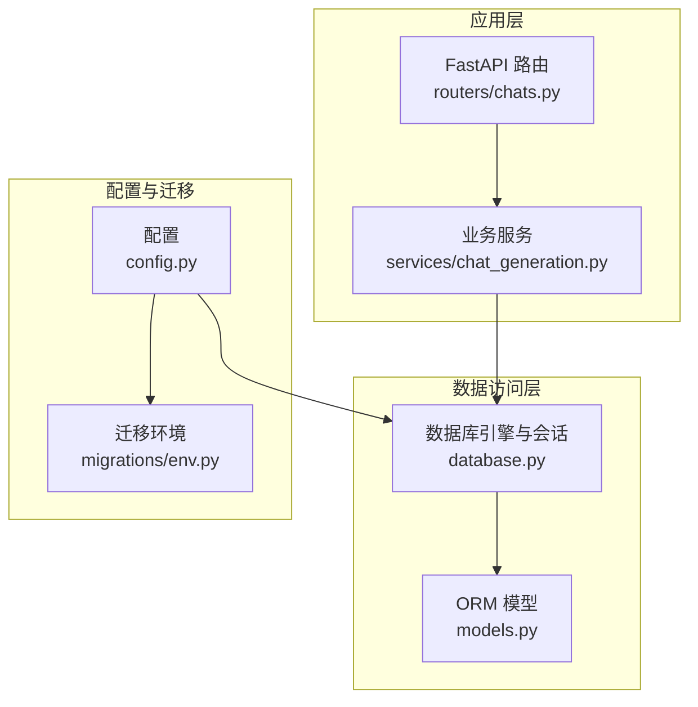
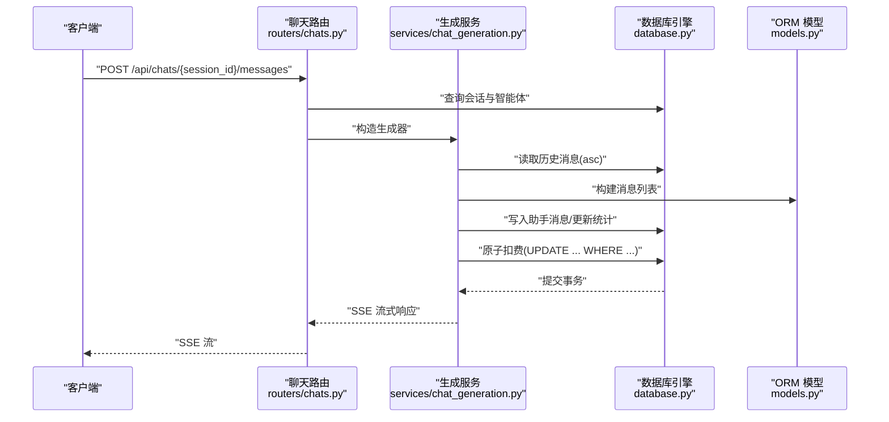
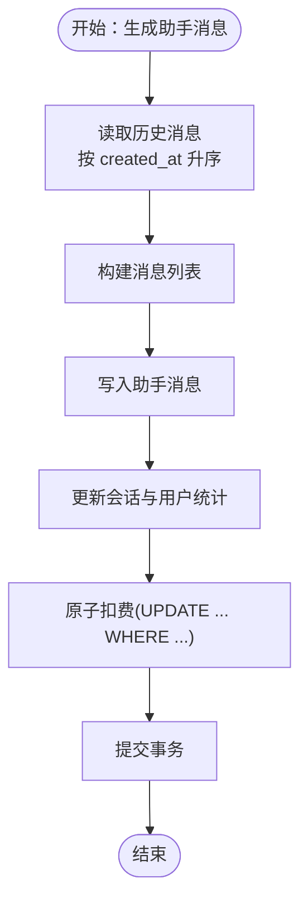
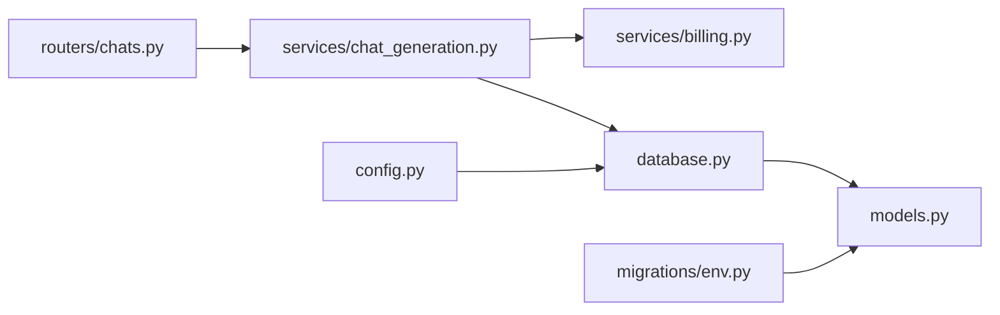

# 数据库性能优化

<cite>
**本文引用的文件**
- [database.py](file://backend/database.py)
- [models.py](file://backend/models.py)
- [config.py](file://backend/config.py)
- [routers/chats.py](file://backend/routers/chats.py)
- [services/chat_generation.py](file://backend/services/chat_generation.py)
- [services/chat_utils.py](file://backend/services/chat_utils.py)
- [services/billing.py](file://backend/services/billing.py)
- [migrations/env.py](file://backend/migrations/env.py)
- [main.py](file://backend/main.py)
</cite>

## 目录
1. [简介](#简介)
2. [项目结构](#项目结构)
3. [核心组件](#核心组件)
4. [架构总览](#架构总览)
5. [详细组件分析](#详细组件分析)
6. [依赖分析](#依赖分析)
7. [性能考量](#性能考量)
8. [故障排查指南](#故障排查指南)
9. [结论](#结论)
10. [附录](#附录)

## 简介
本文件面向 Infinite Game 后端数据库性能优化，聚焦以下目标：
- 数据库查询优化策略：索引设计原则、查询语句优化与连接池配置
- SQLAlchemy 异步查询优化：批量操作、延迟加载与 N+1 问题规避
- 连接池参数：最大连接数、超时与复用策略
- 聊天会话与消息表优化：历史消息分页、token 使用量统计与并发写入
- 监控指标：查询响应时间、连接池利用率与慢查询日志

## 项目结构
后端采用 FastAPI + SQLAlchemy Async + Alembic 迁移的典型结构，数据库层位于 backend/database.py，模型定义于 backend/models.py，路由与服务分别在 routers 与 services 目录，配置位于 config.py。

图表来源
- [database.py:1-45](file://backend/database.py#L1-L45)
- [models.py:1-503](file://backend/models.py#L1-L503)
- [config.py:1-43](file://backend/config.py#L1-L43)
- [routers/chats.py:1-232](file://backend/routers/chats.py#L1-L232)
- [services/chat_generation.py:1-449](file://backend/services/chat_generation.py#L1-L449)
- [migrations/env.py:1-120](file://backend/migrations/env.py#L1-L120)

章节来源
- [database.py:1-45](file://backend/database.py#L1-L45)
- [models.py:1-503](file://backend/models.py#L1-L503)
- [config.py:1-43](file://backend/config.py#L1-L43)
- [routers/chats.py:1-232](file://backend/routers/chats.py#L1-L232)
- [services/chat_generation.py:1-449](file://backend/services/chat_generation.py#L1-L449)
- [migrations/env.py:1-120](file://backend/migrations/env.py#L1-L120)

## 核心组件
- 数据库引擎与连接池：基于 SQLAlchemy Async Engine，SQLite 与 PostgreSQL 双栈支持，WAL 模式与超时优化
- ORM 模型：ChatSession、ChatMessage、Agent、User/Admin、CreditTransaction 等
- 路由与服务：聊天路由负责会话与消息的增删查改；生成服务负责消息历史读取、工具调用与计费
- 配置与迁移：DATABASE_URL、SQLite 绝对路径、Alembic 迁移环境

章节来源
- [database.py:1-45](file://backend/database.py#L1-L45)
- [models.py:178-208](file://backend/models.py#L178-L208)
- [routers/chats.py:25-232](file://backend/routers/chats.py#L25-L232)
- [services/chat_generation.py:29-449](file://backend/services/chat_generation.py#L29-L449)
- [config.py:11-16](file://backend/config.py#L11-L16)
- [migrations/env.py:39-120](file://backend/migrations/env.py#L39-L120)

## 架构总览
异步查询链路：路由接收请求 → 服务读取历史消息 → 写入助手消息与统计 → 原子扣费与事务提交。

图表来源
- [routers/chats.py:127-183](file://backend/routers/chats.py#L127-L183)
- [services/chat_generation.py:29-449](file://backend/services/chat_generation.py#L29-L449)
- [database.py:1-45](file://backend/database.py#L1-L45)
- [models.py:178-208](file://backend/models.py#L178-L208)

## 详细组件分析

### 数据库引擎与连接池配置
- 引擎创建：使用异步引擎，关闭 SQL 日志以降低终端干扰
- 连接池参数：
  - pool_pre_ping：自动重连，提升稳定性
  - pool_size：连接池大小
  - max_overflow：最大溢出连接数
  - connect_args：SQLite 下设置 busy_timeout 与同步级别，WAL 模式减少锁冲突
- 会话工厂：AsyncSessionLocal，expire_on_commit=False 降低对象失效带来的额外查询

优化建议
- 生产环境建议开启 echo=False，结合慢查询日志定位问题
- SQLite 使用 WAL 模式与合理的 busy_timeout，避免“database is locked”
- PostgreSQL 场景建议配合连接池监控与最大连接数限制

章节来源
- [database.py:9-37](file://backend/database.py#L9-L37)
- [database.py:23-31](file://backend/database.py#L23-L31)

### 索引设计原则与查询优化
- 主键与外键：模型普遍使用字符串 UUID 主键，外键关联 ChatSession.id → ChatMessage.session_id
- 常用过滤列建立索引：
  - ChatSession.user_id、theater_id、agent_id
  - ChatMessage.session_id、role
  - User/Admin.id、email
  - ToolConfig.tool_name、VideoTask.xai_task_id、VideoTask.user_id
  - TaskExecution.status、SubTask.status
  - PromptTemplate.name、template_type
- 查询优化实践：
  - 使用 order_by + offset + limit 实现分页（如列出会话）
  - 使用 scalar_one_or_none() 或 first() 避免全表扫描
  - 使用 scoped_query 限制可见范围，避免越权查询

章节来源
- [models.py:181-196](file://backend/models.py#L181-L196)
- [models.py:202-207](file://backend/models.py#L202-L207)
- [models.py:284-288](file://backend/models.py#L284-L288)
- [models.py:415-421](file://backend/models.py#L415-L421)
- [models.py:307-323](file://backend/models.py#L307-L323)
- [models.py:330-349](file://backend/models.py#L330-L349)
- [models.py:356-386](file://backend/models.py#L356-L386)
- [routers/chats.py:48-68](file://backend/routers/chats.py#L48-L68)

### SQLAlchemy 异步查询优化
- 批量写入：生成服务在事务内批量写入助手消息与统计更新，减少往返
- 延迟加载：避免不必要的关联查询，仅在需要时访问关联对象
- N+1 问题规避：
  - 读取历史消息时一次性查询，避免逐条访问
  - 使用 selectinload 或 joinedload（如需要）在复杂场景
- 原子更新：计费模块使用 UPDATE ... WHERE ... 条件更新，避免读-改-写的竞态

章节来源
- [services/chat_generation.py:43-48](file://backend/services/chat_generation.py#L43-L48)
- [services/billing.py:213-288](file://backend/services/billing.py#L213-L288)

### 聊天会话与消息表优化
- 历史消息分页查询：
  - 路由按 created_at 升序获取消息，避免倒序扫描
  - 建议在 ChatMessage.session_id + created_at 上建立复合索引以加速分页
- token 使用量统计优化：
  - 会话级 total_tokens_used、last_round_tokens 与用户/管理员级累计字段
  - 生成服务在事务内原子更新，避免并发写入导致的统计偏差
- 并发写入处理：
  - 使用 AsyncSessionLocal 创建独立会话，避免共享状态
  - 原子扣费与余额更新在同一事务内完成，保证一致性

图表来源
- [services/chat_generation.py:329-404](file://backend/services/chat_generation.py#L329-L404)
- [services/billing.py:178-308](file://backend/services/billing.py#L178-L308)

章节来源
- [routers/chats.py:85-124](file://backend/routers/chats.py#L85-L124)
- [services/chat_generation.py:29-449](file://backend/services/chat_generation.py#L29-L449)
- [models.py:187-196](file://backend/models.py#L187-L196)
- [models.py:60-72](file://backend/models.py#L60-L72)

### 数据库监控指标
- 查询响应时间：通过服务层日志与数据库慢查询日志对比定位热点
- 连接池利用率：观察 pool_size/max_overflow 与 busy 状态，必要时扩容
- 慢查询日志：
  - SQLite：WAL + busy_timeout 已缓解锁争用，仍需关注长时间事务
  - PostgreSQL：开启慢查询阈值与计划缓存分析
- 建议指标：
  - 95 分位查询耗时
  - 连接池等待时间与超时次数
  - 事务回滚率（原子扣费失败）

章节来源
- [main.py:16-30](file://backend/main.py#L16-L30)
- [database.py:9-19](file://backend/database.py#L9-L19)

## 依赖分析
- 路由依赖服务：/api/chats/* 路由依赖 chat_generation 生成服务
- 服务依赖数据库：生成服务与计费服务均使用 AsyncSessionLocal
- 模型依赖基类：所有模型继承自 Base，由 Alembic 管理迁移

图表来源
- [routers/chats.py:1-232](file://backend/routers/chats.py#L1-L232)
- [services/chat_generation.py:1-449](file://backend/services/chat_generation.py#L1-L449)
- [services/billing.py:1-388](file://backend/services/billing.py#L1-L388)
- [database.py:1-45](file://backend/database.py#L1-L45)
- [models.py:1-503](file://backend/models.py#L1-L503)
- [migrations/env.py:1-120](file://backend/migrations/env.py#L1-L120)
- [config.py:1-43](file://backend/config.py#L1-L43)

章节来源
- [routers/chats.py:1-232](file://backend/routers/chats.py#L1-L232)
- [services/chat_generation.py:1-449](file://backend/services/chat_generation.py#L1-L449)
- [services/billing.py:1-388](file://backend/services/billing.py#L1-L388)
- [database.py:1-45](file://backend/database.py#L1-L45)
- [models.py:1-503](file://backend/models.py#L1-L503)
- [migrations/env.py:1-120](file://backend/migrations/env.py#L1-L120)
- [config.py:1-43](file://backend/config.py#L1-L43)

## 性能考量
- 索引与查询
  - 为高频过滤列建立索引，避免全表扫描
  - 使用复合索引覆盖常见查询条件（如 session_id + created_at）
- 连接池
  - 根据 QPS 与峰值并发调整 pool_size 与 max_overflow
  - SQLite 使用 WAL 模式与 busy_timeout，减少锁等待
- 异步与批处理
  - 生成服务在事务内批量写入，减少网络往返
  - 原子更新计费，避免重复 IO
- 缓存与压缩
  - ChatSession.compressed_summary 与 compressed_before_id 用于上下文压缩，减少 LLM 输入长度

章节来源
- [models.py:187-196](file://backend/models.py#L187-L196)
- [services/chat_generation.py:396-402](file://backend/services/chat_generation.py#L396-L402)
- [database.py:23-31](file://backend/database.py#L23-L31)

## 故障排查指南
- 数据库连接失败
  - 检查 DATABASE_URL 与运行时环境
  - 启动阶段具备重试逻辑，观察日志重试次数
- SQLite “database is locked”
  - 确认 WAL 模式与 busy_timeout 设置
  - 避免长时间事务与高并发写入
- 计费失败或余额不一致
  - 核对原子扣费 UPDATE 条件（余额充足、未冻结）
  - 查看 CreditTransaction 记录核对流水
- 慢查询定位
  - 开启慢查询日志，结合 95 分位响应时间分析
  - 重点检查历史消息读取与计费更新路径

章节来源
- [main.py:49-108](file://backend/main.py#L49-L108)
- [database.py:23-31](file://backend/database.py#L23-L31)
- [services/billing.py:213-288](file://backend/services/billing.py#L213-L288)

## 结论
通过合理的索引设计、连接池参数与异步批处理策略，结合原子更新与上下文压缩，Infinite Game 的数据库层可在高并发场景下保持稳定与高性能。建议持续监控慢查询与连接池利用率，按需调整索引与连接池规模。

## 附录
- 配置项参考
  - DATABASE_URL：数据库连接串（默认 SQLite，可切换 PostgreSQL）
  - RUN_MIGRATIONS：启动时是否执行迁移
- 迁移环境
  - Alembic 在线/离线迁移，支持批处理模式

章节来源
- [config.py:11-37](file://backend/config.py#L11-L37)
- [migrations/env.py:39-120](file://backend/migrations/env.py#L39-L120)