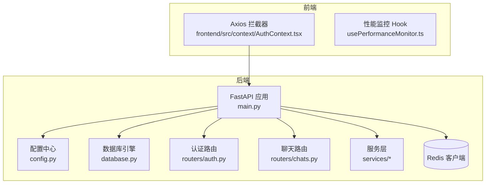
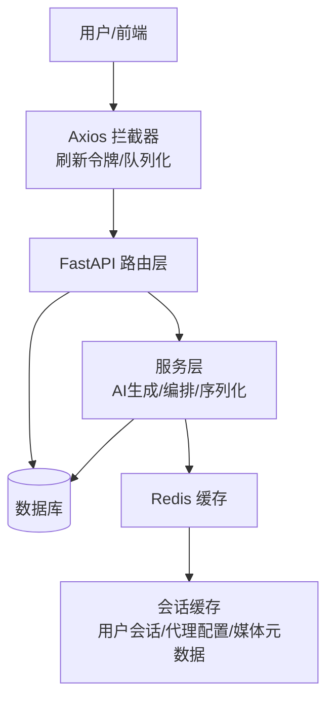
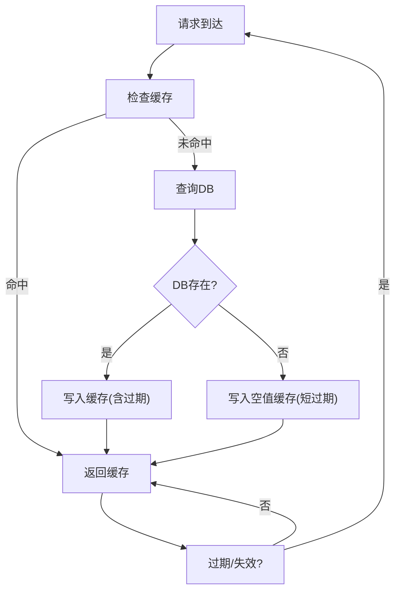
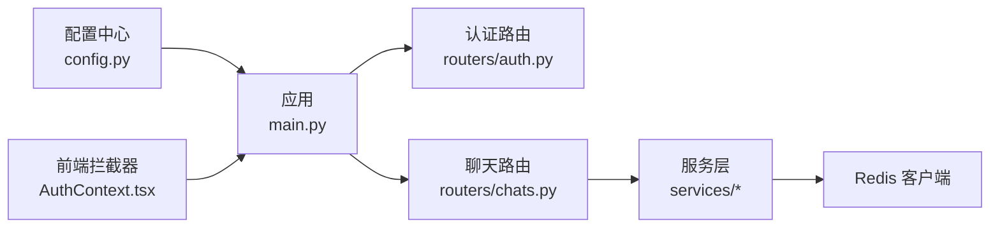

# 缓存策略配置

<cite>
**本文引用的文件**
- [config.py](file://backend/config.py)
- [requirements.txt](file://backend/requirements.txt)
- [main.py](file://backend/main.py)
- [database.py](file://backend/database.py)
- [routers/auth.py](file://backend/routers/auth.py)
- [routers/chats.py](file://backend/routers/chats.py)
- [services/chat_generation.py](file://backend/services/chat_generation.py)
- [services/chat_multi_agent.py](file://backend/services/chat_multi_agent.py)
- [services/chat_utils.py](file://backend/services/chat_utils.py)
- [services/orchestrator.py](file://backend/services/orchestrator.py)
- [models.py](file://backend/models.py)
- [schemas.py](file://backend/schemas.py)
- [frontend/src/context/AuthContext.tsx](file://frontend/src/context/AuthContext.tsx)
- [frontend/src/components/ai-assistant/hooks/usePerformanceMonitor.ts](file://frontend/src/components/ai-assistant/hooks/usePerformanceMonitor.ts)
</cite>

## 目录
1. [简介](#简介)
2. [项目结构](#项目结构)
3. [核心组件](#核心组件)
4. [架构总览](#架构总览)
5. [详细组件分析](#详细组件分析)
6. [依赖分析](#依赖分析)
7. [性能考量](#性能考量)
8. [故障排查指南](#故障排查指南)
9. [结论](#结论)
10. [附录](#附录)

## 简介
本文件面向Infinite Game项目的缓存策略配置，聚焦于Redis缓存架构设计与落地实践，涵盖会话存储、高频查询缓存与AI调用结果缓存三类场景。文档提供缓存键命名规范、过期时间策略、穿透/击穿/雪崩防护、一致性保障机制以及性能监控指标配置建议，帮助在生产环境中稳定、高效地使用缓存。

## 项目结构
后端采用FastAPI + SQLAlchemy异步ORM + Redis客户端的组合；前端通过Axios拦截器与后端交互，并在本地存储访问令牌与用户信息。数据库默认使用SQLite（可选PostgreSQL），并提供Alembic迁移能力。

**图表来源**
- [main.py:110-175](file://backend/main.py#L110-L175)
- [config.py:18-19](file://backend/config.py#L18-L19)
- [database.py:1-44](file://backend/database.py#L1-L44)
- [routers/auth.py:30-136](file://backend/routers/auth.py#L30-L136)
- [routers/chats.py:18-232](file://backend/routers/chats.py#L18-L232)

**章节来源**
- [main.py:110-175](file://backend/main.py#L110-L175)
- [config.py:18-19](file://backend/config.py#L18-L19)
- [database.py:1-44](file://backend/database.py#L1-L44)

## 核心组件
- 配置中心：集中管理Redis地址、JWT过期时间等全局配置。
- 数据库与连接池：SQLite/PostgreSQL统一抽象，连接池参数优化。
- 路由层：认证与聊天接口，承载缓存策略的入口。
- 服务层：AI生成、多智能体编排、消息序列化等业务逻辑。
- 前端拦截器：统一处理401刷新令牌、队列化并发请求。

**章节来源**
- [config.py:7-43](file://backend/config.py#L7-L43)
- [database.py:1-44](file://backend/database.py#L1-L44)
- [routers/auth.py:30-136](file://backend/routers/auth.py#L30-L136)
- [routers/chats.py:18-232](file://backend/routers/chats.py#L18-L232)

## 架构总览
下图展示缓存在系统中的位置与交互路径，重点标注会话、查询与AI结果三类缓存的落点与生命周期。

**图表来源**
- [routers/auth.py:63-129](file://backend/routers/auth.py#L63-L129)
- [routers/chats.py:127-183](file://backend/routers/chats.py#L127-L183)
- [services/chat_generation.py](file://backend/services/chat_generation.py)
- [services/chat_multi_agent.py](file://backend/services/chat_multi_agent.py)
- [services/chat_utils.py](file://backend/services/chat_utils.py)

## 详细组件分析

### 1) Redis缓存架构设计
- 连接与配置
  - Redis地址在配置中心集中管理，便于开发/生产切换。
  - 建议在服务启动时初始化Redis连接池，避免每次请求新建连接。
- 存储模型
  - 会话存储：用户会话、代理配置、媒体文件元数据等。
  - 高频查询缓存：用户权限范围内的聊天会话列表、常用模板等。
  - AI调用结果缓存：流式生成片段、工具调用结果等（需结合SSE/WS）。
- 命名规范
  - 会话类：session:{userId}:{agentId}:{sessionId}
  - 配置类：config:agent:{agentId}, config:user:{userId}
  - 媒体类：media:asset:{assetId}, media:thumb:{assetId}
  - 查询类：query:{scope}:{resource}:{key}
  - 结果类：result:sse:{sessionId}, result:tool:{taskId}

**章节来源**
- [config.py:18-19](file://backend/config.py#L18-L19)
- [main.py:110-175](file://backend/main.py#L110-L175)

### 2) 会话存储缓存策略
- 用户会话缓存
  - 键：session:{userId}:{agentId}:{sessionId}
  - 过期：与JWT访问令牌一致或略长（如ACCESS_TOKEN_EXPIRE_MINUTES + 5分钟）
  - 写入时机：创建会话、切换剧场、更新Agent配置时
  - 失效策略：用户登出、令牌刷新、剧场切换时主动删除
- 代理配置缓存
  - 键：config:agent:{agentId}
  - 过期：短周期（如10-30分钟），配合后台任务定期刷新
  - 写入时机：Agent更新、新增Agent时
  - 失效策略：Agent字段变更时主动删除
- 媒体文件缓存
  - 键：media:asset:{assetId}, media:thumb:{assetId}
  - 过期：长期有效（如30天），或根据资源版本号动态失效
  - 写入时机：媒体上传完成
  - 失效策略：资源删除/替换时主动删除

**章节来源**
- [routers/chats.py:25-45](file://backend/routers/chats.py#L25-L45)
- [routers/chats.py:71-82](file://backend/routers/chats.py#L71-L82)
- [routers/auth.py:63-99](file://backend/routers/auth.py#L63-L99)

### 3) 频繁查询缓存策略
- 场景
  - 获取聊天会话列表（按agent_id/theater_id过滤）
  - 获取Prompt模板列表
  - 获取订阅/额度信息
- 命名与过期
  - 键：query:chat:session_list:{userId}:{filters}
  - 过期：5-10分钟，避免数据陈旧
- 读写策略
  - 先查缓存，未命中再查DB并回填缓存
  - 写入时同时写入缓存，确保一致性

**章节来源**
- [routers/chats.py:48-68](file://backend/routers/chats.py#L48-L68)

### 4) AI调用结果缓存策略
- 场景
  - 流式生成（SSE）过程中的中间片段缓存
  - 工具调用结果缓存（图像/视频生成）
- 命名与过期
  - 键：result:sse:{sessionId}, result:tool:{taskId}
  - 过期：1-5分钟，随会话结束自动失效
- 读写策略
  - 生成过程中增量写入缓存，前端轮询或监听SSE获取
  - 成功后清理过期缓存，失败时设置更短过期时间

**章节来源**
- [routers/chats.py:127-183](file://backend/routers/chats.py#L127-L183)
- [services/chat_generation.py](file://backend/services/chat_generation.py)
- [services/chat_multi_agent.py](file://backend/services/chat_multi_agent.py)

### 5) 缓存穿透、击穿、雪崩防护
- 穿透（查询不存在的数据）
  - 解决：布隆过滤器或空值缓存（带极短过期时间）
- 击穿（热点Key过期）
  - 解决：热点Key永不过期，或使用互斥锁（RedLock）只让一个请求重建
- 雪崩（大面积过期）
  - 解决：过期时间加入随机抖动；分级降级（二级缓存/静态兜底）

**图表来源**
- [routers/chats.py:127-183](file://backend/routers/chats.py#L127-L183)

### 6) 缓存一致性保障机制
- 更新策略（Write-Through）
  - 写DB成功后再写缓存，失败则回滚
- 失效策略（Write-Behind）
  - 写DB成功后删除缓存，下次读取重建
- 幂等性
  - 所有写操作需具备幂等标识，避免重复写入导致脏数据
- 版本控制
  - 对热点对象引入版本号，缓存键携带版本，版本变化即失效

**章节来源**
- [routers/chats.py:127-183](file://backend/routers/chats.py#L127-L183)

### 7) 性能监控指标与配置
- 后端侧
  - Redis命中率：通过客户端统计命令执行次数与命中次数
  - 响应时间：对关键缓存操作（GET/SET/DEL）埋点
  - 内存使用：Redis INFO memory 输出，结合过期淘汰策略
- 前端侧
  - FPS、LCP、FID、CLS等性能指标，辅助评估缓存命中对用户体验的影响
  - 通过Hook记录渲染阶段耗时，定位缓存未命中导致的卡顿

**章节来源**
- [frontend/src/components/ai-assistant/hooks/usePerformanceMonitor.ts:1-235](file://frontend/src/components/ai-assistant/hooks/usePerformanceMonitor.ts#L1-L235)

## 依赖分析
- 配置依赖
  - Redis地址来自配置中心，影响所有缓存模块
- 运行时依赖
  - FastAPI路由依赖数据库与服务层，服务层依赖Redis客户端
- 前端依赖
  - Axios拦截器依赖localStorage中的令牌，间接影响会话缓存有效性

**图表来源**
- [config.py:18-19](file://backend/config.py#L18-L19)
- [main.py:110-175](file://backend/main.py#L110-L175)
- [routers/auth.py:30-136](file://backend/routers/auth.py#L30-L136)
- [routers/chats.py:18-232](file://backend/routers/chats.py#L18-L232)

**章节来源**
- [config.py:18-19](file://backend/config.py#L18-L19)
- [main.py:110-175](file://backend/main.py#L110-L175)

## 性能考量
- 连接池与序列化
  - Redis连接池大小与超时配置需与QPS匹配，避免阻塞
  - 序列化/反序列化开销较大，建议优先使用二进制格式或压缩
- 过期策略
  - 为不同对象设置差异化过期时间，避免“一刀切”
- 监控与告警
  - 建立缓存命中率、延迟、内存使用阈值告警，异常时自动扩容或降级

## 故障排查指南
- 常见问题
  - 缓存未命中：检查键命名、过期时间、序列化格式
  - 401未授权：确认前端拦截器是否正确刷新令牌并重试
  - 会话丢失：核对会话缓存是否与JWT过期时间同步
- 排查步骤
  - 后端：开启路由层日志，定位缓存读写路径
  - 前端：检查localStorage状态与拦截器队列行为
  - Redis：查看KEYS与TTL，确认键空间与过期策略

**章节来源**
- [frontend/src/context/AuthContext.tsx:129-171](file://frontend/src/context/AuthContext.tsx#L129-L171)
- [routers/auth.py:102-129](file://backend/routers/auth.py#L102-L129)

## 结论
通过明确的键命名规范、差异化的过期策略、完善的穿透/击穿/雪崩防护与一致性保障机制，Infinite Game可在高并发场景下稳定利用Redis提升响应速度与用户体验。建议在上线前完成压测与监控体系搭建，持续优化缓存命中率与资源占用。

## 附录
- 命名规范速查
  - 会话：session:{userId}:{agentId}:{sessionId}
  - 配置：config:agent:{agentId}, config:user:{userId}
  - 媒体：media:asset:{assetId}, media:thumb:{assetId}
  - 查询：query:{scope}:{resource}:{key}
  - 结果：result:sse:{sessionId}, result:tool:{taskId}
- 过期时间建议
  - 用户会话：与ACCESS_TOKEN_EXPIRE_MINUTES一致或略长
  - 代理配置：10-30分钟
  - 媒体资源：7-30天
  - 流式结果：1-5分钟