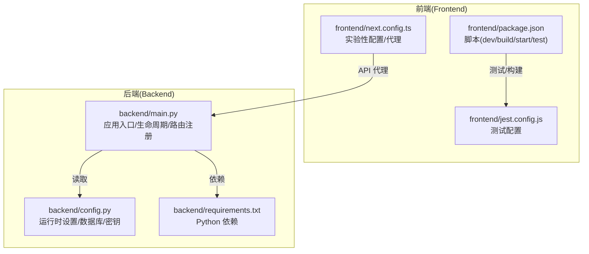
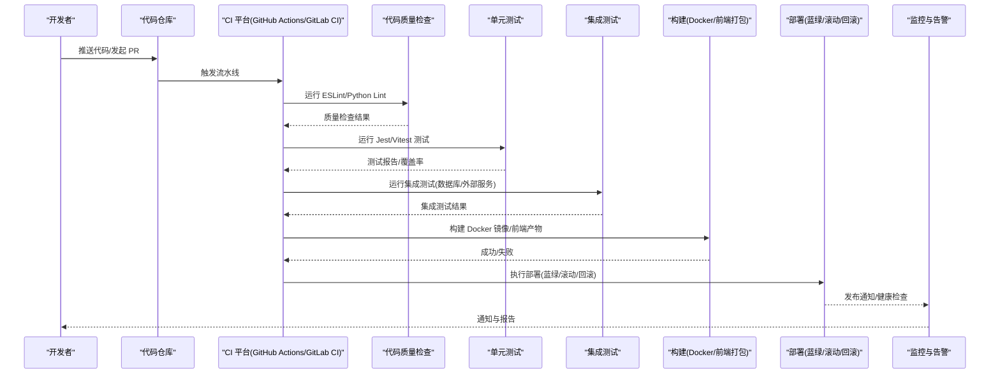
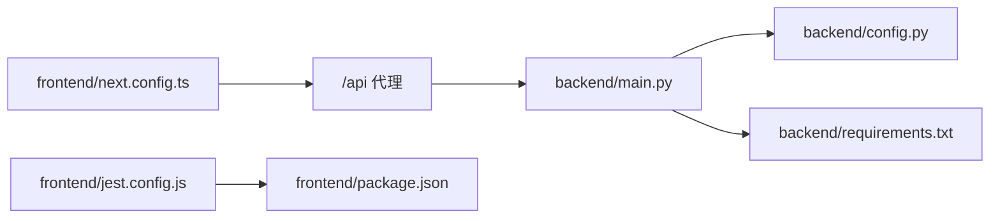

# CI/CD流水线

<cite>
**本文档引用的文件**
- [backend/main.py](file://backend/main.py)
- [backend/config.py](file://backend/config.py)
- [backend/requirements.txt](file://backend/requirements.txt)
- [backend/admin/vitest.config.ts](file://backend/admin/vitest.config.ts)
- [frontend/package.json](file://frontend/package.json)
- [frontend/jest.config.js](file://frontend/jest.config.js)
- [frontend/next.config.ts](file://frontend/next.config.ts)
</cite>

## 目录
1. [简介](#简介)
2. [项目结构](#项目结构)
3. [核心组件](#核心组件)
4. [架构总览](#架构总览)
5. [详细组件分析](#详细组件分析)
6. [依赖分析](#依赖分析)
7. [性能考虑](#性能考虑)
8. [故障排除指南](#故障排除指南)
9. [结论](#结论)
10. [附录](#附录)

## 简介
本文件为 Infinite Game 项目提供端到端的 CI/CD 流水线配置与实施指南，覆盖以下方面：
- GitHub Actions 或 GitLab CI 的配置思路与步骤
- 代码质量检查、单元测试与集成测试流程
- 自动化构建脚本：Docker 镜像构建、前端打包与依赖安装
- 自动化部署策略：蓝绿部署、滚动更新与回滚机制
- 环境管理：开发、测试、生产环境的配置差异
- 安全扫描与漏洞检测、代码覆盖率报告、发布通知机制

本指南以仓库现有配置为基础，结合 Next.js 前端与 FastAPI 后端的实际能力，给出可落地的流水线设计。

## 项目结构
Infinite Game 采用前后端分离架构：
- 前端：Next.js 应用，使用 TypeScript、TailwindCSS、Jest 进行测试与构建
- 后端：FastAPI 应用，使用 Pydantic 设置管理、SQLAlchemy 异步 ORM、Alembic 迁移
- 配置：前端通过 next.config.ts 暴露实验性配置与 API 代理；后端通过 config.py 提供运行时设置

图表来源
- [frontend/package.json:1-94](file://frontend/package.json#L1-L94)
- [frontend/jest.config.js:1-20](file://frontend/jest.config.js#L1-L20)
- [frontend/next.config.ts:1-21](file://frontend/next.config.ts#L1-L21)
- [backend/main.py:1-175](file://backend/main.py#L1-L175)
- [backend/config.py:1-43](file://backend/config.py#L1-L43)
- [backend/requirements.txt:1-29](file://backend/requirements.txt#L1-L29)

章节来源
- [frontend/package.json:1-94](file://frontend/package.json#L1-L94)
- [frontend/jest.config.js:1-20](file://frontend/jest.config.js#L1-L20)
- [frontend/next.config.ts:1-21](file://frontend/next.config.ts#L1-L21)
- [backend/main.py:1-175](file://backend/main.py#L1-L175)
- [backend/config.py:1-43](file://backend/config.py#L1-L43)
- [backend/requirements.txt:1-29](file://backend/requirements.txt#L1-L29)

## 核心组件
- 前端测试与构建
  - 使用 Jest 进行单元测试与快照测试，配置位于 jest.config.js，并通过 package.json 中的 test 脚本触发
  - Next.js 构建与启动脚本由 package.json 提供，支持开发、构建与生产启动
- 后端测试与质量
  - 后端 admin 子项目使用 Vitest 进行单元测试，配置位于 vitest.config.ts
  - 代码质量检查可通过 ESLint（前端）与 Python lint 工具（后端）实现
- 部署与运行
  - 后端通过 main.py 启动 Uvicorn 服务，支持生命周期钩子与数据库迁移
  - 前端通过 next.config.ts 将 /api/* 代理至后端 127.0.0.1:8000

章节来源
- [frontend/package.json:1-94](file://frontend/package.json#L1-L94)
- [frontend/jest.config.js:1-20](file://frontend/jest.config.js#L1-L20)
- [backend/admin/vitest.config.ts:1-16](file://backend/admin/vitest.config.ts#L1-L16)
- [backend/main.py:1-175](file://backend/main.py#L1-L175)

## 架构总览
下图展示 CI/CD 流水线的关键阶段与组件交互：

## 详细组件分析

### 代码质量检查
- 前端
  - 使用 ESLint（Next.js 内置配置），可在 CI 中执行 lint 校验
  - 建议在流水线中添加 ESLint 正式检查步骤，确保规则一致性
- 后端
  - 可引入 Python Linter（如 flake8、ruff）与类型检查（mypy）
  - 在 CI 中统一执行，失败即阻断合并

章节来源
- [frontend/package.json:1-94](file://frontend/package.json#L1-L94)
- [frontend/next.config.ts:1-21](file://frontend/next.config.ts#L1-L21)

### 单元测试与覆盖率
- 前端
  - Jest 配置位于 jest.config.js，支持模块别名映射与测试环境初始化
  - 建议在 CI 中生成覆盖率报告（如 JUnit XML 与覆盖率 HTML），用于质量门禁
- 后端 admin
  - Vitest 配置位于 vitest.config.ts，使用 happy-dom 环境与全局 setup 文件
  - 建议启用覆盖率统计与报告导出

章节来源
- [frontend/jest.config.js:1-20](file://frontend/jest.config.js#L1-L20)
- [backend/admin/vitest.config.ts:1-16](file://backend/admin/vitest.config.ts#L1-L16)

### 集成测试流程
- 建议在 CI 中新增集成测试阶段，包含：
  - 数据库准备（SQLite/PostgreSQL）
  - 后端服务启动（Uvicorn）
  - 前端代理配置（next.config.ts 的 /api 代理）
  - 对关键 API（登录、资源访问、工具调用等）进行端到端验证
- 失败时输出日志与截图（如适用），便于定位问题

章节来源
- [backend/main.py:1-175](file://backend/main.py#L1-L175)
- [frontend/next.config.ts:1-21](file://frontend/next.config.ts#L1-L21)

### 自动化构建脚本
- Docker 镜像构建（建议）
  - 基础镜像选择：python:3.11-alpine（后端）与 node:18-alpine（前端）
  - 步骤：安装系统依赖 → 安装 Python/Node 依赖 → 构建前端产物 → 打包后端静态资源
  - 健康检查：暴露 / 与 /docs（如有）端点
- 前端打包
  - 使用 package.json 中的 build 脚本，输出静态资源至 .next
  - next.config.ts 中的实验性配置与代理需在容器内生效
- 依赖安装
  - 后端：pip install -r requirements.txt
  - 前端：npm ci 或 yarn install（根据项目偏好）

章节来源
- [backend/requirements.txt:1-29](file://backend/requirements.txt#L1-L29)
- [frontend/package.json:1-94](file://frontend/package.json#L1-L94)
- [frontend/next.config.ts:1-21](file://frontend/next.config.ts#L1-L21)

### 自动化部署策略
- 蓝绿部署
  - 准备两套实例：蓝色（当前生产）与绿色（新版本）
  - 先部署绿色实例并通过健康检查，再切换流量，最后停止蓝色实例
- 滚动更新
  - 分批替换实例，每批更新后进行健康检查，失败则回滚该批次
- 回滚机制
  - 记录镜像版本与部署时间，失败时自动回滚至上一个稳定版本
  - 结合发布通知，向团队发送回滚事件与原因

（本节为通用实践说明，不直接分析具体文件）

### 环境管理
- 开发环境
  - 使用本地 SQLite（config.py 默认），便于快速迭代
  - 前端 dev 模式监听端口 3666，后端 dev 模式监听 8000
- 测试环境
  - 使用独立 PostgreSQL，开启 Alembic 迁移（RUN_MIGRATIONS=True）
  - 配置独立的 .env，隔离密钥与数据库连接
- 生产环境
  - 使用生产级数据库与 Redis 缓存
  - 严格密钥管理（环境变量注入），关闭调试日志级别
  - 启用 HTTPS、CORS 白名单与限流策略

章节来源
- [backend/config.py:1-43](file://backend/config.py#L1-L43)
- [backend/main.py:1-175](file://backend/main.py#L1-L175)
- [frontend/next.config.ts:1-21](file://frontend/next.config.ts#L1-L21)

### 安全扫描与漏洞检测
- 依赖扫描
  - 后端：pip-audit 或安全扫描工具（如 safety、bandit）扫描 requirements.txt
  - 前端：npm audit 或类似工具扫描 package.json
- 代码扫描
  - ESLint 与 SonarQube（可选）对前端代码进行静态分析
  - Python SAST（如 semgrep、codeql）扫描潜在安全问题
- 漏洞修复
  - 将扫描结果纳入质量门禁，未修复不得合并

（本节为通用实践说明，不直接分析具体文件）

### 代码覆盖率报告
- 前端：Jest 支持覆盖率输出，建议生成 HTML 报告并在 CI 中归档
- 后端：Vitest 支持覆盖率统计，建议导出 Cobertura/LCOV 格式并与平台集成
- 质量门禁：设定最小覆盖率阈值，低于阈值阻断合并

（本节为通用实践说明，不直接分析具体文件）

### 发布通知机制
- 通知渠道：Slack、Teams、邮件或 Webhook
- 通知内容：版本号、变更摘要、部署状态、回滚记录
- 触发时机：成功/失败/回滚

（本节为通用实践说明，不直接分析具体文件）

## 依赖分析
- 前后端耦合点
  - 前端 next.config.ts 将 /api/* 代理至后端 127.0.0.1:8000，需保证后端可用
  - 后端 main.py 注册多个路由模块，需在集成测试中覆盖关键路径
- 配置依赖
  - 后端 config.py 提供数据库、Redis、JWT、AI 模型等默认值，需在不同环境正确覆盖
  - 前端 jest.config.js 与 next.config.ts 影响测试与构建行为

图表来源
- [frontend/next.config.ts:1-21](file://frontend/next.config.ts#L1-L21)
- [backend/main.py:1-175](file://backend/main.py#L1-L175)
- [backend/config.py:1-43](file://backend/config.py#L1-L43)
- [backend/requirements.txt:1-29](file://backend/requirements.txt#L1-L29)
- [frontend/jest.config.js:1-20](file://frontend/jest.config.js#L1-L20)
- [frontend/package.json:1-94](file://frontend/package.json#L1-L94)

章节来源
- [frontend/next.config.ts:1-21](file://frontend/next.config.ts#L1-L21)
- [backend/main.py:1-175](file://backend/main.py#L1-L175)
- [backend/config.py:1-43](file://backend/config.py#L1-L43)
- [backend/requirements.txt:1-29](file://backend/requirements.txt#L1-L29)
- [frontend/jest.config.js:1-20](file://frontend/jest.config.js#L1-L20)
- [frontend/package.json:1-94](file://frontend/package.json#L1-L94)

## 性能考虑
- 构建缓存
  - 为 npm/yarn 与 pip 依赖建立缓存层，减少重复下载时间
- 并行任务
  - 将质量检查、测试与构建阶段并行执行，缩短总耗时
- 镜像优化
  - 使用多阶段构建，减小最终镜像体积
- 健康检查
  - 在容器中增加健康检查端点，配合滚动更新降低停机风险

（本节为通用指导，不直接分析具体文件）

## 故障排除指南
- 前端测试失败
  - 检查 jest.config.js 的模块别名与测试环境配置
  - 确认 package.json 中的 test 脚本与依赖版本一致
- 后端迁移失败
  - 检查 config.py 中 DATABASE_URL 与 RUN_MIGRATIONS 设置
  - 若出现临时表残留，参考 main.py 中的迁移清理逻辑
- API 代理异常
  - 确认 next.config.ts 的 /api 代理目标与端口
  - 检查后端 CORS 配置与中间件是否正确加载

章节来源
- [frontend/jest.config.js:1-20](file://frontend/jest.config.js#L1-L20)
- [frontend/package.json:1-94](file://frontend/package.json#L1-L94)
- [backend/config.py:1-43](file://backend/config.py#L1-L43)
- [backend/main.py:1-175](file://backend/main.py#L1-L175)
- [frontend/next.config.ts:1-21](file://frontend/next.config.ts#L1-L21)

## 结论
通过将代码质量检查、单元测试、集成测试与自动化构建部署整合进 CI/CD 流水线，Infinite Game 可以显著提升交付效率与稳定性。结合蓝绿部署、滚动更新与回滚机制，以及安全扫描、覆盖率报告与发布通知，能够形成闭环的质量保障体系。建议从质量门禁与依赖扫描起步，逐步完善测试与部署策略。

## 附录
- 建议的流水线阶段清单
  - 代码质量检查（ESLint、Python Lint）
  - 单元测试（Jest、Vitest）与覆盖率收集
  - 集成测试（数据库/外部服务）
  - 构建（Docker 镜像/前端产物）
  - 安全扫描（pip/npm audit）
  - 部署（蓝绿/滚动/回滚）
  - 发布通知与归档

（本节为通用附录，不直接分析具体文件）