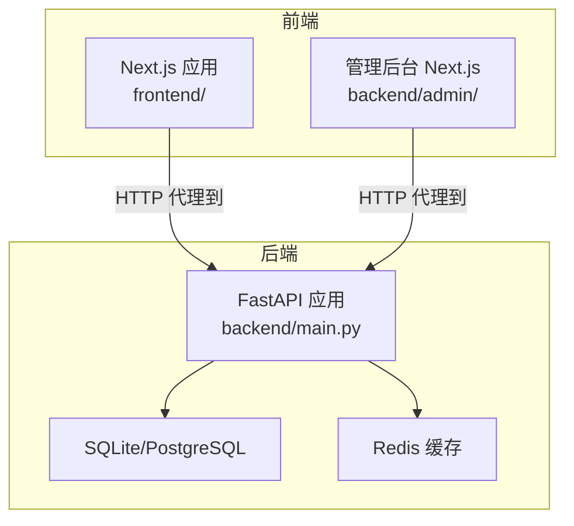
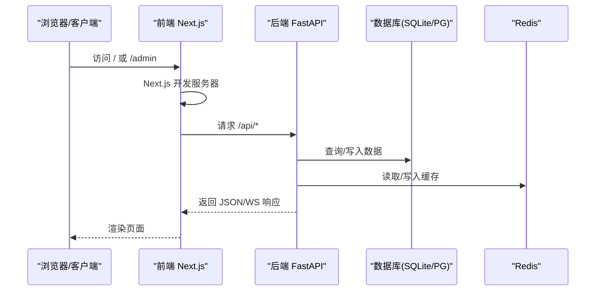
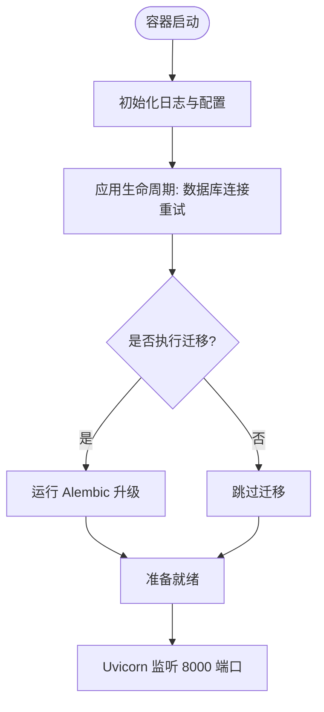
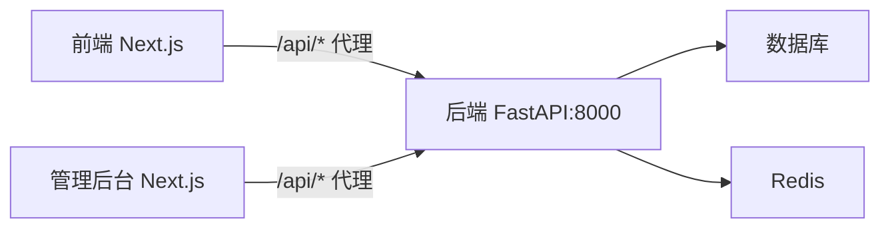
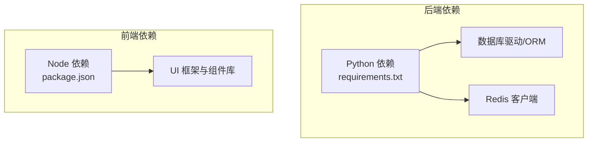

# Docker容器化部署

<cite>
**本文档引用的文件**
- [backend/main.py](file://backend/main.py)
- [backend/requirements.txt](file://backend/requirements.txt)
- [backend/config.py](file://backend/config.py)
- [backend/database.py](file://backend/database.py)
- [backend/admin/next.config.js](file://backend/admin/next.config.js)
- [frontend/next.config.ts](file://frontend/next.config.ts)
- [frontend/package.json](file://frontend/package.json)
- [frontend/tsconfig.json](file://frontend/tsconfig.json)
</cite>

## 目录
1. [简介](#简介)
2. [项目结构](#项目结构)
3. [核心组件](#核心组件)
4. [架构总览](#架构总览)
5. [详细组件分析](#详细组件分析)
6. [依赖分析](#依赖分析)
7. [性能考虑](#性能考虑)
8. [故障排除指南](#故障排除指南)
9. [结论](#结论)
10. [附录](#附录)

## 简介
本文件为 Infinite Game 提供完整的 Docker 容器化部署方案，覆盖 Python 后端与 Next.js 前端的分离构建、多阶段镜像优化、服务编排、网络与卷挂载、环境变量与健康检查、日志管理以及容器安全最佳实践。目标是帮助运维与开发团队以可重复、可扩展的方式部署该系统。

## 项目结构
Infinite Game 采用前后端分离架构：
- 后端基于 FastAPI，提供 REST API、WebSocket、数据库访问与业务逻辑。
- 前端基于 Next.js，通过 API 路由代理访问后端接口。
- 管理后台同样基于 Next.js，通过路由代理访问后端管理接口。
- 数据库默认使用 SQLite 文件，也可配置 PostgreSQL；Redis 用于缓存与会话。

图表来源
- [backend/main.py:110-175](file://backend/main.py#L110-L175)
- [frontend/next.config.ts:10-17](file://frontend/next.config.ts#L10-L17)
- [backend/admin/next.config.js:4-11](file://backend/admin/next.config.js#L4-L11)

章节来源
- [backend/main.py:110-175](file://backend/main.py#L110-L175)
- [frontend/next.config.ts:10-17](file://frontend/next.config.ts#L10-L17)
- [backend/admin/next.config.js:4-11](file://backend/admin/next.config.js#L4-L11)

## 核心组件
- 后端服务（FastAPI）
  - 主入口：[backend/main.py:173-175](file://backend/main.py#L173-L175)
  - 应用生命周期与数据库迁移：[backend/main.py:49-108](file://backend/main.py#L49-L108)
  - CORS 与路由注册：[backend/main.py:130-153](file://backend/main.py#L130-L153)
  - 日志配置：[backend/main.py:15-30](file://backend/main.py#L15-L30)
- 数据库与连接池
  - 异步引擎与 SQLite 优化：[backend/database.py:9-31](file://backend/database.py#L9-L31)
  - 会话工厂与依赖注入：[backend/database.py:33-45](file://backend/database.py#L33-L45)
- 配置管理
  - 环境变量与默认值：[backend/config.py:7-42](file://backend/config.py#L7-L42)
- 前端与代理
  - 前端 Next.js 配置与 API 代理：[frontend/next.config.ts:10-17](file://frontend/next.config.ts#L10-L17)
  - 管理后台 Next.js 配置与 API 代理：[backend/admin/next.config.js:4-11](file://backend/admin/next.config.js#L4-L11)
- 依赖清单
  - 后端 Python 依赖：[backend/requirements.txt:1-29](file://backend/requirements.txt#L1-L29)
  - 前端 Node 依赖：[frontend/package.json:13-69](file://frontend/package.json#L13-L69)

章节来源
- [backend/main.py:15-175](file://backend/main.py#L15-L175)
- [backend/database.py:9-45](file://backend/database.py#L9-L45)
- [backend/config.py:7-42](file://backend/config.py#L7-L42)
- [frontend/next.config.ts:10-17](file://frontend/next.config.ts#L10-L17)
- [backend/admin/next.config.js:4-11](file://backend/admin/next.config.js#L4-L11)
- [backend/requirements.txt:1-29](file://backend/requirements.txt#L1-L29)
- [frontend/package.json:13-69](file://frontend/package.json#L13-L69)

## 架构总览
下图展示容器化部署中的服务交互与数据流：

图表来源
- [frontend/next.config.ts:10-17](file://frontend/next.config.ts#L10-L17)
- [backend/admin/next.config.js:4-11](file://backend/admin/next.config.js#L4-L11)
- [backend/main.py:130-153](file://backend/main.py#L130-L153)
- [backend/database.py:9-31](file://backend/database.py#L9-L31)

## 详细组件分析

### 后端服务（FastAPI）容器化要点
- 入口与监听
  - 使用 Uvicorn 运行应用，监听 0.0.0.0:8000：[backend/main.py:173-175](file://backend/main.py#L173-L175)
- 生命周期与数据库
  - 启动时进行数据库连接重试与迁移（可选）：[backend/main.py:49-108](file://backend/main.py#L49-L108)
  - SQLite 优化（WAL、busy_timeout、synchronous）：[backend/database.py:24-31](file://backend/database.py#L24-L31)
- 路由与中间件
  - 注册所有业务路由与 CORS 中间件：[backend/main.py:130-153](file://backend/main.py#L130-L153)
- 日志
  - 控制台输出与 SQLAlchemy/uvicorn 日志级别：[backend/main.py:15-30](file://backend/main.py#L15-L30)

图表来源
- [backend/main.py:49-108](file://backend/main.py#L49-L108)
- [backend/main.py:173-175](file://backend/main.py#L173-L175)

章节来源
- [backend/main.py:49-175](file://backend/main.py#L49-L175)
- [backend/database.py:9-31](file://backend/database.py#L9-L31)

### 前端与管理后台容器化要点
- API 代理
  - 前端 Next.js 将 /api/* 代理到 http://127.0.0.1:8000/api：[frontend/next.config.ts:10-17](file://frontend/next.config.ts#L10-L17)
  - 管理后台 Next.js 同样将 /api/* 代理到 http://127.0.0.1:8000/api：[backend/admin/next.config.js:4-11](file://backend/admin/next.config.js#L4-L11)
- 构建与运行
  - 前端脚本定义了 dev/build/start 等命令：[frontend/package.json:5-12](file://frontend/package.json#L5-L12)
  - TypeScript 配置路径别名与严格模式：[frontend/tsconfig.json:21-23](file://frontend/tsconfig.json#L21-L23)

图表来源
- [frontend/next.config.ts:10-17](file://frontend/next.config.ts#L10-L17)
- [backend/admin/next.config.js:4-11](file://backend/admin/next.config.js#L4-L11)

章节来源
- [frontend/next.config.ts:10-17](file://frontend/next.config.ts#L10-L17)
- [backend/admin/next.config.js:4-11](file://backend/admin/next.config.js#L4-L11)
- [frontend/package.json:5-12](file://frontend/package.json#L5-L12)
- [frontend/tsconfig.json:21-23](file://frontend/tsconfig.json#L21-L23)

### 配置与环境变量
- 数据库
  - 默认 SQLite（绝对路径）或 PostgreSQL（可选）：[backend/config.py:14-16](file://backend/config.py#L14-L16)
  - SQLite PRAGMA 优化参数：[backend/database.py:24-31](file://backend/database.py#L24-L31)
- 缓存
  - Redis 地址默认本地：[backend/config.py:19](file://backend/config.py#L19)
- 认证与密钥
  - JWT 密钥与算法默认值（生产需覆盖）：[backend/config.py:27-29](file://backend/config.py#L27-L29)
- 迁移开关
  - 是否在启动时运行迁移：[backend/config.py:37](file://backend/config.py#L37)
- AI 模型密钥
  - OpenAI、Claude、Gemini 等 API Key（生产需覆盖）：[backend/config.py:22-24](file://backend/config.py#L22-L24)

章节来源
- [backend/config.py:14-37](file://backend/config.py#L14-L37)
- [backend/database.py:24-31](file://backend/database.py#L24-L31)

## 依赖分析
- 后端依赖
  - Web 框架与 ASGI 服务器：FastAPI、Uvicorn
  - 数据库与 ORM：SQLAlchemy、asyncpg/psycopg2、aiosqlite、Alembic
  - 缓存：Redis
  - 工具库：Pydantic、python-jose、bcrypt、Pillow、requests、httpx 等
  - 参考清单：[backend/requirements.txt:1-29](file://backend/requirements.txt#L1-L29)
- 前端依赖
  - 框架与 UI：Next.js、Ant Design、Radix UI、TailwindCSS
  - 工具与类型：Axios、Zustand、UUID、React 生态
  - 参考清单：[frontend/package.json:13-69](file://frontend/package.json#L13-L69)

图表来源
- [backend/requirements.txt:1-29](file://backend/requirements.txt#L1-L29)
- [frontend/package.json:13-69](file://frontend/package.json#L13-L69)

章节来源
- [backend/requirements.txt:1-29](file://backend/requirements.txt#L1-L29)
- [frontend/package.json:13-69](file://frontend/package.json#L13-L69)

## 性能考虑
- 数据库连接池与 SQLite 优化
  - 连接池参数与 SQLite WAL/超时设置有助于提升并发与稳定性：[backend/database.py:9-31](file://backend/database.py#L9-L31)
- 日志级别控制
  - 降低 SQLAlchemy 与 uvicorn 访问日志噪声，保留应用日志：[backend/main.py:15-30](file://backend/main.py#L15-L30)
- 迁移与启动时延
  - 启动时重试数据库连接与迁移，避免冷启动失败：[backend/main.py:49-96](file://backend/main.py#L49-L96)

章节来源
- [backend/database.py:9-31](file://backend/database.py#L9-L31)
- [backend/main.py:15-30](file://backend/main.py#L15-L30)
- [backend/main.py:49-96](file://backend/main.py#L49-L96)

## 故障排除指南
- 数据库连接失败
  - 后端在启动时进行多次重试并打印重试信息：[backend/main.py:92-96](file://backend/main.py#L92-L96)
  - 若使用 SQLite，确认 DB 文件路径与权限正确：[backend/config.py:5](file://backend/config.py#L5)
- 迁移失败
  - 启动时尝试运行 Alembic 升级，失败后清理临时表再重试：[backend/main.py:62-86](file://backend/main.py#L62-L86)
- CORS 与代理
  - 确认前端/管理后台 Next.js 代理指向后端地址：[frontend/next.config.ts:10-17](file://frontend/next.config.ts#L10-L17)、[backend/admin/next.config.js:4-11](file://backend/admin/next.config.js#L4-L11)
- 日志定位
  - 使用 INFO 级别日志查看请求与认证头调试信息：[backend/main.py:115-126](file://backend/main.py#L115-L126)

章节来源
- [backend/main.py:62-96](file://backend/main.py#L62-L96)
- [backend/config.py:5](file://backend/config.py#L5)
- [frontend/next.config.ts:10-17](file://frontend/next.config.ts#L10-L17)
- [backend/admin/next.config.js:4-11](file://backend/admin/next.config.js#L4-L11)
- [backend/main.py:115-126](file://backend/main.py#L115-L126)

## 结论
通过分离构建与多阶段优化，结合合理的环境变量、健康检查与日志策略，Infinite Game 可实现稳定、可扩展的容器化部署。建议在生产环境中启用 PostgreSQL、外部 Redis、严格的密钥管理与非 root 用户运行，并配合持久化卷与网络隔离以满足安全与可靠性要求。

## 附录

### Docker 镜像构建策略（多阶段）
- 目标
  - 最小化镜像体积、缩短构建时间、提升安全性与可维护性。
- 建议分层
  - 基础层：官方 Python 与 Node LTS（仅安装构建工具链）
  - 依赖安装层：分别安装 Python 与 Node 依赖
  - 构建层：编译前端与后端产物
  - 运行层：仅包含运行时依赖与产物，启用非 root 用户
- 优化点
  - 使用 .dockerignore 排除不必要的文件
  - 多阶段复制构建产物，避免源码进入最终镜像
  - 使用只读根文件系统与最小权限

### docker-compose.yml 服务编排建议
- 服务
  - backend：运行 FastAPI，暴露 8000
  - frontend：运行 Next.js 开发/生产服务器，暴露 3666
  - redis：缓存服务
  - db（可选）：PostgreSQL 或 SQLite 文件卷
- 网络
  - 自定义桥接网络，服务间通过服务名通信
- 卷
  - SQLite 文件卷映射至持久存储
  - 媒体资源目录映射至宿主机
- 环境变量
  - DATABASE_URL、REDIS_URL、JWT_SECRET_KEY、各 AI 模型密钥
- 健康检查
  - 对后端 /（或 /health）进行轮询检查
- 日志
  - 使用 Docker 日志驱动集中收集 stdout/stderr

### 环境变量清单
- 数据库
  - DATABASE_URL：PostgreSQL 或 SQLite 绝对路径
- 缓存
  - REDIS_URL：Redis 连接字符串
- 认证
  - JWT_SECRET_KEY：生产环境必须覆盖
  - JWT_ALGORITHM：算法名称
- AI 模型
  - OPENAI_API_KEY、CLAUDE_API_KEY、GEMINI_API_KEY
- 运行选项
  - RUN_MIGRATIONS：是否在启动时执行迁移
- 端口与主机
  - BACKEND_HOST、BACKEND_PORT、FRONTEND_PORT

章节来源
- [backend/config.py:14-37](file://backend/config.py#L14-L37)

### 健康检查与日志管理
- 健康检查
  - GET /（或自定义 /health）返回 200 表示健康
- 日志
  - 后端使用标准输出，按需接入集中式日志系统（如 ELK/Fluentd）

### 容器安全最佳实践
- 非 root 用户运行
  - 在运行层创建专用用户并切换
- 最小权限
  - 只授予必要的文件与网络权限
- 敏感信息保护
  - 使用 Docker secrets 或环境变量注入，避免硬编码
- 只读文件系统
  - 仅在必要时挂载写入卷
- 网络隔离
  - 服务间通过内部网络通信，限制对外暴露端口