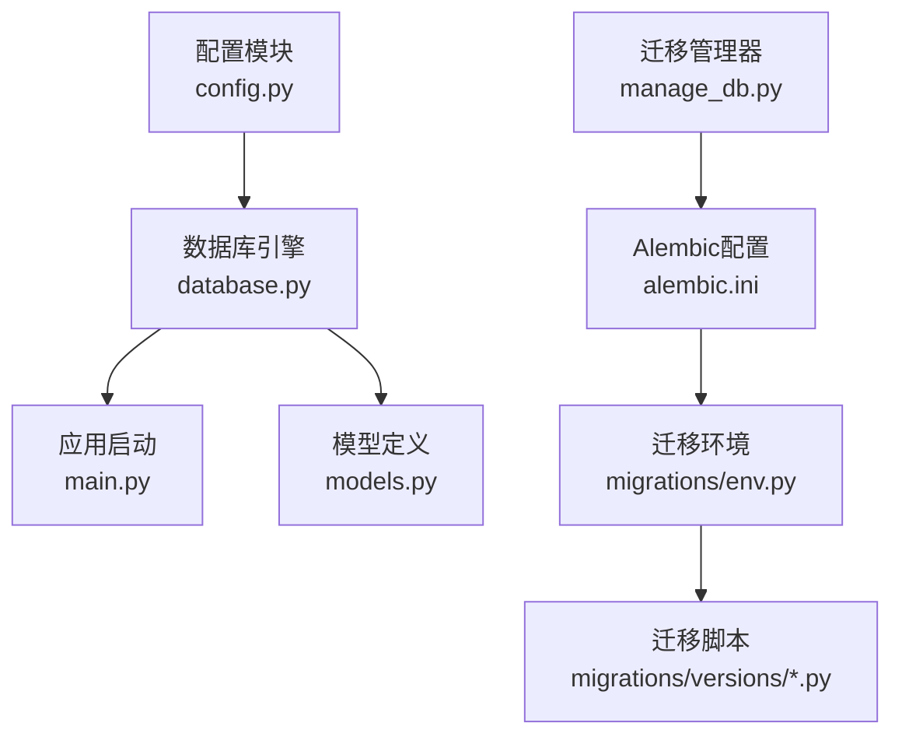
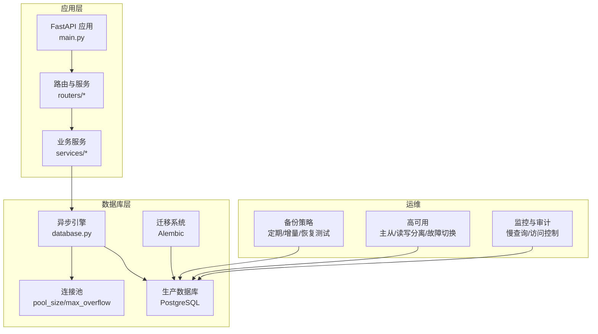
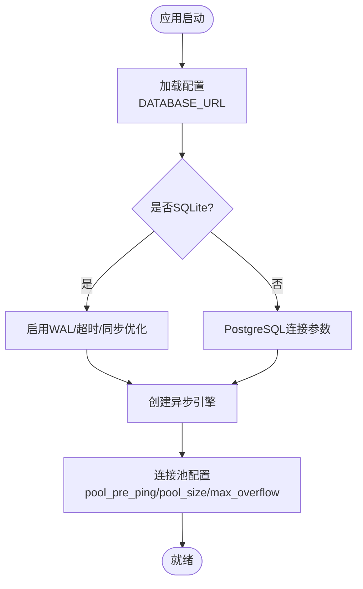
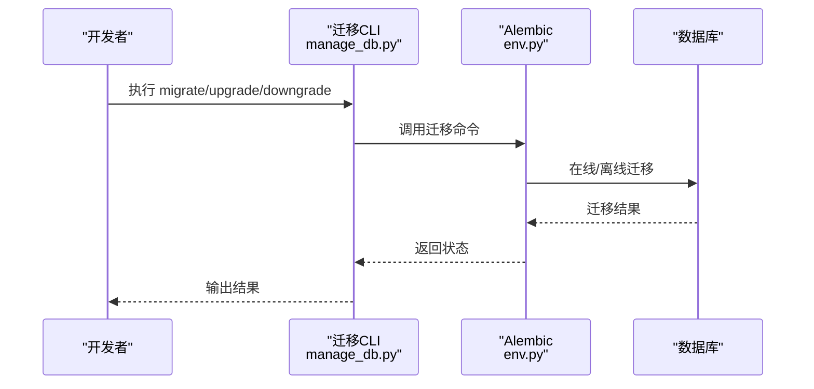
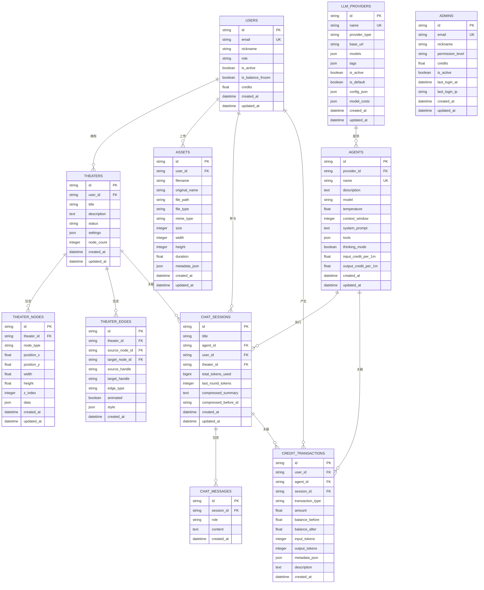
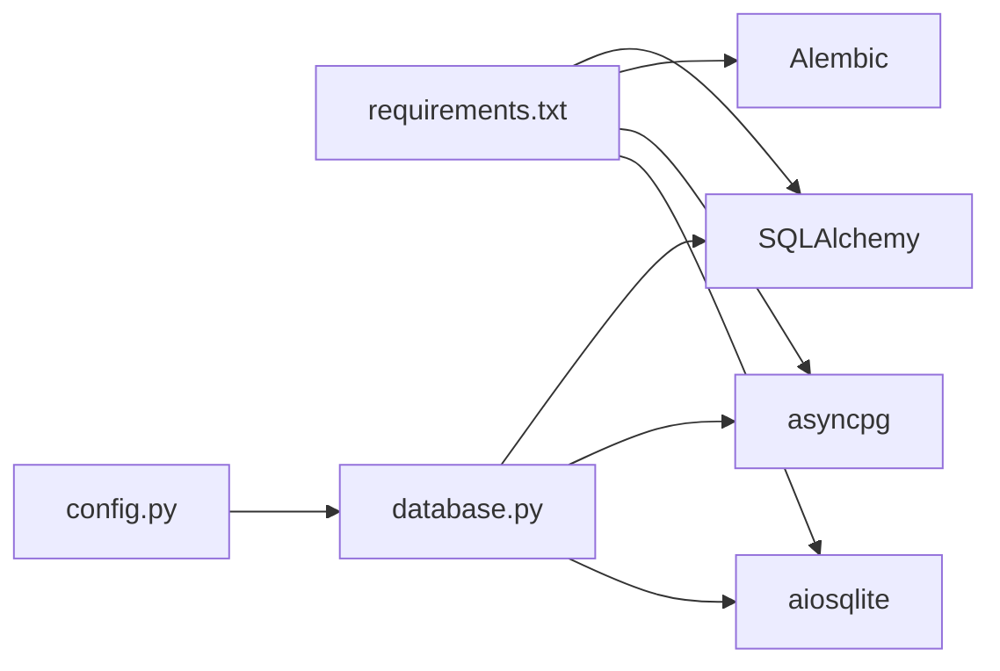

# 数据库生产配置

<cite>
**本文档引用的文件**
- [config.py](file://backend/config.py)
- [database.py](file://backend/database.py)
- [main.py](file://backend/main.py)
- [manage_db.py](file://backend/manage_db.py)
- [alembic.ini](file://backend/alembic.ini)
- [migrations/env.py](file://backend/migrations/env.py)
- [models.py](file://backend/models.py)
- [requirements.txt](file://backend/requirements.txt)
- [migrations/versions/14746eaf1c81_initial.py](file://backend/migrations/versions/14746eaf1c81_initial.py)
- [migrations/versions/a3b8c9d0e1f2_convert_ids_to_uuid.py](file://backend/migrations/versions/a3b8c9d0e1f2_convert_ids_to_uuid.py)
- [migrations/versions/c74e516c6d87_add_credit_billing_system.py](file://backend/migrations/versions/c74e516c6d87_add_credit_billing_system.py)
</cite>

## 目录
1. [简介](#简介)
2. [项目结构](#项目结构)
3. [核心组件](#核心组件)
4. [架构概览](#架构概览)
5. [详细组件分析](#详细组件分析)
6. [依赖分析](#依赖分析)
7. [性能考虑](#性能考虑)
8. [故障排查指南](#故障排查指南)
9. [结论](#结论)
10. [附录](#附录)

## 简介
本文件面向Infinite Game项目的数据库生产环境，提供基于现有代码库的配置与运维实践建议。当前代码库默认使用SQLite作为开发数据库，但通过配置与迁移工具已具备迁移到PostgreSQL的完整能力。本文档围绕以下目标展开：
- PostgreSQL生产环境配置：连接池、并发连接数、内存分配
- 备份策略：定期全备、增量备份与恢复测试
- 高可用：主从复制、读写分离、故障切换
- 性能优化：索引、查询监控、慢查询分析
- 数据迁移：版本控制、回滚机制
- 安全配置：访问控制、加密传输、审计日志

## 项目结构
后端采用FastAPI + SQLAlchemy异步引擎，数据库配置集中在配置模块与数据库引擎初始化文件中；迁移管理由Alembic负责，版本化迁移脚本位于migrations/versions目录。

**图表来源**
- [config.py:1-43](file://backend/config.py#L1-L43)
- [database.py:1-45](file://backend/database.py#L1-L45)
- [main.py:1-175](file://backend/main.py#L1-L175)
- [manage_db.py:1-80](file://backend/manage_db.py#L1-L80)
- [alembic.ini:1-115](file://backend/alembic.ini#L1-L115)
- [migrations/env.py:1-120](file://backend/migrations/env.py#L1-L120)

**章节来源**
- [config.py:1-43](file://backend/config.py#L1-L43)
- [database.py:1-45](file://backend/database.py#L1-L45)
- [main.py:1-175](file://backend/main.py#L1-L175)
- [manage_db.py:1-80](file://backend/manage_db.py#L1-L80)
- [alembic.ini:1-115](file://backend/alembic.ini#L1-L115)
- [migrations/env.py:1-120](file://backend/migrations/env.py#L1-L120)

## 核心组件
- 配置中心：集中管理DATABASE_URL、Redis、JWT等关键参数，支持从.env加载。
- 异步数据库引擎：基于SQLAlchemy 2.x异步API，内置连接池与SQLite优化。
- 迁移系统：Alembic + 自定义迁移管理脚本，支持自动/手动迁移与回滚。
- 应用生命周期：启动时进行数据库连接重试与迁移执行。

**章节来源**
- [config.py:7-42](file://backend/config.py#L7-L42)
- [database.py:9-37](file://backend/database.py#L9-L37)
- [manage_db.py:20-77](file://backend/manage_db.py#L20-L77)
- [main.py:49-108](file://backend/main.py#L49-L108)

## 架构概览
下图展示生产环境下的数据库层与应用层交互，以及迁移与备份流程。

**图表来源**
- [main.py:110-153](file://backend/main.py#L110-L153)
- [database.py:9-19](file://backend/database.py#L9-L19)
- [alembic.ini:1-115](file://backend/alembic.ini#L1-L115)

## 详细组件分析

### 配置与连接池
- 数据库URL：默认SQLite，可通过环境变量切换至PostgreSQL。
- 异步引擎参数：开启pool_pre_ping、设置pool_size与max_overflow、SQLite特定connect_args。
- SQLite优化：WAL模式、busy_timeout、synchronous参数，降低锁竞争。

**图表来源**
- [config.py:15](file://backend/config.py#L15)
- [database.py:9-19](file://backend/database.py#L9-L19)
- [database.py:23-31](file://backend/database.py#L23-L31)

**章节来源**
- [config.py:15](file://backend/config.py#L15)
- [database.py:9-19](file://backend/database.py#L9-L19)
- [database.py:23-31](file://backend/database.py#L23-L31)

### 迁移与版本控制
- 迁移入口：Alembic配置与环境脚本，支持离线/在线迁移。
- 版本脚本：按修订ID管理，包含初始表结构、UUID迁移、计费系统等。
- 管理命令：封装migrate/upgrade/downgrade/seed，便于CI/CD集成。

**图表来源**
- [manage_db.py:20-77](file://backend/manage_db.py#L20-L77)
- [migrations/env.py:42-119](file://backend/migrations/env.py#L42-L119)

**章节来源**
- [manage_db.py:20-77](file://backend/manage_db.py#L20-L77)
- [migrations/env.py:39-40](file://backend/migrations/env.py#L39-L40)
- [migrations/env.py:42-119](file://backend/migrations/env.py#L42-L119)

### 数据模型与索引
- 核心实体：用户、管理员、剧场、节点、边、资产、聊天会话/消息、LLM提供商、计费交易等。
- 索引策略：主键自增ID、外键索引、常用查询字段（如email、角色、状态、创建时间）建立索引。
- UUID迁移：统一使用字符串型主键，提升分布式安全性与可移植性。

**图表来源**
- [models.py:10-33](file://backend/models.py#L10-L33)
- [models.py:35-73](file://backend/models.py#L35-L73)
- [models.py:75-91](file://backend/models.py#L75-L91)
- [models.py:93-112](file://backend/models.py#L93-L112)
- [models.py:114-129](file://backend/models.py#L114-L129)
- [models.py:131-149](file://backend/models.py#L131-L149)
- [models.py:152-176](file://backend/models.py#L152-L176)
- [models.py:178-197](file://backend/models.py#L178-L197)
- [models.py:199-200](file://backend/models.py#L199-L200)
- [models.py:108-111](file://backend/models.py#L108-L111)

**章节来源**
- [models.py:10-33](file://backend/models.py#L10-L33)
- [models.py:35-73](file://backend/models.py#L35-L73)
- [models.py:75-91](file://backend/models.py#L75-L91)
- [models.py:93-112](file://backend/models.py#L93-L112)
- [models.py:114-129](file://backend/models.py#L114-L129)
- [models.py:131-149](file://backend/models.py#L131-L149)
- [models.py:152-176](file://backend/models.py#L152-L176)
- [models.py:178-197](file://backend/models.py#L178-L197)
- [models.py:199-200](file://backend/models.py#L199-L200)

### 迁移脚本要点
- 初始版本：创建LLM提供商等基础表，处理JSON列类型变更。
- UUID迁移：将玩家、代理、提供商等整数主键替换为UUID，重建依赖表并迁移数据。
- 计费系统：新增积分交易表，为用户与代理添加计费字段。

**章节来源**
- [migrations/versions/14746eaf1c81_initial.py:21-52](file://backend/migrations/versions/14746eaf1c81_initial.py#L21-L52)
- [migrations/versions/a3b8c9d0e1f2_convert_ids_to_uuid.py:22-229](file://backend/migrations/versions/a3b8c9d0e1f2_convert_ids_to_uuid.py#L22-L229)
- [migrations/versions/c74e516c6d87_add_credit_billing_system.py:21-53](file://backend/migrations/versions/c74e516c6d87_add_credit_billing_system.py#L21-L53)

## 依赖分析
- 异步数据库驱动：SQLAlchemy 2.x + asyncpg/aiosqlite
- 迁移工具：Alembic
- 生产数据库：PostgreSQL（通过DATABASE_URL切换）

**图表来源**
- [requirements.txt:3-18](file://backend/requirements.txt#L3-L18)
- [config.py:15](file://backend/config.py#L15)
- [database.py:1-5](file://backend/database.py#L1-L5)

**章节来源**
- [requirements.txt:1-29](file://backend/requirements.txt#L1-L29)
- [config.py:15](file://backend/config.py#L15)
- [database.py:1-5](file://backend/database.py#L1-L5)

## 性能考虑
- 连接池与并发
  - pool_pre_ping：自动检测与重连，提升稳定性
  - pool_size：根据CPU核心数与QPS估算，建议生产环境按峰值并发的1.5~2倍设置
  - max_overflow：超出pool_size部分的动态连接数，建议限制在pool_size的1~2倍
  - SQLite优化：WAL模式、busy_timeout、synchronous参数已在代码中配置
- 查询性能
  - 索引：对高频过滤字段（如email、角色、状态、创建时间）建立索引
  - 分页：对列表查询使用LIMIT/OFFSET或基于游标的分页
  - 统计信息：定期更新表统计信息，确保查询计划最优
- 监控与慢查询
  - 开启慢查询日志阈值（例如1秒），结合应用日志定位热点SQL
  - 使用数据库性能分析工具（EXPLAIN/EXPLAIN ANALYZE）评估执行计划
- 内存分配
  - shared_buffers：建议占物理内存的15%~25%
  - work_mem：根据复杂查询数量与并行度调整，避免过大导致交换
  - effective_cache_size：建议占磁盘缓存的50%以上

[本节为通用性能指导，无需具体文件分析]

## 故障排查指南
- 启动阶段连接失败
  - 检查DATABASE_URL格式与凭据
  - 查看连接重试日志与迁移失败原因
  - 清理Alembic残留临时表后重试
- 迁移异常
  - 使用manage_db.py的migrate/upgrade/downgrade命令
  - 若出现残留临时表，参考env.py中的清理逻辑
- 连接池耗尽
  - 检查pool_size与max_overflow配置
  - 监控活跃连接数与等待队列长度
- SQLite锁冲突
  - 确认WAL模式已启用且busy_timeout合理
  - 避免长时间事务与大量写入集中在同一时间窗口

**章节来源**
- [main.py:51-96](file://backend/main.py#L51-L96)
- [migrations/env.py:67-77](file://backend/migrations/env.py#L67-L77)
- [database.py:23-31](file://backend/database.py#L23-L31)

## 结论
当前代码库已具备从SQLite平滑迁移到PostgreSQL的基础设施：配置灵活、引擎异步、迁移完备。生产部署应重点完善以下方面：
- 明确连接池参数与并发上限，结合压测结果迭代
- 建立完善的备份与恢复流程，定期演练
- 设计高可用方案（主从/读写分离/故障切换）
- 强化索引与查询优化，持续监控慢查询
- 完善安全策略（访问控制、传输加密、审计日志）

[本节为总结性内容，无需具体文件分析]

## 附录

### PostgreSQL生产配置清单
- 连接池
  - pool_pre_ping：启用
  - pool_size：按峰值并发的1.5~2倍估算
  - max_overflow：pool_size的1~2倍
  - pool_recycle：建议600秒，避免长时间连接失效
- 并发与内存
  - shared_buffers：物理内存的15%~25%
  - work_mem：根据复杂查询数量与并行度调整
  - effective_cache_size：磁盘缓存的50%以上
- 安全
  - SSL强制传输
  - 最小权限原则的数据库账号
  - 审计日志与访问控制

[本节为通用配置建议，无需具体文件分析]

### 备份策略
- 全量备份：每周日凌晨进行一次全量备份
- 增量备份：每日凌晨进行增量备份，保留最近7天
- 恢复测试：每月进行一次恢复演练，验证备份完整性与恢复时间

[本节为通用运维建议，无需具体文件分析]

### 高可用配置
- 主从复制：使用流复制或逻辑复制，实现只读副本
- 读写分离：应用层区分读写请求，写入主库，读取从库
- 故障切换：自动化健康检查与故障转移，确保RTO/RPO达标

[本节为通用高可用建议，无需具体文件分析]

### 数据迁移与回滚
- 版本化迁移：所有结构变更通过Alembic脚本管理
- 回滚策略：优先使用降级脚本，必要时进行数据修复
- CI/CD集成：迁移命令纳入部署流水线，失败即回滚

**章节来源**
- [manage_db.py:20-77](file://backend/manage_db.py#L20-L77)
- [migrations/env.py:42-119](file://backend/migrations/env.py#L42-L119)