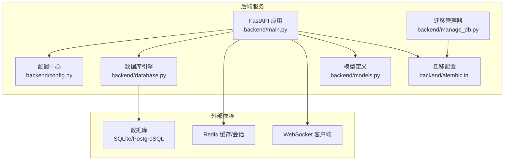
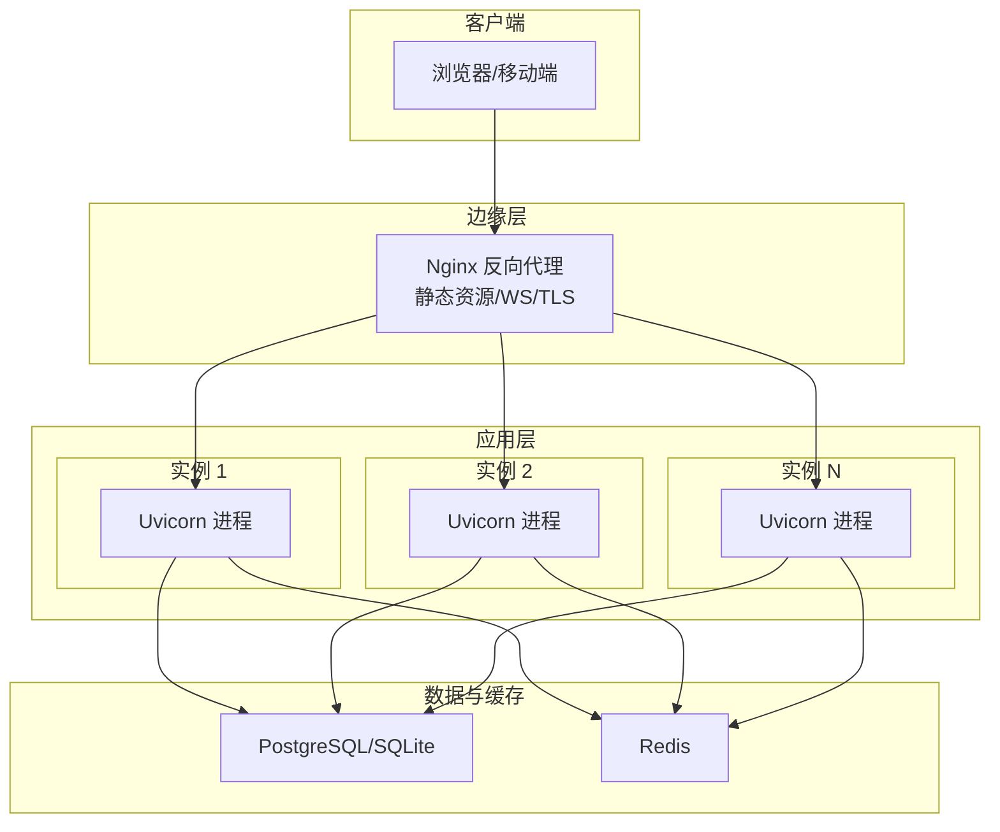
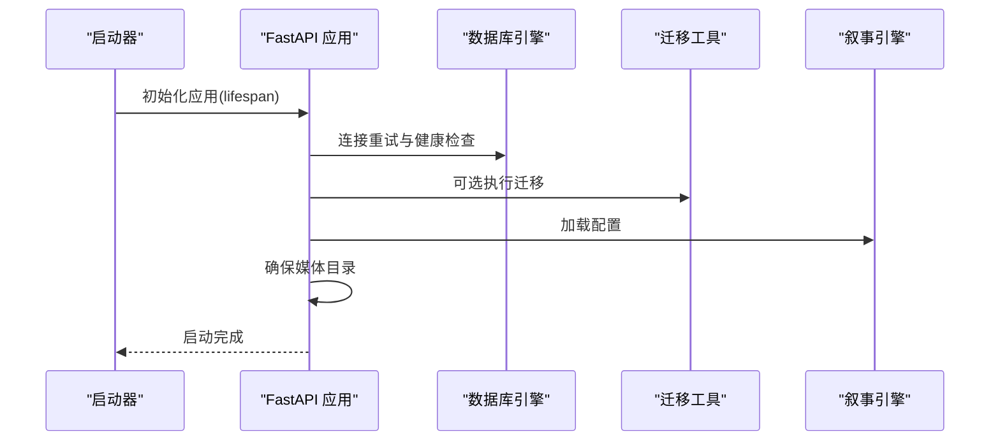
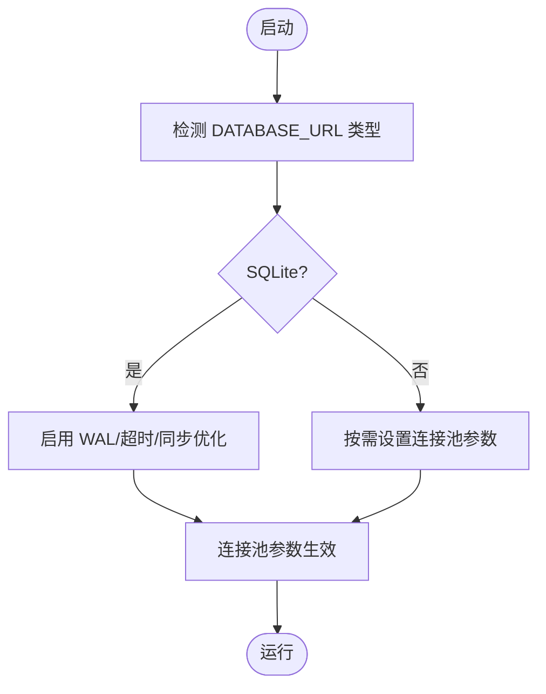
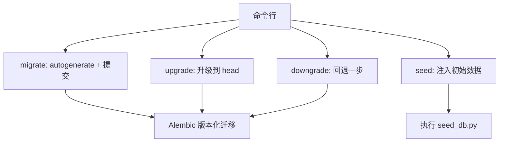
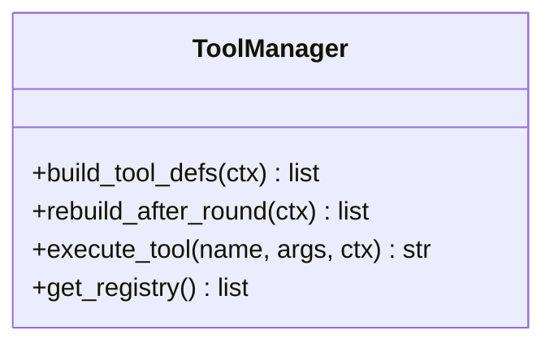
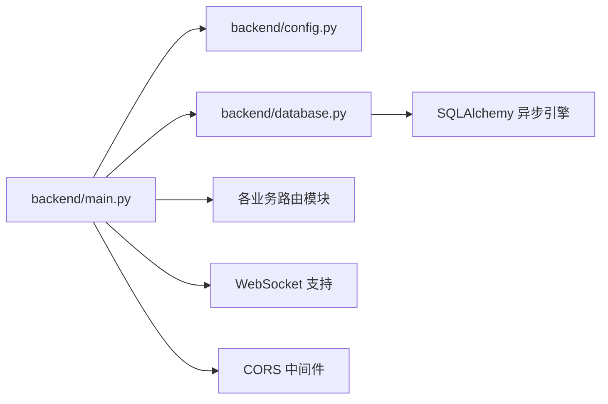

# 生产环境部署

<cite>
**本文引用的文件**
- [backend/main.py](file://backend/main.py)
- [backend/config.py](file://backend/config.py)
- [backend/database.py](file://backend/database.py)
- [backend/requirements.txt](file://backend/requirements.txt)
- [backend/alembic.ini](file://backend/alembic.ini)
- [backend/manage_db.py](file://backend/manage_db.py)
- [backend/models.py](file://backend/models.py)
- [backend/services/tool_manager/manager.py](file://backend/services/tool_manager/manager.py)
- [dev.py](file://dev.py)
- [.gitignore](file://.gitignore)
</cite>

## 目录
1. [简介](#简介)
2. [项目结构](#项目结构)
3. [核心组件](#核心组件)
4. [架构总览](#架构总览)
5. [详细组件分析](#详细组件分析)
6. [依赖分析](#依赖分析)
7. [性能考虑](#性能考虑)
8. [故障排查指南](#故障排查指南)
9. [结论](#结论)
10. [附录](#附录)

## 简介
本文件面向KunFlix项目的生产环境部署，提供从容器化到多实例与负载均衡、Nginx反向代理、Gunicorn/Uvicorn生产服务器配置、数据库生产配置（连接池、备份与高可用）、以及CI/CD流水线的完整实践建议。内容基于仓库中的现有实现与配置文件进行提炼与扩展，帮助团队以最小改动完成稳定上线。

## 项目结构
- 后端采用FastAPI + Uvicorn异步框架，支持WebSocket与静态资源服务。
- 数据层通过SQLAlchemy异步引擎访问数据库，支持SQLite与PostgreSQL两种模式。
- 迁移工具使用Alembic，提供版本化数据库演进能力。
- 开发脚本提供本地多进程并行启动示例，便于理解生产环境的进程/容器编排思路。

图表来源
- [backend/main.py:110-175](file://backend/main.py#L110-L175)
- [backend/config.py:7-43](file://backend/config.py#L7-L43)
- [backend/database.py:1-45](file://backend/database.py#L1-L45)
- [backend/models.py:1-200](file://backend/models.py#L1-L200)
- [backend/alembic.ini:1-115](file://backend/alembic.ini#L1-L115)
- [backend/manage_db.py:20-80](file://backend/manage_db.py#L20-L80)

章节来源
- [backend/main.py:110-175](file://backend/main.py#L110-L175)
- [backend/config.py:7-43](file://backend/config.py#L7-L43)
- [backend/database.py:1-45](file://backend/database.py#L1-L45)
- [backend/requirements.txt:1-29](file://backend/requirements.txt#L1-L29)
- [backend/alembic.ini:1-115](file://backend/alembic.ini#L1-L115)
- [backend/manage_db.py:20-80](file://backend/manage_db.py#L20-L80)
- [backend/models.py:1-200](file://backend/models.py#L1-L200)

## 核心组件
- 应用入口与生命周期
  - 应用在启动时执行数据库连接重试、可选的迁移执行、Narrative引擎初始化，并确保媒体目录存在。
  - 提供根路径与WebSocket端点，支持CORS中间件。
- 配置中心
  - 通过Pydantic Settings加载环境变量，支持数据库URL、Redis、AI密钥、JWT、模型默认值、是否自动迁移等。
- 数据库引擎
  - 异步引擎配置连接池大小、溢出连接、连接超时；对SQLite启用WAL、busy_timeout与同步策略优化。
- 迁移与版本管理
  - Alembic配置与命令行迁移管理器，支持创建、升级、降级与种子数据注入。

章节来源
- [backend/main.py:49-108](file://backend/main.py#L49-L108)
- [backend/main.py:130-153](file://backend/main.py#L130-L153)
- [backend/config.py:7-43](file://backend/config.py#L7-L43)
- [backend/database.py:9-37](file://backend/database.py#L9-L37)
- [backend/alembic.ini:61](file://backend/alembic.ini#L61)
- [backend/manage_db.py:20-80](file://backend/manage_db.py#L20-L80)

## 架构总览
生产部署建议采用“Nginx反向代理 + 多实例Uvicorn + 数据库/缓存”的架构。Nginx负责静态资源、WebSocket升级与TLS终止；Uvicorn承载FastAPI应用；数据库可选PostgreSQL（生产推荐）；Redis用于会话/缓存。

图表来源
- [backend/main.py:160-172](file://backend/main.py#L160-L172)
- [backend/config.py:15](file://backend/config.py#L15)
- [backend/config.py:19](file://backend/config.py#L19)

## 详细组件分析

### 应用与生命周期管理
- 启动阶段
  - 数据库连接重试与迁移执行（可配置开关）。
  - 从数据库加载叙事引擎配置。
  - 确保媒体目录存在。
- 中间件与路由
  - CORS中间件配置白名单来源。
  - 注册全部业务路由。
- WebSocket
  - 提供基础回显WebSocket端点，可用于后续扩展。

图表来源
- [backend/main.py:49-108](file://backend/main.py#L49-L108)
- [backend/alembic.ini:61](file://backend/alembic.ini#L61)

章节来源
- [backend/main.py:49-108](file://backend/main.py#L49-L108)
- [backend/main.py:130-153](file://backend/main.py#L130-L153)
- [backend/main.py:160-172](file://backend/main.py#L160-L172)

### 数据库生产配置
- 连接池参数
  - 连接池大小、最大溢出连接、连接超时、pool_pre_ping启用。
- SQLite优化
  - WAL模式、busy_timeout、同步策略，降低锁冲突。
- PostgreSQL建议
  - 使用独立PostgreSQL实例，结合连接池与只读副本实现高可用与读写分离。

图表来源
- [backend/database.py:9-37](file://backend/database.py#L9-L37)
- [backend/database.py:23-31](file://backend/database.py#L23-L31)

章节来源
- [backend/database.py:9-37](file://backend/database.py#L9-L37)
- [backend/database.py:23-31](file://backend/database.py#L23-L31)

### 迁移与版本管理
- Alembic配置
  - script_location、版本目录、日志级别等。
- 管理器命令
  - migrate、upgrade、downgrade、seed，便于CI/CD中自动化执行。

图表来源
- [backend/alembic.ini:5-10](file://backend/alembic.ini#L5-L10)
- [backend/manage_db.py:20-80](file://backend/manage_db.py#L20-L80)

章节来源
- [backend/alembic.ini:5-10](file://backend/alembic.ini#L5-L10)
- [backend/manage_db.py:20-80](file://backend/manage_db.py#L20-L80)

### 工具管理与扩展点
- ToolManager作为统一工具注册与分发中心，支持动态构建工具定义与执行。
- 该设计有利于在生产中按需启用/禁用工具，提升安全性与可控性。

图表来源
- [backend/services/tool_manager/manager.py:23-108](file://backend/services/tool_manager/manager.py#L23-L108)

章节来源
- [backend/services/tool_manager/manager.py:23-108](file://backend/services/tool_manager/manager.py#L23-L108)

### 开发与生产差异参考
- 开发脚本展示了如何并行启动后端、前端与管理后台，生产环境可类比为多实例部署。
- 生产应关闭开发模式（如reload），使用进程/容器编排替代多线程。

章节来源
- [dev.py:94-168](file://dev.py#L94-L168)

## 依赖分析
- 运行时依赖
  - FastAPI、Uvicorn、SQLAlchemy异步、aiopg/aiosqlite、Redis、WebSockets、Alembic、Pydantic Settings等。
- 部署耦合
  - 应用对数据库URL、Redis URL、JWT密钥、AI API Key敏感，需通过环境变量注入。
  - WebSocket与静态资源由Uvicorn直接提供，Nginx可作为边缘代理。

图表来源
- [backend/main.py:32-45](file://backend/main.py#L32-L45)
- [backend/config.py:7-43](file://backend/config.py#L7-L43)
- [backend/database.py:1-45](file://backend/database.py#L1-L45)

章节来源
- [backend/requirements.txt:1-29](file://backend/requirements.txt#L1-L29)
- [backend/main.py:32-45](file://backend/main.py#L32-L45)
- [backend/config.py:7-43](file://backend/config.py#L7-L43)
- [backend/database.py:1-45](file://backend/database.py#L1-L45)

## 性能考虑
- 连接池与并发
  - 根据QPS与峰值并发调优pool_size与max_overflow；对SQLite启用WAL与合理超时。
- WebSocket与静态资源
  - WebSocket长连接建议配合Nginx升级与心跳机制；静态资源由Nginx直传，减轻应用压力。
- 进程与实例
  - 生产建议每个CPU核对应1个Uvicorn worker，结合多实例横向扩展与负载均衡。
- 缓存与会话
  - 使用Redis缓存热点数据与会话，避免重复计算与数据库压力。

## 故障排查指南
- 数据库连接失败
  - 检查DATABASE_URL、网络连通性与权限；确认连接池参数与超时设置。
  - SQLite锁冲突：确认WAL模式与busy_timeout配置。
- 迁移失败
  - 查看迁移日志与临时表残留，必要时清理后重试。
- WebSocket异常
  - 检查Nginx升级配置与后端日志，定位断开原因。
- CORS与鉴权
  - 核对CORS白名单与Authorization头处理中间件日志。

章节来源
- [backend/main.py:49-108](file://backend/main.py#L49-L108)
- [backend/database.py:23-31](file://backend/database.py#L23-L31)
- [backend/alembic.ini:96-104](file://backend/alembic.ini#L96-L104)

## 结论
通过Nginx反向代理、多实例Uvicorn、生产级数据库与缓存配置，结合Alembic迁移与种子数据流程，KunFlix可在生产环境中实现高可用、可扩展与可观测的部署形态。建议在CI/CD中固化迁移与种子流程，并以容器化方式交付，进一步提升一致性与可维护性。

## 附录

### Docker容器化部署建议
- 基础镜像
  - 使用Python官方镜像作为基础，安装运行时依赖。
- 构建步骤
  - 复制requirements.txt并安装依赖；复制源码；预编译静态资源（如需）。
- 运行参数
  - 挂载媒体目录与数据库文件（若使用SQLite）；映射端口8000。
- 健康检查
  - 对应用根路径发起HTTP探测，确保Uvicorn正常响应。

### 多实例部署与负载均衡
- 实例数量
  - 每个CPU核约1个Uvicorn worker；根据流量叠加多实例。
- 负载均衡
  - Nginx作为上游LB，开启sticky会话（如需）与健康检查。
- 静态资源
  - Nginx直传静态文件，减少后端压力。

### Nginx反向代理配置要点
- 静态资源服务
  - 映射静态目录至Nginx，设置合适的缓存与压缩。
- WebSocket代理
  - 启用proxy_set_header Upgrade与Connection，转发主机与真实IP。
- SSL证书
  - 配置HTTPS监听、证书与私钥路径，启用现代加密套件与协议版本。
- 示例片段（路径引用）
  - 参考应用WebSocket端点与静态资源服务位置，确保Nginx上游指向Uvicorn实例。

章节来源
- [backend/main.py:160-172](file://backend/main.py#L160-L172)

### Gunicorn/Uvicorn生产服务器配置
- Uvicorn参数建议
  - workers：CPU核数；threads：每worker线程数（根据I/O密集度调整）。
  - backlog：请求队列长度；keep-alive超时。
- 进程管理
  - 使用systemd或容器编排管理进程生命周期与重启策略。
- 内存限制
  - 通过容器资源限制与Uvicorn线程数协同控制内存占用。

### 数据库生产配置清单
- 连接池
  - pool_size、max_overflow、pool_pre_ping、connect_args（SQLite专属）。
- 备份策略
  - PostgreSQL：逻辑备份（如pg_dump）与物理备份结合；定期校验。
  - SQLite：周期性复制wal/shm文件并校验。
- 高可用
  - PostgreSQL主从/集群；读写分离与只读副本；自动故障转移。
  - Redis：哨兵/集群模式，持久化与备份。

章节来源
- [backend/database.py:9-37](file://backend/database.py#L9-L37)
- [backend/database.py:23-31](file://backend/database.py#L23-L31)

### CI/CD流水线配置示例（步骤说明）
- 触发条件
  - 推送至主分支或打标签。
- 测试阶段
  - 运行单元测试与集成测试（可复用现有测试组织方式）。
- 构建阶段
  - 构建Docker镜像并推送至镜像仓库。
- 部署阶段
  - 执行数据库迁移与种子数据（通过manage_db命令）。
  - 滚动更新多实例，先启后停，配合健康检查。
- 回滚策略
  - 保存上一版本镜像标签，失败时回滚。

章节来源
- [backend/manage_db.py:20-80](file://backend/manage_db.py#L20-L80)
- [dev.py:94-168](file://dev.py#L94-L168)