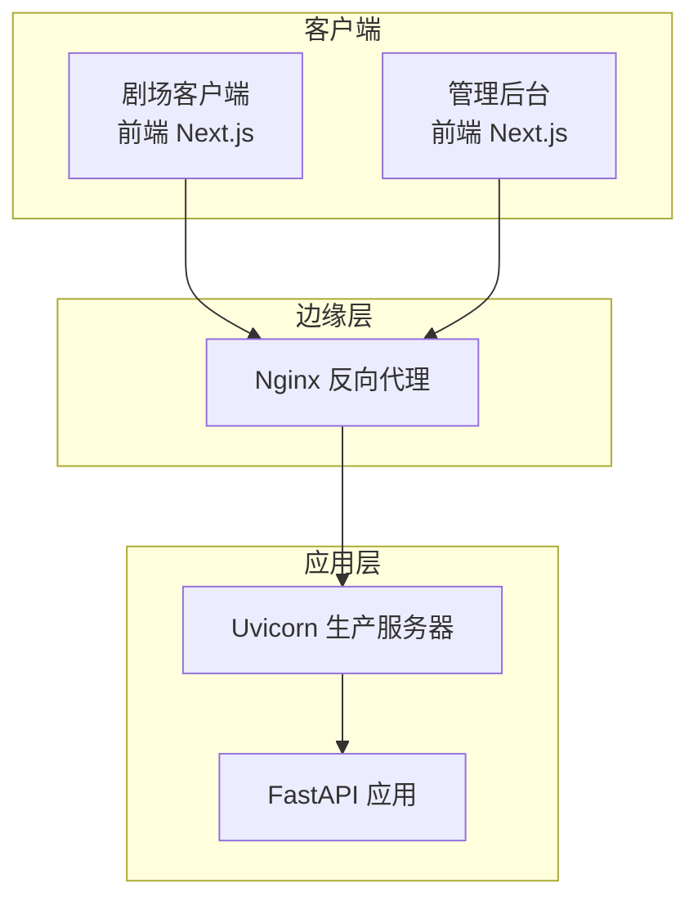
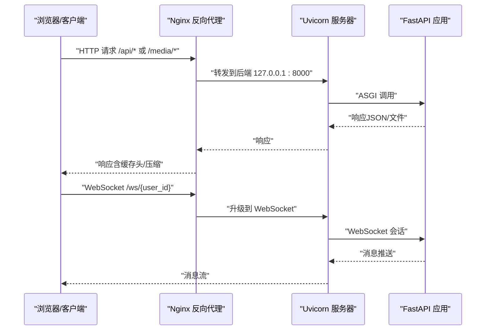
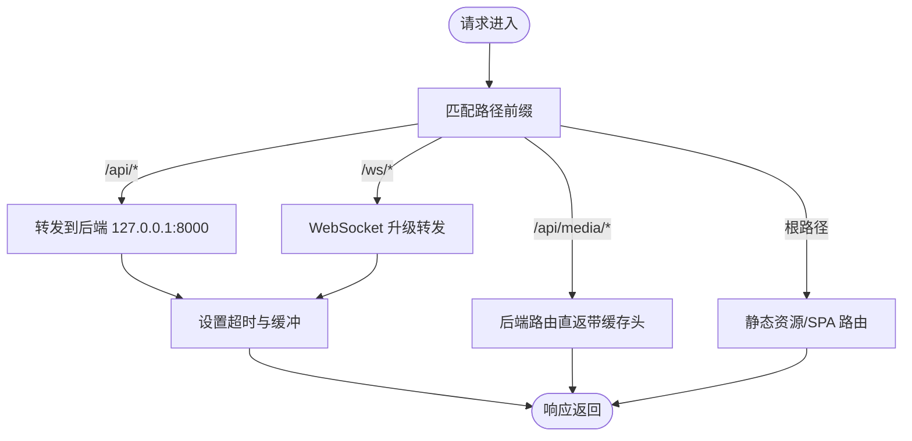
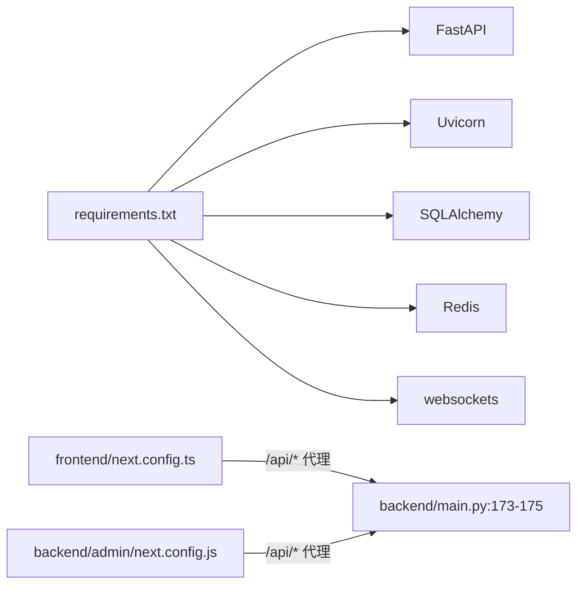

# 负载均衡配置

<cite>
**本文引用的文件**   
- [backend/main.py](file://backend/main.py)
- [backend/config.py](file://backend/config.py)
- [backend/routers/media.py](file://backend/routers/media.py)
- [backend/admin/next.config.js](file://backend/admin/next.config.js)
- [frontend/next.config.ts](file://frontend/next.config.ts)
- [backend/requirements.txt](file://backend/requirements.txt)
- [dev.py](file://dev.py)
- [README.md](file://README.md)
</cite>

## 目录
1. [引言](#引言)
2. [项目结构](#项目结构)
3. [核心组件](#核心组件)
4. [架构总览](#架构总览)
5. [详细组件分析](#详细组件分析)
6. [依赖分析](#依赖分析)
7. [性能考虑](#性能考虑)
8. [故障排查指南](#故障排查指南)
9. [结论](#结论)
10. [附录](#附录)

## 引言
本文件面向生产环境部署，围绕 KunFlix（KunFlix）后端服务提供一套完整的负载均衡配置方案。内容涵盖：
- Nginx 反向代理配置要点：静态资源服务、WebSocket 代理、HTTP/HTTPS 重定向
- 生产服务器（Uvicorn）配置建议：工作进程数量、绑定地址、超时设置、进程管理
- 负载均衡算法选择：轮询、加权轮询、IP 哈希
- 健康检查、故障转移与会话保持策略
- 性能调优参数：连接池大小、请求超时、缓冲区设置

## 项目结构
后端采用 FastAPI + Uvicorn，前端为 Next.js。开发阶段通过 dev.py 同时启动后端、前台和管理后台；生产环境建议通过 Nginx 进行反向代理与静态资源服务，并对 WebSocket 进行专门代理。

图表来源
- [backend/main.py:173-175](file://backend/main.py#L173-L175)
- [frontend/next.config.ts:10-17](file://frontend/next.config.ts#L10-L17)
- [backend/admin/next.config.js:4-11](file://backend/admin/next.config.js#L4-L11)

章节来源
- [README.md:195-202](file://README.md#L195-L202)
- [dev.py:117-123](file://dev.py#L117-L123)

## 核心组件
- 反向代理与静态资源
  - Nginx 负责静态资源缓存与压缩、HTTP/HTTPS 重定向、WebSocket 升级转发
  - 前端 Next.js 在开发阶段通过 rewrites 将 /api/* 代理到后端 127.0.0.1:8000
- 生产服务器
  - Uvicorn 作为 ASGI 服务器承载 FastAPI 应用
  - FastAPI 内置 WebSocket 支持，提供 /ws/{user_id} 接口
- 媒体资源
  - 后端提供 /api/media/* 路由，支持上传、列举、删除与直链下载
  - 媒体文件存储于 backend/media 目录，提供带缓存头的静态访问

章节来源
- [backend/main.py:161-171](file://backend/main.py#L161-L171)
- [backend/routers/media.py:95-149](file://backend/routers/media.py#L95-L149)
- [backend/routers/media.py:272-299](file://backend/routers/media.py#L272-L299)
- [frontend/next.config.ts:10-17](file://frontend/next.config.ts#L10-L17)
- [backend/admin/next.config.js:4-11](file://backend/admin/next.config.js#L4-L11)

## 架构总览
下图展示生产环境中的流量走向与关键组件交互。

图表来源
- [backend/main.py:161-171](file://backend/main.py#L161-L171)
- [backend/routers/media.py:272-299](file://backend/routers/media.py#L272-L299)
- [frontend/next.config.ts:10-17](file://frontend/next.config.ts#L10-L17)
- [backend/admin/next.config.js:4-11](file://backend/admin/next.config.js#L4-L11)

## 详细组件分析

### Nginx 反向代理配置要点
- 静态资源服务
  - 将 /api/media/* 映射到后端，利用后端路由直接提供媒体文件，附带缓存头
  - 建议开启 gzip/br 压缩与合理的缓存策略，减少后端压力
- WebSocket 代理
  - 对 /ws/{user_id} 开启 proxy_set_header Upgrade 与 Connection 支持
  - 设置合理的超时与缓冲区，避免长连接中断
- HTTP/HTTPS 重定向
  - 将 80 端口重定向至 443，强制 HTTPS
  - 证书与 TLS 参数按生产最佳实践配置

[本图为概念性流程示意，不直接对应特定源码文件，故无图表来源]

### 生产服务器（Uvicorn）配置建议
- 绑定地址与端口
  - 建议绑定内网地址（如 127.0.0.1:8000），由 Nginx 对外暴露
- 工作进程数量
  - CPU 密集型任务建议与 CPU 核心数一致；I/O 密集型可适度增加
  - 结合后端异步特性，合理设置 workers 与 threads
- 超时设置
  - http_keepalive_timeout、websocket_timeout 等参数需与 Nginx 保持一致
- 进程管理
  - 使用 systemd 或 Docker 管理，确保健康检查与自动重启
  - 优雅关闭信号处理，避免请求中断

章节来源
- [backend/main.py:173-175](file://backend/main.py#L173-L175)
- [dev.py:117-123](file://dev.py#L117-L123)

### 负载均衡算法选择
- 轮询（Round Robin）
  - 默认策略，适合节点性能相近且请求均匀分布
- 加权轮询（Weighted Round Robin）
  - 按权重分配流量，适用于不同规格实例
- IP 哈希（IP Hash）
  - 基于客户端 IP 的会话保持，适合需要粘性会话的场景
- 其他
  - 最少连接、随机等策略可根据实际流量特征选择

[本节为通用负载均衡策略说明，不直接分析特定源码文件，故无章节来源]

### 健康检查、故障转移与会话保持
- 健康检查
  - 建议对 /docs 或轻量接口进行探活，失败则摘除节点
- 故障转移
  - 节点异常时自动切换至可用实例，结合超时与重试策略
- 会话保持
  - WebSocket 会话建议启用 IP 哈希或粘性会话，避免跨节点导致的连接丢失

[本节为通用运维策略说明，不直接分析特定源码文件，故无章节来源]

### 性能调优参数
- 连接池大小
  - 数据库连接池（如 SQLAlchemy/AsyncSQLAlchemy）应与 workers 数量匹配
- 请求超时
  - Nginx 与 Uvicorn 的 read_timeout、send_timeout、keepalive_timeout 需统一
- 缓冲区设置
  - client_body_buffer_size、client_max_body_size、proxy_buffering 等参数按业务峰值调整

[本节为通用性能调优说明，不直接分析特定源码文件，故无章节来源]

## 依赖分析
- 后端运行时依赖
  - FastAPI、Uvicorn、SQLAlchemy、Redis、websockets 等
- 前端开发与代理
  - Next.js 通过 rewrites 将 /api/* 代理到后端 127.0.0.1:8000
- 开发环境启动
  - dev.py 并发启动后端、前台与管理后台，便于联调

图表来源
- [backend/requirements.txt:1-29](file://backend/requirements.txt#L1-L29)
- [frontend/next.config.ts:10-17](file://frontend/next.config.ts#L10-L17)
- [backend/admin/next.config.js:4-11](file://backend/admin/next.config.js#L4-L11)
- [backend/main.py:173-175](file://backend/main.py#L173-L175)

章节来源
- [backend/requirements.txt:1-29](file://backend/requirements.txt#L1-L29)
- [frontend/next.config.ts:10-17](file://frontend/next.config.ts#L10-L17)
- [backend/admin/next.config.js:4-11](file://backend/admin/next.config.js#L4-L11)
- [dev.py:117-123](file://dev.py#L117-L123)

## 性能考虑
- I/O 密集型场景优先提升并发与连接池，而非增加 workers 数
- WebSocket 长连接需关注空闲超时与心跳策略
- 媒体文件直链访问建议配合 CDN 与缓存头，降低后端压力
- 前端静态资源由 Nginx 提供，后端仅处理动态接口与媒体直链

[本节提供通用性能指导，不直接分析特定源码文件，故无章节来源]

## 故障排查指南
- WebSocket 连接失败
  - 检查 Nginx 是否正确转发 Upgrade/Connection 头
  - 确认后端 /ws/{user_id} 路由可达与日志
- 媒体文件无法下载
  - 核对 /api/media/{filename} 路由与文件存在性
  - 检查缓存头与权限
- 前端代理无效
  - 确认 Next.js rewrites 配置指向后端 127.0.0.1:8000
- 启动与进程管理
  - 使用 dev.py 启动时注意 Windows 下 Uvicorn 重载与信号处理差异

章节来源
- [backend/main.py:161-171](file://backend/main.py#L161-L171)
- [backend/routers/media.py:272-299](file://backend/routers/media.py#L272-L299)
- [frontend/next.config.ts:10-17](file://frontend/next.config.ts#L10-L17)
- [backend/admin/next.config.js:4-11](file://backend/admin/next.config.js#L4-L11)
- [dev.py:117-123](file://dev.py#L117-L123)

## 结论
通过 Nginx 的反向代理与静态资源服务、Uvicorn 的高性能运行以及合理的负载均衡策略，可实现高可用、低延迟的生产环境。建议结合业务特征持续优化超时、缓冲与连接池参数，并完善健康检查与故障转移机制。

[本节为总结性内容，不直接分析特定源码文件，故无章节来源]

## 附录
- 开发环境一键启动命令参考
  - python dev.py
- 访问地址参考
  - 剧场客户端：http://localhost:3000
  - 管理后台：http://localhost:3001
  - API 文档：http://localhost:8000/docs

章节来源
- [README.md:189-194](file://README.md#L189-L194)
- [README.md:195-202](file://README.md#L195-L202)