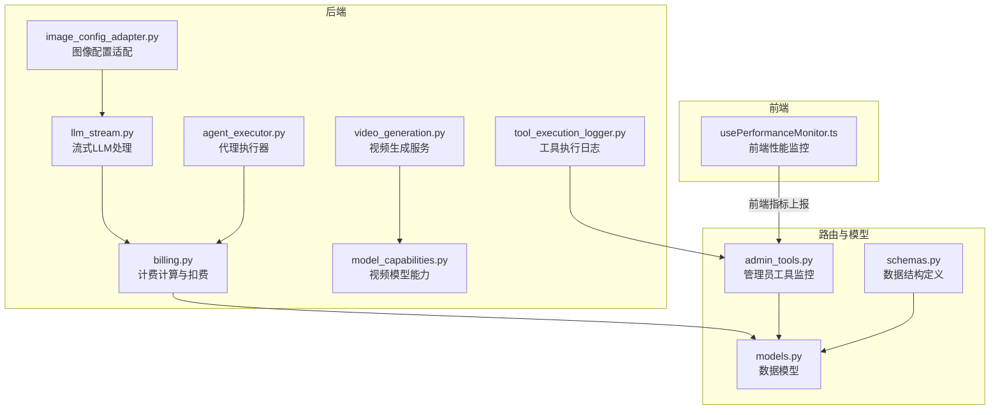
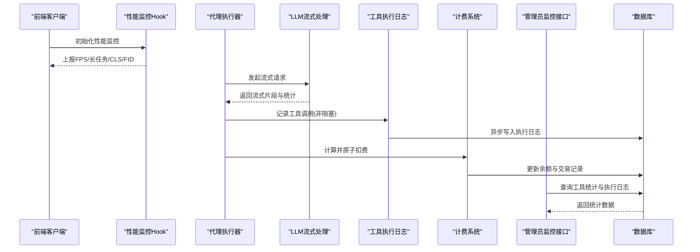
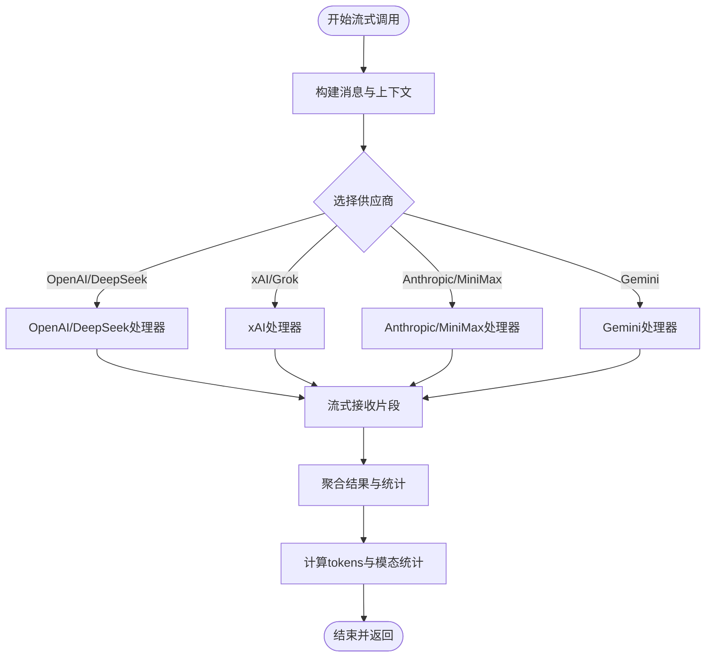
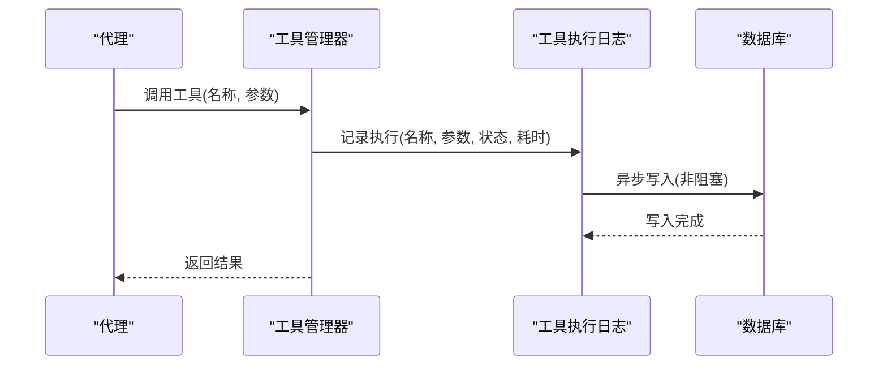
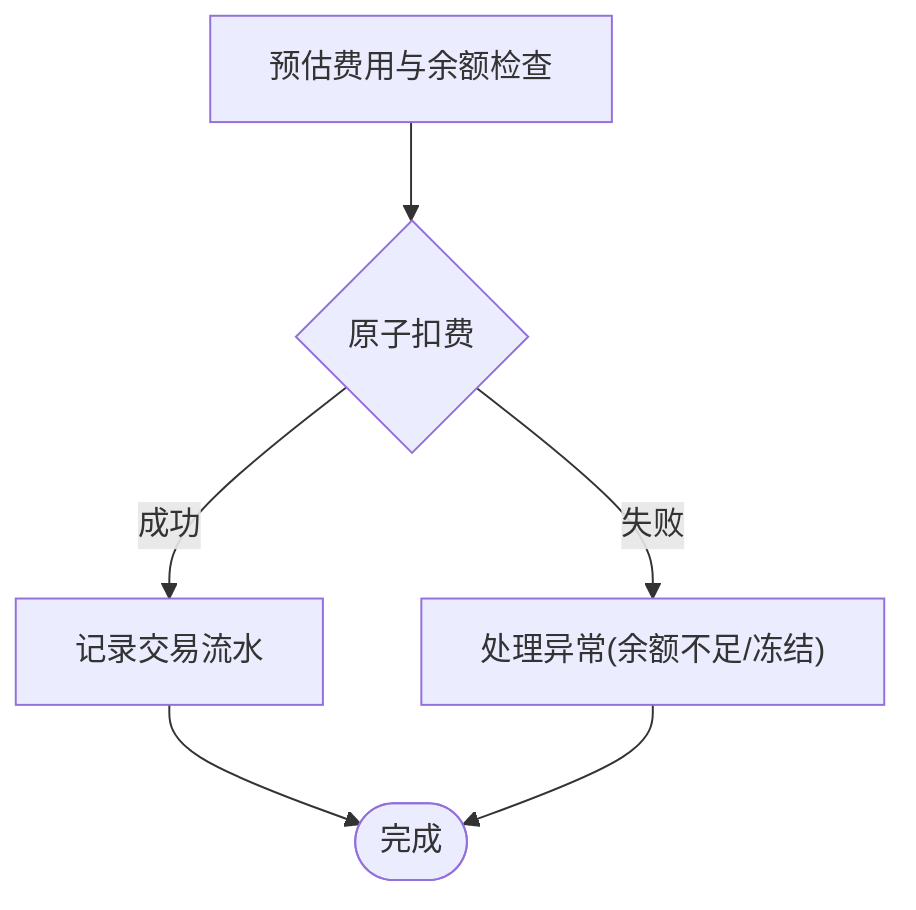
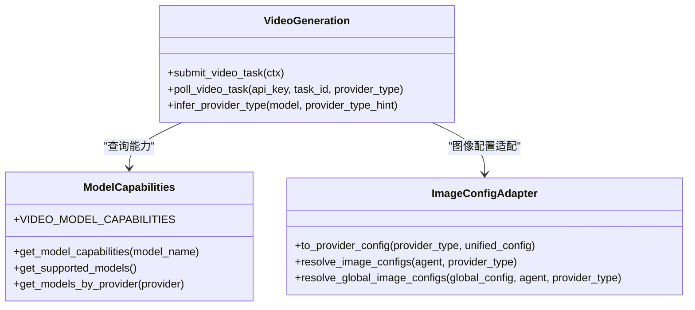
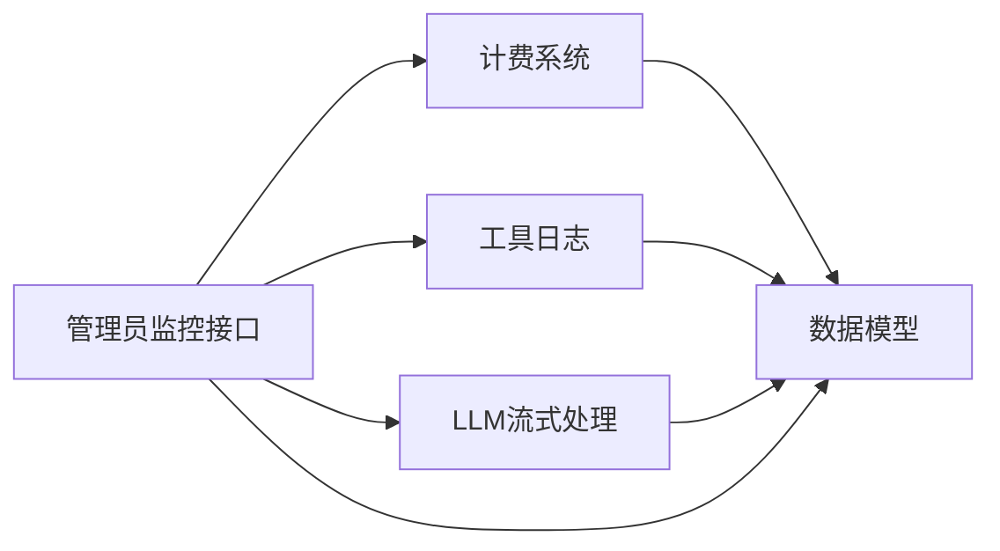

# AI服务监控

<cite>
**本文档引用的文件**
- [billing.py](file://backend/services/billing.py)
- [tool_execution_logger.py](file://backend/services/tool_execution_logger.py)
- [admin_tools.py](file://backend/routers/admin_tools.py)
- [models.py](file://backend/models.py)
- [schemas.py](file://backend/schemas.py)
- [agent_executor.py](file://backend/services/agent_executor.py)
- [llm_stream.py](file://backend/services/llm_stream.py)
- [video_generation.py](file://backend/services/video_generation.py)
- [image_config_adapter.py](file://backend/services/image_config_adapter.py)
- [video_providers/model_capabilities.py](file://backend/services/video_providers/model_capabilities.py)
- [usePerformanceMonitor.ts](file://frontend/src/components/ai-assistant/hooks/usePerformanceMonitor.ts)
- [BILLING_REVIEW.md](file://backend/docs/BILLING_REVIEW.md)
</cite>

## 目录
1. [简介](#简介)
2. [项目结构](#项目结构)
3. [核心组件](#核心组件)
4. [架构总览](#架构总览)
5. [详细组件分析](#详细组件分析)
6. [依赖关系分析](#依赖关系分析)
7. [性能考虑](#性能考虑)
8. [故障排查指南](#故障排查指南)
9. [结论](#结论)

## 简介
本文件面向KunFlix的AI服务监控体系，围绕以下目标提供系统化文档：
- AI服务调用监控：LLM API调用次数统计、响应时间监控、错误率跟踪
- 工具执行监控：图像生成、视频生成与编辑工具的使用量统计、成功率监控、耗时分析
- 计费系统监控：API调用费用计算、用户余额变化追踪、消费限额预警
- AI代理性能监控：代理响应时间、任务完成率、资源使用情况
- 第三方AI服务集成监控：OpenAI、Claude、Gemini等服务的调用状态与配额使用情况

## 项目结构
后端采用分层架构，监控相关能力主要分布在以下模块：
- 服务层：计费、工具执行日志、LLM流式处理、视频生成、配置适配
- 路由层：管理员工具监控接口、用户与订阅管理接口
- 数据模型层：用户、信用交易、工具执行记录、视频任务等
- 前端Hook：前端侧性能指标采集（FPS、长任务、布局偏移等）

**图表来源**
- [llm_stream.py:1-1041](file://backend/services/llm_stream.py#L1-L1041)
- [agent_executor.py:1-287](file://backend/services/agent_executor.py#L1-L287)
- [tool_execution_logger.py:1-89](file://backend/services/tool_execution_logger.py#L1-L89)
- [video_generation.py:1-180](file://backend/services/video_generation.py#L1-L180)
- [image_config_adapter.py:1-250](file://backend/services/image_config_adapter.py#L1-L250)
- [billing.py:1-388](file://backend/services/billing.py#L1-L388)
- [admin_tools.py:1-273](file://backend/routers/admin_tools.py#L1-L273)
- [models.py:1-503](file://backend/models.py#L1-L503)
- [schemas.py:1-931](file://backend/schemas.py#L1-L931)

**章节来源**
- [admin_tools.py:1-273](file://backend/routers/admin_tools.py#L1-L273)
- [models.py:1-503](file://backend/models.py#L1-L503)
- [schemas.py:1-931](file://backend/schemas.py#L1-L931)

## 核心组件
- 计费与余额管理：提供原子化扣费、余额检查、退款、费用计算与明细记录
- 工具执行日志：非阻塞记录工具调用、参数脱敏、状态与耗时
- LLM流式处理：统一供应商注册表、流式结果聚合、模态token统计
- 视频生成服务：多供应商适配、任务提交与轮询、模型能力配置
- 管理员监控接口：工具使用统计、执行日志查询、配置能力查看
- 前端性能监控：FPS、长任务、布局偏移、首次输入延迟等指标采集

**章节来源**
- [billing.py:1-388](file://backend/services/billing.py#L1-L388)
- [tool_execution_logger.py:1-89](file://backend/services/tool_execution_logger.py#L1-L89)
- [llm_stream.py:1-1041](file://backend/services/llm_stream.py#L1-L1041)
- [video_generation.py:1-180](file://backend/services/video_generation.py#L1-L180)
- [admin_tools.py:1-273](file://backend/routers/admin_tools.py#L1-L273)
- [usePerformanceMonitor.ts:1-236](file://frontend/src/components/ai-assistant/hooks/usePerformanceMonitor.ts#L1-L236)

## 架构总览
下图展示了AI服务监控的关键交互路径：前端性能指标、工具调用日志、LLM流式处理、视频生成与计费系统的协同。

**图表来源**
- [usePerformanceMonitor.ts:1-236](file://frontend/src/components/ai-assistant/hooks/usePerformanceMonitor.ts#L1-L236)
- [agent_executor.py:1-287](file://backend/services/agent_executor.py#L1-L287)
- [llm_stream.py:1-1041](file://backend/services/llm_stream.py#L1-L1041)
- [tool_execution_logger.py:1-89](file://backend/services/tool_execution_logger.py#L1-L89)
- [billing.py:1-388](file://backend/services/billing.py#L1-L388)
- [admin_tools.py:1-273](file://backend/routers/admin_tools.py#L1-L273)
- [models.py:1-503](file://backend/models.py#L1-L503)

## 详细组件分析

### LLM API调用监控
- 统计维度：输入/输出tokens、模态token（文本/图像）、工具调用次数、搜索查询次数、生成图片数量
- 监控指标：调用次数、平均/最大响应时间、错误率、工具调用成功率
- 实现要点：
  - 流式结果聚合：统一收集文本增量、推理内容、工具调用与token统计
  - 供应商注册表：减少分支判断，便于扩展新供应商
  - 前端性能联动：结合前端FPS与长任务指标，定位慢响应根因

**图表来源**
- [llm_stream.py:1-1041](file://backend/services/llm_stream.py#L1-L1041)
- [agent_executor.py:1-287](file://backend/services/agent_executor.py#L1-L287)

**章节来源**
- [llm_stream.py:1-1041](file://backend/services/llm_stream.py#L1-L1041)
- [agent_executor.py:1-287](file://backend/services/agent_executor.py#L1-L287)

### 工具执行监控
- 记录字段：工具名、供应商名、代理ID、会话ID、用户ID、状态、耗时、结果摘要、错误信息
- 统计接口：总调用次数、错误数、错误率、平均耗时、按工具/供应商分组统计
- 非阻塞写入：使用异步任务，失败静默，不影响主流程
- 敏感信息脱敏：自动过滤api_key、secret、token、password等字段

**图表来源**
- [tool_execution_logger.py:1-89](file://backend/services/tool_execution_logger.py#L1-L89)
- [admin_tools.py:1-273](file://backend/routers/admin_tools.py#L1-L273)

**章节来源**
- [tool_execution_logger.py:1-89](file://backend/services/tool_execution_logger.py#L1-L89)
- [admin_tools.py:1-273](file://backend/routers/admin_tools.py#L1-L273)

### 计费系统监控
- 费用计算：按维度（输入/文本输出/图像输出/搜索/图片生成）与规模（每1M tokens或单次）计算
- 原子扣费：使用UPDATE...WHERE确保并发安全，失败时抛出余额不足或冻结异常
- 余额检查：预估费用校验，避免负余额滥用
- 退款与调整：支持管理员手动调整与原子退款，记录交易明细
- 数据模型：用户/管理员余额、信用交易流水、视频任务计费字段

**图表来源**
- [billing.py:1-388](file://backend/services/billing.py#L1-L388)
- [models.py:1-503](file://backend/models.py#L1-L503)
- [schemas.py:1-931](file://backend/schemas.py#L1-L931)

**章节来源**
- [billing.py:1-388](file://backend/services/billing.py#L1-L388)
- [models.py:1-503](file://backend/models.py#L1-L503)
- [schemas.py:1-931](file://backend/schemas.py#L1-L931)
- [BILLING_REVIEW.md:1-196](file://backend/docs/BILLING_REVIEW.md#L1-L196)

### AI代理性能监控
- 指标采集：代理响应时间、任务完成率、资源使用（CPU/内存/网络）
- 前端性能联动：FPS、长任务、布局偏移、首次输入延迟
- 建议实践：结合前端Hook与后端日志，定位UI卡顿与慢响应根因

**章节来源**
- [usePerformanceMonitor.ts:1-236](file://frontend/src/components/ai-assistant/hooks/usePerformanceMonitor.ts#L1-L236)
- [agent_executor.py:1-287](file://backend/services/agent_executor.py#L1-L287)

### 第三方AI服务集成监控
- 供应商适配：OpenAI、Azure、DeepSeek、xAI、Anthropic、MiniMax、DashScope、Gemini、Ark/Doubao
- 统一入口：根据模型或供应商类型选择适配器，支持任务提交与轮询
- 模型能力：视频模型能力配置，涵盖模式、时长、分辨率、参考图、音频等
- 图像配置：统一配置到各供应商参数的映射，避免条件分支

**图表来源**
- [video_generation.py:1-180](file://backend/services/video_generation.py#L1-L180)
- [video_providers/model_capabilities.py:1-477](file://backend/services/video_providers/model_capabilities.py#L1-L477)
- [image_config_adapter.py:1-250](file://backend/services/image_config_adapter.py#L1-L250)

**章节来源**
- [video_generation.py:1-180](file://backend/services/video_generation.py#L1-L180)
- [video_providers/model_capabilities.py:1-477](file://backend/services/video_providers/model_capabilities.py#L1-L477)
- [image_config_adapter.py:1-250](file://backend/services/image_config_adapter.py#L1-L250)

## 依赖关系分析
- 低耦合设计：监控组件通过统一接口与数据模型交互，避免交叉依赖
- 数据一致性：计费与日志均依赖数据库事务与索引，保证统计准确性
- 扩展性：供应商注册表与工具注册表采用映射表，便于新增供应商与工具

**图表来源**
- [billing.py:1-388](file://backend/services/billing.py#L1-L388)
- [tool_execution_logger.py:1-89](file://backend/services/tool_execution_logger.py#L1-L89)
- [llm_stream.py:1-1041](file://backend/services/llm_stream.py#L1-L1041)
- [admin_tools.py:1-273](file://backend/routers/admin_tools.py#L1-L273)
- [models.py:1-503](file://backend/models.py#L1-L503)

**章节来源**
- [models.py:1-503](file://backend/models.py#L1-L503)
- [admin_tools.py:1-273](file://backend/routers/admin_tools.py#L1-L273)

## 性能考虑
- 前端性能监控：FPS采样、长任务阈值、布局偏移与首次输入延迟，辅助定位UI卡顿
- 后端非阻塞日志：异步写入避免阻塞主流程
- 原子扣费：数据库层面避免并发竞态，降低统计偏差
- 统一适配：映射表与注册表减少分支判断，提升扩展效率

[本节为通用指导，无需具体文件引用]

## 故障排查指南
- 余额不足/冻结：检查余额检查与冻结状态，确认预估费用与实际费用差异
- 并发扣费异常：核对原子扣费逻辑，确保UPDATE...WHERE条件正确
- 工具执行失败：查看执行日志中的状态与错误信息，结合前端性能指标定位根因
- 计费异常：核对费率配置、规模因子与维度映射，确保与供应商计费一致

**章节来源**
- [billing.py:1-388](file://backend/services/billing.py#L1-L388)
- [tool_execution_logger.py:1-89](file://backend/services/tool_execution_logger.py#L1-L89)
- [admin_tools.py:1-273](file://backend/routers/admin_tools.py#L1-L273)
- [BILLING_REVIEW.md:1-196](file://backend/docs/BILLING_REVIEW.md#L1-L196)

## 结论
通过统一的监控组件与清晰的职责划分，KunFlix实现了对AI服务调用、工具执行、计费与第三方服务的全链路监控。建议持续完善原子扣费、余额检查与退款机制，结合前端性能指标与后端日志，形成闭环的质量保障体系。