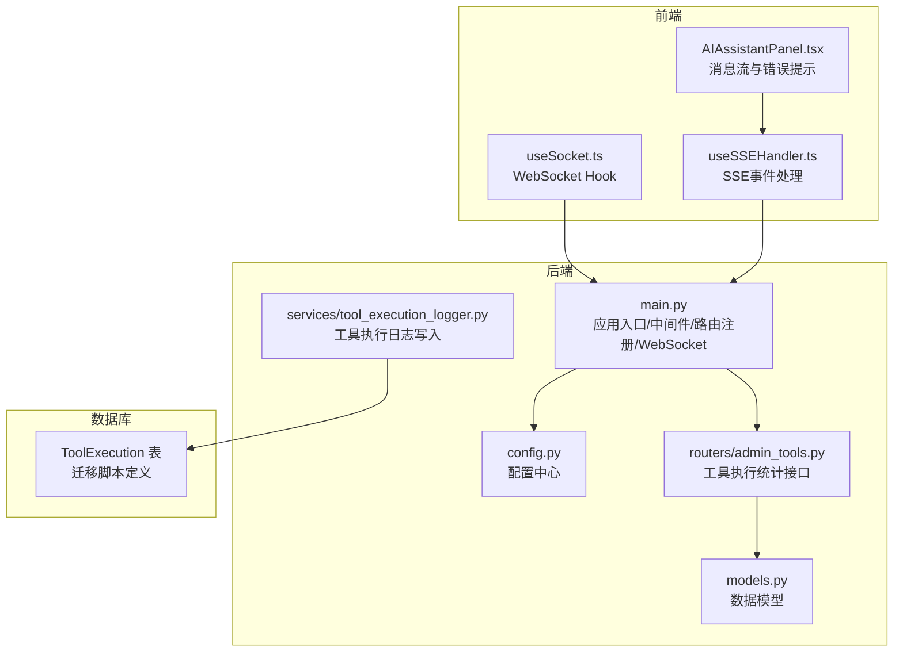
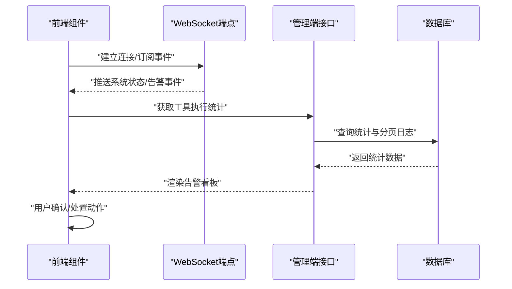
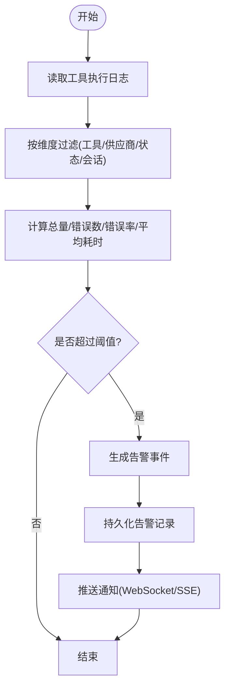
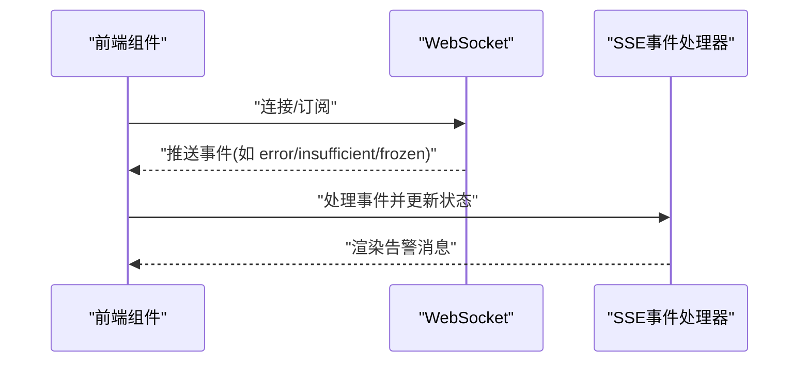
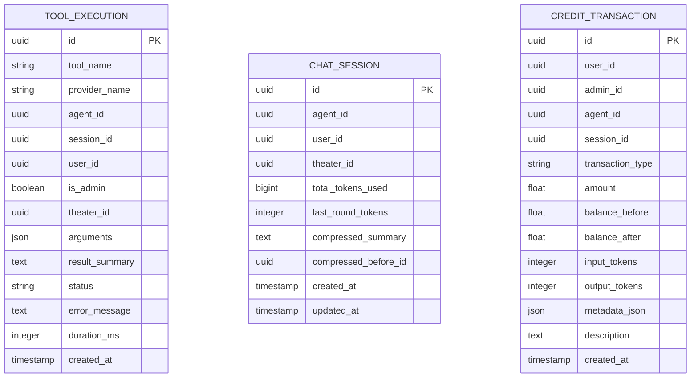
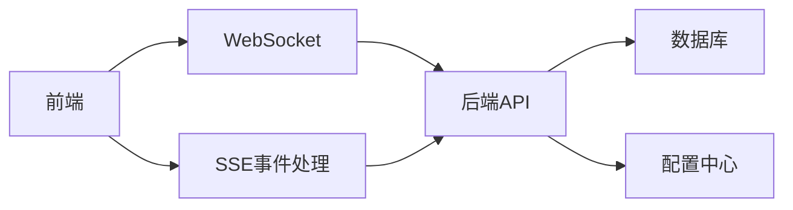

# 告警规则

<cite>
**本文引用的文件**
- [main.py](file://backend/main.py)
- [config.py](file://backend/config.py)
- [models.py](file://backend/models.py)
- [admin_tools.py](file://backend/routers/admin_tools.py)
- [tool_execution_logger.py](file://backend/services/tool_execution_logger.py)
- [useSocket.ts](file://frontend/src/hooks/useSocket.ts)
- [AIAssistantPanel.tsx](file://frontend/src/components/canvas/AIAssistantPanel.tsx)
- [useSSEHandler.ts](file://frontend/src/components/ai-assistant/hooks/useSSEHandler.ts)
- [4d66cc052bfb_add_admin_debug_sessions.py](file://backend/migrations/versions/4d66cc052bfb_add_admin_debug_sessions.py)
- [c74e516c6d87_add_credit_billing_system.py](file://backend/migrations/versions/c74e516c6d87_add_credit_billing_system.py)
</cite>

## 目录
1. [简介](#简介)
2. [项目结构](#项目结构)
3. [核心组件](#核心组件)
4. [架构总览](#架构总览)
5. [详细组件分析](#详细组件分析)
6. [依赖分析](#依赖分析)
7. [性能考量](#性能考量)
8. [故障排查指南](#故障排查指南)
9. [结论](#结论)
10. [附录](#附录)

## 简介
本文件面向Infinite Game项目的“告警规则系统”，旨在提供一套可落地的告警设计原则、分类体系与实施建议，帮助团队建立从应用层到业务层的全链路可观测性与自动化处置能力。当前仓库中未发现直接的告警规则配置或告警引擎实现代码，但通过现有日志、监控指标采集点、消息推送通道以及数据库模型，可以构建出完整的告警闭环：采集—判定—通知—处置—复盘。

## 项目结构
与告警系统相关的关键位置如下：
- 后端主程序与中间件：负责启动、CORS、路由注册与WebSocket端点
- 配置模块：集中管理数据库、Redis、密钥与运行参数
- 数据模型：包含工具执行日志、会话上下文、计费与订阅等，是告警指标的数据来源
- 管理端路由：提供工具执行统计与分页查询接口，可用于构建告警看板
- 前端Hook与组件：提供WebSocket与SSE事件接收，便于实时告警展示与交互
- 迁移脚本：定义了工具执行日志表等结构，支撑告警数据持久化

**图表来源**
- [main.py:110-175](file://backend/main.py#L110-L175)
- [config.py:1-43](file://backend/config.py#L1-L43)
- [models.py:485-503](file://backend/models.py#L485-L503)
- [admin_tools.py:105-179](file://backend/routers/admin_tools.py#L105-L179)
- [tool_execution_logger.py:44-89](file://backend/services/tool_execution_logger.py#L44-L89)
- [useSocket.ts:1-42](file://frontend/src/hooks/useSocket.ts#L1-L42)
- [useSSEHandler.ts:330-376](file://frontend/src/components/ai-assistant/hooks/useSSEHandler.ts#L330-L376)
- [AIAssistantPanel.tsx:208-271](file://frontend/src/components/canvas/AIAssistantPanel.tsx#L208-L271)

**章节来源**
- [main.py:110-175](file://backend/main.py#L110-L175)
- [config.py:1-43](file://backend/config.py#L1-L43)
- [models.py:485-503](file://backend/models.py#L485-L503)
- [admin_tools.py:105-179](file://backend/routers/admin_tools.py#L105-L179)
- [tool_execution_logger.py:44-89](file://backend/services/tool_execution_logger.py#L44-L89)
- [useSocket.ts:1-42](file://frontend/src/hooks/useSocket.ts#L1-L42)
- [useSSEHandler.ts:330-376](file://frontend/src/components/ai-assistant/hooks/useSSEHandler.ts#L330-L376)
- [AIAssistantPanel.tsx:208-271](file://frontend/src/components/canvas/AIAssistantPanel.tsx#L208-L271)

## 核心组件
- 应用入口与中间件
  - 注册CORS、调试中间件、路由与WebSocket端点，为告警系统的消息通道提供基础设施
- 配置中心
  - 提供数据库、Redis、密钥与运行参数，支撑日志、缓存与外部集成
- 数据模型与迁移
  - 工具执行日志表为告警规则提供数据基础；会话上下文与计费模型为阈值设定提供参考
- 管理端接口
  - 工具执行统计接口返回总量、错误数、错误率与平均耗时，可作为告警阈值的观测依据
- 前端事件通道
  - WebSocket与SSE事件用于实时展示告警与系统状态变化

**章节来源**
- [main.py:110-175](file://backend/main.py#L110-L175)
- [config.py:1-43](file://backend/config.py#L1-L43)
- [models.py:485-503](file://backend/models.py#L485-L503)
- [admin_tools.py:105-179](file://backend/routers/admin_tools.py#L105-L179)
- [useSocket.ts:1-42](file://frontend/src/hooks/useSocket.ts#L1-L42)
- [useSSEHandler.ts:330-376](file://frontend/src/components/ai-assistant/hooks/useSSEHandler.ts#L330-L376)

## 架构总览
告警系统采用“采集—判定—通知—处置—复盘”的闭环架构。后端通过工具执行日志与会话统计进行指标采集，前端通过WebSocket/SSE接收实时事件，形成可视化与交互式告警面板。

**图表来源**
- [main.py:161-171](file://backend/main.py#L161-L171)
- [admin_tools.py:105-179](file://backend/routers/admin_tools.py#L105-L179)
- [models.py:485-503](file://backend/models.py#L485-L503)
- [useSocket.ts:1-42](file://frontend/src/hooks/useSocket.ts#L1-L42)
- [useSSEHandler.ts:330-376](file://frontend/src/components/ai-assistant/hooks/useSSEHandler.ts#L330-L376)

## 详细组件分析

### 组件A：工具执行日志与统计
- 设计要点
  - 工具执行日志非阻塞写入，避免影响主流程
  - 对敏感参数进行脱敏，确保安全
  - 提供按工具、供应商、状态、会话等维度的分页查询
- 关键指标
  - 总调用次数、错误次数、错误率、平均耗时
- 告警示例
  - 错误率超过阈值触发应用级告警
  - 平均耗时持续上升触发服务级告警
  - 单工具错误数激增触发业务级告警

**图表来源**
- [admin_tools.py:105-179](file://backend/routers/admin_tools.py#L105-L179)
- [tool_execution_logger.py:44-89](file://backend/services/tool_execution_logger.py#L44-L89)
- [models.py:485-503](file://backend/models.py#L485-L503)

**章节来源**
- [admin_tools.py:105-179](file://backend/routers/admin_tools.py#L105-L179)
- [tool_execution_logger.py:44-89](file://backend/services/tool_execution_logger.py#L44-L89)
- [models.py:485-503](file://backend/models.py#L485-L503)

### 组件B：前端事件通道与展示
- WebSocket
  - 建立与后端的双向通信，用于实时推送告警事件
- SSE事件处理
  - 解析事件类型并更新UI状态，支持积分不足、账户冻结等提示事件
- 告警示例
  - 当后端推送“error”事件时，前端展示错误告警
  - 当后端推送“insufficient”或“frozen”事件时，前端展示用户侧告警

**图表来源**
- [useSocket.ts:1-42](file://frontend/src/hooks/useSocket.ts#L1-L42)
- [useSSEHandler.ts:330-376](file://frontend/src/components/ai-assistant/hooks/useSSEHandler.ts#L330-L376)
- [AIAssistantPanel.tsx:208-271](file://frontend/src/components/canvas/AIAssistantPanel.tsx#L208-L271)

**章节来源**
- [useSocket.ts:1-42](file://frontend/src/hooks/useSocket.ts#L1-L42)
- [useSSEHandler.ts:330-376](file://frontend/src/components/ai-assistant/hooks/useSSEHandler.ts#L330-L376)
- [AIAssistantPanel.tsx:208-271](file://frontend/src/components/canvas/AIAssistantPanel.tsx#L208-L271)

### 组件C：数据模型与阈值参考
- 工具执行日志
  - 为告警规则提供原始数据，支持按工具、会话、状态等聚合
- 会话上下文
  - 记录token使用与压缩状态，可作为上下文压力类告警的参考
- 计费与订阅
  - 余额冻结与不足可触发业务级告警，需结合前端提示与后端事件

**图表来源**
- [models.py:485-503](file://backend/models.py#L485-L503)
- [models.py:178-197](file://backend/models.py#L178-L197)
- [models.py:281-301](file://backend/models.py#L281-L301)

**章节来源**
- [models.py:485-503](file://backend/models.py#L485-L503)
- [models.py:178-197](file://backend/models.py#L178-L197)
- [models.py:281-301](file://backend/models.py#L281-L301)

## 依赖分析
- 后端依赖
  - FastAPI应用、CORS中间件、路由注册、WebSocket端点
  - 配置中心提供数据库与Redis连接
  - 数据模型与迁移脚本支撑日志与统计
- 前端依赖
  - WebSocket Hook与SSE事件处理器，用于接收后端推送
- 外部集成
  - 可通过WebSocket/SSE扩展邮件、短信与IM集成（当前仓库未包含具体实现）

**图表来源**
- [main.py:130-153](file://backend/main.py#L130-L153)
- [config.py:1-43](file://backend/config.py#L1-L43)
- [useSocket.ts:1-42](file://frontend/src/hooks/useSocket.ts#L1-L42)
- [useSSEHandler.ts:330-376](file://frontend/src/components/ai-assistant/hooks/useSSEHandler.ts#L330-L376)

**章节来源**
- [main.py:130-153](file://backend/main.py#L130-L153)
- [config.py:1-43](file://backend/config.py#L1-L43)
- [useSocket.ts:1-42](file://frontend/src/hooks/useSocket.ts#L1-L42)
- [useSSEHandler.ts:330-376](file://frontend/src/components/ai-assistant/hooks/useSSEHandler.ts#L330-L376)

## 性能考量
- 非阻塞日志写入
  - 工具执行日志采用异步任务写入，避免阻塞主流程
- 查询优化
  - 管理端接口支持多维度过滤与分页，降低大表扫描开销
- 事件通道
  - WebSocket与SSE事件按需推送，减少无效流量

**章节来源**
- [tool_execution_logger.py:84-89](file://backend/services/tool_execution_logger.py#L84-L89)
- [admin_tools.py:135-179](file://backend/routers/admin_tools.py#L135-L179)

## 故障排查指南
- WebSocket连接问题
  - 检查后端WebSocket端点是否正常，前端是否正确初始化
- SSE事件未到达
  - 确认后端SSE事件类型与前端事件处理器匹配
- 工具执行日志缺失
  - 检查日志写入是否抛出异常（当前实现为静默失败）
- 前端错误提示
  - 前端对401/402/403/429等状态码有明确提示，便于定位问题

**章节来源**
- [main.py:161-171](file://backend/main.py#L161-L171)
- [useSocket.ts:1-42](file://frontend/src/hooks/useSocket.ts#L1-L42)
- [useSSEHandler.ts:330-376](file://frontend/src/components/ai-assistant/hooks/useSSEHandler.ts#L330-L376)
- [AIAssistantPanel.tsx:240-252](file://frontend/src/components/canvas/AIAssistantPanel.tsx#L240-L252)

## 结论
当前仓库尚未包含内置的告警引擎与规则配置，但已具备完善的日志采集、统计查询与事件通道能力。建议在此基础上引入告警规则引擎（如Prometheus规则或自研规则引擎），结合阈值设定与通知通道，形成可配置、可扩展的告警体系。

## 附录

### 告警规则设计原则与分类体系
- 设计原则
  - 明确性：告警必须清晰描述问题与影响范围
  - 可操作性：告警应提供处置指引或关联工单
  - 时效性：告警应在问题发生后尽快触发
  - 可验证性：告警应可追溯、可复现
- 分类体系
  - 应用级告警：服务可用性、接口错误率、数据库连接数、线程池饱和
  - 服务级告警：工具执行耗时、队列积压、第三方API限流
  - 业务级告警：余额不足、冻结、订阅到期、内容审核拒绝

**章节来源**
- [admin_tools.py:105-179](file://backend/routers/admin_tools.py#L105-L179)
- [models.py:485-503](file://backend/models.py#L485-L503)

### 关键指标阈值设置建议
- CPU使用率阈值
  - 建议：平均值>80%持续5分钟触发应用级告警
- 内存占用阈值
  - 建议：使用率>85%持续3分钟触发应用级告警
- 数据库连接数阈值
  - 建议：活跃连接>最大连接数×80%持续2分钟触发服务级告警
- API响应时间阈值
  - 建议：P95>1s持续5分钟触发服务级告警

**章节来源**
- [admin_tools.py:105-179](file://backend/routers/admin_tools.py#L105-L179)

### 告警通知配置建议
- 邮件告警
  - 通过SMTP发送告警摘要与链接
- 短信告警
  - 通过短信网关发送紧急告警
- 即时通讯工具集成
  - 通过Webhook对接企业微信/钉钉/飞书机器人

**章节来源**
- [useSocket.ts:1-42](file://frontend/src/hooks/useSocket.ts#L1-L42)
- [useSSEHandler.ts:330-376](file://frontend/src/components/ai-assistant/hooks/useSSEHandler.ts#L330-L376)

### 告警升级机制建议
- 初次告警：触发通知并创建工单
- 重复告警：每间隔X分钟重复通知，直至恢复
- 故障恢复告警：自动关闭工单并发送恢复通知

**章节来源**
- [main.py:161-171](file://backend/main.py#L161-L171)

### 告警去重与抑制策略
- 去重
  - 基于告警键（指标+标签）去重，避免同一问题重复告警
- 抑制
  - 主故障抑制次要告警，恢复后自动解除

**章节来源**
- [tool_execution_logger.py:44-89](file://backend/services/tool_execution_logger.py#L44-L89)

### 告警历史与趋势分析
- 历史记录
  - 工具执行日志支持按时间、状态、工具等维度查询
- 趋势分析
  - 通过统计接口生成错误率与耗时趋势图，辅助定位瓶颈

**章节来源**
- [admin_tools.py:105-179](file://backend/routers/admin_tools.py#L105-L179)
- [models.py:485-503](file://backend/models.py#L485-L503)