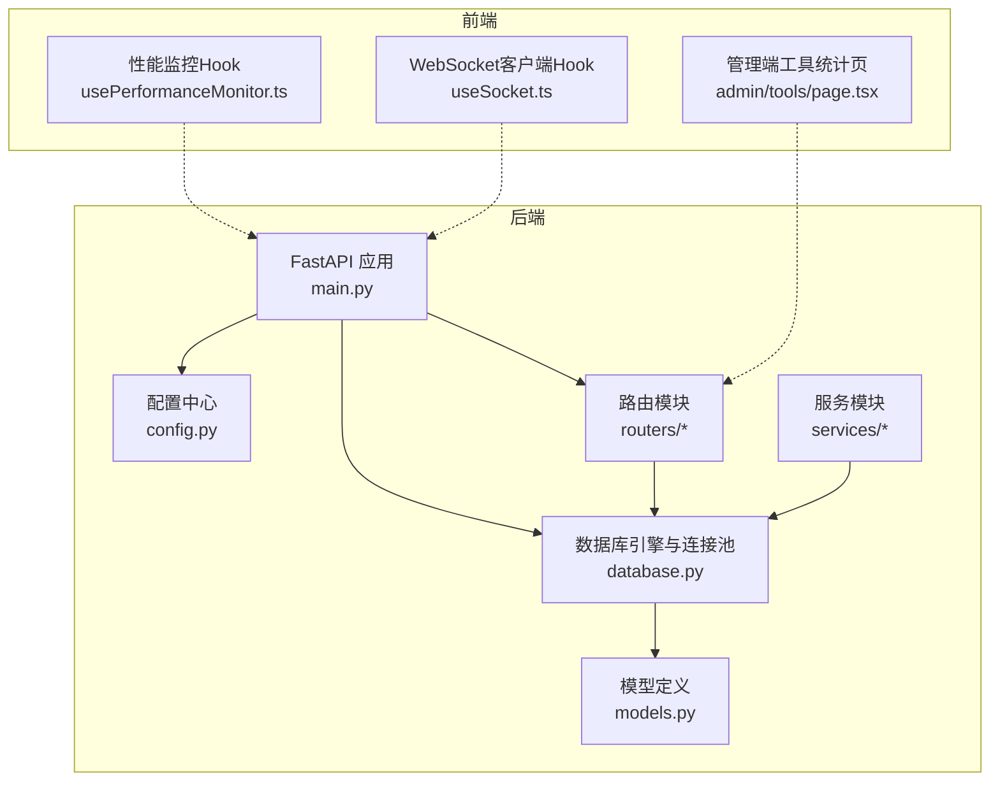
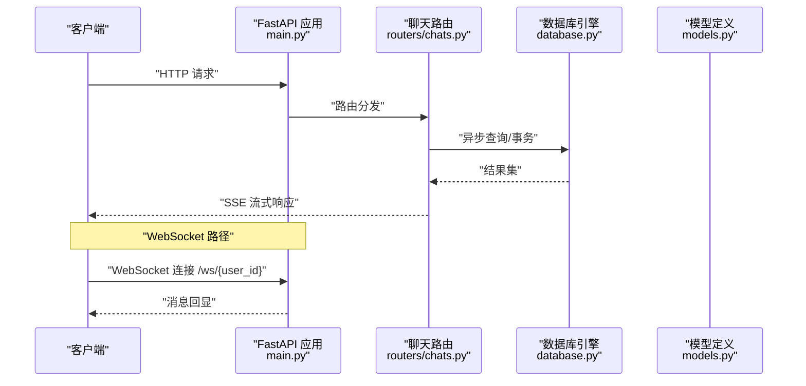
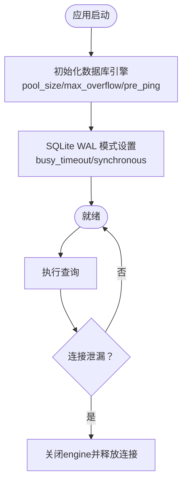
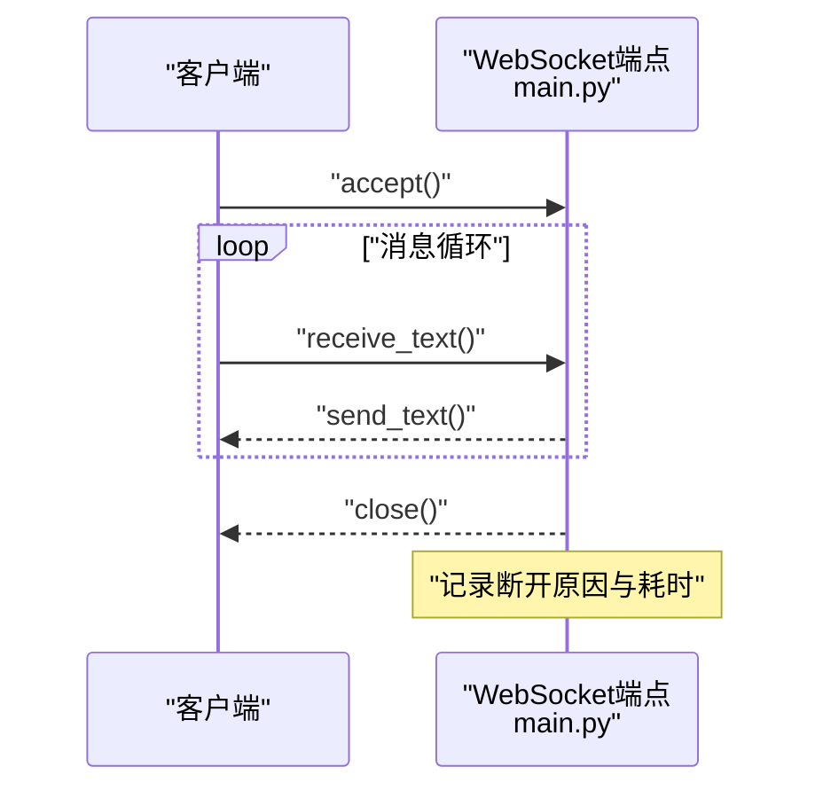
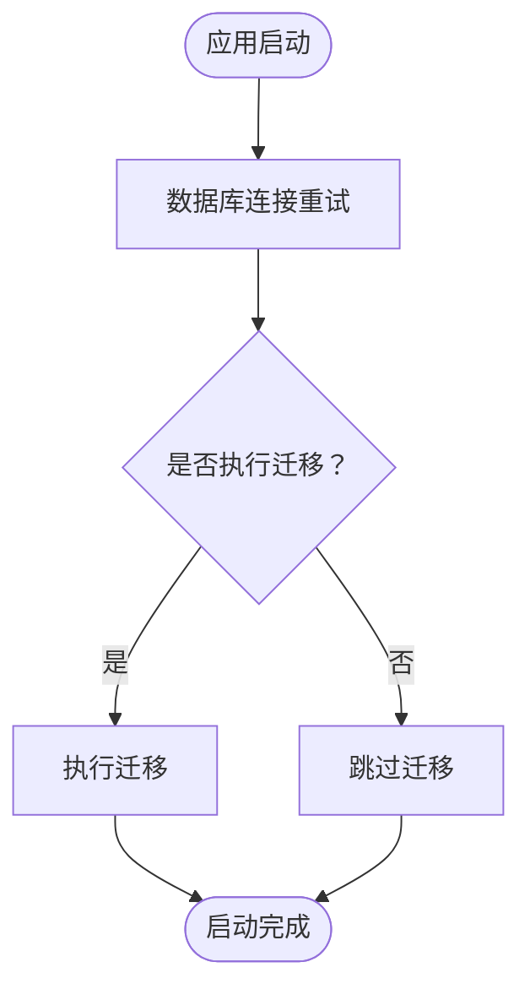
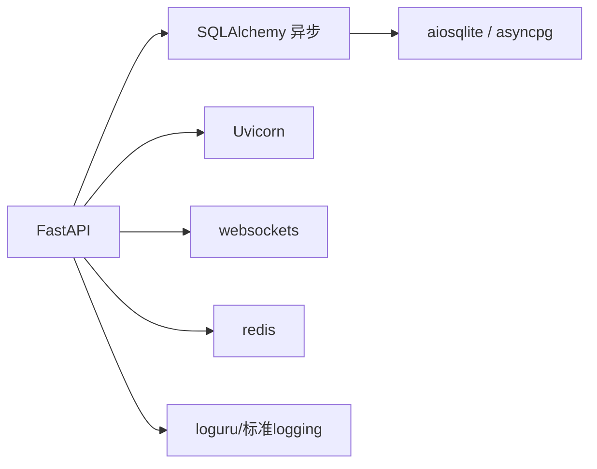

# 应用性能监控

<cite>
**本文引用的文件**
- [main.py](file://backend/main.py)
- [config.py](file://backend/config.py)
- [database.py](file://backend/database.py)
- [models.py](file://backend/models.py)
- [requirements.txt](file://backend/requirements.txt)
- [routers/chats.py](file://backend/routers/chats.py)
- [routers/admin.py](file://backend/routers/admin.py)
- [routers/skills_api.py](file://backend/routers/skills_api.py)
- [services/chat_utils.py](file://backend/services/chat_utils.py)
- [frontend/src/components/ai-assistant/hooks/usePerformanceMonitor.ts](file://frontend/src/components/ai-assistant/hooks/usePerformanceMonitor.ts)
- [frontend/src/hooks/useSocket.ts](file://frontend/src/hooks/useSocket.ts)
- [backend/admin/src/app/admin/tools/page.tsx](file://backend/admin/src/app/admin/tools/page.tsx)
</cite>

## 目录
1. [简介](#简介)
2. [项目结构](#项目结构)
3. [核心组件](#核心组件)
4. [架构总览](#架构总览)
5. [详细组件分析](#详细组件分析)
6. [依赖分析](#依赖分析)
7. [性能考量](#性能考量)
8. [故障排查指南](#故障排查指南)
9. [结论](#结论)
10. [附录](#附录)

## 简介
本文件面向Infinite Game后端FastAPI应用的性能监控，围绕以下目标展开：
- 请求响应时间监控、并发连接数监控与错误率统计
- 数据库连接池监控（连接数使用、查询执行时间、连接泄漏检测）
- WebSocket连接监控（活跃连接数、消息传输延迟、断开原因分析）
- 系统资源监控（CPU、内存、磁盘IO、网络带宽）
- 应用启动与运行时健康检查（数据库连接、服务可用性、依赖服务状态）

当前仓库中未发现内置的指标导出器（如Prometheus）、系统资源采集器或专用的WebSocket连接池管理器。因此，本文将基于现有代码与依赖，给出可落地的监控方案与最佳实践建议，并标注已分析到的源文件。

## 项目结构
后端采用FastAPI + SQLAlchemy异步ORM + Uvicorn ASGI服务器，数据库默认使用SQLite（可通过环境变量切换至PostgreSQL）。前端包含性能监控Hook与WebSocket客户端Hook，以及管理端工具调用统计页面。

图表来源
- [main.py:110-175](file://backend/main.py#L110-L175)
- [config.py:1-43](file://backend/config.py#L1-L43)
- [database.py:1-45](file://backend/database.py#L1-L45)
- [models.py:1-503](file://backend/models.py#L1-L503)
- [routers/chats.py:1-232](file://backend/routers/chats.py#L1-L232)
- [frontend/src/components/ai-assistant/hooks/usePerformanceMonitor.ts:1-235](file://frontend/src/components/ai-assistant/hooks/usePerformanceMonitor.ts#L1-L235)
- [frontend/src/hooks/useSocket.ts:1-42](file://frontend/src/hooks/useSocket.ts#L1-L42)
- [backend/admin/src/app/admin/tools/page.tsx:99-129](file://backend/admin/src/app/admin/tools/page.tsx#L99-L129)

章节来源
- [main.py:110-175](file://backend/main.py#L110-L175)
- [config.py:1-43](file://backend/config.py#L1-L43)
- [database.py:1-45](file://backend/database.py#L1-L45)
- [models.py:1-503](file://backend/models.py#L1-L503)
- [routers/chats.py:1-232](file://backend/routers/chats.py#L1-L232)
- [frontend/src/components/ai-assistant/hooks/usePerformanceMonitor.ts:1-235](file://frontend/src/components/ai-assistant/hooks/usePerformanceMonitor.ts#L1-L235)
- [frontend/src/hooks/useSocket.ts:1-42](file://frontend/src/hooks/useSocket.ts#L1-L42)
- [backend/admin/src/app/admin/tools/page.tsx:99-129](file://backend/admin/src/app/admin/tools/page.tsx#L99-L129)

## 核心组件
- 应用入口与生命周期：通过lifespan在启动阶段进行数据库连接重试、迁移与Narrative引擎初始化；关闭时清理资源。
- 数据库连接池：异步引擎配置了连接池大小、溢出连接数、pre_ping与SQLite WAL优化。
- 路由与流式响应：聊天路由使用Server-Sent Events（SSE）进行流式输出，便于观察响应延迟与吞吐。
- WebSocket端点：提供基础的文本回显WebSocket端点，可用于后续扩展监控。
- 前端性能监控：浏览器侧Long Task/LCP/FID/CLS/FPS监控Hook。
- 管理端工具统计：展示工具调用次数、错误次数与平均耗时，便于定位工具层性能瓶颈。

章节来源
- [main.py:49-108](file://backend/main.py#L49-L108)
- [database.py:9-37](file://backend/database.py#L9-L37)
- [routers/chats.py:175-183](file://backend/routers/chats.py#L175-L183)
- [frontend/src/components/ai-assistant/hooks/usePerformanceMonitor.ts:31-206](file://frontend/src/components/ai-assistant/hooks/usePerformanceMonitor.ts#L31-L206)
- [backend/admin/src/app/admin/tools/page.tsx:99-129](file://backend/admin/src/app/admin/tools/page.tsx#L99-L129)

## 架构总览
下图展示了从请求进入、数据库访问、服务处理到响应返回的整体流程，以及WebSocket交互路径。

图表来源
- [main.py:161-171](file://backend/main.py#L161-L171)
- [routers/chats.py:127-183](file://backend/routers/chats.py#L127-L183)
- [database.py:42-45](file://backend/database.py#L42-L45)
- [models.py:178-208](file://backend/models.py#L178-L208)

## 详细组件分析

### FastAPI 应用性能监控配置
- 请求响应时间监控
  - 建议在中间件中记录请求开始时间与结束时间，结合响应状态码统计P50/P95响应时间。
  - 当前应用已关闭Uvicorn访问日志，便于减少噪声；可在自定义中间件中补充采样与聚合。
- 并发连接数监控
  - Uvicorn默认并发模型受服务器参数影响；建议通过外部负载均衡器或容器编排平台暴露连接数指标。
- 错误率统计
  - 结合路由层异常捕获与日志聚合，统计4xx/5xx错误占比与Top错误路径。

章节来源
- [main.py:156-175](file://backend/main.py#L156-L175)
- [config.py:15](file://backend/config.py#L15)

### 数据库连接池监控
- 连接数使用情况
  - 引擎配置了pool_size与max_overflow，可结合SQLAlchemy事件监听器或第三方工具（如pg_stat_statements）统计活跃连接数。
- 查询执行时间监控
  - 建议启用SQL日志或使用opentelemetry/sqlcommenter记录执行计划与耗时；当前echo=False以减少日志干扰。
- 连接泄漏检测
  - 通过连接池回收策略与pre_ping机制降低泄漏风险；建议在lifespan结束时主动关闭engine，避免进程级连接残留。

图表来源
- [database.py:9-31](file://backend/database.py#L9-L31)
- [database.py:23-31](file://backend/database.py#L23-L31)

章节来源
- [database.py:9-37](file://backend/database.py#L9-L37)

### WebSocket连接监控
- 活跃连接数
  - 当前WebSocket端点为简单回显，未实现连接池与计数器；建议引入Redis或内存集合维护活跃连接，并在连接建立/关闭时增减计数。
- 消息传输延迟
  - 可在客户端记录发送时间，在服务端回显时记录接收时间，计算往返延迟分布。
- 断开原因分析
  - 在finally块中记录断开原因（异常/正常关闭），并上报到日志系统或指标平台。

图表来源
- [main.py:161-171](file://backend/main.py#L161-L171)

章节来源
- [main.py:161-171](file://backend/main.py#L161-L171)

### 系统资源监控配置
- CPU使用率、内存占用、磁盘IO、网络带宽
  - 建议通过操作系统级监控工具（如Prometheus Node Exporter、Telegraf）或语言绑定（如psutil）采集指标。
  - 对于容器化部署，可利用Kubernetes指标管道（Metrics Server）与Helm Charts中的exporter组件。
  - 当前项目未包含专用资源监控代码，建议在部署层统一接入。

### 应用启动与运行时健康检查
- 启动阶段
  - 数据库连接重试与迁移：在lifespan中尝试连接并执行迁移，失败时重试并清理残留临时表后重试。
- 运行时健康检查
  - 建议新增/health端点，检查数据库连通性、关键依赖可用性（如Redis、外部LLM服务）。
  - 管理端工具统计页已展示工具调用次数、错误次数与平均耗时，可作为内部健康度参考。

图表来源
- [main.py:49-108](file://backend/main.py#L49-L108)

章节来源
- [main.py:49-108](file://backend/main.py#L49-L108)
- [backend/admin/src/app/admin/tools/page.tsx:99-129](file://backend/admin/src/app/admin/tools/page.tsx#L99-L129)

## 依赖分析
- FastAPI/Uvicorn：提供ASGI服务器与路由能力
- SQLAlchemy异步：提供异步ORM与连接池
- aiosqlite/asyncpg：SQLite/PostgreSQL驱动
- redis：缓存与分布式锁（可用于WebSocket连接计数）
- websockets：WebSocket协议支持
- loguru/标准logging：日志记录（当前已对SQLAlchemy与Uvicorn日志进行降噪）

图表来源
- [requirements.txt:1-29](file://backend/requirements.txt#L1-L29)

章节来源
- [requirements.txt:1-29](file://backend/requirements.txt#L1-L29)

## 性能考量
- 数据库层
  - SQLite WAL模式与busy_timeout有助于缓解“database is locked”错误，提升并发读写能力。
  - pre_ping与连接池参数需结合QPS与峰值并发进行调优。
- 网络层
  - SSE流式响应适合长文本生成场景；注意Nginx/反向代理的缓冲与超时配置。
  - WebSocket端点应限制消息大小与频率，防止内存膨胀。
- 前端性能
  - 浏览器侧Long Task/LCP/FID/CLS/FPS监控有助于识别UI卡顿与渲染问题。
  - 建议对高频操作使用useMeasurePerformance进行细粒度耗时统计。

章节来源
- [database.py:23-31](file://backend/database.py#L23-L31)
- [routers/chats.py:175-183](file://backend/routers/chats.py#L175-L183)
- [frontend/src/components/ai-assistant/hooks/usePerformanceMonitor.ts:31-206](file://frontend/src/components/ai-assistant/hooks/usePerformanceMonitor.ts#L31-L206)

## 故障排查指南
- 数据库连接失败
  - 检查DATABASE_URL与权限；确认SQLite文件路径正确；若为PostgreSQL，检查asyncpg版本与网络连通性。
- 迁移失败
  - 查看迁移日志与残留临时表，必要时清理后重试。
- WebSocket断开
  - 在finally块中记录异常类型与断开原因；检查客户端网络波动与服务端资源限制。
- 前端性能异常
  - 使用usePerformanceMonitor捕获Long Task与FPS异常，结合浏览器开发者工具定位瓶颈。

章节来源
- [config.py:15](file://backend/config.py#L15)
- [main.py:49-108](file://backend/main.py#L49-L108)
- [main.py:161-171](file://backend/main.py#L161-L171)
- [frontend/src/components/ai-assistant/hooks/usePerformanceMonitor.ts:31-206](file://frontend/src/components/ai-assistant/hooks/usePerformanceMonitor.ts#L31-L206)

## 结论
当前Infinite Game后端具备良好的异步数据库与WebSocket基础，但缺少内置的指标导出与系统资源监控。建议在部署层统一接入Prometheus/Grafana与APM工具，完善数据库连接池与WebSocket连接的可观测性，并在应用内增加健康检查与关键路径耗时埋点，以形成闭环的性能监控体系。

## 附录
- 工具调用统计页面展示的关键指标（总调用次数、错误次数、错误率、平均耗时）可作为内部健康度参考，建议进一步接入实时仪表盘。

章节来源
- [backend/admin/src/app/admin/tools/page.tsx:99-129](file://backend/admin/src/app/admin/tools/page.tsx#L99-L129)