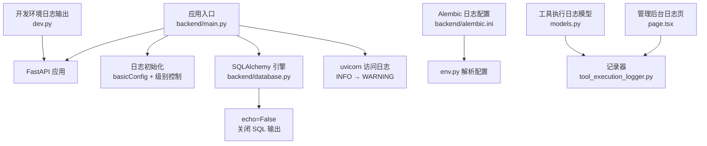
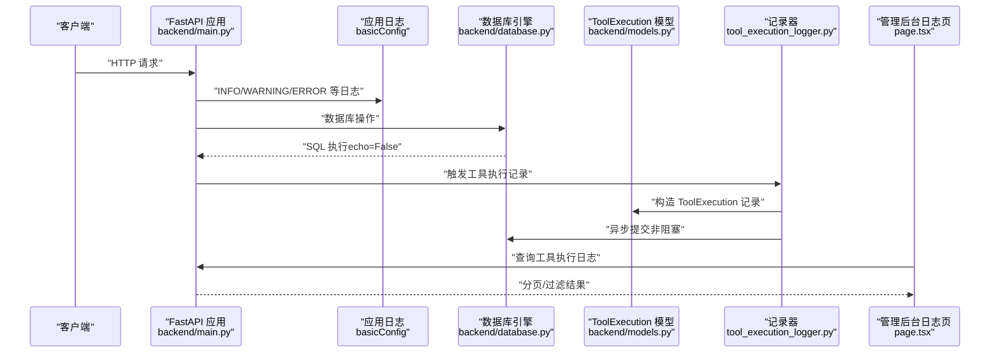
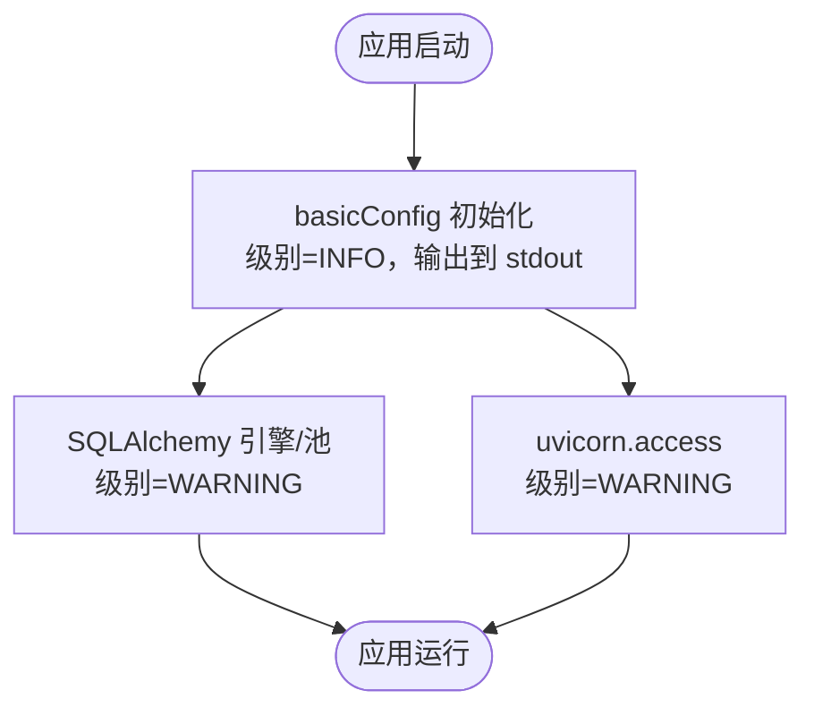
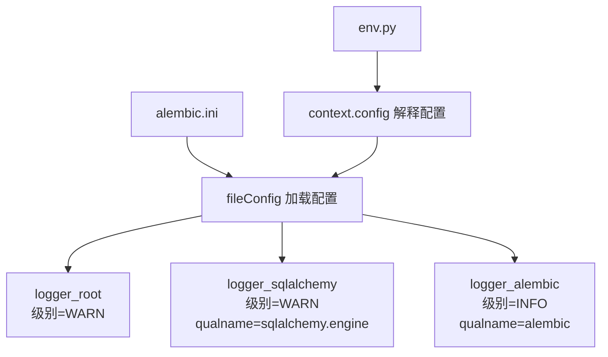
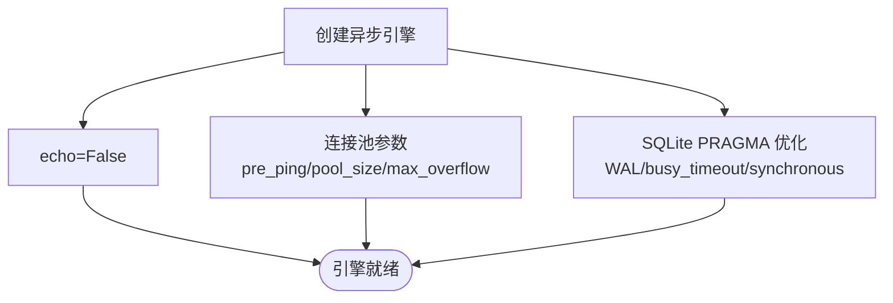
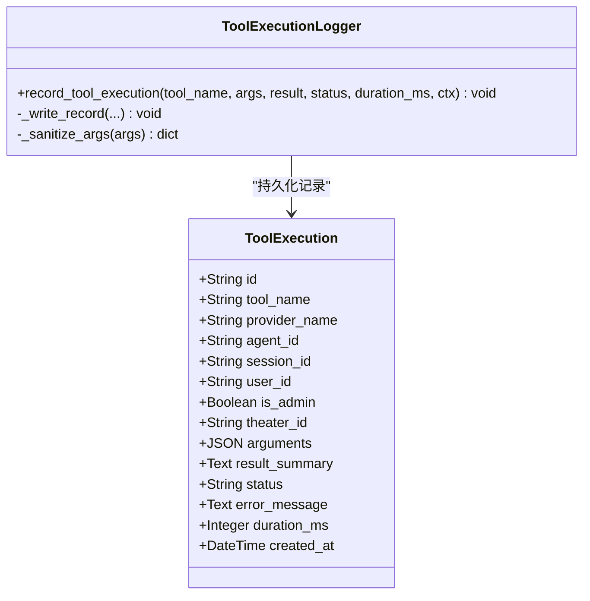
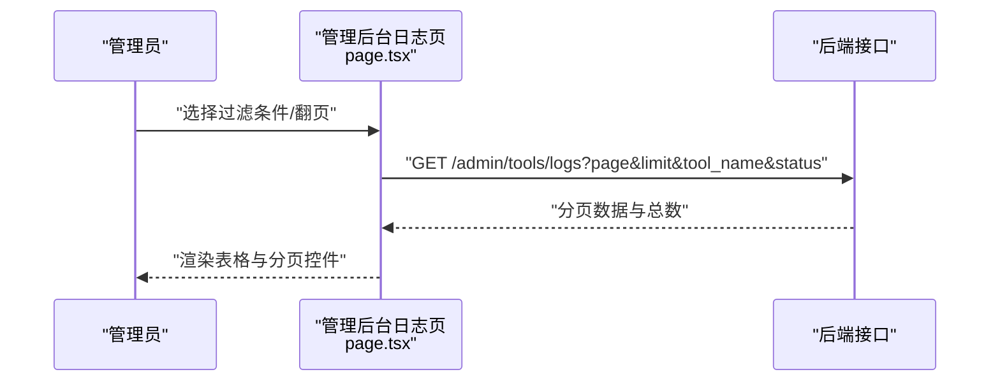
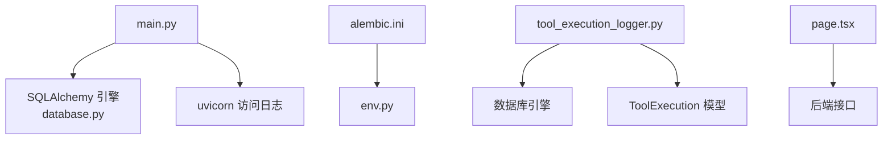

# 日志分析

<cite>
**本文引用的文件**   
- [main.py](file://backend/main.py)
- [alembic.ini](file://backend/alembic.ini)
- [env.py](file://backend/migrations/env.py)
- [config.py](file://backend/config.py)
- [database.py](file://backend/database.py)
- [models.py](file://backend/models.py)
- [tool_execution_logger.py](file://backend/services/tool_execution_logger.py)
- [page.tsx](file://backend/admin/src/app/admin/tools/logs/page.tsx)
- [dev.py](file://dev.py)
</cite>

## 目录
1. [简介](#简介)
2. [项目结构](#项目结构)
3. [核心组件](#核心组件)
4. [架构总览](#架构总览)
5. [详细组件分析](#详细组件分析)
6. [依赖分析](#依赖分析)
7. [性能考虑](#性能考虑)
8. [故障排查指南](#故障排查指南)
9. [结论](#结论)
10. [附录](#附录)

## 简介
本文件面向 KunFlix 的日志分析系统，围绕应用日志、SQLAlchemy 日志、uvicorn 访问日志的配置与级别控制展开；同时介绍工具执行日志的数据库持久化与管理界面；并给出日志聚合与存储策略建议、ELK Stack 集成思路、关键事件追踪配置、日志轮转与归档策略以及日志查询与过滤示例，帮助开发者快速定位问题并满足合规要求。

## 项目结构
本项目的日志相关实现主要分布在以下位置：
- 应用入口与日志初始化：backend/main.py
- SQLAlchemy 日志与 Alembic 日志配置：backend/alembic.ini、backend/migrations/env.py
- 数据库引擎与连接池配置：backend/database.py
- 日志配置与环境变量：backend/config.py
- 工具执行日志的数据模型与记录器：backend/models.py、backend/services/tool_execution_logger.py
- 管理后台日志查看页面：backend/admin/src/app/admin/tools/logs/page.tsx
- 开发环境日志输出：dev.py

**图表来源**
- [main.py:15-30](file://backend/main.py#L15-L30)
- [database.py:9-19](file://backend/database.py#L9-L19)
- [alembic.ini:81-114](file://backend/alembic.ini#L81-L114)
- [env.py:23-26](file://backend/migrations/env.py#L23-L26)
- [models.py:485-502](file://backend/models.py#L485-L502)
- [tool_execution_logger.py:77-89](file://backend/services/tool_execution_logger.py#L77-L89)
- [page.tsx:25-185](file://backend/admin/src/app/admin/tools/logs/page.tsx#L25-L185)
- [dev.py:63-92](file://dev.py#L63-L92)

**章节来源**
- [main.py:15-30](file://backend/main.py#L15-L30)
- [alembic.ini:81-114](file://backend/alembic.ini#L81-L114)
- [env.py:23-26](file://backend/migrations/env.py#L23-L26)
- [database.py:9-19](file://backend/database.py#L9-L19)
- [models.py:485-502](file://backend/models.py#L485-L502)
- [tool_execution_logger.py:77-89](file://backend/services/tool_execution_logger.py#L77-L89)
- [page.tsx:25-185](file://backend/admin/src/app/admin/tools/logs/page.tsx#L25-L185)
- [dev.py:63-92](file://dev.py#L63-L92)

## 核心组件
- 应用日志与级别控制
  - 在应用入口进行统一日志初始化，并将 SQLAlchemy 引擎日志与 uvicorn 访问日志降级，避免终端被大量日志刷屏。
- SQLAlchemy 日志与 Alembic 日志
  - 通过 Alembic 配置文件定义根日志器、SQLAlchemy 日志器与 Alembic 日志器的级别与处理器；在迁移脚本中加载该配置以保证迁移过程日志一致性。
- 数据库引擎与连接池
  - 引擎创建时显式关闭 echo，降低 SQL 语句输出对日志系统的压力；SQLite 场景下通过事件监听设置 WAL、busy_timeout、synchronous 等参数提升稳定性。
- 工具执行日志
  - 定义 ToolExecution 数据模型，记录工具名称、提供方、调用者、会话、剧场、参数（敏感字段脱敏）、结果摘要、状态、错误信息、耗时等；记录器采用非阻塞异步写入，失败静默，不影响主流程。
- 管理后台日志查看
  - 提供工具执行日志的分页、过滤（按工具名、状态）与刷新功能，便于管理员审计与排障。

**章节来源**
- [main.py:15-30](file://backend/main.py#L15-L30)
- [alembic.ini:81-114](file://backend/alembic.ini#L81-L114)
- [env.py:23-26](file://backend/migrations/env.py#L23-L26)
- [database.py:9-19](file://backend/database.py#L9-L19)
- [models.py:485-502](file://backend/models.py#L485-L502)
- [tool_execution_logger.py:77-89](file://backend/services/tool_execution_logger.py#L77-L89)
- [page.tsx:25-185](file://backend/admin/src/app/admin/tools/logs/page.tsx#L25-L185)

## 架构总览
下图展示了日志从产生到持久化的整体流程，以及与管理后台的交互：

**图表来源**
- [main.py:15-30](file://backend/main.py#L15-L30)
- [database.py:9-19](file://backend/database.py#L9-L19)
- [models.py:485-502](file://backend/models.py#L485-L502)
- [tool_execution_logger.py:77-89](file://backend/services/tool_execution_logger.py#L77-L89)
- [page.tsx:25-185](file://backend/admin/src/app/admin/tools/logs/page.tsx#L25-L185)

## 详细组件分析

### 应用日志与级别控制
- 初始化策略
  - 使用 basicConfig 设置应用日志级别为 INFO，输出到标准输出，格式包含模块名、级别与消息。
  - 对 SQLAlchemy 引擎与连接池日志设置为 WARNING，降低噪声。
  - 对 uvicorn 访问日志设置为 WARNING，仅保留错误级别的访问日志，避免大量请求日志影响可观测性。
- 开发环境注意
  - 在 Windows 上对 stdout/stderr 的 buffer 编码进行 UTF-8 适配，避免日志乱码。

**图表来源**
- [main.py:15-30](file://backend/main.py#L15-L30)

**章节来源**
- [main.py:15-30](file://backend/main.py#L15-L30)

### SQLAlchemy 日志与 Alembic 日志
- Alembic 日志配置
  - 定义根日志器、SQLAlchemy 日志器与 Alembic 日志器，分别设置级别与处理器。
  - SQLAlchemy 日志器限定到 sqlalchemy.engine，Alembic 日志器限定到 alembic。
- 迁移脚本加载
  - env.py 在运行时加载 Alembic 配置文件，确保迁移过程的日志行为与应用一致。

**图表来源**
- [alembic.ini:81-114](file://backend/alembic.ini#L81-L114)
- [env.py:23-26](file://backend/migrations/env.py#L23-L26)

**章节来源**
- [alembic.ini:81-114](file://backend/alembic.ini#L81-L114)
- [env.py:23-26](file://backend/migrations/env.py#L23-L26)

### 数据库引擎与连接池
- 引擎创建
  - 显式关闭 echo，避免 SQL 语句直接输出到日志。
  - 设置连接池参数（pool_pre_ping、pool_size、max_overflow）与 SQLite 特定 PRAGMA 参数（WAL、busy_timeout、synchronous）以提升稳定性。
- 运行时优化
  - SQLite 通过事件监听设置 PRAGMA，减少“database is locked”错误，提高并发读写能力。

**图表来源**
- [database.py:9-19](file://backend/database.py#L9-L19)
- [database.py:23-31](file://backend/database.py#L23-L31)

**章节来源**
- [database.py:9-19](file://backend/database.py#L9-L19)
- [database.py:23-31](file://backend/database.py#L23-L31)

### 工具执行日志模型与记录器
- 数据模型
  - ToolExecution 表包含工具名、提供方、关联对象（agent/session/user/theater）、参数（JSON，敏感字段脱敏）、结果摘要、状态、错误信息、耗时、创建时间等字段，并建立多处索引以支持查询与审计。
- 记录器
  - 非阻塞异步写入：使用 asyncio.create_task 启动独立协程，失败时仅记录警告，不中断主流程。
  - 参数脱敏：内置敏感键集合，写入前自动剔除敏感字段。
  - 结果截断：对结果摘要进行长度限制，避免过大 JSON 影响存储与查询。

**图表来源**
- [models.py:485-502](file://backend/models.py#L485-L502)
- [tool_execution_logger.py:77-89](file://backend/services/tool_execution_logger.py#L77-L89)

**章节来源**
- [models.py:485-502](file://backend/models.py#L485-L502)
- [tool_execution_logger.py:77-89](file://backend/services/tool_execution_logger.py#L77-L89)

### 管理后台日志查看
- 功能概览
  - 支持按工具名与状态过滤，分页浏览，刷新列表。
  - 展示时间、工具名、提供方、状态、耗时、来源（管理员/用户）、结果摘要/错误信息。
- 技术要点
  - 前端通过 hooks/useToolExecutions 获取数据，后端提供分页与过滤接口（由页面注释可知）。

**图表来源**
- [page.tsx:25-185](file://backend/admin/src/app/admin/tools/logs/page.tsx#L25-L185)

**章节来源**
- [page.tsx:25-185](file://backend/admin/src/app/admin/tools/logs/page.tsx#L25-L185)

### 开发环境日志输出
- 多进程日志合并
  - dev.py 同时启动前端与后端进程，实时读取子进程输出并统一打印，便于开发期观察全栈日志。
- 注意事项
  - 在 Windows 上使用 shell=True 以正确解析命令路径；对输出进行编码处理，避免乱码。

**章节来源**
- [dev.py:63-92](file://dev.py#L63-L92)

## 依赖分析
- 组件耦合
  - 应用日志初始化位于应用入口，对 SQLAlchemy 与 uvicorn 日志进行全局级别控制，耦合度低、影响面广。
  - Alembic 日志配置通过 env.py 加载，与迁移流程强耦合，确保迁移期间日志一致性。
  - 工具执行日志记录器与数据库引擎解耦，通过独立会话与非阻塞写入降低对主流程的影响。
- 外部依赖
  - SQLAlchemy 异步引擎与 Alembic 迁移工具链。
  - FastAPI/Uvicorn 作为 Web 服务器与 ASGI 服务器。
  - 前端 Next.js 管理后台。

**图表来源**
- [main.py:15-30](file://backend/main.py#L15-L30)
- [alembic.ini:81-114](file://backend/alembic.ini#L81-L114)
- [env.py:23-26](file://backend/migrations/env.py#L23-L26)
- [database.py:9-19](file://backend/database.py#L9-L19)
- [tool_execution_logger.py:77-89](file://backend/services/tool_execution_logger.py#L77-L89)
- [models.py:485-502](file://backend/models.py#L485-L502)
- [page.tsx:25-185](file://backend/admin/src/app/admin/tools/logs/page.tsx#L25-L185)

**章节来源**
- [main.py:15-30](file://backend/main.py#L15-L30)
- [alembic.ini:81-114](file://backend/alembic.ini#L81-L114)
- [env.py:23-26](file://backend/migrations/env.py#L23-L26)
- [database.py:9-19](file://backend/database.py#L9-L19)
- [tool_execution_logger.py:77-89](file://backend/services/tool_execution_logger.py#L77-L89)
- [models.py:485-502](file://backend/models.py#L485-L502)
- [page.tsx:25-185](file://backend/admin/src/app/admin/tools/logs/page.tsx#L25-L185)

## 性能考虑
- 日志级别降级
  - 将 SQLAlchemy 引擎/池与 uvicorn 访问日志降级，减少高频日志对 I/O 与 CPU 的占用。
- 非阻塞写入
  - 工具执行日志采用 asyncio.create_task 异步写入，失败静默，避免阻塞主流程。
- 连接池与 SQLite 优化
  - 合理设置连接池参数与 SQLite PRAGMA，降低锁竞争与 I/O 等待，间接提升日志写入吞吐。
- 建议
  - 生产环境可引入结构化日志（JSON）与采样策略，结合集中式日志系统进行聚合与检索。

[本节为通用建议，无需具体文件分析]

## 故障排查指南
- 常见问题与定位
  - SQL 语句过多导致日志刷屏：确认 SQLAlchemy 引擎 echo=False 且日志级别为 WARNING。
  - uvicorn 访问日志过多：确认 uvicorn.access 级别为 WARNING。
  - 工具执行记录缺失：检查记录器是否被调用、异步写入是否抛出异常（记录器内仅警告）。
  - 迁移阶段日志异常：确认 alembic.ini 配置已由 env.py 加载。
- 快速验证步骤
  - 在应用入口确认 basicConfig 初始化与级别设置。
  - 在管理后台工具日志页刷新并筛选状态为“错误”，查看最近异常记录。
  - 检查数据库引擎连接池参数与 SQLite PRAGMA 设置是否生效。

**章节来源**
- [main.py:15-30](file://backend/main.py#L15-L30)
- [alembic.ini:81-114](file://backend/alembic.ini#L81-L114)
- [env.py:23-26](file://backend/migrations/env.py#L23-L26)
- [tool_execution_logger.py:77-89](file://backend/services/tool_execution_logger.py#L77-L89)
- [page.tsx:25-185](file://backend/admin/src/app/admin/tools/logs/page.tsx#L25-L185)

## 结论
本项目在应用层实现了精细化的日志级别控制，在 SQLAlchemy 与 Alembic 层提供了明确的日志配置入口，并通过 ToolExecution 模型与非阻塞记录器实现了关键事件（工具调用）的可靠持久化。配合管理后台的分页与过滤能力，能够有效支撑日常运维与问题排查。建议在生产环境中引入集中式日志聚合与轮转归档策略，以满足合规与长期保存需求。

[本节为总结，无需具体文件分析]

## 附录

### 日志配置与级别设置清单
- 应用日志
  - 级别：INFO
  - 输出：标准输出
  - 格式：包含模块名、级别与消息
- SQLAlchemy 日志
  - 级别：WARNING
  - 限定：sqlalchemy.engine
- Alembic 日志
  - 级别：INFO
  - 限定：alembic
- uvicorn 访问日志
  - 级别：WARNING（仅保留错误）

**章节来源**
- [main.py:15-30](file://backend/main.py#L15-L30)
- [alembic.ini:81-114](file://backend/alembic.ini#L81-L114)

### 日志聚合与存储策略（建议）
- 本地日志文件管理
  - 使用系统日志守护进程（如 systemd-journald、rsyslog）或第三方轮转工具（如 logrotate）进行本地轮转与压缩。
- 集中式日志存储
  - 采集：在应用容器中输出结构化日志（JSON），通过 sidecar 容器或 agent（如 Fluent Bit/Filebeat）采集。
  - 聚合：将日志发送至集中式平台（如 Elasticsearch/OpenSearch）。
  - 查询：通过 Kibana/Console 进行检索与可视化。
- 传输与安全
  - 在网络边界启用 TLS/TCP+TLS，确保日志在传输过程中的机密性与完整性。
  - 对敏感字段（如 API Key、Token）在采集侧进行脱敏。

[本节为概念性建议，无需具体文件分析]

### ELK Stack（Elasticsearch、Logstash、Kibana）集成（建议）
- 部署与配置
  - Elasticsearch：集群部署，开启安全认证与索引生命周期管理（ILM）。
  - Logstash：作为可选的集中式日志处理管道，负责解析、过滤与映射；也可用 Filebeat/Fluent Bit 替代。
  - Kibana：用于构建仪表盘与告警规则。
- 日志采集
  - 在应用容器中输出 JSON 格式日志，Filebeat/Fluent Bit 采集并转发至 Logstash/Elasticsearch。
- 索引策略
  - 按天滚动索引，设置合理的副本与刷新间隔；对高基数字段（如 trace_id）谨慎映射。
- 可视化与告警
  - 在 Kibana 中创建常用查询与仪表盘，结合 Watcher/Alerting 实现异常告警。

[本节为概念性建议，无需具体文件分析]

### 关键事件追踪配置（建议）
- 用户操作日志
  - 记录登录、权限变更、资源上传/删除等关键动作；在管理后台提供审计日志页。
- AI 服务调用日志
  - 记录模型名称、输入长度、输出长度、耗时、费用、错误信息；与计费系统联动。
- 系统异常日志
  - 记录异常堆栈、上下文信息（trace_id）、重试次数；结合告警系统及时通知。

[本节为概念性建议，无需具体文件分析]

### 日志轮转与归档策略（建议）
- 轮转
  - 基于大小与时间的轮转（如每日或每 100MB），保留 N 份历史文件。
- 归档
  - 将历史日志压缩归档至对象存储（如 S3/OSS），设置生命周期策略（如 90/180/365 天）。
- 合规
  - 对涉及个人数据的日志进行去标识化与最小化保留；满足 GDPR/CCPA 等合规要求。

[本节为概念性建议，无需具体文件分析]

### 日志查询与过滤示例（建议）
- 时间范围
  - 使用时间戳字段进行范围过滤，例如“最近 1 小时”。
- 关键字与标签
  - 按模块名（如 sqlalchemy.engine）、状态（success/error）、工具名、用户 ID 进行过滤。
- 结构化字段
  - 利用 JSON 字段（如 arguments、metadata）进行精确匹配与范围查询。
- 常用查询模式
  - “查找所有工具调用错误（status:error）”
  - “按工具名与时间范围统计调用次数与平均耗时”

[本节为概念性建议，无需具体文件分析]