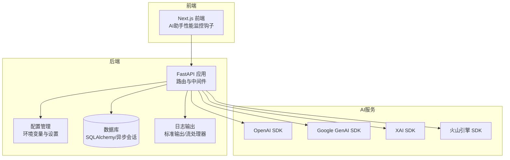
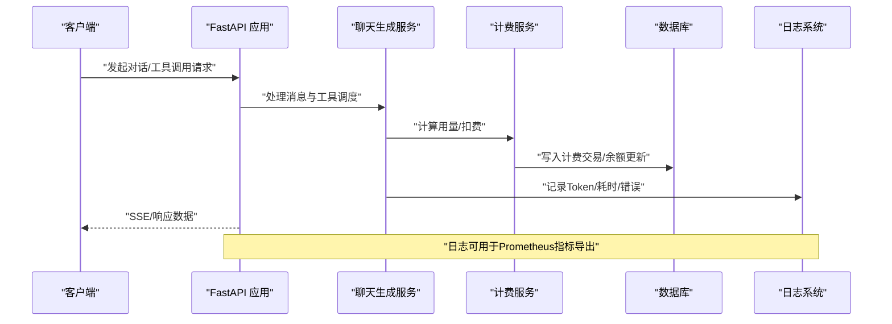
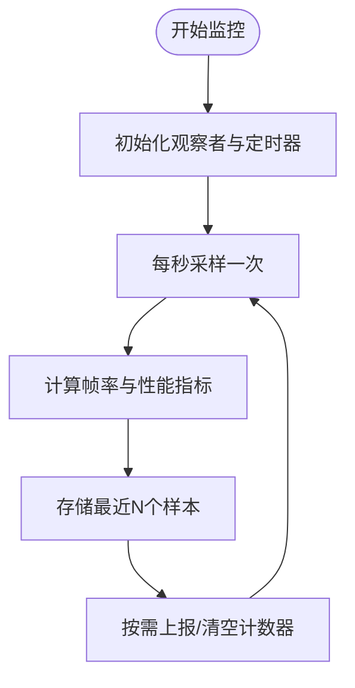
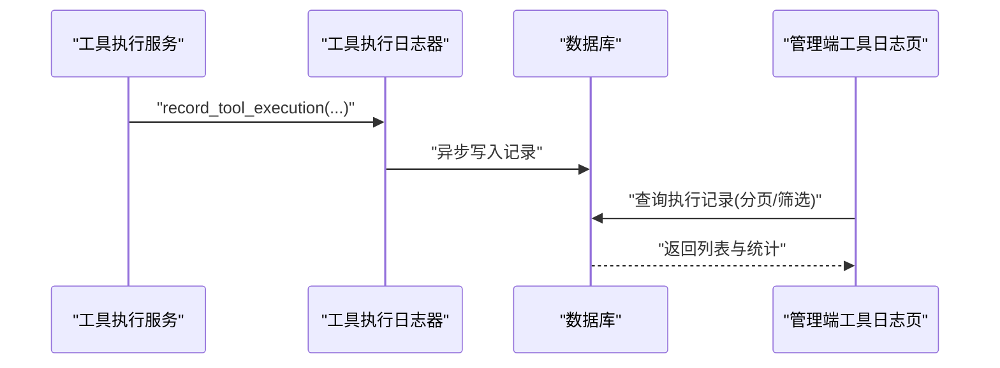
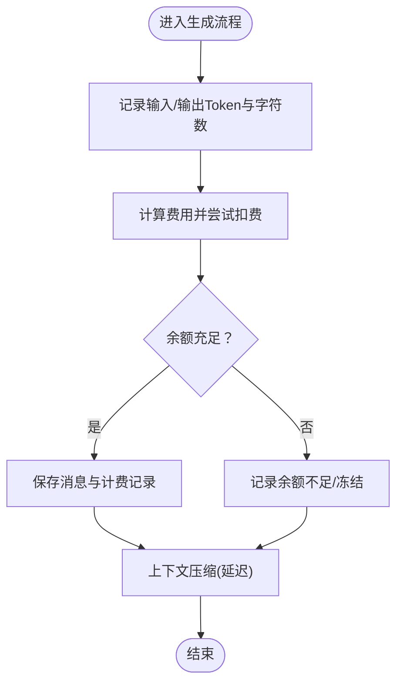
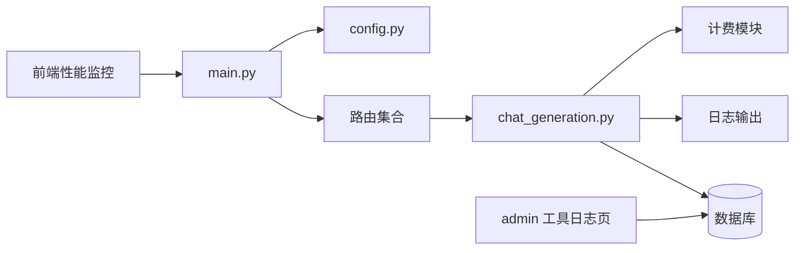

# 监控告警

<cite>
**本文引用的文件**
- [main.py](file://backend/main.py)
- [config.py](file://backend/config.py)
- [requirements.txt](file://backend/requirements.txt)
- [models.py](file://backend/models.py)
- [migrations/versions/c74e516c6d87_add_credit_billing_system.py](file://backend/migrations/versions/c74e516c6d87_add_credit_billing_system.py)
- [migrations/versions/p4q5r6s7t8u9_add_tool_executions_table.py](file://backend/migrations/versions/p4q5r6s7t8u9_add_tool_executions_table.py)
- [services/tool_execution_logger.py](file://backend/services/tool_execution_logger.py)
- [services/chat_generation.py](file://backend/services/chat_generation.py)
- [admin/src/app/admin/tools/logs/page.tsx](file://backend/admin/src/app/admin/tools/logs/page.tsx)
- [admin/src/hooks/useToolExecutions.ts](file://backend/admin/src/hooks/useToolExecutions.ts)
- [frontend/src/components/ai-assistant/hooks/usePerformanceMonitor.ts](file://frontend/src/components/ai-assistant/hooks/usePerformanceMonitor.ts)
</cite>

## 目录
1. [简介](#简介)
2. [项目结构](#项目结构)
3. [核心组件](#核心组件)
4. [架构总览](#架构总览)
5. [详细组件分析](#详细组件分析)
6. [依赖关系分析](#依赖关系分析)
7. [性能考量](#性能考量)
8. [故障排查指南](#故障排查指南)
9. [结论](#结论)
10. [附录](#附录)

## 简介
本文件面向Infinite Game项目的运维与开发团队，提供一套完整的监控告警方案，覆盖应用性能监控、AI服务调用监控、用户行为监控、日志聚合与分析、AI服务额度与费用监控、系统健康检查以及故障自动恢复与人工干预流程。文档同时给出Prometheus与Grafana的集成建议、自定义指标采集思路、仪表板与告警规则设计，并结合现有代码实现说明如何扩展监控能力。

## 项目结构
后端采用FastAPI + 异步数据库访问，前端基于Next.js，AI服务通过多种提供商SDK调用，计费与工具执行记录通过数据库迁移与模型持久化。监控侧可利用现有日志、数据库表与API端点进行指标采集与可视化。

图表来源
- [main.py:110-175](file://backend/main.py#L110-L175)
- [config.py:7-43](file://backend/config.py#L7-L43)
- [requirements.txt:1-29](file://backend/requirements.txt#L1-L29)

章节来源
- [main.py:110-175](file://backend/main.py#L110-L175)
- [config.py:7-43](file://backend/config.py#L7-L43)
- [requirements.txt:1-29](file://backend/requirements.txt#L1-L29)

## 核心组件
- 应用层：FastAPI应用、CORS中间件、调试认证中间件、路由注册、生命周期管理。
- 配置层：统一读取环境变量，支持数据库URL、Redis、AI密钥、JWT参数等。
- 数据层：SQLAlchemy异步会话、模型与迁移，包含计费系统与工具执行记录表。
- 日志层：基础日志配置、SQLAlchemy与Uvicorn访问日志抑制、业务日志输出。
- 监控与告警：现有日志与数据库记录为指标采集基础；前端性能监控钩子提供用户体验指标；可通过Prometheus/Grafana扩展自定义指标。

章节来源
- [main.py:15-30](file://backend/main.py#L15-L30)
- [main.py:110-175](file://backend/main.py#L110-L175)
- [config.py:7-43](file://backend/config.py#L7-L43)

## 架构总览
下图展示从用户交互到AI服务调用、计费与日志记录的关键路径，以及可扩展的监控与告警接入点。

图表来源
- [services/chat_generation.py:294-416](file://backend/services/chat_generation.py#L294-L416)
- [services/tool_execution_logger.py:44-88](file://backend/services/tool_execution_logger.py#L44-L88)
- [models.py](file://backend/models.py)

## 详细组件分析

### 应用性能监控（前端）
- 目标：捕获页面渲染、帧率、长任务、布局变化等前端性能指标，辅助定位UI卡顿与交互延迟。
- 实现要点：
  - 使用性能API与观察者接口周期性采样，维护滑动窗口内的帧率样本。
  - 提供度量上报与获取接口，便于在仪表板中展示趋势。
- 建议指标：
  - FPS（帧率）、LCP（最大内容绘制时间）、CLS（累积布局偏移）、FID（首交互延迟）。
  - 长任务占比与持续时间阈值告警。

图表来源
- [frontend/src/components/ai-assistant/hooks/usePerformanceMonitor.ts:170-215](file://frontend/src/components/ai-assistant/hooks/usePerformanceMonitor.ts#L170-L215)

章节来源
- [frontend/src/components/ai-assistant/hooks/usePerformanceMonitor.ts:170-215](file://frontend/src/components/ai-assistant/hooks/usePerformanceMonitor.ts#L170-L215)

### AI服务调用监控（后端）
- 目标：记录工具执行、错误率、平均耗时、提供方映射，支撑调用质量与成本分析。
- 实现要点：
  - 工具执行记录写入独立异步会话，非阻塞且失败静默。
  - 记录字段包含工具名、提供方、会话/用户/代理标识、状态、耗时、摘要与错误信息。
- 建议指标：
  - 总调用次数、错误次数、错误率、平均耗时、各提供方调用分布。
  - 通过后台列表页与筛选条件支持实时观测。

图表来源
- [services/tool_execution_logger.py:44-88](file://backend/services/tool_execution_logger.py#L44-L88)
- [admin/src/app/admin/tools/logs/page.tsx:1-184](file://backend/admin/src/app/admin/tools/logs/page.tsx#L1-L184)
- [admin/src/hooks/useToolExecutions.ts:1-42](file://backend/admin/src/hooks/useToolExecutions.ts#L1-L42)

章节来源
- [services/tool_execution_logger.py:44-88](file://backend/services/tool_execution_logger.py#L44-L88)
- [admin/src/app/admin/tools/logs/page.tsx:1-184](file://backend/admin/src/app/admin/tools/logs/page.tsx#L1-L184)
- [admin/src/hooks/useToolExecutions.ts:1-42](file://backend/admin/src/hooks/useToolExecutions.ts#L1-L42)

### 用户行为监控（后端）
- 目标：通过日志与数据库记录追踪用户会话、消息、工具调用与计费事件，形成行为画像与异常检测基础。
- 实现要点：
  - 聊天生成过程输出Token用量、输出字符数、上下文使用率等统计。
  - 计费模块在生成完成后根据输入/输出Token与图片生成数量进行扣费与余额更新。
  - 失败或空结果不扣费，避免误计。
- 建议指标：
  - 会话时长、消息条数、Token消耗、图片生成数量、平均响应时延。
  - 余额不足与账户冻结告警。

图表来源
- [services/chat_generation.py:294-416](file://backend/services/chat_generation.py#L294-L416)

章节来源
- [services/chat_generation.py:294-416](file://backend/services/chat_generation.py#L294-L416)

### 日志聚合与分析（现有能力）
- 当前日志：
  - 应用日志、SQLAlchemy引擎与池日志、Uvicorn访问日志已进行精细化控制与降噪。
  - 业务日志包含Token统计、错误信息、计费事件等。
- 建议：
  - 将标准输出日志接入集中式日志系统（如ELK），解析关键字段（如错误码、耗时、用户ID、工具名）。
  - 为Prometheus集成准备日志指标导出（例如通过日志行转指标）或引入OpenTelemetry。

章节来源
- [main.py:15-30](file://backend/main.py#L15-L30)
- [services/chat_generation.py:294-416](file://backend/services/chat_generation.py#L294-L416)

### AI服务调用额度与费用监控
- 数据基础：
  - 迁移脚本新增“credit billing system”与“tool executions”表，具备计费与工具执行记录的数据结构。
  - 工具执行日志器提供非阻塞持久化，确保主链路不受影响。
- 建议指标：
  - 每用户/每提供方的调用次数、错误率、平均耗时、总Token用量、图片生成数量。
  - 费用预算与阈值告警（如月度/单次额度预警）。
- 告警策略：
  - 余额不足/冻结告警（即时通知）。
  - 费用超阈值（如单次/日/周/月）触发预警。
  - 提供方可用性下降（错误率突增）告警。

章节来源
- [migrations/versions/c74e516c6d87_add_credit_billing_system.py:1-18](file://backend/migrations/versions/c74e516c6d87_add_credit_billing_system.py#L1-L18)
- [migrations/versions/p4q5r6s7t8u9_add_tool_executions_table.py:34-52](file://backend/migrations/versions/p4q5r6s7t8u9_add_tool_executions_table.py#L34-L52)
- [services/tool_execution_logger.py:44-88](file://backend/services/tool_execution_logger.py#L44-L88)

### 系统健康检查
- 数据库连接检查：应用启动时进行连接测试与迁移执行，失败自动重试并清理残留临时表后重试。
- Redis连接：通过配置项指定，可在启动阶段进行连通性探测。
- 文件系统空间：建议在操作系统层面配置磁盘空间阈值告警（如inode与容量）。
- 内存使用：结合进程级指标（RSS/虚拟内存）与GC统计，设置阈值告警。

章节来源
- [main.py:49-108](file://backend/main.py#L49-L108)
- [config.py:18-19](file://backend/config.py#L18-L19)

### 故障自动恢复与人工干预
- 自动恢复：
  - 启动阶段数据库连接重试与迁移清理。
  - 工具执行记录写入失败静默，避免阻塞主流程。
- 人工干预：
  - 管理端工具日志页支持分页与筛选，便于快速定位问题。
  - 建议在Prometheus告警中接入通知渠道（邮件/IM），并提供一键恢复入口（如重启服务、切换提供方）。

章节来源
- [main.py:49-108](file://backend/main.py#L49-L108)
- [services/tool_execution_logger.py:74-88](file://backend/services/tool_execution_logger.py#L74-L88)
- [admin/src/app/admin/tools/logs/page.tsx:1-184](file://backend/admin/src/app/admin/tools/logs/page.tsx#L1-L184)

## 依赖关系分析
- 组件耦合：
  - 应用层依赖配置层与数据库层；服务层依赖工具执行日志器与计费模块；前端依赖性能监控钩子。
- 外部依赖：
  - OpenAI、Google GenAI、XAI、火山引擎等AI服务SDK。
- 潜在风险：
  - 工具执行记录写入失败静默可能掩盖异常，建议增加失败计数与告警。
  - 日志降噪后需确保关键事件仍可被检索与分析。

图表来源
- [main.py:110-175](file://backend/main.py#L110-L175)
- [services/chat_generation.py:294-416](file://backend/services/chat_generation.py#L294-L416)
- [admin/src/app/admin/tools/logs/page.tsx:1-184](file://backend/admin/src/app/admin/tools/logs/page.tsx#L1-L184)
- [frontend/src/components/ai-assistant/hooks/usePerformanceMonitor.ts:170-215](file://frontend/src/components/ai-assistant/hooks/usePerformanceMonitor.ts#L170-L215)

章节来源
- [main.py:110-175](file://backend/main.py#L110-L175)
- [requirements.txt:1-29](file://backend/requirements.txt#L1-29)

## 性能考量
- 日志开销：当前已对SQLAlchemy与Uvicorn访问日志进行降噪，建议在生产环境限制日志级别并启用异步写入。
- 数据库写入：工具执行记录采用异步会话与非阻塞写入，建议为高并发场景增加批量写入或队列缓冲。
- 前端性能：使用滑动窗口与节流采样，避免高频采样造成额外开销。

## 故障排查指南
- 启动失败与迁移异常：
  - 观察启动日志中的数据库连接与迁移步骤，确认重试与清理流程是否生效。
- 工具执行记录缺失：
  - 检查异步写入任务是否抛出异常；关注失败静默日志。
- 计费异常：
  - 对照聊天生成日志中的Token统计与计费事件，核对余额与冻结状态。
- 前端性能异常：
  - 查看FPS与长任务指标，结合页面交互行为定位瓶颈。

章节来源
- [main.py:49-108](file://backend/main.py#L49-L108)
- [services/tool_execution_logger.py:74-88](file://backend/services/tool_execution_logger.py#L74-L88)
- [services/chat_generation.py:294-416](file://backend/services/chat_generation.py#L294-L416)
- [frontend/src/components/ai-assistant/hooks/usePerformanceMonitor.ts:170-215](file://frontend/src/components/ai-assistant/hooks/usePerformanceMonitor.ts#L170-L215)

## 结论
Infinite Game项目已具备完善的日志与数据库记录基础，可作为监控告警体系的核心数据源。通过在现有基础上接入Prometheus/Grafana与ELK Stack，结合前端性能监控与AI服务调用统计，能够构建覆盖应用性能、AI服务调用、用户行为、计费与系统健康的状态可观测性平台。建议优先落地关键事件追踪与费用预警，再逐步完善全栈指标与自动化恢复流程。

## 附录

### Prometheus与Grafana集成建议
- 指标采集：
  - 将标准输出日志通过日志采集器导入Prometheus（如使用日志转指标或OpenTelemetry Exporter）。
  - 在应用中暴露轻量HTTP端点导出关键指标（如调用次数、错误率、平均耗时、余额阈值）。
- 仪表板：
  - 前端性能：FPS、LCP、CLS、FID趋势。
  - AI调用：总调用、错误率、平均耗时、提供方分布。
  - 计费：用户/提供方费用、余额、冻结/不足告警。
- 告警规则：
  - 错误率超过阈值、平均耗时增长、余额低于阈值、提供方可用性下降。

### ELK Stack集成建议
- 收集：将后端日志输出至集中式日志系统，解析JSON字段（如level、user_id、tool_name、duration_ms、error_message）。
- 分析：建立关键事件索引（如余额不足、计费失败、工具错误），支持按时间与用户维度检索。
- 可视化：结合Grafana创建日志驱动的仪表板与告警。

### 系统健康检查清单
- 数据库：连接可用性、迁移状态、慢查询。
- Redis：连接可用性、键空间大小、命令延迟。
- 文件系统：磁盘空间、inode使用率。
- 内存：RSS、GC频率与暂停时间。
- 网络：AI服务SDK超时与重试策略。