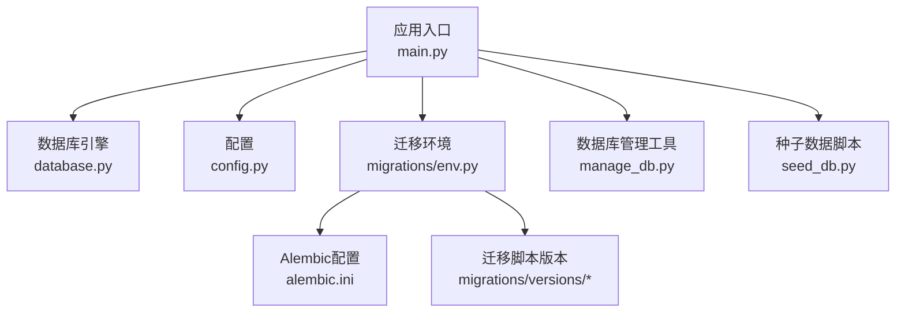
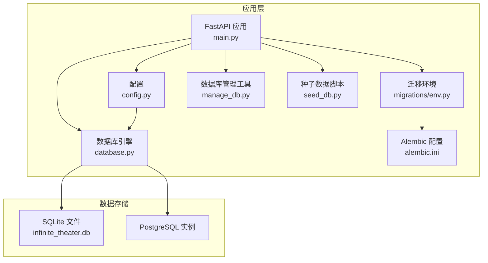
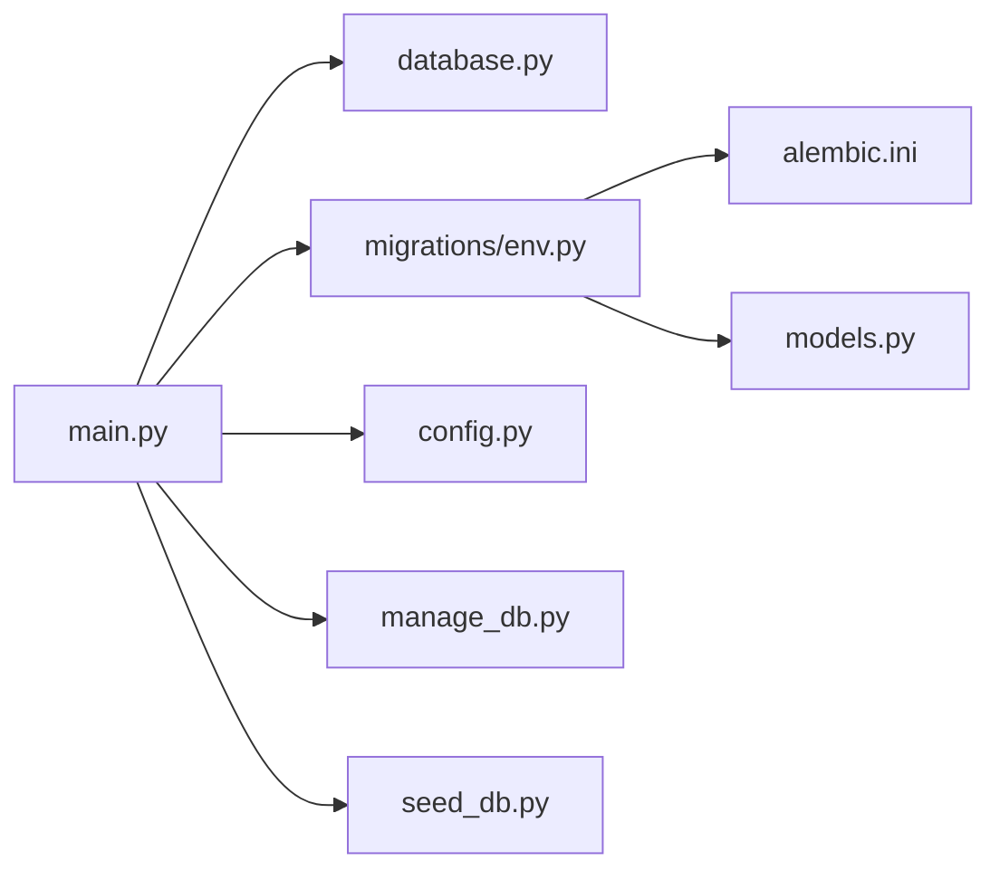
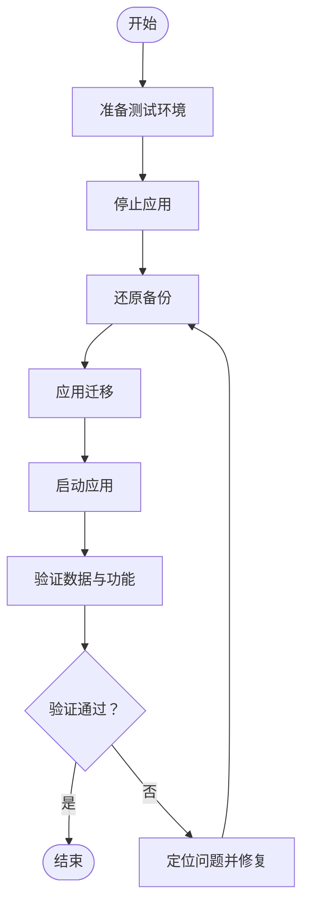

# 数据库备份策略

<cite>
**本文引用的文件**
- [backend/config.py](file://backend/config.py)
- [backend/database.py](file://backend/database.py)
- [backend/main.py](file://backend/main.py)
- [backend/manage_db.py](file://backend/manage_db.py)
- [backend/migrations/env.py](file://backend/migrations/env.py)
- [backend/alembic.ini](file://backend/alembic.ini)
- [backend/migrations/versions/14746eaf1c81_initial.py](file://backend/migrations/versions/14746eaf1c81_initial.py)
- [backend/seed_db.py](file://backend/seed_db.py)
</cite>

## 目录
1. [引言](#引言)
2. [项目结构](#项目结构)
3. [核心组件](#核心组件)
4. [架构总览](#架构总览)
5. [详细组件分析](#详细组件分析)
6. [依赖分析](#依赖分析)
7. [性能考虑](#性能考虑)
8. [故障排查指南](#故障排查指南)
9. [结论](#结论)
10. [附录](#附录)

## 引言
本文件面向Infinite Game项目的数据库备份与恢复需求，基于现有代码库中的数据库配置、迁移机制与启动流程，制定一套可落地的备份策略。重点涵盖：
- 备份类型与频率：全量备份、增量/差异备份的可行性与建议
- 备份脚本与自动化：命令行工具、定时任务与命名规范
- 备份验证：完整性与可恢复性校验
- 安全：传输与存储加密建议
- 监控与告警：结合现有日志与错误处理
- 应急流程：失败后的处置步骤
- 恢复测试：验证步骤与回归检查

## 项目结构
Infinite Game后端采用异步SQLAlchemy引擎与Alembic迁移框架，数据库默认使用SQLite（本地开发友好），生产环境可通过配置切换至PostgreSQL。迁移脚本位于migrations目录，启动时可按需执行迁移。

图表来源
- [backend/main.py:50-108](file://backend/main.py#L50-L108)
- [backend/database.py:1-45](file://backend/database.py#L1-L45)
- [backend/config.py:1-43](file://backend/config.py#L1-L43)
- [backend/migrations/env.py:1-120](file://backend/migrations/env.py#L1-L120)
- [backend/alembic.ini:1-115](file://backend/alembic.ini#L1-L115)
- [backend/migrations/versions/14746eaf1c81_initial.py:1-56](file://backend/migrations/versions/14746eaf1c81_initial.py#L1-L56)
- [backend/manage_db.py:1-80](file://backend/manage_db.py#L1-L80)
- [backend/seed_db.py:1-64](file://backend/seed_db.py#L1-L64)

章节来源
- [backend/config.py:1-43](file://backend/config.py#L1-L43)
- [backend/database.py:1-45](file://backend/database.py#L1-L45)
- [backend/main.py:50-108](file://backend/main.py#L50-L108)
- [backend/migrations/env.py:1-120](file://backend/migrations/env.py#L1-L120)
- [backend/alembic.ini:1-115](file://backend/alembic.ini#L1-L115)
- [backend/migrations/versions/14746eaf1c81_initial.py:1-56](file://backend/migrations/versions/14746eaf1c81_initial.py#L1-L56)
- [backend/manage_db.py:1-80](file://backend/manage_db.py#L1-L80)
- [backend/seed_db.py:1-64](file://backend/seed_db.py#L1-L64)

## 核心组件
- 数据库引擎与连接池：异步SQLAlchemy引擎，SQLite/WAL优化，连接池参数与超时控制。
- 配置中心：DATABASE_URL决定数据库类型与路径；支持从.env加载。
- 迁移与版本：Alembic环境与配置，版本化迁移脚本。
- 启动与迁移：应用生命周期中自动尝试迁移，失败时清理残留临时表并重试。
- 管理工具：命令行封装迁移、降级、种子数据等操作。
- 种子数据：初始化默认提供商与管理员账户。

章节来源
- [backend/database.py:1-45](file://backend/database.py#L1-L45)
- [backend/config.py:1-43](file://backend/config.py#L1-L43)
- [backend/migrations/env.py:1-120](file://backend/migrations/env.py#L1-L120)
- [backend/alembic.ini:1-115](file://backend/alembic.ini#L1-L115)
- [backend/main.py:50-108](file://backend/main.py#L50-L108)
- [backend/manage_db.py:1-80](file://backend/manage_db.py#L1-L80)
- [backend/seed_db.py:1-64](file://backend/seed_db.py#L1-L64)

## 架构总览
下图展示数据库层在系统中的位置与交互，以及备份策略的落点。

图表来源
- [backend/main.py:50-108](file://backend/main.py#L50-L108)
- [backend/config.py:1-43](file://backend/config.py#L1-L43)
- [backend/database.py:1-45](file://backend/database.py#L1-L45)
- [backend/migrations/env.py:1-120](file://backend/migrations/env.py#L1-L120)
- [backend/alembic.ini:1-115](file://backend/alembic.ini#L1-L115)
- [backend/manage_db.py:1-80](file://backend/manage_db.py#L1-L80)
- [backend/seed_db.py:1-64](file://backend/seed_db.py#L1-L64)

## 详细组件分析

### 数据库引擎与SQLite优化
- 异步引擎与连接池：提升并发与稳定性。
- SQLite优化：WAL模式、busy_timeout、synchronous参数，降低“database is locked”风险。
- 连接超时与线程安全：针对SQLite的连接参数优化。

章节来源
- [backend/database.py:1-45](file://backend/database.py#L1-L45)

### 配置与数据库URL
- 默认使用SQLite（绝对路径），便于本地开发一致性。
- 支持切换到PostgreSQL，通过DATABASE_URL实现。
- RUN_MIGRATIONS控制启动时是否执行迁移。

章节来源
- [backend/config.py:1-43](file://backend/config.py#L1-L43)

### 迁移与版本控制
- Alembic环境：注册模型元数据、离线/在线迁移、批量渲染。
- 版本脚本：按版本号顺序管理结构变更。
- 启动清理：检测并删除残留临时表，保证迁移稳定性。

章节来源
- [backend/migrations/env.py:1-120](file://backend/migrations/env.py#L1-L120)
- [backend/alembic.ini:1-115](file://backend/alembic.ini#L1-L115)
- [backend/migrations/versions/14746eaf1c81_initial.py:1-56](file://backend/migrations/versions/14746eaf1c81_initial.py#L1-L56)
- [backend/main.py:50-108](file://backend/main.py#L50-L108)

### 启动与迁移流程
- 生命周期内重试连接与迁移，失败时清理临时表并重试。
- 通过子进程调用Alembic，确保环境隔离。

章节来源
- [backend/main.py:50-108](file://backend/main.py#L50-L108)

### 数据库管理工具
- 提供migrate/upgrade/downgrade/seed命令，便于CI/CD与运维。
- migrate使用Alembic自动生成迁移脚本。

章节来源
- [backend/manage_db.py:1-80](file://backend/manage_db.py#L1-L80)

### 种子数据
- 初始化默认LLM提供商与管理员账户，便于快速部署与测试。

章节来源
- [backend/seed_db.py:1-64](file://backend/seed_db.py#L1-L64)

## 依赖分析
- 应用对数据库引擎的依赖：通过依赖注入提供会话。
- 迁移对配置与模型的依赖：env.py导入settings与models。
- 管理工具对Alembic与种子脚本的依赖。

图表来源
- [backend/main.py:50-108](file://backend/main.py#L50-L108)
- [backend/database.py:1-45](file://backend/database.py#L1-L45)
- [backend/migrations/env.py:1-120](file://backend/migrations/env.py#L1-L120)
- [backend/alembic.ini:1-115](file://backend/alembic.ini#L1-L115)
- [backend/config.py:1-43](file://backend/config.py#L1-L43)
- [backend/manage_db.py:1-80](file://backend/manage_db.py#L1-L80)
- [backend/seed_db.py:1-64](file://backend/seed_db.py#L1-L64)

章节来源
- [backend/main.py:50-108](file://backend/main.py#L50-L108)
- [backend/migrations/env.py:1-120](file://backend/migrations/env.py#L1-L120)
- [backend/alembic.ini:1-115](file://backend/alembic.ini#L1-L115)
- [backend/config.py:1-43](file://backend/config.py#L1-L43)
- [backend/manage_db.py:1-80](file://backend/manage_db.py#L1-L80)
- [backend/seed_db.py:1-64](file://backend/seed_db.py#L1-L64)

## 性能考虑
- SQLite WAL模式提升并发读写能力，降低锁冲突。
- 连接池参数与超时设置有助于稳定高并发场景。
- 迁移批处理渲染减少DDL开销。

章节来源
- [backend/database.py:1-45](file://backend/database.py#L1-L45)
- [backend/migrations/env.py:1-120](file://backend/migrations/env.py#L1-L120)

## 故障排查指南
- 迁移失败与残留临时表：启动时自动检测并清理，随后重试迁移。
- 数据库连接失败：多轮重试与错误日志记录，便于定位问题。
- 迁移命令行：使用manage_db.py进行迁移、降级与种子数据初始化。

章节来源
- [backend/main.py:50-108](file://backend/main.py#L50-L108)
- [backend/manage_db.py:1-80](file://backend/manage_db.py#L1-L80)

## 结论
本策略以现有代码库为基础，结合SQLite/WAL优化与Alembic迁移体系，提出可操作的备份与恢复方案。对于SQLite场景，优先采用全量备份与WAL日志保护；对于PostgreSQL场景，可结合数据库自带物理/逻辑备份工具。所有备份应纳入自动化流程，并配套验证与告警机制，确保可恢复性与安全性。

## 附录

### 备份类型与频率
- 全量备份
  - 推荐频率：每日一次（夜间低峰时段）
  - 适用场景：SQLite文件级复制；PostgreSQL逻辑备份（如pg_dump）
- 增量/差异备份
  - SQLite：WAL日志可视为轻量增量；建议配合全量定期打包归档
  - PostgreSQL：使用物理备份（如pg_basebackup）+ 归档日志（WAL）实现增量
- 备份窗口
  - 选择业务低峰期，避免影响在线服务

### 备份脚本与自动化
- 命令行工具
  - 使用manage_db.py进行迁移与种子数据初始化，作为备份前置条件
  - 示例命令（路径参考）：[backend/manage_db.py:1-80](file://backend/manage_db.py#L1-L80)
- 定时任务
  - Linux：crontab
  - Windows：任务计划程序
  - 建议：每日固定时间执行全量备份，WAL日志滚动归档
- 备份文件命名规范
  - SQLite：infinite_theater_db_YYYYMMDD_HHMMSS.bak
  - PostgreSQL：db_backup_YYYYMMDD_HHMMSS.dump 或 .tar
- 存储位置管理
  - 本地与远端双副本：本地热备，远端冷备
  - 分层存储：近期热数据、历史冷数据分别存放

### 备份验证机制
- 完整性校验
  - 校验备份文件大小与哈希值
  - 对比源库与目标库关键表记录数
- 可恢复性测试
  - 在隔离环境中还原备份，验证应用启动与迁移
  - 执行关键查询与功能回归测试
- 回滚演练
  - 定期演练回滚到最近N个备份点，评估RPO/RTO

### 加密与安全
- 传输加密
  - 使用TLS/HTTPS传输备份文件
  - 远程存储采用加密通道（如SFTP/S3 HTTPS）
- 存储加密
  - 对备份文件进行加密（如AES-256）
  - 密钥管理：硬件安全模块（HSM）或密钥管理服务（KMS）
- 访问控制
  - 最小权限原则；仅授权人员访问备份与密钥
  - 审计日志：记录备份与恢复操作

### 监控与告警
- 监控指标
  - 备份成功率、耗时、文件大小
  - 还原测试通过率、可用性
- 告警阈值
  - 连续失败次数、延迟超过阈值、哈希不一致
- 告警渠道
  - 邮件、IM、电话通知

### 应急处理流程
- 失败检测
  - 自动化脚本检测失败并触发告警
- 快速响应
  - 检查磁盘空间、网络连通性、数据库状态
  - 切换到上一个成功备份
- 恢复执行
  - 在隔离环境验证后，执行生产恢复
- 事后复盘
  - 分析失败原因，更新策略与流程

### 恢复测试程序与验证步骤
- 测试环境准备
  - 准备与生产环境一致的数据库实例
- 还原步骤
  - 停止应用
  - 还原备份
  - 应用迁移（如需要）
  - 启动应用
- 验证清单
  - 数据库连通性
  - 关键表数据完整性
  - 核心接口功能测试
  - 日志无异常

