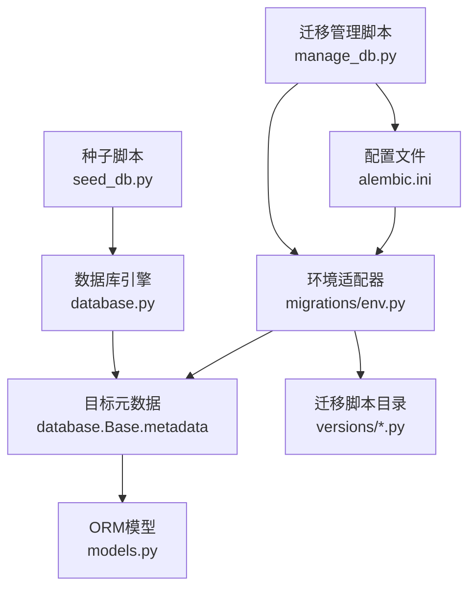
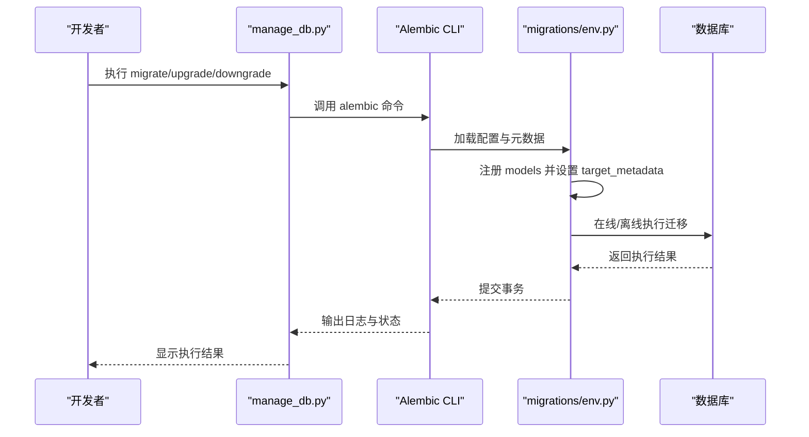
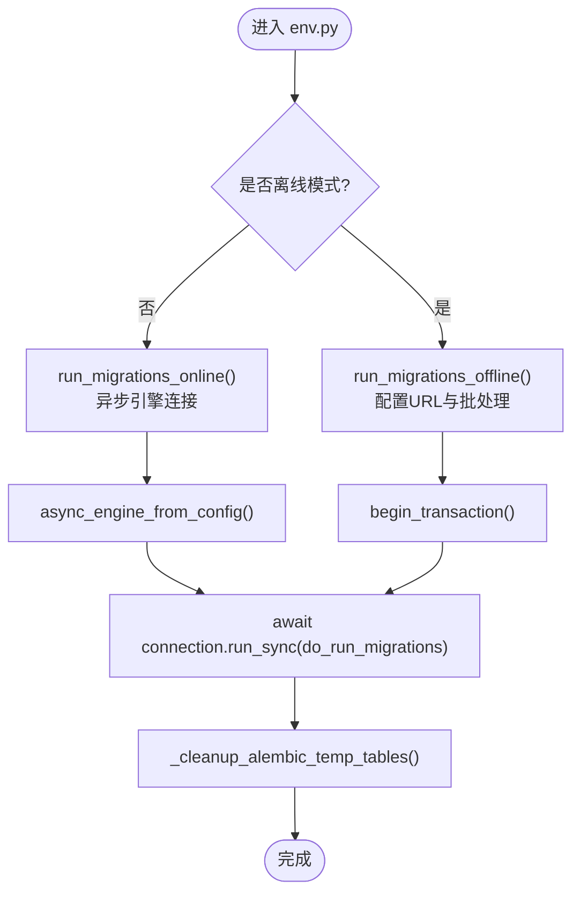
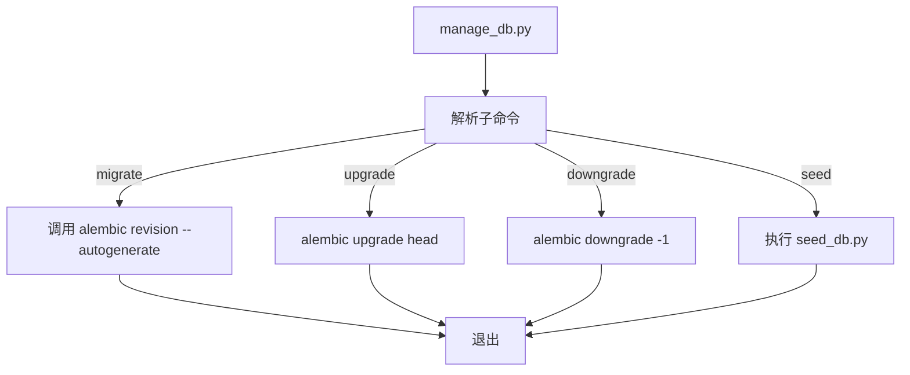
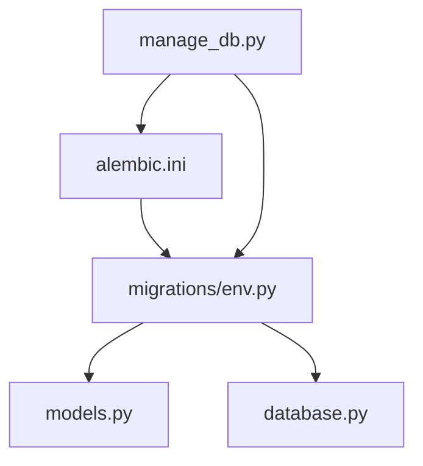

# 数据库迁移管理

<cite>
**本文档引用的文件**
- [backend/migrations/env.py](file://backend/migrations/env.py)
- [backend/alembic.ini](file://backend/alembic.ini)
- [backend/manage_db.py](file://backend/manage_db.py)
- [backend/database.py](file://backend/database.py)
- [backend/models.py](file://backend/models.py)
- [backend/config.py](file://backend/config.py)
- [backend/seed_db.py](file://backend/seed_db.py)
- [backend/migrations/README](file://backend/migrations/README)
- [backend/migrations/versions/14746eaf1c81_initial.py](file://backend/migrations/versions/14746eaf1c81_initial.py)
- [backend/migrations/versions/a3b8c9d0e1f2_convert_ids_to_uuid.py](file://backend/migrations/versions/a3b8c9d0e1f2_convert_ids_to_uuid.py)
- [backend/migrations/versions/c74e516c6d87_add_credit_billing_system.py](file://backend/migrations/versions/c74e516c6d87_add_credit_billing_system.py)
- [backend/migrations/versions/f2a3b4c5d6e7_add_image_search_billing.py](file://backend/migrations/versions/f2a3b4c5d6e7_add_image_search_billing.py)
- [backend/migrations/versions/i5j6k7l8m9n0_split_user_admin_tables.py](file://backend/migrations/versions/i5j6k7l8m9n0_split_user_admin_tables.py)
- [backend/migrations/versions/cc40fa02de06_migrate_credits_to_decimal_and_atomic_.py](file://backend/migrations/versions/cc40fa02de06_migrate_credits_to_decimal_and_atomic_.py)
- [backend/migrations/versions/d221879c21d9_add_agent_type_and_prompt_templates.py](file://backend/migrations/versions/d221879c21d9_add_agent_type_and_prompt_templates.py)
</cite>

## 目录
1. [简介](#简介)
2. [项目结构](#项目结构)
3. [核心组件](#核心组件)
4. [架构总览](#架构总览)
5. [详细组件分析](#详细组件分析)
6. [依赖分析](#依赖分析)
7. [性能考虑](#性能考虑)
8. [故障排查指南](#故障排查指南)
9. [结论](#结论)
10. [附录](#附录)

## 简介
本文件面向Infinite Game项目的数据库迁移管理，基于Alembic框架实现。内容涵盖迁移文件的创建、应用与回滚流程；迁移脚本编写规范（模型变更检测、依赖关系管理、版本控制策略）；生产环境迁移的安全实践（备份前置检查、事务处理、回滚预案）；迁移过程中的数据一致性保证与并发控制策略；以及迁移故障诊断与常见问题解决方案。文档同时提供架构图、序列图与流程图，帮助不同技术背景的读者理解与实施。

## 项目结构
Infinite Game后端采用异步SQLAlchemy与Alembic进行数据库建模与迁移管理。迁移相关的核心位置如下：
- Alembic配置与入口：backend/alembic.ini、backend/migrations/env.py
- 迁移脚本目录：backend/migrations/versions/*.py
- ORM模型定义：backend/models.py
- 数据库引擎与Base元数据：backend/database.py
- 迁移命令封装：backend/manage_db.py
- 配置与种子：backend/config.py、backend/seed_db.py

图表来源
- [backend/alembic.ini:1-115](file://backend/alembic.ini#L1-L115)
- [backend/migrations/env.py:1-120](file://backend/migrations/env.py#L1-L120)
- [backend/database.py:1-45](file://backend/database.py#L1-L45)
- [backend/models.py:1-503](file://backend/models.py#L1-L503)
- [backend/manage_db.py:1-80](file://backend/manage_db.py#L1-L80)
- [backend/seed_db.py:1-64](file://backend/seed_db.py#L1-L64)

章节来源
- [backend/alembic.ini:1-115](file://backend/alembic.ini#L1-L115)
- [backend/migrations/env.py:1-120](file://backend/migrations/env.py#L1-L120)
- [backend/database.py:1-45](file://backend/database.py#L1-L45)
- [backend/models.py:1-503](file://backend/models.py#L1-L503)
- [backend/manage_db.py:1-80](file://backend/manage_db.py#L1-L80)
- [backend/seed_db.py:1-64](file://backend/seed_db.py#L1-L64)

## 核心组件
- Alembic配置与环境适配
  - alembic.ini：定义脚本位置、版本目录、日志级别、后置钩子等。
  - migrations/env.py：注册目标元数据、加载模型、在线/离线迁移、清理残留临时表。
- ORM与数据库引擎
  - database.py：异步引擎、SQLite优化参数、Base元数据。
  - models.py：所有数据模型定义，作为Alembic自动检测的目标。
- 迁移管理工具
  - manage_db.py：封装alembic命令，提供migrate、upgrade、downgrade、seed子命令。
- 配置与种子
  - config.py：数据库URL、运行迁移开关等。
  - seed_db.py：初始化默认提供商、管理员等种子数据。

章节来源
- [backend/alembic.ini:1-115](file://backend/alembic.ini#L1-L115)
- [backend/migrations/env.py:1-120](file://backend/migrations/env.py#L1-L120)
- [backend/database.py:1-45](file://backend/database.py#L1-L45)
- [backend/models.py:1-503](file://backend/models.py#L1-L503)
- [backend/manage_db.py:1-80](file://backend/manage_db.py#L1-L80)
- [backend/config.py:1-43](file://backend/config.py#L1-L43)
- [backend/seed_db.py:1-64](file://backend/seed_db.py#L1-L64)

## 架构总览
下图展示了迁移生命周期的关键交互：开发者通过manage_db.py触发迁移命令，Alembic读取env.py与alembic.ini，结合models.py中的模型元数据生成SQL变更，并在数据库上执行。

图表来源
- [backend/manage_db.py:20-77](file://backend/manage_db.py#L20-L77)
- [backend/migrations/env.py:39-119](file://backend/migrations/env.py#L39-L119)
- [backend/alembic.ini:1-115](file://backend/alembic.ini#L1-L115)

## 详细组件分析

### Alembic环境适配器（env.py）
- 功能要点
  - 动态导入配置与模型，注册Base.metadata为目标元数据。
  - 支持离线与在线两种迁移模式，统一通过render_as_batch=True进行批处理。
  - 在线迁移使用异步引擎，避免阻塞。
  - 迁移前清理残留的Alembic临时表，降低冲突风险。
- 关键行为
  - get_url()从配置读取DATABASE_URL。
  - run_migrations_offline()/run_migrations_online()分别处理离线/在线迁移。
  - do_run_migrations()在连接上开启事务并执行迁移。
  - _cleanup_alembic_temp_tables()扫描并删除以“_alembic_tmp_”开头的表。

图表来源
- [backend/migrations/env.py:39-119](file://backend/migrations/env.py#L39-L119)

章节来源
- [backend/migrations/env.py:1-120](file://backend/migrations/env.py#L1-L120)

### 迁移管理脚本（manage_db.py）
- 功能要点
  - 封装migrate（autogenerate）、upgrade、downgrade、seed四个常用命令。
  - 通过子命令解析器提供清晰的CLI接口。
  - 所有命令均在backend目录内执行，确保相对路径正确。
- 使用建议
  - 开发阶段使用migrate生成骨架，再手工完善细节。
  - 生产升级使用upgrade，回滚使用downgrade。
  - 初始化或重置环境使用seed。

图表来源
- [backend/manage_db.py:20-77](file://backend/manage_db.py#L20-L77)

章节来源
- [backend/manage_db.py:1-80](file://backend/manage_db.py#L1-L80)

### 数据库引擎与模型（database.py、models.py）
- 异步引擎与SQLite优化
  - 异步SQLAlchemy引擎，启用pool_pre_ping与SQLite PRAGMA优化（WAL、busy_timeout、synchronous）。
  - SQLite连接超时与线程安全参数，降低“database is locked”错误。
- 模型元数据
  - models.py定义了完整的业务模型集合，作为Alembic自动检测的目标。
  - Base类由database.py导出，env.py通过import models注册模型。

```mermaid
classDiagram
class Base {
<<DeclarativeBase>>
}
class Admin
class User
class Theater
class TheaterNode
class TheaterEdge
class Asset
class LLMProvider
class ChatSession
class ChatMessage
class Agent
class CreditTransaction
class TaskExecution
class SubTask
class PromptTemplate
class SubscriptionPlan
class VideoTask
class AdminDebugSession
class AdminDebugMessage
class ToolConfig
class ToolExecution
Base <|-- Admin
Base <|-- User
Base <|-- Theater
Base <|-- TheaterNode
Base <|-- TheaterEdge
Base <|-- Asset
Base <|-- LLMProvider
Base <|-- ChatSession
Base <|-- ChatMessage
Base <|-- Agent
Base <|-- CreditTransaction
Base <|-- TaskExecution
Base <|-- SubTask
Base <|-- PromptTemplate
Base <|-- SubscriptionPlan
Base <|-- VideoTask
Base <|-- AdminDebugSession
Base <|-- AdminDebugMessage
Base <|-- ToolConfig
Base <|-- ToolExecution
```

图表来源
- [backend/database.py:39-40](file://backend/database.py#L39-L40)
- [backend/models.py:10-503](file://backend/models.py#L10-L503)

章节来源
- [backend/database.py:1-45](file://backend/database.py#L1-L45)
- [backend/models.py:1-503](file://backend/models.py#L1-L503)

### 迁移脚本示例与最佳实践

#### 初始迁移（14746eaf1c81_initial.py）
- 特点
  - 条件化创建表，若表已存在则仅做列类型调整。
  - 使用批处理模式，兼容不同数据库方言。
- 建议
  - 对于首次部署，优先使用此模式避免重复创建。
  - 对于后续变更，尽量使用批量DDL以提升兼容性。

章节来源
- [backend/migrations/versions/14746eaf1c81_initial.py:1-56](file://backend/migrations/versions/14746eaf1c81_initial.py#L1-L56)

#### 主键ID统一为UUID（a3b8c9d0e1f2_convert_ids_to_uuid.py）
- 特点
  - 全量读取旧表数据，生成UUID映射，重建所有受影响表。
  - 严格按叶子表到根表顺序删除，再按相同顺序重建。
  - 通过原生SQL插入恢复数据，确保外键关系正确。
- 建议
  - 大表迁移需评估停机窗口与数据量。
  - 建议在维护窗口执行，提前备份并验证数据完整性。

章节来源
- [backend/migrations/versions/a3b8c9d0e1f2_convert_ids_to_uuid.py:1-335](file://backend/migrations/versions/a3b8c9d0e1f2_convert_ids_to_uuid.py#L1-L335)

#### 积分计费系统（c74e516c6d87_add_credit_billing_system.py）
- 特点
  - 新增credit_transactions表并建立多对多关联。
  - 为agents与users新增计费相关字段。
- 建议
  - 升级前确保现有余额与计费规则一致。
  - 降级时注意删除索引与外键，避免遗留约束。

章节来源
- [backend/migrations/versions/c74e516c6d87_add_credit_billing_system.py:1-67](file://backend/migrations/versions/c74e516c6d87_add_credit_billing_system.py#L1-L67)

#### 图像搜索计费（f2a3b4c5d6e7_add_image_search_billing.py）
- 特点
  - 为agents新增图像输出与搜索计费字段。
- 建议
  - 与上游计费系统保持一致的单位与精度。

章节来源
- [backend/migrations/versions/f2a3b4c5d6e7_add_image_search_billing.py:1-35](file://backend/migrations/versions/f2a3b4c5d6e7_add_image_search_billing.py#L1-L35)

#### 用户/管理员拆分（i5j6k7l8m9n0_split_user_admin_tables.py）
- 特点
  - 从users迁移管理员到admins表，为users增加订阅相关字段。
  - 保留role字段以保持向后兼容。
- 建议
  - 迁移后清理历史角色字段需在后续版本中完成。

章节来源
- [backend/migrations/versions/i5j6k7l8m9n0_split_user_admin_tables.py:1-97](file://backend/migrations/versions/i5j6k7l8m9n0_split_user_admin_tables.py#L1-L97)

#### 金额精度与原子扣费（cc40fa02de06_migrate_credits_to_decimal_and_atomic_.py）
- 特点
  - 将credits与交易金额字段从Float迁移到DECIMAL(18,4)。
  - 修复story_chapters外键从players到users。
  - 清理残留临时表，增强健壮性。
- 建议
  - SQLite不支持直接ALTER COLUMN修改类型，采用重建表策略。
  - 降级时需谨慎处理外键与索引。

章节来源
- [backend/migrations/versions/cc40fa02de06_migrate_credits_to_decimal_and_atomic_.py:1-289](file://backend/migrations/versions/cc40fa02de06_migrate_credits_to_decimal_and_atomic_.py#L1-L289)

#### 智能体类型与提示模板（d221879c21d9_add_agent_type_and_prompt_templates.py）
- 特点
  - 新增prompt_templates表与agents.agent_type字段。
  - 为兼容性考虑，对部分字段进行类型回退。
- 建议
  - 新增表时使用try/except跳过已存在表，提升幂等性。

章节来源
- [backend/migrations/versions/d221879c21d9_add_agent_type_and_prompt_templates.py:1-149](file://backend/migrations/versions/d221879c21d9_add_agent_type_and_prompt_templates.py#L1-L149)

## 依赖分析
- 配置与环境
  - alembic.ini定义脚本位置与日志级别，env.py读取配置并注册模型元数据。
- 运行时依赖
  - manage_db.py依赖Alembic CLI与Python环境。
  - env.py依赖models.py中的模型定义。
- 数据库依赖
  - database.py提供异步引擎与Base元数据，影响迁移执行方式（批处理、事务）。

图表来源
- [backend/alembic.ini:1-115](file://backend/alembic.ini#L1-L115)
- [backend/migrations/env.py:15-32](file://backend/migrations/env.py#L15-L32)
- [backend/models.py:1-503](file://backend/models.py#L1-L503)
- [backend/database.py:1-45](file://backend/database.py#L1-L45)
- [backend/manage_db.py:26-38](file://backend/manage_db.py#L26-L38)

章节来源
- [backend/alembic.ini:1-115](file://backend/alembic.ini#L1-L115)
- [backend/migrations/env.py:15-32](file://backend/migrations/env.py#L15-L32)
- [backend/models.py:1-503](file://backend/models.py#L1-L503)
- [backend/database.py:1-45](file://backend/database.py#L1-L45)
- [backend/manage_db.py:26-38](file://backend/manage_db.py#L26-L38)

## 性能考虑
- 连接与并发
  - 异步引擎与连接池参数（pool_pre_ping、pool_size、max_overflow）提升稳定性。
  - SQLite启用WAL模式与合理的busy_timeout，减少锁竞争。
- 迁移性能
  - 使用批处理（render_as_batch=True）提升跨数据库兼容性。
  - 大表重建时选择维护窗口，避免高峰时段。
- 索引与约束
  - 迁移中尽量减少不必要的索引重建，必要时使用批量DDL。
  - 外键约束在重建表时重新声明，确保一致性。

[本节为通用指导，无需具体文件分析]

## 故障排查指南
- 常见问题与解决
  - “database is locked”（SQLite）：确认WAL模式与busy_timeout配置；避免长时间事务。
  - Alembic临时表残留：env.py内置清理逻辑，迁移前自动清理。
  - 外键反射失败：在复杂迁移中（如表结构变更）使用原生SQL重建表或手动修复约束。
  - 类型变更失败（SQLite）：无法直接ALTER COLUMN修改类型，采用重建表策略。
- 诊断步骤
  - 查看Alembic日志与SQL输出，定位失败语句。
  - 检查数据库连接参数与权限。
  - 验证模型定义与迁移脚本的一致性。
- 回滚策略
  - 使用downgrade逐级回滚，确保每一步都有对应的降级脚本。
  - 对破坏性降级（如UUID转回整数）需谨慎评估数据丢失风险。

章节来源
- [backend/migrations/env.py:67-77](file://backend/migrations/env.py#L67-L77)
- [backend/migrations/versions/cc40fa02de06_migrate_credits_to_decimal_and_atomic_.py:21-31](file://backend/migrations/versions/cc40fa02de06_migrate_credits_to_decimal_and_atomic_.py#L21-L31)
- [backend/migrations/versions/a3b8c9d0e1f2_convert_ids_to_uuid.py:231-239](file://backend/migrations/versions/a3b8c9d0e1f2_convert_ids_to_uuid.py#L231-L239)

## 结论
Infinite Game的数据库迁移体系以Alembic为核心，结合异步SQLAlchemy与严格的批处理策略，实现了跨数据库的兼容与高可靠性。通过manage_db.py统一命令入口、env.py完善的环境适配、models.py明确的元数据目标，以及一系列精心设计的迁移脚本，项目能够在演进过程中保持数据一致性与可回滚性。建议在生产环境中遵循“离线窗口+备份前置+事务化执行+回滚预案”的原则，确保迁移安全可控。

[本节为总结性内容，无需具体文件分析]

## 附录

### 迁移脚本编写规范
- 模型变更检测
  - 使用autogenerate生成骨架，再手工完善复杂逻辑（如重建表、外键修复）。
  - 对于SQLite不支持的DDL，采用原生SQL或重建表策略。
- 依赖关系管理
  - 明确down_revision与depends_on，确保迁移顺序正确。
  - 大范围结构变更（如主键类型变更）应分步进行，逐步验证。
- 版本控制策略
  - 每个功能模块对应独立迁移，避免单文件过大。
  - 迁移文件命名清晰，描述性强，便于追溯。

章节来源
- [backend/migrations/versions/14746eaf1c81_initial.py:14-18](file://backend/migrations/versions/14746eaf1c81_initial.py#L14-L18)
- [backend/migrations/versions/a3b8c9d0e1f2_convert_ids_to_uuid.py:15-19](file://backend/migrations/versions/a3b8c9d0e1f2_convert_ids_to_uuid.py#L15-L19)
- [backend/migrations/versions/c74e516c6d87_add_credit_billing_system.py:14-18](file://backend/migrations/versions/c74e516c6d87_add_credit_billing_system.py#L14-L18)

### 生产环境迁移安全实践
- 备份前置检查
  - 迁移前导出数据库快照或复制到只读副本。
  - 验证当前版本与目标版本的差异，准备降级方案。
- 事务处理
  - 使用begin_transaction包裹迁移，失败自动回滚。
  - 对破坏性操作（重建表、删除列）在事务中执行。
- 回滚预案
  - 为每个升级准备对应的降级脚本，演练回滚流程。
  - 对不可逆操作（如UUID转回整数）提前评估数据损失。

章节来源
- [backend/migrations/env.py:63-64](file://backend/migrations/env.py#L63-L64)
- [backend/migrations/env.py:85-86](file://backend/migrations/env.py#L85-L86)
- [backend/migrations/versions/a3b8c9d0e1f2_convert_ids_to_uuid.py:231-239](file://backend/migrations/versions/a3b8c9d0e1f2_convert_ids_to_uuid.py#L231-L239)

### 数据一致性与并发控制
- 一致性
  - 使用批处理与事务保证DDL原子性。
  - 外键与索引在重建表时重新声明，避免遗漏。
- 并发控制
  - 异步引擎与连接池参数提升并发能力。
  - SQLite WAL模式与合理超时参数减少锁等待。

章节来源
- [backend/database.py:24-31](file://backend/database.py#L24-L31)
- [backend/migrations/env.py:83](file://backend/migrations/env.py#L83)

### 迁移命令参考
- 创建迁移：python manage.py migrate "描述"
- 应用迁移：python manage.py upgrade
- 回滚迁移：python manage.py downgrade
- 初始化种子：python manage.py seed

章节来源
- [backend/manage_db.py:20-77](file://backend/manage_db.py#L20-L77)