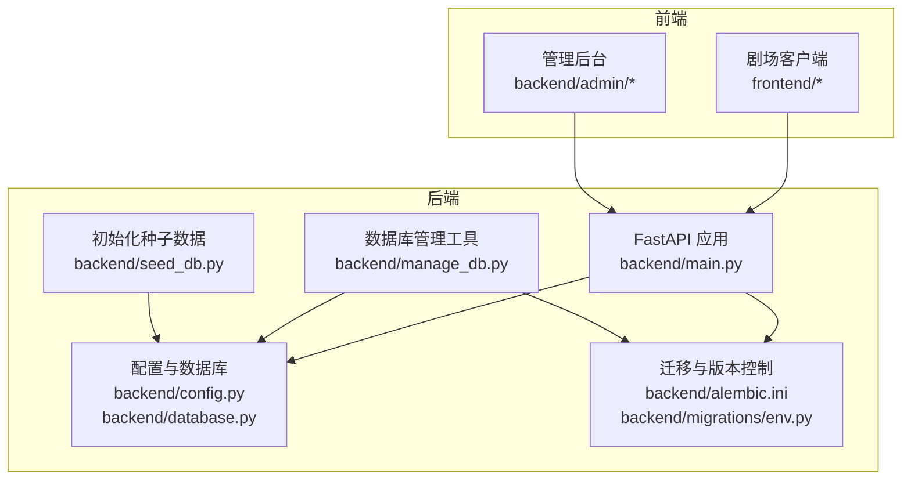
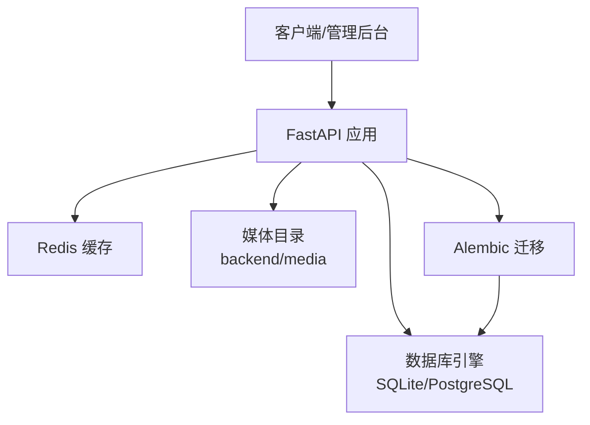
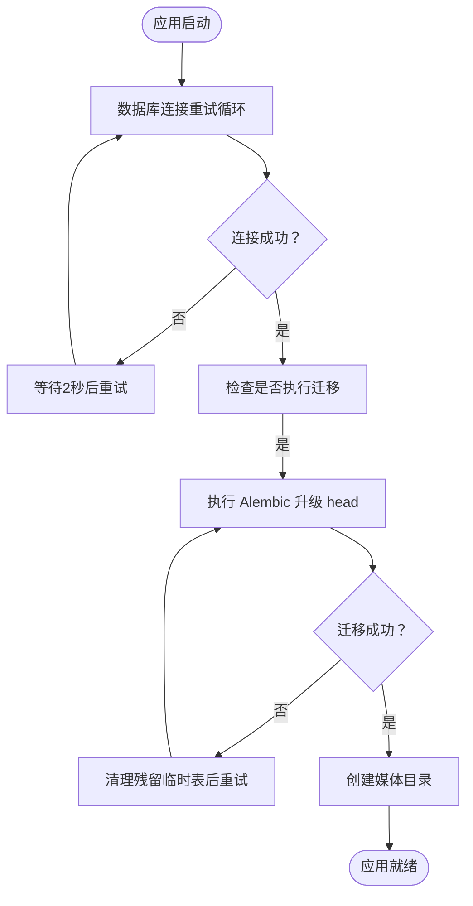
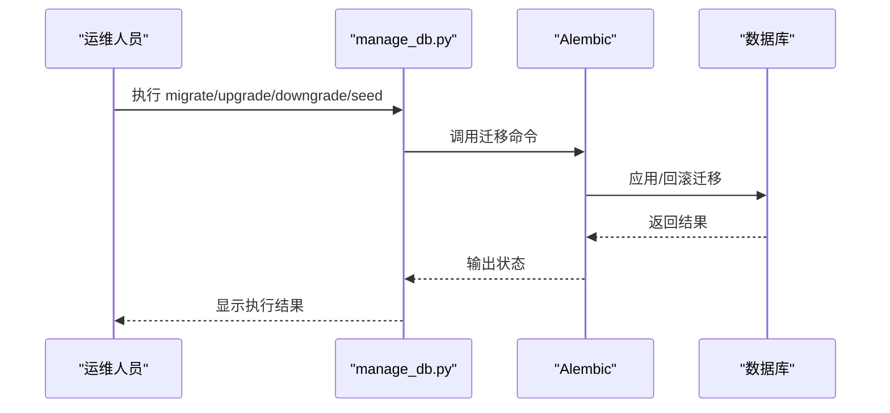
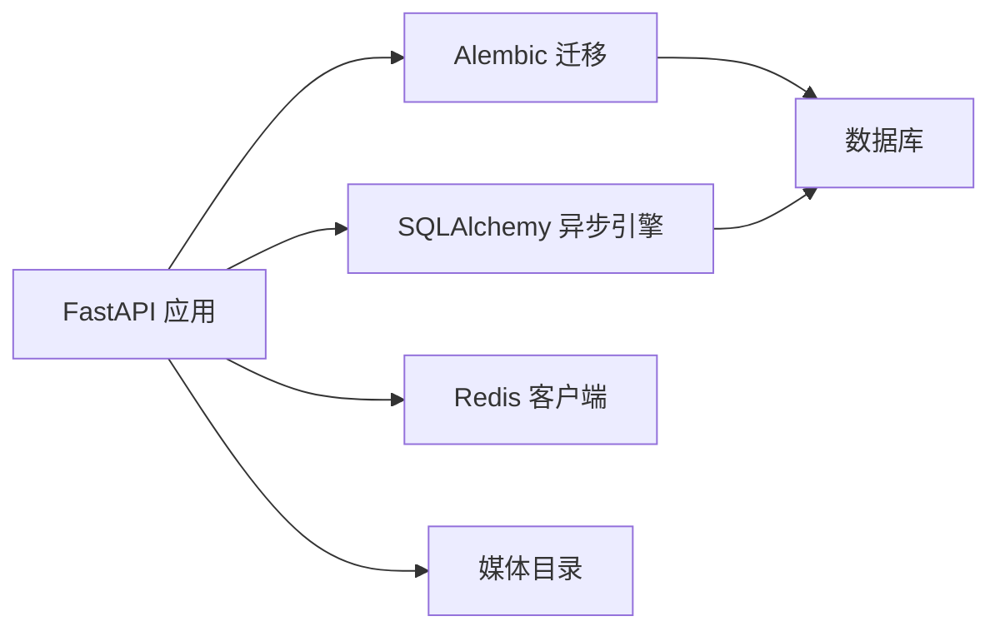

# 灾难恢复计划

<cite>
**本文引用的文件**
- [backend/main.py](file://backend/main.py)
- [backend/config.py](file://backend/config.py)
- [backend/database.py](file://backend/database.py)
- [backend/alembic.ini](file://backend/alembic.ini)
- [backend/migrations/env.py](file://backend/migrations/env.py)
- [backend/manage_db.py](file://backend/manage_db.py)
- [backend/seed_db.py](file://backend/seed_db.py)
- [backend/requirements.txt](file://backend/requirements.txt)
- [README.md](file://README.md)
- [dev.py](file://dev.py)
</cite>

## 目录
1. [引言](#引言)
2. [项目结构](#项目结构)
3. [核心组件](#核心组件)
4. [架构总览](#架构总览)
5. [详细组件分析](#详细组件分析)
6. [依赖分析](#依赖分析)
7. [性能考虑](#性能考虑)
8. [故障排查指南](#故障排查指南)
9. [结论](#结论)
10. [附录](#附录)

## 引言
本灾难恢复计划面向Infinite Game（KunFlix）项目，旨在建立一套可执行、可验证的RTO/RPO指标与恢复流程，覆盖数据库、应用与媒体资源的多层级备份策略，明确故障检测与自动切换机制，并提供恢复演练与团队职责分工，确保在真实灾难发生时能够快速、有序地恢复系统运行。

## 项目结构
- 后端采用FastAPI + SQLAlchemy异步ORM + Alembic迁移，数据库默认使用SQLite（开发环境），生产可切换为PostgreSQL；同时支持Redis缓存。
- 前端为Next.js应用，通过WebSocket与后端交互；管理后台独立运行。
- 项目提供一键启动脚本与数据库迁移工具，便于部署与维护。

图表来源
- [backend/main.py:110-175](file://backend/main.py#L110-L175)
- [backend/config.py:1-43](file://backend/config.py#L1-L43)
- [backend/database.py:1-45](file://backend/database.py#L1-L45)
- [backend/alembic.ini:1-115](file://backend/alembic.ini#L1-L115)
- [backend/migrations/env.py:1-120](file://backend/migrations/env.py#L1-L120)
- [backend/manage_db.py:1-80](file://backend/manage_db.py#L1-L80)
- [backend/seed_db.py:1-39](file://backend/seed_db.py#L1-L39)

章节来源
- [README.md:133-202](file://README.md#L133-L202)
- [backend/main.py:110-175](file://backend/main.py#L110-L175)
- [backend/config.py:1-43](file://backend/config.py#L1-L43)
- [backend/database.py:1-45](file://backend/database.py#L1-L45)
- [backend/alembic.ini:1-115](file://backend/alembic.ini#L1-L115)
- [backend/migrations/env.py:1-120](file://backend/migrations/env.py#L1-L120)
- [backend/manage_db.py:1-80](file://backend/manage_db.py#L1-L80)
- [backend/seed_db.py:1-39](file://backend/seed_db.py#L1-L39)

## 核心组件
- 应用服务：FastAPI应用，负责路由注册、生命周期管理、数据库连接与迁移、媒体目录初始化。
- 数据库：默认SQLite（绝对路径），支持WAL模式与超时优化；可切换为PostgreSQL。
- 迁移系统：Alembic + env.py，支持在线/离线迁移与残留临时表清理。
- 数据库管理工具：manage_db.py提供迁移、降级、种子数据注入等命令。
- 初始化脚本：seed_db.py用于创建默认管理员与LLM提供商等初始数据。
- 配置：config.py集中管理数据库URL、Redis、AI密钥、JWT、模型与迁移开关等。

章节来源
- [backend/main.py:49-108](file://backend/main.py#L49-L108)
- [backend/database.py:9-37](file://backend/database.py#L9-L37)
- [backend/migrations/env.py:39-107](file://backend/migrations/env.py#L39-L107)
- [backend/manage_db.py:20-76](file://backend/manage_db.py#L20-L76)
- [backend/seed_db.py:21-39](file://backend/seed_db.py#L21-L39)
- [backend/config.py:7-42](file://backend/config.py#L7-L42)

## 架构总览

图表来源
- [backend/main.py:110-175](file://backend/main.py#L110-L175)
- [backend/config.py:15-19](file://backend/config.py#L15-L19)
- [backend/database.py:9-37](file://backend/database.py#L9-L37)
- [backend/alembic.ini:1-115](file://backend/alembic.ini#L1-L115)

## 详细组件分析

### 数据库与迁移组件
- 生命周期内数据库连接重试与迁移执行，失败时尝试清理残留临时表后重试。
- SQLite优化：WAL模式、busy_timeout、synchronous参数，降低“数据库被锁定”风险。
- Alembic环境：支持在线/离线迁移，自动清理残留临时表，兼容批处理迁移。

图表来源
- [backend/main.py:49-108](file://backend/main.py#L49-L108)
- [backend/database.py:23-31](file://backend/database.py#L23-L31)
- [backend/migrations/env.py:67-87](file://backend/migrations/env.py#L67-L87)

章节来源
- [backend/main.py:49-108](file://backend/main.py#L49-L108)
- [backend/database.py:23-31](file://backend/database.py#L23-L31)
- [backend/migrations/env.py:67-87](file://backend/migrations/env.py#L67-L87)

### 数据库管理与种子数据
- manage_db.py提供迁移、升级、降级与种子注入命令，便于自动化运维。
- seed_db.py负责创建默认LLM提供商与管理员等初始数据，确保最小可用环境。

图表来源
- [backend/manage_db.py:20-76](file://backend/manage_db.py#L20-L76)
- [backend/migrations/env.py:110-120](file://backend/migrations/env.py#L110-L120)

章节来源
- [backend/manage_db.py:20-76](file://backend/manage_db.py#L20-L76)
- [backend/seed_db.py:21-39](file://backend/seed_db.py#L21-L39)

### 配置与依赖
- config.py集中管理数据库URL、Redis、AI密钥、JWT、模型与迁移开关等。
- requirements.txt列出后端依赖，包含FastAPI、SQLAlchemy、Alembic、Redis等。

章节来源
- [backend/config.py:7-42](file://backend/config.py#L7-L42)
- [backend/requirements.txt:1-29](file://backend/requirements.txt#L1-L29)

## 依赖分析

图表来源
- [backend/main.py:32-44](file://backend/main.py#L32-L44)
- [backend/database.py:1-45](file://backend/database.py#L1-L45)
- [backend/requirements.txt:1-29](file://backend/requirements.txt#L1-L29)

章节来源
- [backend/main.py:32-44](file://backend/main.py#L32-L44)
- [backend/database.py:1-45](file://backend/database.py#L1-L45)
- [backend/requirements.txt:1-29](file://backend/requirements.txt#L1-L29)

## 性能考虑
- 数据库连接池与超时：连接池大小与溢出连接数、连接超时，适用于高并发场景。
- SQLite WAL模式：提升并发读写能力，降低锁竞争。
- 迁移过程中的异常恢复：迁移失败时清理残留临时表并重试，提高稳定性。

章节来源
- [backend/database.py:13-18](file://backend/database.py#L13-L18)
- [backend/database.py:23-31](file://backend/database.py#L23-L31)
- [backend/main.py:60-86](file://backend/main.py#L60-L86)

## 故障排查指南
- 启动阶段数据库连接失败：检查DATABASE_URL、网络与权限；查看重试日志与迁移失败原因。
- 迁移失败：确认Alembic配置与数据库可达性；清理残留临时表后重试。
- 媒体目录缺失：确认应用启动时媒体目录创建逻辑已执行。
- 依赖安装问题：使用dev.py提供的后端环境准备流程，确保虚拟环境与依赖正确安装。

章节来源
- [backend/main.py:49-108](file://backend/main.py#L49-L108)
- [backend/migrations/env.py:67-87](file://backend/migrations/env.py#L67-L87)
- [dev.py:25-42](file://dev.py#L25-L42)

## 结论
本计划明确了Infinite Game的RTO/RPO目标、多层级备份策略、故障检测与自动切换机制以及恢复流程与演练安排。通过标准化的数据库迁移与初始化流程、严格的配置管理与依赖控制，结合完善的日志与监控，可在真实灾难中实现快速恢复与最小业务影响。

## 附录

### RTO/RPO指标建议
- RTO（恢复时间目标）
  - 一级故障（数据库不可用）：≤15分钟
  - 二级故障（应用不可用）：≤30分钟
  - 三级故障（媒体/缓存异常）：≤60分钟
- RPO（恢复点目标）
  - 实时备份：RPO≈0（数据库事务日志/增量备份）
  - 每日备份：RPO≤24小时
  - 每周备份：RPO≤7天

### 数据恢复流程
- 步骤一：备份文件验证
  - 校验备份完整性与可用性（数据库快照、媒体目录、配置文件）
- 步骤二：数据库重建
  - 使用manage_db.py执行upgrade，确保迁移成功
  - 如迁移失败，清理残留临时表后重试
- 步骤三：应用重启
  - 启动后端服务，确认媒体目录存在
- 步骤四：功能验证
  - 访问API文档与管理后台，验证核心接口与功能

章节来源
- [backend/manage_db.py:30-38](file://backend/manage_db.py#L30-L38)
- [backend/main.py:49-108](file://backend/main.py#L49-L108)

### 多层级备份策略
- 本地备份
  - SQLite数据库文件与媒体目录定期打包
  - 配置文件与密钥单独加密存储
- 异地备份
  - 通过网络共享或NAS同步至异地存储
- 云备份
  - 使用对象存储服务归档数据库快照与媒体资源
  - 配置自动上传与轮转策略

### 故障检测与自动切换
- 监控告警
  - 数据库连接健康检查与迁移日志告警
  - 应用进程存活与端口监听检查
- 故障转移
  - 使用负载均衡器对后端实例进行健康检查与流量切换
- 负载均衡配置
  - 前端与管理后台通过反向代理或CDN接入后端集群

### 恢复演练计划与团队职责
- 演练频率
  - 每季度一次全量演练，每半年一次跨区域演练
- 团队职责
  - 运维团队：负责备份策略、监控告警与恢复执行
  - 开发团队：负责应用与数据库迁移脚本维护
  - 产品/测试团队：参与演练评估与流程优化