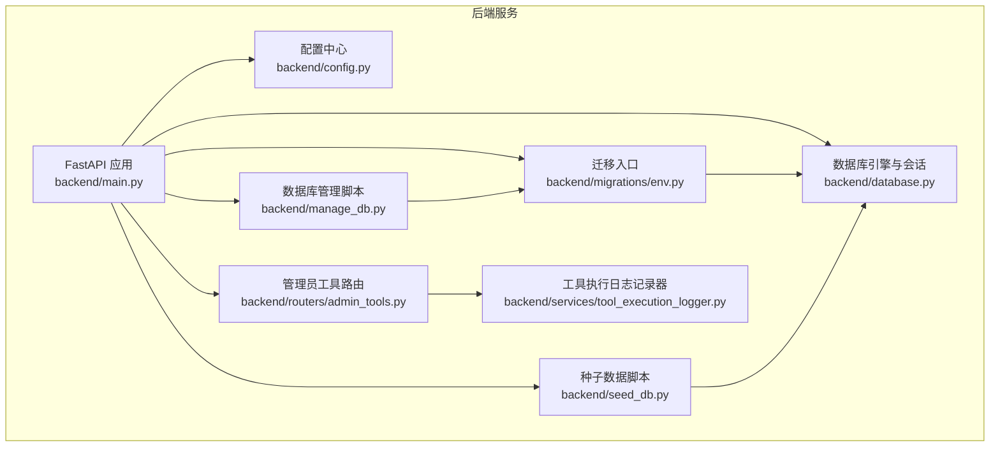
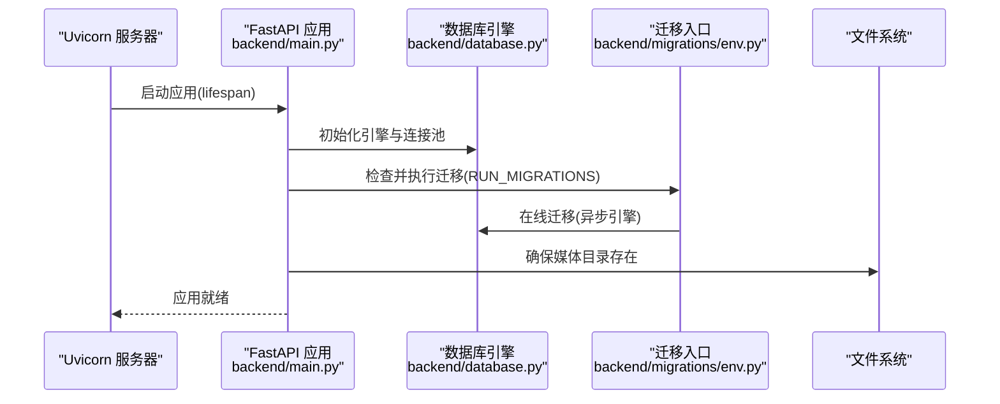
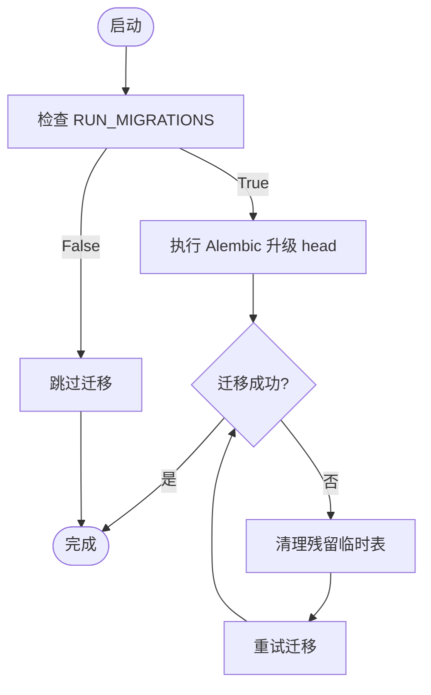
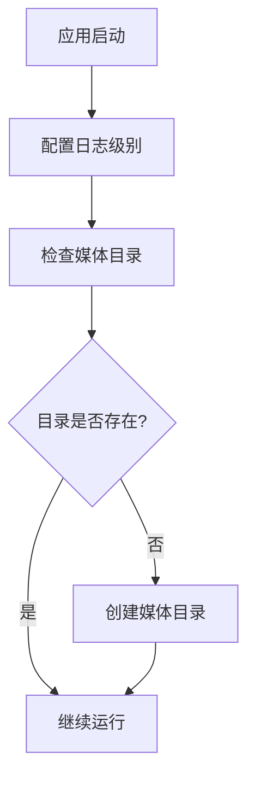
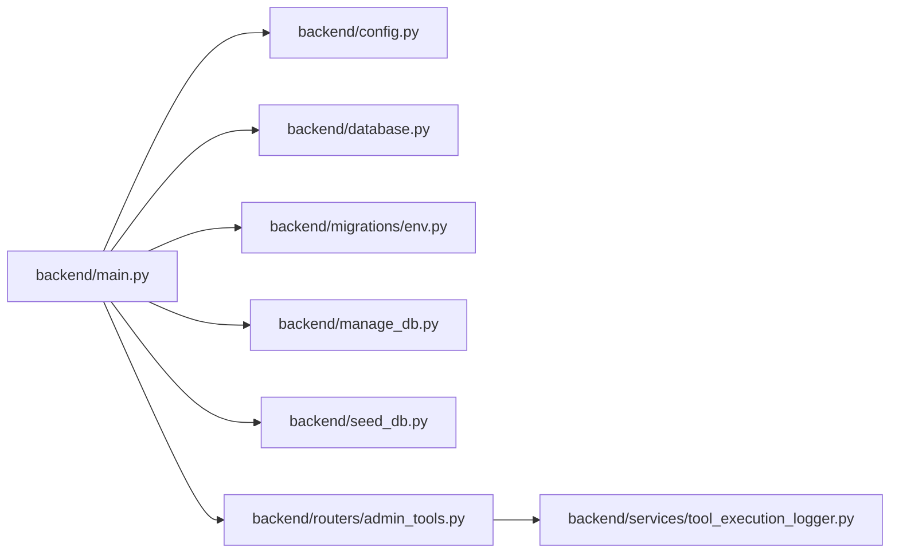

# 系统维护任务

<cite>
**本文引用的文件**
- [backend/main.py](file://backend/main.py)
- [backend/config.py](file://backend/config.py)
- [backend/database.py](file://backend/database.py)
- [backend/manage_db.py](file://backend/manage_db.py)
- [backend/migrations/env.py](file://backend/migrations/env.py)
- [backend/seed_db.py](file://backend/seed_db.py)
- [backend/routers/admin_tools.py](file://backend/routers/admin_tools.py)
- [backend/services/tool_execution_logger.py](file://backend/services/tool_execution_logger.py)
</cite>

## 目录
1. [简介](#简介)
2. [项目结构](#项目结构)
3. [核心组件](#核心组件)
4. [架构总览](#架构总览)
5. [详细组件分析](#详细组件分析)
6. [依赖分析](#依赖分析)
7. [性能考虑](#性能考虑)
8. [故障排查指南](#故障排查指南)
9. [结论](#结论)
10. [附录](#附录)

## 简介
本文件面向Infinite Game系统的运维与开发团队，提供一套完整的系统维护任务文档。内容覆盖日常维护任务（数据库索引重建、统计信息更新、日志与临时文件清理）、定期维护任务的自动化脚本配置（Cron作业与任务调度策略）、系统健康检查流程（内存、磁盘、进程）、缓存清理策略（Redis与浏览器缓存），以及性能优化与系统参数调优建议。文档以仓库中的实际实现为依据，结合可操作的步骤与可视化图示，帮助读者建立标准化的维护流程。

## 项目结构
后端采用FastAPI + SQLAlchemy异步ORM + Alembic迁移的架构。数据库默认使用SQLite（本地开发友好），生产环境可切换至PostgreSQL；Redis用于缓存；日志通过Python标准库进行统一配置；迁移与种子数据脚本位于独立模块中，便于CI/CD或运维脚本调用。

图表来源
- [backend/main.py:110-153](file://backend/main.py#L110-L153)
- [backend/config.py:7-42](file://backend/config.py#L7-L42)
- [backend/database.py:1-45](file://backend/database.py#L1-L45)
- [backend/migrations/env.py:19-32](file://backend/migrations/env.py#L19-L32)
- [backend/manage_db.py:40-77](file://backend/manage_db.py#L40-L77)
- [backend/seed_db.py:21-57](file://backend/seed_db.py#L21-L57)
- [backend/routers/admin_tools.py:18-22](file://backend/routers/admin_tools.py#L18-L22)
- [backend/services/tool_execution_logger.py:77-89](file://backend/services/tool_execution_logger.py#L77-L89)

章节来源
- [backend/main.py:110-153](file://backend/main.py#L110-L153)
- [backend/config.py:7-42](file://backend/config.py#L7-L42)
- [backend/database.py:1-45](file://backend/database.py#L1-L45)
- [backend/migrations/env.py:19-32](file://backend/migrations/env.py#L19-L32)
- [backend/manage_db.py:40-77](file://backend/manage_db.py#L40-L77)
- [backend/seed_db.py:21-57](file://backend/seed_db.py#L21-L57)
- [backend/routers/admin_tools.py:18-22](file://backend/routers/admin_tools.py#L18-L22)
- [backend/services/tool_execution_logger.py:77-89](file://backend/services/tool_execution_logger.py#L77-L89)

## 核心组件
- 应用生命周期与启动项
  - 数据库连接重试与迁移执行
  - 媒体目录初始化
  - CORS与调试中间件
- 配置中心
  - 数据库URL、Redis URL、JWT密钥、模型与系统开关
- 数据库层
  - 异步引擎、连接池、SQLite PRAGMA优化
- 迁移与种子
  - Alembic在线/离线迁移、残留临时表清理、种子数据填充
- 管理与监控
  - 工具使用统计与执行日志接口
  - 工具执行非阻塞记录器

章节来源
- [backend/main.py:49-108](file://backend/main.py#L49-L108)
- [backend/config.py:7-42](file://backend/config.py#L7-L42)
- [backend/database.py:9-37](file://backend/database.py#L9-L37)
- [backend/migrations/env.py:67-87](file://backend/migrations/env.py#L67-L87)
- [backend/seed_db.py:21-57](file://backend/seed_db.py#L21-L57)
- [backend/routers/admin_tools.py:74-128](file://backend/routers/admin_tools.py#L74-L128)
- [backend/services/tool_execution_logger.py:44-89](file://backend/services/tool_execution_logger.py#L44-L89)

## 架构总览
下图展示系统启动到迁移、数据库连接、日志与媒体目录准备的关键流程。

图表来源
- [backend/main.py:49-108](file://backend/main.py#L49-L108)
- [backend/database.py:9-19](file://backend/database.py#L9-L19)
- [backend/migrations/env.py:89-113](file://backend/migrations/env.py#L89-L113)

## 详细组件分析

### 数据库维护与迁移
- 迁移执行策略
  - 应用启动时根据配置决定是否自动执行迁移
  - 若失败，尝试清理残留临时表后重试
- 迁移脚本
  - 提供命令行封装，支持创建、升级、降级与种子数据
- 种子数据
  - 初始化默认LLM提供商与超级管理员账户

图表来源
- [backend/main.py:59-88](file://backend/main.py#L59-L88)
- [backend/migrations/env.py:67-87](file://backend/migrations/env.py#L67-L87)
- [backend/manage_db.py:20-38](file://backend/manage_db.py#L20-L38)

章节来源
- [backend/main.py:59-88](file://backend/main.py#L59-L88)
- [backend/migrations/env.py:67-87](file://backend/migrations/env.py#L67-L87)
- [backend/manage_db.py:20-38](file://backend/manage_db.py#L20-L38)
- [backend/seed_db.py:21-57](file://backend/seed_db.py#L21-L57)

### 日志与临时文件管理
- 日志配置
  - 控制台输出、SQLAlchemy与Uvicorn访问日志级别
- 临时文件与媒体资源
  - 启动时确保媒体目录存在
  - 建议定期清理过期媒体与日志文件

图表来源
- [backend/main.py:15-30](file://backend/main.py#L15-L30)
- [backend/main.py:104-107](file://backend/main.py#L104-L107)

章节来源
- [backend/main.py:15-30](file://backend/main.py#L15-L30)
- [backend/main.py:104-107](file://backend/main.py#L104-L107)

### 缓存清理策略
- Redis缓存
  - 默认地址在配置中定义，可用于清理特定键空间或全量清理
- 浏览器缓存
  - 前端静态资源版本化与缓存头控制，建议通过构建产物指纹化降低缓存命中带来的问题

章节来源
- [backend/config.py:18-19](file://backend/config.py#L18-L19)

### 系统健康检查流程
- 内存使用监控
  - 结合系统监控工具（如top/htop、Windows任务管理器）观察进程常驻内存与峰值
- 磁盘空间检查
  - 定期检查数据库文件、日志目录与媒体目录占用
- 进程状态监控
  - 通过进程名与端口确认服务存活，异常时触发重启与告警

[本节为通用运维实践，不直接分析具体源码文件]

### 性能优化与参数调优
- 数据库连接池
  - 调整连接池大小与溢出数量，平衡并发与资源占用
- SQLite优化
  - WAL模式、busy_timeout、synchronous参数已在引擎事件中配置
- 日志级别
  - 生产环境建议提升日志级别，减少I/O开销
- 任务调度
  - 使用Cron定时执行数据库维护与日志清理任务

章节来源
- [backend/database.py:12-18](file://backend/database.py#L12-L18)
- [backend/database.py:24-31](file://backend/database.py#L24-L31)
- [backend/main.py:22-27](file://backend/main.py#L22-L27)

## 依赖分析
- 应用对配置与数据库的耦合度低，便于在不同环境中切换数据库类型
- 迁移脚本与管理脚本解耦于主应用，支持独立执行
- 工具执行日志通过独立会话写入，避免阻塞主业务流

图表来源
- [backend/main.py:47-48](file://backend/main.py#L47-L48)
- [backend/config.py:42](file://backend/config.py#L42)
- [backend/database.py:42-44](file://backend/database.py#L42-L44)
- [backend/migrations/env.py:15-17](file://backend/migrations/env.py#L15-L17)
- [backend/manage_db.py:78-79](file://backend/manage_db.py#L78-L79)
- [backend/seed_db.py:59-64](file://backend/seed_db.py#L59-L64)
- [backend/routers/admin_tools.py:12-13](file://backend/routers/admin_tools.py#L12-L13)
- [backend/services/tool_execution_logger.py:53-54](file://backend/services/tool_execution_logger.py#L53-L54)

章节来源
- [backend/main.py:47-48](file://backend/main.py#L47-L48)
- [backend/config.py:42](file://backend/config.py#L42)
- [backend/database.py:42-44](file://backend/database.py#L42-L44)
- [backend/migrations/env.py:15-17](file://backend/migrations/env.py#L15-L17)
- [backend/manage_db.py:78-79](file://backend/manage_db.py#L78-L79)
- [backend/seed_db.py:59-64](file://backend/seed_db.py#L59-L64)
- [backend/routers/admin_tools.py:12-13](file://backend/routers/admin_tools.py#L12-L13)
- [backend/services/tool_execution_logger.py:53-54](file://backend/services/tool_execution_logger.py#L53-L54)

## 性能考虑
- 连接池与超时
  - 根据QPS与并发请求调整连接池大小与超时时间，避免“database is locked”与连接耗尽
- 日志与I/O
  - 生产环境降低SQLAlchemy与Uvicorn访问日志级别，减少磁盘写入
- 迁移与启动
  - 启动阶段的迁移失败重试与残留表清理，确保数据库一致性与可用性

[本节为通用性能建议，不直接分析具体源码文件]

## 故障排查指南
- 迁移失败
  - 查看启动日志中的迁移错误与残留临时表清理过程
  - 使用管理脚本进行降级或重新升级
- 工具执行异常
  - 通过管理员工具路由查看执行统计与分页日志，定位失败原因
  - 日志记录器对敏感字段进行脱敏处理，避免泄露

章节来源
- [backend/main.py:66-86](file://backend/main.py#L66-L86)
- [backend/routers/admin_tools.py:74-128](file://backend/routers/admin_tools.py#L74-L128)
- [backend/services/tool_execution_logger.py:39-42](file://backend/services/tool_execution_logger.py#L39-L42)

## 结论
通过将数据库迁移、日志与临时文件管理、缓存清理与健康检查纳入标准化流程，并配合Cron任务与监控告警，可有效保障Infinite Game系统的稳定性与性能。建议在生产环境中启用迁移自动执行、定期清理日志与媒体文件、按需清理Redis缓存，并持续关注数据库连接池与日志级别的配置。

[本节为总结性内容，不直接分析具体源码文件]

## 附录

### 日常维护任务清单
- 数据库索引重建
  - 通过迁移脚本创建新版本，由Alembic在线迁移自动处理
  - 如遇锁表或失败，参考启动阶段的残留表清理逻辑
- 统计信息更新
  - 使用管理员工具路由提供的统计接口获取工具调用次数、错误率与平均耗时
- 日志文件清理
  - 清理应用日志与Uvicorn访问日志目录，保留必要历史以便审计
- 临时文件清理
  - 清理媒体目录中的过期资源与缓存文件

章节来源
- [backend/migrations/env.py:67-87](file://backend/migrations/env.py#L67-L87)
- [backend/routers/admin_tools.py:74-128](file://backend/routers/admin_tools.py#L74-L128)
- [backend/main.py:15-30](file://backend/main.py#L15-L30)
- [backend/main.py:104-107](file://backend/main.py#L104-L107)

### 定期维护任务自动化脚本配置
- Cron作业建议
  - 每日凌晨清理日志与媒体目录
  - 每周执行一次数据库统计信息汇总与备份
  - 每月检查并清理Redis缓存
- 任务调度策略
  - 使用独立虚拟环境与Python解释器路径
  - 对迁移与种子脚本添加幂等性校验，避免重复执行

章节来源
- [backend/manage_db.py:40-77](file://backend/manage_db.py#L40-L77)
- [backend/seed_db.py:21-57](file://backend/seed_db.py#L21-L57)

### 系统健康检查流程
- 内存使用监控
  - 使用系统自带工具或第三方监控平台观察进程内存曲线
- 磁盘空间检查
  - 监控数据库文件、日志与媒体目录的容量变化
- 进程状态监控
  - 通过进程名与端口确认服务存活，异常时触发重启与告警

[本节为通用运维实践，不直接分析具体源码文件]

### 缓存清理策略
- Redis缓存
  - 通过配置中的Redis URL连接实例，按业务键空间进行清理
- 浏览器缓存
  - 前端静态资源版本化，避免长期缓存导致的兼容性问题

章节来源
- [backend/config.py:18-19](file://backend/config.py#L18-L19)