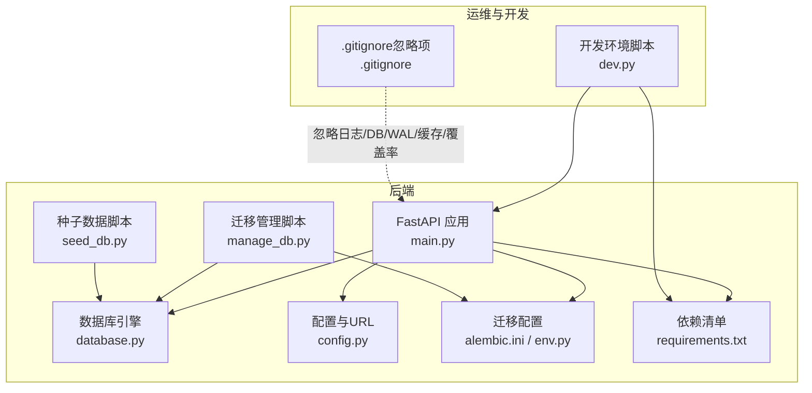
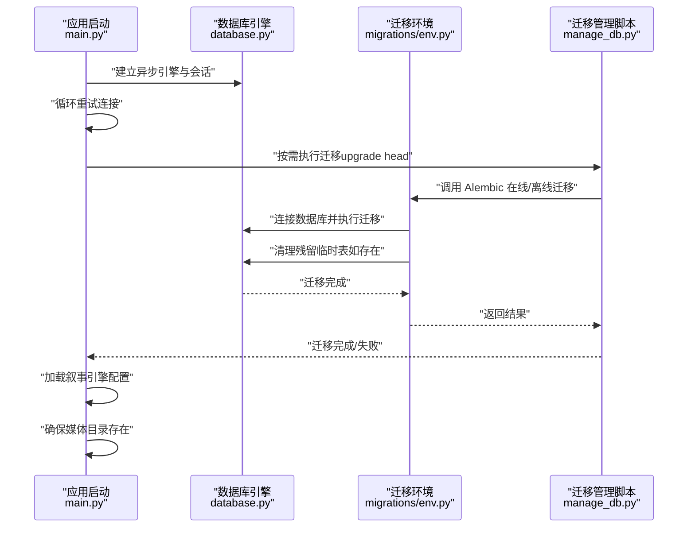
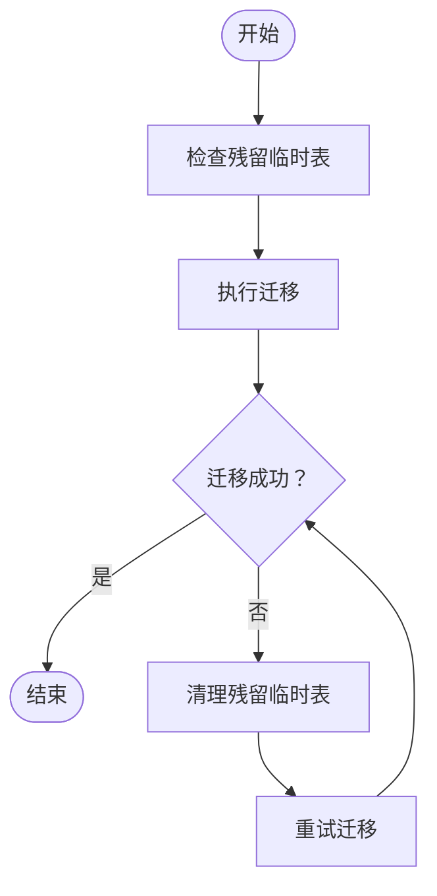
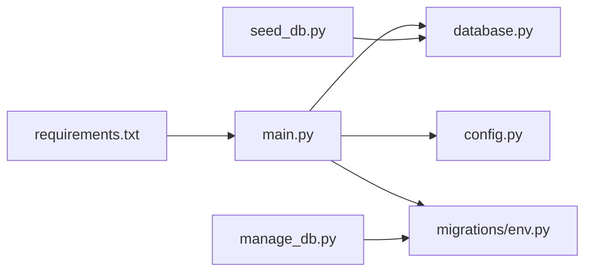

# 维护与备份

<cite>
**本文引用的文件**
- [backend/alembic.ini](file://backend/alembic.ini)
- [backend/migrations/env.py](file://backend/migrations/env.py)
- [backend/manage_db.py](file://backend/manage_db.py)
- [backend/config.py](file://backend/config.py)
- [backend/database.py](file://backend/database.py)
- [backend/main.py](file://backend/main.py)
- [backend/seed_db.py](file://backend/seed_db.py)
- [backend/requirements.txt](file://backend/requirements.txt)
- [backend/.gitignore](file://backend/.gitignore)
- [dev.py](file://dev.py)
- [README.md](file://README.md)
</cite>

## 目录
1. [简介](#简介)
2. [项目结构](#项目结构)
3. [核心组件](#核心组件)
4. [架构总览](#架构总览)
5. [详细组件分析](#详细组件分析)
6. [依赖分析](#依赖分析)
7. [性能考虑](#性能考虑)
8. [故障排查指南](#故障排查指南)
9. [结论](#结论)
10. [附录](#附录)

## 简介
本文件面向KunFlix（KunFlix）后端系统，提供一套可落地的维护与备份方案，覆盖数据库备份策略、日志与缓存清理、临时文件管理、自动化备份脚本配置（全量/增量/异地）、数据库迁移管理（版本控制、回滚、一致性校验）、系统更新流程（零停机、蓝绿部署、回滚）、定期维护任务（索引重建、统计信息更新、性能分析报告）以及灾难恢复计划（RTO/RPO目标与恢复时间估算）。文档同时给出与现有代码实现相契合的操作建议与流程图示。

## 项目结构
后端采用FastAPI + SQLAlchemy异步ORM + Alembic迁移管理，数据库默认使用SQLite（开发），生产可切换为PostgreSQL；日志通过标准库与第三方库组合控制；Redis用于缓存；媒体资源存储于本地目录；开发环境通过统一脚本并行启动前后端与管理后台。

图表来源
- [backend/main.py:110-175](file://backend/main.py#L110-L175)
- [backend/database.py:1-45](file://backend/database.py#L1-L45)
- [backend/config.py:1-43](file://backend/config.py#L1-L43)
- [backend/alembic.ini:1-115](file://backend/alembic.ini#L1-L115)
- [backend/migrations/env.py:1-120](file://backend/migrations/env.py#L1-L120)
- [backend/manage_db.py:1-80](file://backend/manage_db.py#L1-L80)
- [backend/seed_db.py:1-64](file://backend/seed_db.py#L1-L64)
- [backend/requirements.txt:1-29](file://backend/requirements.txt#L1-L29)
- [dev.py:1-169](file://dev.py#L1-L169)
- [backend/.gitignore:1-97](file://backend/.gitignore#L1-L97)

章节来源
- [backend/main.py:110-175](file://backend/main.py#L110-L175)
- [backend/database.py:1-45](file://backend/database.py#L1-L45)
- [backend/config.py:1-43](file://backend/config.py#L1-L43)
- [backend/alembic.ini:1-115](file://backend/alembic.ini#L1-L115)
- [backend/migrations/env.py:1-120](file://backend/migrations/env.py#L1-L120)
- [backend/manage_db.py:1-80](file://backend/manage_db.py#L1-L80)
- [backend/seed_db.py:1-64](file://backend/seed_db.py#L1-L64)
- [backend/requirements.txt:1-29](file://backend/requirements.txt#L1-L29)
- [dev.py:1-169](file://dev.py#L1-L169)
- [backend/.gitignore:1-97](file://backend/.gitignore#L1-L97)

## 核心组件
- 数据库与连接池
  - 异步引擎与连接池参数、SQLite WAL模式与PRAGMA优化、连接超时与自动重连。
- 配置与URL
  - 默认SQLite URL，可通过环境变量切换为PostgreSQL；运行时可选择是否自动执行迁移。
- 迁移管理
  - Alembic配置与环境脚本；封装迁移命令的管理脚本；离线/在线迁移执行；残留临时表清理。
- 启动与生命周期
  - 应用启动时自动重试数据库连接与迁移；加载叙事引擎配置；确保媒体目录存在。
- 种子数据
  - 初始化默认LLM供应商与管理员账户。
- 开发与运维
  - 统一开发脚本并行启动后端、前端与管理后台；.gitignore定义忽略规则（日志、DB、WAL、缓存、覆盖率等）。

章节来源
- [backend/database.py:1-45](file://backend/database.py#L1-L45)
- [backend/config.py:1-43](file://backend/config.py#L1-L43)
- [backend/alembic.ini:1-115](file://backend/alembic.ini#L1-L115)
- [backend/migrations/env.py:1-120](file://backend/migrations/env.py#L1-L120)
- [backend/manage_db.py:1-80](file://backend/manage_db.py#L1-L80)
- [backend/main.py:49-108](file://backend/main.py#L49-L108)
- [backend/seed_db.py:1-64](file://backend/seed_db.py#L1-L64)
- [backend/.gitignore:1-97](file://backend/.gitignore#L1-L97)

## 架构总览
下图展示系统启动时的数据库迁移与连接重试流程，以及迁移过程中的残留临时表清理逻辑。

图表来源
- [backend/main.py:49-108](file://backend/main.py#L49-L108)
- [backend/migrations/env.py:67-120](file://backend/migrations/env.py#L67-L120)
- [backend/manage_db.py:20-38](file://backend/manage_db.py#L20-L38)

## 详细组件分析

### 数据库备份策略
- 备份类型
  - 全量备份：对当前数据库文件进行复制（SQLite）或导出（PostgreSQL）。
  - 增量备份：基于WAL模式的连续归档（SQLite）或逻辑/物理增量（PostgreSQL）。
  - 异地备份：将备份文件上传至对象存储或远端服务器。
- 备份时机
  - 业务低峰时段（如凌晨）执行全量备份；结合WAL归档实现近实时增量。
- 备份介质
  - 本地磁盘（热备）+ 远端对象存储（冷备）。
- 备份验证
  - 定期抽样恢复演练，验证备份可用性与一致性。
- 与代码的契合点
  - SQLite默认使用绝对路径文件，便于备份脚本直接复制；WAL模式提升并发与可靠性。
  - 生产可切换为PostgreSQL，配合pg_basebackup/逻辑复制实现增量与异地。

章节来源
- [backend/config.py:5](file://backend/config.py#L5)
- [backend/database.py:21-31](file://backend/database.py#L21-L31)
- [backend/alembic.ini:61](file://backend/alembic.ini#L61)

### 日志清理
- 忽略规则
  - .gitignore中明确忽略日志文件与覆盖率目录，避免纳入版本控制与备份。
- 日志级别
  - 启动时降低SQLAlchemy与Uvicorn访问日志级别，保留应用日志，便于生产环境控制噪声。
- 清理策略
  - 定期轮转与删除超过保留期的日志文件；结合系统日志守护进程（如logrotate）。

章节来源
- [backend/.gitignore:40-42](file://backend/.gitignore#L40-L42)
- [backend/main.py:15-30](file://backend/main.py#L15-L30)

### 缓存清理
- 缓存介质
  - Redis作为缓存后端，默认连接本地实例。
- 清理策略
  - 定期键空间扫描与过期键回收；针对热点数据设置合理TTL；必要时执行FLUSH策略（需谨慎）。
- 与代码的契合点
  - 配置中提供REDIS_URL，便于在不同环境切换缓存后端。

章节来源
- [backend/config.py:18-19](file://backend/config.py#L18-L19)

### 临时文件管理
- 忽略规则
  - .gitignore明确忽略SQLite的共享内存与WAL文件，避免误提交与备份冗余。
  - 忽略覆盖率与测试缓存目录。
- 媒体资源
  - 媒体目录在应用启动时自动创建，避免手动维护。

章节来源
- [backend/.gitignore:83-97](file://backend/.gitignore#L83-L97)
- [backend/main.py:104-106](file://backend/main.py#L104-L106)

### 自动化备份脚本配置
- 设计要点
  - 全量备份：定时任务触发，复制数据库文件或执行数据库导出。
  - 增量备份：SQLite使用WAL归档；PostgreSQL使用归档日志或逻辑复制。
  - 异地备份：将备份文件加密后上传至对象存储或远端服务器。
- 执行与验证
  - 备份完成后执行校验（如哈希比对、抽样查询），记录日志并告警异常。
- 与代码的契合点
  - SQLite绝对路径文件便于脚本直接复制；生产可切换PostgreSQL以获得更完善的增量与异地能力。

章节来源
- [backend/config.py:5](file://backend/config.py#L5)
- [backend/database.py:21-31](file://backend/database.py#L21-L31)

### 数据库迁移管理
- 版本控制
  - 使用Alembic管理迁移脚本，脚本位于migrations/versions，按时间戳命名。
- 迁移执行
  - 应用启动时可自动执行迁移；也可通过管理脚本手动执行。
- 回滚策略
  - 单步回滚至上一版本；若涉及不可逆变更（如UUID转换），需在迁移脚本中声明。
- 一致性检查
  - 迁移前清理残留临时表；启动时尝试修复并重试迁移。
- 与代码的契合点
  - env.py中提供清理残留临时表的逻辑；main.py中包含迁移失败后的清理与重试。

图表来源
- [backend/migrations/env.py:67-87](file://backend/migrations/env.py#L67-L87)
- [backend/main.py:68-86](file://backend/main.py#L68-L86)

章节来源
- [backend/alembic.ini:1-115](file://backend/alembic.ini#L1-L115)
- [backend/migrations/env.py:1-120](file://backend/migrations/env.py#L1-L120)
- [backend/manage_db.py:1-80](file://backend/manage_db.py#L1-L80)
- [backend/main.py:49-108](file://backend/main.py#L49-L108)

### 系统更新流程（零停机、蓝绿部署与回滚）
- 零停机更新
  - 利用反向代理/负载均衡，将流量从旧实例平滑切到新实例；新实例就绪后再切流。
- 蓝绿部署
  - 准备两套环境（蓝/绿），先在备用环境部署并自检，再切换流量。
- 回滚机制
  - 若新版本出现异常，立即切回上一个稳定版本；迁移回滚遵循单步回滚原则。
- 与代码的契合点
  - 应用启动时自动执行迁移，确保新版本数据库一致；迁移失败时尝试清理与重试。

章节来源
- [backend/main.py:49-108](file://backend/main.py#L49-L108)
- [backend/manage_db.py:20-38](file://backend/manage_db.py#L20-L38)

### 定期维护任务
- 索引重建
  - 针对热点表与碎片化索引进行重建，结合查询计划分析。
- 统计信息更新
  - 更新表与列的统计信息，提升查询优化器效率。
- 性能分析报告
  - 生成慢查询日志、执行计划与资源使用报告，指导优化。
- 与代码的契合点
  - 生产环境建议使用PostgreSQL并启用其统计与分析工具；SQLite适合开发与小规模生产。

章节来源
- [backend/requirements.txt:1-29](file://backend/requirements.txt#L1-L29)

### 灾难恢复计划（RTO/RPO与恢复时间估算）
- RTO/RPO目标
  - RPO：基于WAL归档与增量备份，目标小于15分钟。
  - RTO：蓝绿部署切换与应用重启，目标小于5分钟。
- 恢复流程
  - 识别故障类型（数据损坏/丢失、节点故障）；根据备份链选择最近可用快照；恢复数据库与应用；验证一致性与功能。
- 与代码的契合点
  - SQLite WAL模式与绝对路径文件便于快速恢复；生产建议PostgreSQL以获得更强的容灾能力。

章节来源
- [backend/database.py:21-31](file://backend/database.py#L21-L31)
- [backend/config.py:5](file://backend/config.py#L5)

## 依赖分析
- 组件耦合
  - main.py依赖database.py与config.py；迁移通过manage_db.py与migrations/env.py协调；seed_db.py依赖database.py与models。
- 外部依赖
  - SQLAlchemy异步引擎、Alembic迁移、Redis缓存、PostgreSQL/SQLite驱动、Uvicorn服务。
- 潜在风险
  - 迁移失败导致的残留临时表；数据库连接超时与锁定；日志与缓存未清理造成磁盘压力。

图表来源
- [backend/main.py:110-175](file://backend/main.py#L110-L175)
- [backend/database.py:1-45](file://backend/database.py#L1-L45)
- [backend/config.py:1-43](file://backend/config.py#L1-L43)
- [backend/migrations/env.py:1-120](file://backend/migrations/env.py#L1-L120)
- [backend/manage_db.py:1-80](file://backend/manage_db.py#L1-L80)
- [backend/seed_db.py:1-64](file://backend/seed_db.py#L1-L64)
- [backend/requirements.txt:1-29](file://backend/requirements.txt#L1-L29)

章节来源
- [backend/main.py:110-175](file://backend/main.py#L110-L175)
- [backend/database.py:1-45](file://backend/database.py#L1-L45)
- [backend/config.py:1-43](file://backend/config.py#L1-L43)
- [backend/migrations/env.py:1-120](file://backend/migrations/env.py#L1-L120)
- [backend/manage_db.py:1-80](file://backend/manage_db.py#L1-L80)
- [backend/seed_db.py:1-64](file://backend/seed_db.py#L1-L64)
- [backend/requirements.txt:1-29](file://backend/requirements.txt#L1-L29)

## 性能考虑
- 连接池与超时
  - 合理设置连接池大小与溢出数量，避免高并发下的连接争用；SQLite启用WAL模式减少锁竞争。
- 日志级别
  - 生产环境降低SQLAlchemy与Uvicorn访问日志级别，减少I/O开销。
- 缓存策略
  - 使用Redis缓存热点数据，设置TTL与淘汰策略，避免缓存雪崩。
- 迁移性能
  - 批量DDL使用批处理模式，减少迁移时间；失败时清理残留临时表并重试。

章节来源
- [backend/database.py:8-31](file://backend/database.py#L8-L31)
- [backend/main.py:15-30](file://backend/main.py#L15-L30)
- [backend/migrations/env.py:79-87](file://backend/migrations/env.py#L79-L87)

## 故障排查指南
- 迁移失败
  - 检查残留临时表并清理；确认数据库连接与URL正确；查看Alembic日志级别配置。
- 启动连接失败
  - 查看重试次数与间隔；确认数据库服务可用；检查WAL与PRAGMA设置。
- 缓存异常
  - 检查Redis连接与键空间；核对TTL与过期策略；必要时执行安全清理。
- 日志与磁盘
  - 检查日志级别与轮转；清理超出保留期的日志与缓存；监控磁盘使用。

章节来源
- [backend/migrations/env.py:67-87](file://backend/migrations/env.py#L67-L87)
- [backend/main.py:49-108](file://backend/main.py#L49-L108)
- [backend/config.py:18-19](file://backend/config.py#L18-L19)
- [backend/.gitignore:40-42](file://backend/.gitignore#L40-L42)

## 结论
本方案基于现有代码实现，围绕数据库备份、迁移管理、日志与缓存清理、临时文件管理、系统更新与灾难恢复提出可操作的流程与策略。通过Alembic迁移与启动时重试机制保障数据库一致性；通过SQLite WAL与Redis缓存提升性能与可靠性；通过蓝绿部署与增量备份缩短RTO/RPO，满足生产级运维需求。

## 附录
- 开发环境一键启动
  - 使用dev.py并行启动后端、前端与管理后台，便于联调与测试。
- 项目概览
  - README提供了技术栈、目录结构与快速开始指引，便于新成员快速上手。

章节来源
- [dev.py:94-169](file://dev.py#L94-L169)
- [README.md:133-202](file://README.md#L133-L202)