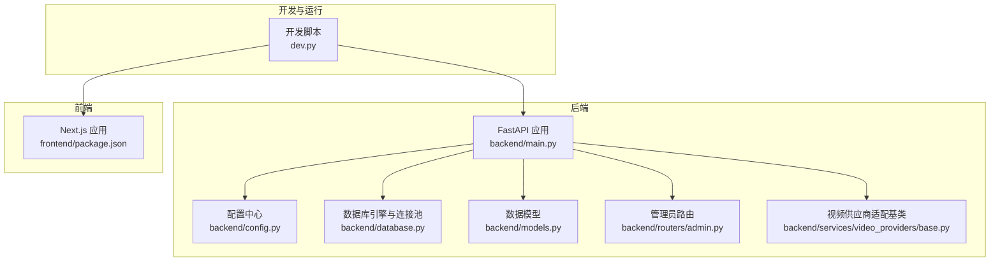
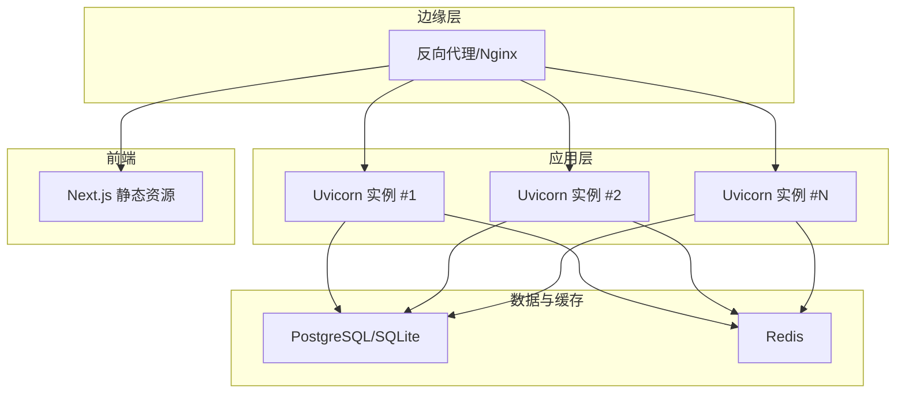
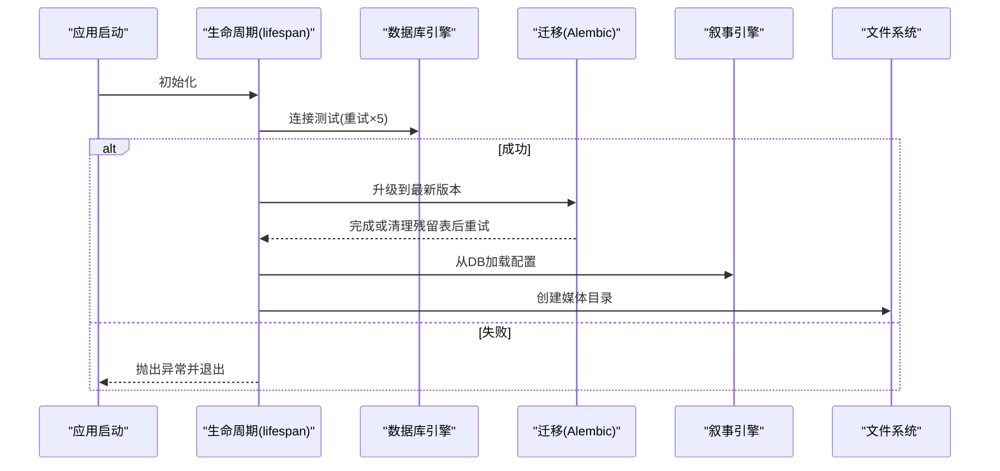
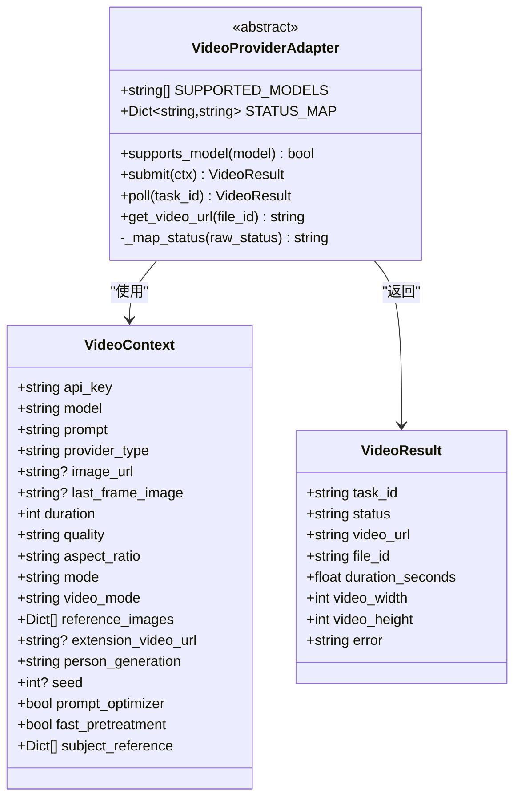
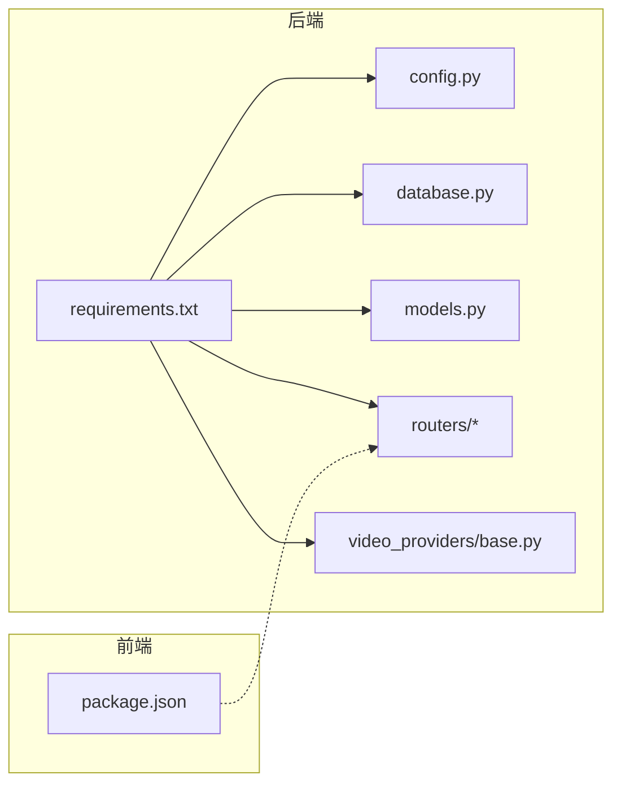

# 部署与运维

<cite>
**本文引用的文件**
- [backend/main.py](file://backend/main.py)
- [backend/config.py](file://backend/config.py)
- [backend/database.py](file://backend/database.py)
- [backend/models.py](file://backend/models.py)
- [backend/routers/admin.py](file://backend/routers/admin.py)
- [backend/services/video_providers/base.py](file://backend/services/video_providers/base.py)
- [backend/requirements.txt](file://backend/requirements.txt)
- [frontend/package.json](file://frontend/package.json)
- [dev.py](file://dev.py)
</cite>

## 目录
1. [简介](#简介)
2. [项目结构](#项目结构)
3. [核心组件](#核心组件)
4. [架构总览](#架构总览)
5. [详细组件分析](#详细组件分析)
6. [依赖分析](#依赖分析)
7. [性能考虑](#性能考虑)
8. [安全配置](#安全配置)
9. [监控与告警](#监控与告警)
10. [故障排除指南](#故障排除指南)
11. [结论](#结论)
12. [附录](#附录)

## 简介
本文件面向KunFlix项目的生产部署与运维，提供从容器化到多实例部署、反向代理配置、性能优化、安全加固、监控告警到故障排除的全栈指南。内容基于仓库中的后端FastAPI应用、数据库与模型定义、视频生成服务适配层以及开发脚本进行提炼与扩展，帮助团队在Linux/云环境稳定运行系统。

## 项目结构
KunFlix采用前后端分离架构：
- 后端：FastAPI应用，负责API路由、数据库访问、AI服务适配与视频生成编排。
- 前端：Next.js应用，提供用户交互界面与剧场画布。
- 开发脚本：统一启动后端、前端与管理后台，便于本地联调。

**图表来源**
- [backend/main.py:110-175](file://backend/main.py#L110-L175)
- [backend/config.py:7-43](file://backend/config.py#L7-L43)
- [backend/database.py:1-45](file://backend/database.py#L1-L45)
- [backend/models.py:1-503](file://backend/models.py#L1-L503)
- [backend/routers/admin.py:1-501](file://backend/routers/admin.py#L1-L501)
- [backend/services/video_providers/base.py:1-121](file://backend/services/video_providers/base.py#L1-L121)
- [frontend/package.json:1-94](file://frontend/package.json#L1-L94)
- [dev.py:25-137](file://dev.py#L25-L137)

**章节来源**
- [backend/main.py:110-175](file://backend/main.py#L110-L175)
- [dev.py:25-137](file://dev.py#L25-L137)

## 核心组件
- 应用入口与生命周期：FastAPI应用初始化、CORS中间件、路由注册、WebSocket端点、数据库迁移与媒体目录准备。
- 配置中心：统一管理数据库URL、Redis、AI密钥、JWT、生成模型、迁移开关等。
- 数据库与连接池：异步SQLAlchemy引擎、SQLite WAL优化、连接池参数与超时。
- 数据模型：用户、剧场、资产、聊天会话与消息、智能体、订阅计划、视频任务、工具执行等。
- 管理员路由：仪表盘统计、用户与管理员管理、积分与订阅管理、审计日志等。
- 视频供应商适配：统一上下文与结果结构，屏蔽不同AI供应商差异。

**章节来源**
- [backend/main.py:49-108](file://backend/main.py#L49-L108)
- [backend/config.py:7-43](file://backend/config.py#L7-L43)
- [backend/database.py:9-37](file://backend/database.py#L9-L37)
- [backend/models.py:10-503](file://backend/models.py#L10-L503)
- [backend/routers/admin.py:29-301](file://backend/routers/admin.py#L29-L301)
- [backend/services/video_providers/base.py:15-121](file://backend/services/video_providers/base.py#L15-L121)

## 架构总览
生产部署建议采用“反向代理 + 多实例 + 容器编排”的模式，后端通过Uvicorn运行，前端静态化部署于Nginx或CDN，数据库与缓存独立服务化。

[本图为概念性架构示意，不直接对应具体源码文件，故不提供图表来源]

## 详细组件分析

### 应用生命周期与启动流程
- 生命周期钩子：启动时尝试数据库连接与迁移，失败自动重试；加载叙事引擎配置；确保媒体目录存在。
- CORS与调试中间件：允许本地开发域名，记录Authorization头与Origin便于调试。
- 路由注册：集中include各模块路由，避免分散配置。
- WebSocket：占位端点，便于后续扩展实时能力。

**图表来源**
- [backend/main.py:49-108](file://backend/main.py#L49-L108)

**章节来源**
- [backend/main.py:49-108](file://backend/main.py#L49-L108)

### 配置与环境变量
- 数据库：默认SQLite（绝对路径），可切换PostgreSQL；支持Alembic迁移开关。
- 缓存：Redis连接串。
- AI密钥：OpenAI、Claude、Gemini等。
- JWT：密钥、算法、过期时间。
- 生成模型：故事、图像默认模型。
- 运行选项：是否在启动时执行迁移。

**章节来源**
- [backend/config.py:7-43](file://backend/config.py#L7-L43)

### 数据库与连接池
- 异步引擎：统一关闭SQL日志，开启pool_pre_ping，设置连接池大小与溢出。
- SQLite优化：WAL模式、busy_timeout、synchronous，降低锁冲突。
- 会话工厂：非过期提交，避免频繁刷新。

**章节来源**
- [backend/database.py:9-37](file://backend/database.py#L9-L37)

### 数据模型与计费
- 用户与订阅：积分余额、订阅状态与时间范围、登录IP与时间。
- 剧场与节点：画布布局、节点类型与数据、层级关系。
- 聊天与消息：会话聚合、Token累计、上下文压缩摘要。
- 智能体与定价：按模型与任务类型计费，支持统一图像/视频配置。
- 视频任务：异步生成跟踪、状态与计费字段。
- 工具执行：工具调用日志、状态与耗时。

**章节来源**
- [backend/models.py:10-503](file://backend/models.py#L10-L503)

### 管理员功能与审计
- 统计：用户、剧场、资产、供应商、管理员数量。
- 用户管理：列表、详情、删除（级联清理）。
- 积分：手动调整、历史查询。
- 订阅：分配/取消、自动发放积分。
- 管理员：增删改查、密码更新、权限等级。

**章节来源**
- [backend/routers/admin.py:29-301](file://backend/routers/admin.py#L29-L301)

### 视频生成适配层
- 统一上下文：API Key、模型、提示词、时长、分辨率、纵横比、视频模式、参考图与扩展视频等。
- 统一结果：任务ID、状态、URL、尺寸、错误信息。
- 抽象接口：submit/poll/get_video_url，状态映射，模型支持检测。

**图表来源**
- [backend/services/video_providers/base.py:15-121](file://backend/services/video_providers/base.py#L15-L121)

**章节来源**
- [backend/services/video_providers/base.py:15-121](file://backend/services/video_providers/base.py#L15-L121)

## 依赖分析
- 后端依赖：FastAPI、Uvicorn、SQLAlchemy异步、Pydantic Settings、Redis、Websockets、Alembic、AI SDK（OpenAI、Gemini、xAI）、火山方舟SDK、bcrypt、JTW加密等。
- 前端依赖：Next.js、Ant Design、Tiptap、Recharts、Socket.IO客户端等。

**图表来源**
- [backend/requirements.txt:1-29](file://backend/requirements.txt#L1-L29)
- [frontend/package.json:13-92](file://frontend/package.json#L13-L92)

**章节来源**
- [backend/requirements.txt:1-29](file://backend/requirements.txt#L1-L29)
- [frontend/package.json:13-92](file://frontend/package.json#L13-L92)

## 性能考虑
- 数据库优化
  - 连接池：合理设置pool_size与max_overflow，结合pool_pre_ping提升稳定性。
  - SQLite：WAL模式、busy_timeout、synchronous平衡性能与一致性。
  - 索引：对高频查询字段（如用户ID、剧场ID、会话ID）建立索引，避免全表扫描。
- 缓存策略
  - Redis：用于会话、限流令牌、短期热点数据；注意键空间过期策略与内存淘汰。
  - 前端静态资源：CDN缓存与持久缓存策略，减少回源压力。
- 负载均衡
  - Nginx/HAProxy：健康检查、会话保持（必要时）、上游权重与熔断。
  - 多实例：水平扩展Uvicorn实例，配合反向代理分发请求。
- GPU资源配置
  - 视频生成服务：为GPU型任务预留资源，限制并发以避免显存不足；对xAI、Gemin、MiniMax等供应商分别评估吞吐与延迟。
- 代码与IO优化
  - 异步化：保持SQLAlchemy异步与事件循环一致，避免阻塞。
  - 流式响应：对长任务与SSE/WS场景，采用流式输出与心跳维持。

[本节为通用性能建议，不直接分析具体源码文件，故不提供章节来源]

## 安全配置
- HTTPS与证书
  - 反向代理启用TLS，使用Let’s Encrypt自动化证书续期；禁用弱协议与套件。
- API访问频率限制
  - 在反向代理或网关层配置速率限制（每IP/每Key），区分管理端与用户端。
- AI服务密钥管理
  - 使用环境变量或密钥管理服务（如Vault/KMS）注入；最小权限原则，按供应商拆分密钥。
- 认证与授权
  - JWT密钥轮换，短有效期与刷新机制；管理员端强制二次验证。
- 数据库与文件
  - 数据库凭据与敏感字段加密；媒体目录访问控制与上传校验。
- 审计与合规
  - 记录关键操作（积分调整、订阅变更、管理员登录）；定期审计日志。

[本节为通用安全建议，不直接分析具体源码文件，故不提供章节来源]

## 监控与告警
- 指标采集
  - Prometheus：暴露应用指标（请求QPS、P95/P99延迟、错误率、数据库连接数、Redis命中率）。
- 可视化
  - Grafana：仪表盘展示系统健康度、AI调用趋势、视频任务队列长度、存储空间。
- 告警策略
  - AI调用额度阈值：当月预算接近上限触发预警。
  - 存储空间：磁盘使用率阈值告警，自动清理临时文件。
  - 数据库：连接池耗尽、慢查询、锁等待超时。
  - 反向代理：5xx/429过多、上游不可达。

[本节为通用监控建议，不直接分析具体源码文件，故不提供章节来源]

## 故障排除指南
- 启动失败与迁移
  - 现象：启动时报数据库连接失败或迁移失败。
  - 排查：查看重试日志、确认DATABASE_URL、检查Alembic升级命令；若出现残留临时表，按代码逻辑清理后重试。
- SQLite锁冲突
  - 现象：数据库锁定错误。
  - 排查：确认WAL模式已启用、busy_timeout足够大；避免长时间事务与高并发写入。
- CORS与鉴权问题
  - 现象：跨域失败或鉴权头缺失。
  - 排查：核对CORS允许源、检查调试中间件日志中的Authorization与Origin。
- 视频生成异常
  - 现象：任务卡住或状态不更新。
  - 排查：检查供应商密钥、网络连通性、轮询间隔与状态映射；必要时调用供应商API直连排查。
- 日志分析
  - 关注应用日志、SQLAlchemy日志级别、Uvicorn访问日志；结合业务埋点定位问题。

**章节来源**
- [backend/main.py:49-108](file://backend/main.py#L49-L108)
- [backend/database.py:23-31](file://backend/database.py#L23-L31)

## 结论
通过容器化与多实例部署、合理的数据库与缓存策略、完善的反向代理与安全加固、以及可观测性的监控体系，KunFlix可在生产环境中实现高可用与高性能。建议结合业务增长逐步引入GPU资源池化、弹性伸缩与更细粒度的限流策略。

[本节为总结性内容，不直接分析具体源码文件，故不提供章节来源]

## 附录

### 生产部署步骤（概要）
- 准备环境
  - 安装Docker与Docker Compose，准备Nginx/反向代理、PostgreSQL/Redis服务。
- 镜像构建
  - 后端镜像：复制requirements.txt，安装依赖；复制应用代码；设置工作目录与CMD。
  - 前端镜像：构建静态产物，使用Nginx提供静态服务。
- 编排与部署
  - Docker Compose编排：后端N实例、反向代理、数据库、Redis、存储卷。
  - 健康检查：数据库、Redis、后端探针。
- 反向代理配置
  - HTTPS终止、静态资源直出、后端转发、速率限制、安全头。
- 运维流程
  - 配置管理：环境变量与密钥注入；迁移开关与日志级别。
  - 备份策略：数据库定时快照、媒体目录异地备份。
  - 回滚与灰度：蓝绿发布或滚动更新，配合探活与回滚。

[本节为通用部署流程，不直接分析具体源码文件，故不提供章节来源]

### 开发与本地联调
- 开发脚本：自动创建Python虚拟环境、安装依赖、并行启动后端、前端与管理后台。
- 注意事项：Windows上使用asyncio事件循环策略与UTF-8编码修正；排除技能目录避免热重载循环。

**章节来源**
- [dev.py:25-137](file://dev.py#L25-L137)