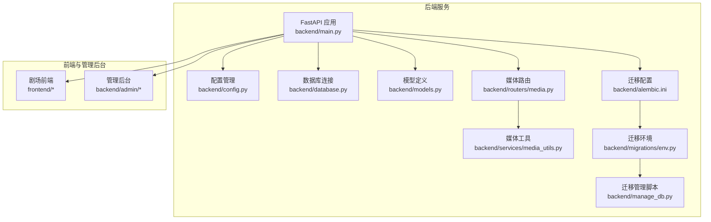
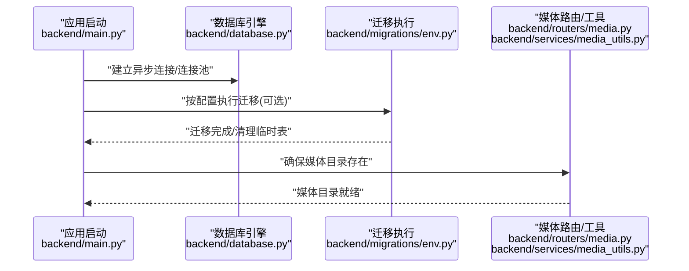
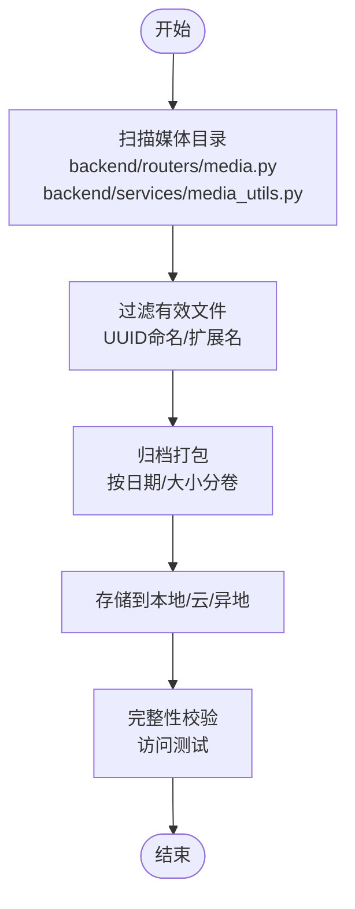
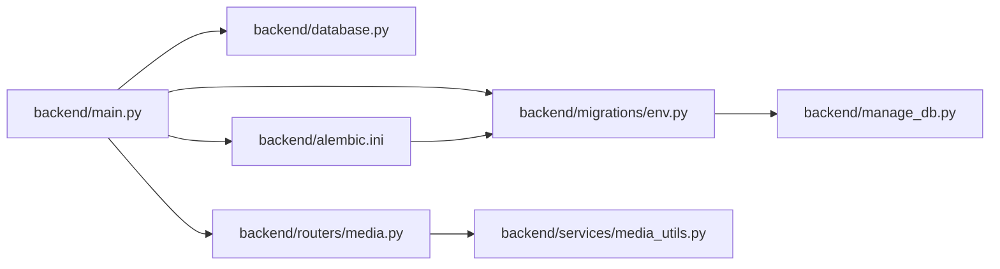

# 备份和恢复

<cite>
**本文引用的文件**   
- [backend/main.py](file://backend/main.py)
- [backend/config.py](file://backend/config.py)
- [backend/database.py](file://backend/database.py)
- [backend/alembic.ini](file://backend/alembic.ini)
- [backend/migrations/env.py](file://backend/migrations/env.py)
- [backend/manage_db.py](file://backend/manage_db.py)
- [backend/models.py](file://backend/models.py)
- [backend/routers/media.py](file://backend/routers/media.py)
- [backend/services/media_utils.py](file://backend/services/media_utils.py)
- [README.md](file://README.md)
- [dev.py](file://dev.py)
- [backend/requirements.txt](file://backend/requirements.txt)
</cite>

## 目录
1. [简介](#简介)
2. [项目结构](#项目结构)
3. [核心组件](#核心组件)
4. [架构总览](#架构总览)
5. [详细组件分析](#详细组件分析)
6. [依赖分析](#依赖分析)
7. [性能考虑](#性能考虑)
8. [故障排查指南](#故障排查指南)
9. [结论](#结论)
10. [附录](#附录)

## 简介
本指南面向“数据备份与系统恢复”的完整实践，结合代码库现状，给出数据库备份策略（全量/增量/定期）、文件系统备份（媒体与配置）、备份存储策略（本地/云/异地）、备份验证流程（完整性与恢复测试）、灾难恢复计划（故障场景、优先级与RTO）、自动化备份脚本（定时任务与监控告警）以及恢复操作步骤（数据恢复与系统重建）。  
本项目采用 SQLite（开发）/PostgreSQL（生产）作为数据库，媒体文件存储于后端 media 目录；数据库迁移使用 Alembic。上述特性决定了备份与恢复的侧重点与实现方式。

## 项目结构
后端服务以 FastAPI 为核心，数据库连接通过 SQLAlchemy 异步引擎管理，媒体文件上传与访问通过路由与工具函数实现，数据库迁移通过 Alembic 管理。前端与管理后台分别提供用户交互与系统管理界面。

**图表来源**
- [backend/main.py:110-174](file://backend/main.py#L110-L174)
- [backend/config.py:1-43](file://backend/config.py#L1-L43)
- [backend/database.py:1-31](file://backend/database.py#L1-L31)
- [backend/models.py:1-447](file://backend/models.py#L1-L447)
- [backend/routers/media.py:1-244](file://backend/routers/media.py#L1-L244)
- [backend/services/media_utils.py:1-79](file://backend/services/media_utils.py#L1-L79)
- [backend/alembic.ini:1-115](file://backend/alembic.ini#L1-L115)
- [backend/migrations/env.py:1-120](file://backend/migrations/env.py#L1-L120)
- [backend/manage_db.py:1-80](file://backend/manage_db.py#L1-L80)

**章节来源**
- [backend/main.py:110-174](file://backend/main.py#L110-L174)
- [README.md:70-127](file://README.md#L70-L127)

## 核心组件
- 数据库与迁移
  - 数据库连接：异步引擎、连接池、自动重连参数，支持 SQLite 与 PostgreSQL。
  - 迁移：Alembic 配置与环境脚本，支持离线/在线迁移，启动时可自动执行迁移。
- 媒体文件系统
  - 上传接口：校验扩展名、生成 UUID 文件名、保存至 media 目录。
  - 访问接口：安全提供媒体文件，支持无扩展名回退查找。
  - 工具函数：保存内联图片、从 URL 下载图片/视频并落盘。
- 配置与运行
  - 配置项：数据库 URL、Redis、AI 密钥、JWT、运行迁移开关等。
  - 启动流程：数据库连接重试、迁移执行、媒体目录初始化、CORS 与中间件配置。
- 开发与运维
  - 迁移管理脚本：封装 alembic 命令，支持 migrate/upgrade/downgrade/seed。
  - 开发脚本：统一安装依赖与并行启动后端/前端/管理后台。

**章节来源**
- [backend/database.py:1-31](file://backend/database.py#L1-L31)
- [backend/alembic.ini:1-115](file://backend/alembic.ini#L1-L115)
- [backend/migrations/env.py:1-120](file://backend/migrations/env.py#L1-L120)
- [backend/manage_db.py:1-80](file://backend/manage_db.py#L1-L80)
- [backend/routers/media.py:1-244](file://backend/routers/media.py#L1-L244)
- [backend/services/media_utils.py:1-79](file://backend/services/media_utils.py#L1-L79)
- [backend/config.py:1-43](file://backend/config.py#L1-L43)
- [backend/main.py:49-108](file://backend/main.py#L49-L108)
- [dev.py:1-169](file://dev.py#L1-L169)

## 架构总览
下图展示了备份与恢复相关的数据流：应用启动时初始化数据库与媒体目录；媒体上传与访问通过路由与工具函数落地到文件系统；数据库迁移在启动阶段执行，确保模式一致性。

**图表来源**
- [backend/main.py:49-108](file://backend/main.py#L49-L108)
- [backend/database.py:1-31](file://backend/database.py#L1-L31)
- [backend/migrations/env.py:67-87](file://backend/migrations/env.py#L67-L87)
- [backend/routers/media.py:26](file://backend/routers/media.py#L26)

**章节来源**
- [backend/main.py:49-108](file://backend/main.py#L49-L108)
- [backend/migrations/env.py:67-87](file://backend/migrations/env.py#L67-L87)

## 详细组件分析

### 数据库备份策略
- 全量备份
  - SQLite：直接复制数据库文件（DB_PATH）即可完成全量备份；适合开发环境或小规模部署。
  - PostgreSQL：使用 pg_dump 进行逻辑备份，或使用物理备份（如文件系统快照）。
- 增量备份
  - SQLite：无原生增量备份机制，可通过 WAL 模式配合归档策略实现近似增量；更常见做法是周期性全量 + 归档 WAL。
  - PostgreSQL：使用 pg_start_backup/pg_stop_backup 进行物理增量，或使用逻辑复制/时间点恢复（PITR）。
- 定期备份
  - 建议每日全量 + 每小时增量（或 WAL 归档），并保留最近 N 天的备份集。
  - 备份完成后进行校验（校验文件完整性与可恢复性）。
- 备份存储
  - 本地：磁盘阵列/RAID；注意防磁盘坏道与断电保护。
  - 云存储：对象存储（如 S3、OSS）；开启版本控制与跨区域复制。
  - 异地：至少异地机房一份副本，满足 RPO/RTO 要求。
- 备份验证
  - 定期抽样恢复测试（Restore Test），验证备份可还原到可用状态。
  - 对比校验：校验备份文件哈希值或数据库快照一致性。
- 恢复优先级与 RTO
  - 业务影响评估：数据库 > 媒体文件 > 配置文件。
  - RTO：根据 SLA 设定，如 15 分钟（数据库）/1 小时（媒体）。
- 自动化与监控
  - 使用 cron/Windows 任务计划程序执行备份脚本。
  - 失败告警：邮件/IM/Webhook；成功与失败均记录日志。

**章节来源**
- [backend/config.py:5](file://backend/config.py#L5)
- [backend/database.py:8-17](file://backend/database.py#L8-L17)
- [backend/alembic.ini:1-115](file://backend/alembic.ini#L1-L115)
- [backend/migrations/env.py:39-41](file://backend/migrations/env.py#L39-L41)

### 文件系统备份（媒体与配置）
- 媒体文件
  - 存储位置：后端 media 目录（绝对路径），上传时生成 UUID 文件名并保存。
  - 访问接口：支持无扩展名回退查找，保障兼容性。
  - 备份范围：包含所有 /api/media/* 文件，建议按日期/大小切分归档。
- 配置文件
  - .env：包含数据库 URL、AI 密钥、JWT 等敏感信息，需加密存储与最小权限访问。
  - alembic.ini：迁移配置，建议纳入版本控制但不包含敏感信息。
- 备份策略
  - 增量：基于文件变更时间与大小，定期扫描差异。
  - 校验：校验媒体文件完整性与可访问性。
  - 异地：与数据库备份同策略，满足 RPO/RTO。

**图表来源**
- [backend/routers/media.py:26](file://backend/routers/media.py#L26)
- [backend/services/media_utils.py:8](file://backend/services/media_utils.py#L8)

**章节来源**
- [backend/routers/media.py:26-106](file://backend/routers/media.py#L26-L106)
- [backend/services/media_utils.py:20-79](file://backend/services/media_utils.py#L20-L79)

### 备份存储策略（本地/云/异地）
- 本地
  - RAID/NAS/SAN；定期校验与更换介质。
- 云
  - 对象存储桶；启用版本控制、生命周期策略与跨区域复制。
- 异地
  - 与主站点物理隔离，自动同步与手动演练切换。
- 加密与权限
  - 传输与静态加密；最小权限访问；审计日志。

[本节为通用策略说明，不直接分析具体文件，故无“章节来源”]

### 备份验证流程（完整性与恢复测试）
- 完整性检查
  - 文件哈希/校验和；数据库页校验（SQLite/PG）。
- 恢复测试
  - 在隔离环境执行恢复，验证应用启动与核心接口可用。
  - 媒体文件访问测试：随机选取文件下载与预览。
- 抽样策略
  - 每周抽样 1%-5% 的备份集进行恢复测试，覆盖不同时间段。

[本节为通用流程说明，不直接分析具体文件，故无“章节来源”]

### 灾难恢复计划（故障场景、优先级与RTO）
- 场景分类
  - 数据库损坏：PG/SQLite 文件损坏或迁移失败。
  - 媒体丢失：误删/磁盘故障导致媒体不可用。
  - 配置泄露/丢失：.env 丢失或密钥泄露。
- 恢复优先级
  - 一级：数据库（RTO 最短）> 二级：媒体文件 > 三级：配置文件。
- RTO/RPO
  - 明确目标并定期演练；记录恢复时间与数据损失。
- 人员与流程
  - 指定 DR 负责人；标准化操作手册；演练记录与复盘。

[本节为通用方案说明，不直接分析具体文件，故无“章节来源”]

### 自动化备份脚本（定时任务与监控告警）
- 脚本建议
  - 数据库：pg_dump/SQLite 文件复制；压缩与分卷。
  - 媒体：rsync/robocopy + 差异扫描；校验与日志。
  - 配置：.env 与 alembic.ini 备份，加密存储。
- 定时任务
  - cron/Windows 任务计划程序：按策略执行备份。
- 监控告警
  - 失败通知（邮件/IM/Webhook）；成功与失败日志归档。

[本节为通用实践说明，不直接分析具体文件，故无“章节来源”]

### 恢复操作指南（数据恢复与系统重建）
- 数据库恢复
  - SQLite：停止服务，替换数据库文件，启动服务。
  - PostgreSQL：停止服务，恢复数据目录或导入逻辑备份，启动服务。
- 媒体恢复
  - 停止服务，恢复 media 目录，修正权限与软链接。
- 配置恢复
  - 恢复 .env 与 alembic.ini，重新执行迁移（如必要）。
- 系统重建
  - 重新安装依赖（后端/前端/管理后台），启动服务，验证接口与媒体访问。
- 验证清单
  - 登录管理后台；上传/下载媒体文件；数据库查询与计费记录核对。

**章节来源**
- [backend/main.py:49-108](file://backend/main.py#L49-L108)
- [backend/manage_db.py:30-38](file://backend/manage_db.py#L30-L38)
- [dev.py:94-169](file://dev.py#L94-L169)

## 依赖分析
- 应用启动依赖
  - 数据库引擎与连接池参数决定连接稳定性与性能。
  - Alembic 环境脚本负责迁移执行与临时表清理。
  - 媒体路由与工具函数依赖 media 目录存在性与权限。
- 运维依赖
  - 迁移管理脚本封装 alembic 命令，便于 CI/CD 与运维自动化。
  - 开发脚本统一安装与并行启动，便于本地快速搭建。

**图表来源**
- [backend/main.py:38-44](file://backend/main.py#L38-L44)
- [backend/database.py:1-31](file://backend/database.py#L1-L31)
- [backend/migrations/env.py:12-32](file://backend/migrations/env.py#L12-L32)
- [backend/routers/media.py:1-244](file://backend/routers/media.py#L1-L244)
- [backend/services/media_utils.py:1-79](file://backend/services/media_utils.py#L1-L79)
- [backend/alembic.ini:1-115](file://backend/alembic.ini#L1-L115)
- [backend/manage_db.py:1-80](file://backend/manage_db.py#L1-L80)

**章节来源**
- [backend/main.py:38-44](file://backend/main.py#L38-L44)
- [backend/migrations/env.py:12-32](file://backend/migrations/env.py#L12-L32)

## 性能考虑
- 数据库性能
  - 连接池大小与溢出连接数需结合并发与硬件资源调整。
  - SQLite 适用于小规模或开发环境；生产建议 PostgreSQL。
- 媒体性能
  - 上传/下载限速与并发控制；CDN 加速与缓存头设置。
- 备份性能
  - 分卷压缩与并行传输；选择低峰时段执行备份。

[本节提供一般性指导，不直接分析具体文件，故无“章节来源”]

## 故障排查指南
- 启动阶段迁移失败
  - 清理 Alembic 临时表后重试；确认 DATABASE_URL 正确。
- 媒体文件无法访问
  - 检查 media 目录权限与路径；确认 UUID 文件存在且扩展名正确。
- 数据库连接异常
  - 检查连接池参数与网络；确认 SQLite 文件未被占用。

**章节来源**
- [backend/main.py:68-96](file://backend/main.py#L68-L96)
- [backend/routers/media.py:54-81](file://backend/routers/media.py#L54-L81)
- [backend/database.py:8-17](file://backend/database.py#L8-L17)

## 结论
本指南基于代码库现状，给出了数据库与文件系统的备份与恢复实践建议。由于项目默认使用 SQLite，建议在生产环境切换至 PostgreSQL，并配套完善的备份策略（全量/增量/定期）、异地存储与恢复演练，以满足业务连续性与合规要求。

[本节为总结性内容，不直接分析具体文件，故无“章节来源”]

## 附录
- 快速参考
  - 数据库路径：DB_PATH（SQLite 文件路径）。
  - 媒体目录：backend/media。
  - 迁移命令：manage_db.py 封装 alembic 命令。
  - 开发启动：dev.py 并行启动后端/前端/管理后台。

**章节来源**
- [backend/config.py:5](file://backend/config.py#L5)
- [backend/routers/media.py:26](file://backend/routers/media.py#L26)
- [backend/manage_db.py:20-38](file://backend/manage_db.py#L20-L38)
- [dev.py:111-138](file://dev.py#L111-L138)