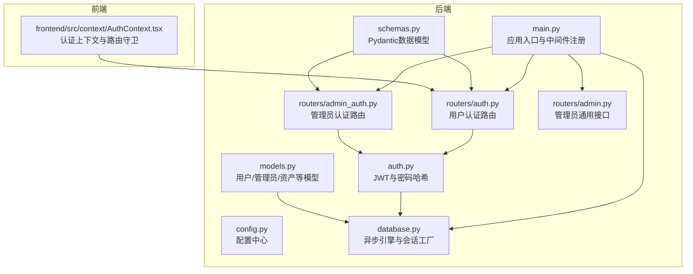
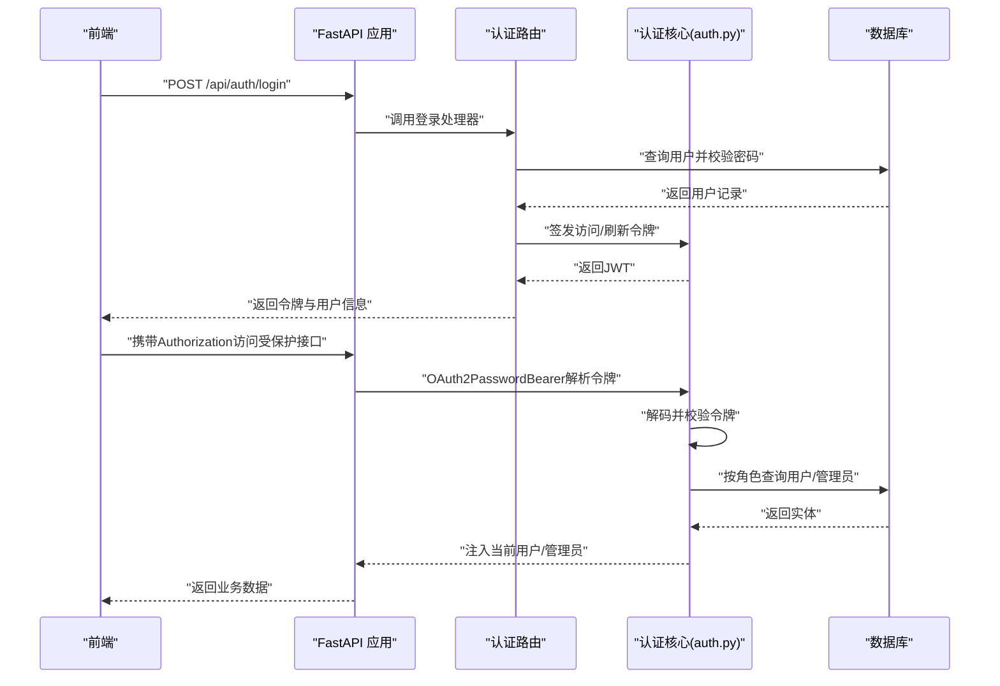
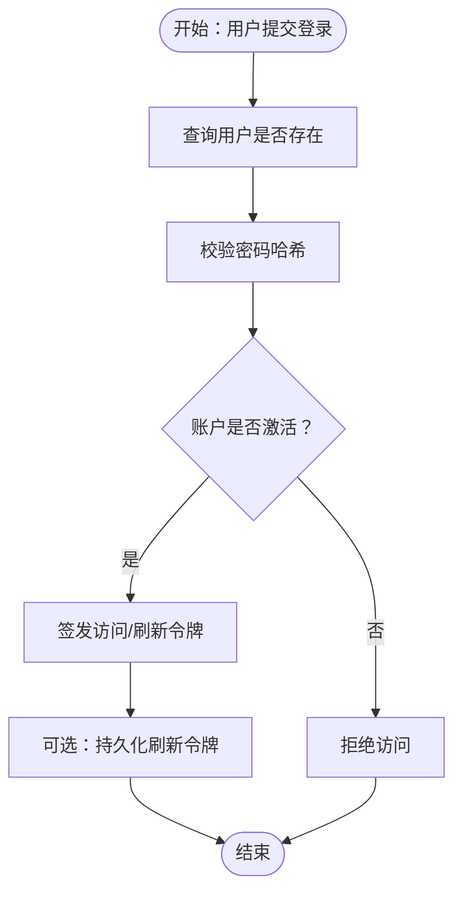
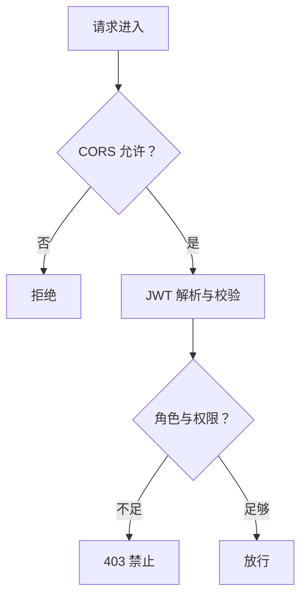
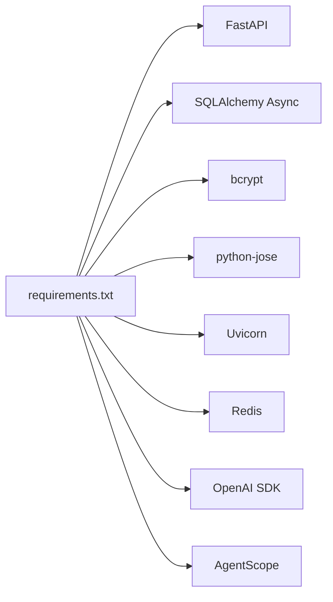

# 安全加固

<cite>
**本文引用的文件**
- [backend/main.py](file://backend/main.py)
- [backend/config.py](file://backend/config.py)
- [backend/auth.py](file://backend/auth.py)
- [backend/routers/auth.py](file://backend/routers/auth.py)
- [backend/routers/admin_auth.py](file://backend/routers/admin_auth.py)
- [backend/models.py](file://backend/models.py)
- [backend/schemas.py](file://backend/schemas.py)
- [backend/database.py](file://backend/database.py)
- [backend/requirements.txt](file://backend/requirements.txt)
- [backend/routers/admin.py](file://backend/routers/admin.py)
- [frontend/src/context/AuthContext.tsx](file://frontend/src/context/AuthContext.tsx)
</cite>

## 目录
1. [简介](#简介)
2. [项目结构](#项目结构)
3. [核心组件](#核心组件)
4. [架构总览](#架构总览)
5. [详细组件分析](#详细组件分析)
6. [依赖分析](#依赖分析)
7. [性能考虑](#性能考虑)
8. [故障排查指南](#故障排查指南)
9. [结论](#结论)
10. [附录](#附录)

## 简介
本指南面向“无限叙事剧院”项目的系统安全加固，围绕身份认证安全、访问控制安全、数据安全、网络安全、代码安全、日志安全以及安全扫描工具进行系统化梳理与改进建议。文档以仓库现有实现为基础，指出当前安全实践中的薄弱环节，并提供可操作的加固方案与最佳实践。

## 项目结构
后端采用 FastAPI + SQLAlchemy Async 架构，包含认证路由、管理员认证路由、数据库模型与会话管理、CORS 中间件等；前端使用 Next.js，提供基础的认证上下文与路由守卫。整体结构清晰，便于在现有基础上补充安全中间件与策略。

**图表来源**
- [backend/main.py:110-152](file://backend/main.py#L110-L152)
- [backend/routers/auth.py:30-33](file://backend/routers/auth.py#L30-L33)
- [backend/routers/admin_auth.py:29-33](file://backend/routers/admin_auth.py#L29-L33)
- [backend/routers/admin.py:19-23](file://backend/routers/admin.py#L19-L23)
- [backend/database.py:6-31](file://backend/database.py#L6-L31)
- [backend/auth.py:1-25](file://backend/auth.py#L1-L25)
- [frontend/src/context/AuthContext.tsx:1-57](file://frontend/src/context/AuthContext.tsx#L1-L57)

**章节来源**
- [backend/main.py:110-152](file://backend/main.py#L110-L152)
- [backend/database.py:6-31](file://backend/database.py#L6-L31)
- [frontend/src/context/AuthContext.tsx:1-57](file://frontend/src/context/AuthContext.tsx#L1-L57)

## 核心组件
- 配置中心：集中管理数据库连接、Redis、AI 密钥、JWT 参数、运行选项等。
- 认证模块：bcrypt 密码哈希、JWT 签发与校验、用户/管理员依赖注入与权限校验。
- 路由层：用户认证路由与管理员认证路由，提供登录、注册、刷新、个人信息等接口。
- 数据模型：用户、管理员、聊天会话、资产、订阅计划等，支撑权限与审计。
- 数据库层：异步引擎与连接池配置，支持 SQLite/PostgreSQL。
- 前端认证上下文：登录态维护、路由守卫、公开路由白名单。

**章节来源**
- [backend/config.py:7-42](file://backend/config.py#L7-L42)
- [backend/auth.py:19-75](file://backend/auth.py#L19-L75)
- [backend/routers/auth.py:36-99](file://backend/routers/auth.py#L36-L99)
- [backend/routers/admin_auth.py:36-90](file://backend/routers/admin_auth.py#L36-L90)
- [backend/models.py:10-73](file://backend/models.py#L10-L73)
- [backend/database.py:6-31](file://backend/database.py#L6-L31)
- [frontend/src/context/AuthContext.tsx:31-57](file://frontend/src/context/AuthContext.tsx#L31-L57)

## 架构总览
下图展示了认证与访问控制的关键交互流程，包括 CORS、JWT、依赖注入与权限校验。

**图表来源**
- [backend/routers/auth.py:63-99](file://backend/routers/auth.py#L63-L99)
- [backend/auth.py:83-113](file://backend/auth.py#L83-L113)
- [backend/database.py:28-31](file://backend/database.py#L28-L31)

**章节来源**
- [backend/routers/auth.py:63-99](file://backend/routers/auth.py#L63-L99)
- [backend/auth.py:83-113](file://backend/auth.py#L83-L113)
- [backend/database.py:28-31](file://backend/database.py#L28-L31)

## 详细组件分析

### 身份认证安全
- JWT 令牌安全配置
  - 现状：使用 HS256 算法，密钥与过期时间在配置中定义，支持访问令牌与刷新令牌。
  - 风险与建议：
    - 生产环境应使用强随机密钥，避免硬编码；建议通过环境变量注入并定期轮换。
    - 建议引入刷新令牌存储与黑名单机制，防止泄露后的长期复用。
    - 建议在令牌中加入 jti、iat 等声明，便于审计与撤销。
- 密码哈希策略
  - 现状：bcrypt，成本因子为 12，符合安全要求。
  - 建议：在注册与修改密码时强制复杂度策略（长度、字符集），并记录失败尝试次数。
- 会话管理
  - 现状：JWT 无服务端会话存储；刷新令牌用于续期。
  - 建议：引入刷新令牌的服务器端持久化与绑定（IP/UA 绑定），结合滑动过期与固定过期策略。

**图表来源**
- [backend/routers/auth.py:63-99](file://backend/routers/auth.py#L63-L99)
- [backend/auth.py:19-25](file://backend/auth.py#L19-L25)
- [backend/config.py:26-30](file://backend/config.py#L26-L30)

**章节来源**
- [backend/routers/auth.py:63-99](file://backend/routers/auth.py#L63-L99)
- [backend/auth.py:19-25](file://backend/auth.py#L19-L25)
- [backend/config.py:26-30](file://backend/config.py#L26-L30)

### 访问控制安全
- CORS 配置
  - 现状：允许特定本地开发源，允许凭据、通配方法与头。
  - 风险与建议：生产环境应明确允许的源列表，避免通配符；限制允许的方法与头，最小授权原则。
- CSRF 防护
  - 现状：未发现显式的 CSRF 中间件或令牌校验。
  - 建议：对状态变更的非幂等请求（POST/PUT/DELETE）启用 CSRF 令牌校验；同源策略与 SameSite Cookie 配合。
- 权限验证
  - 现状：用户与管理员分别有独立依赖注入与权限校验，支持通用依赖注入。
  - 建议：引入细粒度 RBAC 权限矩阵，结合装饰器或中间件进行资源级权限校验。

**图表来源**
- [backend/main.py:130-136](file://backend/main.py#L130-L136)
- [backend/auth.py:119-156](file://backend/auth.py#L119-L156)

**章节来源**
- [backend/main.py:130-136](file://backend/main.py#L130-L136)
- [backend/auth.py:119-156](file://backend/auth.py#L119-L156)

### 数据安全
- 敏感数据加密
  - 现状：密码使用 bcrypt 存储；LLM 提供商 API Key 明文存储。
  - 建议：对敏感字段（如 API Key）进行透明数据加密（TDE）或密钥管理系统集成；传输中使用 TLS。
- 传输加密
  - 现状：未见强制 HTTPS 与 HSTS 配置。
  - 建议：生产环境强制 HTTPS，启用 HSTS、OCSP Stapling、TLS 最低版本与安全套件。
- 数据脱敏
  - 建议：在日志与错误响应中避免输出敏感字段；对审计日志进行脱敏与分级。

**章节来源**
- [backend/models.py:153-154](file://backend/models.py#L153-L154)
- [backend/config.py:22-24](file://backend/config.py#L22-L24)

### 网络安全配置
- 防火墙规则
  - 建议：仅开放必要端口（如 8000），限制来源 IP；对管理端口（如后台）进一步收紧。
- WAF 配置
  - 建议：部署 WAF（如 ModSecurity、Cloudflare/WAF），启用 OWASP 核心规则集，针对路径与参数进行过滤。
- DDoS 防护
  - 建议：接入 CDN 与 DDoS 清洗服务，设置速率限制与 IP 黑名单。

[本节为通用指导，无需具体文件引用]

### 代码安全
- 输入验证
  - 现状：Pydantic 模型提供基础校验。
  - 建议：增加长度、范围、格式、枚举值校验；对路径参数与查询参数进行严格白名单校验。
- SQL 注入防护
  - 现状：使用 ORM 查询，降低风险。
  - 建议：避免动态拼接 SQL；对任何动态 SQL 进行严格的白名单与参数化。
- XSS 防护
  - 现状：前端使用 DOM 操作与富文本组件。
  - 建议：对用户输入进行内容安全策略（CSP）、HTML 转义与 Sanitizer；后端响应也需注意输出编码。

**章节来源**
- [backend/schemas.py:13-26](file://backend/schemas.py#L13-L26)
- [backend/services/base_tools.py:25-33](file://backend/services/base_tools.py#L25-L33)

### 日志安全
- 审计日志
  - 建议：记录登录/登出、权限变更、敏感操作（充值、封禁）等事件；统一字段与格式，避免敏感信息泄露。
- 访问日志
  - 建议：开启 Web 服务器访问日志，记录客户端 IP、User-Agent、状态码、耗时；对异常状态码单独告警。
- 异常日志
  - 建议：捕获异常时记录上下文信息但不泄露堆栈细节；对重复异常进行去重与阈值告警。

**章节来源**
- [backend/main.py:15-30](file://backend/main.py#L15-L30)
- [backend/routers/auth.py:43-78](file://backend/routers/auth.py#L43-L78)
- [backend/routers/admin_auth.py:43-78](file://backend/routers/admin_auth.py#L43-L78)

### 安全扫描工具
- 漏洞扫描
  - 依赖扫描：pip-audit、pipenv、poetry lock 校验。
  - 代码扫描：Bandit（Python）、ESLint（前端）、SonarQube。
- 渗透测试
  - 建议：使用 Burp Suite、OWASP ZAP 对登录、鉴权、管理端口进行自动化与手工测试。
- 安全评估
  - 建议：定期进行 SAST/DAST、配置审计与第三方安全评估。

**章节来源**
- [backend/requirements.txt:1-28](file://backend/requirements.txt#L1-L28)

## 依赖分析
后端依赖以 FastAPI、SQLAlchemy Async、bcrypt、python-jose 为核心，前端依赖 Next.js 与 UI 组件库。当前未发现循环依赖，耦合度适中，便于后续引入安全中间件与策略。

**图表来源**
- [backend/requirements.txt:1-28](file://backend/requirements.txt#L1-L28)

**章节来源**
- [backend/requirements.txt:1-28](file://backend/requirements.txt#L1-L28)

## 性能考虑
- 连接池与超时
  - 建议：合理设置连接池大小与超时，避免高并发下的连接争用；对数据库与外部服务调用设置超时与重试。
- 缓存与限流
  - 建议：对热点接口使用缓存；对登录与刷新接口实施速率限制，防爆破。
- 传输优化
  - 建议：启用压缩（Gzip/Brotli）、CDN 加速与静态资源缓存。

[本节为通用指导，无需具体文件引用]

## 故障排查指南
- 登录失败
  - 检查用户是否存在、密码是否正确、账户是否激活；查看认证路由的日志。
- 令牌无效或过期
  - 检查 JWT 密钥一致性、算法配置、过期时间；确认刷新令牌有效且未被撤销。
- CORS 失败
  - 检查允许的源、方法与头是否匹配；确认浏览器预检请求已正确处理。
- 数据库连接异常
  - 检查连接字符串、驱动、连接池参数；关注迁移失败与残留临时表。

**章节来源**
- [backend/routers/auth.py:78-83](file://backend/routers/auth.py#L78-L83)
- [backend/auth.py:65-74](file://backend/auth.py#L65-L74)
- [backend/main.py:130-136](file://backend/main.py#L130-L136)
- [backend/database.py:8-17](file://backend/database.py#L8-L17)

## 结论
本项目在认证与权限方面具备良好基础，建议优先补齐生产环境的密钥管理、CORS 限制、CSRF 防护与审计日志；同时完善传输加密、输入验证与代码扫描体系，形成闭环的安全保障。

## 附录
- 建议的配置清单
  - JWT：强随机密钥、HS256/ES256 二选一、刷新令牌持久化与撤销
  - CORS：明确允许源、方法与头，关闭通配符
  - CSRF：启用令牌校验与 SameSite Cookie
  - 传输加密：强制 HTTPS、HSTS、TLS 最低版本
  - 审计：登录/权限变更/敏感操作审计，日志脱敏与分级
  - 扫描：依赖与代码扫描、渗透测试、安全评估

[本节为通用指导，无需具体文件引用]