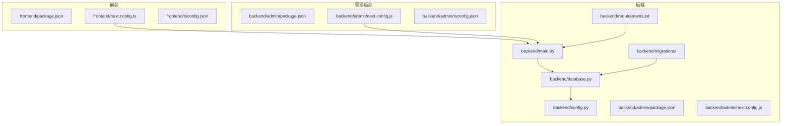
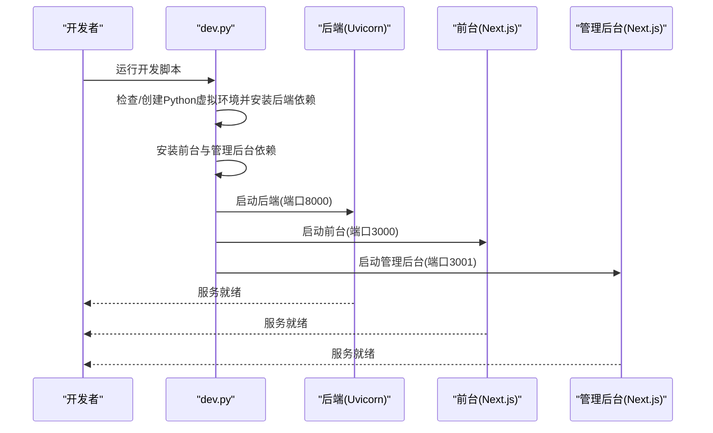
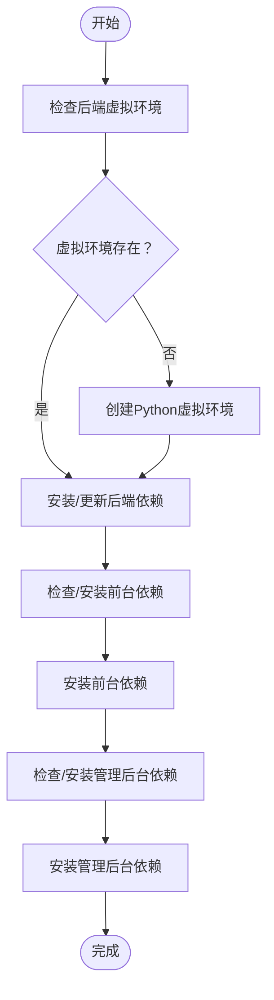
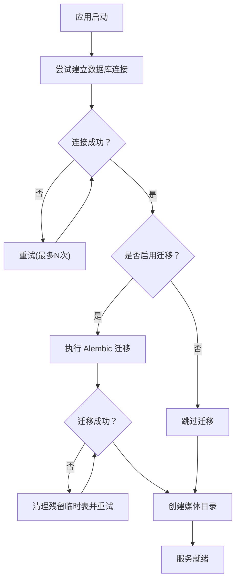
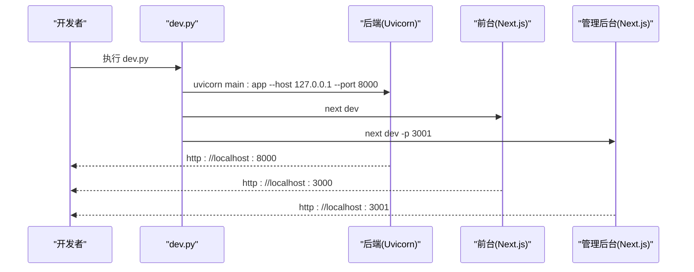
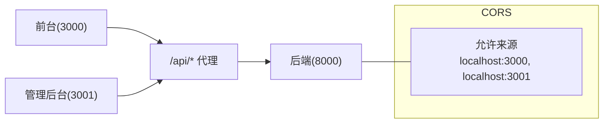
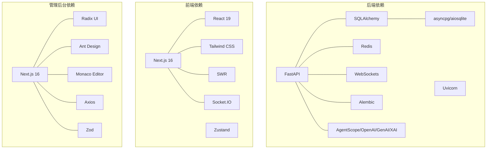

# 开发环境搭建

<cite>
**本文引用的文件**
- [README.md](file://README.md)
- [dev.py](file://dev.py)
- [backend/main.py](file://backend/main.py)
- [backend/config.py](file://backend/config.py)
- [backend/database.py](file://backend/database.py)
- [backend/manage_db.py](file://backend/manage_db.py)
- [backend/requirements.txt](file://backend/requirements.txt)
- [backend/admin/package.json](file://backend/admin/package.json)
- [backend/admin/next.config.js](file://backend/admin/next.config.js)
- [backend/admin/tsconfig.json](file://backend/admin/tsconfig.json)
- [frontend/package.json](file://frontend/package.json)
- [frontend/next.config.ts](file://frontend/next.config.ts)
- [frontend/tsconfig.json](file://frontend/tsconfig.json)
- [backend/alembic.ini](file://backend/alembic.ini)
</cite>

## 目录
1. [简介](#简介)
2. [项目结构](#项目结构)
3. [核心组件](#核心组件)
4. [架构总览](#架构总览)
5. [详细组件分析](#详细组件分析)
6. [依赖关系分析](#依赖关系分析)
7. [性能考虑](#性能考虑)
8. [故障排查指南](#故障排查指南)
9. [结论](#结论)
10. [附录](#附录)

## 简介
本指南面向首次参与 Infinite Game 项目的开发者，提供从零到一键启动的完整开发环境搭建流程。项目采用“后端 FastAPI + 前端 Next.js + 管理后台 Next.js”的多服务架构，支持单服务独立启动与多服务并行启动两种模式。后端默认使用 SQLite 作为开发数据库，也可按需配置 PostgreSQL；前端与管理后台均通过 Next.js 提供开发服务器与热重载。

## 项目结构
项目包含三个主要部分：
- 后端服务（FastAPI）：位于 backend/，包含主应用入口、配置、数据库、路由与业务服务。
- 剧场前端（Next.js）：位于 frontend/，提供用户交互界面与实时通信。
- 管理后台（Next.js）：位于 backend/admin/，提供管理员功能与数据管理界面。

**图表来源**
- [backend/main.py:110-174](file://backend/main.py#L110-L174)
- [backend/config.py:7-43](file://backend/config.py#L7-L43)
- [backend/database.py:1-31](file://backend/database.py#L1-L31)
- [backend/requirements.txt:1-28](file://backend/requirements.txt#L1-L28)
- [frontend/next.config.ts:1-20](file://frontend/next.config.ts#L1-L20)
- [backend/admin/next.config.js:1-15](file://backend/admin/next.config.js#L1-L15)

**章节来源**
- [README.md:70-127](file://README.md#L70-L127)

## 核心组件
- 后端应用入口与生命周期：负责初始化日志、CORS、数据库连接与迁移、静态资源挂载、路由注册与 WebSocket 接入。
- 配置管理：集中管理数据库、Redis、AI 服务密钥、JWT、生成参数与迁移开关。
- 数据库与迁移：异步 SQLAlchemy 引擎、连接池配置与 Alembic 迁移。
- 开发脚本：dev.py 提供一键安装与并行启动后端、前台与管理后台服务的能力。

**章节来源**
- [backend/main.py:15-174](file://backend/main.py#L15-L174)
- [backend/config.py:7-43](file://backend/config.py#L7-L43)
- [backend/database.py:1-31](file://backend/database.py#L1-L31)
- [backend/alembic.ini:1-115](file://backend/alembic.ini#L1-L115)

## 架构总览
开发环境的启动流程支持两种模式：
- 单服务启动：分别进入 backend、frontend、backend/admin 目录，使用各自包管理器启动。
- 多服务并行启动：通过 dev.py 统一安装依赖并并行启动三个服务，自动处理端口与热重载。

**图表来源**
- [dev.py:94-169](file://dev.py#L94-L169)
- [backend/main.py:172-174](file://backend/main.py#L172-L174)
- [frontend/package.json:5-12](file://frontend/package.json#L5-L12)
- [backend/admin/package.json:5-10](file://backend/admin/package.json#L5-L10)

## 详细组件分析

### 环境要求与兼容性
- Python 版本：后端使用 Python 3.10+（开发文档明确要求），Windows 上对事件循环与 UTF-8 输出做了兼容处理。
- Node.js 版本：前后端均使用 Next.js 16，开发文档要求 Node.js 18+。
- 操作系统：Windows、Linux、macOS 均可运行，Windows 需注意事件循环与终端编码问题。

**章节来源**
- [README.md:131-135](file://README.md#L131-L135)
- [backend/main.py:6-13](file://backend/main.py#L6-L13)

### 虚拟环境与依赖安装
- Python 虚拟环境：dev.py 会在 backend/ 下创建 venv，并使用其中的 pip 安装 requirements.txt。
- 前端依赖：frontend/ 与 backend/admin/ 均通过 npm install 安装依赖。
- 后端依赖：requirements.txt 指定 FastAPI、Uvicorn、SQLAlchemy、AI SDK、Redis、WebSocket、Alembic 等。

**图表来源**
- [dev.py:25-62](file://dev.py#L25-L62)
- [backend/requirements.txt:1-28](file://backend/requirements.txt#L1-L28)
- [frontend/package.json:13-68](file://frontend/package.json#L13-L68)
- [backend/admin/package.json:11-50](file://backend/admin/package.json#L11-L50)

**章节来源**
- [dev.py:25-62](file://dev.py#L25-L62)
- [backend/requirements.txt:1-28](file://backend/requirements.txt#L1-L28)

### 数据库与迁移
- 默认数据库：SQLite（开发友好），可通过配置切换为 PostgreSQL。
- 连接池：异步引擎配置了连接池与 pre_ping，提升稳定性。
- 迁移：支持在应用启动时自动执行 Alembic 迁移，失败时尝试清理临时表后重试。

**图表来源**
- [backend/main.py:49-108](file://backend/main.py#L49-L108)
- [backend/database.py:8-23](file://backend/database.py#L8-L23)
- [backend/config.py:14-16](file://backend/config.py#L14-L16)
- [backend/alembic.ini:1-115](file://backend/alembic.ini#L1-L115)

**章节来源**
- [backend/main.py:49-108](file://backend/main.py#L49-L108)
- [backend/database.py:1-31](file://backend/database.py#L1-L31)
- [backend/config.py:14-16](file://backend/config.py#L14-L16)

### 开发服务器启动
- 单服务启动：
  - 后端：进入 backend/，激活虚拟环境后启动 main.py。
  - 前台：进入 frontend/，运行 npm run dev。
  - 管理后台：进入 backend/admin/，运行 npm run dev。
- 多服务并行启动：运行 dev.py，它会自动安装依赖并并行启动三个服务，支持 Ctrl+C 停止。

**图表来源**
- [dev.py:112-124](file://dev.py#L112-L124)
- [backend/main.py:172-174](file://backend/main.py#L172-L174)
- [frontend/package.json:5-12](file://frontend/package.json#L5-L12)
- [backend/admin/package.json:5-10](file://backend/admin/package.json#L5-L10)

**章节来源**
- [dev.py:94-169](file://dev.py#L94-L169)
- [backend/main.py:172-174](file://backend/main.py#L172-L174)

### 代理与端口配置
- 前台与管理后台均通过 Next.js 的 rewrites 将 /api/* 请求代理到后端 127.0.0.1:8000。
- CORS 已在后端配置允许前台与管理后台域名访问。

**图表来源**
- [frontend/next.config.ts:9-16](file://frontend/next.config.ts#L9-L16)
- [backend/admin/next.config.js:4-11](file://backend/admin/next.config.js#L4-L11)
- [backend/main.py:130-136](file://backend/main.py#L130-L136)

**章节来源**
- [frontend/next.config.ts:9-16](file://frontend/next.config.ts#L9-L16)
- [backend/admin/next.config.js:4-11](file://backend/admin/next.config.js#L4-L11)
- [backend/main.py:130-136](file://backend/main.py#L130-L136)

### 类型与构建配置
- TypeScript：前后端均使用 TS，目标版本为 ES2017，严格模式开启，路径别名 @/* 指向 src/*。
- Next.js：启用实验性配置（如 serverActions 体积限制），管理后台启用了 antd 的转译。

**章节来源**
- [frontend/tsconfig.json:1-35](file://frontend/tsconfig.json#L1-L35)
- [backend/admin/tsconfig.json:1-42](file://backend/admin/tsconfig.json#L1-L42)

## 依赖关系分析
- 后端依赖：FastAPI、Uvicorn、SQLAlchemy、Pydantic、asyncpg/aiosqlite、Redis、WebSocket、dotenv、AgentScope、OpenAI、Google GenAI、XAI SDK、HTTPX、Pillow、bcrypt、JWKS、Alembic、Requests、Packaging 等。
- 前端依赖：Next.js 16、React 19、Tailwind CSS、Ant Design、Socket.IO、Zustand、Recharts、TiTAP、PIXI.js、Jest、SWR 等。
- 管理后台依赖：Next.js 16、React 19、Radix UI、Ant Design、Monaco Editor、Axios、Zod、SWR、Recharts 等。

**图表来源**
- [backend/requirements.txt:1-28](file://backend/requirements.txt#L1-L28)
- [frontend/package.json:13-68](file://frontend/package.json#L13-L68)
- [backend/admin/package.json:11-50](file://backend/admin/package.json#L11-L50)

**章节来源**
- [backend/requirements.txt:1-28](file://backend/requirements.txt#L1-L28)
- [frontend/package.json:13-68](file://frontend/package.json#L13-L68)
- [backend/admin/package.json:11-50](file://backend/admin/package.json#L11-L50)

## 性能考虑
- 数据库连接池：异步引擎配置了连接池大小与溢出连接数，结合 pre_ping 提升稳定性。
- 迁移容错：启动时若迁移失败，自动清理残留临时表后重试，降低开发中断概率。
- 端口与代理：前后端通过本地代理避免跨域问题，减少额外网络开销。
- 热重载：dev.py 并行启动，便于快速迭代；注意排除特定目录以避免不必要的重启。

**章节来源**
- [backend/database.py:8-23](file://backend/database.py#L8-L23)
- [backend/main.py:49-108](file://backend/main.py#L49-L108)
- [dev.py:112-124](file://dev.py#L112-L124)

## 故障排查指南
- 依赖冲突
  - 后端：确保使用 dev.py 创建的 venv，避免全局 Python 影响；如遇安装失败，检查 requirements.txt 与网络代理。
  - 前端/管理后台：删除 node_modules 后重新 npm install；必要时清理 npm 缓存。
- 端口占用
  - 后端默认 8000，前台 3000，管理后台 3001；若被占用，可在对应 package.json 的 scripts 中修改端口。
- 权限问题
  - Windows 上若出现事件循环或编码异常，确认使用 dev.py 启动，其已在代码中处理 WindowsSelectorEventLoopPolicy 与 UTF-8 输出。
- 数据库迁移失败
  - 启动日志中若提示迁移失败，应用会尝试清理残留临时表后重试；仍失败时可手动执行数据库迁移管理脚本。

**章节来源**
- [dev.py:112-124](file://dev.py#L112-L124)
- [backend/main.py:6-13](file://backend/main.py#L6-L13)
- [backend/main.py:49-108](file://backend/main.py#L49-L108)

## 结论
通过 dev.py 的一键安装与并行启动，开发者可以快速完成 Python 虚拟环境、前后端依赖的安装，并同时启动后端 API、前台与管理后台。项目在 Windows/Linux/macOS 上均具备良好兼容性，数据库默认使用 SQLite，便于本地开发与调试。遇到常见问题时，可依据本指南的故障排查章节进行定位与解决。

## 附录
- 快速开始（单服务）
  - 后端：进入 backend/，创建并激活虚拟环境，安装 requirements.txt，运行 main.py。
  - 前台：进入 frontend/，安装依赖后运行 npm run dev。
  - 管理后台：进入 backend/admin/，安装依赖后运行 npm run dev。
- 数据库迁移
  - 使用 manage_db.py 的 upgrade 子命令应用迁移；或在 main.py 生命周期中自动执行（受配置控制）。

**章节来源**
- [README.md:139-194](file://README.md#L139-L194)
- [backend/manage_db.py:30-38](file://backend/manage_db.py#L30-L38)
- [backend/main.py:49-108](file://backend/main.py#L49-L108)