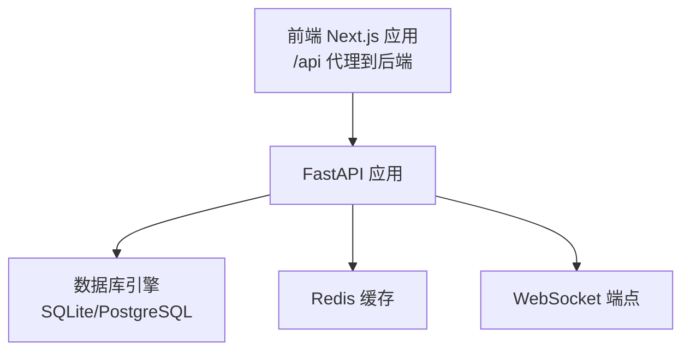
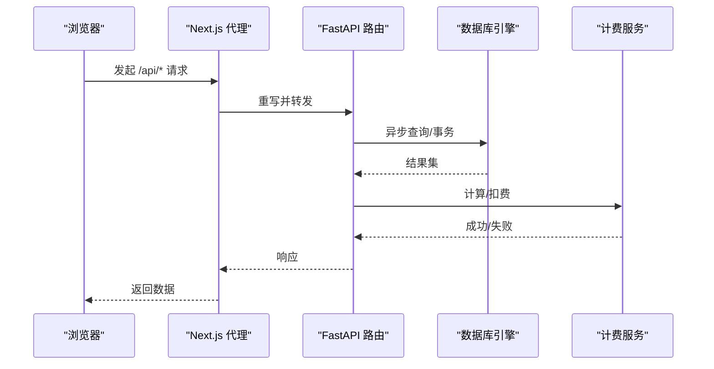
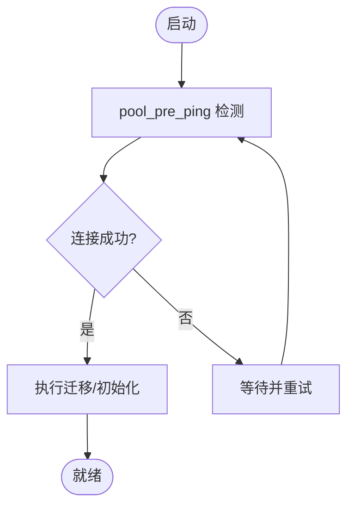
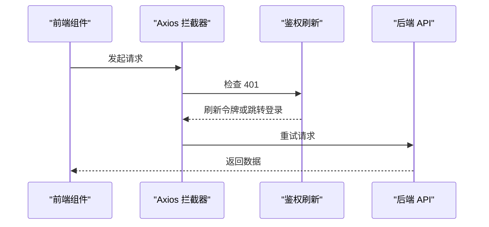
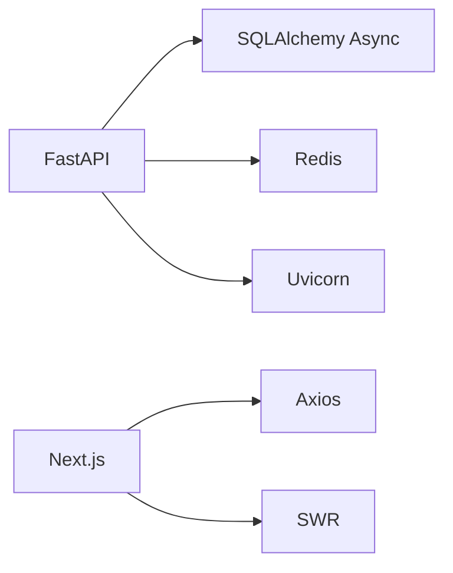

# 性能优化

<cite>
**本文引用的文件**
- [backend/main.py](file://backend/main.py)
- [backend/config.py](file://backend/config.py)
- [backend/database.py](file://backend/database.py)
- [backend/requirements.txt](file://backend/requirements.txt)
- [frontend/next.config.ts](file://frontend/next.config.ts)
- [frontend/package.json](file://frontend/package.json)
- [frontend/src/lib/api.ts](file://frontend/src/lib/api.ts)
- [backend/routers/admin.py](file://backend/routers/admin.py)
- [backend/models.py](file://backend/models.py)
- [backend/schemas.py](file://backend/schemas.py)
- [backend/services/billing.py](file://backend/services/billing.py)
- [backend/services/orchestrator.py](file://backend/services/orchestrator.py)
- [backend/tasks.py](file://backend/tasks.py)
</cite>

## 目录
1. [简介](#简介)
2. [项目结构](#项目结构)
3. [核心组件](#核心组件)
4. [架构总览](#架构总览)
5. [详细组件分析](#详细组件分析)
6. [依赖分析](#依赖分析)
7. [性能考量](#性能考量)
8. [故障排查指南](#故障排查指南)
9. [结论](#结论)
10. [附录](#附录)

## 简介
本指南面向“无限剧场”系统的性能优化，覆盖后端数据库查询优化、缓存策略配置、异步任务处理；前端代码分割、懒加载与静态资源优化；API 层请求合并、响应压缩与 CDN 配置；以及数据库索引、连接池与计费模型优化；并给出负载优化（水平/垂直扩展、微服务拆分）与性能监控指标建议。

## 项目结构
- 后端采用 FastAPI + SQLAlchemy Async 异步 ORM，使用 Uvicorn 运行，数据库默认 SQLite（开发环境），生产可切换 PostgreSQL。
- 前端基于 Next.js 16，通过 rewrites 将 /api/* 请求代理到后端 8000 端口。
- 管理后台前端位于 backend/admin，独立构建与部署。

图表来源
- [backend/main.py:110-174](file://backend/main.py#L110-L174)
- [frontend/next.config.ts:9-16](file://frontend/next.config.ts#L9-L16)
- [backend/config.py:15-19](file://backend/config.py#L15-L19)

章节来源
- [backend/main.py:110-174](file://backend/main.py#L110-L174)
- [frontend/next.config.ts:9-16](file://frontend/next.config.ts#L9-L16)
- [backend/config.py:15-19](file://backend/config.py#L15-L19)

## 核心组件
- 应用入口与生命周期管理：启动时进行数据库连接重试、迁移与叙事引擎初始化。
- 数据库连接池：异步引擎、连接池大小与溢出、自动 ping、SQLite 线程安全参数。
- 配置中心：数据库 URL、Redis URL、JWT、模型与运行参数。
- 前端代理与认证拦截：Next.js 重写到后端，Axios 拦截器处理 401 刷新令牌。
- 管理后台路由：统计、用户、订阅、积分等管理接口。
- 计费与账务：原子化扣费、退款、按维度计费与元数据记录。
- 多智能体编排：流水线/计划/讨论三种协作策略，事件流式输出。

章节来源
- [backend/main.py:49-108](file://backend/main.py#L49-L108)
- [backend/database.py:8-23](file://backend/database.py#L8-L23)
- [backend/config.py:7-42](file://backend/config.py#L7-L42)
- [frontend/src/lib/api.ts:31-81](file://frontend/src/lib/api.ts#L31-L81)
- [backend/routers/admin.py:29-47](file://backend/routers/admin.py#L29-L47)
- [backend/services/billing.py:45-84](file://backend/services/billing.py#L45-L84)
- [backend/services/orchestrator.py:560-673](file://backend/services/orchestrator.py#L560-L673)

## 架构总览
后端采用“异步 I/O + 连接池 + 流式事件”的组合，前端通过 Next.js 代理访问 API 并统一处理认证刷新。计费模块贯穿执行链路，确保资源消耗可追踪与可控。

图表来源
- [frontend/next.config.ts:9-16](file://frontend/next.config.ts#L9-L16)
- [backend/main.py:138-152](file://backend/main.py#L138-L152)
- [backend/services/billing.py:310-350](file://backend/services/billing.py#L310-L350)

## 详细组件分析

### 后端性能优化（数据库、缓存、异步）
- 数据库连接池与自动重连
  - 异步引擎、pool_pre_ping、连接池大小与溢出、SQLite 线程安全参数。
  - 生命周期内进行数据库连接重试与迁移，降低冷启动失败风险。
- 缓存策略
  - 配置 Redis URL，可用于会话、限流、热点数据缓存与任务状态存储。
  - 建议：对高频读取的配置、用户订阅与计费规则做键空间隔离与 TTL 控制。
- 异步任务处理
  - 当前遗留 tasks 占位文件，建议引入任务队列（如 Celery/RQ/Redis Streams）与后台 worker。
  - 对视频生成、批量图片生成等耗时操作采用异步任务 + SSE/WS 推送进度。

图表来源
- [backend/database.py:8-17](file://backend/database.py#L8-L17)
- [backend/main.py:51-96](file://backend/main.py#L51-L96)

章节来源
- [backend/database.py:8-23](file://backend/database.py#L8-L23)
- [backend/main.py:49-108](file://backend/main.py#L49-L108)
- [backend/config.py:18-19](file://backend/config.py#L18-L19)
- [backend/tasks.py:1-3](file://backend/tasks.py#L1-L3)

### 前端性能优化（代码分割、懒加载、静态资源）
- 代码分割与懒加载
  - Next.js 默认按页面路由进行代码分割；建议对重型组件（如画布、编辑器）进一步拆分并使用动态导入。
  - 前端依赖中包含大量 UI 组件库与富文本编辑器，建议按需加载与 Tree Shaking。
- 静态资源优化
  - 开启图片与字体的现代格式（WebP/AVIF）与尺寸裁剪。
  - 使用 CDN 缓存静态资源，合理设置 Cache-Control 与 ETag。
- 认证与网络层
  - Axios 拦截器统一注入 Authorization，401 时串行刷新队列，避免并发风暴。
  - 建议：对 GET 请求进行去重与内存缓存，减少重复请求。

图表来源
- [frontend/src/lib/api.ts:31-81](file://frontend/src/lib/api.ts#L31-L81)

章节来源
- [frontend/src/lib/api.ts:31-81](file://frontend/src/lib/api.ts#L31-L81)
- [frontend/package.json:13-67](file://frontend/package.json#L13-L67)

### API 性能优化（请求合并、响应压缩、CDN）
- 请求合并
  - 对于前端多次小请求，建议后端聚合接口或使用批量查询（例如用户列表、订阅与积分历史）。
- 响应压缩
  - 启用 gzip/br 压缩，减少传输体积；对 JSON/HTML/JS/CSS 生效。
- CDN 配置
  - 静态资源走 CDN；API 走就近接入层（Nginx/Cloudflare/边缘计算）以降低延迟。
  - 对热点接口设置短期缓存与条件请求（ETag/Last-Modified）。

章节来源
- [frontend/next.config.ts:9-16](file://frontend/next.config.ts#L9-L16)

### 缓存策略（Redis、浏览器、CDN）
- Redis
  - 会话缓存、限流令牌桶、热点数据（LLM Provider 配置、订阅套餐）缓存。
  - 建议：键命名规范、TTL 策略、过期前续期、热键分区。
- 浏览器缓存
  - 静态资源强缓存、版本化文件名；API 使用条件请求。
- CDN 缓存
  - 对图片、字体、打包产物设置长缓存；对动态内容设置短缓存或边缘缓存标签。

章节来源
- [backend/config.py:18-19](file://backend/config.py#L18-L19)

### 数据库优化（索引、查询、连接池）
- 索引优化
  - 用户、管理员、剧场、节点、资产等常用过滤字段建立索引（如 email、id、user_id、created_at）。
  - 对计费与订阅相关字段（如 subscription_plan_id、status）建立复合索引。
- 查询优化
  - 使用 select 加载必要字段，避免 N+1 查询；分页查询带 limit/offset。
  - 对统计类接口使用聚合查询（COUNT/SUM）替代全量扫描。
- 连接池配置
  - 已设置 pool_pre_ping、pool_size、max_overflow；生产环境建议根据 QPS 调整并开启连接回收。

章节来源
- [backend/models.py:14-73](file://backend/models.py#L14-L73)
- [backend/database.py:8-17](file://backend/database.py#L8-L17)
- [backend/routers/admin.py:53-83](file://backend/routers/admin.py#L53-L83)

### 负载优化（水平扩展、垂直扩展、微服务拆分）
- 垂直扩展
  - 提升 CPU/内存/磁盘 IOPS；数据库主从复制与只读副本。
- 水平扩展
  - 多实例部署 + 负载均衡；共享缓存（Redis 集群）与共享存储。
- 微服务拆分
  - 将视频生成、图片生成、计费与审计拆分为独立服务，通过事件总线解耦。
  - 当前后端已具备清晰模块边界（routers/services），可逐步下沉为独立进程/容器。

章节来源
- [backend/requirements.txt:1-28](file://backend/requirements.txt#L1-L28)

### 性能监控指标（KPI 与基准测试）
- KPI 指标
  - 后端：P95/P99 响应时间、吞吐（req/s）、错误率、慢查询数、连接池利用率、Redis 命中率。
  - 前端：首屏时间（FCP/LCP）、交互时间（INP）、资源体积与缓存命中。
  - 业务：平均任务完成时间、计费准确率、并发会话数。
- 基准测试
  - 使用 wrk/JMeter 对关键接口（登录、剧场列表、视频生成）进行压力测试。
  - 对比不同连接池大小、Redis 配置与 CDN 开关下的指标变化。

章节来源
- [backend/main.py:16-30](file://backend/main.py#L16-L30)

## 依赖分析
- 后端依赖
  - FastAPI/Uvicorn、SQLAlchemy Async、asyncpg/aiosqlite、Redis、Alembic、Pydantic Settings。
- 前端依赖
  - Next.js、Ant Design、Radix UI、Tiptap、Zustand、Axios、SWR 等。

图表来源
- [backend/requirements.txt:1-28](file://backend/requirements.txt#L1-L28)
- [frontend/package.json:13-67](file://frontend/package.json#L13-L67)

章节来源
- [backend/requirements.txt:1-28](file://backend/requirements.txt#L1-L28)
- [frontend/package.json:13-67](file://frontend/package.json#L13-L67)

## 性能考量
- I/O 密集型优化
  - 使用异步 I/O 与连接池；避免阻塞操作；对第三方 API（LLM/图像）设置超时与熔断。
- 内存与 GC
  - 合理释放临时对象；避免大对象常驻；监控内存峰值与 GC 时间。
- 网络与带宽
  - 启用压缩与 CDN；对大文件上传/下载使用分片与断点续传。
- 安全与稳定性
  - 限流与熔断；对异常进行降级与快速失败；记录关键链路日志。

## 故障排查指南
- 启动阶段
  - 数据库连接失败：检查 DATABASE_URL、权限与网络；查看重试日志。
  - 迁移失败：清理残留临时表后重试。
- 运行阶段
  - 计费失败：检查余额、冻结状态与并发扣费冲突；查看异常日志。
  - WebSocket 错误：确认连接与异常处理分支。
- 前端
  - 401 刷新失败：检查刷新接口可用性与本地存储；观察拦截器队列处理。

章节来源
- [backend/main.py:51-96](file://backend/main.py#L51-L96)
- [backend/main.py:160-170](file://backend/main.py#L160-L170)
- [frontend/src/lib/api.ts:31-81](file://frontend/src/lib/api.ts#L31-L81)

## 结论
通过异步 I/O、连接池优化、Redis 缓存与 CDN、合理的前端懒加载与静态资源策略，以及完善的计费与监控体系，系统可在高并发下保持稳定与低延迟。建议按模块逐步拆分微服务，并持续进行压测与指标回归，确保性能持续改进。

## 附录
- 关键实现路径
  - 数据库连接池与生命周期：[backend/database.py:8-23](file://backend/database.py#L8-L23)、[backend/main.py:49-108](file://backend/main.py#L49-L108)
  - 计费与扣费原子化：[backend/services/billing.py:178-308](file://backend/services/billing.py#L178-L308)
  - 多智能体编排事件流：[backend/services/orchestrator.py:560-673](file://backend/services/orchestrator.py#L560-L673)
  - 前端代理与认证拦截：[frontend/next.config.ts:9-16](file://frontend/next.config.ts#L9-L16)、[frontend/src/lib/api.ts:31-81](file://frontend/src/lib/api.ts#L31-L81)
  - 管理后台统计接口：[backend/routers/admin.py:29-47](file://backend/routers/admin.py#L29-L47)