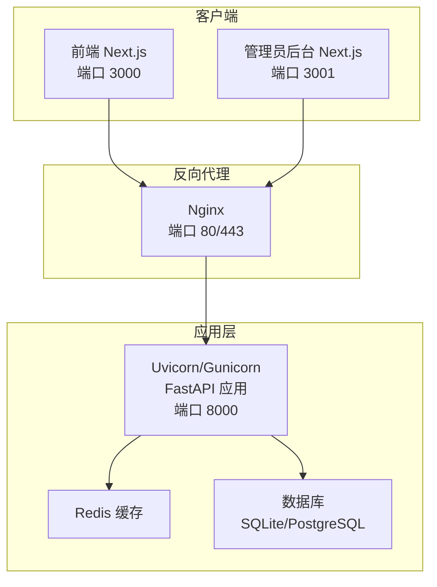
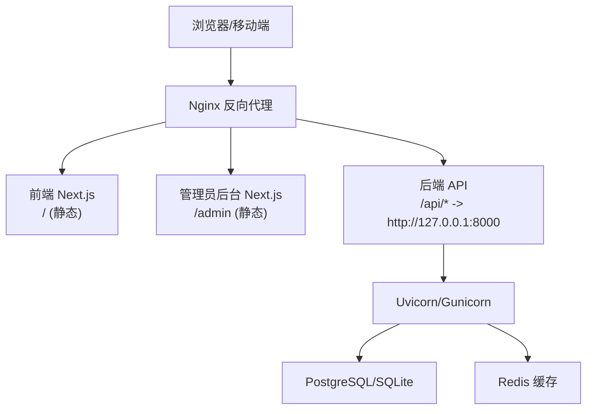
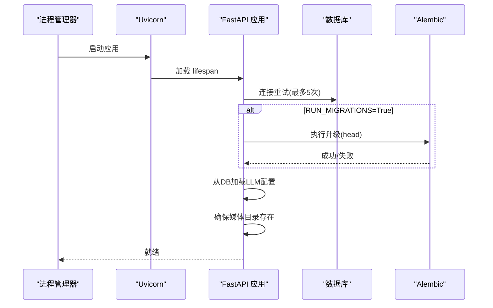
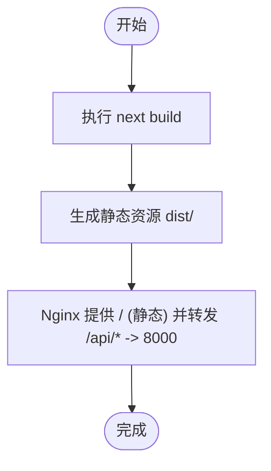
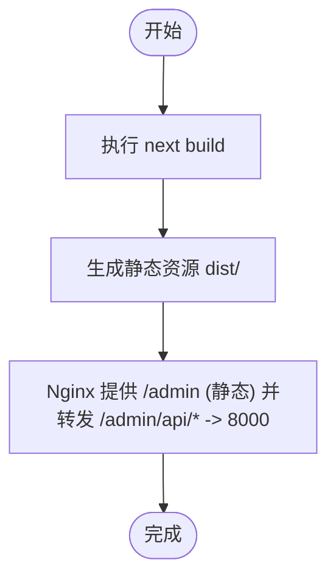
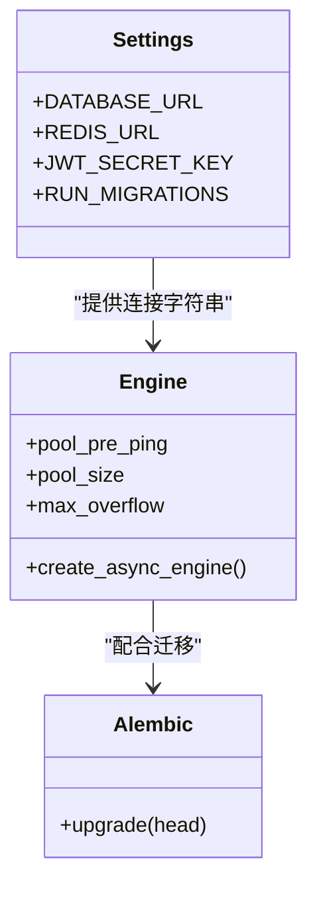

# 生产环境部署

<cite>
**本文引用的文件**
- [backend/main.py](file://backend/main.py)
- [backend/config.py](file://backend/config.py)
- [backend/database.py](file://backend/database.py)
- [backend/alembic.ini](file://backend/alembic.ini)
- [backend/requirements.txt](file://backend/requirements.txt)
- [backend/admin/package.json](file://backend/admin/package.json)
- [backend/admin/next.config.js](file://backend/admin/next.config.js)
- [frontend/package.json](file://frontend/package.json)
- [frontend/next.config.ts](file://frontend/next.config.ts)
- [backend/models.py](file://backend/models.py)
</cite>

## 目录
1. [简介](#简介)
2. [项目结构](#项目结构)
3. [核心组件](#核心组件)
4. [架构总览](#架构总览)
5. [详细组件分析](#详细组件分析)
6. [依赖分析](#依赖分析)
7. [性能考虑](#性能考虑)
8. [故障排查指南](#故障排查指南)
9. [结论](#结论)
10. [附录](#附录)

## 简介
本指南面向生产环境部署，覆盖后端 FastAPI 应用打包与运行、前端 Next.js 静态资源构建以及管理员后台的构建流程；同时提供服务器配置建议、部署步骤、负载均衡与 SSL 配置、进程管理与守护、以及蓝绿部署与滚动更新等最佳实践。目标是帮助运维团队以稳定、可扩展的方式上线系统。

## 项目结构
- 后端服务：基于 FastAPI 的异步 API，使用 SQLAlchemy 2.x 异步 ORM、Alembic 迁移、Redis 缓存、SQLite/PostgreSQL 数据库。
- 前端应用：Next.js 16，通过 rewrites 将 /api/* 请求代理到后端 8000 端口。
- 管理员后台：独立的 Next.js 应用，同样通过 rewrites 代理到后端 8000 端口。
- 部署目标：Nginx 作为反向代理与静态资源服务，Gunicorn/Uvicorn 运行后端，PM2 或 systemd 守护进程，SSL 终止于 Nginx。

图表来源
- [frontend/next.config.ts:1-20](file://frontend/next.config.ts#L1-L20)
- [backend/admin/next.config.js:1-15](file://backend/admin/next.config.js#L1-L15)
- [backend/main.py:110-174](file://backend/main.py#L110-L174)
- [backend/database.py:1-31](file://backend/database.py#L1-L31)
- [backend/config.py:1-43](file://backend/config.py#L1-L43)

章节来源
- [frontend/next.config.ts:1-20](file://frontend/next.config.ts#L1-L20)
- [backend/admin/next.config.js:1-15](file://backend/admin/next.config.js#L1-L15)
- [backend/main.py:110-174](file://backend/main.py#L110-L174)
- [backend/database.py:1-31](file://backend/database.py#L1-L31)
- [backend/config.py:1-43](file://backend/config.py#L1-L43)

## 核心组件
- 后端应用入口与生命周期：应用在启动时进行数据库连接重试、可选的 Alembic 迁移、从数据库加载叙事引擎配置，并确保媒体目录存在。
- 配置管理：通过 pydantic-settings 读取 .env 文件，支持 SQLite 与 PostgreSQL 切换、Redis、AI 模型密钥、JWT 密钥与过期时间、是否在启动时执行迁移等。
- 数据库与连接池：异步引擎、连接池参数、SQLite 特定连接参数。
- 前端与管理员后台：均通过 Next.js 的 rewrites 将 /api/* 代理到后端 8000 端口。

章节来源
- [backend/main.py:49-108](file://backend/main.py#L49-L108)
- [backend/config.py:7-42](file://backend/config.py#L7-L42)
- [backend/database.py:8-23](file://backend/database.py#L8-L23)

## 架构总览
下图展示生产环境典型拓扑：Nginx 作为统一入口，负责静态资源、反向代理与 SSL 终止；后端由 Uvicorn/Gunicorn 托管；数据库与缓存分别承载持久化与会话/临时数据。

图表来源
- [frontend/next.config.ts:9-16](file://frontend/next.config.ts#L9-L16)
- [backend/admin/next.config.js:4-11](file://backend/admin/next.config.js#L4-L11)
- [backend/main.py:110-174](file://backend/main.py#L110-L174)
- [backend/database.py:8-23](file://backend/database.py#L8-L23)
- [backend/config.py:14-16](file://backend/config.py#L14-L16)

## 详细组件分析

### 后端 FastAPI 应用打包与运行
- 依赖安装：使用 requirements.txt 中声明的依赖，建议在虚拟环境中安装。
- 启动方式：直接运行 main.py 时默认监听 0.0.0.0:8000；生产中推荐使用 Uvicorn/Gunicorn。
- 生命周期钩子：启动阶段执行数据库连接重试、可选迁移、从数据库加载 LLM 配置、创建媒体目录。
- CORS 与中间件：开发阶段允许本地前端跨域访问，生产需按域名精确配置。
- 静态文件：后端未挂载静态目录，前端与管理员后台通过 Nginx 提供静态资源。

图表来源
- [backend/main.py:49-108](file://backend/main.py#L49-L108)
- [backend/config.py:37-37](file://backend/config.py#L37-L37)

章节来源
- [backend/main.py:110-174](file://backend/main.py#L110-L174)
- [backend/config.py:37-37](file://backend/config.py#L37-L37)

### 前端 Next.js 静态资源构建
- 构建命令：使用 Next.js 的 build 脚本生成静态资源。
- 代理配置：通过 rewrites 将 /api/* 代理到后端 8000 端口，便于前后端同机部署。
- 端口：开发时默认 3000，生产由 Nginx 提供静态资源与反向代理。

图表来源
- [frontend/package.json:5-12](file://frontend/package.json#L5-L12)
- [frontend/next.config.ts:9-16](file://frontend/next.config.ts#L9-L16)

章节来源
- [frontend/package.json:5-12](file://frontend/package.json#L5-L12)
- [frontend/next.config.ts:1-20](file://frontend/next.config.ts#L1-L20)

### 管理员后台 Next.js 构建
- 构建命令：使用 Next.js 的 build 脚本生成静态资源。
- 代理配置：通过 rewrites 将 /api/* 代理到后端 8000 端口，管理员后台独立运行在 3001 端口。
- 部署位置：可与前端共享 Nginx，路径前缀区分（如 /admin）。

图表来源
- [backend/admin/package.json:5-10](file://backend/admin/package.json#L5-L10)
- [backend/admin/next.config.js:4-11](file://backend/admin/next.config.js#L4-L11)

章节来源
- [backend/admin/package.json:1-73](file://backend/admin/package.json#L1-L73)
- [backend/admin/next.config.js:1-15](file://backend/admin/next.config.js#L1-L15)

### 数据库与迁移
- 数据库类型：默认 SQLite（aiosqlite），可通过环境变量切换为 PostgreSQL（asyncpg）。
- 连接池：预置连接池参数，支持 SQLite 与 PostgreSQL。
- 迁移：通过 Alembic 升级到最新版本；启动时可选择执行迁移。

图表来源
- [backend/config.py:14-16](file://backend/config.py#L14-L16)
- [backend/database.py:8-23](file://backend/database.py#L8-L23)
- [backend/alembic.ini:1-115](file://backend/alembic.ini#L1-L115)

章节来源
- [backend/config.py:1-43](file://backend/config.py#L1-L43)
- [backend/database.py:1-31](file://backend/database.py#L1-L31)
- [backend/alembic.ini:1-115](file://backend/alembic.ini#L1-L115)

## 依赖分析
- 后端依赖：FastAPI、Uvicorn、SQLAlchemy 2.x、Pydantic Settings、asyncpg/aiosqlite、Redis、Alembic、psycopg2-binary、bcrypt、python-jose、google-genai、xai-sdk、httpx、Pillow 等。
- 前端依赖：Next.js、React、Ant Design、Tailwind、Socket.IO 客户端、SWR、UUID、Zustand 等。
- 管理员后台依赖：Next.js、Radix UI、Recharts、Axios、Zod、Monaco Editor 等。

章节来源
- [backend/requirements.txt:1-28](file://backend/requirements.txt#L1-L28)
- [frontend/package.json:13-68](file://frontend/package.json#L13-L68)
- [backend/admin/package.json:11-49](file://backend/admin/package.json#L11-L49)

## 性能考虑
- 连接池与并发：根据实例规模调整数据库连接池大小与溢出数量，避免高并发下的连接争用。
- 缓存策略：利用 Redis 缓存热点数据与会话信息，降低数据库压力。
- 静态资源优化：Nginx 提供静态资源压缩与缓存头，减少带宽与延迟。
- 日志与监控：关闭不必要的 SQL/访问日志，集中化日志收集与告警。

## 故障排查指南
- 启动失败与迁移错误：检查 RUN_MIGRATIONS 配置与 Alembic 升级日志；若出现临时表残留，可清理后重试。
- 数据库连接失败：确认数据库地址、凭据与网络可达性；检查连接池参数与超时设置。
- CORS 与鉴权：生产环境需严格限制允许的源与方法，避免安全风险。
- WebSocket 与 SSE：关注连接异常与消息处理错误，必要时增加重连与退避策略。

章节来源
- [backend/main.py:49-108](file://backend/main.py#L49-L108)
- [backend/config.py:37-37](file://backend/config.py#L37-L37)

## 结论
通过明确的打包与构建流程、合理的服务器配置、完善的负载均衡与 SSL 设置、可靠的进程管理与守护机制，以及可落地的蓝绿/滚动更新与回滚策略，可以在生产环境中稳定地交付该系统。建议在上线前完成全链路压测与演练，确保各组件协同工作。

## 附录

### 服务器配置要求
- 操作系统：Linux（推荐 Ubuntu 22.04+/CentOS 8+）
- CPU：至少 2 核（建议 4 核以上，视并发与 AI 生成负载而定）
- 内存：至少 4 GB（建议 8 GB+，含数据库与缓存）
- 存储：SSD 至少 50 GB（含日志、媒体与数据库）
- 网络：开放 80/443（Nginx），8000（后端），6379（Redis），数据库端口（PostgreSQL）

### 部署步骤
- 代码拉取：克隆仓库至目标服务器
- 环境准备：创建虚拟环境，安装后端依赖
- 数据库初始化：设置 DATABASE_URL，执行 Alembic 升级（可选）
- 媒体目录：确保 media 目录存在且具备写权限
- 前端与管理员后台：执行 next build，生成静态资源
- Nginx 配置：提供静态资源与 /api/* 代理
- 进程管理：使用 Gunicorn/Uvicorn 运行后端，PM2/systemd 守护
- SSL 证书：申请并配置 Let’s Encrypt 或商业证书
- 启动顺序：先数据库/缓存，再后端，最后 Nginx

### 负载均衡与 SSL
- Nginx 反向代理：监听 80/443，静态资源直出，/api/* 代理到后端 8000
- SSL 终止：使用 ACME 自动签发证书，或手动部署证书文件
- 健康检查：定期探测 /api/ 与静态资源可用性
- 域名绑定：A/AAAA 记录指向服务器 IP，配置解析

### 进程管理与守护
- 后端：Uvicorn + Gunicorn（多 worker），配置进程数与 worker 类型
- 前端与管理员后台：Nginx 提供静态资源与反代
- 守护：PM2 或 systemd，自动重启失败进程，记录日志
- 自动重启：结合健康检查与告警，实现故障自愈

### 部署最佳实践
- 蓝绿部署：准备两套后端实例，切换上游指向新版本，失败快速回滚
- 滚动更新：逐批替换后端实例，保持最小停机时间
- 回滚策略：保留上一版本镜像与配置，一键切换
- 配置管理：敏感信息放入 .env，不纳入版本控制
- 备份与恢复：数据库与媒体定期备份，演练恢复流程