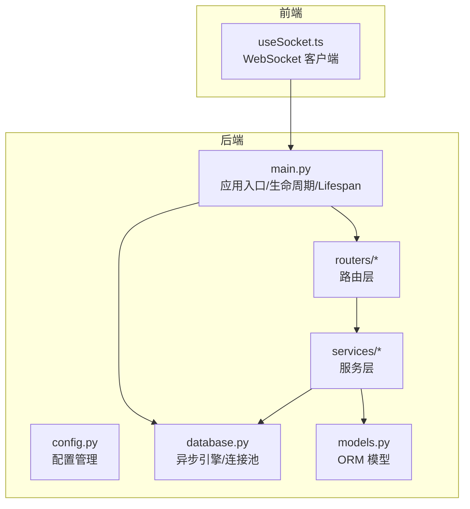
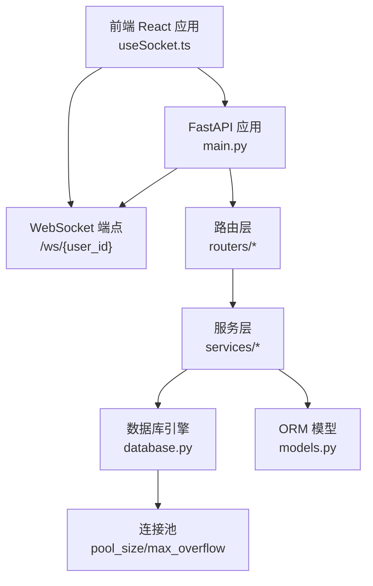
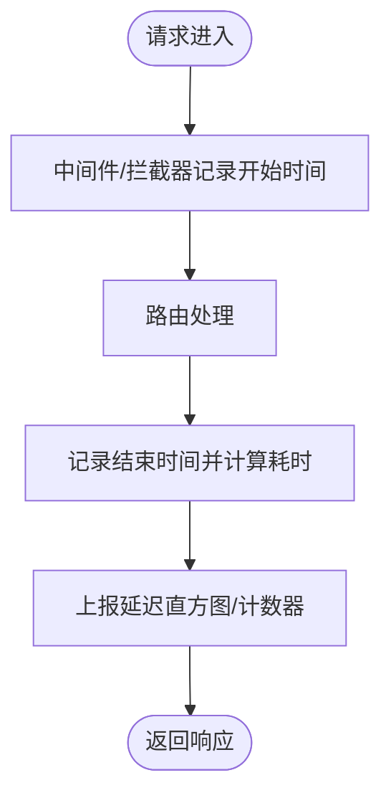
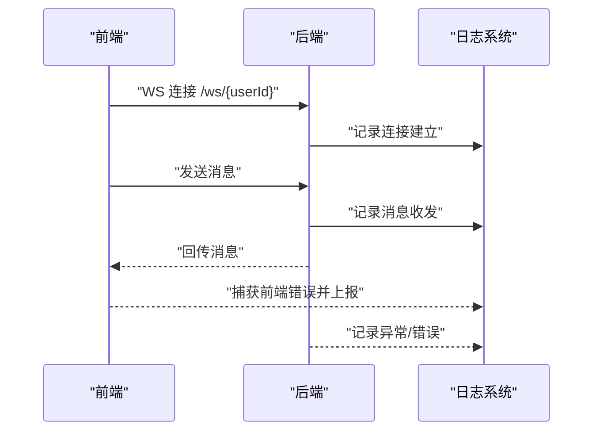
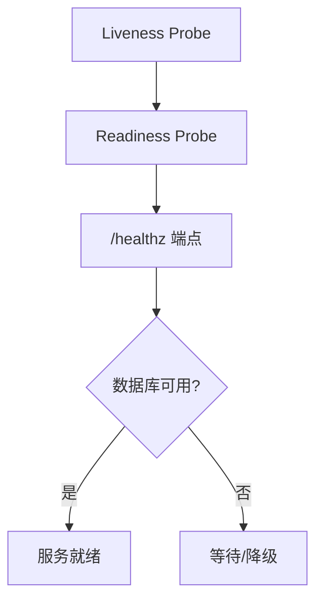
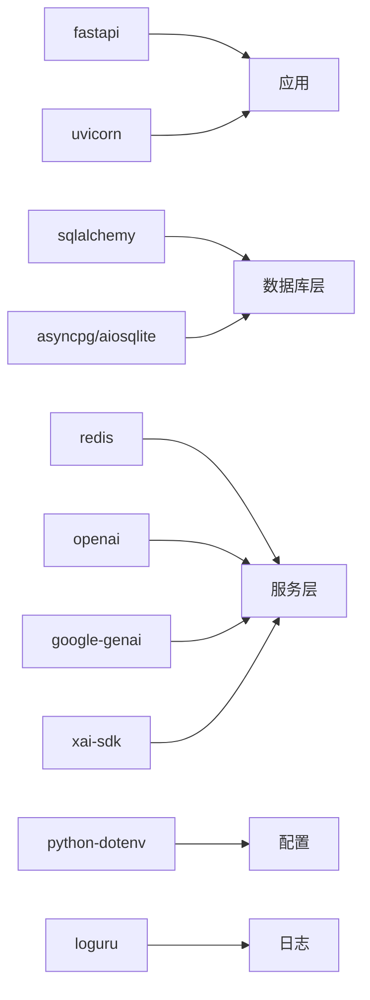

# 监控和告警

<cite>
**本文引用的文件**
- [backend/main.py](file://backend/main.py)
- [backend/config.py](file://backend/config.py)
- [backend/database.py](file://backend/database.py)
- [backend/routers/admin_debug.py](file://backend/routers/admin_debug.py)
- [backend/models.py](file://backend/models.py)
- [backend/services/billing.py](file://backend/services/billing.py)
- [frontend/src/hooks/useSocket.ts](file://frontend/src/hooks/useSocket.ts)
- [backend/requirements.txt](file://backend/requirements.txt)
</cite>

## 目录
1. [简介](#简介)
2. [项目结构](#项目结构)
3. [核心组件](#核心组件)
4. [架构总览](#架构总览)
5. [详细组件分析](#详细组件分析)
6. [依赖分析](#依赖分析)
7. [性能考量](#性能考量)
8. [故障排查指南](#故障排查指南)
9. [结论](#结论)
10. [附录](#附录)

## 简介
本指南面向系统运维与开发团队，提供针对本项目的系统监控与告警实践建议，覆盖应用性能监控（CPU、内存、数据库连接、API 响应时间）、日志采集与分析（后端日志、前端错误日志、实时通信日志）、健康检查机制（Liveness Probe、Readiness Probe、自定义健康检查端点）、告警配置（阈值、规则与通知渠道）、实时监控（WebSocket 连接、用户活跃度、资源使用）以及监控工具推荐（Prometheus、Grafana、ELK Stack 的集成方案）。  
本指南以现有代码库为基础，结合最佳实践，给出可落地的实施步骤与可视化图示，帮助快速建立可观测性体系。

## 项目结构
后端采用 FastAPI + SQLAlchemy Async + Uvicorn，前端使用 React + WebSocket；数据库默认使用 SQLite（可通过配置切换 PostgreSQL），并内置 Alembic 迁移能力。整体结构如下：

图表来源
- [backend/main.py:110-174](file://backend/main.py#L110-L174)
- [backend/config.py:1-43](file://backend/config.py#L1-L43)
- [backend/database.py:1-31](file://backend/database.py#L1-L31)
- [backend/models.py:1-447](file://backend/models.py#L1-L447)
- [frontend/src/hooks/useSocket.ts:1-43](file://frontend/src/hooks/useSocket.ts#L1-L43)

章节来源
- [backend/main.py:110-174](file://backend/main.py#L110-L174)
- [backend/config.py:1-43](file://backend/config.py#L1-L43)
- [backend/database.py:1-31](file://backend/database.py#L1-L31)
- [backend/models.py:1-447](file://backend/models.py#L1-L447)
- [frontend/src/hooks/useSocket.ts:1-43](file://frontend/src/hooks/useSocket.ts#L1-L43)

## 核心组件
- 应用入口与生命周期：负责数据库连接重试、迁移、媒体目录初始化、CORS、中间件注册、路由挂载与 WebSocket 端点。
- 配置中心：集中管理数据库、Redis、AI 密钥、JWT、运行参数等。
- 数据库层：异步引擎与连接池配置，支持 SQLite/PostgreSQL，具备连接池大小与溢出限制。
- 服务与模型：计费服务、审计交易、用户/管理员/剧场/节点/资产/视频任务等模型。
- 实时通信：WebSocket 端点与前端 Hook，便于构建用户活跃度与连接监控。

章节来源
- [backend/main.py:110-174](file://backend/main.py#L110-L174)
- [backend/config.py:1-43](file://backend/config.py#L1-L43)
- [backend/database.py:1-31](file://backend/database.py#L1-L31)
- [backend/models.py:1-447](file://backend/models.py#L1-L447)
- [backend/services/billing.py:1-388](file://backend/services/billing.py#L1-L388)
- [frontend/src/hooks/useSocket.ts:1-43](file://frontend/src/hooks/useSocket.ts#L1-L43)

## 架构总览
下图展示了从客户端到后端服务与数据库的整体交互，以及监控关注点所在：

图表来源
- [backend/main.py:160-171](file://backend/main.py#L160-L171)
- [backend/database.py:8-23](file://backend/database.py#L8-L23)
- [backend/models.py:1-447](file://backend/models.py#L1-L447)

## 详细组件分析

### 应用性能监控（CPU、内存、数据库连接、API 响应时间）
- CPU 与内存：建议通过操作系统级监控（如 Prometheus Node Exporter）采集宿主机指标；对容器环境可使用 kube-state-metrics 与 Metrics Server。
- 数据库连接数：基于连接池配置进行基线设定，结合慢查询日志与连接池利用率进行容量规划。
- API 响应时间：在路由层或中间件中埋点，记录请求开始与结束时间，计算耗时并打标签（方法、路径、状态码）。

图表来源
- [backend/main.py:110-174](file://backend/main.py#L110-L174)

章节来源
- [backend/main.py:110-174](file://backend/main.py#L110-L174)

### 日志收集与分析
- 后端日志格式：当前日志格式为简洁的级别与消息，建议统一结构化日志（JSON），包含时间戳、级别、模块名、请求上下文（traceId、userId、sessionId）与业务字段。
- 前端错误日志：前端可将错误堆栈、用户行为、页面路径、浏览器信息上报至后端或专用日志平台。
- 实时通信日志：WebSocket 连接建立/断开、消息收发、异常事件均需记录，便于定位连接抖动与消息丢失。

图表来源
- [backend/main.py:160-171](file://backend/main.py#L160-L171)
- [frontend/src/hooks/useSocket.ts:1-43](file://frontend/src/hooks/useSocket.ts#L1-L43)

章节来源
- [backend/main.py:15-30](file://backend/main.py#L15-L30)
- [frontend/src/hooks/useSocket.ts:1-43](file://frontend/src/hooks/useSocket.ts#L1-L43)

### 健康检查机制
- Liveness Probe：检测进程存活，建议访问根路径或轻量端点，快速失败即重启。
- Readiness Probe：检测服务就绪，建议访问数据库连接可用性或关键依赖可用性。
- 自定义健康检查端点：新增 /healthz 或 /readyz，返回服务状态与依赖项健康情况。

图表来源
- [backend/main.py:155-157](file://backend/main.py#L155-L157)
- [backend/database.py:8-17](file://backend/database.py#L8-L17)

章节来源
- [backend/main.py:155-157](file://backend/main.py#L155-L157)
- [backend/database.py:8-17](file://backend/database.py#L8-L17)

### 告警配置
- 阈值设置：延迟（P95/P99）、错误率、连接池饱和度、队列长度、内存使用率、CPU 使用率。
- 告警规则：基于 PromQL 或 Grafana 规则表达式，结合业务 SLA 设定阈值。
- 通知渠道：邮件、Webhook、IM（如钉钉、飞书、Slack）。

章节来源
- [backend/requirements.txt:1-28](file://backend/requirements.txt#L1-L28)

### 实时监控
- WebSocket 连接监控：统计连接数、断线率、消息吞吐、延迟分布。
- 用户活跃度统计：基于 WebSocket 事件与聊天会话记录，计算在线时长、消息数、会话时长。
- 资源使用监控：容器/主机 CPU、内存、磁盘 IO、网络带宽。

章节来源
- [backend/main.py:160-171](file://backend/main.py#L160-L171)
- [frontend/src/hooks/useSocket.ts:1-43](file://frontend/src/hooks/useSocket.ts#L1-L43)

### 监控工具推荐与集成方案
- Prometheus：抓取后端指标（自定义指标或第三方导出器），结合 Node Exporter 采集主机指标。
- Grafana：仪表盘展示延迟、错误率、连接池、资源使用、WebSocket 活跃度。
- ELK Stack：采集结构化日志，进行检索、聚合与可视化，支持前端错误日志与后端访问日志。

章节来源
- [backend/requirements.txt:1-28](file://backend/requirements.txt#L1-L28)

## 依赖分析
后端依赖包括 Web 框架、数据库、异步工具、AI SDK、加密与配置管理等。这些组件直接影响监控与告警的实现方式与数据来源。

图表来源
- [backend/requirements.txt:1-28](file://backend/requirements.txt#L1-L28)

章节来源
- [backend/requirements.txt:1-28](file://backend/requirements.txt#L1-L28)

## 性能考量
- 数据库连接池：合理设置 pool_size 与 max_overflow，避免连接争用与超时。
- 异步 I/O：利用 SQLAlchemy Async 与 FastAPI 异步特性，提升并发处理能力。
- 缓存策略：Redis 用于会话缓存与热点数据，降低数据库压力。
- 日志级别：生产环境建议降低 SQLAlchemy 与 Uvicorn 访问日志级别，避免 I/O 抖动。

章节来源
- [backend/database.py:8-23](file://backend/database.py#L8-L23)
- [backend/main.py:15-30](file://backend/main.py#L15-L30)

## 故障排查指南
- 数据库连接失败：查看 Lifespan 初始化中的重试逻辑与迁移过程，确认数据库 URL 与权限。
- WebSocket 断线：检查前端连接状态与后端异常日志，定位网络波动或服务重启。
- 计费异常：核对计费维度与费率映射，确认余额与冻结状态，必要时回滚或退款。

章节来源
- [backend/main.py:49-108](file://backend/main.py#L49-L108)
- [backend/main.py:160-171](file://backend/main.py#L160-L171)
- [backend/services/billing.py:45-84](file://backend/services/billing.py#L45-L84)

## 结论
通过在现有代码基础上引入统一的日志格式、中间件埋点、健康检查端点与连接池监控，配合 Prometheus/Grafana/ELK 的集成，可快速构建完善的监控与告警体系。建议优先实现以下闭环：采集—>存储—>可视化—>告警—>处置—>反馈。

## 附录
- 建议新增的监控端点与中间件可参考现有路由与中间件模式，确保与现有生命周期与配置体系一致。
- WebSocket 连接监控可复用前端 Hook 的连接状态与消息统计，形成前后端联动的实时观测。