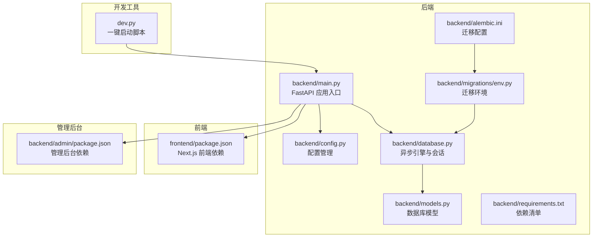
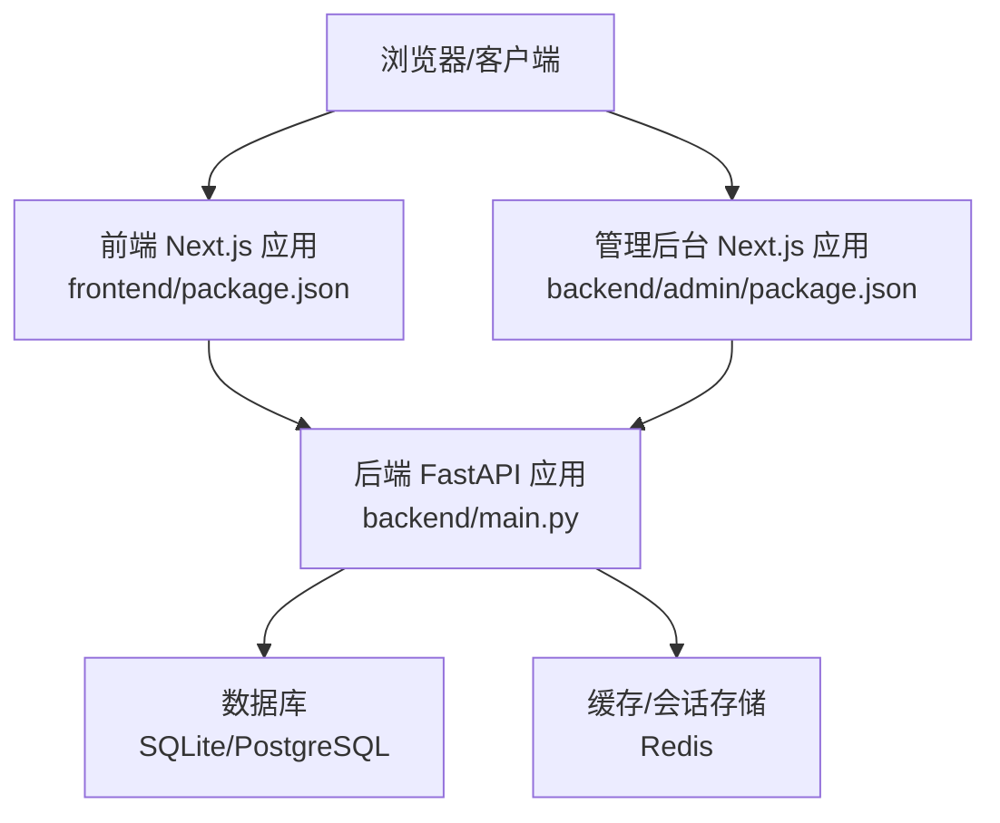
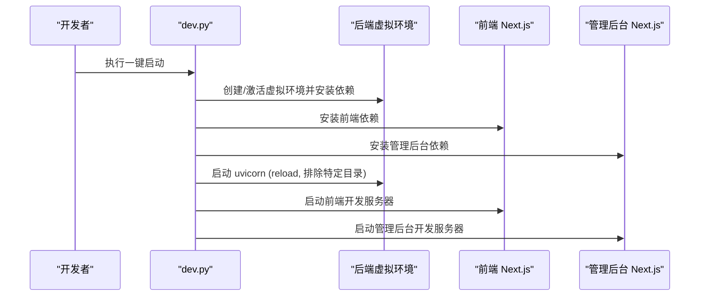
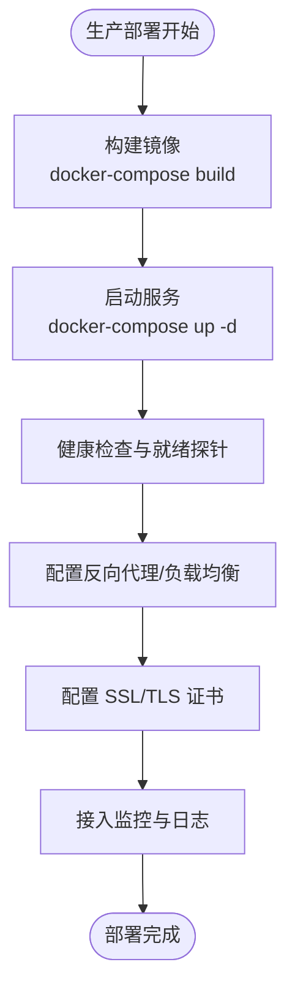
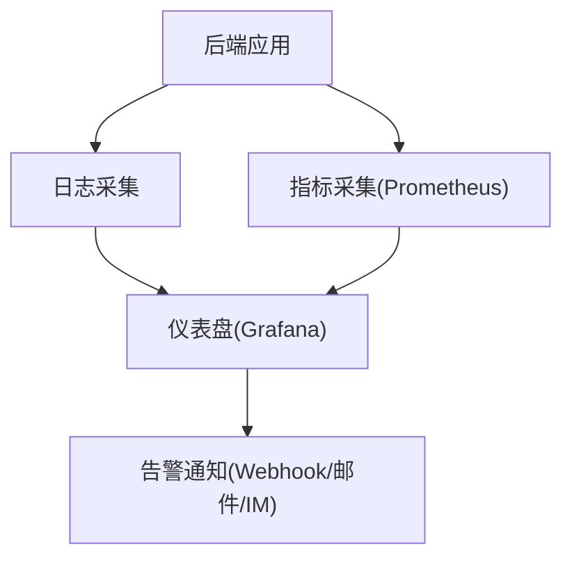
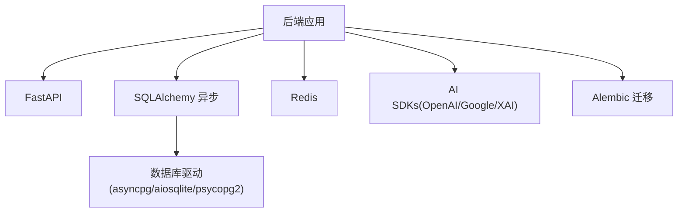

# 部署和运维

<cite>
**本文引用的文件**   
- [README.md](file://README.md)
- [dev.py](file://dev.py)
- [backend/main.py](file://backend/main.py)
- [backend/config.py](file://backend/config.py)
- [backend/database.py](file://backend/database.py)
- [backend/models.py](file://backend/models.py)
- [backend/requirements.txt](file://backend/requirements.txt)
- [backend/alembic.ini](file://backend/alembic.ini)
- [backend/migrations/env.py](file://backend/migrations/env.py)
- [backend/admin/package.json](file://backend/admin/package.json)
- [frontend/package.json](file://frontend/package.json)
</cite>

## 目录
1. [简介](#简介)
2. [项目结构](#项目结构)
3. [核心组件](#核心组件)
4. [架构总览](#架构总览)
5. [详细组件分析](#详细组件分析)
6. [依赖分析](#依赖分析)
7. [性能考虑](#性能考虑)
8. [故障排查指南](#故障排查指南)
9. [结论](#结论)
10. [附录](#附录)

## 简介
本指南面向部署与运维团队，覆盖从开发环境到生产环境的完整生命周期，包括环境变量与依赖管理、容器化与负载均衡、监控与告警、备份与恢复、性能优化、安全加固以及发布与回滚的最佳实践。文档以仓库现有实现为基础，结合可扩展建议，帮助您稳定、安全地交付系统。

## 项目结构
项目采用前后端分离架构，后端为 FastAPI 异步服务，前端为 Next.js 应用，另有独立的管理后台 Next.js 前端。数据库采用 SQLAlchemy 异步 ORM，迁移工具为 Alembic；默认使用 SQLite（开发），生产建议使用 PostgreSQL。

**图表来源**
- [backend/main.py:110-174](file://backend/main.py#L110-L174)
- [backend/config.py:1-43](file://backend/config.py#L1-L43)
- [backend/database.py:1-31](file://backend/database.py#L1-L31)
- [backend/models.py:1-447](file://backend/models.py#L1-L447)
- [backend/requirements.txt:1-28](file://backend/requirements.txt#L1-L28)
- [backend/alembic.ini:1-115](file://backend/alembic.ini#L1-L115)
- [backend/migrations/env.py:1-120](file://backend/migrations/env.py#L1-L120)
- [frontend/package.json:1-92](file://frontend/package.json#L1-L92)
- [backend/admin/package.json:1-73](file://backend/admin/package.json#L1-L73)
- [dev.py:94-169](file://dev.py#L94-L169)

**章节来源**
- [README.md:70-127](file://README.md#L70-L127)
- [dev.py:94-169](file://dev.py#L94-L169)
- [backend/main.py:110-174](file://backend/main.py#L110-L174)
- [backend/config.py:1-43](file://backend/config.py#L1-L43)
- [backend/database.py:1-31](file://backend/database.py#L1-L31)
- [backend/models.py:1-447](file://backend/models.py#L1-L447)
- [backend/requirements.txt:1-28](file://backend/requirements.txt#L1-L28)
- [backend/alembic.ini:1-115](file://backend/alembic.ini#L1-L115)
- [backend/migrations/env.py:1-120](file://backend/migrations/env.py#L1-L120)
- [frontend/package.json:1-92](file://frontend/package.json#L1-L92)
- [backend/admin/package.json:1-73](file://backend/admin/package.json#L1-L73)

## 核心组件
- 应用入口与生命周期：后端通过 FastAPI 应用入口集中注册路由、中间件与生命周期钩子，启动时执行数据库连接重试与迁移。
- 配置管理：使用 pydantic-settings 从 .env 加载配置，支持数据库、Redis、AI 服务密钥、JWT、生成参数与迁移开关。
- 数据库与迁移：异步 SQLAlchemy 引擎默认 SQLite，生产建议 PostgreSQL；Alembic 提供迁移环境与批量迁移支持。
- 前端与管理后台：Next.js 前端与管理后台分别维护独立依赖，开发脚本统一启动三端服务。

**章节来源**
- [backend/main.py:49-108](file://backend/main.py#L49-L108)
- [backend/config.py:7-42](file://backend/config.py#L7-L42)
- [backend/database.py:8-23](file://backend/database.py#L8-L23)
- [backend/migrations/env.py:39-114](file://backend/migrations/env.py#L39-L114)
- [frontend/package.json:1-92](file://frontend/package.json#L1-L92)
- [backend/admin/package.json:1-73](file://backend/admin/package.json#L1-L73)

## 架构总览
系统采用“后端 API + 前端 Web + 管理后台”的三层架构。后端提供 REST/WebSocket 接口，前端负责用户交互，管理后台提供运营与配置能力。数据库与缓存（Redis）作为基础设施组件。

**图表来源**
- [backend/main.py:138-152](file://backend/main.py#L138-L152)
- [backend/config.py:15-19](file://backend/config.py#L15-L19)
- [frontend/package.json:1-92](file://frontend/package.json#L1-L92)
- [backend/admin/package.json:1-73](file://backend/admin/package.json#L1-L73)

## 详细组件分析

### 开发环境配置
- 虚拟环境与依赖
  - 后端使用 Python 虚拟环境与 requirements.txt 管理依赖。
  - 前端与管理后台分别安装依赖。
- 一键启动
  - dev.py 负责创建/激活后端虚拟环境、安装依赖、并行启动后端、前端与管理后台服务。
  - 后端使用 uvicorn 启动，开启 reload 并排除特定目录避免热重载循环。
- 环境变量
  - 通过 .env 由 pydantic-settings 注入，包含数据库 URL、Redis URL、AI API 密钥、JWT 参数与迁移开关等。

**图表来源**
- [dev.py:25-62](file://dev.py#L25-L62)
- [dev.py:112-137](file://dev.py#L112-L137)
- [backend/requirements.txt:1-28](file://backend/requirements.txt#L1-L28)
- [frontend/package.json:1-92](file://frontend/package.json#L1-L92)
- [backend/admin/package.json:1-73](file://backend/admin/package.json#L1-L73)

**章节来源**
- [dev.py:25-62](file://dev.py#L25-L62)
- [dev.py:112-137](file://dev.py#L112-L137)
- [backend/config.py:39-42](file://backend/config.py#L39-L42)

### 生产环境部署
- 容器化与编排
  - README 提供 docker-compose 构建与启动示例，建议将后端、前端、管理后台与数据库/缓存容器化并编排。
- 服务暴露与端口
  - 后端默认监听 0.0.0.0:8000；前端与管理后台分别监听 3000/3001（开发端口）。生产需通过反向代理对外暴露。
- 数据库与迁移
  - 生产建议使用 PostgreSQL；启动时可按需执行 Alembic 迁移（当前实现支持在启动阶段自动迁移）。
- 缓存与会话
  - Redis 用于缓存与会话存储，生产需独立部署并配置连接。

**图表来源**
- [README.md:293-306](file://README.md#L293-L306)
- [backend/main.py:49-108](file://backend/main.py#L49-L108)
- [backend/config.py:15-19](file://backend/config.py#L15-L19)

**章节来源**
- [README.md:293-306](file://README.md#L293-L306)
- [backend/main.py:49-108](file://backend/main.py#L49-L108)
- [backend/config.py:15-19](file://backend/config.py#L15-L19)

### 监控与告警
- 应用性能监控
  - 建议集成 Prometheus/Grafana，采集 CPU、内存、请求延迟、错误率与数据库连接池指标。
- 错误日志收集
  - 后端使用标准日志模块，生产建议集中化日志（如 ELK/Fluentd），并区分 info/warning/error 级别。
- 健康检查
  - 提供根路径健康探测接口，结合容器健康检查命令与反向代理健康检查。

[本图为概念图，无需图表来源]

### 备份与恢复
- 数据库备份
  - SQLite：定期复制数据库文件；生产建议 PostgreSQL，使用其原生命令进行逻辑/物理备份。
- 文件备份
  - 媒体资源目录需纳入备份策略，建议增量备份与异地容灾。
- 灾难恢复
  - 制定 RTO/RPO 指标，演练恢复流程，验证备份数据可用性与完整性。

[本节为通用运维建议，无需章节来源]

### 性能优化
- 缓存策略
  - 使用 Redis 缓存热点数据与会话，降低数据库压力；对长尾数据设置合理过期策略。
- 数据库优化
  - 生产使用 PostgreSQL 并配置连接池；索引优化与慢查询分析；读写分离与只读副本。
- 前端资源优化
  - Next.js 构建产物静态化，启用压缩与缓存头；CDN 分发静态资源；按需加载与懒加载。

**章节来源**
- [backend/config.py:18-19](file://backend/config.py#L18-L19)
- [backend/database.py:14-16](file://backend/database.py#L14-L16)
- [frontend/package.json:6-12](file://frontend/package.json#L6-L12)

### 安全加固
- 防火墙与网络
  - 仅开放必要端口（反向代理端口、数据库端口等），内网访问数据库与缓存。
- 访问控制
  - JWT 密钥需强随机生成且妥善保管；限制 API 请求频率；启用 CORS 白名单。
- 数据加密
  - HTTPS 传输加密；敏感配置与密钥使用环境变量或密钥管理服务；数据库连接使用 SSL。

**章节来源**
- [backend/config.py:26-30](file://backend/config.py#L26-L30)
- [backend/main.py:130-136](file://backend/main.py#L130-L136)

### 运维最佳实践
- 版本发布流程
  - 使用 Git 标签与 CI/CD，先灰度后全量；变更数据库结构必须通过迁移。
- 滚动更新与回滚
  - 容器编排支持滚动更新；回滚至上一个稳定版本；变更配置通过环境变量与配置中心。
- 变更管理
  - 所有变更需评审与测试；重大变更提前演练回滚方案。

[本节为通用运维建议，无需章节来源]

## 依赖分析
后端依赖以 FastAPI、SQLAlchemy、异步数据库驱动、Redis、AI SDK 与 Alembic 为主；前端与管理后台分别维护 Next.js 生态依赖。

**图表来源**
- [backend/requirements.txt:1-28](file://backend/requirements.txt#L1-L28)
- [backend/main.py:32-44](file://backend/main.py#L32-L44)

**章节来源**
- [backend/requirements.txt:1-28](file://backend/requirements.txt#L1-L28)
- [backend/main.py:32-44](file://backend/main.py#L32-L44)

## 性能考虑
- 连接池与并发
  - 异步数据库连接池参数需结合 QPS 调优；避免连接泄漏与超时。
- 缓存命中率
  - 对热点查询与计算结果进行缓存；设置合理的过期时间与失效策略。
- 前端加载
  - Next.js 构建优化、资源压缩与 CDN；减少首屏阻塞资源。

[本节为通用性能建议，无需章节来源]

## 故障排查指南
- 启动失败
  - 检查数据库连接字符串与凭据；确认迁移是否成功；查看日志中数据库重试与迁移失败信息。
- WebSocket/实时通信异常
  - 检查反向代理对 WebSocket 的支持与超时配置。
- 权限与鉴权
  - 核对 JWT 密钥与算法配置；确认 CORS 白名单与授权头传递。

**章节来源**
- [backend/main.py:49-108](file://backend/main.py#L49-L108)
- [backend/main.py:115-127](file://backend/main.py#L115-L127)
- [backend/config.py:26-30](file://backend/config.py#L26-L30)

## 结论
本指南基于仓库现有实现，提供了从开发到生产的完整运维蓝图。建议在生产环境中完善容器化、负载均衡、监控告警、备份恢复与安全加固，并持续优化性能与发布流程，确保系统高可用与可维护性。

## 附录
- 快速参考
  - 后端启动：uvicorn 进程，监听 8000；支持迁移开关。
  - 前端与管理后台：分别监听 3000/3001，开发模式。
  - 数据库：默认 SQLite，生产建议 PostgreSQL；Alembic 支持迁移。
  - 缓存：Redis，生产建议独立部署。

**章节来源**
- [backend/main.py:172-174](file://backend/main.py#L172-L174)
- [README.md:137-194](file://README.md#L137-L194)
- [backend/alembic.ini:1-115](file://backend/alembic.ini#L1-L115)
- [backend/config.py:15-19](file://backend/config.py#L15-L19)