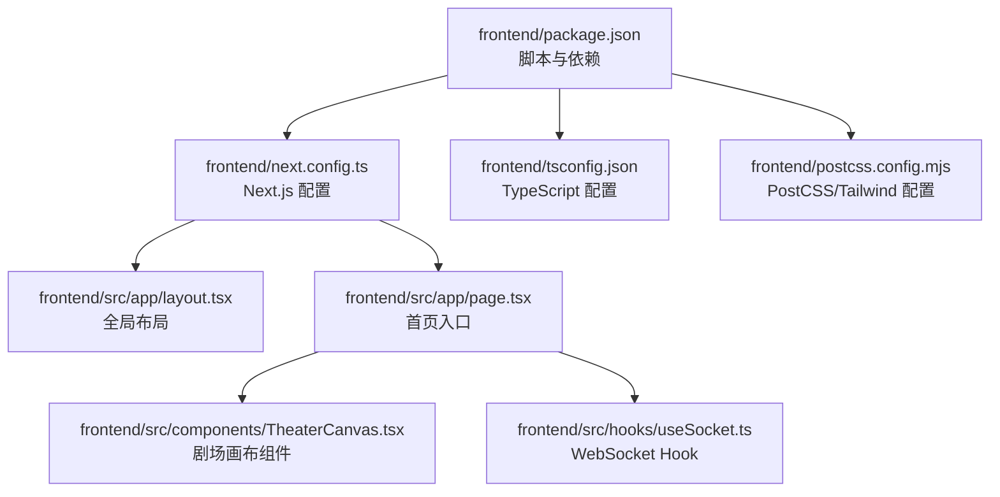
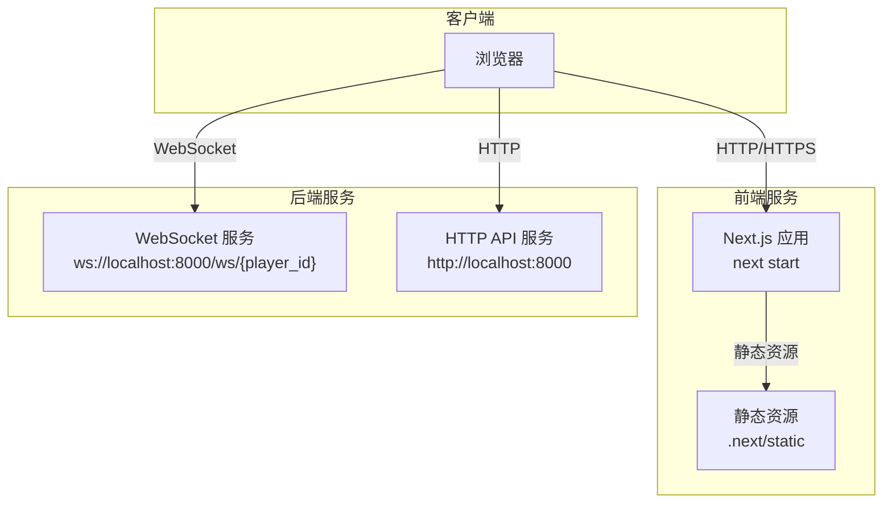
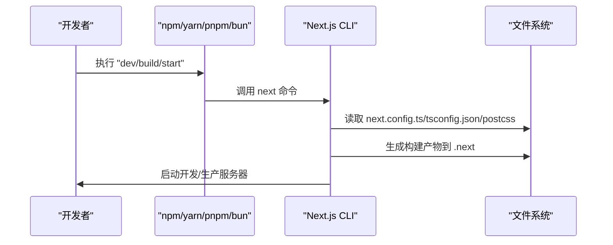
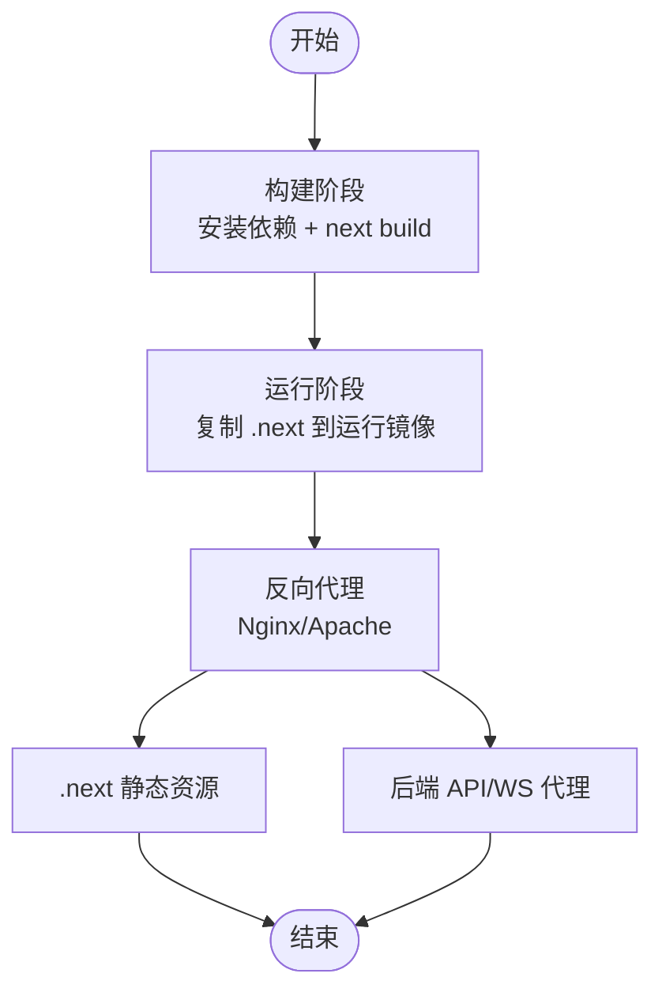
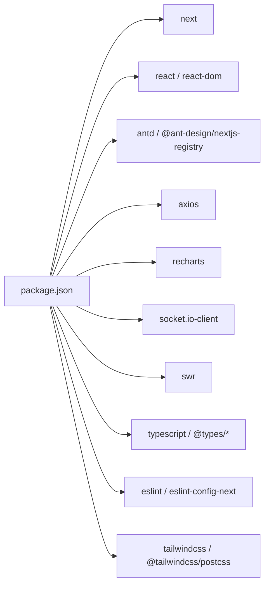

# 前端部署

<cite>
**本文引用的文件**
- [frontend/package.json](file://frontend/package.json)
- [frontend/next.config.ts](file://frontend/next.config.ts)
- [frontend/tsconfig.json](file://frontend/tsconfig.json)
- [frontend/postcss.config.mjs](file://frontend/postcss.config.mjs)
- [docs/wiki/Frontend-Guide.md](file://docs/wiki/Frontend-Guide.md)
- [docs/wiki/Deployment.md](file://docs/wiki/Deployment.md)
- [frontend/src/app/layout.tsx](file://frontend/src/app/layout.tsx)
- [frontend/src/app/page.tsx](file://frontend/src/app/page.tsx)
- [frontend/src/components/TheaterCanvas.tsx](file://frontend/src/components/TheaterCanvas.tsx)
- [frontend/src/hooks/useSocket.ts](file://frontend/src/hooks/useSocket.ts)
- [frontend/public/vercel.svg](file://frontend/public/vercel.svg)
</cite>

## 目录
1. [简介](#简介)
2. [项目结构](#项目结构)
3. [核心组件](#核心组件)
4. [架构总览](#架构总览)
5. [详细组件分析](#详细组件分析)
6. [依赖关系分析](#依赖关系分析)
7. [性能考虑](#性能考虑)
8. [故障排查指南](#故障排查指南)
9. [结论](#结论)
10. [附录](#附录)

## 简介
本指南面向前端应用的部署与运维，聚焦于 Next.js 应用的构建、打包、运行与优化。结合仓库中的前端工程与文档，我们将系统讲解：
- 构建与启动脚本使用
- 环境变量与 API 端点配置
- 静态资源优化、代码分割与缓存策略
- 生产环境构建配置与代理设置
- CDN 集成、HTTPS 与域名绑定
- Docker 容器化与反向代理配置
- 常见问题与性能优化建议

## 项目结构
前端工程位于 frontend 目录，采用 Next.js App Router 结构，使用 TypeScript、Tailwind CSS 与 React 生态。关键文件与职责如下：
- 构建与运行脚本：通过 package.json 的 scripts 字段定义
- Next.js 配置：next.config.ts 提供扩展配置入口
- 类型与路径别名：tsconfig.json 设置严格类型与 @/* 路径映射
- 样式体系：postcss.config.mjs 集成 Tailwind 插件
- 文档与指南：docs/wiki/Frontend-Guide.md 与 Deployment.md 提供开发与部署要点

图表来源
- [frontend/package.json](file://frontend/package.json#L1-L35)
- [frontend/next.config.ts](file://frontend/next.config.ts#L1-L8)
- [frontend/tsconfig.json](file://frontend/tsconfig.json#L1-L35)
- [frontend/postcss.config.mjs](file://frontend/postcss.config.mjs#L1-L8)
- [frontend/src/app/layout.tsx](file://frontend/src/app/layout.tsx)
- [frontend/src/app/page.tsx](file://frontend/src/app/page.tsx)
- [frontend/src/components/TheaterCanvas.tsx](file://frontend/src/components/TheaterCanvas.tsx)
- [frontend/src/hooks/useSocket.ts](file://frontend/src/hooks/useSocket.ts)

章节来源
- [frontend/package.json](file://frontend/package.json#L1-L35)
- [frontend/next.config.ts](file://frontend/next.config.ts#L1-L8)
- [frontend/tsconfig.json](file://frontend/tsconfig.json#L1-L35)
- [frontend/postcss.config.mjs](file://frontend/postcss.config.mjs#L1-L8)
- [docs/wiki/Frontend-Guide.md](file://docs/wiki/Frontend-Guide.md#L1-L69)
- [docs/wiki/Deployment.md](file://docs/wiki/Deployment.md#L1-L65)

## 核心组件
- 构建与启动脚本
  - 开发模式：next dev
  - 构建产物：next build
  - 生产运行：next start
  - Lint：eslint
- Next.js 配置：next.config.ts 作为扩展点，当前为空配置，可按需添加插件、实验特性或构建优化
- TypeScript 配置：启用严格模式、模块解析为 bundler、路径别名 @/* 指向 src
- 样式体系：Tailwind 通过 PostCSS 插件集成，支持原子化样式与响应式设计
- 关键页面与组件
  - 全局布局：layout.tsx
  - 首页入口：page.tsx
  - 剧场画布：TheaterCanvas.tsx（使用动态导入与 ssr: false）
  - WebSocket Hook：useSocket.ts（用于与后端 ws://localhost:8000/ws/{player_id} 通信）

章节来源
- [frontend/package.json](file://frontend/package.json#L5-L10)
- [frontend/next.config.ts](file://frontend/next.config.ts#L3-L5)
- [frontend/tsconfig.json](file://frontend/tsconfig.json#L2-L23)
- [docs/wiki/Frontend-Guide.md](file://docs/wiki/Frontend-Guide.md#L46-L68)

## 架构总览
前端应用与后端服务通过 WebSocket 与 HTTP 接口交互。部署时需确保：
- 前端构建产物由 Web 服务器或 CDN 提供
- API 请求指向后端服务（可使用反向代理或同源策略）
- WebSocket 端点可从浏览器直连或经由代理转发
- 静态资源缓存策略与版本化以提升性能与一致性

图表来源
- [docs/wiki/Frontend-Guide.md](file://docs/wiki/Frontend-Guide.md#L35-L44)
- [frontend/src/hooks/useSocket.ts](file://frontend/src/hooks/useSocket.ts)

章节来源
- [docs/wiki/Frontend-Guide.md](file://docs/wiki/Frontend-Guide.md#L35-L44)

## 详细组件分析

### 构建与启动流程
- 开发模式：next dev 启动热重载开发服务器
- 生产构建：next build 生成优化后的静态资源与页面
- 生产运行：next start 启动静态资源服务与 SSR/ISR 处理
- Lint：eslint 用于代码质量检查

图表来源
- [frontend/package.json](file://frontend/package.json#L5-L10)
- [frontend/next.config.ts](file://frontend/next.config.ts#L1-L8)
- [frontend/tsconfig.json](file://frontend/tsconfig.json#L1-L35)
- [frontend/postcss.config.mjs](file://frontend/postcss.config.mjs#L1-L8)

章节来源
- [frontend/package.json](file://frontend/package.json#L5-L10)
- [docs/wiki/Deployment.md](file://docs/wiki/Deployment.md#L41-L49)

### 静态资源优化与缓存策略
- 代码分割：Next.js 默认按路由与动态导入进行代码分割，减少首屏体积
- 图像优化：使用 next/image 与自动图像优化（在生产中生效）
- 静态导出：如需静态站点，可在 next.config.ts 中启用静态导出（需配合路由策略）
- 缓存策略：利用浏览器缓存与 ETag/Cache-Control；对静态资源采用长期缓存，对 HTML 使用较短缓存
- 版本化：构建产物包含哈希，便于失效与增量更新

章节来源
- [docs/wiki/Frontend-Guide.md](file://docs/wiki/Frontend-Guide.md#L21-L22)

### 环境变量与 API 端点配置
- 环境变量注入：在生产环境中通过构建工具或容器平台注入 NEXT_PUBLIC_* 与 NODE_OPTIONS 等
- API 端点：根据 useSocket.ts 中的连接地址，确保前端能访问后端 WebSocket 与 HTTP 服务
- 代理设置：若前端与后端跨域，可通过反向代理统一域名与端口，避免 CORS 问题

章节来源
- [docs/wiki/Frontend-Guide.md](file://docs/wiki/Frontend-Guide.md#L35-L44)

### Docker 容器化与反向代理
- 容器化：使用多阶段构建，先安装依赖并构建，再复制构建产物到轻量级运行镜像
- 反向代理：Nginx/Apache 将 /api 前缀转发至后端，静态资源由 Nginx 提供并设置长缓存
- 健康检查：在容器内暴露健康检查端点，便于编排平台监控

图表来源
- [frontend/package.json](file://frontend/package.json#L5-L10)
- [docs/wiki/Deployment.md](file://docs/wiki/Deployment.md#L41-L49)

章节来源
- [docs/wiki/Deployment.md](file://docs/wiki/Deployment.md#L41-L49)

### CDN 集成与 HTTPS
- CDN：将静态资源托管至 CDN，开启压缩与缓存，提升全球访问速度
- HTTPS：在 CDN 或边缘网络层启用 TLS，确保传输安全
- 域名绑定：将自定义域名指向 CDN 或负载均衡器，统一入口

章节来源
- [docs/wiki/Deployment.md](file://docs/wiki/Deployment.md#L41-L49)

## 依赖关系分析
- 依赖安装：使用 npm/yarn/pnpm/bun 安装依赖，Next.js 16 与 React 19 为核心运行时
- 开发依赖：TypeScript、ESLint、Tailwind CSS 与相关类型声明
- 运行时依赖：Ant Design、Ant Design Next.js Registry、Axios、Recharts、Socket.IO 客户端、SWR 等

图表来源
- [frontend/package.json](file://frontend/package.json#L11-L33)

章节来源
- [frontend/package.json](file://frontend/package.json#L11-L33)

## 性能考虑
- 代码分割：充分利用动态导入与路由级拆分，减少首屏 JS 体积
- 图像与字体：使用 next/image 与 next/font，避免阻塞渲染
- 缓存：静态资源长期缓存，HTML 短缓存；合理设置 ETag/Last-Modified
- 预加载与预取：对关键路由与资源使用 rel="prefetch/preload"
- 分析与监控：使用 Next.js Profiler 与浏览器性能面板定位瓶颈

章节来源
- [docs/wiki/Frontend-Guide.md](file://docs/wiki/Frontend-Guide.md#L21-L22)

## 故障排查指南
- 构建失败
  - 检查 TypeScript 配置与严格模式下的类型错误
  - 确认 next.config.ts 与 tsconfig.json 的兼容性
- 运行时错误
  - 开发模式下查看控制台与日志
  - 生产模式下确认 .next 目录存在且权限正确
- WebSocket 连接问题
  - 确认后端服务已启动且端口未被占用
  - 检查代理或防火墙是否允许 WebSocket 协议升级
- 静态资源 404
  - 确认构建产物已生成且 Web 服务器指向正确目录
  - 检查 CDN 缓存是否命中或过期

章节来源
- [docs/wiki/Deployment.md](file://docs/wiki/Deployment.md#L60-L65)
- [docs/wiki/Frontend-Guide.md](file://docs/wiki/Frontend-Guide.md#L61-L68)

## 结论
本指南基于仓库中的前端工程与文档，给出了从构建、运行到优化与部署的完整路径。建议在生产环境中结合反向代理、CDN 与 HTTPS，确保性能与安全；同时通过动态导入与缓存策略持续优化用户体验。

## 附录
- 快速参考
  - 开发：在 frontend 目录执行开发脚本
  - 构建：在 frontend 目录执行构建脚本
  - 运行：在 frontend 目录执行生产运行脚本
  - 配置：next.config.ts、tsconfig.json、postcss.config.mjs
  - 组件：TheaterCanvas.tsx、useSocket.ts、layout.tsx、page.tsx

章节来源
- [frontend/package.json](file://frontend/package.json#L5-L10)
- [frontend/next.config.ts](file://frontend/next.config.ts#L1-L8)
- [frontend/tsconfig.json](file://frontend/tsconfig.json#L1-L35)
- [frontend/postcss.config.mjs](file://frontend/postcss.config.mjs#L1-L8)
- [docs/wiki/Frontend-Guide.md](file://docs/wiki/Frontend-Guide.md#L1-L69)
- [docs/wiki/Deployment.md](file://docs/wiki/Deployment.md#L1-L65)