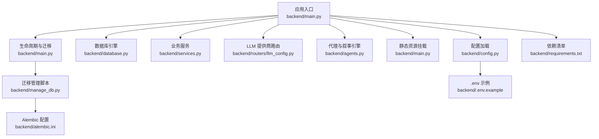
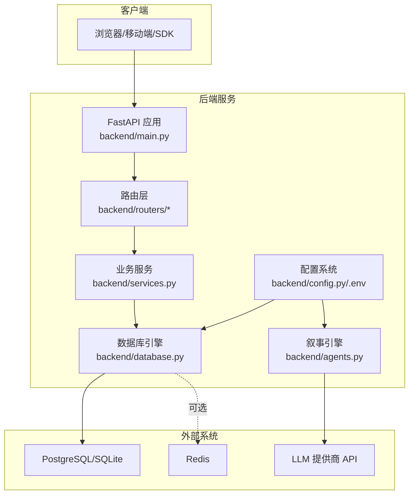
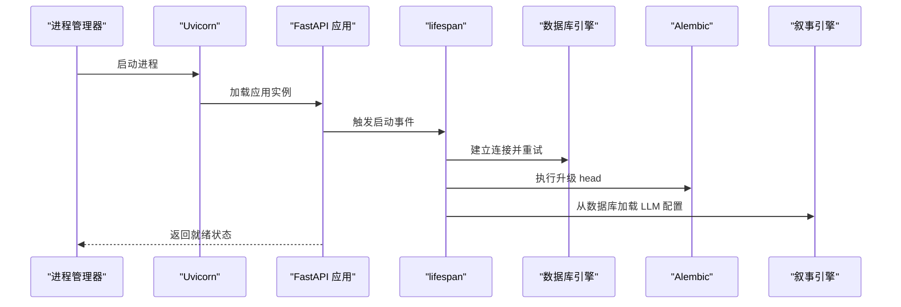
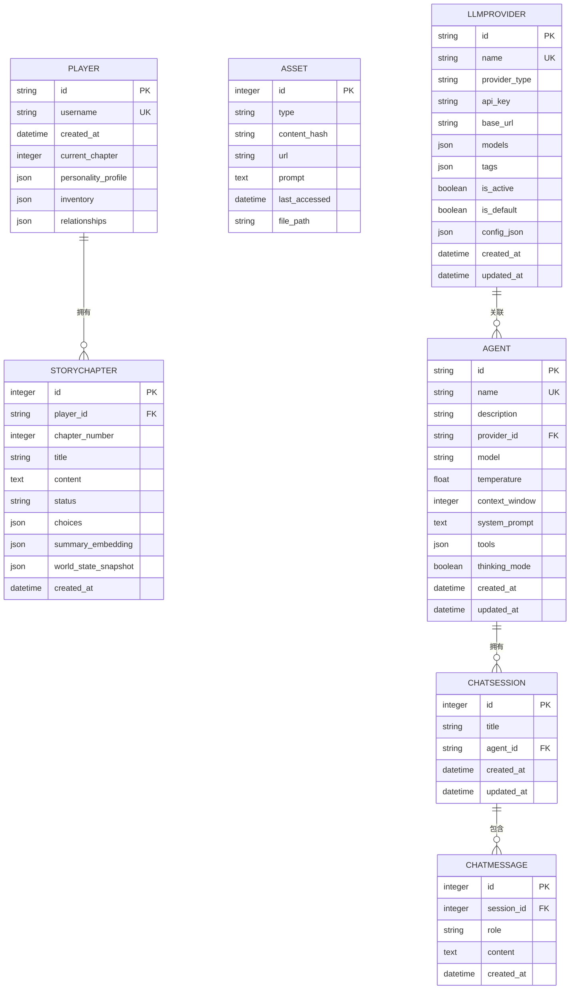
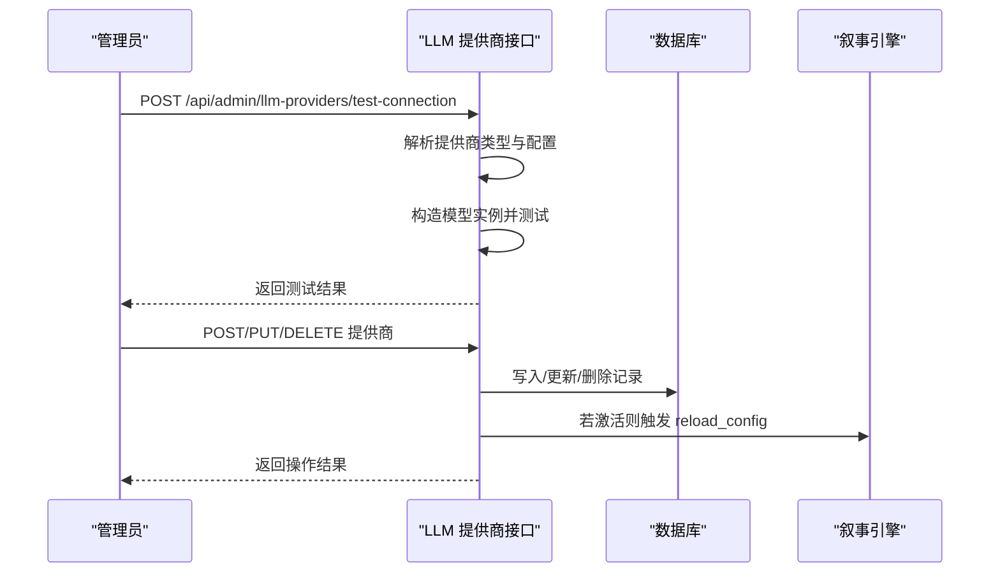
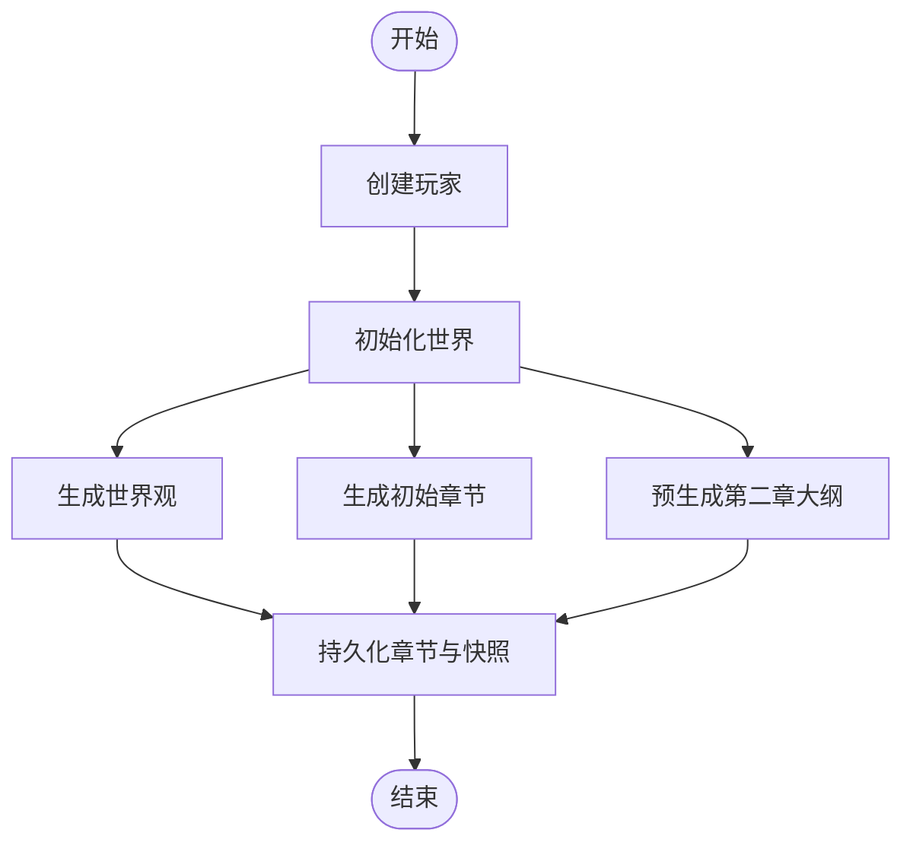
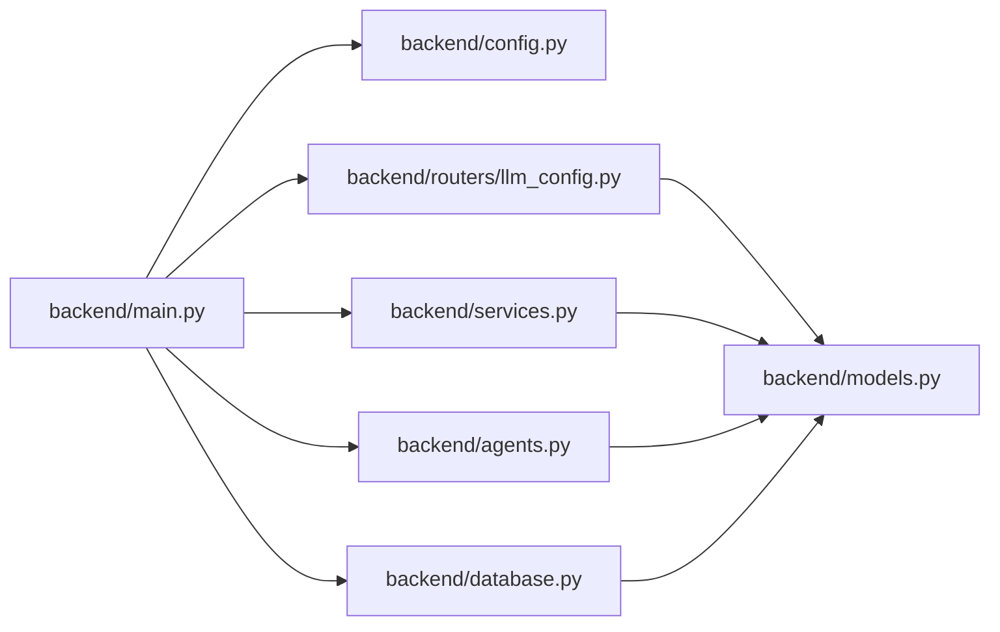

# 后端部署

<cite>
**本文引用的文件**
- [backend/main.py](file://backend/main.py)
- [backend/config.py](file://backend/config.py)
- [backend/.env.example](file://backend/.env.example)
- [backend/requirements.txt](file://backend/requirements.txt)
- [docs/wiki/Deployment.md](file://docs/wiki/Deployment.md)
- [backend/database.py](file://backend/database.py)
- [backend/services.py](file://backend/services.py)
- [backend/routers/llm_config.py](file://backend/routers/llm_config.py)
- [backend/models.py](file://backend/models.py)
- [backend/agents.py](file://backend/agents.py)
- [backend/manage_db.py](file://backend/manage_db.py)
- [backend/alembic.ini](file://backend/alembic.ini)
- [.gitignore](file://.gitignore)
</cite>

## 目录
1. [简介](#简介)
2. [项目结构](#项目结构)
3. [核心组件](#核心组件)
4. [架构总览](#架构总览)
5. [详细组件分析](#详细组件分析)
6. [依赖关系分析](#依赖关系分析)
7. [性能考虑](#性能考虑)
8. [故障排查指南](#故障排查指南)
9. [结论](#结论)
10. [附录](#附录)

## 简介
本指南面向运维与开发团队，提供后端服务的完整部署方案，覆盖虚拟环境创建、依赖安装、启动脚本使用、配置项说明（数据库、Redis、LLM 提供商）、生产优化（Uvicorn、并发与内存管理）、服务监控与健康检查、重启策略，以及容器化与 Kubernetes 编排思路。文档基于仓库现有实现进行提炼，并给出可操作的步骤与最佳实践。

## 项目结构
后端采用 FastAPI 应用，配合异步 SQLAlchemy、Alembic 迁移、AgentScope 对话引擎与多 LLM 提供商支持。核心目录与文件如下：
- 应用入口与生命周期：backend/main.py
- 配置加载：backend/config.py、backend/.env.example
- 依赖声明：backend/requirements.txt
- 数据库与模型：backend/database.py、backend/models.py
- 业务服务：backend/services.py
- LLM 提供商管理：backend/routers/llm_config.py
- 代理与叙事引擎：backend/agents.py
- 数据库迁移工具：backend/manage_db.py、backend/alembic.ini
- 一键部署参考：docs/wiki/Deployment.md
- 版本控制忽略规则：.gitignore

图表来源
- [backend/main.py](file://backend/main.py#L1-L173)
- [backend/config.py](file://backend/config.py#L1-L34)
- [backend/database.py](file://backend/database.py#L1-L31)
- [backend/services.py](file://backend/services.py#L1-L66)
- [backend/routers/llm_config.py](file://backend/routers/llm_config.py#L1-L203)
- [backend/agents.py](file://backend/agents.py#L1-L196)
- [backend/manage_db.py](file://backend/manage_db.py#L1-L67)
- [backend/alembic.ini](file://backend/alembic.ini#L1-L115)
- [backend/.env.example](file://backend/.env.example#L1-L4)
- [backend/requirements.txt](file://backend/requirements.txt#L1-L20)

章节来源
- [backend/main.py](file://backend/main.py#L1-L173)
- [docs/wiki/Deployment.md](file://docs/wiki/Deployment.md#L1-L65)

## 核心组件
- 应用入口与生命周期
  - 使用 lifespan 在启动时执行数据库连接与迁移，并尝试从数据库加载 LLM 配置。
  - 默认通过 Uvicorn 在 0.0.0.0:8000 启动，开发模式启用 reload。
- 配置系统
  - 通过 Pydantic Settings 加载 .env，支持数据库 URL、Redis URL、各 LLM 提供商密钥与默认模型名。
- 数据库层
  - 异步引擎与连接池配置，SQLite/PostgreSQL 双栈支持；连接池参数可按生产环境调整。
- 业务服务
  - 提供玩家创建、世界初始化、章节生成等核心流程。
- LLM 提供商管理
  - 支持测试连接、创建/查询/更新/删除提供商；动态切换当前活跃模型。
- 代理与叙事引擎
  - 基于 AgentScope 的对话代理与叙事流水线，支持多种提供商类型与模型。

章节来源
- [backend/main.py](file://backend/main.py#L45-L82)
- [backend/config.py](file://backend/config.py#L7-L34)
- [backend/database.py](file://backend/database.py#L8-L23)
- [backend/services.py](file://backend/services.py#L8-L66)
- [backend/routers/llm_config.py](file://backend/routers/llm_config.py#L14-L203)
- [backend/agents.py](file://backend/agents.py#L43-L196)

## 架构总览
下图展示后端服务在生产环境中的典型拓扑：客户端通过 FastAPI 接收请求，经由路由层进入业务服务，持久化到数据库并通过连接池管理；LLM 提供商配置由数据库驱动，叙事引擎按需初始化；Redis 用于缓存与会话状态（如需）。

图表来源
- [backend/main.py](file://backend/main.py#L83-L98)
- [backend/routers/llm_config.py](file://backend/routers/llm_config.py#L14-L18)
- [backend/services.py](file://backend/services.py#L19-L59)
- [backend/database.py](file://backend/database.py#L8-L23)
- [backend/config.py](file://backend/config.py#L15-L19)
- [backend/agents.py](file://backend/agents.py#L49-L99)

## 详细组件分析

### 应用生命周期与启动流程
- 生命周期钩子在启动阶段：
  - 重试数据库连接与执行 Alembic 升级。
  - 尝试从数据库加载 LLM 配置，若失败则回退至配置文件。
- 开发启动：直接运行 main.py，默认监听 0.0.0.0:8000，reload 开启。
- 生产建议：使用进程管理器（如 systemd 或 PM2）与反向代理（Nginx/Caddy）统一暴露端口。

图表来源
- [backend/main.py](file://backend/main.py#L45-L82)
- [backend/agents.py](file://backend/agents.py#L49-L75)

章节来源
- [backend/main.py](file://backend/main.py#L45-L82)
- [backend/agents.py](file://backend/agents.py#L49-L75)

### 配置系统与环境变量
- 数据库连接
  - 默认使用 SQLite（绝对路径），可通过 DATABASE_URL 切换为 PostgreSQL。
  - 连接池参数可在数据库层配置，生产建议根据并发与延迟调优。
- Redis
  - 默认 redis://localhost:6379/0，可用于会话、缓存或消息队列。
- LLM 提供商
  - 支持 OpenAI、Azure、DashScope、Anthropic、Gemini 等类型。
  - 通过 /api/admin/llm-providers 接口进行测试与管理。
- 生成设置
  - 故事与图像模型名称可配置，作为默认值参与生成。

章节来源
- [backend/config.py](file://backend/config.py#L11-L29)
- [backend/.env.example](file://backend/.env.example#L1-L4)
- [backend/routers/llm_config.py](file://backend/routers/llm_config.py#L20-L111)

### 数据库与模型
- 引擎与连接池
  - echo 关闭、pool_pre_ping、pool_size、max_overflow 等参数可调。
  - SQLite 场景下启用 check_same_thread 兼容。
- 模型设计
  - 玩家、章节、资产、LLM 提供商、聊天会话与消息、智能体等表结构清晰，支持异步 ORM 访问。

图表来源
- [backend/models.py](file://backend/models.py#L9-L122)
- [backend/database.py](file://backend/database.py#L25-L31)

章节来源
- [backend/database.py](file://backend/database.py#L8-L23)
- [backend/models.py](file://backend/models.py#L9-L122)

### LLM 提供商管理流程
- 测试连接：根据提供商类型动态构造模型实例并发送测试消息。
- 创建/更新/删除：支持唯一性校验、默认标记互斥、激活状态触发引擎重载。
- 动态重载：当活动提供商变更时，通知叙事引擎重新初始化。

图表来源
- [backend/routers/llm_config.py](file://backend/routers/llm_config.py#L20-L111)
- [backend/routers/llm_config.py](file://backend/routers/llm_config.py#L112-L203)
- [backend/agents.py](file://backend/agents.py#L150-L152)

章节来源
- [backend/routers/llm_config.py](file://backend/routers/llm_config.py#L20-L111)
- [backend/routers/llm_config.py](file://backend/routers/llm_config.py#L112-L203)
- [backend/agents.py](file://backend/agents.py#L150-L152)

### 业务服务与世界初始化
- 创建玩家：写入玩家记录并返回标识。
- 初始化世界：通过叙事引擎生成世界观与初始章节内容，预生成后续章节大纲，持久化到数据库。
- 处理玩家选择：预留扩展点，支持一致性检查与下一章生成。

图表来源
- [backend/services.py](file://backend/services.py#L19-L59)

章节来源
- [backend/services.py](file://backend/services.py#L12-L59)

### 部署与启动脚本使用
- 前置条件：Python 3.10+、Node.js 18+、PostgreSQL、Redis、Git。
- 数据库准备：启动 PostgreSQL 服务并创建数据库；启动 Redis。
- 后端部署：复制 .env.example 为 .env，填写 OPENAI_API_KEY、DATABASE_URL、REDIS_URL；运行启动脚本自动创建虚拟环境并安装依赖；成功后 Uvicorn 在 0.0.0.0:8000 启动。
- 验证部署：访问前端页面，确认连接与故事流式输出。

章节来源
- [docs/wiki/Deployment.md](file://docs/wiki/Deployment.md#L5-L65)

## 依赖关系分析
- 组件耦合
  - main.py 依赖 config.py、database.py、services.py、routers/*、agents.py。
  - routers 依赖 models 与 database 的依赖注入。
  - agents.py 依赖 models 与 database 以读取 LLM 提供商配置。
- 外部依赖
  - FastAPI、Uvicorn、SQLAlchemy、Pydantic、AgentScope、Redis、PostgreSQL/SQLite、Alembic。
- 潜在循环依赖
  - 当前模块间为单向依赖，未发现循环导入。

图表来源
- [backend/main.py](file://backend/main.py#L30-L43)
- [backend/routers/llm_config.py](file://backend/routers/llm_config.py#L1-L18)
- [backend/services.py](file://backend/services.py#L1-L6)
- [backend/agents.py](file://backend/agents.py#L1-L8)
- [backend/models.py](file://backend/models.py#L1-L4)

章节来源
- [backend/main.py](file://backend/main.py#L30-L43)
- [backend/routers/llm_config.py](file://backend/routers/llm_config.py#L1-L18)
- [backend/services.py](file://backend/services.py#L1-L6)
- [backend/agents.py](file://backend/agents.py#L1-L8)
- [backend/models.py](file://backend/models.py#L1-L4)

## 性能考虑
- Uvicorn 服务器配置
  - 生产建议使用多 worker 与合适的 threads，结合反向代理与负载均衡。
  - 限制并发连接数与请求体大小，开启 gzip/压缩（由反向代理处理）。
- 并发与内存管理
  - 数据库连接池：根据峰值 QPS 与平均响应时间设定 pool_size 与 max_overflow。
  - 事件循环：Windows 下已设置事件循环策略，避免异步兼容问题。
  - 日志级别：关闭 SQLAlchemy 与 Uvicorn 访问日志，降低 IO 压力。
- LLM 生成优化
  - 使用测试接口验证提供商连通性与延迟。
  - 对长上下文模型启用分段或摘要复用，减少 token 消耗。
- 缓存与会话
  - Redis 可用于会话缓存、节流与热点数据存储，注意过期策略与内存淘汰。

章节来源
- [backend/main.py](file://backend/main.py#L14-L28)
- [backend/database.py](file://backend/database.py#L8-L17)
- [backend/routers/llm_config.py](file://backend/routers/llm_config.py#L20-L111)

## 故障排查指南
- 数据库连接失败
  - 检查 DATABASE_URL 用户名与密码是否与本地 Postgres 一致；确认服务已启动。
- LLM 提供商错误
  - 确认 .env 中 API Key 正确且账户有额度；使用测试连接接口验证。
- WebSocket 连接断开
  - 检查后端服务是否运行、端口是否被占用；查看日志定位异常。
- 启动阶段迁移失败
  - 查看生命周期日志中的重试次数与最终错误；确保 Alembic 环境正确。
- 连接池耗尽
  - 提升 pool_size 与 max_overflow，或优化慢查询与事务时长。

章节来源
- [docs/wiki/Deployment.md](file://docs/wiki/Deployment.md#L60-L65)
- [backend/main.py](file://backend/main.py#L48-L74)
- [backend/routers/llm_config.py](file://backend/routers/llm_config.py#L107-L111)

## 结论
本指南基于仓库现有实现，提供了从环境准备、依赖安装、配置管理到生产优化与运维保障的完整路径。建议在生产环境中结合反向代理、进程管理器与监控告警体系，持续评估数据库连接池与 LLM 生成性能，确保服务稳定与可扩展。

## 附录

### A. 配置项一览
- 数据库
  - DATABASE_URL：数据库连接字符串（默认 SQLite，可切换 PostgreSQL）
- Redis
  - REDIS_URL：Redis 连接字符串
- LLM 提供商
  - OPENAI_API_KEY、CLAUDE_API_KEY、GEMINI_API_KEY：各提供商密钥
  - STORY_GENERATION_MODEL、IMAGE_GENERATION_MODEL：默认生成模型名
- 其他
  - PROJECT_NAME、VERSION：项目元信息

章节来源
- [backend/config.py](file://backend/config.py#L7-L34)
- [backend/.env.example](file://backend/.env.example#L1-L4)

### B. 数据库迁移与版本管理
- 迁移命令
  - 新建迁移：python manage_db.py migrate "描述"
  - 应用迁移：python manage_db.py upgrade
  - 回滚迁移：python manage_db.py downgrade
- Alembic 配置
  - script_location、prepend_sys_path、loggers 等已在配置文件中定义。

章节来源
- [backend/manage_db.py](file://backend/manage_db.py#L20-L67)
- [backend/alembic.ini](file://backend/alembic.ini#L3-L50)

### C. 容器化与 Kubernetes 编排思路
- 容器镜像构建要点
  - 基于 Python 3.10+ 官方镜像，COPY 依赖清单后执行 pip 安装，再 COPY 源码。
  - 使用非 root 用户运行，设置工作目录与环境变量。
  - 暴露 8000 端口，使用健康检查探测 /（或自定义健康端点）。
- Kubernetes 部署建议
  - Deployment：副本数、滚动更新策略、资源限制与请求。
  - Service：ClusterIP/LoadBalancer，端口映射 8000:8000。
  - ConfigMap：存放 .env 或环境变量键值对。
  - Secret：存放敏感信息（如 API Key、数据库密码）。
  - PVC：持久化数据库文件（SQLite）或挂载 Redis 数据卷。
  - HPA：根据 CPU/自定义指标扩缩容。
- 健康检查与就绪探针
  - HTTP GET /，成功即视为健康；就绪探针可增加延迟以等待数据库迁移完成。
- 重启策略
  - 优雅退出：接收 SIGTERM 后停止新请求，处理完在途任务再退出。
  - Pod 重启：避免频繁重启，必要时使用 PodDisruptionBudget。

[本节为概念性指导，不直接分析具体源文件，故不附加“章节来源”]