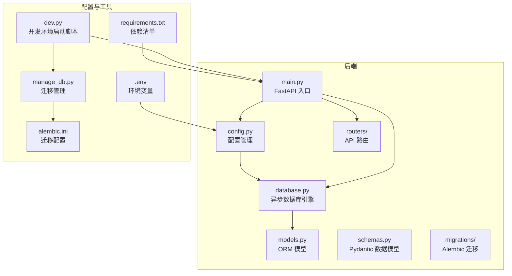
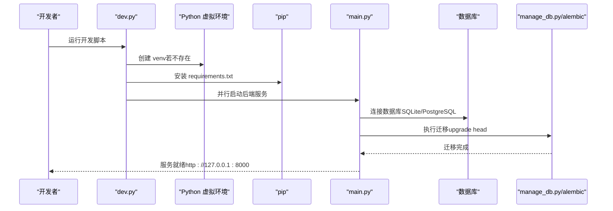
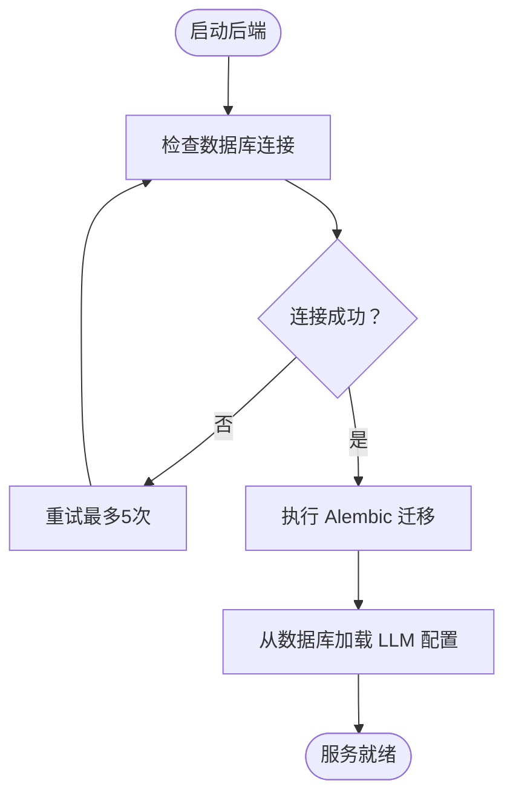
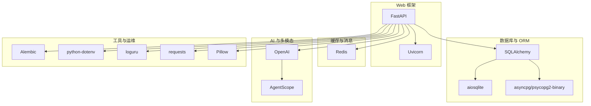

# 基础部署流程

<cite>
**本文引用的文件**
- [README.md](file://README.md)
- [Deployment.md](file://docs/wiki/Deployment.md)
- [Backend-Guide.md](file://docs/wiki/Backend-Guide.md)
- [.env.example](file://backend/.env.example)
- [requirements.txt](file://backend/requirements.txt)
- [config.py](file://backend/config.py)
- [database.py](file://backend/database.py)
- [main.py](file://backend/main.py)
- [dev.py](file://dev.py)
- [manage_db.py](file://backend/manage_db.py)
- [alembic.ini](file://backend/alembic.ini)
- [models.py](file://backend/models.py)
- [schemas.py](file://backend/schemas.py)
</cite>

## 目录
1. [简介](#简介)
2. [项目结构](#项目结构)
3. [核心组件](#核心组件)
4. [架构总览](#架构总览)
5. [详细组件分析](#详细组件分析)
6. [依赖分析](#依赖分析)
7. [性能考虑](#性能考虑)
8. [故障排除指南](#故障排除指南)
9. [结论](#结论)
10. [附录](#附录)

## 简介
本指南面向新手开发者，提供从零开始搭建后端服务的完整步骤，覆盖以下关键环节：
- Python 虚拟环境创建与激活
- 依赖安装与启动脚本使用
- .env 配置文件设置（数据库、Redis、LLM 提供商 API 密钥）
- Windows 环境下的具体命令与注意事项
- 环境验证步骤与常见错误排查

目标是让初学者能够在本地快速完成开发环境搭建，并顺利启动后端服务。

## 项目结构
后端采用 FastAPI + 异步数据库 + 管理后台的分层架构，核心目录与职责如下：
- backend/admin：管理后台前端（Next.js）
- backend/routers：API 路由模块（admin、llm_config、agents、chats）
- backend：后端核心代码（main.py、config.py、database.py、models.py、schemas.py、services.py、tasks.py）
- backend/migrations：数据库迁移脚本（Alembic）
- docs/wiki：项目文档（包含部署与后端指南）

图表来源
- [main.py](file://backend/main.py#L1-L173)
- [config.py](file://backend/config.py#L1-L34)
- [database.py](file://backend/database.py#L1-L31)
- [models.py](file://backend/models.py#L1-L122)
- [schemas.py](file://backend/schemas.py#L1-L102)
- [.env.example](file://backend/.env.example#L1-L4)
- [requirements.txt](file://backend/requirements.txt#L1-L20)
- [dev.py](file://dev.py#L1-L150)
- [manage_db.py](file://backend/manage_db.py#L1-L67)
- [alembic.ini](file://backend/alembic.ini#L1-L115)

章节来源
- [README.md](file://README.md#L34-L51)
- [Backend-Guide.md](file://docs/wiki/Backend-Guide.md#L3-L21)

## 核心组件
- 配置管理（config.py）：集中管理数据库、Redis、LLM 提供商 API 密钥等配置项，默认从 .env 加载。
- 数据库（database.py）：创建异步引擎与会话工厂，支持 SQLite/PostgreSQL，启用连接池与自动重连。
- 应用入口（main.py）：FastAPI 应用，注册路由、CORS 中间件，启动时自动执行数据库迁移。
- 开发脚本（dev.py）：自动化创建虚拟环境、安装依赖、并行启动后端、前端与管理后台。
- 迁移管理（manage_db.py + alembic.ini）：提供迁移脚本生成、升级、回滚命令。

章节来源
- [config.py](file://backend/config.py#L1-L34)
- [database.py](file://backend/database.py#L1-L31)
- [main.py](file://backend/main.py#L1-L173)
- [dev.py](file://dev.py#L1-L150)
- [manage_db.py](file://backend/manage_db.py#L1-L67)
- [alembic.ini](file://backend/alembic.ini#L1-L115)

## 架构总览
后端服务启动流程包含环境准备、依赖安装、数据库迁移与服务启动四个阶段；同时支持通过管理脚本一键启动前后端与管理后台。

图表来源
- [dev.py](file://dev.py#L25-L42)
- [dev.py](file://dev.py#L109-L111)
- [main.py](file://backend/main.py#L45-L81)
- [manage_db.py](file://backend/manage_db.py#L30-L38)
- [alembic.ini](file://backend/alembic.ini#L1-L115)

## 详细组件分析

### 环境准备与虚拟环境
- 在 Windows 环境下，推荐使用 Python 3.10+，并创建独立的虚拟环境以避免全局依赖冲突。
- 开发脚本会自动检测并创建 venv，然后安装 requirements.txt 中的依赖。
- 激活虚拟环境后，再执行后端启动命令。

章节来源
- [README.md](file://README.md#L55-L84)
- [dev.py](file://dev.py#L25-L42)

### 依赖安装与启动脚本
- 依赖清单位于 requirements.txt，包含 FastAPI、Uvicorn、SQLAlchemy、Redis、AgentScope、OpenAI 等。
- 启动脚本 dev.py 会：
  - 创建并激活虚拟环境
  - 安装依赖
  - 并行启动后端（Uvicorn）、前端（Next.js）与管理后台（Next.js）
- Windows 环境下，脚本会使用 asyncio 循环策略以适配异步数据库驱动。

章节来源
- [requirements.txt](file://backend/requirements.txt#L1-L20)
- [dev.py](file://dev.py#L109-L131)
- [main.py](file://backend/main.py#L6-L11)

### .env 配置文件设置
- 复制 .env.example 为 .env 并根据本地环境填写以下关键配置：
  - 数据库连接：DATABASE_URL（默认 SQLite，可改为 PostgreSQL）
  - Redis 连接：REDIS_URL（默认本地 Redis）
  - LLM 提供商 API 密钥：OPENAI_API_KEY（可选，可在后台动态配置）
- 配置加载由 config.py 通过 pydantic-settings 从 .env 文件读取。

章节来源
- [.env.example](file://backend/.env.example#L1-L4)
- [config.py](file://backend/config.py#L1-L34)
- [README.md](file://README.md#L76-L78)

### 数据库与迁移
- 数据库引擎在 database.py 中创建，支持 SQLite 与 PostgreSQL，连接池参数可调。
- 应用启动时，main.py 会自动执行 Alembic 迁移（upgrade head），确保数据库结构与模型一致。
- 如需手动管理迁移，可使用 manage_db.py 提供的 migrate、upgrade、downgrade 命令。

图表来源
- [main.py](file://backend/main.py#L45-L81)
- [manage_db.py](file://backend/manage_db.py#L30-L38)
- [alembic.ini](file://backend/alembic.ini#L1-L115)

章节来源
- [database.py](file://backend/database.py#L1-L31)
- [main.py](file://backend/main.py#L45-L81)
- [manage_db.py](file://backend/manage_db.py#L1-L67)
- [alembic.ini](file://backend/alembic.ini#L1-L115)

### API 路由与服务层
- main.py 注册多个路由模块（llm_config、admin、agents、chats），并提供基础 API 与 WebSocket。
- 业务逻辑集中在 services.py，数据模型与 Pydantic 校验模型分别在 models.py 与 schemas.py 中定义。

章节来源
- [main.py](file://backend/main.py#L94-L97)
- [Backend-Guide.md](file://docs/wiki/Backend-Guide.md#L41-L46)
- [models.py](file://backend/models.py#L1-L122)
- [schemas.py](file://backend/schemas.py#L1-L102)

## 依赖分析
后端依赖主要分为以下几类：
- Web 框架与服务器：FastAPI、Uvicorn
- 数据库与 ORM：SQLAlchemy（异步）、aiosqlite、asyncpg、psycopg2-binary
- 缓存与消息：Redis
- AI 与多模态：AgentScope、OpenAI
- 工具与运维：Alembic、python-dotenv、loguru、requests、Pillow

图表来源
- [requirements.txt](file://backend/requirements.txt#L1-L20)
- [config.py](file://backend/config.py#L1-L34)
- [database.py](file://backend/database.py#L1-L31)

章节来源
- [requirements.txt](file://backend/requirements.txt#L1-L20)

## 性能考虑
- 异步数据库：使用 SQLAlchemy 异步引擎与连接池，提升高并发下的数据库吞吐能力。
- 连接池参数：pool_pre_ping、pool_size、max_overflow 可根据实际负载调整。
- 日志级别：对 SQLAlchemy 与 Uvicorn 的访问日志进行降噪，保留应用日志便于调试。
- Windows 兼容：设置事件循环策略与 UTF-8 编码，避免异步数据库与终端编码问题。

章节来源
- [database.py](file://backend/database.py#L8-L17)
- [main.py](file://backend/main.py#L14-L28)
- [main.py](file://backend/main.py#L6-L11)

## 故障排除指南
- 数据库连接失败
  - 检查 DATABASE_URL 是否正确（用户名、密码、主机、端口、数据库名）。
  - 确认 PostgreSQL/Redis 服务已启动。
- OpenAI API 错误
  - 确认 OPENAI_API_KEY 已正确填写，且账户有可用额度。
- WebSocket 连接断开
  - 检查后端服务是否正常运行，确认端口未被占用。
- 迁移失败
  - 使用 manage_db.py 手动执行迁移命令，查看错误日志。
- 启动脚本异常
  - 确保 Python 与 Node.js 版本满足前置要求，依赖安装完成后再次运行脚本。

章节来源
- [Deployment.md](file://docs/wiki/Deployment.md#L60-L65)
- [README.md](file://README.md#L86-L99)
- [manage_db.py](file://backend/manage_db.py#L1-L67)

## 结论
通过本指南，您可以在 Windows 环境下完成后端服务的完整部署流程：创建并激活虚拟环境、安装依赖、配置 .env、执行数据库迁移，并启动后端服务。配合开发脚本，还可并行启动前端与管理后台，实现一体化本地开发体验。遇到问题时，可依据故障排除指南逐项排查，确保开发环境稳定运行。

## 附录

### Windows 环境下的具体操作命令
- 进入后端目录并复制 .env 示例文件
  - PowerShell：copy .env.example .env
- 编辑 .env 文件，填入数据库、Redis 与 LLM API 密钥
- 运行开发脚本（自动创建虚拟环境并安装依赖）
  - PowerShell：..\start_backend.bat
- 启动后端服务（直接运行）
  - Python：python main.py
- 数据库迁移（可选）
  - 生成迁移：python manage_db.py migrate "描述变更内容"
  - 应用迁移：python manage_db.py upgrade
  - 回滚迁移：python manage_db.py downgrade

章节来源
- [Deployment.md](file://docs/wiki/Deployment.md#L26-L39)
- [README.md](file://README.md#L80-L99)
- [dev.py](file://dev.py#L109-L111)
- [manage_db.py](file://backend/manage_db.py#L20-L38)