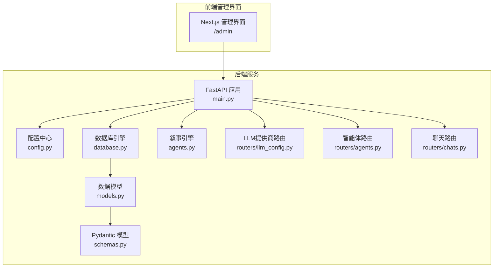
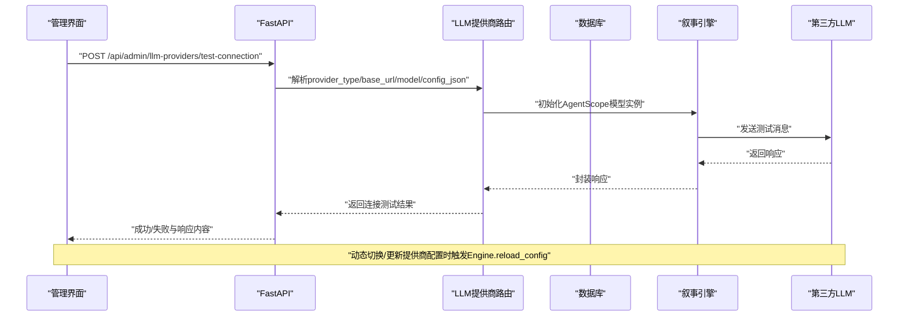
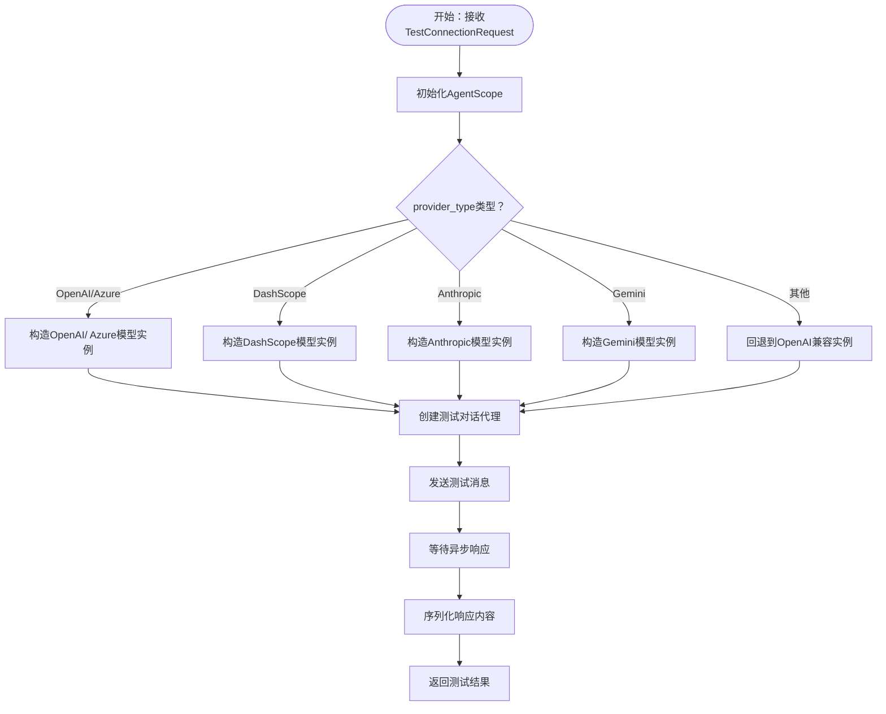
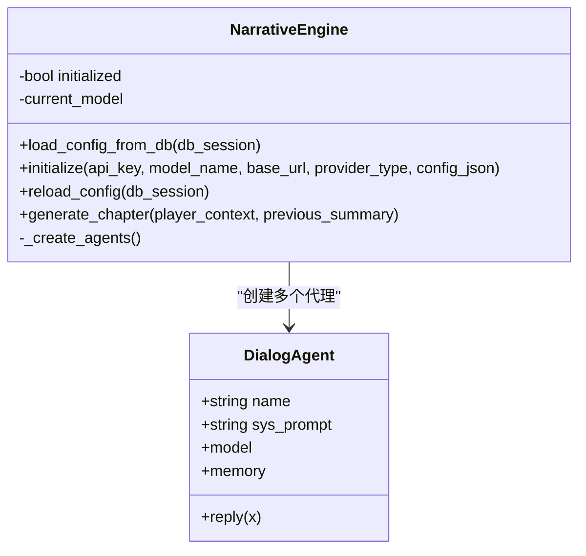
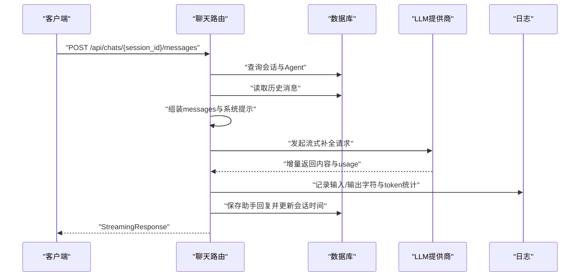
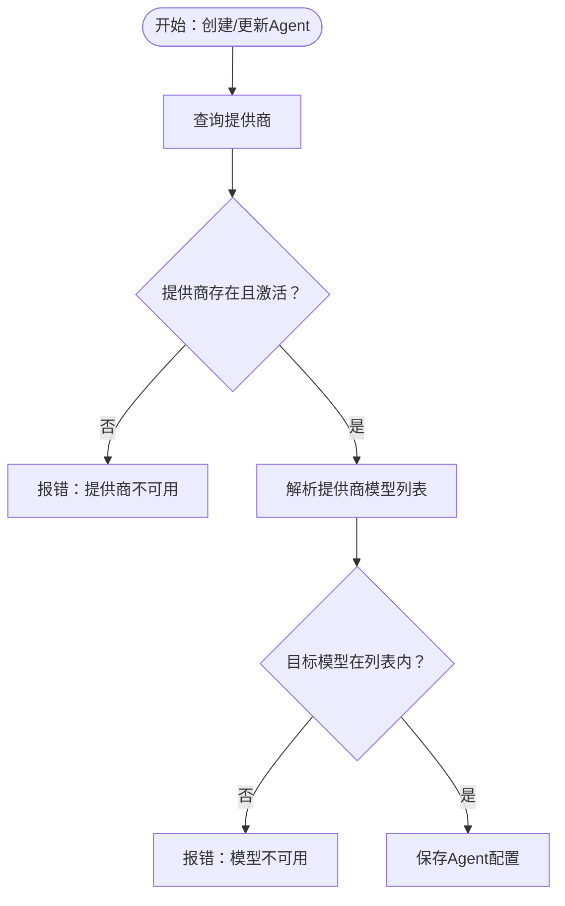
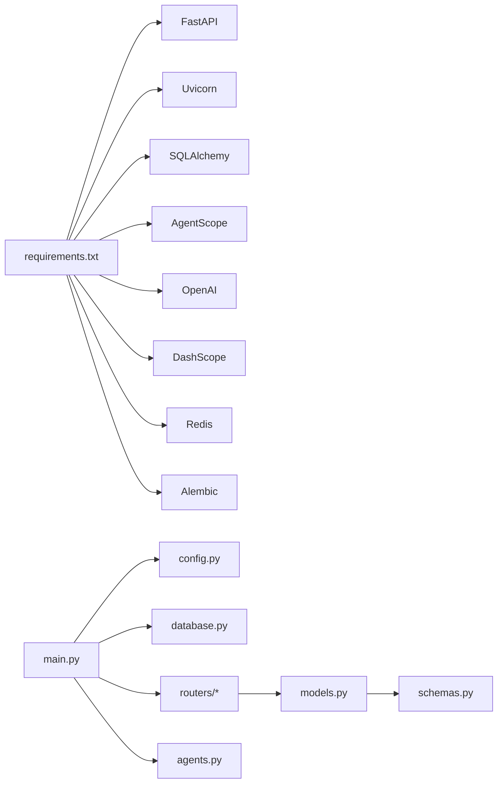

# LLM调用优化

<cite>
**本文引用的文件**
- [main.py](file://backend/main.py)
- [config.py](file://backend/config.py)
- [database.py](file://backend/database.py)
- [models.py](file://backend/models.py)
- [schemas.py](file://backend/schemas.py)
- [agents.py](file://backend/agents.py)
- [llm_config.py](file://backend/routers/llm_config.py)
- [chats.py](file://backend/routers/chats.py)
- [agents_router.py](file://backend/routers/agents.py)
- [requirements.txt](file://backend/requirements.txt)
- [index.ts](file://backend/admin/src/types/index.ts)
- [agent.ts](file://backend/admin/src/constants/agent.ts)
</cite>

## 目录
1. [引言](#引言)
2. [项目结构](#项目结构)
3. [核心组件](#核心组件)
4. [架构总览](#架构总览)
5. [详细组件分析](#详细组件分析)
6. [依赖关系分析](#依赖关系分析)
7. [性能考量与优化建议](#性能考量与优化建议)
8. [故障排查指南](#故障排查指南)
9. [结论](#结论)
10. [附录：配置示例与基准参考](#附录配置示例与基准参考)

## 引言
本指南面向需要在生产环境中稳定、高效地调用大语言模型（LLM）的工程团队，围绕以下主题提供系统化实践：LLM提供商选择策略、API调用频率限制与成本控制、提示词与上下文管理、token使用效率、响应缓存与批量/异步调用、性能监控与延迟分析、错误重试与多提供商负载均衡/故障转移/降级策略，并给出可直接落地的配置示例与性能基准参考。

## 项目结构
后端采用FastAPI + SQLAlchemy异步ORM + AgentScope集成多提供商LLM能力；前端为Next.js管理界面，通过REST接口与后端交互。数据库层支持SQLite与PostgreSQL，具备迁移能力；聊天路由提供流式输出与token统计；故事生成引擎基于AgentScope动态加载LLM配置。

图表来源
- [main.py](file://backend/main.py#L83-L98)
- [config.py](file://backend/config.py#L7-L33)
- [database.py](file://backend/database.py#L8-L23)
- [models.py](file://backend/models.py#L58-L79)
- [schemas.py](file://backend/schemas.py#L4-L41)
- [agents.py](file://backend/agents.py#L43-L196)
- [llm_config.py](file://backend/routers/llm_config.py#L14-L18)
- [agents_router.py](file://backend/routers/agents.py#L9-L13)
- [chats.py](file://backend/routers/chats.py#L16-L20)

章节来源
- [main.py](file://backend/main.py#L83-L98)
- [config.py](file://backend/config.py#L7-L33)
- [database.py](file://backend/database.py#L8-L23)
- [models.py](file://backend/models.py#L58-L79)
- [schemas.py](file://backend/schemas.py#L4-L41)
- [agents.py](file://backend/agents.py#L43-L196)
- [llm_config.py](file://backend/routers/llm_config.py#L14-L18)
- [agents_router.py](file://backend/routers/agents.py#L9-L13)
- [chats.py](file://backend/routers/chats.py#L16-L20)

## 核心组件
- 配置中心：集中管理数据库URL、Redis、各平台API Key与默认模型等。
- 数据库层：异步连接池、自动重连与连接参数优化。
- LLM提供商管理：支持OpenAI/Azure、DashScope、Anthropic、Gemini等，提供连接测试与动态切换。
- 叙事引擎：按活动提供商动态初始化AgentScope模型实例，支撑故事章节生成。
- 聊天路由：统一消息历史构建、流式输出、token统计与结果持久化。
- 智能体路由：校验提供商可用模型列表，确保调用一致性。
- 前端类型与常量：定义LLMProvider与Agent字段，便于管理界面正确展示与提交。

章节来源
- [config.py](file://backend/config.py#L7-L33)
- [database.py](file://backend/database.py#L8-L23)
- [llm_config.py](file://backend/routers/llm_config.py#L20-L111)
- [agents.py](file://backend/agents.py#L43-L196)
- [chats.py](file://backend/routers/chats.py#L72-L258)
- [agents_router.py](file://backend/routers/agents.py#L15-L55)
- [index.ts](file://backend/admin/src/types/index.ts#L1-L26)
- [agent.ts](file://backend/admin/src/constants/agent.ts#L1-L20)

## 架构总览
下图展示了从管理界面到LLM提供商的关键调用链路与数据流。

图表来源
- [llm_config.py](file://backend/routers/llm_config.py#L20-L111)
- [agents.py](file://backend/agents.py#L150-L152)

章节来源
- [llm_config.py](file://backend/routers/llm_config.py#L20-L111)
- [agents.py](file://backend/agents.py#L150-L152)

## 详细组件分析

### LLM提供商管理与连接测试
- 支持多种提供商类型（OpenAI/Azure、DashScope、Anthropic、Gemini），并允许自定义base_url以适配兼容接口。
- 提供“连接测试”接口，动态构造AgentScope模型实例并发送一条测试消息，返回成功/失败与响应内容，便于快速验证配置正确性。
- 当提供商被设为默认或激活时，触发叙事引擎重新加载配置，确保后续故事生成使用最新设置。

图表来源
- [llm_config.py](file://backend/routers/llm_config.py#L20-L111)
- [agents.py](file://backend/agents.py#L11-L42)

章节来源
- [llm_config.py](file://backend/routers/llm_config.py#L20-L111)
- [agents.py](file://backend/agents.py#L11-L42)

### 叙事引擎与动态模型初始化
- 从数据库读取当前活动提供商，解析模型列表与额外配置，初始化AgentScope模型实例。
- 创建多个角色代理（导演、叙述者、NPC管理器），用于分阶段生成故事大纲、正文与NPC状态更新。
- 支持在运行时通过API触发配置重载，保证配置变更即时生效。

图表来源
- [agents.py](file://backend/agents.py#L43-L196)

章节来源
- [agents.py](file://backend/agents.py#L43-L196)

### 聊天路由：消息历史、流式输出与token统计
- 接收用户消息，保存至会话历史。
- 构造系统提示+历史消息，按提供商类型选择对应客户端（OpenAI/Azure或DashScope）进行流式补全。
- 通过流式选项获取token统计（prompt_tokens、completion_tokens），并在日志中汇总输入/输出字符数与上下文占用比例。
- 将助手回复写入数据库并刷新会话时间戳。

图表来源
- [chats.py](file://backend/routers/chats.py#L72-L258)

章节来源
- [chats.py](file://backend/routers/chats.py#L72-L258)

### 智能体路由：模型可用性校验
- 在创建/更新智能体时，校验目标提供商是否已启用，以及所选模型是否在提供商的模型列表内。
- 支持JSON字符串或数组两种模型列表格式，自动解析并进行匹配。

图表来源
- [agents_router.py](file://backend/routers/agents.py#L15-L55)
- [agents_router.py](file://backend/routers/agents.py#L81-L126)

章节来源
- [agents_router.py](file://backend/routers/agents.py#L15-L55)
- [agents_router.py](file://backend/routers/agents.py#L81-L126)

## 依赖关系分析
- 外部依赖：FastAPI、Uvicorn、SQLAlchemy 2.x、AgentScope、OpenAI SDK、DashScope、Redis、Alembic等。
- 内部模块：配置、数据库、模型、路由、服务与AgentScope集成。
- 前端类型：管理界面通过类型定义与常量约束LLMProvider与Agent字段，确保后端接口一致性。

图表来源
- [requirements.txt](file://backend/requirements.txt#L1-L20)
- [main.py](file://backend/main.py#L30-L42)
- [config.py](file://backend/config.py#L7-L33)
- [database.py](file://backend/database.py#L8-L23)
- [models.py](file://backend/models.py#L58-L79)
- [schemas.py](file://backend/schemas.py#L4-L41)
- [agents.py](file://backend/agents.py#L1-L10)

章节来源
- [requirements.txt](file://backend/requirements.txt#L1-L20)
- [main.py](file://backend/main.py#L30-L42)
- [config.py](file://backend/config.py#L7-L33)
- [database.py](file://backend/database.py#L8-L23)
- [models.py](file://backend/models.py#L58-L79)
- [schemas.py](file://backend/schemas.py#L4-L41)
- [agents.py](file://backend/agents.py#L1-L10)

## 性能考量与优化建议

### 1) 提供商选择策略
- 成本优先：对比不同提供商的单价与上下文窗口，结合业务场景选择性价比高的模型。
- 速率与稳定性：优先选择具备更好SLA与低抖动的服务商；对高频场景准备备用提供商。
- 兼容性：通过base_url与config_json适配自建网关或兼容接口，降低迁移成本。

### 2) API调用频率限制与成本控制
- 使用连接池与并发限流：数据库连接池参数已在配置中设置，建议在应用层增加令牌桶/漏桶限流，避免突发流量冲击LLM。
- 批量与合并：对相似请求进行合并或批处理，减少往返次数。
- 缓存热点：对重复提示词与固定模板的结果进行缓存，显著降低调用次数与成本。

### 3) 提示词优化与上下文管理
- 明确角色与任务边界，减少歧义；将长上下文拆分为摘要与细节两段，仅在必要时携带完整历史。
- 控制温度与最大输出长度，平衡创造性与可控性。
- 使用“思维链”与“工具调用”减少重复推理与外部查询。

### 4) Token使用效率提升
- 通过流式输出与增量统计，实时掌握prompt_tokens与completion_tokens，及时截断或压缩上下文。
- 对历史消息进行摘要与去重，避免冗余信息进入模型。

### 5) 响应缓存策略
- 建议引入Redis缓存：以“提示词哈希+模型参数”为键，缓存LLM响应；对可复用的固定模板设置较长TTL。
- 对于故事生成等长文本，可缓存章节大纲与NPC状态，按需拼装正文。

### 6) 批量请求与异步调用
- 后端已采用异步FastAPI与异步数据库，建议在上游（如聊天路由）对多轮对话采用异步生成与流式返回，提升用户体验。
- 对批量任务（如预生成章节）使用后台任务队列，避免阻塞主线程。

### 7) 性能监控与延迟分析
- 日志埋点：在聊天路由中记录输入字符数、输出字符数、token统计与上下文占比，便于定位瓶颈。
- 指标采集：建议增加Prometheus/Grafana指标（如P95/P99延迟、错误率、调用量、缓存命中率）。

### 8) 错误重试与超时策略
- 对网络异常与服务端临时错误进行指数退避重试，避免雪崩效应。
- 设置合理超时阈值与取消策略，防止长时间挂起。

### 9) 多提供商负载均衡与故障转移
- 主备切换：当主提供商不可用时，自动切换到备用提供商；失败次数超过阈值后进入熔断。
- 负载均衡：按提供商权重分配请求，结合健康检查与延迟指标动态调整流量。

### 10) 降级策略
- 无LLM降级：当AI引擎未初始化或提供商不可用时，返回占位内容与引导信息，保证功能可用。
- 保守模式：降低温度、缩短输出、关闭工具调用，优先保证稳定性。

## 故障排查指南
- 连接测试失败
  - 检查API Key、base_url与模型名称是否正确。
  - 查看后端日志中的异常堆栈，确认AgentScope初始化与消息发送流程。
- 聊天流式输出中断
  - 确认提供商支持流式返回与usage统计；检查网络与超时设置。
  - 观察日志中的token统计与上下文占比，必要时缩短历史或压缩提示词。
- 智能体创建/更新失败
  - 核对提供商是否激活，模型是否在提供商模型列表内。
  - 若模型列表为JSON字符串，确认格式有效。

章节来源
- [llm_config.py](file://backend/routers/llm_config.py#L20-L111)
- [chats.py](file://backend/routers/chats.py#L112-L258)
- [agents_router.py](file://backend/routers/agents.py#L15-L55)

## 结论
通过将LLM提供商管理、动态配置加载、流式输出与token统计、数据库与缓存策略有机结合，本项目为大规模、高可用的LLM应用提供了坚实基础。建议在此基础上进一步完善限流、缓存、监控与多提供商治理能力，持续优化提示词与上下文管理，以实现更优的成本与性能表现。

## 附录：配置示例与基准参考

### 配置示例（路径参考）
- 数据库与Redis配置：见 [config.py](file://backend/config.py#L11-L20)
- LLM提供商创建/更新Schema：见 [schemas.py](file://backend/schemas.py#L4-L41)
- 前端类型定义（LLMProvider/Agent）：见 [index.ts](file://backend/admin/src/types/index.ts#L1-L26)
- 默认Agent字段与工具枚举：见 [agent.ts](file://backend/admin/src/constants/agent.ts#L1-L20)

### 性能基准参考（示例思路）
- 延迟指标：P50/P95/P99请求延迟、流式首字节延迟。
- 成本指标：平均单次调用成本、每千tokens成本、缓存命中率。
- 稳定性指标：错误率、超时率、重试次数、熔断触发次数。
- 上下文效率：平均上下文占比、历史消息压缩比、token使用增长趋势。