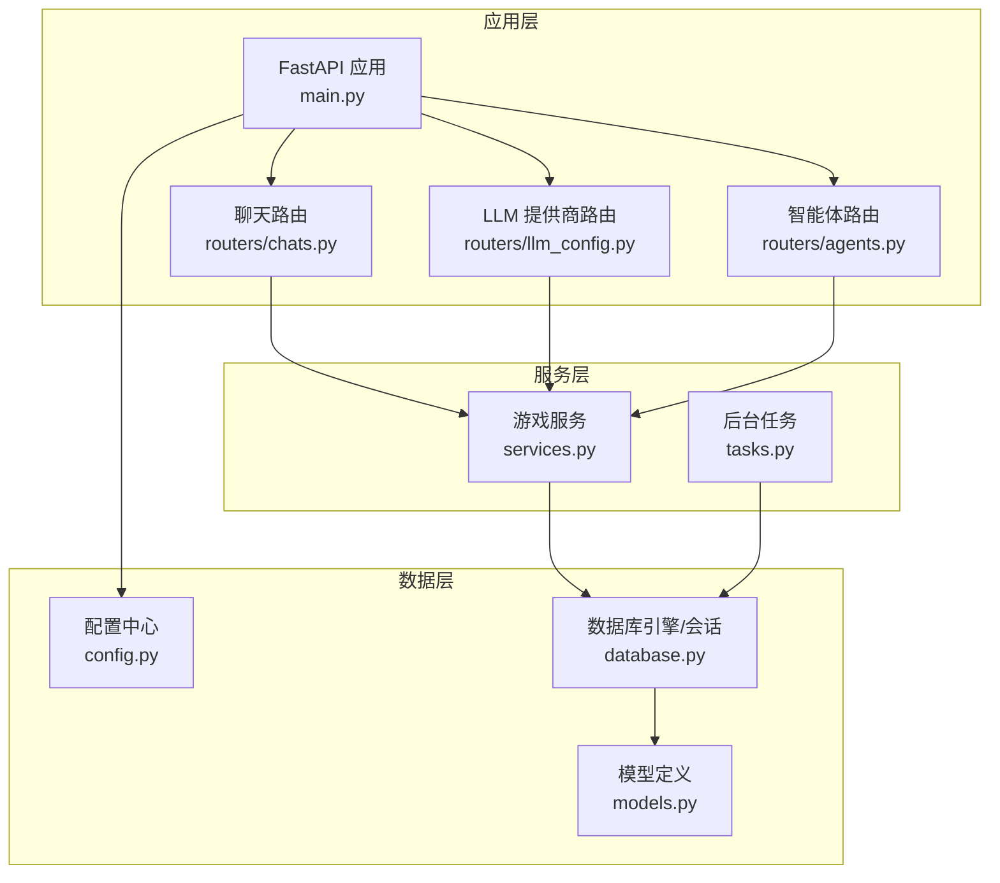
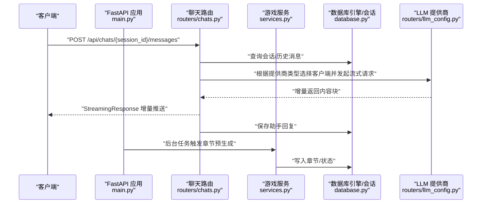
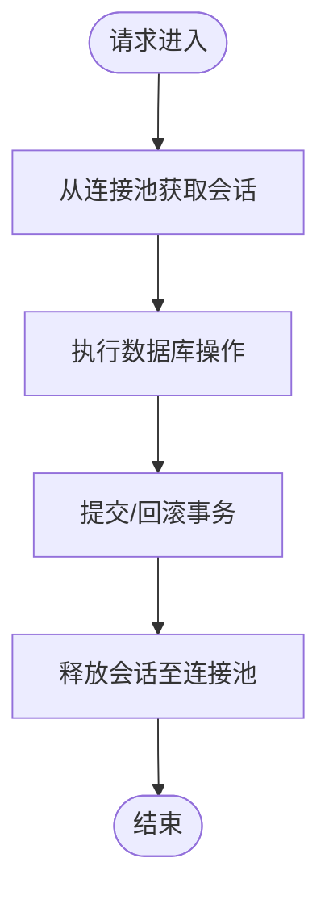
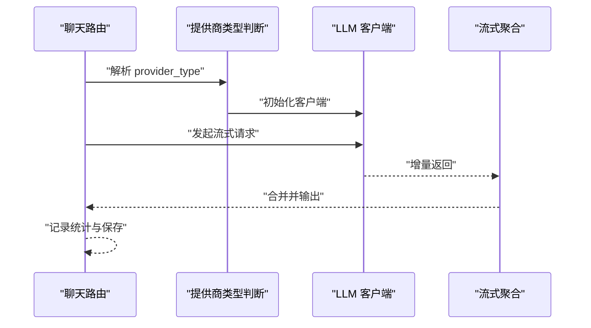
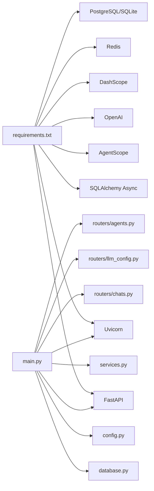

# 性能优化

<cite>
**本文引用的文件**
- [backend/main.py](file://backend/main.py)
- [backend/config.py](file://backend/config.py)
- [backend/database.py](file://backend/database.py)
- [backend/services.py](file://backend/services.py)
- [backend/tasks.py](file://backend/tasks.py)
- [backend/routers/chats.py](file://backend/routers/chats.py)
- [backend/routers/llm_config.py](file://backend/routers/llm_config.py)
- [backend/routers/agents.py](file://backend/routers/agents.py)
- [backend/models.py](file://backend/models.py)
- [backend/schemas.py](file://backend/schemas.py)
- [backend/requirements.txt](file://backend/requirements.txt)
</cite>

## 目录
1. [引言](#引言)
2. [项目结构](#项目结构)
3. [核心组件](#核心组件)
4. [架构总览](#架构总览)
5. [详细组件分析](#详细组件分析)
6. [依赖关系分析](#依赖关系分析)
7. [性能考量与优化建议](#性能考量与优化建议)
8. [故障排查指南](#故障排查指南)
9. [结论](#结论)
10. [附录：基准测试与压测方法](#附录基准测试与压测方法)

## 引言
本指南面向后端服务性能优化，聚焦于 Uvicorn 服务器配置、并发与线程池、内存管理、数据库连接池、Redis 缓存策略、LLM 调用优化、性能监控与基准测试、负载与压力测试、瓶颈识别、资源限制与超时配置、错误重试机制，以及生产环境最佳实践与案例研究。文档基于仓库现有实现进行分析，并给出可落地的优化建议。

## 项目结构
后端采用 FastAPI + SQLAlchemy Async 架构，结合异步聊天流式响应、后台任务预生成章节内容、LLM 提供商配置与连接测试等能力。关键模块包括：
- 应用入口与生命周期：FastAPI 应用、CORS 中间件、路由注册、Uvicorn 启动
- 配置中心：统一读取数据库、Redis、模型密钥与默认模型
- 数据层：异步引擎、会话工厂、模型定义
- 业务服务：玩家与故事初始化、章节生成与资产生成
- 路由器：聊天流式对话、LLM 提供商管理、智能体管理
- 依赖声明：Python 包版本与运行时依赖

图表来源
- [backend/main.py](file://backend/main.py#L83-L98)
- [backend/routers/chats.py](file://backend/routers/chats.py#L16-L20)
- [backend/routers/llm_config.py](file://backend/routers/llm_config.py#L14-L18)
- [backend/routers/agents.py](file://backend/routers/agents.py#L9-L13)
- [backend/services.py](file://backend/services.py#L8-L11)
- [backend/tasks.py](file://backend/tasks.py#L1-L6)
- [backend/config.py](file://backend/config.py#L7-L34)
- [backend/database.py](file://backend/database.py#L6-L23)
- [backend/models.py](file://backend/models.py#L1-L122)

章节来源
- [backend/main.py](file://backend/main.py#L1-L173)
- [backend/config.py](file://backend/config.py#L1-L34)
- [backend/database.py](file://backend/database.py#L1-L31)
- [backend/services.py](file://backend/services.py#L1-L66)
- [backend/tasks.py](file://backend/tasks.py#L1-L62)
- [backend/routers/chats.py](file://backend/routers/chats.py#L1-L275)
- [backend/routers/llm_config.py](file://backend/routers/llm_config.py#L1-L203)
- [backend/routers/agents.py](file://backend/routers/agents.py#L1-L141)
- [backend/models.py](file://backend/models.py#L1-L122)
- [backend/schemas.py](file://backend/schemas.py#L1-L102)
- [backend/requirements.txt](file://backend/requirements.txt#L1-L20)

## 核心组件
- 应用入口与生命周期
  - 使用 lifespan 管理数据库连接与迁移；关闭 SQLAlchemy 与 Uvicorn 访问日志以降低噪声；注册 CORS 与路由。
- 配置中心
  - 统一读取数据库 URL、Redis URL、各平台 API Key、默认模型名称等；支持 .env 文件覆盖。
- 数据库层
  - 异步引擎与会话工厂；SQLite 默认，可切换 PostgreSQL；启用 pool_pre_ping、合理设置 pool_size 与 max_overflow。
- 业务服务
  - 创建玩家、初始化世界、章节生成、章节预生成与资产生成；与 LLM 引擎交互。
- 路由器
  - 聊天流式响应（OpenAI/DashScope 等）、LLM 提供商增删改查与连接测试、智能体增删改查。
- 模型与序列化
  - 定义玩家、章节、资产、LLM 提供商、会话、消息、智能体等实体；Pydantic 模型用于请求/响应校验。

章节来源
- [backend/main.py](file://backend/main.py#L45-L82)
- [backend/config.py](file://backend/config.py#L7-L34)
- [backend/database.py](file://backend/database.py#L6-L23)
- [backend/services.py](file://backend/services.py#L8-L66)
- [backend/tasks.py](file://backend/tasks.py#L7-L62)
- [backend/routers/chats.py](file://backend/routers/chats.py#L72-L258)
- [backend/routers/llm_config.py](file://backend/routers/llm_config.py#L20-L111)
- [backend/routers/agents.py](file://backend/routers/agents.py#L15-L141)
- [backend/models.py](file://backend/models.py#L9-L122)
- [backend/schemas.py](file://backend/schemas.py#L4-L102)

## 架构总览
下图展示从客户端到数据库与 LLM 的关键调用链路，以及后台任务的补充生成路径。

图表来源
- [backend/main.py](file://backend/main.py#L128-L173)
- [backend/routers/chats.py](file://backend/routers/chats.py#L72-L258)
- [backend/services.py](file://backend/services.py#L19-L59)
- [backend/database.py](file://backend/database.py#L28-L31)
- [backend/routers/llm_config.py](file://backend/routers/llm_config.py#L20-L111)

## 详细组件分析

### Uvicorn 服务器与并发配置
- 当前启动方式
  - 在应用入口直接通过 Uvicorn 运行，未显式设置 workers、threads、backlog 等参数。
- 建议
  - 生产环境使用 ASGI 服务器（如 Hypercorn/Gunicorn with uvicorn worker）部署，配合多进程与线程池。
  - 根据 CPU 核心数设置 workers；根据 I/O 密集度设置 threads；合理设置 backlog 与 keepalive。
  - 对于长连接与高并发 WebSocket，关注 uvicorn 的 queue_class、backlog、http_max_headers 等参数。
  - 为日志输出设置合适的级别，避免在高吞吐场景中产生 I/O 抖动。

章节来源
- [backend/main.py](file://backend/main.py#L171-L173)

### 数据库连接池与会话管理
- 连接池配置现状
  - 启用 pool_pre_ping；pool_size=10，max_overflow=20；SQLite 使用 connect_args。
- 建议
  - PostgreSQL 生产环境建议：pool_size 依据并发请求数与数据库最大连接数设定；max_overflow 控制突发流量；pool_recycle 与 pool_pre_ping 防止连接失效。
  - 使用 async_sessionmaker 的 expire_on_commit=False 可减少刷新开销，但需谨慎处理对象状态一致性。
  - 将数据库连接与迁移放在独立流程或容器启动脚本中执行，避免阻塞主服务启动。

图表来源
- [backend/database.py](file://backend/database.py#L6-L23)
- [backend/database.py](file://backend/database.py#L28-L31)

章节来源
- [backend/database.py](file://backend/database.py#L6-L23)
- [backend/database.py](file://backend/database.py#L28-L31)

### 内存管理与对象生命周期
- 现状
  - 使用 Pydantic 模型进行请求/响应序列化；聊天路由中构建消息列表并记录日志。
- 建议
  - 流式响应时，避免一次性拼接过长文本；按块输出，及时释放中间变量。
  - 对历史消息长度与上下文窗口进行限制，防止 OOM。
  - 使用分页查询与 LIMIT/OFFSET 控制结果集大小。

章节来源
- [backend/routers/chats.py](file://backend/routers/chats.py#L112-L258)
- [backend/schemas.py](file://backend/schemas.py#L4-L102)

### Redis 缓存策略
- 现状
  - 配置中心提供 REDIS_URL，默认本地 Redis。
- 建议
  - 针对高频查询（如 LLM 提供商列表、智能体元数据、会话历史摘要）建立缓存键空间与 TTL。
  - 使用 pipeline 批量写入；对热点数据设置更短 TTL 并定期预热。
  - 结合数据库变更事件，采用缓存失效策略（写后失效）保证一致性。

章节来源
- [backend/config.py](file://backend/config.py#L18-L20)

### LLM 调用优化
- 现状
  - 路由根据提供商类型选择客户端（OpenAI/Azure/OpenAI 兼容、DashScope），开启流式返回与 token 统计。
- 建议
  - 上下文截断：按 context_window 限制历史消息长度，优先保留最近有效片段。
  - 流式聚合：客户端侧合并增量内容，减少网络往返与前端渲染压力。
  - 超时与重试：为 LLM 调用设置合理超时与指数退避重试；区分网络错误与业务错误。
  - 模型选择：根据任务复杂度选择合适模型；对简单任务使用轻量模型以降低成本。
  - 日志与指标：记录输入/输出字符数、token 使用、响应时间、错误率，便于成本与性能分析。

图表来源
- [backend/routers/chats.py](file://backend/routers/chats.py#L145-L209)
- [backend/routers/llm_config.py](file://backend/routers/llm_config.py#L32-L87)

章节来源
- [backend/routers/chats.py](file://backend/routers/chats.py#L112-L258)
- [backend/routers/llm_config.py](file://backend/routers/llm_config.py#L20-L111)

### 后台任务与预生成
- 现状
  - 通过后台任务预生成下一章内容，避免用户等待；章节状态字段用于幂等控制。
- 建议
  - 使用队列（如 Celery/RQ/Redis Streams）解耦任务执行，支持重试与死信队列。
  - 对重复生成进行去重检查；对失败任务进行指数退避与告警。
  - 将资产生成（图片等）作为独立子任务异步执行。

章节来源
- [backend/tasks.py](file://backend/tasks.py#L7-L62)
- [backend/services.py](file://backend/services.py#L19-L59)

### WebSocket 与长连接
- 现状
  - 提供基础 WebSocket 接口，当前示例仅回显消息。
- 建议
  - 为每个连接维护独立会话与上下文；设置空闲超时与心跳检测。
  - 对并发连接数与消息速率进行限流，防止资源耗尽。
  - 将长任务转交后台任务，WebSocket 仅负责事件通知。

章节来源
- [backend/main.py](file://backend/main.py#L157-L170)

## 依赖关系分析
- 组件耦合
  - 路由器依赖数据库会话与模型；服务层依赖 LLM 引擎；后台任务依赖数据库与 LLM。
- 外部依赖
  - FastAPI、SQLAlchemy Async、Uvicorn、AgentScope、OpenAI/DashScope SDK、Redis、PostgreSQL/SQLite。
- 潜在风险
  - LLM 调用阻塞主线程；数据库连接池耗尽；WebSocket 并发导致内存暴涨。

图表来源
- [backend/requirements.txt](file://backend/requirements.txt#L1-L20)
- [backend/main.py](file://backend/main.py#L30-L43)
- [backend/database.py](file://backend/database.py#L1-L31)
- [backend/config.py](file://backend/config.py#L1-L34)
- [backend/services.py](file://backend/services.py#L1-L66)
- [backend/routers/chats.py](file://backend/routers/chats.py#L1-L275)
- [backend/routers/llm_config.py](file://backend/routers/llm_config.py#L1-L203)
- [backend/routers/agents.py](file://backend/routers/agents.py#L1-L141)

章节来源
- [backend/requirements.txt](file://backend/requirements.txt#L1-L20)
- [backend/main.py](file://backend/main.py#L30-L43)

## 性能考量与优化建议

### Uvicorn 与并发调优
- 进程与线程
  - 生产环境使用多进程（每个 CPU 核心 1 个进程）+ 每进程多线程（I/O 密集）。
  - backlog 设置为并发峰值的 2~3 倍；keepalive 与 http_max_headers 适配高并发。
- 日志与 I/O
  - 降低访问日志级别或关闭；避免在高 QPS 下进行大量磁盘写入。

章节来源
- [backend/main.py](file://backend/main.py#L14-L28)
- [backend/main.py](file://backend/main.py#L171-L173)

### 数据库连接池与事务
- 连接池
  - pool_size 与 max_overflow 依据数据库最大连接与平均并发设置；pool_recycle 防止连接老化。
  - pool_pre_ping 保持连接可用性；SQLite 场景注意线程安全参数。
- 事务与锁
  - 减少长事务；批量写入使用事务包裹；对热点表使用索引与分区。

章节来源
- [backend/database.py](file://backend/database.py#L6-L23)

### 内存与流式处理
- 流式响应
  - 聊天路由已采用流式；确保客户端侧及时消费，避免缓冲区堆积。
- 上下文截断
  - 严格按 context_window 截断历史消息；必要时使用向量检索相似片段。
- 对象复用
  - 避免在单次请求中创建过多临时对象；及时释放不再使用的变量。

章节来源
- [backend/routers/chats.py](file://backend/routers/chats.py#L112-L258)
- [backend/models.py](file://backend/models.py#L100-L122)

### Redis 缓存与一致性
- 键设计
  - 使用命名空间与 TTL；对列表/集合使用有序集合维护时效性。
- 更新策略
  - 写后失效（invalidate）或延迟更新（lazy update）；对强一致场景采用读写锁。
- 监控
  - 统计命中率、淘汰率、内存占用与慢查询。

章节来源
- [backend/config.py](file://backend/config.py#L18-L20)

### LLM 调用优化
- 上下文优化
  - 使用摘要与向量检索压缩上下文；对重复信息进行去重。
- 超时与重试
  - 设置请求超时与总超时上限；指数退避与抖动；区分可重试与不可重试错误。
- 指标采集
  - 输入/输出字符数、token 使用、P95/P99 延迟、错误率、成本估算。

章节来源
- [backend/routers/chats.py](file://backend/routers/chats.py#L112-L258)
- [backend/routers/llm_config.py](file://backend/routers/llm_config.py#L20-L111)

### 后台任务与幂等
- 队列与重试
  - 使用带重试与死信队列的任务系统；对重复任务进行幂等校验。
- 分片与并行
  - 将大任务拆分为小任务；对章节生成与资产生成并行化。

章节来源
- [backend/tasks.py](file://backend/tasks.py#L7-L62)

### 资源限制与超时
- 进程级限制
  - ulimit、cgroup、OOM Killer 配置；容器内设置 memory limit。
- 应用级限制
  - 为每个请求设置超时；对长任务使用后台任务；对 WebSocket 连接数与消息速率限流。

章节来源
- [backend/routers/chats.py](file://backend/routers/chats.py#L112-L258)

### 错误重试与可观测性
- 重试策略
  - 对瞬时网络错误与 5xx 响应进行指数退避重试；对 4xx 错误快速失败。
- 指标与日志
  - 记录请求耗时、错误码分布、重试次数、LLM 使用统计；接入 APM/日志平台。

章节来源
- [backend/routers/chats.py](file://backend/routers/chats.py#L211-L216)

## 故障排查指南
- 数据库连接失败
  - 检查 DATABASE_URL、pool_size/max_overflow、pool_recycle；确认数据库可达与权限。
- LLM 调用异常
  - 查看 provider_type/base_url/api_key 是否正确；检查流式返回是否被提前中断。
- WebSocket 无法接收
  - 检查客户端连接状态、心跳与超时；确认后台任务未阻塞主线程。
- 启动阶段迁移失败
  - 查看 lifespan 中迁移日志与重试次数；确认 Alembic 版本与数据库兼容性。

章节来源
- [backend/main.py](file://backend/main.py#L45-L82)
- [backend/routers/chats.py](file://backend/routers/chats.py#L145-L209)

## 结论
通过合理的 Uvicorn 并发配置、数据库连接池调优、Redis 缓存策略、LLM 调用优化与后台任务解耦，可在保证稳定性的同时显著提升系统吞吐与响应时间。建议在生产环境中引入完善的监控与告警体系，并持续进行基准测试与压测，以动态调整参数并识别新的瓶颈。

## 附录：基准测试与压测方法
- 指标定义
  - 吞吐量（QPS）、P50/P90/P95 延迟、错误率、资源利用率（CPU/内存/IO）、LLM 成本与 token 使用。
- 基准测试
  - 使用 wrk/ab/JMeter 发起稳定负载，逐步提升并发与请求大小，观察延迟与错误率变化。
- 压力测试
  - 模拟峰值流量与异常场景（数据库降级、LLM 限流、网络抖动），验证熔断与降级策略。
- 瓶颈识别
  - 通过火焰图与线程分析定位 CPU/IO 瓶颈；结合数据库慢查询日志与 LLM 调用耗时分析。
- 回归与灰度
  - 参数变更前后对比测试；灰度发布逐步扩大流量，监控关键指标。

[本节为通用指导，不直接分析具体文件，故无“章节来源”]