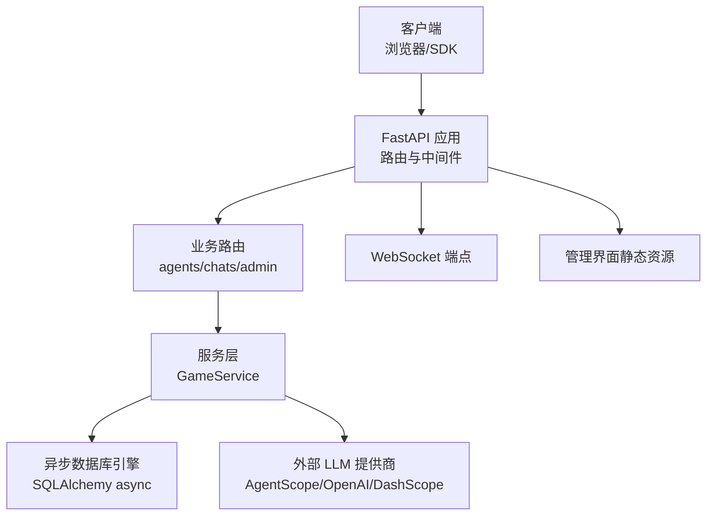
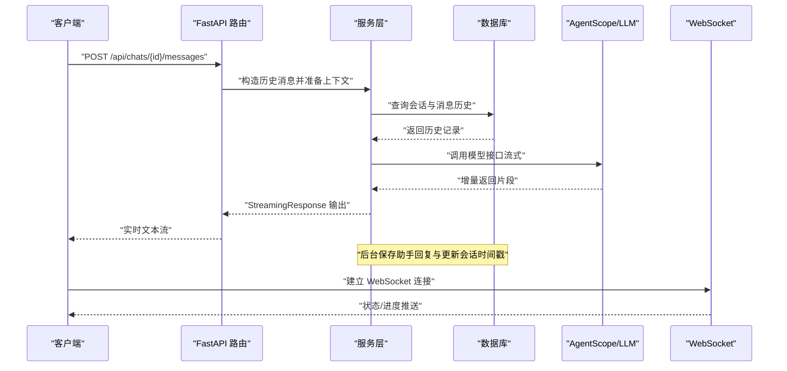
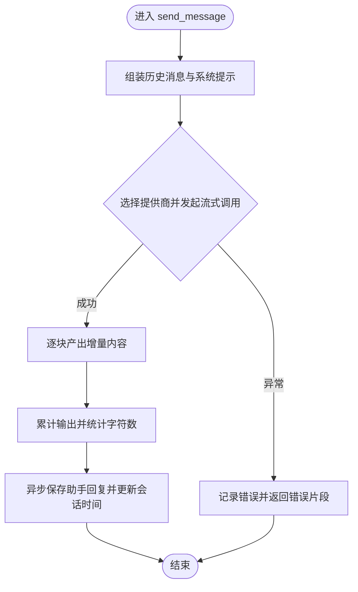
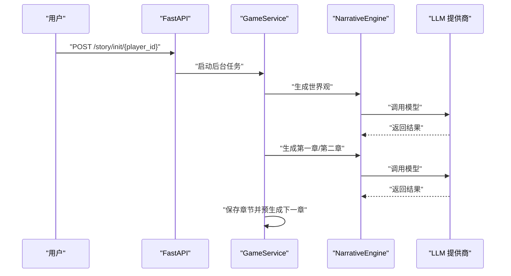
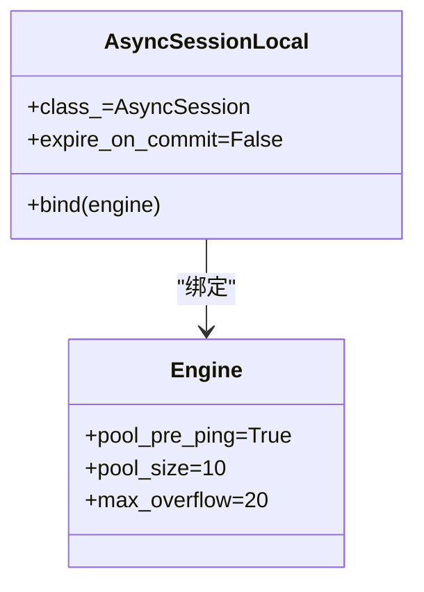
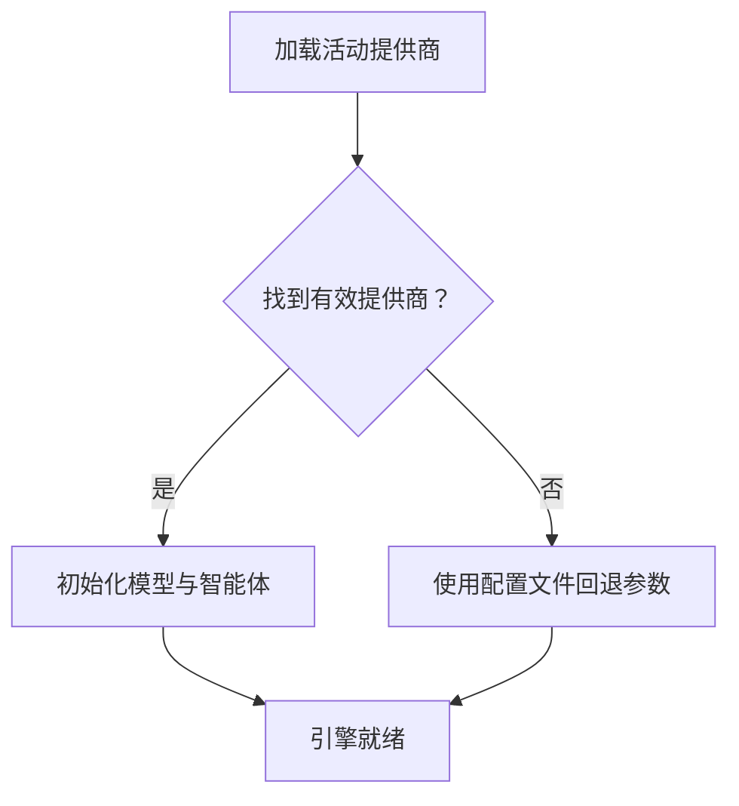
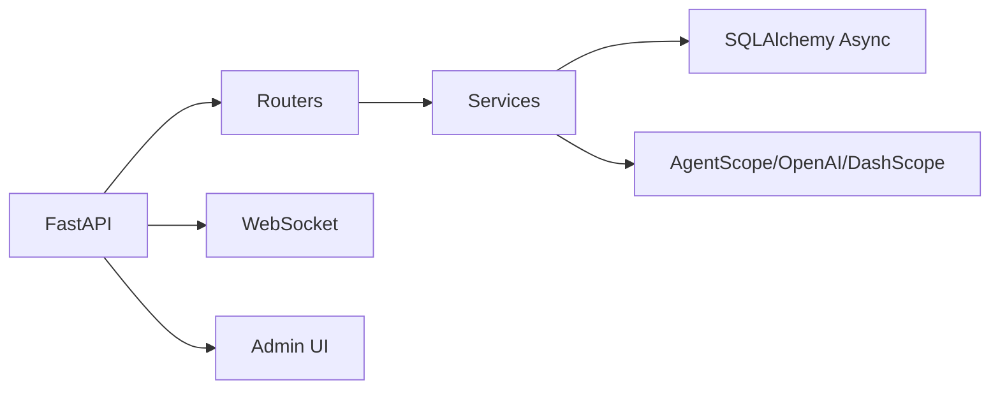

# 性能监控与基准测试

<cite>
**本文引用的文件**
- [backend/main.py](file://backend/main.py)
- [backend/config.py](file://backend/config.py)
- [backend/database.py](file://backend/database.py)
- [backend/services.py](file://backend/services.py)
- [backend/models.py](file://backend/models.py)
- [backend/routers/agents.py](file://backend/routers/agents.py)
- [backend/routers/chats.py](file://backend/routers/chats.py)
- [backend/routers/admin.py](file://backend/routers/admin.py)
- [backend/agents.py](file://backend/agents.py)
- [backend/schemas.py](file://backend/schemas.py)
- [backend/tasks.py](file://backend/tasks.py)
- [backend/manage_db.py](file://backend/manage_db.py)
- [backend/requirements.txt](file://backend/requirements.txt)
</cite>

## 目录
1. [简介](#简介)
2. [项目结构](#项目结构)
3. [核心组件](#核心组件)
4. [架构总览](#架构总览)
5. [详细组件分析](#详细组件分析)
6. [依赖关系分析](#依赖关系分析)
7. [性能考量](#性能考量)
8. [故障排查指南](#故障排查指南)
9. [结论](#结论)
10. [附录](#附录)

## 简介
本指南围绕“性能监控与基准测试”目标，结合代码库现状，系统性地给出关键性能指标（KPI）定义、监控体系、负载与压力测试场景设计、瓶颈识别方法、APM与日志分析、告警配置、基准测试框架搭建、测试用例设计与结果分析、性能回归检测、容量规划与扩容策略，以及监控仪表板配置与优化案例研究。由于当前仓库未内置性能监控与基准测试组件，本指南以“现有代码能力 + 可落地的工程实践”为原则，提供可直接实施的方案。

## 项目结构
后端采用 FastAPI + 异步 SQLAlchemy + 异步 Redis 的技术栈；数据库默认使用 SQLite（开发环境），生产可切换为 PostgreSQL；聊天与故事生成通过 AgentScope 调用外部 LLM 提供商（如 OpenAI、DashScope）。整体请求路径从 FastAPI 路由进入，经服务层调用数据库与外部模型服务，最终返回流式响应或后台任务触发内容生成。

图表来源
- [backend/main.py](file://backend/main.py#L30-L173)
- [backend/routers/agents.py](file://backend/routers/agents.py#L1-L141)
- [backend/routers/chats.py](file://backend/routers/chats.py#L1-L275)
- [backend/routers/admin.py](file://backend/routers/admin.py#L1-L112)
- [backend/services.py](file://backend/services.py#L1-L66)
- [backend/database.py](file://backend/database.py#L1-L31)
- [backend/agents.py](file://backend/agents.py#L1-L196)

章节来源
- [backend/main.py](file://backend/main.py#L30-L173)
- [backend/database.py](file://backend/database.py#L1-L31)
- [backend/requirements.txt](file://backend/requirements.txt#L1-L20)

## 核心组件
- 应用入口与生命周期：负责日志级别控制、CORS、路由注册、数据库迁移与启动时 LLM 配置加载。
- 数据库层：异步引擎、连接池参数、会话工厂，支持 SQLite 与 PostgreSQL。
- 服务层：玩家创建、世界初始化、故事章节生成与预生成、处理玩家选择等。
- 路由层：代理管理、聊天会话与消息、管理员统计与数据维护。
- 智能体与叙事引擎：基于 AgentScope 的多角色智能体编排，按需加载 LLM 配置。
- 前后端交互：REST API、WebSocket、管理界面静态资源挂载。

章节来源
- [backend/main.py](file://backend/main.py#L45-L82)
- [backend/database.py](file://backend/database.py#L8-L23)
- [backend/services.py](file://backend/services.py#L8-L66)
- [backend/routers/agents.py](file://backend/routers/agents.py#L15-L55)
- [backend/routers/chats.py](file://backend/routers/chats.py#L72-L258)
- [backend/agents.py](file://backend/agents.py#L43-L196)

## 架构总览
下图展示从客户端到数据库与外部 LLM 的完整链路，标注关键性能关注点（延迟、并发、流式输出、缓存命中）。

图表来源
- [backend/routers/chats.py](file://backend/routers/chats.py#L72-L258)
- [backend/services.py](file://backend/services.py#L19-L59)
- [backend/agents.py](file://backend/agents.py#L154-L191)

## 详细组件分析

### 组件一：聊天与流式响应（性能关键路径）
- 流式输出：根据提供商类型选择 OpenAI 或 DashScope 的流式接口，逐块返回增量内容，降低首字节延迟。
- 上下文与令牌统计：记录输入/输出字符数与 API 返回的令牌用量，便于成本与性能分析。
- 后台持久化：在流结束后异步保存助手回复并刷新会话时间戳，避免阻塞主响应链路。
- 错误处理：捕获异常并返回错误片段，同时记录日志以便后续分析。

图表来源
- [backend/routers/chats.py](file://backend/routers/chats.py#L112-L258)

章节来源
- [backend/routers/chats.py](file://backend/routers/chats.py#L72-L258)

### 组件二：世界初始化与故事章节生成（CPU/IO 密集）
- 初始化流程：先生成世界观，再生成前两章；随后预生成下一章草稿，提升用户阅读体验。
- 外部调用：通过 NarrativeEngine 调用 AgentScope 与 LLM 提供商，属于高延迟外部依赖。
- 数据落库：分步写入章节与摘要快照，确保一致性与可回溯。

图表来源
- [backend/main.py](file://backend/main.py#L147-L156)
- [backend/services.py](file://backend/services.py#L19-L59)
- [backend/agents.py](file://backend/agents.py#L154-L191)

章节来源
- [backend/services.py](file://backend/services.py#L19-L59)
- [backend/agents.py](file://backend/agents.py#L43-L196)

### 组件三：数据库连接与事务（并发与池化）
- 异步引擎：启用 pool_pre_ping、设置连接池大小与溢出，提升高并发下的可用性。
- 会话工厂：非过期提交，减少无效刷新；在需要时使用独立会话进行后台持久化。
- 迁移与启动：应用启动时执行 Alembic 升级，保证模式一致。

图表来源
- [backend/database.py](file://backend/database.py#L8-L23)

章节来源
- [backend/database.py](file://backend/database.py#L8-L23)
- [backend/main.py](file://backend/main.py#L59-L65)

### 组件四：LLM 提供商配置与动态加载
- 动态加载：启动或运行时从数据库读取活动提供商，支持 OpenAI/DashScope 等类型。
- 参数校验：在创建/更新代理时验证模型是否在提供商可用列表中。
- 容错与回退：当数据库无活动提供商时，回退到配置文件中的密钥与模型名。

图表来源
- [backend/agents.py](file://backend/agents.py#L49-L99)
- [backend/routers/agents.py](file://backend/routers/agents.py#L22-L50)

章节来源
- [backend/agents.py](file://backend/agents.py#L49-L99)
- [backend/routers/agents.py](file://backend/routers/agents.py#L22-L50)

## 依赖关系分析
- 外部依赖：FastAPI、Uvicorn、SQLAlchemy、AgentScope、OpenAI SDK、Alembic、Redis 等。
- 内部耦合：路由依赖服务层；服务层依赖数据库与外部 LLM；聊天路由内含流式逻辑与后台持久化。
- 潜在风险：外部 LLM 调用为性能瓶颈；数据库连接池参数需结合并发与延迟目标调整；WebSocket 与流式响应需注意内存与背压。

图表来源
- [backend/requirements.txt](file://backend/requirements.txt#L1-L20)
- [backend/main.py](file://backend/main.py#L30-L173)
- [backend/routers/chats.py](file://backend/routers/chats.py#L1-L275)

章节来源
- [backend/requirements.txt](file://backend/requirements.txt#L1-L20)
- [backend/main.py](file://backend/main.py#L30-L173)

## 性能考量
- 关键 KPI 建议
  - 响应时间：P50/P90/P95 延迟（含网络与模型调用）、首字节时间（TTFB）。
  - 吞吐量：每秒请求数（QPS）、每秒令牌数（TPS）、每秒会话数。
  - 错误率：HTTP 5xx、模型调用失败率、数据库超时/死锁比例。
  - 资源利用率：CPU 使用率、内存占用、数据库连接池使用率、Redis 命中率、外部 LLM 调用配额与耗时。
- 监控体系
  - 指标采集：Prometheus/Grafana（或云厂商监控）采集应用指标与系统指标。
  - 日志：结构化日志（请求 ID、路径、耗时、状态码、令牌统计、错误堆栈）。
  - APM：OpenTelemetry + Jaeger/Zipkin（链路追踪），结合日志与指标统一告警。
- 负载与压力测试
  - 工具：k6、JMeter、Artillery（推荐 k6，易写脚本且生态好）。
  - 场景：阶梯式并发、恒定 QPS、混合场景（登录/聊天/生成/后台任务）。
  - 关注点：P95 延迟、错误率、数据库连接池饱和度、外部 LLM 限流阈值。
- 瓶颈识别
  - 链路拆分：前端渲染 vs. 后端处理 vs. LLM 推理 vs. 数据库写入。
  - 并发放大：数据库连接池不足、外部 API 限流、WebSocket 阻塞。
  - 缓存策略：热点章节/资产、会话历史、LLM 调用结果缓存。
- 回归与容量规划
  - 回归：每次发布前后对比 P95 延迟与错误率，设定阈值告警。
  - 容量：基于峰值 QPS 与 SLA 推导实例数、连接池、队列长度；预留 20%-40% 安全余量。
- 扩容策略
  - 垂直：增加 CPU/内存、扩大数据库连接池。
  - 水平：多副本、读写分离、引入缓存/CDN、限流与熔断。

[本节为通用性能指导，不直接分析具体文件，故无“章节来源”]

## 故障排查指南
- 启动阶段
  - 数据库连接失败：检查 DATABASE_URL、网络可达性；查看启动日志与重试次数。
  - Alembic 升级失败：确认迁移脚本与权限；必要时手动执行升级命令。
- 运行阶段
  - LLM 调用异常：检查提供商类型、API Key、模型名称、配额与限流；查看流式输出日志。
  - 数据库写入失败：检查连接池饱和、事务超时、外键约束；观察慢查询。
  - WebSocket 异常：检查连接状态、异常捕获与关闭流程。
- 日志与告警
  - 结构化字段：请求 ID、路径、方法、状态码、耗时、输入/输出字符数、令牌统计、错误信息。
  - 告警规则：P95 延迟超阈、错误率突增、数据库连接池空/满、外部 LLM 429/5xx、Redis 命中率骤降。

章节来源
- [backend/main.py](file://backend/main.py#L45-L82)
- [backend/routers/chats.py](file://backend/routers/chats.py#L133-L234)

## 结论
本指南基于现有代码库，明确了性能监控与基准测试的关键抓手：以聊天与故事生成为核心路径，结合流式响应、外部 LLM 调用与数据库写入，构建覆盖响应时间、吞吐量、错误率与资源利用率的监控体系，并配套负载与压力测试、瓶颈识别、回归检测与容量规划策略。建议尽快引入 APM、结构化日志与可视化仪表盘，持续迭代优化。

[本节为总结性内容，不直接分析具体文件，故无“章节来源”]

## 附录

### A. 关键性能指标（KPI）定义与监控清单
- 响应时间：端到端延迟、模型推理延迟、数据库查询延迟、流式首包延迟。
- 吞吐量：QPS、TPS、会话并发数、生成任务吞吐。
- 错误率：HTTP 5xx、模型调用失败、数据库异常、WebSocket 断开。
- 资源利用率：CPU、内存、数据库连接池使用率、Redis 命中率、外部 LLM 调用配额。

[本节为通用指标说明，不直接分析具体文件，故无“章节来源”]

### B. 负载与压力测试场景设计
- 场景一：单用户长会话（流式聊天），观察 TTFB 与 P95 延迟。
- 场景二：多用户并发提问，逐步加压至数据库连接池上限。
- 场景三：混合场景（登录、聊天、生成、后台任务），评估整体稳定性。
- 场景四：外部 LLM 限流模拟，验证熔断与降级策略。

[本节为通用测试设计，不直接分析具体文件，故无“章节来源”]

### C. APM 与日志分析建议
- APM：OpenTelemetry 收集 traces/metrics/logs，Jaeger/Zipkin 展示链路。
- 日志：统一结构化字段，按请求 ID 关联链路与指标。
- 告警：阈值告警 + 速率告警 + 变化率告警，分级处理。

[本节为通用实践，不直接分析具体文件，故无“章节来源”]

### D. 基准测试框架搭建与用例设计
- 框架：k6（脚本化、可观测性强）。
- 用例：固定并发、阶梯并发、恒定 QPS、带缓存与不带缓存对比。
- 结果：延迟分布、错误率、吞吐量、外部 LLM 成本估算。

[本节为通用实践，不直接分析具体文件，故无“章节来源”]

### E. 监控仪表板配置要点
- 指标面板：请求延迟（P50/P90/P95）、错误率、QPS、数据库连接池使用率、Redis 命中率。
- 链路面板：外部 LLM 调用耗时、模型类型分布、令牌用量。
- 告警面板：阈值触发、趋势异常、容量预警。

[本节为通用实践，不直接分析具体文件，故无“章节来源”]

### F. 性能优化案例研究（思路）
- 案例一：数据库连接池饱和导致延迟飙升 → 扩大连接池并引入读写分离。
- 案例二：LLM 调用成为瓶颈 → 引入缓存与预生成、限流与熔断。
- 案例三：WebSocket 阻塞 → 分离后台持久化、优化消息序列化。
- 案例四：流式响应卡顿 → 优化上游模型调用与网络传输。

[本节为通用案例，不直接分析具体文件，故无“章节来源”]