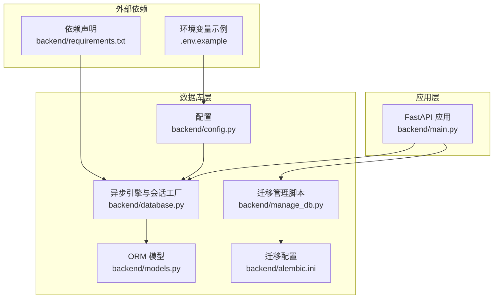
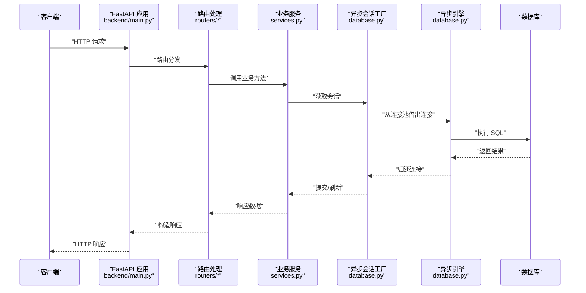
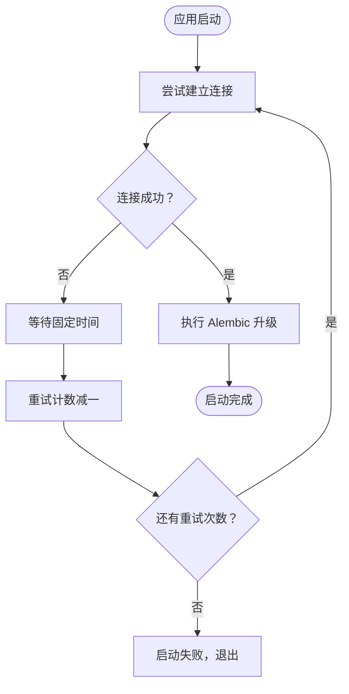
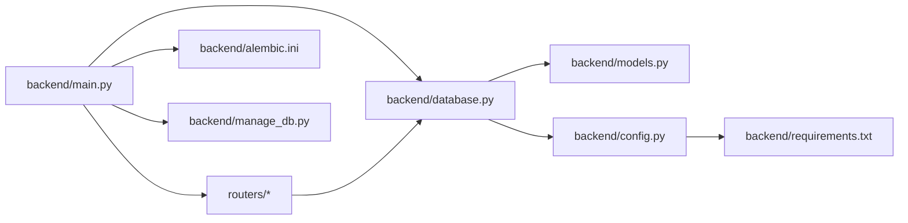
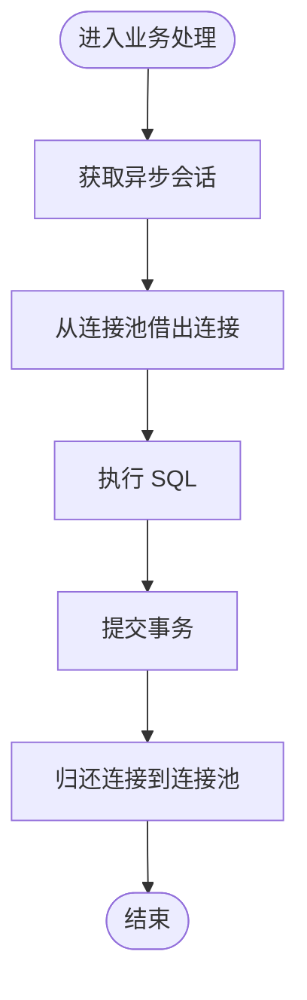
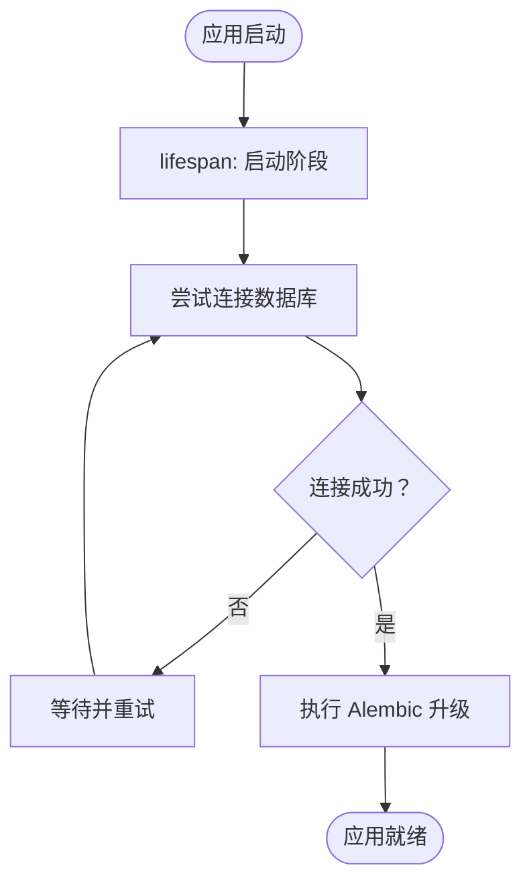

# 数据库连接优化

<cite>
**本文引用的文件**
- [backend/database.py](file://backend/database.py)
- [backend/config.py](file://backend/config.py)
- [backend/main.py](file://backend/main.py)
- [backend/models.py](file://backend/models.py)
- [backend/requirements.txt](file://backend/requirements.txt)
- [backend/manage_db.py](file://backend/manage_db.py)
- [backend/alembic.ini](file://backend/alembic.ini)
- [backend/.env.example](file://backend/.env.example)
- [docs/wiki/Backend-Guide.md](file://docs/wiki/Backend-Guide.md)
- [docs/wiki/Database-Migration.md](file://docs/wiki/Database-Migration.md)
</cite>

## 目录
1. [简介](#简介)
2. [项目结构](#项目结构)
3. [核心组件](#核心组件)
4. [架构总览](#架构总览)
5. [详细组件分析](#详细组件分析)
6. [依赖关系分析](#依赖关系分析)
7. [性能考量](#性能考量)
8. [故障排查指南](#故障排查指南)
9. [结论](#结论)
10. [附录](#附录)

## 简介
本指南聚焦于数据库连接池与查询优化，结合项目中基于 SQLAlchemy 异步引擎的实现，系统阐述连接池配置参数（最大连接数、连接超时、空闲回收策略）、连接重试与故障转移、连接泄漏防护、PostgreSQL 性能优化（查询计划器、索引策略、事务隔离级别）、慢查询与连接池监控、以及生产环境最佳实践与故障排查。文中所有技术要点均以仓库现有实现为依据，并提供对应的文件与行号来源。

## 项目结构
该项目采用 FastAPI + SQLAlchemy 异步 ORM 的后端架构，数据库层通过异步引擎与会话工厂统一管理，配合 Alembic 进行迁移管理。核心文件分布如下：
- 配置与连接池：backend/config.py、backend/database.py
- 应用入口与生命周期：backend/main.py
- 数据模型：backend/models.py
- 迁移与管理：backend/manage_db.py、backend/alembic.ini
- 环境变量示例：backend/.env.example
- 文档：docs/wiki/Backend-Guide.md、docs/wiki/Database-Migration.md

图表来源
- [backend/main.py](file://backend/main.py#L30-L83)
- [backend/database.py](file://backend/database.py#L1-L31)
- [backend/config.py](file://backend/config.py#L15-L16)
- [backend/alembic.ini](file://backend/alembic.ini#L1-L115)
- [backend/manage_db.py](file://backend/manage_db.py#L1-L67)
- [backend/requirements.txt](file://backend/requirements.txt#L1-L20)
- [backend/.env.example](file://backend/.env.example#L1-L4)

章节来源
- [backend/main.py](file://backend/main.py#L30-L83)
- [backend/database.py](file://backend/database.py#L1-L31)
- [backend/config.py](file://backend/config.py#L15-L16)
- [backend/requirements.txt](file://backend/requirements.txt#L1-L20)
- [backend/alembic.ini](file://backend/alembic.ini#L1-L115)
- [backend/manage_db.py](file://backend/manage_db.py#L1-L67)
- [backend/.env.example](file://backend/.env.example#L1-L4)
- [docs/wiki/Backend-Guide.md](file://docs/wiki/Backend-Guide.md#L1-L108)
- [docs/wiki/Database-Migration.md](file://docs/wiki/Database-Migration.md#L1-L85)

## 核心组件
- 异步引擎与会话工厂：在数据库层集中配置连接池参数与会话行为，确保全局一致性与可观察性。
- 生命周期与重试：在应用启动阶段进行数据库连接重试与迁移执行，提升部署鲁棒性。
- 迁移体系：通过 Alembic 与封装脚本管理数据库结构演进，避免手写 DDL。
- 环境配置：通过 Settings 统一读取 DATABASE_URL 等关键参数，支持本地 SQLite 与远程 PostgreSQL。

章节来源
- [backend/database.py](file://backend/database.py#L8-L23)
- [backend/main.py](file://backend/main.py#L45-L81)
- [backend/config.py](file://backend/config.py#L7-L34)
- [backend/manage_db.py](file://backend/manage_db.py#L20-L38)
- [backend/alembic.ini](file://backend/alembic.ini#L61-L61)

## 架构总览
下图展示从应用到数据库的调用路径与连接池交互：

图表来源
- [backend/main.py](file://backend/main.py#L138-L146)
- [backend/services.py](file://backend/services.py#L12-L17)
- [backend/database.py](file://backend/database.py#L19-L23)

## 详细组件分析

### 异步连接池配置与参数
- 连接池参数
  - 连接池大小：pool_size
  - 最大溢出连接：max_overflow
  - 连接预检查：pool_pre_ping
  - 线程检查（SQLite 特有）：connect_args 中的 check_same_thread
- 会话行为
  - 会话类：AsyncSession
  - 提交后不刷新过期对象：expire_on_commit=False
- 配置来源
  - DATABASE_URL 来自 Settings，支持 SQLite 与 PostgreSQL
  - 默认使用 sqlite+aiosqlite，可通过 .env 切换为 PostgreSQL

章节来源
- [backend/database.py](file://backend/database.py#L8-L23)
- [backend/config.py](file://backend/config.py#L15-L16)
- [backend/.env.example](file://backend/.env.example#L2-L2)

### 连接重试机制与故障转移
- 应用启动阶段的重试
  - 在 lifespan 中循环尝试建立连接与执行迁移，最多重试若干次
  - 成功后执行 Alembic 升级至 head
- 故障转移思路
  - 通过 DATABASE_URL 切换到备用数据库实例（主从/副本）
  - 结合连接池 pre_ping 与异常捕获实现自动恢复

图表来源
- [backend/main.py](file://backend/main.py#L47-L74)

章节来源
- [backend/main.py](file://backend/main.py#L45-L81)

### 连接泄漏防护
- 使用上下文管理器
  - get_db 使用 async with AsyncSessionLocal() 确保异常时也能释放连接
- 会话生命周期
  - 业务层通过依赖注入获取会话，避免跨请求共享连接
- 连接池健康
  - pool_pre_ping 可在借出连接前校验连接有效性，降低泄漏引发的无效连接影响

章节来源
- [backend/database.py](file://backend/database.py#L28-L31)
- [backend/services.py](file://backend/services.py#L8-L11)

### 查询与模型设计
- 模型字段与索引
  - 多处使用 index=True，便于查询过滤与排序
  - UUID 主键与字符串长度控制，兼顾唯一性与存储效率
- 查询模式
  - 路由层使用 select 构建查询，支持分页与模糊匹配
  - 业务层在事务内执行插入与提交，保证一致性

章节来源
- [backend/models.py](file://backend/models.py#L10-L14)
- [backend/models.py](file://backend/models.py#L27-L44)
- [backend/routers/agents.py](file://backend/routers/agents.py#L57-L71)

### 迁移与版本管理
- Alembic 配置
  - script_location 指定迁移目录
  - 日志级别控制，减少噪声
- 管理脚本
  - migrate：基于模型变更生成迁移脚本
  - upgrade/downgrade：应用或回滚迁移
- 启动时自动升级
  - main.py 在 lifespan 中调用 subprocess 执行 alembic upgrade head

章节来源
- [backend/alembic.ini](file://backend/alembic.ini#L3-L6)
- [backend/manage_db.py](file://backend/manage_db.py#L20-L38)
- [backend/main.py](file://backend/main.py#L59-L65)

## 依赖关系分析
- 组件耦合
  - main.py 依赖 database.py 的 engine 与 get_db
  - routers 依赖 database.py 的 get_db 进行依赖注入
  - models 依赖 database.py 的 Base
  - config.py 为 database.py 提供 DATABASE_URL
- 外部依赖
  - SQLAlchemy 异步引擎与 ORM
  - asyncpg/aiosqlite 驱动
  - Alembic 迁移工具

图表来源
- [backend/main.py](file://backend/main.py#L30-L43)
- [backend/database.py](file://backend/database.py#L1-L3)
- [backend/config.py](file://backend/config.py#L15-L16)
- [backend/requirements.txt](file://backend/requirements.txt#L3-L7)
- [backend/alembic.ini](file://backend/alembic.ini#L5-L5)
- [backend/manage_db.py](file://backend/manage_db.py#L1-L67)

章节来源
- [backend/main.py](file://backend/main.py#L30-L43)
- [backend/database.py](file://backend/database.py#L1-L3)
- [backend/config.py](file://backend/config.py#L15-L16)
- [backend/requirements.txt](file://backend/requirements.txt#L3-L7)
- [backend/alembic.ini](file://backend/alembic.ini#L5-L5)
- [backend/manage_db.py](file://backend/manage_db.py#L1-L67)

## 性能考量
- 连接池参数建议
  - pool_size：根据并发请求峰值与数据库承载能力设定，避免过大导致数据库压力或过小导致排队
  - max_overflow：允许的额外连接数，建议与 pool_size 成比例，结合慢查询与锁竞争评估
  - pool_pre_ping：启用以自动剔除失效连接，降低重试成本
  - connect_args：SQLite 下禁用线程检查，避免不必要的线程绑定开销
- 查询优化
  - 为高频过滤与排序字段建立索引（当前模型已显式使用 index=True）
  - 使用分页查询（offset/limit）避免一次性返回大量数据
  - 避免 N+1 查询：批量加载关联数据或使用 join
- PostgreSQL 特定优化
  - 使用 EXPLAIN/EXPLAIN ANALYZE 分析慢查询计划
  - 合理设置统计信息更新频率与 vacuum/analyze 策略
  - 选择合适的事务隔离级别，平衡一致性与并发性能
- 监控与观测
  - 记录慢查询日志与执行时间
  - 监控连接池利用率、等待时间与超时次数
  - 结合数据库性能视图（如 PostgreSQL pg_stat_statements）定位热点 SQL

[本节为通用性能指导，不直接分析具体文件]

## 故障排查指南
- 启动阶段连接失败
  - 检查 DATABASE_URL 是否正确（.env 示例指向 PostgreSQL）
  - 观察 lifespan 重试日志，确认是否达到最大重试次数
  - 确认数据库可达性与凭据
- 迁移相关问题
  - “目标数据库未更新”：执行 manage_db.py upgrade 或重启应用让 lifespan 自动升级
  - SQLite 限制：复杂 ALTER 操作可能失败，优先在开发环境验证
- 连接池异常
  - 连接耗尽：增大 pool_size 与 max_overflow，同时优化慢查询
  - 连接泄漏：确保使用上下文管理器与依赖注入，避免跨请求持有会话
  - 连接失效：启用 pool_pre_ping 并缩短连接生命周期
- 生产环境建议
  - 使用只读副本与连接池分离读写流量
  - 设置连接超时与查询超时，防止长事务阻塞
  - 定期审查慢查询与索引缺失

章节来源
- [backend/.env.example](file://backend/.env.example#L2-L2)
- [backend/main.py](file://backend/main.py#L47-L74)
- [docs/wiki/Database-Migration.md](file://docs/wiki/Database-Migration.md#L73-L74)

## 结论
本项目在连接池层面提供了合理的默认配置与生命周期重试机制，结合 Alembic 的迁移体系与模型索引设计，能够满足中小型应用的性能与稳定性需求。生产环境中建议进一步完善连接池参数、慢查询监控与索引策略，并通过只读副本与连接池分离等手段提升吞吐与可用性。

[本节为总结性内容，不直接分析具体文件]

## 附录

### 关键流程图：连接池借还流程

图表来源
- [backend/database.py](file://backend/database.py#L28-L31)
- [backend/services.py](file://backend/services.py#L12-L17)

### 关键流程图：启动与迁移

图表来源
- [backend/main.py](file://backend/main.py#L45-L81)