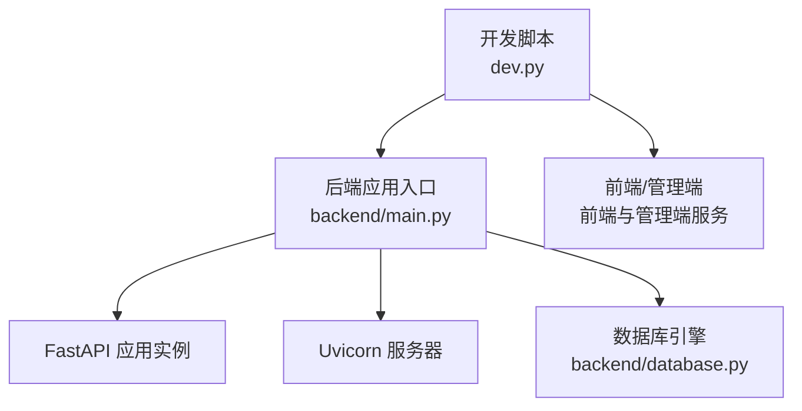
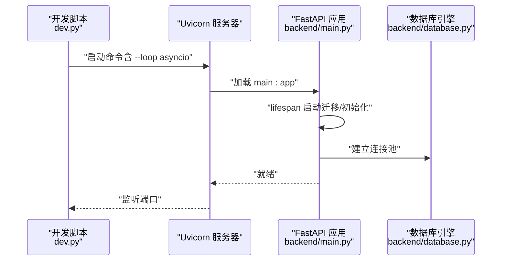
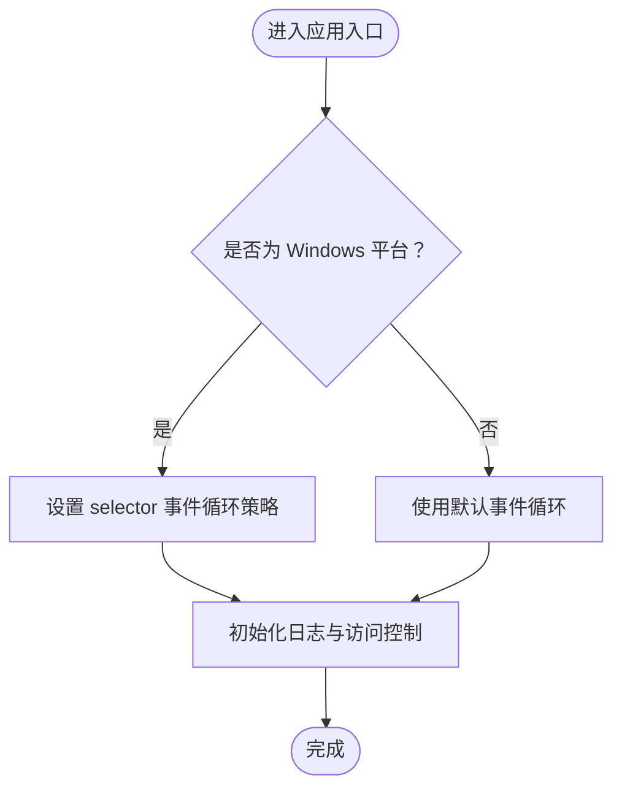
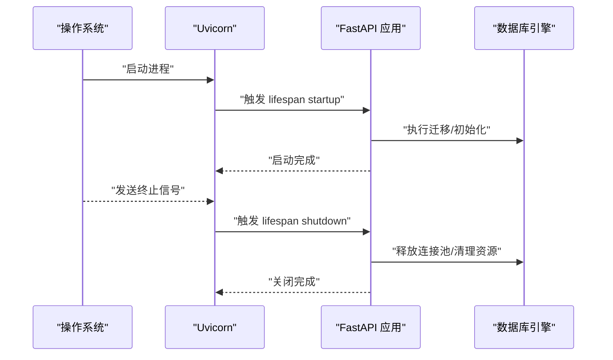
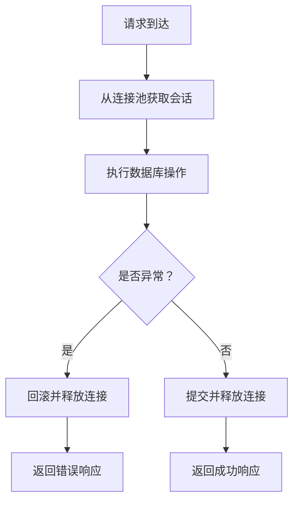
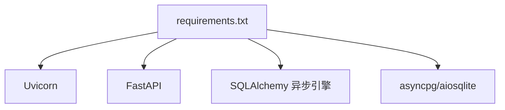

# 服务器配置调优

<cite>
**本文引用的文件**
- [backend/main.py](file://backend/main.py)
- [dev.py](file://dev.py)
- [backend/config.py](file://backend/config.py)
- [backend/database.py](file://backend/database.py)
- [backend/requirements.txt](file://backend/requirements.txt)
- [docs/wiki/Deployment.md](file://docs/wiki/Deployment.md)
- [backend/.env.example](file://backend/.env.example)
</cite>

## 目录
1. [简介](#简介)
2. [项目结构](#项目结构)
3. [核心组件](#核心组件)
4. [架构总览](#架构总览)
5. [详细组件分析](#详细组件分析)
6. [依赖关系分析](#依赖关系分析)
7. [性能考虑](#性能考虑)
8. [故障排查指南](#故障排查指南)
9. [结论](#结论)
10. [附录](#附录)

## 简介
本指南围绕 Uvicorn 服务器在本项目的配置与调优展开，重点覆盖以下方面：
- 并发处理参数（工作进程与线程）的配置原理与最佳实践
- 异步事件循环在不同操作系统上的差异处理，尤其是 Windows 平台的 selector 事件循环策略
- 内存管理优化、进程间通信配置与资源限制设置
- 生产环境服务器部署的配置模板与性能基准测试方法
- 错误处理、健康检查与优雅关闭机制的实现细节

## 项目结构
后端基于 FastAPI + Uvicorn 构建，主入口位于 backend/main.py；开发环境通过 dev.py 启动多服务并行运行。数据库连接采用 SQLAlchemy 异步引擎，连接池参数已在 backend/database.py 中配置。

图表来源
- [dev.py](file://dev.py#L108-L111)
- [backend/main.py](file://backend/main.py#L171-L173)
- [backend/database.py](file://backend/database.py#L8-L17)

章节来源
- [backend/main.py](file://backend/main.py#L1-L173)
- [dev.py](file://dev.py#L1-L150)
- [backend/database.py](file://backend/database.py#L1-L31)

## 核心组件
- 应用生命周期与启动流程：通过 lifespan 管理数据库迁移与叙事引擎初始化，并在应用启动前完成必要的准备。
- 事件循环策略：在 Windows 平台上显式设置 selector 事件循环策略以兼容 asyncpg。
- 日志与访问控制：精细化控制日志级别，抑制 Uvicorn 访问日志，保留应用日志。
- 数据库连接池：通过连接池参数控制并发与稳定性，避免资源耗尽。
- 开发模式下的 Uvicorn 参数：在 dev.py 中使用 --loop asyncio 以提升 Windows 兼容性。

章节来源
- [backend/main.py](file://backend/main.py#L45-L82)
- [backend/main.py](file://backend/main.py#L7-L11)
- [backend/main.py](file://backend/main.py#L14-L28)
- [backend/database.py](file://backend/database.py#L8-L17)
- [dev.py](file://dev.py#L110-L111)

## 架构总览
下图展示了从开发脚本到 Uvicorn 服务器、再到 FastAPI 应用与数据库的整体交互：

图表来源
- [dev.py](file://dev.py#L110-L111)
- [backend/main.py](file://backend/main.py#L45-L82)
- [backend/database.py](file://backend/database.py#L8-L17)

## 详细组件分析

### 事件循环与平台差异处理
- Windows 平台：显式设置 selector 事件循环策略，解决 asyncpg 在 Windows 上的事件循环兼容性问题。
- 开发模式：通过 --loop asyncio 参数强制使用 asyncio 循环，提升跨平台一致性。
- 生产建议：在 Linux/macOS 上可使用默认事件循环；如需自定义，优先选择 epoll 或其他高性能事件循环。

图表来源
- [backend/main.py](file://backend/main.py#L7-L11)
- [dev.py](file://dev.py#L110-L111)

章节来源
- [backend/main.py](file://backend/main.py#L7-L11)
- [dev.py](file://dev.py#L110-L111)

### 生命周期与优雅关闭
- 应用生命周期：通过 lifespan 在启动阶段执行数据库迁移与配置加载；在关闭阶段释放资源。
- 优雅关闭：当前实现主要依赖 FastAPI 的生命周期钩子与 Uvicorn 默认关闭流程；可结合信号处理实现更精细的优雅关闭。

图表来源
- [backend/main.py](file://backend/main.py#L45-L82)
- [backend/database.py](file://backend/database.py#L8-L17)

章节来源
- [backend/main.py](file://backend/main.py#L45-L82)
- [backend/database.py](file://backend/database.py#L8-L17)

### 并发处理参数（workers 与 threads）
- workers：用于多进程模型，适合 CPU 密集型任务或需要隔离的场景。当前开发脚本未启用多进程，生产部署可根据 CPU 核心数与业务特性评估。
- threads：用于单进程内的线程池，适合 I/O 密集型任务。当前未显式配置线程数，建议结合业务负载与数据库连接池参数进行调优。
- 最佳实践：
  - CPU 密集型：增加 workers，保持 threads 适中
  - I/O 密集型：适度增加 threads，避免过多导致上下文切换开销
  - 数据库密集：优先优化连接池参数，再考虑线程扩展

章节来源
- [dev.py](file://dev.py#L110-L111)
- [backend/database.py](file://backend/database.py#L12-L13)

### 内存管理优化
- 连接池参数：pool_size 与 max_overflow 控制连接数量与溢出行为，避免连接泄漏与资源耗尽。
- 会话管理：使用异步会话工厂，确保请求结束时及时释放连接。
- 建议：根据峰值并发与响应时间目标调整 pool_size 与 max_overflow，并开启 pool_pre_ping 提升连接稳定性。

图表来源
- [backend/database.py](file://backend/database.py#L19-L23)

章节来源
- [backend/database.py](file://backend/database.py#L8-L17)
- [backend/database.py](file://backend/database.py#L19-L23)

### 进程间通信与资源限制
- 进程间通信：当前未使用 IPC 组件，建议在引入消息队列或共享缓存时，结合连接池与超时参数进行限流与隔离。
- 资源限制：通过连接池与线程池上限控制内存占用；在容器化部署时配合 CPU/内存配额限制。

章节来源
- [backend/database.py](file://backend/database.py#L12-L13)

### 错误处理与健康检查
- 错误处理：应用层捕获业务异常并返回标准 HTTP 错误码；WebSocket 层捕获异常并关闭连接，避免资源泄露。
- 健康检查：可在应用中添加 /health 接口返回服务状态；结合外部探针定期探测。
- 建议：统一错误响应格式，记录关键错误日志，区分业务错误与系统错误。

章节来源
- [backend/main.py](file://backend/main.py#L141-L145)
- [backend/main.py](file://backend/main.py#L160-L169)

## 依赖关系分析
- Uvicorn 版本：requirements.txt 中要求 uvicorn[standard] >= 0.41.0，具备较好的事件循环与性能支持。
- FastAPI：作为应用框架，与 Uvicorn 协同提供高性能 ASGI 服务。
- 数据库驱动：asyncpg/aiosqlite 与 SQLAlchemy 异步引擎配合，连接池参数直接影响并发与稳定性。

图表来源
- [backend/requirements.txt](file://backend/requirements.txt#L1-L20)

章节来源
- [backend/requirements.txt](file://backend/requirements.txt#L1-L20)

## 性能考虑
- 事件循环：Windows 平台使用 selector 策略；Linux/macOS 可使用默认策略或 epoll。
- 连接池：根据峰值 QPS 与平均响应时间估算并发连接需求，合理设置 pool_size 与 max_overflow。
- 线程池：I/O 密集场景适度增加线程数，避免过度上下文切换。
- 日志：生产环境建议降低日志级别，避免 I/O 成为瓶颈。
- 部署：使用 --loop asyncio 在开发环境提升兼容性；生产环境按平台选择最优事件循环。

章节来源
- [backend/main.py](file://backend/main.py#L7-L11)
- [dev.py](file://dev.py#L110-L111)
- [backend/database.py](file://backend/database.py#L12-L13)

## 故障排查指南
- Windows 启动异常：确认已设置 selector 事件循环策略；检查 UTF-8 编码写入器替换。
- 数据库连接失败：核对 DATABASE_URL 与凭据；查看连接池参数与网络可达性。
- WebSocket 断开：检查异常捕获与关闭流程，确保连接正确释放。
- 开发环境调试：使用 dev.py 的并行启动与日志输出定位问题。

章节来源
- [backend/main.py](file://backend/main.py#L7-L11)
- [backend/main.py](file://backend/main.py#L160-L169)
- [dev.py](file://dev.py#L133-L146)

## 结论
本项目在 Windows 平台通过事件循环策略与开发脚本参数实现了较好的兼容性与稳定性。生产部署应结合业务特征与硬件资源，优化连接池与线程池参数，完善健康检查与优雅关闭机制，并在容器化环境中设置合理的资源限制。

## 附录

### 生产环境部署配置模板
- 主机与端口：绑定内网地址与安全端口，结合反向代理暴露服务
- 事件循环：Linux/macOS 使用默认策略；Windows 使用 selector
- 连接池：根据峰值并发与响应时间目标调整 pool_size 与 max_overflow
- 日志：生产环境降低日志级别，集中化收集
- 健康检查：提供 /health 接口，结合探针定期检测
- 优雅关闭：结合信号处理与生命周期钩子实现

章节来源
- [backend/main.py](file://backend/main.py#L14-L28)
- [backend/database.py](file://backend/database.py#L12-L13)
- [docs/wiki/Deployment.md](file://docs/wiki/Deployment.md#L34-L39)

### 性能基准测试方法
- 基准工具：使用 wrk、ab 或 k6 等工具模拟并发请求
- 指标采集：关注吞吐量、P95/P99 延迟、连接池命中率与错误率
- 场景设计：CPU 密集型、I/O 密集型与混合型分别验证
- 优化验证：逐步调整 workers、threads 与连接池参数，对比指标变化

章节来源
- [backend/database.py](file://backend/database.py#L12-L13)