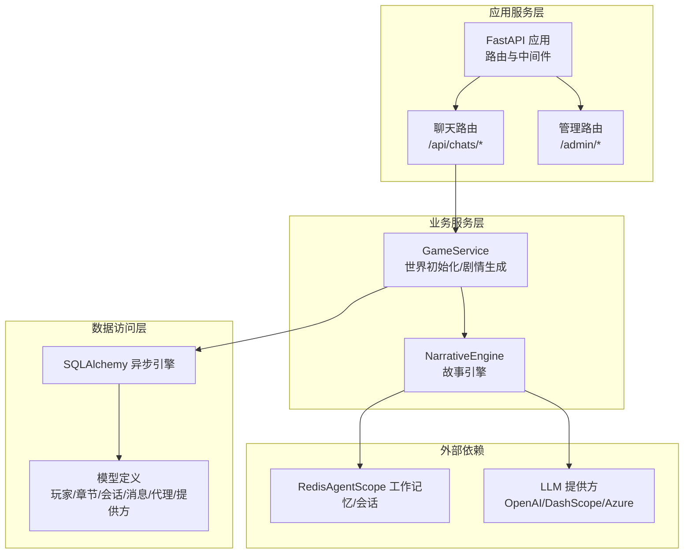
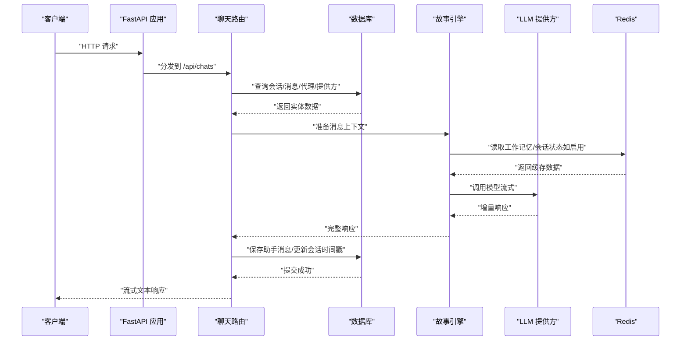
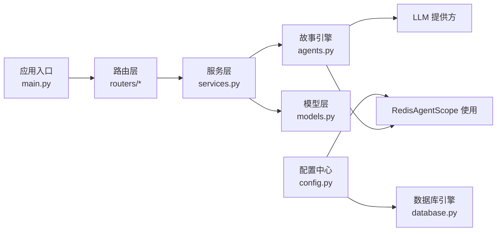

# 缓存策略优化

<cite>
**本文引用的文件**
- [main.py](file://backend/main.py)
- [config.py](file://backend/config.py)
- [.env.example](file://backend/.env.example)
- [database.py](file://backend/database.py)
- [models.py](file://backend/models.py)
- [schemas.py](file://backend/schemas.py)
- [agents.py](file://backend/agents.py)
- [services.py](file://backend/services.py)
- [routers/chats.py](file://backend/routers/chats.py)
- [_redis_session.py](file://backend/venv/Lib/site-packages/agentscope/session/_redis_session.py)
- [_redis_memory.py](file://backend/venv/Lib/site-packages/agentscope/memory/_working_memory/_redis_memory.py)
</cite>

## 目录
1. [简介](#简介)
2. [项目结构](#项目结构)
3. [核心组件](#核心组件)
4. [架构总览](#架构总览)
5. [详细组件分析](#详细组件分析)
6. [依赖关系分析](#依赖关系分析)
7. [性能考量](#性能考量)
8. [故障排查指南](#故障排查指南)
9. [结论](#结论)
10. [附录](#附录)

## 简介
本指南围绕Redis缓存策略优化展开，结合当前代码库中已存在的Redis集成点与相关模块，系统阐述缓存键设计原则、过期策略、内存淘汰算法选择，以及针对会话数据、配置信息与LLM响应缓存的差异化策略。同时覆盖缓存穿透、缓存雪崩、缓存击穿的防护机制，提供缓存命中率监控、内存使用分析与性能调优方法，并讨论分布式缓存一致性与缓存更新策略。最后给出可落地的配置示例与性能测试建议。

## 项目结构
后端采用FastAPI + SQLAlchemy异步架构，数据库通过异步引擎连接，LLM能力由AgentScope提供，聊天接口支持流式输出。Redis在本项目中主要通过AgentScope的工作记忆与会话状态持久化使用，为后续扩展到应用层缓存提供了基础。

图表来源
- [main.py](file://backend/main.py#L83-L98)
- [routers/chats.py](file://backend/routers/chats.py#L1-L275)
- [services.py](file://backend/services.py#L1-L66)
- [agents.py](file://backend/agents.py#L43-L196)
- [database.py](file://backend/database.py#L1-L31)
- [models.py](file://backend/models.py#L1-L122)

章节来源
- [main.py](file://backend/main.py#L83-L98)
- [routers/chats.py](file://backend/routers/chats.py#L1-L275)
- [services.py](file://backend/services.py#L1-L66)
- [agents.py](file://backend/agents.py#L43-L196)
- [database.py](file://backend/database.py#L1-L31)
- [models.py](file://backend/models.py#L1-L122)

## 核心组件
- 配置中心：集中管理数据库与Redis连接串等关键参数，便于统一切换与部署。
- 数据库层：异步连接池配置，确保高并发下的稳定性。
- 聊天路由：负责会话与消息的增删查改，支持流式LLM响应输出。
- 故事引擎：封装LLM调用与多智能体协作，具备从数据库加载配置的能力。
- 模型层：定义玩家、章节、资产、会话、消息、代理与LLM提供方等实体。

章节来源
- [config.py](file://backend/config.py#L1-L34)
- [database.py](file://backend/database.py#L1-L31)
- [routers/chats.py](file://backend/routers/chats.py#L1-L275)
- [agents.py](file://backend/agents.py#L43-L196)
- [models.py](file://backend/models.py#L1-L122)

## 架构总览
下图展示应用启动、路由处理、数据库交互与LLM调用的整体流程，以及Redis在工作记忆与会话中的潜在位置。

图表来源
- [main.py](file://backend/main.py#L83-L98)
- [routers/chats.py](file://backend/routers/chats.py#L72-L258)
- [agents.py](file://backend/agents.py#L43-L196)
- [_redis_session.py](file://backend/venv/Lib/site-packages/agentscope/session/_redis_session.py#L10-L177)
- [_redis_memory.py](file://backend/venv/Lib/site-packages/agentscope/memory/_working_memory/_redis_memory.py#L9-L111)

## 详细组件分析

### 缓存键设计原则
- 命名空间隔离：按功能域划分前缀，例如“sess:”、“cfg:”、“resp:”，避免键冲突。
- 参数组合键：对多参数查询（如用户+模型+温度）进行哈希或顺序拼接，确保唯一性。
- 版本化键：当数据结构或字段变更时，引入版本号，避免旧键污染。
- 可读性与可维护性：键名应体现业务含义，便于运维检索与清理。

### 过期策略
- LRU/LFU：优先淘汰最少使用或最近最久未使用条目，适合动态热点变化场景。
- TTL固定：对短期会话与临时响应设置固定过期时间，降低长期占用。
- 动态TTL：根据访问频率或重要性调整过期时间，热点数据延长生命周期。
- 分级缓存：热数据常驻，温/冷数据延迟过期，平衡内存与命中率。

### 内存淘汰算法选择
- allkeys-lru：全局视角淘汰最久未使用键，适合通用场景。
- volatile-lru：仅对带过期键执行LRU，避免永久键被误淘汰。
- allkeys-lfu：基于访问频次的淘汰策略，更贴合长尾访问特征。
- volatile-ttl：优先淘汰即将过期的键，适合时效性强的数据。

### 不同类型数据的缓存策略
- 会话数据（聊天会话与消息）
  - 键设计：以会话ID为主键，必要时附加用户ID与模型标识。
  - 过期策略：基于活跃度设置TTL，空闲超时自动失效；强一致场景可不设过期。
  - 容量控制：限制单会话最大消息数，超过则滚动删除旧消息。
  - 失效策略：删除会话时同步清理关联键。
- 配置信息（LLM提供方与代理配置）
  - 键设计：以配置项聚合键，如“cfg:provider:{id}”、“cfg:agent:{id}”。
  - 过期策略：采用短TTL（如5-10分钟），配合后台定时刷新，保证配置变更及时生效。
  - 更新策略：写入新值并广播失效，确保多实例一致性。
- LLM响应缓存
  - 键设计：以“prompt摘要+模型参数”作为键，避免重复计算。
  - 过期策略：对确定性输出设置较长TTL，对高随机性输出设置较短TTL。
  - 失效策略：当上游内容发生重大变更时主动失效。

### 缓存穿透、雪崩与击穿的防护
- 缓存穿透（查询不存在的键）
  - 空值缓存：对空结果也写入短TTL的占位值，防止高频重复请求直达DB。
  - 布隆过滤器：在进入DB前进行存在性校验，拦截明显不存在的键。
- 缓存雪崩（大量键同时过期）
  - 随机化TTL：在基础TTL上加入抖动，使过期时间分散。
  - 多级缓存：本地缓存+Redis，降低单一节点压力。
  - 预热与降级：在高峰期前预热热点键，异常时降级为直连DB。
- 缓存击穿（热点键过期）
  - 互斥锁：同一键只允许一个请求重建缓存，其他请求等待。
  - 热点保护：对热点键设置永不过期或极长TTL，辅以后台刷新。

### 缓存命中率监控、内存使用分析与性能调优
- 监控指标
  - 命中率：hit/(hit+miss)，关注趋势变化。
  - 命中延迟：缓存命中与未命中的平均耗时差异。
  - 内存使用：used_memory、mem_fragmentation_ratio、keyspace命中率。
  - 并发与队列：等待重建的请求数、阻塞时间。
- 分析方法
  - 采样与埋点：在关键路径打点，统计命中率与延迟分布。
  - 指标面板：结合Prometheus/Grafana构建仪表盘。
  - A/B对比：对不同TTL/淘汰策略进行对比实验。
- 性能调优
  - 合理拆分：将大对象拆分为小键，降低序列化开销。
  - 压缩策略：对文本类数据启用压缩，减少内存占用。
  - 连接池与网络：优化连接池大小与超时参数，避免阻塞。

### 分布式缓存一致性与更新策略
- 一致性模型
  - 强一致：写后立即可见，适用于配置与会话元数据。
  - 最终一致：写入后异步传播，适用于响应缓存与日志。
- 更新策略
  - 写扩散：写入主缓存后广播失效，下游懒加载重建。
  - 写回：写入主缓存并异步落盘，提升吞吐。
  - 版本号：为缓存键增加版本号，读取时比较版本，避免脏读。
- 广播与失效
  - 使用发布订阅机制通知各节点失效对应键。
  - 对于跨实例的配置变更，采用数据库事件驱动缓存刷新。

### 实际缓存配置示例与性能测试建议
- 示例配置（基于现有环境变量）
  - Redis连接串：从配置中心读取，支持本地开发与生产切换。
  - 过期策略：会话数据TTL=2小时，配置缓存TTL=5分钟，LLM响应TTL=10分钟。
  - 淘汰算法：allkeys-lru，配合volatile-ttl用于带过期键。
- 性能测试
  - 压测工具：wrk/JMeter模拟高并发请求。
  - 场景设计：不同TTL与淘汰策略组合，对比命中率、P99延迟与内存占用。
  - 回归验证：在变更后进行回归测试，确保稳定性。

## 依赖关系分析
- 应用层依赖路由与服务层，服务层依赖数据库与故事引擎。
- 故事引擎依赖LLM提供方，同时可利用Redis进行工作记忆与会话状态持久化。
- 聊天路由负责将用户请求转换为消息上下文，并触发LLM流式响应。

图表来源
- [config.py](file://backend/config.py#L1-L34)
- [database.py](file://backend/database.py#L1-L31)
- [main.py](file://backend/main.py#L83-L98)
- [routers/chats.py](file://backend/routers/chats.py#L1-L275)
- [services.py](file://backend/services.py#L1-L66)
- [models.py](file://backend/models.py#L1-L122)
- [agents.py](file://backend/agents.py#L43-L196)

章节来源
- [config.py](file://backend/config.py#L1-L34)
- [database.py](file://backend/database.py#L1-L31)
- [main.py](file://backend/main.py#L83-L98)
- [routers/chats.py](file://backend/routers/chats.py#L1-L275)
- [services.py](file://backend/services.py#L1-L66)
- [models.py](file://backend/models.py#L1-L122)
- [agents.py](file://backend/agents.py#L43-L196)

## 性能考量
- 连接池与超时：合理设置数据库连接池大小与超时，避免阻塞导致的级联影响。
- 流式响应：聊天接口已支持流式输出，建议在缓存层同样采用流式策略，降低内存峰值。
- 缓存粒度：对长文本采用分片存储或压缩，减少序列化与传输成本。
- 热点保护：对高频键设置互斥重建与预热，避免击穿。

## 故障排查指南
- Redis不可用
  - 现象：应用启动失败或运行时报错。
  - 排查：检查Redis连接串与可达性，确认AgentScope相关模块可用。
- 缓存未命中
  - 现象：命中率低、延迟高。
  - 排查：核对键命名空间、TTL设置与淘汰策略，检查是否存在空值缓存与布隆过滤器。
- 雪崩与击穿
  - 现象：瞬时大量请求失败或延迟飙升。
  - 排查：检查TTL抖动是否开启、热点键是否加锁重建、是否启用多级缓存。
- 内存增长
  - 现象：内存持续上涨。
  - 排查：检查淘汰策略与TTL设置，确认是否存在未清理的键空间。

章节来源
- [config.py](file://backend/config.py#L18-L19)
- [.env.example](file://backend/.env.example#L3-L3)
- [_redis_session.py](file://backend/venv/Lib/site-packages/agentscope/session/_redis_session.py#L10-L177)
- [_redis_memory.py](file://backend/venv/Lib/site-packages/agentscope/memory/_working_memory/_redis_memory.py#L9-L111)

## 结论
通过在现有架构基础上引入规范化的Redis缓存策略，可显著提升系统性能与稳定性。建议从键设计、过期策略与淘汰算法入手，结合不同数据类型的特性制定差异化方案，并配套完善的监控与压测体系，持续迭代优化。

## 附录
- 环境变量与配置
  - Redis连接串：从配置中心读取，支持本地与生产切换。
  - 示例：参考环境变量文件中的Redis地址。
- AgentScope中的Redis使用
  - 会话与工作记忆模块已内置Redis支持，可作为应用层缓存的参考实现。

章节来源
- [config.py](file://backend/config.py#L18-L19)
- [.env.example](file://backend/.env.example#L3-L3)
- [_redis_session.py](file://backend/venv/Lib/site-packages/agentscope/session/_redis_session.py#L10-L177)
- [_redis_memory.py](file://backend/venv/Lib/site-packages/agentscope/memory/_working_memory/_redis_memory.py#L9-L111)