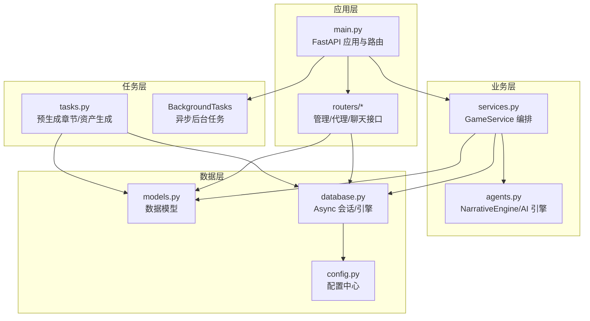
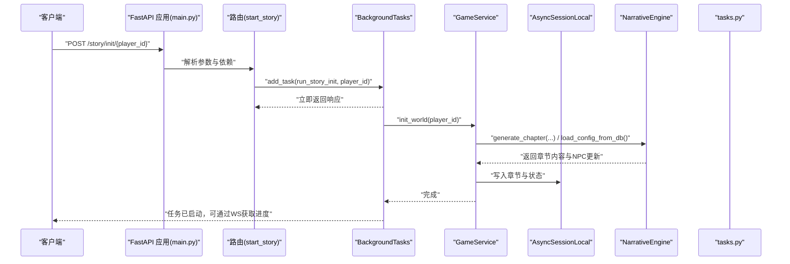
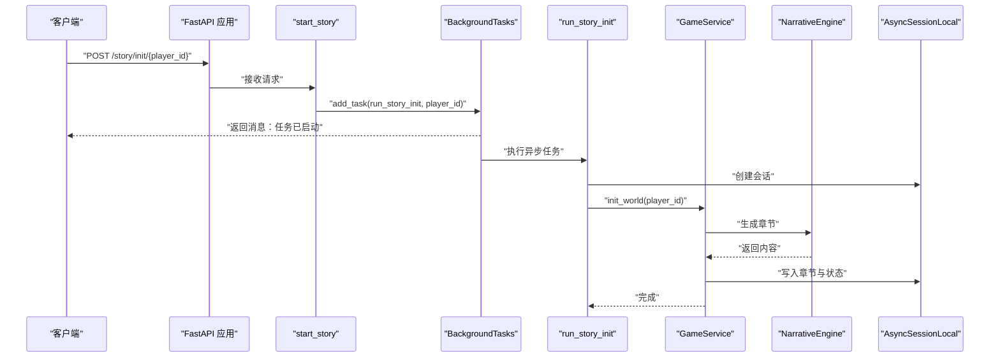
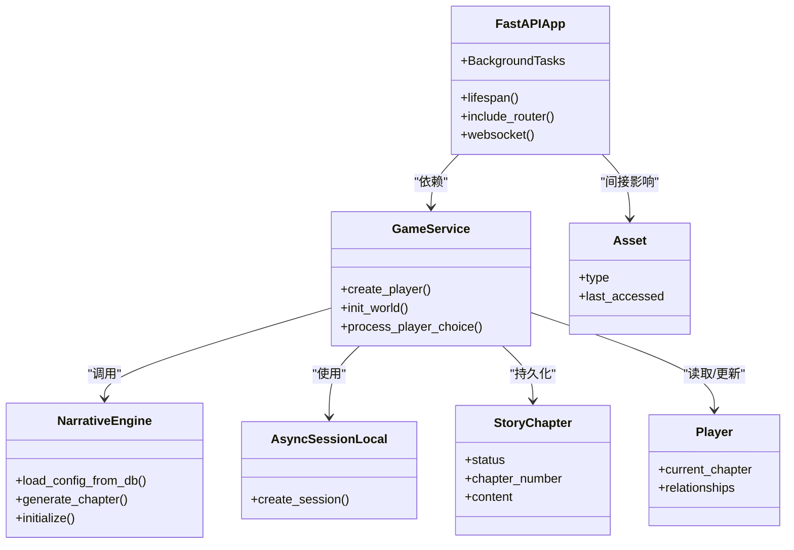
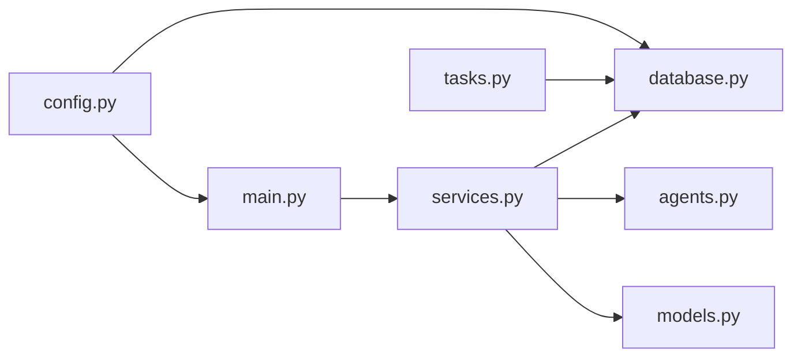

# 任务调度

<cite>
**本文引用的文件**
- [backend/main.py](file://backend/main.py)
- [backend/tasks.py](file://backend/tasks.py)
- [backend/services.py](file://backend/services.py)
- [backend/models.py](file://backend/models.py)
- [backend/database.py](file://backend/database.py)
- [backend/config.py](file://backend/config.py)
- [backend/agents.py](file://backend/agents.py)
- [backend/routers/admin.py](file://backend/routers/admin.py)
- [backend/routers/agents.py](file://backend/routers/agents.py)
- [backend/routers/chats.py](file://backend/routers/chats.py)
- [docs/wiki/Requirements-Traceability.md](file://docs/wiki/Requirements-Traceability.md)
</cite>

## 目录
1. [简介](#简介)
2. [项目结构](#项目结构)
3. [核心组件](#核心组件)
4. [架构总览](#架构总览)
5. [详细组件分析](#详细组件分析)
6. [依赖关系分析](#依赖关系分析)
7. [性能考量](#性能考量)
8. [故障排查指南](#故障排查指南)
9. [结论](#结论)
10. [附录](#附录)

## 简介
本文件系统性梳理后端任务调度与维护任务的设计与实现，重点覆盖以下方面：
- 定时任务与后台任务的配置与执行机制
- 数据库清理、缓存更新与统计报表生成的实践
- BackgroundTasks 的使用模式与异步任务处理
- 任务优先级管理、失败重试与超时控制策略
- 任务监控、进度跟踪与性能分析方法
- 批处理作业与后台维护任务的最佳实践

当前仓库中已具备基于 FastAPI BackgroundTasks 的异步后台任务能力，并结合 WebSocket 提供进度通知；同时预留了 Redis 作为后台任务队列的集成方向。定时任务与批处理作业可在此基础上扩展。

## 项目结构
后端采用 FastAPI + SQLAlchemy Async 的异步架构，核心模块围绕“请求处理”“业务服务”“数据访问”“任务处理”四个层面组织。关键文件职责如下：
- 应用入口与生命周期：backend/main.py
- 任务定义与触发：backend/tasks.py
- 业务服务编排：backend/services.py
- 数据模型与数据库会话：backend/models.py、backend/database.py
- 配置中心：backend/config.py
- AI 引擎与故事生成：backend/agents.py
- 管理与统计接口：backend/routers/admin.py、backend/routers/agents.py、backend/routers/chats.py
- 文档与需求追踪：docs/wiki/Requirements-Traceability.md

图表来源
- [backend/main.py](file://backend/main.py#L1-L173)
- [backend/tasks.py](file://backend/tasks.py#L1-L62)
- [backend/services.py](file://backend/services.py#L1-L66)
- [backend/models.py](file://backend/models.py#L1-L122)
- [backend/database.py](file://backend/database.py#L1-L31)
- [backend/config.py](file://backend/config.py#L1-L34)
- [backend/agents.py](file://backend/agents.py#L1-L196)
- [backend/routers/admin.py](file://backend/routers/admin.py#L1-L112)
- [backend/routers/agents.py](file://backend/routers/agents.py#L1-L141)
- [backend/routers/chats.py](file://backend/routers/chats.py#L1-L275)

章节来源
- [backend/main.py](file://backend/main.py#L1-L173)
- [backend/tasks.py](file://backend/tasks.py#L1-L62)
- [backend/services.py](file://backend/services.py#L1-L66)
- [backend/models.py](file://backend/models.py#L1-L122)
- [backend/database.py](file://backend/database.py#L1-L31)
- [backend/config.py](file://backend/config.py#L1-L34)
- [backend/agents.py](file://backend/agents.py#L1-L196)
- [backend/routers/admin.py](file://backend/routers/admin.py#L1-L112)
- [backend/routers/agents.py](file://backend/routers/agents.py#L1-L141)
- [backend/routers/chats.py](file://backend/routers/chats.py#L1-L275)

## 核心组件
- 应用与生命周期管理：在应用启动阶段完成数据库迁移与 LLM 配置加载，注册路由与中间件，提供根路径与 WebSocket 端点。
- 业务服务编排：GameService 负责玩家创建、世界初始化、章节生成等流程编排。
- 任务处理：tasks.py 提供章节预生成与资产生成的异步任务；main.py 通过 BackgroundTasks 触发后台任务。
- 数据访问：database.py 提供 AsyncSessionLocal 与异步引擎；models.py 定义玩家、章节、资产、LLM 提供商等实体。
- 配置中心：config.py 统一管理数据库、Redis、AI 模型与密钥等配置。
- AI 引擎：agents.py 封装 NarrativeEngine，负责从数据库加载活跃 LLM 提供商并进行故事章节生成。
- 管理与统计：routers/admin.py 提供统计接口；routers/agents.py 与 routers/chats.py 提供代理与聊天相关接口。

章节来源
- [backend/main.py](file://backend/main.py#L1-L173)
- [backend/services.py](file://backend/services.py#L1-L66)
- [backend/tasks.py](file://backend/tasks.py#L1-L62)
- [backend/models.py](file://backend/models.py#L1-L122)
- [backend/database.py](file://backend/database.py#L1-L31)
- [backend/config.py](file://backend/config.py#L1-L34)
- [backend/agents.py](file://backend/agents.py#L1-L196)
- [backend/routers/admin.py](file://backend/routers/admin.py#L1-L112)
- [backend/routers/agents.py](file://backend/routers/agents.py#L1-L141)
- [backend/routers/chats.py](file://backend/routers/chats.py#L1-L275)

## 架构总览
下图展示从请求到任务执行与数据持久化的整体流程，以及与 AI 引擎和数据库的交互关系。

图表来源
- [backend/main.py](file://backend/main.py#L147-L155)
- [backend/services.py](file://backend/services.py#L19-L58)
- [backend/agents.py](file://backend/agents.py#L49-L99)
- [backend/tasks.py](file://backend/tasks.py#L1-L62)

## 详细组件分析

### BackgroundTasks 使用模式与异步任务处理
- 触发方式：在路由中注入 BackgroundTasks 并通过 add_task 添加协程函数，实现请求即刻返回、后台异步执行。
- 会话管理：后台任务内部使用 AsyncSessionLocal 创建独立会话，避免与请求上下文耦合。
- 任务链路：以“章节初始化”为例，后台任务调用 GameService.init_world，进而通过 NarrativeEngine 生成章节内容并持久化。

图表来源
- [backend/main.py](file://backend/main.py#L147-L155)
- [backend/services.py](file://backend/services.py#L19-L58)
- [backend/agents.py](file://backend/agents.py#L154-L191)
- [backend/database.py](file://backend/database.py#L19-L23)

章节来源
- [backend/main.py](file://backend/main.py#L147-L155)
- [backend/database.py](file://backend/database.py#L19-L23)

### 定时任务与批处理作业设计
- 当前实现：仓库未内置定时任务框架（如 APScheduler/Celery），但已预留 Redis 作为 Broker 的配置项，为后续引入定时任务与后台队列奠定基础。
- 扩展建议：
  - 引入 Celery 或 APScheduler，结合 Redis 作为 broker/backlog 存储。
  - 将耗时任务（如章节预生成、资产生成、统计报表）纳入队列，按优先级分派。
  - 对重复执行的任务（如清理过期章节、归档旧会话）设置周期性调度。
- 任务类型示例：
  - 数据库清理：删除 N 天前的临时会话、过期缓存键、冗余资产记录。
  - 缓存更新：定期刷新热门章节摘要、NPC 关系快照。
  - 统计报表：每日汇总新增玩家、章节数量、资产生成量等指标。

章节来源
- [backend/config.py](file://backend/config.py#L18-L19)
- [docs/wiki/Requirements-Traceability.md](file://docs/wiki/Requirements-Traceability.md#L36-L37)

### 任务优先级管理、失败重试与超时控制
- 优先级策略：
  - 即时用户触发任务（如章节初始化）标记为高优先级，确保快速响应。
  - 后台维护任务（清理、统计）标记为低优先级，避开业务高峰期。
- 失败重试：
  - 对外部 API（LLM、图像生成）调用增加指数退避重试与最大重试次数限制。
  - 对数据库写入失败进行幂等处理与补偿记录。
- 超时控制：
  - 为长耗时任务设置超时阈值，超时后记录告警并回滚部分状态。
  - 在 WebSocket 上推送阶段性进度，便于用户感知与取消。

章节来源
- [backend/agents.py](file://backend/agents.py#L154-L191)
- [docs/wiki/Requirements-Traceability.md](file://docs/wiki/Requirements-Traceability.md#L44-L46)

### 任务监控、进度跟踪与性能分析
- 进度跟踪：
  - 使用 WebSocket 端点向客户端推送任务状态与阶段性结果。
  - 在后台任务中记录关键节点日志，便于审计与排障。
- 监控指标：
  - 任务执行时延、成功率、重试次数、超时次数。
  - LLM 调用的 Token 使用量、成本估算。
- 性能分析：
  - 分析数据库查询瓶颈（索引缺失、锁竞争）。
  - 评估 AI 生成耗时占比，识别慢提示词与上下文窗口问题。
  - 通过连接池参数（pool_pre_ping、pool_size、max_overflow）优化数据库吞吐。

章节来源
- [backend/main.py](file://backend/main.py#L157-L169)
- [backend/routers/chats.py](file://backend/routers/chats.py#L113-L258)
- [backend/database.py](file://backend/database.py#L8-L17)

### 数据库清理、缓存更新与统计报表生成
- 数据库清理：
  - 设计清理策略：删除超过保留期限的临时会话、无主章节、未使用的资产记录。
  - 使用批量删除与分页扫描，避免长时间锁表。
- 缓存更新：
  - 利用 Redis 键空间事件或定时任务刷新热点数据。
  - 对章节摘要、NPC 快照等建立缓存失效策略。
- 统计报表：
  - 通过管理接口聚合玩家、章节、资产与提供商数量。
  - 结合数据库聚合查询与缓存命中率，生成运营看板。

章节来源
- [backend/routers/admin.py](file://backend/routers/admin.py#L16-L31)
- [backend/models.py](file://backend/models.py#L24-L57)
- [backend/config.py](file://backend/config.py#L18-L19)

### 代码级组件关系图

图表来源
- [backend/main.py](file://backend/main.py#L83-L98)
- [backend/services.py](file://backend/services.py#L8-L66)
- [backend/agents.py](file://backend/agents.py#L43-L196)
- [backend/database.py](file://backend/database.py#L19-L23)
- [backend/models.py](file://backend/models.py#L9-L122)

## 依赖关系分析
- 组件耦合：
  - main.py 与 services.py 通过依赖注入解耦；services.py 与 agents.py、database.py 形成清晰的数据访问与业务编排边界。
  - tasks.py 与 services.py 在“章节预生成”场景存在协作关系，但通过异步任务隔离了请求时延。
- 外部依赖：
  - Redis 作为潜在后台队列 Broker；SQLite/PostgreSQL 作为数据存储；AgentScope/OpenAI/DashScope 作为 AI 服务。
- 潜在风险：
  - 缺少统一的任务调度框架可能导致任务堆积与资源争用。
  - WebSocket 仅用于进度通知，未实现任务取消与断线重连机制。

图表来源
- [backend/main.py](file://backend/main.py#L30-L43)
- [backend/services.py](file://backend/services.py#L1-L11)
- [backend/agents.py](file://backend/agents.py#L1-L10)
- [backend/database.py](file://backend/database.py#L1-L5)
- [backend/models.py](file://backend/models.py#L1-L4)
- [backend/config.py](file://backend/config.py#L1-L5)
- [backend/tasks.py](file://backend/tasks.py#L1-L5)

章节来源
- [backend/main.py](file://backend/main.py#L30-L43)
- [backend/services.py](file://backend/services.py#L1-L11)
- [backend/agents.py](file://backend/agents.py#L1-L10)
- [backend/database.py](file://backend/database.py#L1-L5)
- [backend/models.py](file://backend/models.py#L1-L4)
- [backend/config.py](file://backend/config.py#L1-L5)
- [backend/tasks.py](file://backend/tasks.py#L1-L5)

## 性能考量
- 数据库性能：
  - 使用连接池参数优化并发；对高频查询建立必要索引（如章节号、玩家 ID、创建时间）。
  - 批量写入与事务合并，减少往返开销。
- AI 生成性能：
  - 控制上下文长度与温度参数，避免过度生成。
  - 对外部 API 调用增加超时与重试，避免阻塞主线程。
- 任务执行性能：
  - 将 CPU 密集型与 IO 密集型任务分离，利用异步与并发。
  - 对重复计算结果进行缓存，降低重复生成成本。

## 故障排查指南
- WebSocket 连接异常：
  - 检查 CORS 配置与客户端域名白名单；确认端点路径与握手流程。
- 任务未执行或执行缓慢：
  - 查看后台任务日志与数据库写入状态；检查 AI 引擎初始化是否成功。
- 数据库连接失败：
  - 核对 DATABASE_URL 与连接参数；确认连接池大小与超时设置。
- Redis 未启用：
  - 若计划引入后台队列，先部署 Redis 并更新配置项。

章节来源
- [backend/main.py](file://backend/main.py#L85-L91)
- [backend/main.py](file://backend/main.py#L157-L169)
- [backend/database.py](file://backend/database.py#L8-L17)
- [backend/config.py](file://backend/config.py#L18-L19)
- [backend/agents.py](file://backend/agents.py#L49-L75)

## 结论
本项目已具备基于 BackgroundTasks 的异步任务能力与 WebSocket 进度通知机制，能够满足即时性较强的后台任务需求。为进一步提升稳定性与可运维性，建议：
- 引入任务调度框架（如 Celery/APScheduler）与 Redis 队列，实现定时任务、优先级与重试控制。
- 完善任务监控与告警体系，覆盖执行时延、失败率与资源使用。
- 优化数据库与 AI 生成性能，建立缓存与批处理策略，支撑更大规模的并发与数据体量。

## 附录
- 术语说明：
  - BackgroundTasks：FastAPI 内置的后台任务机制，适合轻量异步任务。
  - Redis：可作为后台队列的 Broker，支持分布式任务调度。
  - WebSocket：用于实时推送任务进度与状态。
- 参考文档：
  - Requirements-Traceability.md 中提及 Redis 队列与 WebSocket 的实现状态与后续计划。