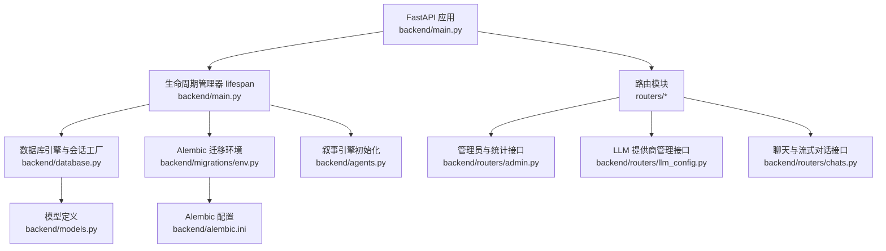
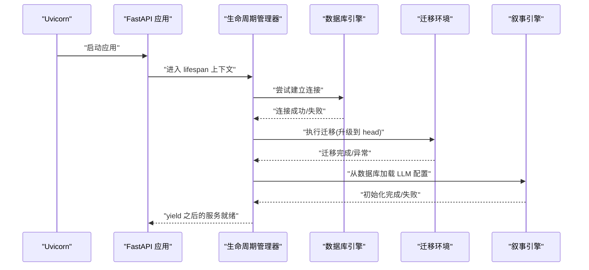
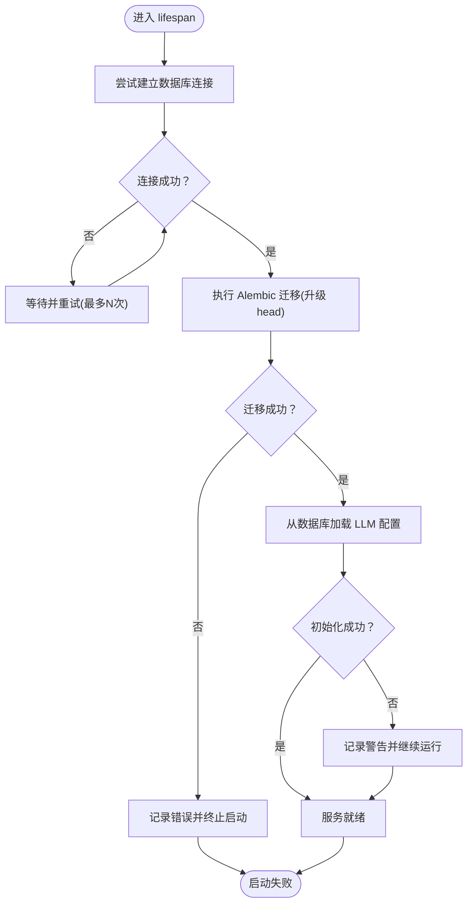
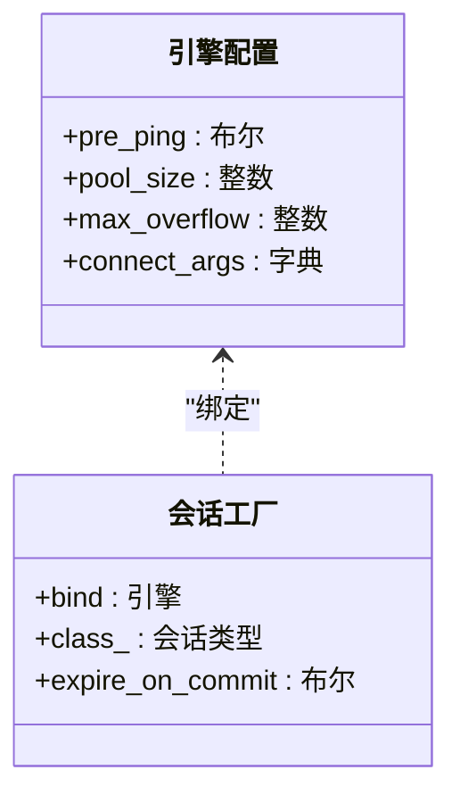
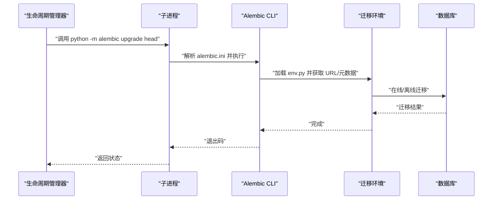
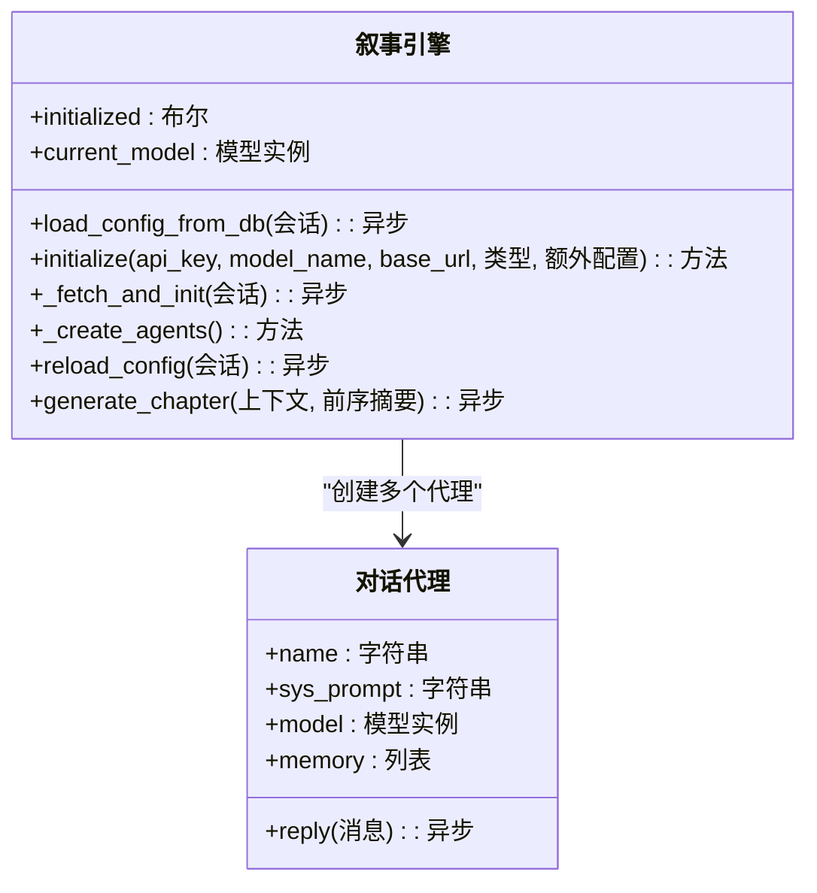
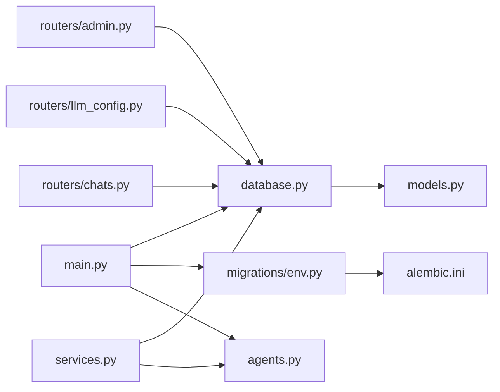

# 健康检查

<cite>
**本文引用的文件**
- [backend/main.py](file://backend/main.py)
- [backend/database.py](file://backend/database.py)
- [backend/config.py](file://backend/config.py)
- [backend/migrations/env.py](file://backend/migrations/env.py)
- [backend/alembic.ini](file://backend/alembic.ini)
- [backend/manage_db.py](file://backend/manage_db.py)
- [backend/agents.py](file://backend/agents.py)
- [backend/models.py](file://backend/models.py)
- [backend/services.py](file://backend/services.py)
- [backend/routers/admin.py](file://backend/routers/admin.py)
- [backend/routers/llm_config.py](file://backend/routers/llm_config.py)
- [backend/routers/chats.py](file://backend/routers/chats.py)
</cite>

## 目录
1. [简介](#简介)
2. [项目结构](#项目结构)
3. [核心组件](#核心组件)
4. [架构总览](#架构总览)
5. [组件详解](#组件详解)
6. [依赖关系分析](#依赖关系分析)
7. [性能与可靠性](#性能与可靠性)
8. [故障排查指南](#故障排查指南)
9. [结论](#结论)
10. [附录：健康检查端点与指标建议](#附录健康检查端点与指标建议)

## 简介
本文件聚焦于后端服务的健康检查机制，围绕 lifespan 生命周期管理器中的数据库连接重试逻辑与 Alembic 迁移执行过程展开；同时给出服务启动自检流程（数据库连接验证、迁移执行、叙事引擎初始化）的完整说明，并提供健康检查端点设计思路与监控指标收集建议。文档还覆盖连接池配置、超时与重试策略的最佳实践，以及服务可用性检测与故障自动恢复机制的落地建议。

## 项目结构
后端采用 FastAPI 应用，通过 lifespan 在启动阶段完成数据库连接重试、迁移执行与叙事引擎初始化；数据库层使用 SQLAlchemy 异步引擎与连接池；迁移工具链基于 Alembic；AI 引擎通过 agentscope 初始化并从数据库加载 LLM 提供商配置。

图表来源
- [backend/main.py](file://backend/main.py#L45-L82)
- [backend/database.py](file://backend/database.py#L1-L31)
- [backend/migrations/env.py](file://backend/migrations/env.py#L1-L105)
- [backend/alembic.ini](file://backend/alembic.ini#L1-L115)
- [backend/agents.py](file://backend/agents.py#L43-L130)
- [backend/models.py](file://backend/models.py#L1-L122)
- [backend/routers/admin.py](file://backend/routers/admin.py#L1-L112)
- [backend/routers/llm_config.py](file://backend/routers/llm_config.py#L1-L203)
- [backend/routers/chats.py](file://backend/routers/chats.py#L1-L275)

章节来源
- [backend/main.py](file://backend/main.py#L1-L173)
- [backend/database.py](file://backend/database.py#L1-L31)
- [backend/config.py](file://backend/config.py#L1-L34)

## 核心组件
- 生命周期管理器（lifespan）：负责启动阶段的数据库连接重试、迁移执行与叙事引擎初始化。
- 数据库引擎与连接池：异步引擎、会话工厂、预 ping 与溢出连接配置。
- Alembic 迁移：离线/在线迁移执行，支持批量渲染与异步上下文。
- 叙事引擎：从数据库加载 LLM 提供商配置并初始化 agentscope 模型实例。
- 路由与服务：提供统计、LLM 提供商管理、聊天流式对话等能力。

章节来源
- [backend/main.py](file://backend/main.py#L45-L82)
- [backend/database.py](file://backend/database.py#L1-L31)
- [backend/migrations/env.py](file://backend/migrations/env.py#L1-L105)
- [backend/agents.py](file://backend/agents.py#L43-L130)

## 架构总览
下图展示启动阶段的关键交互：FastAPI 启动 lifespan，尝试连接数据库并执行迁移，随后从数据库加载 LLM 配置以初始化叙事引擎。

图表来源
- [backend/main.py](file://backend/main.py#L45-L82)
- [backend/migrations/env.py](file://backend/migrations/env.py#L74-L104)
- [backend/agents.py](file://backend/agents.py#L49-L100)

## 组件详解

### 生命周期管理器（lifespan）与启动自检
- 数据库连接重试：在 lifespan 中循环尝试建立连接，最多重试固定次数，每次失败等待固定时间间隔。
- 迁移执行：使用子进程调用 Alembic 升级到最新版本，避免与异步事件循环产生上下文冲突。
- 叙事引擎初始化：尝试从数据库加载活动的 LLM 提供商配置并初始化 agentscope 模型。

图表来源
- [backend/main.py](file://backend/main.py#L45-L82)

章节来源
- [backend/main.py](file://backend/main.py#L45-L82)

### 数据库连接池与超时配置
- 连接池参数：启用 pre_ping 实现自动重连；设置池大小与最大溢出连接数；SQLite 场景下关闭多线程校验。
- 会话工厂：使用异步会话工厂，避免过早过期提交；在需要时可独立使用 AsyncSessionLocal。

图表来源
- [backend/database.py](file://backend/database.py#L8-L23)

章节来源
- [backend/database.py](file://backend/database.py#L1-L31)
- [backend/config.py](file://backend/config.py#L15-L16)

### Alembic 迁移执行过程
- 环境配置：从配置中读取数据库 URL，注册模型元数据，支持离线与在线两种迁移模式。
- 在线迁移：创建异步引擎并使用异步连接执行迁移，确保与应用异步上下文兼容。
- 批量渲染：迁移脚本渲染为批处理模式，提升兼容性。

图表来源
- [backend/main.py](file://backend/main.py#L61-L64)
- [backend/migrations/env.py](file://backend/migrations/env.py#L39-L104)
- [backend/alembic.ini](file://backend/alembic.ini#L61-L61)

章节来源
- [backend/migrations/env.py](file://backend/migrations/env.py#L1-L105)
- [backend/alembic.ini](file://backend/alembic.ini#L1-L115)
- [backend/manage_db.py](file://backend/manage_db.py#L1-L67)

### 叙事引擎初始化与配置加载
- 配置来源：优先从数据库查询活动的 LLM 提供商；若无则回退到本地配置。
- 模型初始化：根据提供商类型选择 agentscope 的具体模型类，构建对话代理并标记初始化完成。
- 动态重载：当数据库中活动提供商变更时，可通过 API 触发重载。

图表来源
- [backend/agents.py](file://backend/agents.py#L43-L196)

章节来源
- [backend/agents.py](file://backend/agents.py#L1-L196)
- [backend/models.py](file://backend/models.py#L58-L78)

### 路由与服务：统计、LLM 提供商与聊天
- 管理员统计：提供玩家、故事、资源、提供商数量统计接口。
- LLM 提供商管理：支持测试连接、创建、查询、更新、删除；更新/创建时如为活动提供商则触发引擎重载。
- 聊天接口：支持创建会话、列出会话、获取消息、发送消息并流式返回响应；内部保存助手回复并更新会话时间戳。

章节来源
- [backend/routers/admin.py](file://backend/routers/admin.py#L1-L112)
- [backend/routers/llm_config.py](file://backend/routers/llm_config.py#L1-L203)
- [backend/routers/chats.py](file://backend/routers/chats.py#L1-L275)
- [backend/services.py](file://backend/services.py#L1-L66)

## 依赖关系分析
- 应用依赖：FastAPI 应用依赖 lifespan、数据库引擎、路由模块；路由模块依赖数据库与模型。
- 迁移依赖：迁移环境依赖配置与模型元数据；Alembic 配置决定日志级别与脚本位置。
- 引擎依赖：叙事引擎依赖数据库会话与 LLM 提供商模型；LLM 提供商模型来自数据库。

图表来源
- [backend/main.py](file://backend/main.py#L30-L43)
- [backend/database.py](file://backend/database.py#L1-L31)
- [backend/migrations/env.py](file://backend/migrations/env.py#L1-L33)
- [backend/alembic.ini](file://backend/alembic.ini#L1-L115)
- [backend/agents.py](file://backend/agents.py#L1-L10)
- [backend/models.py](file://backend/models.py#L1-L10)
- [backend/routers/admin.py](file://backend/routers/admin.py#L1-L14)
- [backend/routers/llm_config.py](file://backend/routers/llm_config.py#L1-L18)
- [backend/routers/chats.py](file://backend/routers/chats.py#L1-L14)
- [backend/services.py](file://backend/services.py#L1-L7)

章节来源
- [backend/main.py](file://backend/main.py#L30-L43)
- [backend/database.py](file://backend/database.py#L1-L31)
- [backend/migrations/env.py](file://backend/migrations/env.py#L1-L33)
- [backend/alembic.ini](file://backend/alembic.ini#L1-L115)
- [backend/agents.py](file://backend/agents.py#L1-L10)
- [backend/models.py](file://backend/models.py#L1-L10)
- [backend/routers/admin.py](file://backend/routers/admin.py#L1-L14)
- [backend/routers/llm_config.py](file://backend/routers/llm_config.py#L1-L18)
- [backend/routers/chats.py](file://backend/routers/chats.py#L1-L14)
- [backend/services.py](file://backend/services.py#L1-L7)

## 性能与可靠性
- 连接池与预热
  - 使用 pre_ping 减少无效连接导致的异常；合理设置 pool_size 与 max_overflow，避免高并发下的连接争用。
  - SQLite 下禁用多线程校验，避免不必要的开销。
- 超时与重试
  - 启动阶段采用固定间隔重试，避免阻塞主事件循环；生产环境可引入指数退避与抖动。
  - 迁移执行通过子进程隔离，避免阻塞应用主循环。
- 异常隔离
  - 数据库连接失败与迁移失败均记录并按阶段终止；叙事引擎初始化失败仅记录警告并继续运行，保证服务可用性。
- 可观测性
  - 建议在启动阶段输出迁移与连接结果的日志级别，便于监控告警。
  - 在聊天接口中记录请求耗时、Token 使用量与错误率，作为健康指标采集基础。

章节来源
- [backend/database.py](file://backend/database.py#L8-L23)
- [backend/main.py](file://backend/main.py#L45-L82)
- [backend/routers/chats.py](file://backend/routers/chats.py#L112-L258)

## 故障排查指南
- 启动阶段无法连接数据库
  - 检查数据库 URL 与凭据；确认网络可达；查看重试日志与最终失败原因。
  - 若为 SQLite，请确认路径正确且文件存在。
- 迁移失败
  - 查看 Alembic 输出与日志；确认模型元数据已注册；检查迁移脚本是否与当前数据库状态匹配。
- 叙事引擎未初始化
  - 确认数据库中存在活动的 LLM 提供商；检查 API Key 与模型名称；查看初始化日志。
- 聊天接口异常
  - 检查提供商类型与客户端初始化分支；关注流式响应中的错误片段；核对会话与消息表一致性。

章节来源
- [backend/main.py](file://backend/main.py#L45-L82)
- [backend/migrations/env.py](file://backend/migrations/env.py#L74-L104)
- [backend/agents.py](file://backend/agents.py#L49-L100)
- [backend/routers/chats.py](file://backend/routers/chats.py#L112-L258)

## 结论
本项目的健康检查机制以 lifespan 为核心，在启动阶段完成数据库连接重试、迁移执行与叙事引擎初始化，确保服务在可用状态下对外提供能力。通过合理的连接池配置、超时与重试策略，以及可观测性的日志与指标采集，系统具备良好的稳定性与可维护性。后续可在现有基础上扩展健康检查端点与自动化恢复策略，进一步提升运维效率。

## 附录：健康检查端点与指标建议
- 健康检查端点设计
  - GET /health：返回服务状态（数据库连接、迁移状态、叙事引擎初始化状态、外部依赖可用性）。
  - GET /metrics：返回关键指标（数据库连接池使用率、迁移执行时长、LLM 提供商可用性、聊天接口错误率、平均响应时间）。
- 指标采集建议
  - 数据库：连接池活跃连接数、空闲连接数、等待队列长度、连接失败次数。
  - 迁移：最近一次迁移时间、迁移耗时、迁移失败次数。
  - 引擎：模型初始化耗时、推理成功率、Token 使用量。
  - 接口：请求总量、错误率、P95/P99 响应时间、流式传输中断次数。
- 自动化恢复
  - 对于数据库连接失败，可结合重试策略与熔断器；对于迁移失败，建议暂停启动并告警，待人工介入后重试。
  - 对于叙事引擎初始化失败，记录并降级处理，允许后台定时重试或通过管理接口手动触发重载。

[本节为概念性内容，不直接分析具体源文件，故不附加章节来源]