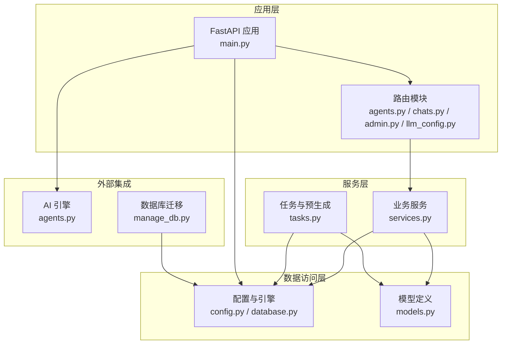
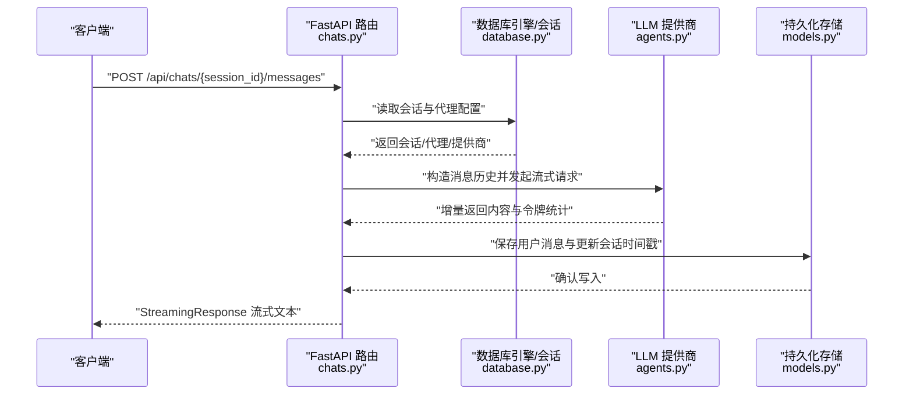
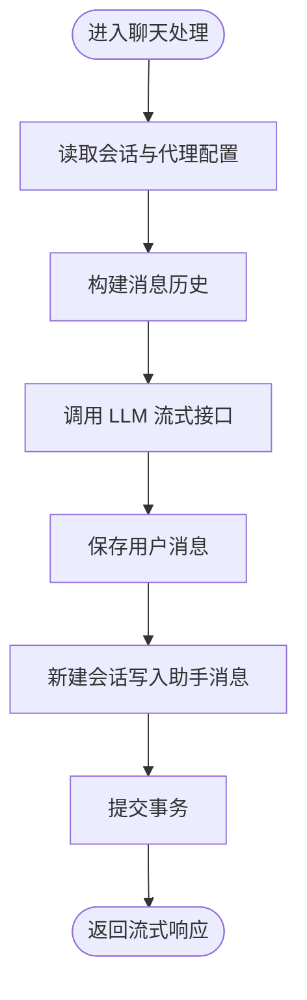
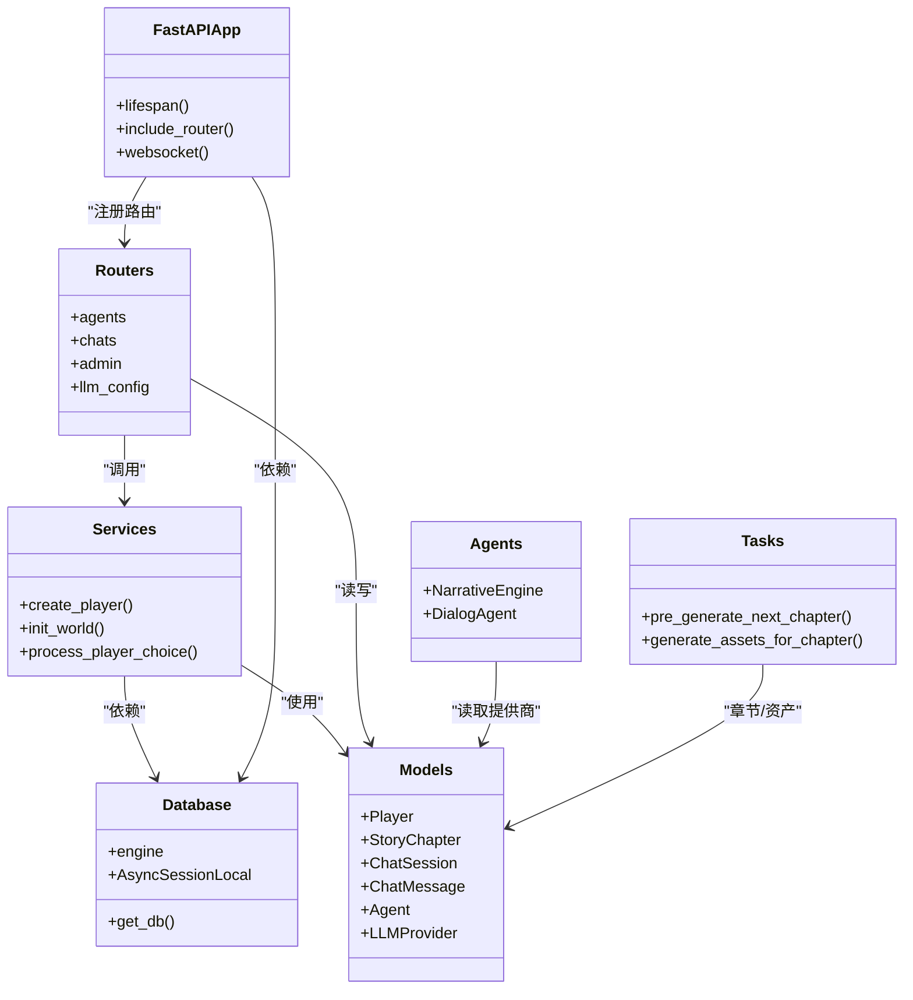

# 性能监控

<cite>
**本文引用的文件**
- [backend/main.py](file://backend/main.py)
- [backend/config.py](file://backend/config.py)
- [backend/database.py](file://backend/database.py)
- [backend/services.py](file://backend/services.py)
- [backend/models.py](file://backend/models.py)
- [backend/routers/agents.py](file://backend/routers/agents.py)
- [backend/routers/chats.py](file://backend/routers/chats.py)
- [backend/routers/admin.py](file://backend/routers/admin.py)
- [backend/routers/llm_config.py](file://backend/routers/llm_config.py)
- [backend/schemas.py](file://backend/schemas.py)
- [backend/agents.py](file://backend/agents.py)
- [backend/tasks.py](file://backend/tasks.py)
- [backend/manage_db.py](file://backend/manage_db.py)
- [backend/requirements.txt](file://backend/requirements.txt)
</cite>

## 目录
1. [简介](#简介)
2. [项目结构](#项目结构)
3. [核心组件](#核心组件)
4. [架构总览](#架构总览)
5. [详细组件分析](#详细组件分析)
6. [依赖关系分析](#依赖关系分析)
7. [性能考量与优化建议](#性能考量与优化建议)
8. [故障排查指南](#故障排查指南)
9. [结论](#结论)
10. [附录](#附录)

## 简介
本指南面向后端性能监控与指标收集，结合当前代码库的实际实现，系统性地给出关键性能指标（KPI）定义与测量方法，覆盖响应时间、吞吐量、资源使用率；数据库查询性能优化与连接池监控；内存与 CPU 负载分析；并发处理能力评估；瓶颈识别与热点分析；容量规划建议；以及监控仪表板与告警阈值配置思路。文档同时提供基于现有代码结构的可视化图示与可操作的改进建议。

## 项目结构
后端采用 FastAPI + SQLAlchemy Async 的异步架构，主要模块包括：
- 应用入口与生命周期：FastAPI 应用、CORS 中间件、路由注册、WebSocket、启动迁移与引擎初始化
- 配置管理：环境变量与默认配置（数据库、Redis、AI 模型等）
- 数据访问层：异步引擎、会话工厂、模型定义
- 业务服务：玩家创建、世界初始化、故事章节生成
- 路由层：聊天流式响应、代理与 LLM 提供商管理、管理员统计接口
- 任务与引擎：NarrativeEngine 基于 AgentScope 的故事生成与模型初始化
- 数据库迁移：Alembic 管理与命令行工具

图表来源
- [backend/main.py](file://backend/main.py#L83-L98)
- [backend/routers/agents.py](file://backend/routers/agents.py#L1-L141)
- [backend/routers/chats.py](file://backend/routers/chats.py#L1-L275)
- [backend/routers/admin.py](file://backend/routers/admin.py#L1-L112)
- [backend/routers/llm_config.py](file://backend/routers/llm_config.py#L1-L203)
- [backend/services.py](file://backend/services.py#L1-L66)
- [backend/tasks.py](file://backend/tasks.py#L1-L62)
- [backend/config.py](file://backend/config.py#L1-L34)
- [backend/database.py](file://backend/database.py#L1-L31)
- [backend/models.py](file://backend/models.py#L1-L122)
- [backend/agents.py](file://backend/agents.py#L1-L196)
- [backend/manage_db.py](file://backend/manage_db.py#L1-L67)

章节来源
- [backend/main.py](file://backend/main.py#L1-L173)
- [backend/config.py](file://backend/config.py#L1-L34)
- [backend/database.py](file://backend/database.py#L1-L31)
- [backend/models.py](file://backend/models.py#L1-L122)

## 核心组件
- 应用入口与生命周期
  - 启动时执行数据库连接与迁移，加载 LLM 配置到叙事引擎
  - 注册 CORS、路由与静态资源挂载点
  - 提供根路径、玩家创建、故事初始化（后台任务）、WebSocket 接入
- 数据库与连接池
  - 异步引擎配置：pool_pre_ping、pool_size、max_overflow、SQLite 特殊参数
  - 会话工厂与依赖注入 get_db
- 业务服务
  - 玩家创建、世界初始化（调用叙事引擎生成章节）
  - 玩家选择处理预留扩展
- 路由与流式响应
  - 聊天消息发送：构建历史、调用 LLM 提供商、流式返回、保存助手回复
  - 代理与 LLM 提供商管理：增删查改、连接测试、默认/激活状态切换
  - 管理员统计：玩家、故事、资产、提供商数量
- 引擎与任务
  - NarrativeEngine：从数据库加载活跃提供商，初始化模型，创建对话代理，按需生成章节
  - 预生成任务：检查下一章是否存在，生成并落库，触发资产生成

章节来源
- [backend/main.py](file://backend/main.py#L45-L81)
- [backend/database.py](file://backend/database.py#L8-L23)
- [backend/services.py](file://backend/services.py#L8-L66)
- [backend/routers/chats.py](file://backend/routers/chats.py#L72-L258)
- [backend/routers/llm_config.py](file://backend/routers/llm_config.py#L20-L111)
- [backend/routers/admin.py](file://backend/routers/admin.py#L16-L31)
- [backend/agents.py](file://backend/agents.py#L43-L196)
- [backend/tasks.py](file://backend/tasks.py#L7-L56)

## 架构总览
下图展示请求从客户端到数据库与外部 LLM 的典型链路，标注关键性能关注点（连接池、流式、日志、错误处理）。

图表来源
- [backend/routers/chats.py](file://backend/routers/chats.py#L72-L258)
- [backend/database.py](file://backend/database.py#L28-L31)
- [backend/agents.py](file://backend/agents.py#L101-L125)
- [backend/models.py](file://backend/models.py#L80-L99)

## 详细组件分析

### 数据库连接池与查询性能
- 连接池配置要点
  - pool_pre_ping：自动重连，降低空闲断连风险
  - pool_size/max_overflow：控制并发与溢出连接，避免过载
  - SQLite 特殊参数：禁用线程校验以适配异步运行
- 查询与事务
  - 使用 AsyncSessionLocal 创建会话，expire_on_commit=False 减少刷新开销
  - 在长流程中（如聊天响应）使用独立会话写入助手消息，避免主事务阻塞
- 优化建议
  - 为高频查询添加索引（如 ChatMessage.session_id、Player.username）
  - 对分页查询使用 LIMIT/OFFSET，避免全表扫描
  - 将只读查询与写入分离，减少锁竞争
  - 定期分析慢查询日志（SQLAlchemy echo 可临时开启）

图表来源
- [backend/routers/chats.py](file://backend/routers/chats.py#L72-L258)
- [backend/database.py](file://backend/database.py#L19-L23)

章节来源
- [backend/database.py](file://backend/database.py#L8-L23)
- [backend/routers/chats.py](file://backend/routers/chats.py#L72-L258)

### 响应时间与吞吐量
- 响应时间构成
  - 网络与框架：FastAPI/uvicorn 处理时间
  - 数据库：查询与写入耗时（含连接池等待）
  - 外部 LLM：网络往返、模型推理、流式传输
- 吞吐量
  - 并发请求数（RPS）与连接池上限的关系
  - 流式响应对前端体验与服务器内存占用的影响
- 指标采集建议
  - 使用中间件或装饰器记录每个请求的开始/结束时间
  - 分别统计 DB、LLM、业务逻辑三段耗时
  - 记录并发连接数、队列等待时间

章节来源
- [backend/main.py](file://backend/main.py#L14-L28)
- [backend/routers/chats.py](file://backend/routers/chats.py#L113-L258)

### 内存使用与 CPU 负载
- 内存
  - 流式响应仅累积增量内容，避免一次性拼接大字符串
  - 代理记忆列表增长需限制长度，定期清理
- CPU
  - LLM 推理是主要 CPU 开销
  - 批量写入与序列化尽量合并，减少循环内 IO
- 监控建议
  - 采集进程级内存/CPU 使用率
  - 观察会话峰值与平均并发下的内存曲线

章节来源
- [backend/routers/chats.py](file://backend/routers/chats.py#L113-L258)
- [backend/agents.py](file://backend/agents.py#L11-L42)

### 并发处理能力评估
- 并发模型
  - 异步 FastAPI + 异步 SQLAlchemy，适合高并发 IO 密集场景
- 关键约束
  - 连接池大小与最大溢出连接
  - LLM 限流与速率限制
- 评估方法
  - 压测不同并发度下的 P95/P99 延迟与错误率
  - 观察连接池等待时间与拒绝率

章节来源
- [backend/database.py](file://backend/database.py#L11-L16)
- [backend/routers/chats.py](file://backend/routers/chats.py#L145-L209)

### 瓶颈识别与热点分析
- 典型热点
  - LLM 推理延迟与令牌用量
  - 数据库写入（尤其是流式响应后的二次写入）
  - 代理记忆与消息历史长度
- 识别手段
  - 结合日志中的输入/输出字符数、令牌统计、上下文占比
  - 通过指标面板观察延迟分布与错误率变化

章节来源
- [backend/routers/chats.py](file://backend/routers/chats.py#L129-L234)

### 容量规划建议
- 数据库
  - 根据峰值并发与写入频率设定 pool_size 与 max_overflow
  - 预留 20%-30% 的溢出空间应对突发流量
- LLM
  - 依据提供商限流策略与模型上下文窗口，估算最大并发会话数
  - 为不同模型设置独立队列或限速策略
- 缓存与预生成
  - 使用 Redis 缓存常用配置与短期热点数据
  - 预生成下一章内容，降低实时生成延迟

章节来源
- [backend/config.py](file://backend/config.py#L18-L28)
- [backend/tasks.py](file://backend/tasks.py#L7-L56)

### 监控仪表板与告警阈值
- 指标建议
  - 响应时间：P50/P95/P99、错误率
  - 吞吐量：RPS、并发连接数
  - 数据库：连接池使用率、等待时间、慢查询数
  - LLM：请求成功率、平均/99 分位延迟、令牌用量
  - 资源：CPU、内存、磁盘 IO
- 阈值示例（参考）
  - 响应时间 P95 > 2s 或 P99 > 5s
  - 错误率 > 1%
  - 连接池等待时间 > 500ms
  - LLM 成功率 < 95%
  - CPU 使用率 > 85%，内存水位持续上升
- 告警通道
  - 邮件/IM 通知，分级告警（预警/严重/致命）

## 依赖关系分析

图表来源
- [backend/main.py](file://backend/main.py#L83-L98)
- [backend/database.py](file://backend/database.py#L1-L31)
- [backend/models.py](file://backend/models.py#L1-L122)
- [backend/services.py](file://backend/services.py#L1-L66)
- [backend/routers/agents.py](file://backend/routers/agents.py#L1-L141)
- [backend/routers/chats.py](file://backend/routers/chats.py#L1-L275)
- [backend/routers/admin.py](file://backend/routers/admin.py#L1-L112)
- [backend/routers/llm_config.py](file://backend/routers/llm_config.py#L1-L203)
- [backend/agents.py](file://backend/agents.py#L1-L196)
- [backend/tasks.py](file://backend/tasks.py#L1-L62)

章节来源
- [backend/main.py](file://backend/main.py#L30-L43)
- [backend/routers/agents.py](file://backend/routers/agents.py#L1-L141)
- [backend/routers/chats.py](file://backend/routers/chats.py#L1-L275)
- [backend/routers/admin.py](file://backend/routers/admin.py#L1-L112)
- [backend/routers/llm_config.py](file://backend/routers/llm_config.py#L1-L203)

## 性能考量与优化建议

- 响应时间优化
  - 优先缩短 LLM 推理时间：选择更合适的模型、减少上下文长度、启用缓存
  - 优化数据库写入：批量插入、减少不必要的刷新
  - 使用连接池复用与合理的超时设置
- 吞吐量提升
  - 限制单会话并发，避免过度竞争
  - 对外部 LLM 调用增加队列与限速
- 资源使用控制
  - 控制代理记忆长度，定期清理
  - 流式响应时避免累积过大数据块
- 数据库性能
  - 为高频字段建立索引
  - 分页查询使用覆盖索引
  - 定期归档历史数据，缩小热表规模
- 并发与稳定性
  - 设置合理的超时与重试策略
  - 对外部依赖增加熔断与降级

## 故障排查指南
- 启动阶段
  - 数据库连接失败：检查 DATABASE_URL、权限与网络；查看重试日志
  - 迁移失败：确认 Alembic 环境与版本一致
- 运行阶段
  - LLM 连接异常：检查提供商类型、API Key、Base URL、速率限制
  - 聊天流式中断：关注日志中的 usage 与错误信息
  - 写入失败：确认会话存在、事务提交成功
- 日志与可观测性
  - 启用必要的日志级别，避免过度输出
  - 记录关键指标与上下文（会话 ID、模型、令牌用量）

章节来源
- [backend/main.py](file://backend/main.py#L45-L81)
- [backend/routers/chats.py](file://backend/routers/chats.py#L211-L216)
- [backend/routers/llm_config.py](file://backend/routers/llm_config.py#L107-L111)

## 结论
通过在现有异步架构基础上引入完善的指标采集、连接池监控、LLM 限流与缓存策略，并配合容量规划与告警机制，可以有效提升系统的稳定性与可扩展性。建议优先落地响应时间与错误率监控，逐步扩展到资源使用与数据库性能指标，形成闭环的性能治理流程。

## 附录

### 关键文件与职责映射
- backend/main.py：应用生命周期、路由注册、WebSocket、启动迁移
- backend/config.py：配置项（数据库、Redis、AI 模型）
- backend/database.py：异步引擎与会话工厂
- backend/models.py：数据模型与字段设计
- backend/services.py：业务服务（玩家、世界初始化）
- backend/routers/chats.py：聊天流式响应与消息持久化
- backend/routers/agents.py：代理管理
- backend/routers/llm_config.py：LLM 提供商管理与连接测试
- backend/routers/admin.py：管理员统计与玩家管理
- backend/agents.py：NarrativeEngine 与对话代理
- backend/tasks.py：章节预生成与资产生成
- backend/manage_db.py：数据库迁移命令行工具
- backend/requirements.txt：依赖清单

章节来源
- [backend/main.py](file://backend/main.py#L1-L173)
- [backend/config.py](file://backend/config.py#L1-L34)
- [backend/database.py](file://backend/database.py#L1-L31)
- [backend/models.py](file://backend/models.py#L1-L122)
- [backend/services.py](file://backend/services.py#L1-L66)
- [backend/routers/chats.py](file://backend/routers/chats.py#L1-L275)
- [backend/routers/agents.py](file://backend/routers/agents.py#L1-L141)
- [backend/routers/llm_config.py](file://backend/routers/llm_config.py#L1-L203)
- [backend/routers/admin.py](file://backend/routers/admin.py#L1-L112)
- [backend/agents.py](file://backend/agents.py#L1-L196)
- [backend/tasks.py](file://backend/tasks.py#L1-L62)
- [backend/manage_db.py](file://backend/manage_db.py#L1-L67)
- [backend/requirements.txt](file://backend/requirements.txt#L1-L20)