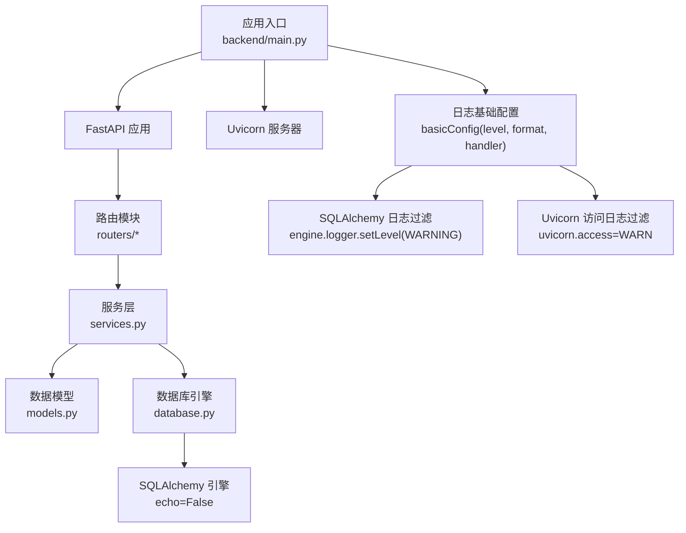
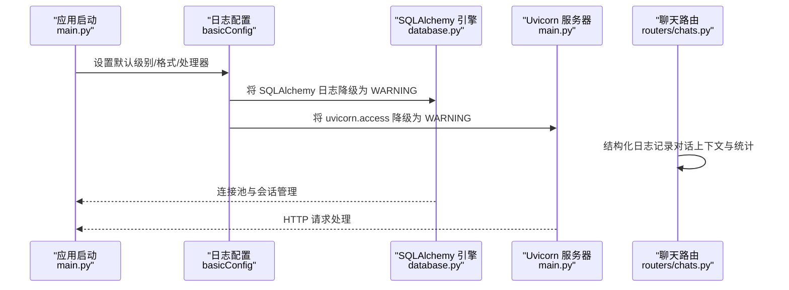
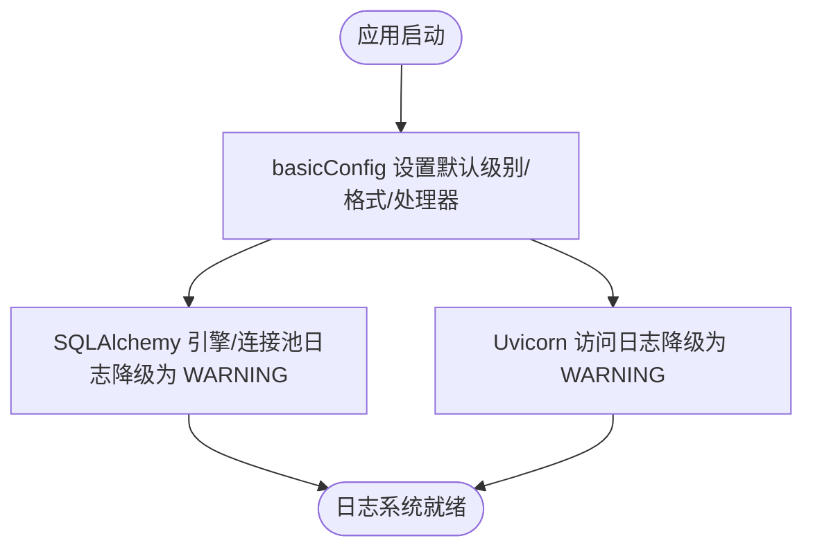
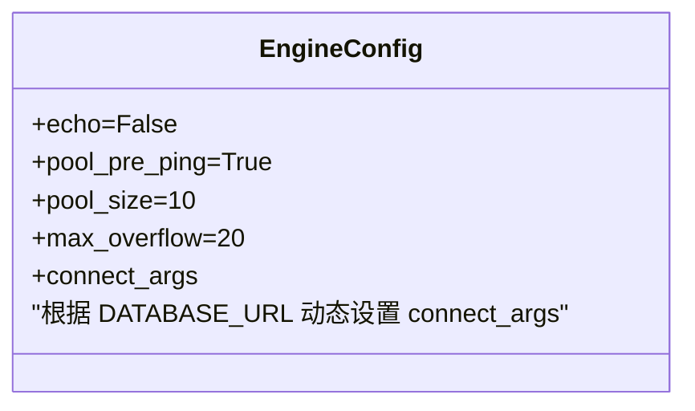
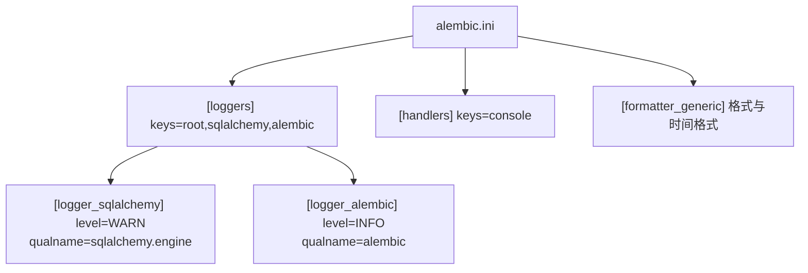
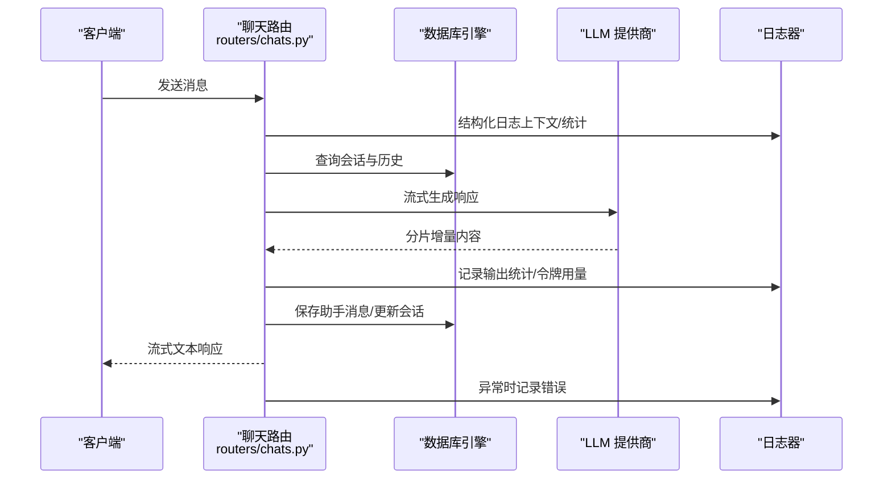
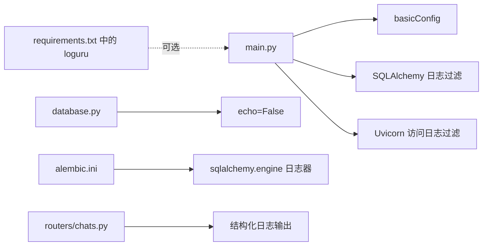

# 日志管理

<cite>
**本文引用的文件**
- [backend/main.py](file://backend/main.py)
- [backend/database.py](file://backend/database.py)
- [backend/alembic.ini](file://backend/alembic.ini)
- [backend/config.py](file://backend/config.py)
- [backend/routers/chats.py](file://backend/routers/chats.py)
- [backend/routers/agents.py](file://backend/routers/agents.py)
- [backend/routers/admin.py](file://backend/routers/admin.py)
- [backend/routers/llm_config.py](file://backend/routers/llm_config.py)
- [backend/models.py](file://backend/models.py)
- [backend/services.py](file://backend/services.py)
- [backend/requirements.txt](file://backend/requirements.txt)
- [backend/.env.example](file://backend/.env.example)
</cite>

## 目录
1. [简介](#简介)
2. [项目结构](#项目结构)
3. [核心组件](#核心组件)
4. [架构总览](#架构总览)
5. [详细组件分析](#详细组件分析)
6. [依赖关系分析](#依赖关系分析)
7. [性能考虑](#性能考虑)
8. [故障排查指南](#故障排查指南)
9. [结论](#结论)
10. [附录](#附录)

## 简介
本指南面向后端日志管理系统，围绕以下目标展开：统一日志配置策略（SQLAlchemy 日志过滤、Uvicorn 访问日志控制、应用日志级别）、模块化日志输出格式与分类管理、日志轮转与存储策略、性能优化、错误日志收集与调试信息输出、生产环境日志监控以及日志分析与异常追踪机制。文档基于仓库现有实现进行提炼与扩展建议，帮助读者快速落地可维护、可观测的日志体系。

## 项目结构
后端采用 FastAPI + SQLAlchemy 异步 ORM 架构，日志配置集中在应用入口与数据库引擎层；部分业务模块通过标准库 logging 输出关键流程与调试信息；Alembic 提供数据库迁移日志配置。整体结构如下：

图表来源
- [backend/main.py](file://backend/main.py#L14-L28)
- [backend/database.py](file://backend/database.py#L8-L17)
- [backend/alembic.ini](file://backend/alembic.ini#L96-L104)

章节来源
- [backend/main.py](file://backend/main.py#L1-L173)
- [backend/database.py](file://backend/database.py#L1-L31)
- [backend/alembic.ini](file://backend/alembic.ini#L1-L115)

## 核心组件
- 应用日志基础配置：集中于应用入口，设置默认日志级别、输出格式与处理器，确保控制台输出一致。
- SQLAlchemy 日志过滤：通过降低引擎与连接池日志级别，避免 SQL 语句刷屏影响调试。
- Uvicorn 访问日志控制：仅保留错误级别日志，减少正常请求日志对终端与磁盘的压力。
- 业务日志输出：聊天路由模块使用结构化日志记录对话上下文、令牌用量等关键指标；审计删除操作时使用打印输出。
- 数据库引擎配置：关闭 SQL echo，启用连接池预检测与合理池大小，兼顾性能与稳定性。

章节来源
- [backend/main.py](file://backend/main.py#L14-L28)
- [backend/database.py](file://backend/database.py#L8-L17)
- [backend/routers/chats.py](file://backend/routers/chats.py#L132-L234)
- [backend/routers/agents.py](file://backend/routers/agents.py#L135-L136)

## 架构总览
下图展示日志在系统中的流向与控制点，包括应用启动阶段的日志初始化、SQL 层过滤、Uvicorn 访问日志控制，以及业务模块的日志输出位置。

图表来源
- [backend/main.py](file://backend/main.py#L14-L28)
- [backend/database.py](file://backend/database.py#L8-L17)
- [backend/routers/chats.py](file://backend/routers/chats.py#L132-L234)

## 详细组件分析

### 应用入口日志配置（main.py）
- 基础日志配置：设置默认级别、输出格式与控制台处理器，保证统一输出风格。
- SQLAlchemy 日志过滤：针对引擎与连接池日志分别降级至 WARNING，避免 SQL 语句刷屏。
- Uvicorn 访问日志控制：将访问日志级别提升至 WARNING，仅记录异常或错误请求。
- 应用日志器：获取当前模块日志器用于业务日志输出。

图表来源
- [backend/main.py](file://backend/main.py#L14-L28)

章节来源
- [backend/main.py](file://backend/main.py#L14-L28)

### 数据库引擎日志控制（database.py）
- 关闭 SQL echo：避免每次执行 SQL 时输出到控制台，减少噪声。
- 连接池参数：启用 pre_ping、设置池大小与溢出连接数，提升稳定性与并发能力。
- SQLite 特殊参数：根据数据库类型动态传入连接参数，确保兼容性。

图表来源
- [backend/database.py](file://backend/database.py#L8-L17)

章节来源
- [backend/database.py](file://backend/database.py#L1-L31)

### Alembic 日志配置（alembic.ini）
- 日志器键值：root、sqlalchemy、alembic。
- SQLAlchemy 日志器：限定级别为 WARNING，限定 qualname 为 sqlalchemy.engine。
- Alembic 日志器：INFO 级别，限定 qualname 为 alembic。
- 控制台处理器：StreamHandler 写入 stderr，通用格式器。

图表来源
- [backend/alembic.ini](file://backend/alembic.ini#L81-L114)

章节来源
- [backend/alembic.ini](file://backend/alembic.ini#L1-L115)

### 聊天路由日志（routers/chats.py）
- 结构化日志：在生成响应前输出系统提示词、历史消息数量、输入字符数、上下文窗口、温度等信息。
- 流式响应统计：记录输出字符数、总字符数、API 令牌用量及上下文占比。
- 错误处理：捕获异常并记录错误日志，同时向客户端返回错误信息。
- 保存助手消息：异步保存助手回复与会话更新时间，异常时记录错误。

图表来源
- [backend/routers/chats.py](file://backend/routers/chats.py#L112-L258)

章节来源
- [backend/routers/chats.py](file://backend/routers/chats.py#L1-L275)

### 审计与打印输出（routers/agents.py）
- 删除审计：在删除代理时输出审计信息，便于追踪关键操作。
- 初始化与错误：在 AgentScope 初始化过程中输出状态与错误信息，辅助调试。

章节来源
- [backend/routers/agents.py](file://backend/routers/agents.py#L135-L136)

### 管理端与 LLM 配置日志（routers/llm_config.py）
- 连接测试：初始化 AgentScope 并构造模型实例进行连通性测试，异常时打印堆栈并返回错误信息。
- 默认回退：当提供商类型未知时，默认回退到 OpenAI 兼容模型，保证可用性。

章节来源
- [backend/routers/llm_config.py](file://backend/routers/llm_config.py#L20-L111)

### 服务层与模型（services.py, models.py）
- 服务层：封装游戏世界初始化、章节生成等业务流程，便于在需要时扩展日志。
- 模型层：定义数据库表结构，配合 SQLAlchemy 日志过滤与连接池参数，保障性能与可维护性。

章节来源
- [backend/services.py](file://backend/services.py#L1-L66)
- [backend/models.py](file://backend/models.py#L1-L122)

## 依赖关系分析
- 日志配置依赖：应用入口负责全局日志策略，数据库引擎与 Alembic 配置分别作用于 ORM 与迁移过程。
- 业务日志依赖：聊天路由模块直接使用标准库日志器输出结构化信息，其他模块可通过模块级日志器扩展。
- 外部依赖：Uvicorn 作为 ASGI 服务器，其访问日志受应用日志配置影响；Loguru 在依赖列表中存在但未在代码中使用，可按需引入以增强功能。

图表来源
- [backend/main.py](file://backend/main.py#L14-L28)
- [backend/database.py](file://backend/database.py#L8-L17)
- [backend/alembic.ini](file://backend/alembic.ini#L96-L104)
- [backend/routers/chats.py](file://backend/routers/chats.py#L132-L234)
- [backend/requirements.txt](file://backend/requirements.txt#L15-L15)

章节来源
- [backend/main.py](file://backend/main.py#L1-L173)
- [backend/database.py](file://backend/database.py#L1-L31)
- [backend/alembic.ini](file://backend/alembic.ini#L1-L115)
- [backend/routers/chats.py](file://backend/routers/chats.py#L1-L275)
- [backend/requirements.txt](file://backend/requirements.txt#L1-L20)

## 性能考虑
- 减少日志噪声：通过 SQLAlchemy 引擎关闭 echo，并将 SQLAlchemy 与 Uvicorn 访问日志降级，显著降低控制台与磁盘 IO。
- 合理连接池：启用 pre_ping 与合适的池大小/溢出连接数，避免连接失效导致的重试风暴。
- 结构化日志：聊天路由模块输出上下文与统计信息，便于后续分析与告警，且不会阻塞主流程。
- 异步写入：若引入文件落盘，建议使用异步/缓冲写入策略，避免阻塞请求线程。

## 故障排查指南
- 数据库连接失败：应用入口包含数据库连接与迁移重试逻辑，可在日志中观察重试次数与最终结果。
- LLM 连接异常：LLM 配置路由在测试连接时打印堆栈，便于定位提供商类型、模型名称与密钥配置问题。
- 聊天流式响应异常：聊天路由捕获异常并记录错误日志，同时向客户端返回错误信息，便于前端与后端协同定位。
- 审计与删除：删除代理时输出审计信息，若出现异常可结合该日志与数据库变更记录进行排查。

章节来源
- [backend/main.py](file://backend/main.py#L45-L81)
- [backend/routers/llm_config.py](file://backend/routers/llm_config.py#L107-L110)
- [backend/routers/chats.py](file://backend/routers/chats.py#L211-L215)
- [backend/routers/agents.py](file://backend/routers/agents.py#L135-L136)

## 结论
本项目已具备完善的日志基础配置：统一的默认日志策略、SQLAlchemy 与 Uvicorn 的日志过滤、业务模块的关键日志输出。建议在生产环境中进一步引入日志轮转与集中化采集（如 Filebeat/Fluent Bit + ELK/ Loki），并结合结构化日志与指标埋点，构建可观测性体系。对于需要更强大日志能力的场景，可评估引入 Loguru 或 structlog 以获得更丰富的特性集。

## 附录

### 日志配置策略清单
- 应用日志
  - 默认级别：INFO
  - 输出格式：包含模块名、级别与消息
  - 处理器：控制台输出
- SQLAlchemy 日志
  - 引擎与连接池：WARNING
  - 关闭 echo
- Uvicorn 访问日志
  - 访问日志：WARNING（仅错误）
- 业务日志
  - 聊天路由：结构化上下文与统计
  - 审计删除：打印审计信息
  - LLM 连接测试：异常时打印堆栈

章节来源
- [backend/main.py](file://backend/main.py#L14-L28)
- [backend/database.py](file://backend/database.py#L8-L17)
- [backend/routers/chats.py](file://backend/routers/chats.py#L132-L234)
- [backend/routers/agents.py](file://backend/routers/agents.py#L135-L136)
- [backend/routers/llm_config.py](file://backend/routers/llm_config.py#L107-L110)

### 环境变量与数据库配置
- 数据库 URL：支持 SQLite 与 PostgreSQL（示例来自 .env.example）
- Redis URL：用于缓存与会话（示例来自 .env.example）

章节来源
- [backend/.env.example](file://backend/.env.example#L1-L4)
- [backend/config.py](file://backend/config.py#L15-L16)