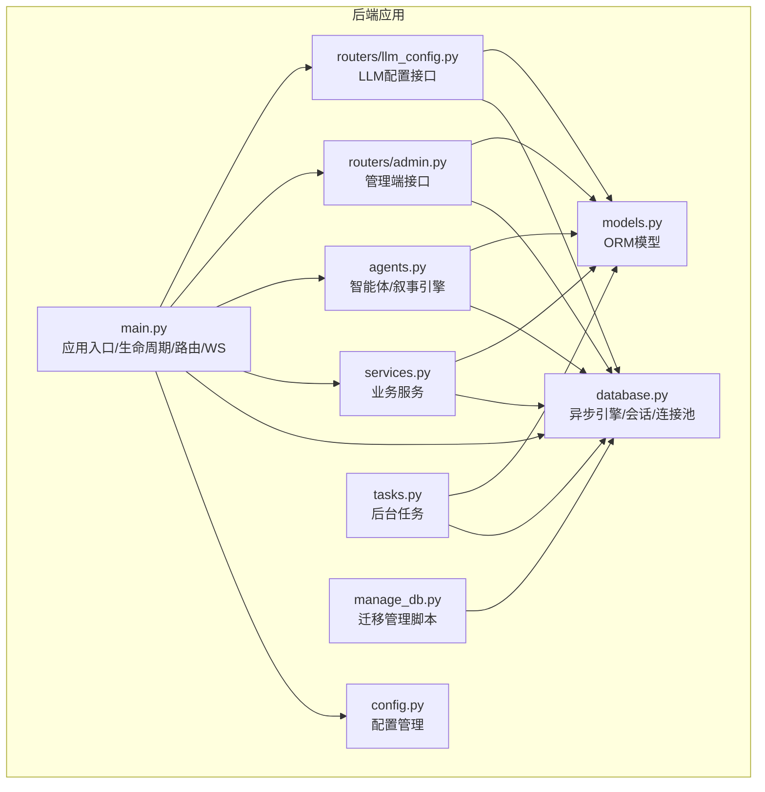
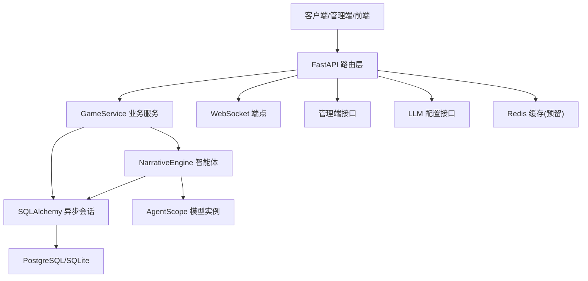
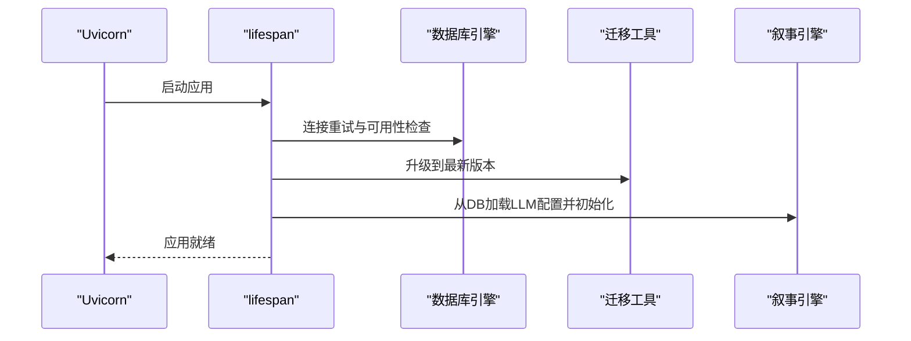
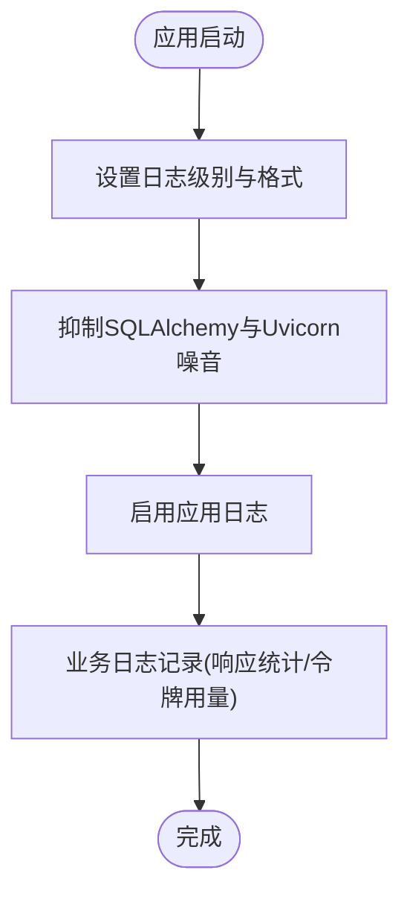
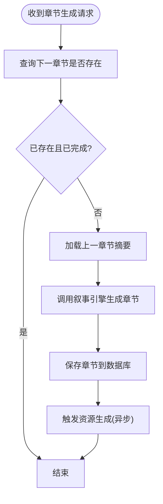
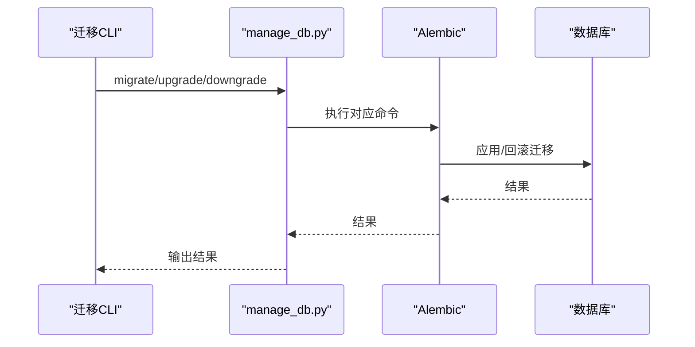
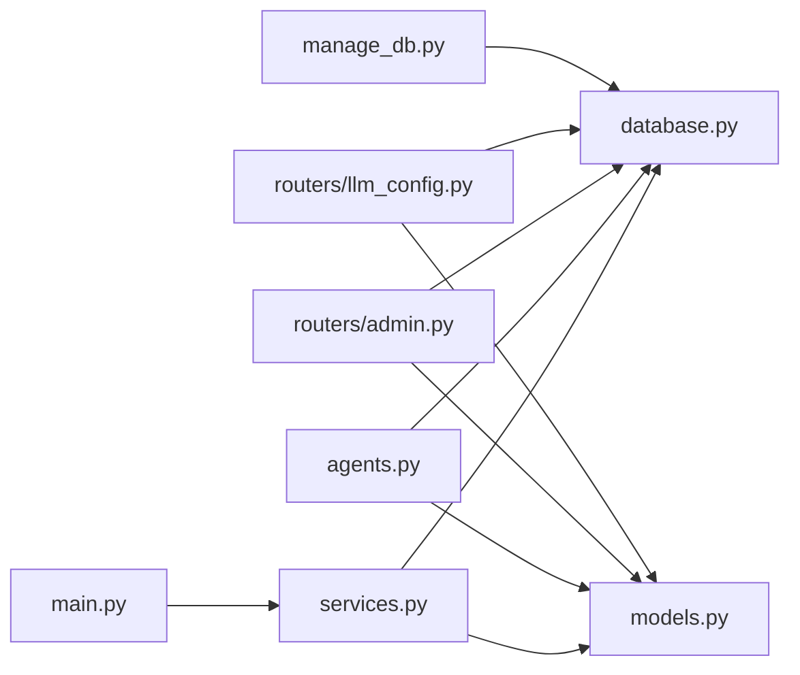

# 监控与维护

<cite>
**本文引用的文件**
- [backend/main.py](file://backend/main.py)
- [backend/config.py](file://backend/config.py)
- [backend/database.py](file://backend/database.py)
- [backend/models.py](file://backend/models.py)
- [backend/services.py](file://backend/services.py)
- [backend/tasks.py](file://backend/tasks.py)
- [backend/agents.py](file://backend/agents.py)
- [backend/routers/admin.py](file://backend/routers/admin.py)
- [backend/routers/llm_config.py](file://backend/routers/llm_config.py)
- [backend/manage_db.py](file://backend/manage_db.py)
- [backend/.env.example](file://backend/.env.example)
- [backend/requirements.txt](file://backend/requirements.txt)
- [docs/wiki/Deployment.md](file://docs/wiki/Deployment.md)
- [docs/wiki/Backend-Guide.md](file://docs/wiki/Backend-Guide.md)
</cite>

## 目录
1. [简介](#简介)
2. [项目结构](#项目结构)
3. [核心组件](#核心组件)
4. [架构总览](#架构总览)
5. [详细组件分析](#详细组件分析)
6. [依赖关系分析](#依赖关系分析)
7. [性能考量](#性能考量)
8. [故障排查指南](#故障排查指南)
9. [结论](#结论)
10. [附录](#附录)

## 简介
本指南聚焦于后端服务的监控与维护，覆盖健康检查、日志策略、错误监控、任务调度、定时清理与备份、性能指标与资源使用跟踪、异常告警、服务重启与优雅关闭、故障恢复、运维自动化脚本以及监控仪表板配置与最佳实践。目标是帮助运维与开发团队建立稳定、可观测、可维护的服务体系。

## 项目结构
后端采用 FastAPI + SQLAlchemy 异步 ORM 架构，结合 AgentScope 智能体编排与异步任务预生成策略。关键目录与职责如下：
- backend/main.py：FastAPI 应用入口，生命周期管理、路由注册、WebSocket、健康检查与启动流程。
- backend/config.py：统一配置管理，支持 .env 环境变量注入。
- backend/database.py：异步数据库引擎与会话工厂，连接池配置与自动重连。
- backend/models.py：数据模型定义，含玩家、章节、资产、LLM 提供商、聊天会话与消息等。
- backend/services.py：业务服务层，封装玩家创建、世界初始化、章节生成等核心流程。
- backend/tasks.py：异步后台任务，章节预生成与资源生成占位。
- backend/agents.py：智能体与叙事引擎，负责章节生成与 LLM 配置加载。
- backend/routers/admin.py：管理端统计与玩家/故事管理接口。
- backend/routers/llm_config.py：LLM 提供商配置与连接测试接口。
- backend/manage_db.py：数据库迁移管理脚本。
- backend/.env.example：示例环境变量。
- backend/requirements.txt：依赖清单。
- docs/wiki/Deployment.md 与 Backend-Guide.md：部署与后端指南。

图表来源
- [backend/main.py](file://backend/main.py#L1-L173)
- [backend/config.py](file://backend/config.py#L1-L34)
- [backend/database.py](file://backend/database.py#L1-L31)
- [backend/models.py](file://backend/models.py#L1-L122)
- [backend/services.py](file://backend/services.py#L1-L66)
- [backend/tasks.py](file://backend/tasks.py#L1-L62)
- [backend/agents.py](file://backend/agents.py#L1-L196)
- [backend/routers/admin.py](file://backend/routers/admin.py#L1-L112)
- [backend/routers/llm_config.py](file://backend/routers/llm_config.py#L1-L203)
- [backend/manage_db.py](file://backend/manage_db.py#L1-L67)

章节来源
- [backend/main.py](file://backend/main.py#L1-L173)
- [docs/wiki/Backend-Guide.md](file://docs/wiki/Backend-Guide.md#L1-L108)

## 核心组件
- 应用入口与生命周期：通过 lifespan 管理数据库连接与迁移、叙事引擎初始化；提供根路径、玩家创建、故事初始化与 WebSocket。
- 配置管理：集中读取 .env，支持数据库、Redis、AI 模型与生成设置。
- 数据库层：异步引擎、连接池、自动重连与会话工厂。
- 业务服务：封装玩家与世界初始化、章节生成与后续处理。
- 智能体与叙事引擎：基于 AgentScope 的多智能体协作，支持动态加载 LLM 配置。
- 后台任务：章节预生成与资源生成占位，便于扩展缓存与图像生成。
- 管理端接口：系统统计、玩家与故事管理、LLM 提供商配置与连接测试。
- 迁移管理：命令行脚本封装 Alembic，支持迁移创建、升级与回滚。

章节来源
- [backend/main.py](file://backend/main.py#L45-L82)
- [backend/config.py](file://backend/config.py#L7-L34)
- [backend/database.py](file://backend/database.py#L8-L23)
- [backend/services.py](file://backend/services.py#L8-L59)
- [backend/agents.py](file://backend/agents.py#L43-L191)
- [backend/tasks.py](file://backend/tasks.py#L7-L61)
- [backend/routers/admin.py](file://backend/routers/admin.py#L16-L31)
- [backend/routers/llm_config.py](file://backend/routers/llm_config.py#L20-L111)
- [backend/manage_db.py](file://backend/manage_db.py#L20-L38)

## 架构总览
下图展示从请求到数据持久化的整体流程，以及与外部组件（LLM 与 Redis）的交互点。

图表来源
- [backend/main.py](file://backend/main.py#L128-L170)
- [backend/services.py](file://backend/services.py#L19-L59)
- [backend/agents.py](file://backend/agents.py#L101-L129)
- [backend/config.py](file://backend/config.py#L18-L19)

## 详细组件分析

### 健康检查与启动流程
- 生命周期管理：在 lifespan 中进行数据库连接重试、执行 Alembic 升级，并尝试从数据库加载 LLM 配置以初始化叙事引擎。
- 根路径与简单探活：根路径返回欢迎信息，可用于基础健康检查。
- WebSocket：提供实时通信通道，便于前端观察服务状态与事件流。

图表来源
- [backend/main.py](file://backend/main.py#L45-L82)

章节来源
- [backend/main.py](file://backend/main.py#L45-L82)

### 日志记录策略
- 应用日志：统一使用标准库 logging，格式化输出，控制 SQLAlchemy 与 Uvicorn 访问日志级别，避免噪声。
- 业务日志：在聊天生成流程中记录响应统计、字符数与令牌用量，便于性能与成本分析。
- 建议增强：引入结构化日志（如 JSON）与采样策略，配合日志收集器集中存储与检索。

图表来源
- [backend/main.py](file://backend/main.py#L13-L28)
- [backend/routers/chats.py](file://backend/routers/chats.py#L211-L234)

章节来源
- [backend/main.py](file://backend/main.py#L13-L28)
- [backend/routers/chats.py](file://backend/routers/chats.py#L211-L234)

### 错误监控与告警
- 异常捕获：在关键路径（如创建玩家、WebSocket 错误）进行异常捕获与日志记录。
- 建议增强：集成错误监控平台（如 Sentry），对未处理异常进行上报；设置阈值告警（如错误率、延迟、超时）。

章节来源
- [backend/main.py](file://backend/main.py#L144-L145)
- [backend/main.py](file://backend/main.py#L166-L169)

### 任务调度与后台任务
- 章节预生成：根据当前章节生成下一章节内容并落库，同时触发资源生成占位。
- 调度建议：使用异步队列（如 Celery/RQ）与持久化存储，实现任务分发、重试与可视化监控。

图表来源
- [backend/tasks.py](file://backend/tasks.py#L7-L56)

章节来源
- [backend/tasks.py](file://backend/tasks.py#L7-L61)

### 数据库与迁移维护
- 连接池与自动重连：启用 pool_pre_ping，合理设置连接池大小与溢出数量。
- 迁移管理：提供命令行脚本封装 Alembic，支持创建、升级与回退迁移。
- 建议增强：在 CI/CD 中强制迁移检查；定期备份数据库并验证恢复流程。

图表来源
- [backend/manage_db.py](file://backend/manage_db.py#L20-L38)

章节来源
- [backend/database.py](file://backend/database.py#L8-L23)
- [backend/manage_db.py](file://backend/manage_db.py#L20-L38)

### 性能指标与资源使用
- 指标建议：请求延迟、吞吐量、数据库连接池利用率、内存与 CPU 使用、WebSocket 连接数、LLM 调用耗时与令牌用量。
- 采集方式：Prometheus + Grafana 或云监控方案；对关键路径埋点（服务层方法前后）。
- 建议：对长尾请求与慢查询进行专项优化与告警。

章节来源
- [backend/routers/chats.py](file://backend/routers/chats.py#L211-L234)

### 服务重启策略与优雅关闭
- 优雅关闭：利用 FastAPI lifespan 在应用终止前释放资源（如数据库连接、智能体会话）。
- 重启策略：容器编排中设置合理的重启次数与退避策略；在 CI/CD 中采用蓝绿/滚动发布降低停机风险。

章节来源
- [backend/main.py](file://backend/main.py#L45-L82)

### 故障恢复机制
- 数据库：启用连接池与自动重连；在启动阶段进行连接与迁移校验。
- LLM 配置：支持从数据库动态加载，提供连接测试接口，便于快速切换与回滚。
- 建议：对关键写入操作增加幂等性与补偿机制；对缓存失效与重建制定预案。

章节来源
- [backend/database.py](file://backend/database.py#L8-L23)
- [backend/agents.py](file://backend/agents.py#L49-L100)
- [backend/routers/llm_config.py](file://backend/routers/llm_config.py#L20-L111)

### 运维自动化与批量维护
- 迁移自动化：通过 manage_db.py 统一封装 Alembic，便于 CI/CD 与一键执行。
- 环境准备：参考部署文档，确保数据库、Redis 与 API Key 配置正确。
- 建议：编写批量维护脚本（如清理过期资产、重算统计指标、批量重试失败任务）。

章节来源
- [backend/manage_db.py](file://backend/manage_db.py#L40-L67)
- [docs/wiki/Deployment.md](file://docs/wiki/Deployment.md#L14-L40)

### 监控仪表板配置
- 指标面板建议：请求速率/错误率、P95/P99 延迟、数据库连接池使用、LLM 调用统计、WebSocket 连接与活跃度。
- 数据源：后端导出指标至 Prometheus 或使用云监控；前端 Grafana 展示。
- 告警规则：错误率阈值、延迟突增、数据库连接不足、LLM 调用失败率、磁盘与内存告警。

章节来源
- [backend/routers/admin.py](file://backend/routers/admin.py#L16-L31)
- [backend/routers/llm_config.py](file://backend/routers/llm_config.py#L20-L111)

## 依赖关系分析
- 组件耦合：业务服务依赖数据库与模型；智能体依赖配置与数据库；路由层依赖服务与模型；迁移脚本依赖数据库与 Alembic。
- 外部依赖：PostgreSQL/SQLite、Redis、AgentScope、LLM 提供商 API。
- 循环依赖：当前结构清晰，未发现循环导入。

图表来源
- [backend/main.py](file://backend/main.py#L30-L43)
- [backend/services.py](file://backend/services.py#L1-L10)
- [backend/database.py](file://backend/database.py#L1-L5)
- [backend/models.py](file://backend/models.py#L1-L10)
- [backend/agents.py](file://backend/agents.py#L1-L10)
- [backend/routers/admin.py](file://backend/routers/admin.py#L1-L14)
- [backend/routers/llm_config.py](file://backend/routers/llm_config.py#L1-L18)
- [backend/manage_db.py](file://backend/manage_db.py#L1-L10)

章节来源
- [backend/main.py](file://backend/main.py#L30-L43)
- [backend/requirements.txt](file://backend/requirements.txt#L1-L20)

## 性能考量
- 异步与连接池：使用异步数据库驱动与连接池，提升并发与稳定性。
- I/O 密集优化：LLM 调用与文件生成应异步化，避免阻塞主事件循环。
- 缓存策略：对热点数据与生成结果进行缓存，结合 LRU 清理策略。
- 监控与压测：定期进行容量规划与压力测试，识别瓶颈并优化。

章节来源
- [backend/database.py](file://backend/database.py#L8-L23)
- [backend/agents.py](file://backend/agents.py#L154-L191)

## 故障排查指南
- 数据库连接失败：检查 DATABASE_URL、用户权限与网络连通性；确认迁移已成功。
- LLM 配置无效：检查 LLM 提供商表中 is_active/is_default 字段；使用连接测试接口验证。
- WebSocket 断开：确认后端服务运行状态与端口占用情况；查看日志中的异常堆栈。
- 性能异常：关注数据库连接池饱和、慢查询与 LLM 调用耗时；结合指标面板定位。

章节来源
- [docs/wiki/Deployment.md](file://docs/wiki/Deployment.md#L60-L65)
- [backend/routers/llm_config.py](file://backend/routers/llm_config.py#L20-L111)
- [backend/main.py](file://backend/main.py#L166-L169)

## 结论
通过统一的配置管理、完善的生命周期与日志策略、可扩展的任务与迁移机制，以及面向生产的监控与告警体系，本后端服务具备良好的可观测性与可维护性。建议在此基础上进一步完善结构化日志、指标导出、自动化运维脚本与仪表板，形成闭环的运维体系。

## 附录
- 环境变量示例与数据库/Redis/LLM 配置参考。
- 部署步骤与常见问题排查。

章节来源
- [backend/.env.example](file://backend/.env.example#L1-L4)
- [docs/wiki/Deployment.md](file://docs/wiki/Deployment.md#L14-L40)