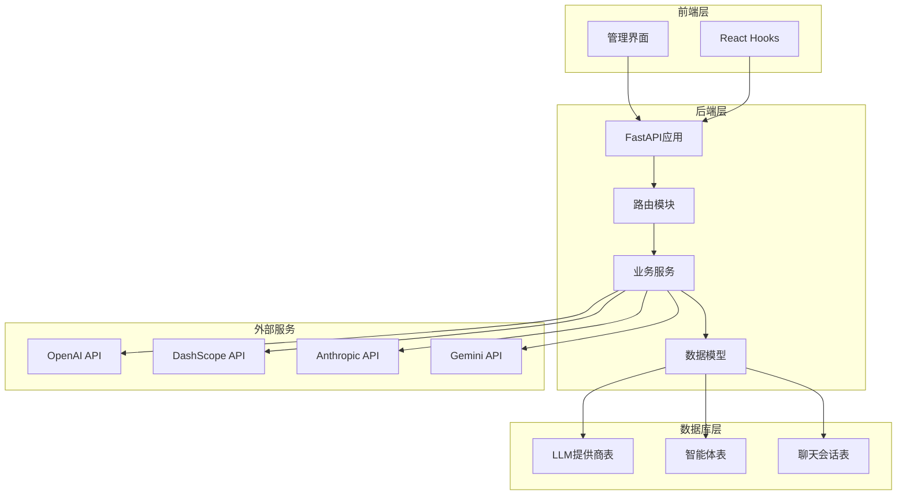
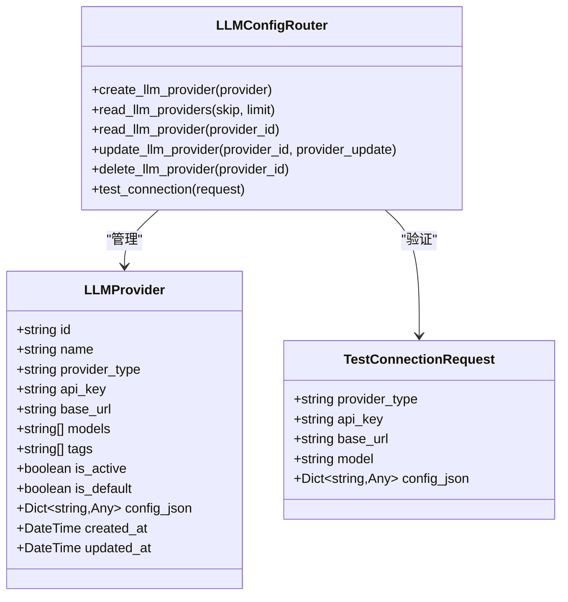
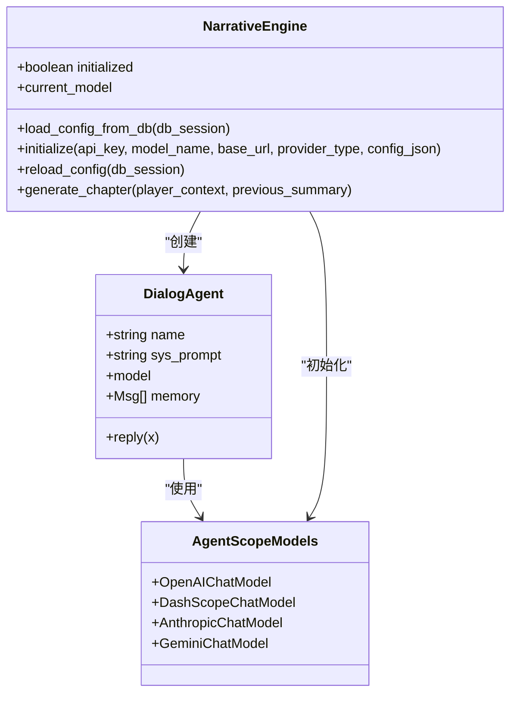
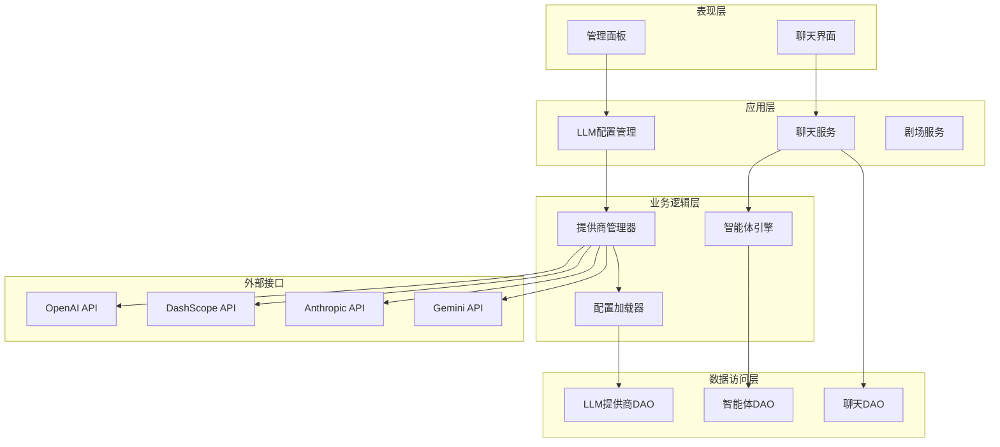
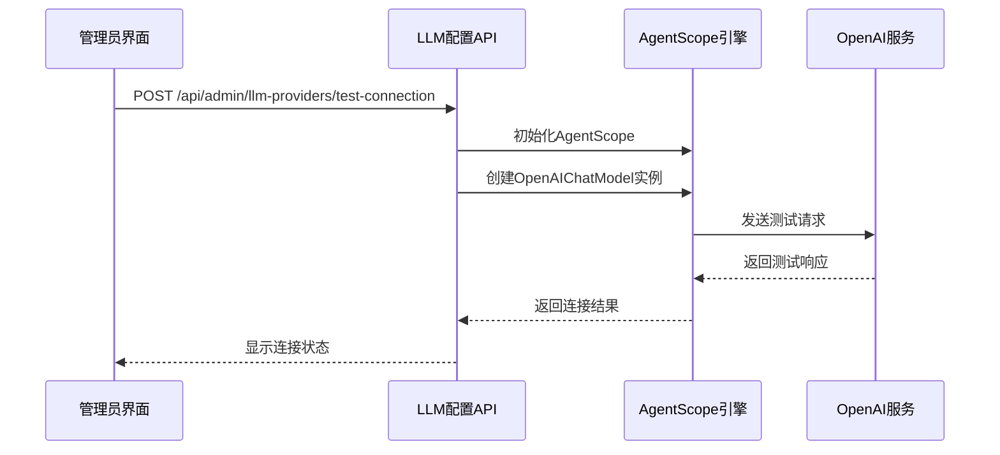
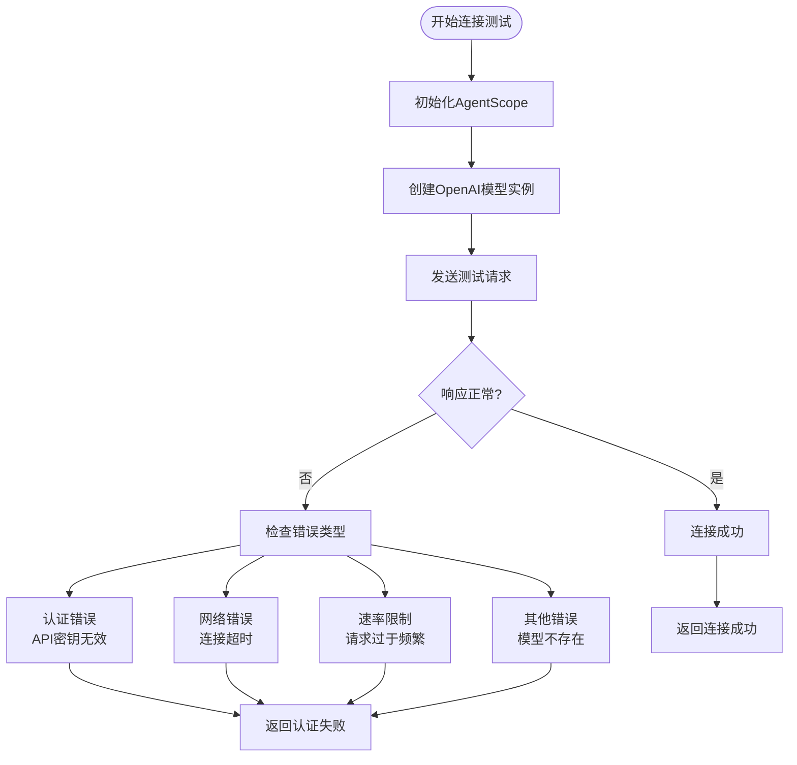
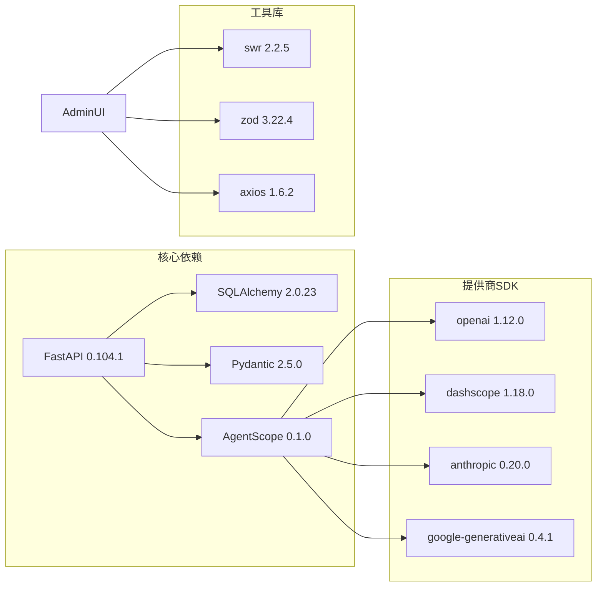
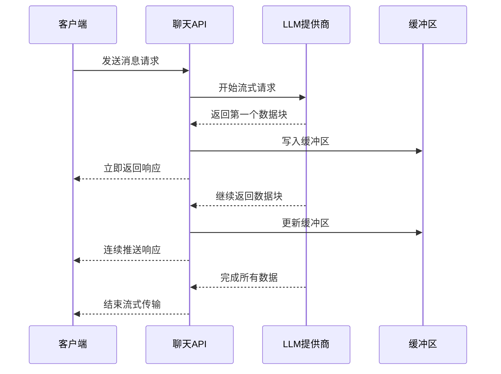

# LLM提供商配置

<cite>
**本文档引用的文件**
- [backend/routers/llm_config.py](file://backend/routers/llm_config.py)
- [backend/models.py](file://backend/models.py)
- [backend/schemas.py](file://backend/schemas.py)
- [backend/config.py](file://backend/config.py)
- [backend/agents.py](file://backend/agents.py)
- [backend/routers/chats.py](file://backend/routers/chats.py)
- [backend/main.py](file://backend/main.py)
- [backend/.env.example](file://backend/.env.example)
- [backend/admin/src/app/admin/llm/page.tsx](file://backend/admin/src/app/admin/llm/page.tsx)
- [backend/admin/src/hooks/useLLMProviders.ts](file://backend/admin/src/hooks/useLLMProviders.ts)
</cite>

## 目录
1. [简介](#简介)
2. [项目结构](#项目结构)
3. [核心组件](#核心组件)
4. [架构概览](#架构概览)
5. [详细组件分析](#详细组件分析)
6. [依赖关系分析](#依赖关系分析)
7. [性能考虑](#性能考虑)
8. [故障排除指南](#故障排除指南)
9. [结论](#结论)

## 简介

本项目是一个基于FastAPI的无限叙事剧场后端系统，支持多种LLM提供商的动态配置和管理。系统通过统一的LLM提供商配置接口，实现了对OpenAI、DashScope、Anthropic、Gemini等主流大语言模型服务的无缝集成。

该系统的核心特性包括：
- 多提供商统一配置管理
- 实时连接测试功能
- 动态模型切换能力
- 完整的错误处理机制
- 支持流式响应输出
- 前后端分离的管理界面

## 项目结构

项目采用前后端分离的架构设计，后端使用Python FastAPI框架，前端使用React技术栈。



**图表来源**
- [backend/main.py](file://backend/main.py#L83-L98)
- [backend/routers/llm_config.py](file://backend/routers/llm_config.py#L14-L18)
- [backend/models.py](file://backend/models.py#L58-L79)

**章节来源**
- [backend/main.py](file://backend/main.py#L1-L173)
- [backend/routers/llm_config.py](file://backend/routers/llm_config.py#L1-L203)

## 核心组件

### LLM提供商配置系统

系统通过统一的LLM提供商配置接口，支持多种大语言模型服务的动态管理：



**图表来源**
- [backend/models.py](file://backend/models.py#L58-L79)
- [backend/schemas.py](file://backend/schemas.py#L4-L41)
- [backend/routers/llm_config.py](file://backend/routers/llm_config.py#L112-L202)

### 智能体引擎系统

系统内置了完整的智能体引擎，支持故事叙述、角色管理和对话生成：



**图表来源**
- [backend/agents.py](file://backend/agents.py#L43-L196)
- [backend/agents.py](file://backend/agents.py#L11-L42)

**章节来源**
- [backend/models.py](file://backend/models.py#L58-L122)
- [backend/schemas.py](file://backend/schemas.py#L1-L102)
- [backend/agents.py](file://backend/agents.py#L1-L196)

## 架构概览

系统采用分层架构设计，实现了清晰的关注点分离：



**图表来源**
- [backend/routers/llm_config.py](file://backend/routers/llm_config.py#L1-L203)
- [backend/routers/chats.py](file://backend/routers/chats.py#L1-L275)
- [backend/agents.py](file://backend/agents.py#L43-L196)

## 详细组件分析

### OpenAI提供商配置

OpenAI是系统默认支持的主要提供商，具有完整的配置选项：

#### 配置参数说明

| 参数名称 | 类型 | 必需 | 描述 | 默认值 |
|---------|------|------|------|--------|
| provider_type | string | 是 | 提供商类型，固定为"openai" | - |
| api_key | string | 是 | OpenAI API密钥 | - |
| base_url | string | 否 | 自定义API基础URL | https://api.openai.com/v1 |
| model | string | 是 | 使用的模型名称 | gpt-4-turbo |
| temperature | number | 否 | 生成温度，0-2范围 | 0.7 |
| max_tokens | number | 否 | 最大生成令牌数 | 2048 |

#### 连接测试流程



**图表来源**
- [backend/routers/llm_config.py](file://backend/routers/llm_config.py#L20-L111)

#### 错误处理机制

系统实现了多层次的错误处理：



**图表来源**
- [backend/routers/llm_config.py](file://backend/routers/llm_config.py#L107-L111)

**章节来源**
- [backend/routers/llm_config.py](file://backend/routers/llm_config.py#L32-L44)
- [backend/routers/llm_config.py](file://backend/routers/llm_config.py#L20-L111)

### DashScope提供商配置

DashScope是阿里云的大模型服务平台，支持中文场景优化：

#### 配置特点

- **模型支持**：通义千问系列模型
- **认证方式**：API Key认证
- **特殊参数**：支持自定义超时时间、并发数等
- **流式输出**：支持增量输出模式

#### 配置示例

```json
{
  "provider_type": "dashscope",
  "api_key": "your_dashscope_api_key",
  "model": "qwen-plus",
  "config_json": {
    "timeout": 30,
    "max_retries": 3
  }
}
```

**章节来源**
- [backend/routers/llm_config.py](file://backend/routers/llm_config.py#L46-L52)
- [backend/agents.py](file://backend/agents.py#L109-L113)

### Anthropic提供商配置

Anthropic专注于AI安全和对齐，主要提供Claude系列模型：

#### 特殊配置项

- **模型选择**：claude-3-opus-20240229、claude-3-sonnet-20240229等
- **安全设置**：支持内容过滤和安全策略
- **上下文窗口**：支持更长的上下文长度

**章节来源**
- [backend/routers/llm_config.py](file://backend/routers/llm_config.py#L54-L65)

### Gemini提供商配置

Google的Gemini系列模型，支持多模态处理：

#### 多模态能力

- **文本生成**：标准对话和创作
- **图像理解**：支持图片描述和分析
- **代码生成**：多语言编程助手
- **安全防护**：Google级别的安全保证

**章节来源**
- [backend/routers/llm_config.py](file://backend/routers/llm_config.py#L67-L73)

### Azure OpenAI集成

系统支持Azure OpenAI服务，适用于企业级部署：

#### 部署特点

- **专用端点**：使用Azure提供的专用API端点
- **合规性**：满足企业级安全和合规要求
- **SLA保证**：提供99.9%的可用性保证
- **本地化**：数据存储在指定地理区域

**章节来源**
- [backend/routers/llm_config.py](file://backend/routers/llm_config.py#L32-L44)
- [backend/routers/chats.py](file://backend/routers/chats.py#L145-L159)

## 依赖关系分析

系统的关键依赖关系如下：



**图表来源**
- [backend/main.py](file://backend/main.py#L40-L43)

**章节来源**
- [backend/main.py](file://backend/main.py#L1-L173)

## 性能考虑

### 流式响应优化

系统实现了高效的流式响应处理机制：



**图表来源**
- [backend/routers/chats.py](file://backend/routers/chats.py#L161-L173)

### Token使用统计

系统提供了详细的Token使用情况监控：

| 统计指标 | 用途 | 计算方式 |
|---------|------|----------|
| 输入Token | 用户消息消耗 | 基于模型定价计算 |
| 输出Token | AI响应消耗 | 基于模型定价计算 |
| 上下文使用率 | 上下文窗口利用率 | (输入Token+输出Token)/上下文窗口×100% |
| 成本估算 | 月度费用预估 | (输入Token+输出Token)×单价 |

**章节来源**
- [backend/routers/chats.py](file://backend/routers/chats.py#L225-L232)

## 故障排除指南

### 常见问题及解决方案

#### 认证失败

**症状**：连接测试返回认证错误
**原因**：
- API密钥格式不正确
- API密钥权限不足
- 网络连接问题

**解决步骤**：
1. 验证API密钥格式
2. 检查提供商账户状态
3. 确认网络连接正常
4. 尝试重新生成API密钥

#### 速率限制

**症状**：请求被拒绝或响应缓慢
**原因**：
- 超过提供商的QPS限制
- 达到月度配额上限
- 短时间内大量并发请求

**缓解措施**：
1. 实现请求队列和限流
2. 使用备用提供商
3. 增加重试机制
4. 优化请求频率

#### 模型不可用

**症状**：选择的模型无法使用
**原因**：
- 模型已被停用
- 订阅状态异常
- 地区限制

**处理方案**：
1. 检查模型可用性状态
2. 更新订阅状态
3. 选择替代模型
4. 联系提供商客服

**章节来源**
- [backend/routers/llm_config.py](file://backend/routers/llm_config.py#L107-L111)
- [backend/routers/chats.py](file://backend/routers/chats.py#L211-L215)

## 结论

本LLM提供商配置系统提供了完整的大语言模型服务集成解决方案，具有以下优势：

### 技术优势
- **统一接口**：支持多家提供商的统一配置管理
- **实时测试**：提供连接状态实时验证功能
- **灵活扩展**：易于添加新的提供商支持
- **错误处理**：完善的异常捕获和恢复机制

### 运维价值
- **可视化管理**：前端界面提供直观的操作体验
- **配置持久化**：数据库存储确保配置可靠性
- **动态切换**：支持运行时提供商切换
- **成本控制**：提供详细的使用统计和成本估算

### 发展建议
1. **增加负载均衡**：实现多提供商的智能路由
2. **增强监控告警**：完善使用情况和异常监控
3. **优化缓存策略**：提升重复请求的响应速度
4. **扩展模型管理**：支持更多类型的AI模型

该系统为构建复杂的AI驱动应用提供了坚实的基础架构，能够满足从个人项目到企业级应用的各种需求。