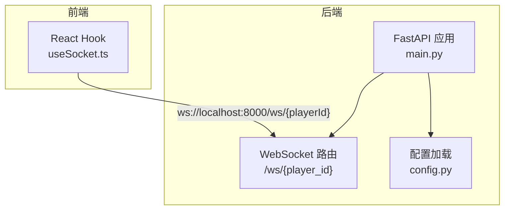
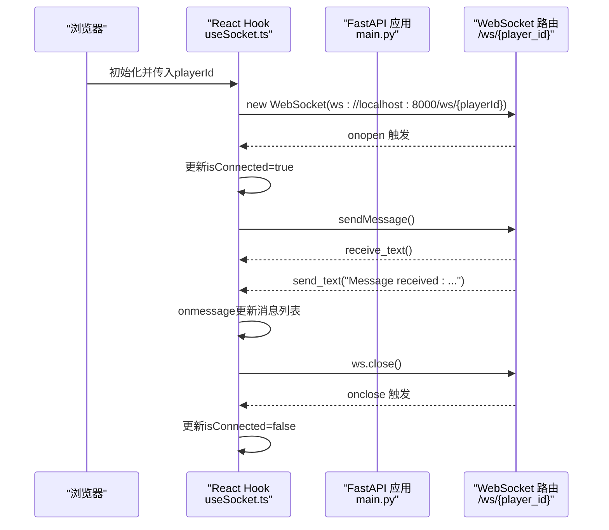
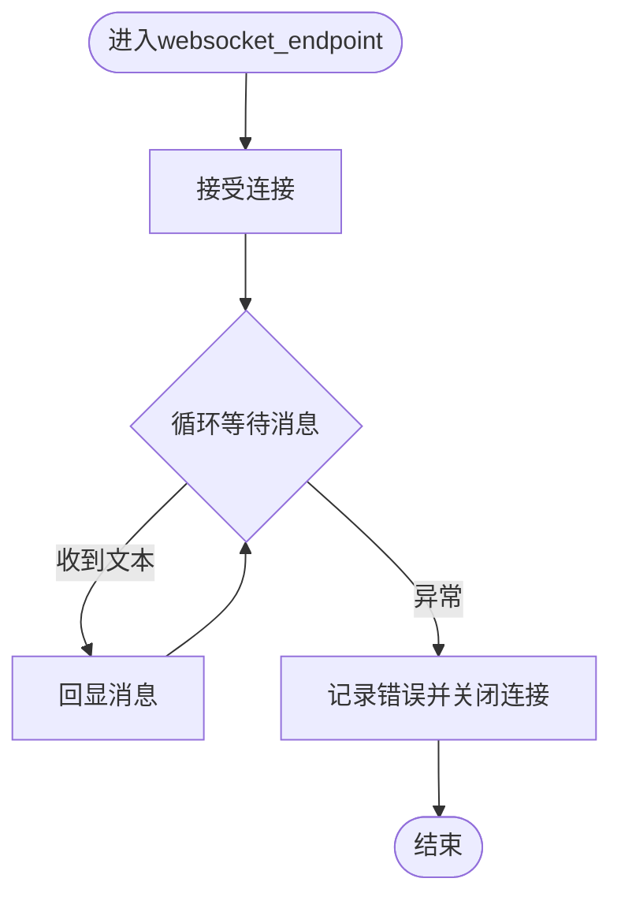
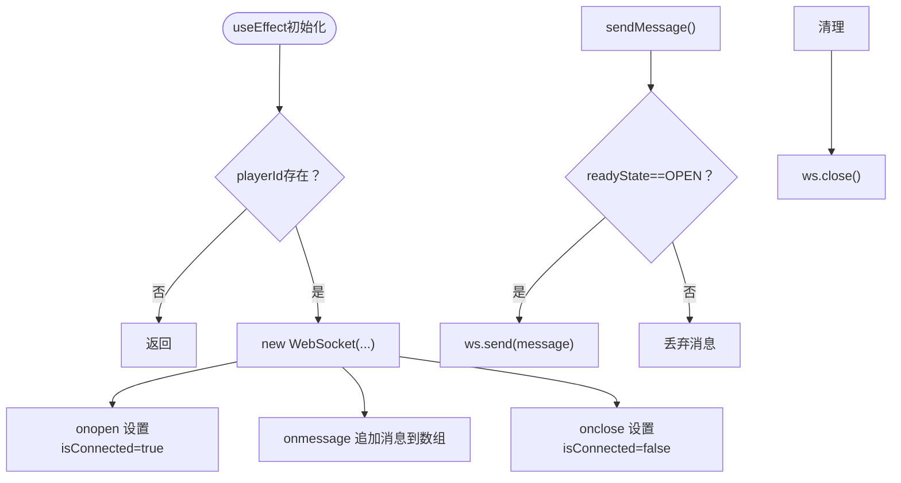
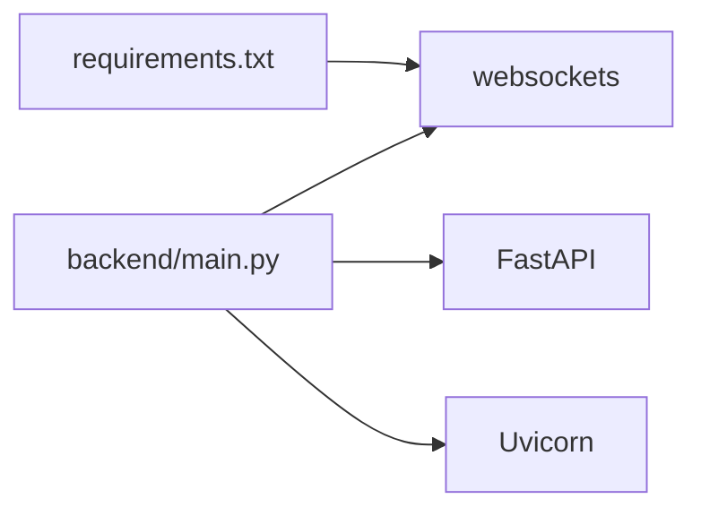

# WebSocket配置

<cite>
**本文档引用的文件**
- [backend/main.py](file://backend/main.py)
- [frontend/src/hooks/useSocket.ts](file://frontend/src/hooks/useSocket.ts)
- [backend/config.py](file://backend/config.py)
- [backend/requirements.txt](file://backend/requirements.txt)
- [backend/services.py](file://backend/services.py)
</cite>

## 目录
1. [简介](#简介)
2. [项目结构](#项目结构)
3. [核心组件](#核心组件)
4. [架构总览](#架构总览)
5. [详细组件分析](#详细组件分析)
6. [依赖关系分析](#依赖关系分析)
7. [性能考虑](#性能考虑)
8. [故障排查指南](#故障排查指南)
9. [结论](#结论)

## 简介
本文件聚焦于WebSocket连接配置，涵盖服务器端FastAPI路由、客户端React Hook、连接参数、消息序列化、事件类型、错误处理与重连策略、并发连接与消息队列、连接状态管理、性能调优与监控建议等。当前仓库中的WebSocket实现较为基础：服务端提供一个简单的文本回显接口，客户端负责建立连接、接收消息与发送消息；未发现内置的心跳检测、消息队列持久化或连接池配置。本文在不改变现有实现的前提下，给出可扩展的配置建议与最佳实践。

## 项目结构
- 后端使用FastAPI提供WebSocket端点，基于Uvicorn运行。
- 前端使用React Hook封装WebSocket连接，支持动态playerId拼接路径。
- 配置通过Pydantic Settings加载环境变量，数据库默认SQLite，Redis用于缓存。

图表来源
- [backend/main.py](file://backend/main.py#L156-L169)
- [frontend/src/hooks/useSocket.ts](file://frontend/src/hooks/useSocket.ts#L11-L33)
- [backend/config.py](file://backend/config.py#L1-L34)

章节来源
- [backend/main.py](file://backend/main.py#L1-L173)
- [frontend/src/hooks/useSocket.ts](file://frontend/src/hooks/useSocket.ts#L1-L43)
- [backend/config.py](file://backend/config.py#L1-L34)

## 核心组件
- 服务端WebSocket端点：接受连接后循环读取消息并回显，异常时记录错误并关闭连接。
- 客户端Hook：根据playerId建立WebSocket连接，维护消息数组与连接状态，提供发送函数。
- 配置模块：集中管理数据库URL、Redis URL、AI模型等配置项。
- 依赖声明：包含websockets库以支持标准WebSocket协议。

章节来源
- [backend/main.py](file://backend/main.py#L156-L169)
- [frontend/src/hooks/useSocket.ts](file://frontend/src/hooks/useSocket.ts#L3-L42)
- [backend/config.py](file://backend/config.py#L1-L34)
- [backend/requirements.txt](file://backend/requirements.txt#L1-L20)

## 架构总览
下图展示从浏览器到后端的典型交互流程，包括连接建立、消息收发与异常处理。

图表来源
- [frontend/src/hooks/useSocket.ts](file://frontend/src/hooks/useSocket.ts#L8-L33)
- [backend/main.py](file://backend/main.py#L156-L169)

## 详细组件分析

### 服务端WebSocket端点
- 路由定义：/ws/{player_id}，接受WebSocket连接。
- 连接处理：循环读取文本消息并回显，异常捕获后关闭连接。
- 当前能力：仅支持文本帧，无心跳、无消息序列化规范、无并发连接限制。

图表来源
- [backend/main.py](file://backend/main.py#L156-L169)

章节来源
- [backend/main.py](file://backend/main.py#L156-L169)

### 客户端Hook
- 连接建立：根据playerId动态拼接路径，连接本地8000端口。
- 状态管理：维护messages数组与isConnected布尔值。
- 发送逻辑：检查readyState为OPEN时才发送消息。
- 生命周期：组件卸载时主动关闭WebSocket。

图表来源
- [frontend/src/hooks/useSocket.ts](file://frontend/src/hooks/useSocket.ts#L8-L33)
- [frontend/src/hooks/useSocket.ts](file://frontend/src/hooks/useSocket.ts#L35-L39)

章节来源
- [frontend/src/hooks/useSocket.ts](file://frontend/src/hooks/useSocket.ts#L1-L43)

### 消息序列化与事件类型
- 当前实现：服务端与客户端均使用文本帧进行消息传输，未定义统一的消息格式或事件类型枚举。
- 建议：引入JSON格式，定义事件类型字段（如“chat”、“heartbeat”、“error”），并在客户端按类型分发处理。

章节来源
- [backend/main.py](file://backend/main.py#L161-L165)
- [frontend/src/hooks/useSocket.ts](file://frontend/src/hooks/useSocket.ts#L18-L20)

### 错误重连策略
- 当前行为：未实现自动重连；断开后需手动刷新页面重新连接。
- 建议：在onclose中判断是否为意外断开，采用指数退避重连策略，并限制最大重连次数与时间。

章节来源
- [frontend/src/hooks/useSocket.ts](file://frontend/src/hooks/useSocket.ts#L23-L26)

### 并发连接数限制与消息队列
- 并发连接：当前路由未对同一player_id做连接数限制，也未区分不同玩家的会话隔离。
- 消息队列：未实现消息持久化或队列缓冲，所有消息即时处理。
- 建议：引入Redis作为消息队列与会话存储，限制每个player_id的并发连接数，并在异常时将消息入队。

章节来源
- [backend/main.py](file://backend/main.py#L156-L169)
- [backend/config.py](file://backend/config.py#L18-L19)

### 连接状态管理
- 客户端：通过isConnected与messages数组管理连接状态与消息历史。
- 服务端：未维护连接表或状态机，无法感知断线或统计在线人数。
- 建议：服务端维护连接映射与心跳计时器，客户端定期发送心跳包，超时则触发重连。

章节来源
- [frontend/src/hooks/useSocket.ts](file://frontend/src/hooks/useSocket.ts#L5-L6)
- [backend/main.py](file://backend/main.py#L156-L169)

## 依赖关系分析
- websockets库：标准Python WebSocket支持，当前版本在requirements中声明。
- FastAPI：提供WebSocket装饰器与路由注册。
- Uvicorn：ASGI服务器，负责实际监听与转发请求。

图表来源
- [backend/requirements.txt](file://backend/requirements.txt#L9-L1)
- [backend/main.py](file://backend/main.py#L30-L41)

章节来源
- [backend/requirements.txt](file://backend/requirements.txt#L1-L20)
- [backend/main.py](file://backend/main.py#L1-L41)

## 性能考虑
- 连接并发：当前未限制每用户连接数，建议引入限流与连接池管理。
- 心跳与保活：建议启用ping/pong机制，避免中间设备误判空闲连接。
- 消息序列化：建议统一使用JSON，减少解析成本并便于扩展事件类型。
- 流量控制：对高频消息进行节流或批量发送，降低服务器压力。
- 监控指标：记录连接数、消息吞吐、平均延迟、错误率等关键指标。

## 故障排查指南
- 无法连接
  - 检查后端是否在8000端口监听，确认CORS允许前端源。
  - 确认playerId有效且路径正确。
- 连接后无消息
  - 查看浏览器控制台是否有网络错误。
  - 确认服务端日志中无异常并已accept连接。
- 断线频繁
  - 检查是否存在NAT/代理超时，考虑启用心跳。
  - 在客户端实现指数退避重连。
- 性能问题
  - 使用压测工具模拟多用户并发，观察CPU与内存占用。
  - 对消息处理逻辑进行异步化与批量化。

章节来源
- [backend/main.py](file://backend/main.py#L166-L169)
- [frontend/src/hooks/useSocket.ts](file://frontend/src/hooks/useSocket.ts#L13-L26)

## 结论
当前WebSocket实现简洁清晰，适合演示用途。若要投入生产，建议补充心跳检测、消息序列化规范、错误重连策略、并发连接限制与消息队列、连接状态管理以及完善的监控与告警体系。以上建议可在不破坏现有功能的基础上逐步迭代接入。