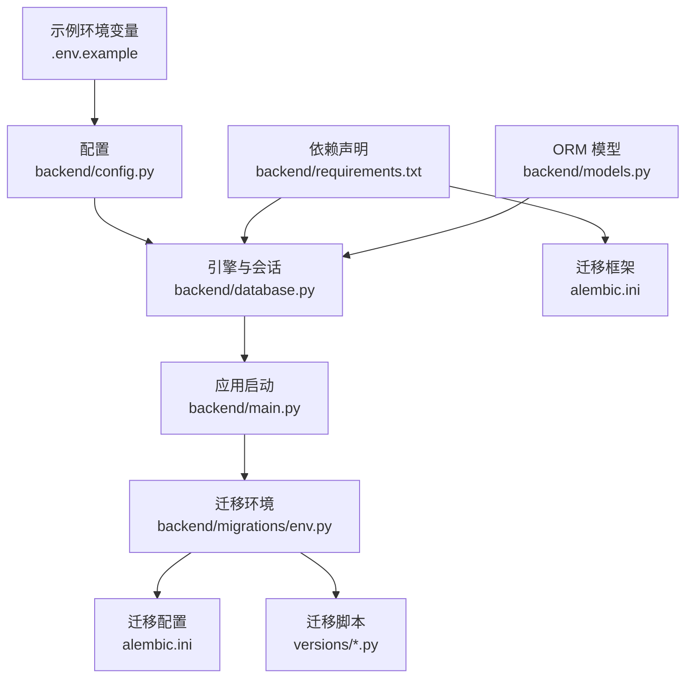
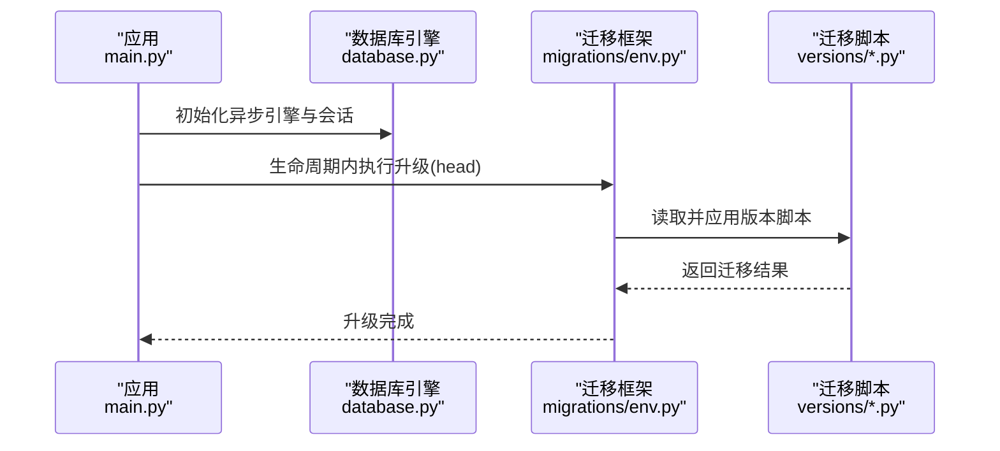
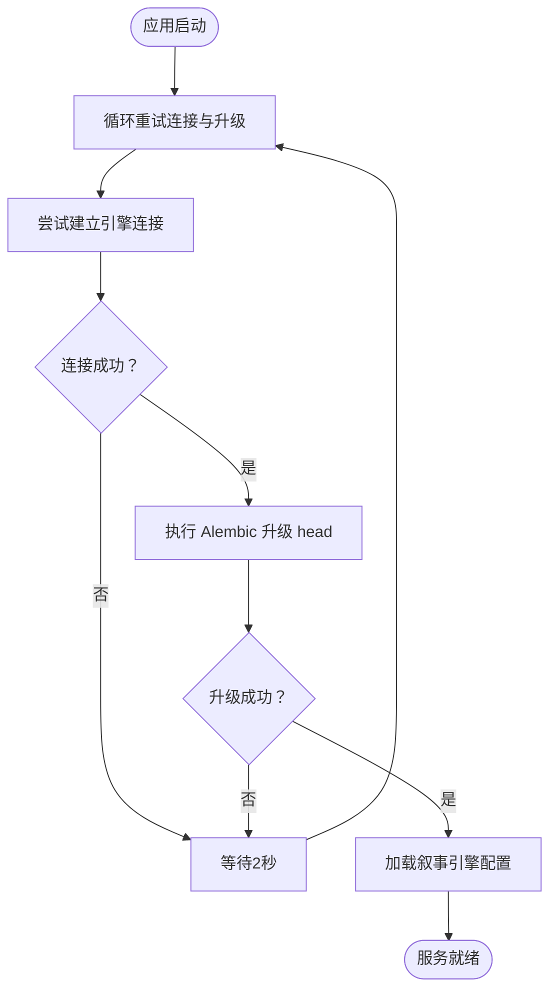
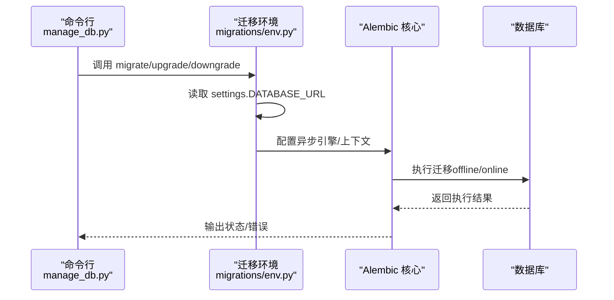
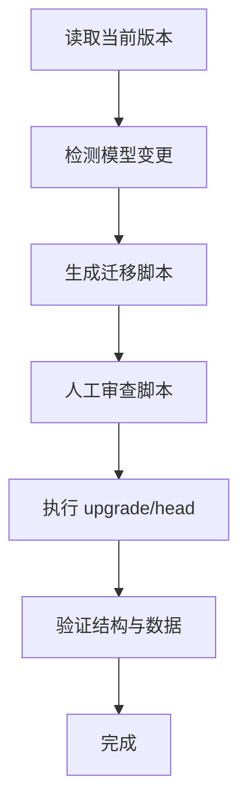
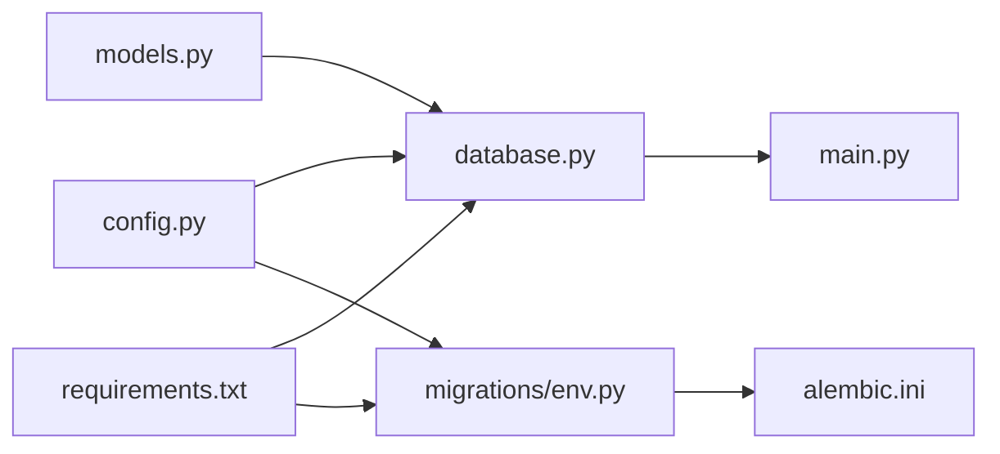

# 数据库配置

<cite>
**本文档引用的文件**
- [backend/config.py](file://backend/config.py)
- [backend/database.py](file://backend/database.py)
- [backend/main.py](file://backend/main.py)
- [backend/.env.example](file://backend/.env.example)
- [backend/requirements.txt](file://backend/requirements.txt)
- [backend/migrations/env.py](file://backend/migrations/env.py)
- [backend/alembic.ini](file://backend/alembic.ini)
- [backend/manage_db.py](file://backend/manage_db.py)
- [backend/migrations/versions/14746eaf1c81_initial.py](file://backend/migrations/versions/14746eaf1c81_initial.py)
- [backend/migrations/versions/82e927e1cf80_add_agent_model.py](file://backend/migrations/versions/82e927e1cf80_add_agent_model.py)
- [backend/migrations/versions/f1580ee10d5e_add_chat_models.py](file://backend/migrations/versions/f1580ee10d5e_add_chat_models.py)
- [backend/migrations/versions/a3b8c9d0e1f2_convert_ids_to_uuid.py](file://backend/migrations/versions/a3b8c9d0e1f2_convert_ids_to_uuid.py)
- [backend/models.py](file://backend/models.py)
- [docs/wiki/Database-Migration.md](file://docs/wiki/Database-Migration.md)
</cite>

## 目录
1. [简介](#简介)
2. [项目结构](#项目结构)
3. [核心组件](#核心组件)
4. [架构总览](#架构总览)
5. [详细组件分析](#详细组件分析)
6. [依赖关系分析](#依赖关系分析)
7. [性能考虑](#性能考虑)
8. [故障排查指南](#故障排查指南)
9. [结论](#结论)
10. [附录](#附录)

## 简介
本文件系统性阐述本项目的数据库配置与管理，覆盖以下主题：
- PostgreSQL 连接字符串格式与驱动选择
- 连接池配置参数与行为
- 数据库初始化与 Alembic 迁移配置
- 数据库版本管理与迁移脚本执行流程
- 开发与生产环境配置差异
- 连接超时与错误重试机制
- 性能优化与监控指标建议

## 项目结构
与数据库相关的关键文件分布如下：
- 配置层：config.py（读取 .env 并提供 Settings）、.env.example（示例环境变量）
- 连接层：database.py（异步引擎与会话工厂）
- 启动与迁移：main.py（应用生命周期内执行 Alembic 升级）、manage_db.py（封装迁移命令）
- 迁移框架：alembic.ini（Alembic 主配置）、migrations/env.py（迁移上下文）
- 迁移脚本：migrations/versions/*（版本化迁移脚本）
- ORM 模型：models.py（定义数据库表结构）

图表来源
- [backend/config.py](file://backend/config.py#L1-L34)
- [backend/database.py](file://backend/database.py#L1-L31)
- [backend/main.py](file://backend/main.py#L45-L81)
- [backend/migrations/env.py](file://backend/migrations/env.py#L1-L105)
- [backend/alembic.ini](file://backend/alembic.ini#L1-L115)
- [backend/.env.example](file://backend/.env.example#L1-L4)
- [backend/requirements.txt](file://backend/requirements.txt#L1-L20)
- [backend/models.py](file://backend/models.py#L1-L122)

章节来源
- [backend/config.py](file://backend/config.py#L1-L34)
- [backend/database.py](file://backend/database.py#L1-L31)
- [backend/main.py](file://backend/main.py#L45-L81)
- [backend/migrations/env.py](file://backend/migrations/env.py#L1-L105)
- [backend/alembic.ini](file://backend/alembic.ini#L1-L115)
- [backend/.env.example](file://backend/.env.example#L1-L4)
- [backend/requirements.txt](file://backend/requirements.txt#L1-L20)
- [backend/models.py](file://backend/models.py#L1-L122)

## 核心组件
- 配置与环境变量
  - 默认使用 SQLite（本地开发友好），可通过 DATABASE_URL 切换至 PostgreSQL
  - 使用 Pydantic Settings 从 .env 加载配置
- 异步引擎与会话
  - 使用 SQLAlchemy 2.x 异步引擎与 async_sessionmaker
  - 连接池参数：pool_pre_ping、pool_size、max_overflow
  - SQLite 特殊处理：禁用多线程校验
- 迁移与版本管理
  - Alembic 配置位于 alembic.ini，迁移入口在 migrations/env.py
  - 提供 manage_db.py 封装常用迁移命令
- 应用生命周期集成
  - 在 FastAPI lifespan 中执行 Alembic 升级，并带重试逻辑

章节来源
- [backend/config.py](file://backend/config.py#L1-L34)
- [backend/database.py](file://backend/database.py#L1-L31)
- [backend/alembic.ini](file://backend/alembic.ini#L1-L115)
- [backend/migrations/env.py](file://backend/migrations/env.py#L1-L105)
- [backend/manage_db.py](file://backend/manage_db.py#L1-L67)
- [backend/main.py](file://backend/main.py#L45-L81)

## 架构总览
数据库相关架构围绕“配置 → 引擎 → 会话 → 应用/迁移”展开，关键交互如下：

图表来源
- [backend/main.py](file://backend/main.py#L45-L81)
- [backend/database.py](file://backend/database.py#L1-L31)
- [backend/migrations/env.py](file://backend/migrations/env.py#L74-L98)
- [backend/migrations/versions/14746eaf1c81_initial.py](file://backend/migrations/versions/14746eaf1c81_initial.py#L21-L30)

## 详细组件分析

### 配置与连接字符串
- 默认数据库 URL
  - 本地默认使用 SQLite（绝对路径），便于离线开发
  - 可通过 DATABASE_URL 切换为 PostgreSQL（示例见 .env.example）
- 驱动选择
  - SQLite：sqlite+aiosqlite
  - PostgreSQL：推荐 asyncpg（requirements.txt 已声明）
- 环境变量加载
  - Settings 通过 pydantic-settings 从 .env 加载
  - 示例 .env 展示了 DATABASE_URL 的 PostgreSQL 格式

章节来源
- [backend/config.py](file://backend/config.py#L11-L16)
- [backend/.env.example](file://backend/.env.example#L1-L4)
- [backend/requirements.txt](file://backend/requirements.txt#L6-L18)

### 连接池配置与行为
- 连接池参数
  - pool_pre_ping：启用连接健康检查，自动重连
  - pool_size：连接池大小
  - max_overflow：最大溢出连接数
  - SQLite 特殊：当 DATABASE_URL 以 sqlite 开头时，附加线程校验参数
- 会话工厂
  - AsyncSessionLocal 绑定 engine，expire_on_commit=False 以提升性能

章节来源
- [backend/database.py](file://backend/database.py#L8-L23)

### 数据库初始化与应用生命周期
- 初始化策略
  - 应用启动时，lifespan 内部循环重试数据库连接与 Alembic 升级
  - 成功后加载叙事引擎配置
- 重试机制
  - 最多重试次数、失败间隔、异常捕获与日志输出

图表来源
- [backend/main.py](file://backend/main.py#L47-L81)

章节来源
- [backend/main.py](file://backend/main.py#L45-L81)

### Alembic 迁移配置与执行流程
- Alembic 主配置
  - script_location、prepend_sys_path、version_path_separator 等
  - 日志级别与处理器配置
- 迁移环境
  - env.py 从 settings.DATABASE_URL 获取目标数据库 URL
  - 支持 offline/online 两种模式；在线模式使用异步引擎
  - render_as_batch=True 以兼容 SQLite 的 ALTER 限制
- 迁移脚本
  - versions 目录下按时间戳与修订号命名的脚本
  - 包含初始表结构、新增模型与 ID 类型转换等

图表来源
- [backend/manage_db.py](file://backend/manage_db.py#L20-L38)
- [backend/migrations/env.py](file://backend/migrations/env.py#L39-L98)
- [backend/alembic.ini](file://backend/alembic.ini#L1-L115)

章节来源
- [backend/alembic.ini](file://backend/alembic.ini#L1-L115)
- [backend/migrations/env.py](file://backend/migrations/env.py#L1-L105)
- [backend/manage_db.py](file://backend/manage_db.py#L1-L67)
- [docs/wiki/Database-Migration.md](file://docs/wiki/Database-Migration.md#L1-L85)

### 迁移脚本执行流程（代码级）
- 版本脚本结构
  - upgrade()/downgrade() 定义正向与逆向变更
  - 使用 op.batch_alter_table 与索引/约束管理
- 复杂迁移示例
  - UUID 转换脚本展示了整库重建与数据迁移的完整流程

图表来源
- [backend/migrations/versions/14746eaf1c81_initial.py](file://backend/migrations/versions/14746eaf1c81_initial.py#L21-L30)
- [backend/migrations/versions/82e927e1cf80_add_agent_model.py](file://backend/migrations/versions/82e927e1cf80_add_agent_model.py#L21-L43)
- [backend/migrations/versions/f1580ee10d5e_add_chat_models.py](file://backend/migrations/versions/f1580ee10d5e_add_chat_models.py#L21-L48)
- [backend/migrations/versions/a3b8c9d0e1f2_convert_ids_to_uuid.py](file://backend/migrations/versions/a3b8c9d0e1f2_convert_ids_to_uuid.py#L22-L221)

章节来源
- [backend/migrations/versions/14746eaf1c81_initial.py](file://backend/migrations/versions/14746eaf1c81_initial.py#L1-L43)
- [backend/migrations/versions/82e927e1cf80_add_agent_model.py](file://backend/migrations/versions/82e927e1cf80_add_agent_model.py#L1-L54)
- [backend/migrations/versions/f1580ee10d5e_add_chat_models.py](file://backend/migrations/versions/f1580ee10d5e_add_chat_models.py#L1-L63)
- [backend/migrations/versions/a3b8c9d0e1f2_convert_ids_to_uuid.py](file://backend/migrations/versions/a3b8c9d0e1f2_convert_ids_to_uuid.py#L1-L327)

### 开发环境与生产环境差异
- 开发环境
  - 默认 SQLite（本地无需外部数据库）
  - Alembic 升级在应用启动时自动执行
- 生产环境
  - 使用 PostgreSQL（通过 DATABASE_URL 指定）
  - 推荐使用 asyncpg 驱动
  - 建议在部署前显式执行升级，或在启动时启用重试与健康检查

章节来源
- [backend/config.py](file://backend/config.py#L11-L16)
- [backend/.env.example](file://backend/.env.example#L2-L2)
- [backend/requirements.txt](file://backend/requirements.txt#L6-L18)
- [backend/main.py](file://backend/main.py#L47-L81)

### 连接超时与错误重试机制
- 连接池层面
  - pool_pre_ping 启用连接健康检查
  - pool_size 与 max_overflow 控制并发与溢出连接
- 应用层面
  - 启动时循环重试连接与迁移，失败后短暂等待再试
- 建议
  - 生产环境结合数据库侧连接超时与网络稳定性策略
  - 对关键写入操作增加幂等与事务重试

章节来源
- [backend/database.py](file://backend/database.py#L11-L16)
- [backend/main.py](file://backend/main.py#L47-L81)

### 数据库性能优化与监控指标
- 连接池优化
  - 根据并发请求量调整 pool_size 与 max_overflow
  - 启用 pool_pre_ping 降低断连影响
- 查询与索引
  - 为高频查询字段建立索引（示例：models.py 中的索引定义）
- 监控建议
  - 记录慢查询与错误日志（SQLAlchemy 与 Alembic 日志级别已在配置中设置）
  - 结合数据库端指标（连接数、锁等待、查询耗时）进行调优

章节来源
- [backend/database.py](file://backend/database.py#L11-L23)
- [backend/models.py](file://backend/models.py#L10-L23)
- [backend/alembic.ini](file://backend/alembic.ini#L96-L115)

## 依赖关系分析
- 组件耦合
  - database.py 依赖 config.py 的 Settings
  - migrations/env.py 依赖 config.py 与 models.py
  - main.py 依赖 database.py 并集成 Alembic 升级
- 外部依赖
  - SQLAlchemy 2.x、asyncpg、aiosqlite、alembic、psycopg2-binary

图表来源
- [backend/config.py](file://backend/config.py#L1-L34)
- [backend/database.py](file://backend/database.py#L1-L31)
- [backend/migrations/env.py](file://backend/migrations/env.py#L1-L105)
- [backend/alembic.ini](file://backend/alembic.ini#L1-L115)
- [backend/requirements.txt](file://backend/requirements.txt#L1-L20)
- [backend/models.py](file://backend/models.py#L1-L122)

章节来源
- [backend/config.py](file://backend/config.py#L1-L34)
- [backend/database.py](file://backend/database.py#L1-L31)
- [backend/migrations/env.py](file://backend/migrations/env.py#L1-L105)
- [backend/alembic.ini](file://backend/alembic.ini#L1-L115)
- [backend/requirements.txt](file://backend/requirements.txt#L1-L20)
- [backend/models.py](file://backend/models.py#L1-L122)

## 性能考虑
- 连接池参数
  - pool_pre_ping：提升连接可用性
  - pool_size/max_overflow：依据 QPS 与数据库承载能力调优
- 异步 I/O
  - 使用异步引擎与会话，降低阻塞
- 迁移批处理
  - render_as_batch=True 适配 SQLite 的 ALTER 限制，减少迁移失败风险

章节来源
- [backend/database.py](file://backend/database.py#L11-L23)
- [backend/migrations/env.py](file://backend/migrations/env.py#L68-L71)
- [backend/alembic.ini](file://backend/alembic.ini#L61-L61)

## 故障排查指南
- “目标数据库未更新”
  - 执行升级命令或在启动时确认 Alembic 升级成功
- SQLite 限制
  - 复杂 ALTER 操作需依赖批处理模式；必要时手动修正生成脚本
- 多人协作冲突
  - 合并迁移脚本或调整 down_revision 串接版本链
- 连接失败
  - 检查 DATABASE_URL、网络连通性与数据库权限
  - 观察启动日志中的重试信息

章节来源
- [docs/wiki/Database-Migration.md](file://docs/wiki/Database-Migration.md#L71-L85)
- [backend/main.py](file://backend/main.py#L47-L81)

## 结论
本项目采用异步 SQLAlchemy 与 Alembic 实现数据库配置与版本管理，具备良好的开发体验与迁移可控性。通过合理的连接池参数、启动重试与批处理迁移策略，可在开发与生产环境中稳定运行。建议在生产环境明确指定 PostgreSQL、启用连接池健康检查，并结合数据库端指标持续优化性能。

## 附录
- 常用命令参考
  - 生成迁移：在 backend 目录执行 manage_db.py migrate "描述"
  - 应用迁移：manage_db.py upgrade
  - 回滚迁移：manage_db.py downgrade

章节来源
- [docs/wiki/Database-Migration.md](file://docs/wiki/Database-Migration.md#L63-L70)
- [backend/manage_db.py](file://backend/manage_db.py#L40-L63)